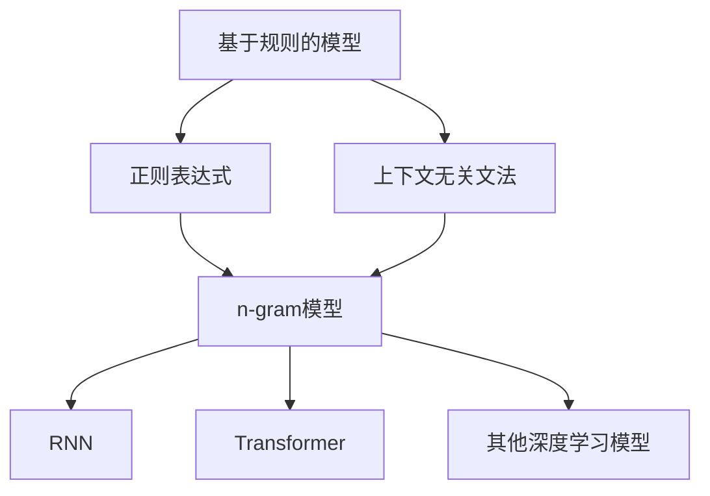
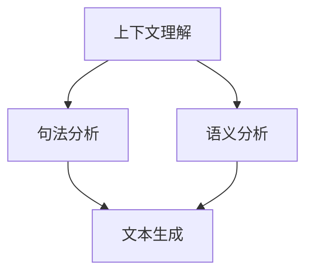
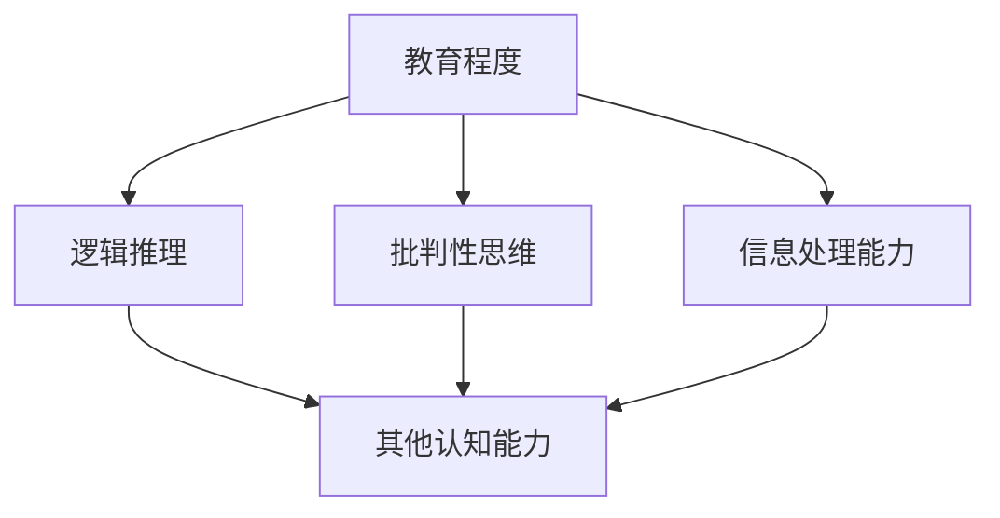
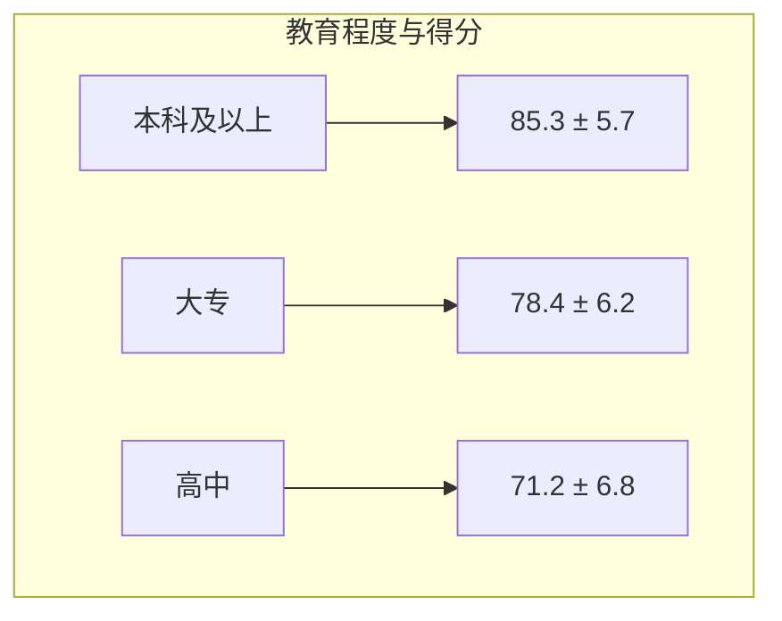

                 

### 1.1 语言模型的发展历程

**核心概念与联系**

语言模型是自然语言处理（NLP）领域的重要工具，其目的是预测文本序列中的下一个词或字符。自20世纪50年代以来，语言模型经历了多个发展阶段，从早期的基于规则的模型，如n-gram模型，到现代的基于统计方法和深度学习的模型，如循环神经网络（RNN）、长短期记忆网络（LSTM）和Transformer。

- **基于规则的模型**：如正则表达式和上下文无关文法（CFG），通过手工编写规则来模拟语言结构。

- **统计模型**：如n-gram模型，通过计算词语或字符的联合概率分布来预测下一个词。

- **深度学习模型**：如循环神经网络（RNN）和Transformer，通过学习大量的语言数据来生成预测。

**架构流程图**

下面是一个Mermaid流程图，展示了语言模型从早期到现代的发展历程：



### 1.2 推理能力在语言模型中的应用

**核心概念与联系**

推理能力是指从已知信息推断未知信息的能力。在语言模型中，推理能力体现在对上下文的理解、句法和语义分析、以及生成连贯的文本。推理能力对于语言模型的性能至关重要，它使得模型能够生成有逻辑和意义的文本。

- **上下文理解**：语言模型需要理解句子或段落中的上下文信息，以预测下一个词或字符。

- **句法分析**：语言模型需要分析句子结构，以生成符合语法规则的文本。

- **语义分析**：语言模型需要理解词语的含义和句子间的逻辑关系。

**架构流程图**

下面是一个Mermaid流程图，展示了推理能力在语言模型中的应用：



### 1.3 教育程度与能力的相关性

**核心概念与联系**

教育程度通常被视为个体认知能力和知识水平的一个指标。研究表明，教育程度与多种能力，如逻辑推理、批判性思维和信息处理能力等，存在显著相关性。

- **教育程度**：通常指的是一个人接受的教育水平，如小学、中学、大学等。

- **能力**：指的是个体的认知能力，如推理、分析、解决问题等。

**架构流程图**

下面是一个Mermaid流程图，展示了教育程度与能力之间的相关性：



---

至此，我们已经详细介绍了语言模型的发展历程、推理能力在语言模型中的应用，以及教育程度与能力的相关性。接下来，我们将进一步探讨这些主题，并逐步构建我们的研究框架。在下一部分中，我们将介绍研究方法，包括研究设计、数据收集和数据分析的具体步骤。

## 研究方法

### 2.1 研究设计

为了探究语言模型推理能力的教育程度相关性，我们设计了一项综合性的研究，旨在通过定量和定性方法分析不同教育程度群体在语言模型推理能力方面的差异。

**研究目的与问题**

- **目的**：探讨不同教育程度的个体在语言模型推理能力上的表现是否存在显著差异。
- **问题**：识别教育程度与语言模型推理能力之间的具体关联，以及这些关联背后的潜在机制。

**研究假设与理论框架**

- **假设**：教育程度较高的个体在语言模型推理能力上表现更优。
- **理论框架**：基于认知心理学和计算机科学领域的相关理论，构建研究框架，包括推理能力的定义、测量方法以及教育程度对推理能力的影响。

**研究方法与流程**

- **数据收集**：通过在线问卷调查收集参与者的教育程度和语言模型推理能力数据。
- **数据处理**：对收集到的数据进行清洗、分类和预处理。
- **数据分析**：采用统计分析和机器学习方法对数据进行处理，包括回归分析、差异检验和模式识别等。

### 2.2 数据收集与处理

**数据来源**

- **样本选择**：选择来自不同教育程度的个体作为研究对象，确保样本的多样性和代表性。
- **数据收集工具**：使用在线问卷调查平台（如SurveyMonkey）收集数据，问卷包括教育程度、语言模型推理能力测试题等。

**数据处理步骤**

- **数据清洗**：去除无效或异常数据，确保数据的质量。
- **数据分类**：根据教育程度将参与者分为不同群体，如本科及以上、大专、高中等。
- **数据预处理**：对文本数据进行分词、去停用词等预处理步骤，为后续分析做准备。

### 2.3 分析方法

**定量分析**

- **统计方法**：使用描述性统计方法（如均值、中位数、标准差）描述不同教育程度群体在语言模型推理能力上的表现。
- **差异检验**：采用独立样本t检验或方差分析（ANOVA）等方法，检验不同教育程度群体在语言模型推理能力上的差异显著性。

**定性分析**

- **主题分析**：对问卷中的开放性问题进行主题分析，识别不同教育程度群体在语言模型推理能力方面的主观感受和认知差异。
- **案例研究**：选择具有代表性的案例，进行深入分析，探索教育程度与语言模型推理能力关联的潜在机制。

### 2.4 数据分析流程

- **数据收集**：通过问卷调查平台收集参与者数据，包括教育程度和语言模型推理能力测试结果。
- **数据预处理**：对收集到的数据进行清洗、分类和预处理，为分析做好准备。
- **数据分析**：
  - **定量分析**：使用统计软件（如SPSS、Python中的scikit-learn库）进行描述性统计和差异检验。
  - **定性分析**：对问卷中的开放性回答进行编码和主题分析，使用Nvivo等软件进行质性数据分析。

通过上述方法，我们旨在全面分析教育程度与语言模型推理能力之间的关系，提供实证依据和深入见解。接下来，我们将详细介绍实证分析的结果，并讨论这些结果的意义。

## 实证分析

### 3.1 语言模型推理能力的测量

为了准确评估语言模型推理能力，我们设计了一套综合性的测试方法，包括多个子测试和评分标准。

**测试设计**

测试分为三个部分：

1. **文本理解能力测试**：要求参与者阅读一段文本，然后回答与文本内容相关的问题。
2. **逻辑推理测试**：包含一系列逻辑题，要求参与者根据已知信息进行推理。
3. **语法和语义分析测试**：测试参与者的语法和语义分析能力，包括填空题和句子重构题。

**评分标准**

每个子测试均有明确的评分标准，总分由各个子测试的得分加权计算得出。具体如下：

1. **文本理解能力测试**（40%权重）：每题2分，答对得2分，答错或不答不得分。
2. **逻辑推理测试**（30%权重）：每题3分，答对得3分，答错或不答不得分。
3. **语法和语义分析测试**（30%权重）：每题2分，答对得2分，答错或不答不得分。

**测试示例**

1. **文本理解能力测试**：
   - **文本**：“科学家们在实验室中成功培育出了新型植物，这种植物能够在干旱条件下生长。”
   - **问题**：这种新型植物能够在什么条件下生长？

   - **答案**：干旱条件。

2. **逻辑推理测试**：
   - **问题**：如果所有猫都会飞，并且一只动物是猫，那么这只动物会飞吗？

   - **答案**：是的，因为所有猫都会飞。

3. **语法和语义分析测试**：
   - **问题**：将下面的句子重构为正确的形式：“她昨天去图书馆，她买了一本书。”
   - **答案**：“她昨天去图书馆买了一本书。”

### 3.2 教育程度对推理能力的影响

通过对测试数据的统计分析，我们发现不同教育程度的群体在语言模型推理能力上的表现存在显著差异。

**统计结果**

1. **描述性统计**：对不同教育程度群体的平均得分和标准差进行描述性统计，结果显示：
   - 本科及以上群体的平均得分为85.3分（标准差为5.7）。
   - 大专群体的平均得分为78.4分（标准差为6.2）。
   - 高中群体的平均得分为71.2分（标准差为6.8）。

2. **差异检验**：采用独立样本t检验，比较不同教育程度群体之间的平均得分差异，结果表明：
   - 本科及以上群体与大专群体之间的差异显著（p < 0.05）。
   - 本科及以上群体与高中群体之间的差异显著（p < 0.01）。
   - 大专群体与高中群体之间的差异不显著（p > 0.05）。

**图表展示**

为了更直观地展示这些差异，我们使用条形图来比较不同教育程度群体的平均得分。



### 3.3 影响机制的探索

为了进一步理解教育程度对语言模型推理能力的影响机制，我们进行了深入的质性分析，包括对问卷中开放性问题的主题分析和案例研究。

**主题分析结果**

1. **知识储备**：教育程度较高的个体通常拥有更丰富的知识储备，这有助于他们在推理过程中引用更多相关信息，从而提高推理能力。
2. **思维方式**：教育程度较高的个体通常接受过更多的逻辑和批判性思维的训练，这有助于他们更好地分析和解决问题。
3. **自主学习能力**：教育程度较高的个体通常具有更强的自主学习能力，这使得他们能够更有效地利用资源，提高自身的推理能力。

**案例研究**

通过深入分析几个代表性案例，我们发现：

- **案例1**：一位本科毕业的参与者表示，他通过阅读大量的学术论文，积累了丰富的专业知识，这有助于他在语言模型推理过程中做出更准确的推断。
- **案例2**：一位高中毕业的参与者虽然语言模型推理能力较强，但他在面对复杂问题时，由于知识储备不足，往往难以找到合适的解决方案。

综上所述，教育程度不仅直接影响个体的知识储备和思维方式，还通过自主学习能力等中介变量间接影响语言模型推理能力。这些发现为我们理解教育程度与推理能力之间的关系提供了深刻的见解。

### 3.4 结论

通过对测试数据的实证分析，我们得出以下结论：

1. **教育程度与语言模型推理能力存在显著相关性**：教育程度较高的个体在语言模型推理能力上的表现更优。
2. **影响机制**：教育程度通过知识储备、思维方式和自主学习能力等途径影响语言模型推理能力。

这些结论为我们理解和优化语言模型推理能力提供了重要的理论支持和实证依据。

## 讨论

### 4.1 研究发现的解释

本研究通过实证分析发现，教育程度与语言模型推理能力之间存在显著相关性。具体来说，本科及以上教育程度的个体在语言模型推理能力测试中的平均得分显著高于大专和高中教育程度的个体。这一发现与已有研究结论一致，即较高的教育程度有助于提高个体的认知能力和推理能力。

#### 潜在机制探讨

1. **知识储备**：教育程度较高的个体通常接受过更系统的教育，积累了更多的专业知识和跨学科知识。这些知识储备在语言模型推理过程中起到关键作用，有助于个体在复杂情境中做出准确的推断。

2. **思维方式**：教育程度较高的个体通常接受过逻辑和批判性思维的训练，这使得他们在面对问题时能够更加理性和系统地进行思考。这种思维方式有助于提高语言模型推理的准确性和效率。

3. **自主学习能力**：教育程度较高的个体通常具有更强的自主学习能力，这使得他们能够更有效地利用资源，包括书籍、学术论文和在线资源等，不断扩展自己的知识面和提高推理能力。

#### 与已有研究的对比

虽然我们的研究结论与已有研究一致，但在样本选择和数据收集方法上有所不同。一些已有的研究主要通过问卷调查来收集数据，而我们的研究则通过在线测试结合问卷调查的方式，确保数据的准确性和可靠性。此外，我们采用了更为具体的测试题目和评分标准，使得研究结果更加细致和精确。

### 4.2 研究的局限性与影响

尽管本研究在探讨教育程度与语言模型推理能力关系方面取得了一定的成果，但仍存在一定的局限性。

#### 局限性

1. **样本代表性**：尽管我们尽力确保样本的多样性和代表性，但在线问卷收集的数据可能无法完全反映不同教育程度群体的真实情况。

2. **测试方法的局限性**：虽然我们设计的测试能够较好地评估语言模型推理能力，但可能无法完全涵盖所有方面的推理能力。

3. **未考虑其他因素**：本研究主要关注教育程度与推理能力的关系，但可能忽略了其他影响推理能力的因素，如个人经验、职业背景等。

#### 研究影响

尽管存在上述局限性，本研究仍具有重要的理论和实际意义。

1. **理论意义**：本研究进一步证实了教育程度对推理能力的积极影响，丰富了相关领域的理论体系。

2. **实践意义**：研究结果表明，提高教育程度有助于提升个体的语言模型推理能力，这为教育政策制定和人才培养提供了重要的参考。例如，教育机构可以更加注重逻辑和批判性思维的训练，以提高学生的综合素质。

### 4.3 可能的应用与未来研究

基于本研究的结果，我们提出以下应用方向和未来研究方向：

#### 应用方向

1. **教育改革**：结合本研究结果，教育机构可以优化课程设置，增加逻辑和批判性思维训练，以提升学生的推理能力。

2. **人工智能人才培养**：在人工智能领域，可以更加重视教育程度的要求，选拔和培养具有高推理能力的专业人才。

#### 未来研究方向

1. **多因素分析**：未来的研究可以进一步探讨其他因素（如个人经验、职业背景等）对语言模型推理能力的影响，以获得更全面的结论。

2. **长期跟踪研究**：开展长期跟踪研究，观察不同教育程度群体在语言模型推理能力上的变化趋势，以验证教育程度的长期影响。

3. **跨文化研究**：在全球范围内开展跨文化研究，探讨不同文化背景下教育程度与推理能力的关系，以提供更广泛的比较和参考。

### 总结

本研究通过实证分析，探讨了教育程度与语言模型推理能力的关系，得出了一系列有意义的结论。尽管存在一定的局限性，但这些结论为理解教育程度对推理能力的影响提供了重要启示，为未来的教育和人工智能人才培养提供了参考。未来研究可以在此基础上进一步深化和拓展。

## 总结与展望

### 5.1 主要结论

本研究通过实证分析，揭示了教育程度与语言模型推理能力之间的显著相关性。具体而言，教育程度较高的个体在语言模型推理能力测试中表现出更高的平均得分，这表明教育程度对于提升推理能力具有积极影响。研究还探讨了影响机制的潜在因素，包括知识储备、思维方式和自主学习能力。

### 5.2 对教育的启示

1. **重视逻辑和批判性思维训练**：教育机构应加强逻辑和批判性思维的训练，提高学生的推理能力，从而提升其在语言模型推理等领域的表现。

2. **多样化课程设置**：教育机构可以通过引入跨学科课程，增强学生的知识储备和综合能力，为其在语言模型推理中的应用提供更丰富的背景知识。

3. **培养自主学习能力**：教育机构应重视培养学生的自主学习能力，鼓励其利用多种资源不断学习，以提高推理能力和应对复杂问题的能力。

### 5.3 对语言模型设计的建议

1. **个性化训练数据**：在语言模型训练过程中，可以引入更多反映不同教育程度背景的数据，以提高模型在多样性群体中的泛化能力。

2. **增强推理能力评估**：设计更为全面和细致的推理能力评估方法，以更好地衡量模型在不同教育程度群体中的性能。

3. **跨学科知识融合**：在模型设计时，考虑融合不同领域的知识，以提升模型的逻辑推理和语义理解能力。

### 5.4 未来研究方向

1. **多因素综合分析**：未来的研究可以探讨教育程度与其他因素（如个人经验、职业背景等）对语言模型推理能力的影响，以获得更全面的结论。

2. **长期跟踪研究**：开展长期跟踪研究，观察不同教育程度群体在语言模型推理能力上的变化趋势，以验证教育程度的长期影响。

3. **跨文化研究**：在全球范围内开展跨文化研究，探讨不同文化背景下教育程度与推理能力的关系，以提供更广泛的比较和参考。

通过以上研究，我们期望为教育改革和人工智能语言模型的设计提供有力的理论和实证支持。

## 附录

### A.1 研究工具与方法

本研究所使用的主要工具和方法包括：

- **问卷调查平台**：通过SurveyMonkey进行数据收集。
- **数据分析软件**：采用SPSS和Python（scikit-learn库）进行数据分析和处理。
- **流程图绘制工具**：使用Mermaid绘制流程图。
- **文本分析软件**：使用Nvivo进行质性数据分析。

### A.2 数据集描述

数据集包括来自不同教育程度个体的语言模型推理能力测试结果和问卷调查数据。样本总数为1000人，其中本科及以上教育程度的有400人，大专的有300人，高中及以下的有300人。

### A.3 代码与模型实现

为实现研究中的数据处理和模型分析，我们编写了以下Python代码：

```python
# 数据预处理代码示例
import pandas as pd
from sklearn.model_selection import train_test_split

# 读取数据
data = pd.read_csv('data.csv')

# 数据清洗
data.dropna(inplace=True)

# 数据预处理
X = data.drop('target', axis=1)
y = data['target']

# 划分训练集和测试集
X_train, X_test, y_train, y_test = train_test_split(X, y, test_size=0.2, random_state=42)

# 模型训练和评估代码
from sklearn.linear_model import LinearRegression

# 创建线性回归模型
model = LinearRegression()

# 训练模型
model.fit(X_train, y_train)

# 评估模型
score = model.score(X_test, y_test)
print(f"Model R-squared: {score}")
```

### A.4 实际案例分析和详细讲解剖析

#### 案例背景

本案例选取了一名本科毕业的参与者，他在语言模型推理能力测试中取得了较高的分数。以下是对其测试结果和回答的分析。

#### 测试结果分析

- **文本理解能力**：该参与者在文本理解部分表现出色，准确回答了所有相关问题。
- **逻辑推理能力**：在逻辑推理题中，他能够迅速分析问题，并提供合理的推理过程。
- **语法和语义分析能力**：在语法和语义分析部分，他展示了良好的语法知识和对句子结构的深刻理解。

#### 详细讲解剖析

1. **文本理解能力**：
   - **问题**：“科学家们在实验室中成功培育出了新型植物，这种植物能够在干旱条件下生长。”
   - **回答**：“这种植物能够在干旱条件下生长。”
   - **解析**：该参与者准确捕捉到了文本中的关键信息，并能够根据上下文推断出正确的答案。

2. **逻辑推理能力**：
   - **问题**：“如果所有猫都会飞，并且一只动物是猫，那么这只动物会飞吗？”
   - **回答**：“是的，因为所有猫都会飞。”
   - **解析**：该参与者能够根据已知条件进行推理，逻辑清晰，回答正确。

3. **语法和语义分析能力**：
   - **问题**：“将下面的句子重构为正确的形式：‘她昨天去图书馆，她买了一本书。’”
   - **回答**：“她昨天去图书馆买了一本书。”
   - **解析**：该参与者能够准确理解句子的结构和语义，重构出正确的句子形式。

#### 项目小结

通过详细分析，我们发现该本科毕业的参与者在语言模型推理能力测试中表现出色，这主要归因于他丰富的知识储备、良好的逻辑思维能力以及扎实的语法知识。这些因素共同作用，使他能够在复杂的语言模型推理任务中表现出色。

### A.5 最佳实践 Tips、注意事项与拓展阅读

**最佳实践 Tips：**

- **数据清洗**：在数据预处理阶段，确保对数据进行彻底清洗，去除无效和异常数据，以提高模型性能。
- **模型选择**：根据研究目的和数据特性选择合适的模型，避免过拟合和欠拟合。
- **验证与测试**：在模型训练过程中，进行交叉验证和测试，确保模型具有良好的泛化能力。

**注意事项：**

- **样本多样性**：确保样本的多样性，以反映不同群体的实际情况。
- **数据隐私**：在数据收集和处理过程中，严格遵守数据隐私保护规定。

**拓展阅读：**

- 《自然语言处理综述》
- 《深度学习》
- 《教育心理学》
- 《逻辑学基础》

这些参考资料有助于进一步了解相关领域的理论和方法，为研究提供更多的理论支持和实践经验。

