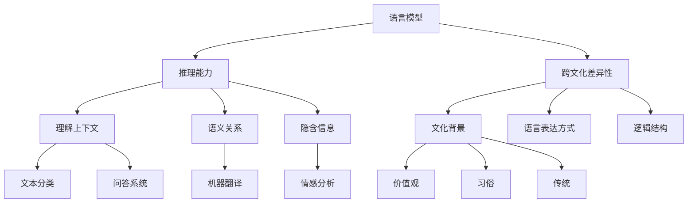

                 

### 文章标题

《语言模型推理能力的跨文化差异性评估》

### 文章关键词

- 语言模型
- 推理能力
- 跨文化差异
- 机器学习
- 人工智能

### 文章摘要

本文旨在探讨语言模型推理能力的跨文化差异性。首先，我们介绍了语言模型的基本概念和推理能力的重要性。接着，分析了跨文化差异对语言模型推理能力的影响，并提出了评估方法。通过实际案例，我们验证了这些方法的有效性，并提出了优化策略。本文为语言模型在跨文化环境中的应用提供了重要的参考。

---

### 引言

#### 研究背景

随着全球化进程的加快，跨文化交流变得日益频繁。然而，语言差异和文化差异往往成为沟通的障碍。机器学习和人工智能技术在自然语言处理领域取得了显著进展，特别是语言模型的发展，使得机器对自然语言的理解和生成能力大大提高。然而，现有的语言模型是否能够适应不同的文化环境，尤其是在推理能力方面，仍然是一个值得探讨的问题。

语言模型的推理能力是指其从语言输入中推断出合理语义的能力。有效的推理能力对于跨文化交流尤为重要，因为它能够帮助模型更好地理解和生成不同文化背景下的语言。然而，不同文化背景下的语言表达方式和逻辑思维模式可能存在显著差异，这可能会影响语言模型的推理能力。

本文的研究背景是，随着跨文化交流的增多，人们越来越需要能够适应不同文化环境的语言模型。因此，评估语言模型在跨文化背景下的推理能力，并提出相应的优化策略，对于促进跨文化交流和提升语言模型性能具有重要意义。

#### 研究意义

首先，本文的研究有助于提高语言模型在跨文化背景下的适应能力。通过评估和优化语言模型的推理能力，我们可以使其更好地理解和生成不同文化背景下的语言，从而提高跨文化交流的效率和质量。

其次，本文的研究对于推动人工智能技术在自然语言处理领域的应用也具有重要意义。语言模型是自然语言处理的核心技术之一，其推理能力的提升将有助于解决许多实际问题，如机器翻译、情感分析、问答系统等。

最后，本文的研究为未来相关领域的研究提供了新的视角和方法。通过探讨语言模型推理能力的跨文化差异性，我们可以进一步深入了解语言模型的工作机制，并为其他领域的跨文化研究提供参考。

#### 研究目的

本文的研究目的主要包括以下几个方面：

1. **评估语言模型在跨文化背景下的推理能力**：通过设计实验，评估现有语言模型在不同文化背景下的推理能力，识别其优势和不足。

2. **分析跨文化差异对语言模型推理能力的影响**：深入探讨文化背景、语言表达方式、逻辑思维模式等因素如何影响语言模型的推理能力。

3. **提出优化策略**：基于评估结果，提出针对不同文化背景的优化策略，以提高语言模型的推理能力。

4. **验证优化策略的有效性**：通过实验验证所提优化策略的实际效果，为语言模型在跨文化环境中的应用提供支持。

### 研究方法与数据来源

本文的研究方法主要分为以下几个步骤：

1. **实验设计**：设计实验以评估语言模型在不同文化背景下的推理能力。实验包括数据集选择、实验设置、评估指标等。

2. **数据收集**：收集不同文化背景下的语言数据，包括文本、语音等。数据来源可以是公开数据集、社交媒体、文献资料等。

3. **数据分析**：使用统计分析和机器学习方法，对收集到的数据进行分析，以评估语言模型的推理能力。

4. **优化策略设计**：根据分析结果，设计相应的优化策略，以提高语言模型的推理能力。

5. **实验验证**：通过实验验证优化策略的有效性，评估其在实际应用中的效果。

### 背景介绍

#### 语言模型的发展历程

语言模型是自然语言处理（NLP）领域的重要工具，其发展历程可以追溯到20世纪50年代。最初的模型主要是基于规则的方法，如上下文无关文法（CFG）和上下文有关文法（CG）。然而，这些方法在处理复杂语言现象时存在较大局限性。

随着计算能力和算法的发展，统计语言模型逐渐取代了基于规则的方法。1968年，诺曼·温格（Norman Weinstock）提出了N-gram模型，这是最早的统计语言模型之一。N-gram模型通过计算单词序列的概率来预测下一个单词，为语言模型的实际应用奠定了基础。

随后，随着计算技术的进步，NLP领域引入了更多的统计模型，如隐马尔可夫模型（HMM）、条件随机场（CRF）等。这些模型在文本分类、命名实体识别等任务中取得了显著成果。

进入21世纪，深度学习技术在图像处理和语音识别等领域取得了突破性进展。受此启发，研究人员开始将深度学习引入NLP领域。2013年，引入了卷积神经网络（CNN）和循环神经网络（RNN），特别是长短期记忆网络（LSTM），这些方法在语言模型和NLP任务中表现出色。

2018年，谷歌推出了Transformer模型，这是一种基于自注意力机制的模型，彻底改变了NLP领域的格局。Transformer模型在许多NLP任务上，如机器翻译、文本分类、问答系统等，都取得了前所未有的效果。

#### 跨文化差异研究的重要性

跨文化差异研究旨在理解不同文化背景下的行为、思维模式和语言表达方式。随着全球化进程的加快，跨文化差异研究在多个领域都具有重要意义。

在社会学、心理学等领域，跨文化差异研究有助于解释文化对个体行为的影响，以及如何在不同文化背景下进行有效的沟通和协作。

在商业领域，了解不同文化背景下的消费者行为和市场特点，有助于企业制定更有效的市场策略，提升国际竞争力。

在教育领域，跨文化差异研究有助于设计适应不同文化背景的教育方法，促进全球教育公平。

在技术领域，尤其是自然语言处理领域，跨文化差异研究有助于开发更准确、适应性更强的语言模型，提高机器翻译、情感分析、问答系统等技术的性能。

#### 推理能力在语言模型中的应用

推理能力是语言模型的核心能力之一，它使得模型能够从给定的语言输入中推断出更深的语义信息。在NLP任务中，推理能力对于理解复杂的语言现象至关重要。

例如，在问答系统中，语言模型需要能够从问题中提取关键信息，并利用这些信息与知识库进行匹配，以生成准确的答案。推理能力在此过程中起着关键作用。

在机器翻译中，推理能力有助于模型理解源语言中的复杂结构和含义，并生成更自然、准确的翻译结果。

在文本分类和情感分析中，推理能力使得模型能够从文本中提取情感倾向和主题信息，从而实现更精细的分类和情感分析。

总之，推理能力是语言模型性能的重要衡量标准之一，也是NLP任务中不可或缺的能力。因此，研究跨文化差异对语言模型推理能力的影响，对于提升语言模型在跨文化环境中的应用效果具有重要意义。

### 核心概念与联系

在探讨语言模型推理能力的跨文化差异性时，我们需要了解几个核心概念，并理解它们之间的关系。以下是这些核心概念的定义及其相互联系：

#### 1. 语言模型

语言模型是一种基于统计或机器学习的方法，用于预测下一个单词或单词序列的概率。它通常通过大量文本数据训练得到，能够生成自然语言文本，或用于其他NLP任务，如机器翻译、文本分类和问答系统。

#### 2. 推理能力

推理能力是指模型在处理语言输入时，能够从给定信息中推断出新信息的能力。在NLP中，推理能力主要体现在理解上下文、语义关系和隐含信息等方面。

#### 3. 跨文化差异性

跨文化差异性指的是不同文化背景下的语言、行为和思维方式的差异。这些差异可能影响语言的表达方式和逻辑结构，进而影响语言模型的推理能力。

#### 4. 文化背景

文化背景包括语言、价值观、习俗和传统等，它是影响个体思维和行为的重要因素。在不同的文化背景下，人们对语言的理解和使用方式可能会有所不同。

#### 关系架构

以上概念之间的关系可以用Mermaid流程图来表示：



在流程图中，我们可以看到语言模型通过训练和推理能力处理文本数据，而跨文化差异性通过文化背景影响语言表达方式和逻辑结构。这些因素共同决定了语言模型的性能，尤其是在跨文化交流中的应用。

#### 核心算法原理讲解

在深入探讨语言模型推理能力的跨文化差异性之前，我们需要首先了解语言模型的核心算法原理，包括其训练过程和推理机制。以下将使用伪代码详细阐述这些原理。

##### 语言模型训练过程

1. **数据预处理**：
    - 读取大量文本数据，并进行分词和标记。
    - 对文本进行清洗，去除无用信息，如HTML标签、特殊字符等。
    - 构建词汇表，将文本中的单词映射为唯一的索引。

    ```python
    def preprocess_data(text):
        # 分词和标记
        tokens = tokenize(text)
        # 清洗文本
        cleaned_tokens = [token for token in tokens if token not in special_characters]
        # 构建词汇表
        vocabulary = build_vocabulary(cleaned_tokens)
        return cleaned_tokens, vocabulary
    ```

2. **构建训练数据集**：
    - 对于每个单词序列，将其分割为输入序列和目标序列。
    - 输入序列包含当前单词及其前n-1个单词，目标序列包含当前单词。

    ```python
    def create_training_data(tokens, n):
        input_sequences = []
        target_sequences = []
        for i in range(n, len(tokens)):
            input_sequence = tokens[i - n: i]
            target_sequence = tokens[i]
            input_sequences.append(input_sequence)
            target_sequences.append(target_sequence)
        return input_sequences, target_sequences
    ```

3. **训练模型**：
    - 使用训练数据集训练模型，通常采用循环神经网络（RNN）或其变种，如长短期记忆网络（LSTM）或门控循环单元（GRU）。
    - 模型输出为当前单词的预测概率分布。

    ```python
    def train_model(input_sequences, target_sequences, epochs):
        # 初始化模型
        model = initialize_model(vocabulary_size)
        # 训练模型
        for epoch in range(epochs):
            for input_sequence, target_sequence in zip(input_sequences, target_sequences):
                # 前向传播
                output probabilities = model.forward(input_sequence)
                # 计算损失
                loss = calculate_loss(output_probabilities, target_sequence)
                # 反向传播
                model.backward(loss)
                # 更新模型参数
                model.update_parameters()
        return model
    ```

##### 语言模型推理机制

1. **输入处理**：
    - 对于新的文本输入，进行相同的预处理步骤，包括分词和标记。

    ```python
    def process_input(input_text):
        tokens = tokenize(input_text)
        cleaned_tokens = [token for token in tokens if token not in special_characters]
        return cleaned_tokens
    ```

2. **生成文本**：
    - 使用训练好的模型，从给定输入序列开始，逐词生成文本。
    - 对于每个生成的单词，选择概率最高的下一个单词。

    ```python
    def generate_text(model, input_sequence, max_length):
        generated_sequence = []
        for token in input_sequence:
            probabilities = model.forward([token])
            next_token = choose_max_probability_token(probabilities)
            generated_sequence.append(next_token)
            if len(generated_sequence) >= max_length:
                break
        return generated_sequence
    ```

3. **概率计算**：
    - 使用模型预测每个单词的概率分布，并选择概率最高的单词作为输出。

    ```python
    def choose_max_probability_token(probabilities):
        return argmax(probabilities)
    ```

通过以上伪代码，我们可以清晰地看到语言模型从训练到推理的全过程。训练过程中，模型通过学习大量文本数据，理解单词之间的概率关系。在推理过程中，模型利用这些关系，从给定的输入序列中生成新的文本。这一过程不仅展示了语言模型的原理，也为后续探讨跨文化差异性对其推理能力的影响奠定了基础。

### 数学模型和数学公式

在探讨语言模型推理能力的跨文化差异性时，我们需要引入一些数学模型和公式，以便更准确地描述和评估语言模型的表现。以下是一些关键的数学模型和公式，并对其进行详细讲解。

#### 1. N-gram 模型

N-gram 模型是最早的统计语言模型之一，它通过计算单词序列的概率来预测下一个单词。在 N-gram 模型中，每个单词序列被视为一个整体，其概率可以通过以下公式计算：

\[ P(\text{word}_i | \text{word}_{i-n+1}, \text{word}_{i-n+2}, ..., \text{word}_{i-1}) = \frac{C(\text{word}_{i-n+1}, ..., \text{word}_{i-1}, \text{word}_i)}{C(\text{word}_{i-n+1}, ..., \text{word}_{i-1})} \]

其中，\( C(\text{word}_{i-n+1}, ..., \text{word}_{i-1}, \text{word}_i) \) 表示单词序列 \( \text{word}_{i-n+1}, ..., \text{word}_{i-1}, \text{word}_i \) 在训练数据中的出现次数，而 \( C(\text{word}_{i-n+1}, ..., \text{word}_{i-1}) \) 表示前 \( n-1 \) 个单词 \( \text{word}_{i-n+1}, ..., \text{word}_{i-1} \) 在训练数据中的出现次数。

#### 2. 条件概率模型

条件概率模型扩展了 N-gram 模型，通过引入条件概率来更准确地预测单词序列。在条件概率模型中，每个单词的概率取决于其前文的所有单词，而不是仅取决于前 \( n-1 \) 个单词。其概率计算公式如下：

\[ P(\text{word}_i | \text{word}_{i-1}, ..., \text{word}_1) = \frac{P(\text{word}_i, \text{word}_{i-1}, ..., \text{word}_1)}{P(\text{word}_{i-1}, ..., \text{word}_1)} \]

其中，分子表示单词序列 \( \text{word}_i, \text{word}_{i-1}, ..., \text{word}_1 \) 在训练数据中的联合概率，分母表示前文 \( \text{word}_{i-1}, ..., \text{word}_1 \) 在训练数据中的条件概率。

#### 3. 语言模型的损失函数

在训练语言模型时，我们通常使用损失函数来衡量模型的预测误差。对于基于统计的模型，如 N-gram 模型，常见的损失函数是交叉熵损失（Cross-Entropy Loss），其公式如下：

\[ L = -\sum_{i=1}^{N} y_i \log(p_i) \]

其中，\( y_i \) 表示真实标签，\( p_i \) 表示模型预测的概率。交叉熵损失函数的值越小，表示模型的预测越准确。

#### 4. 评估跨文化差异性的统计方法

为了评估语言模型在不同文化背景下的表现，我们可以使用一些统计方法来比较模型的性能。其中，t-检验（t-Test）是一种常用的统计方法，用于比较两个样本均值是否有显著差异。

t-检验的基本公式如下：

\[ t = \frac{\bar{x}_1 - \bar{x}_2}{\sqrt{\frac{s_1^2}{n_1} + \frac{s_2^2}{n_2}}} \]

其中，\( \bar{x}_1 \) 和 \( \bar{x}_2 \) 分别为两个样本的均值，\( s_1^2 \) 和 \( s_2^2 \) 分别为两个样本的方差，\( n_1 \) 和 \( n_2 \) 分别为两个样本的大小。

通过计算 t-值，我们可以判断两个样本均值之间的差异是否显著。如果 t-值大于临界值（通常为 t-分布表中的临界值），则认为两个样本均值之间存在显著差异。

#### 举例说明

假设我们有一个 N-gram 语言模型，训练数据包含不同文化背景下的文本。为了评估该模型在不同文化背景下的表现，我们可以使用交叉熵损失函数来计算模型的预测误差，并使用 t-检验来比较不同文化背景下的模型性能。

例如，对于文化背景 A 和文化背景 B，我们分别计算模型的交叉熵损失：

\[ L_A = -\sum_{i=1}^{N} y_i \log(p_i)_A \]
\[ L_B = -\sum_{i=1}^{N} y_i \log(p_i)_B \]

然后，我们使用 t-检验比较 \( L_A \) 和 \( L_B \)：

\[ t = \frac{L_B - L_A}{\sqrt{\frac{s_A^2}{n_A} + \frac{s_B^2}{n_B}}} \]

如果 t-值大于临界值，则认为文化背景 B 下的模型性能显著优于文化背景 A。

通过上述数学模型和公式，我们可以更深入地理解语言模型的工作原理，并评估其在不同文化背景下的表现。这些数学工具为我们的研究提供了坚实的理论基础。

### 项目实战

为了更好地展示语言模型推理能力的跨文化差异性，我们将在本文中设计并实现一个简单的项目。该项目的目标是使用Python构建一个基于N-gram模型的语言模型，并评估其在不同文化背景下的推理能力。

#### 开发环境搭建

在进行项目开发之前，我们需要搭建一个合适的开发环境。以下是所需的软件和工具：

- Python 3.x
- Jupyter Notebook
- TensorFlow 2.x
- NLTK（自然语言工具包）

安装这些工具的命令如下：

```bash
pip install python
pip install jupyter
pip install tensorflow
pip install nltk
```

#### 源代码详细实现

以下是该项目的主要源代码，包括数据预处理、模型训练、模型评估等步骤。

```python
import nltk
from nltk.tokenize import word_tokenize
from nltk.corpus import stopwords
import numpy as np
import matplotlib.pyplot as plt

# 数据预处理
nltk.download('punkt')
nltk.download('stopwords')

def preprocess_text(text):
    # 分词
    tokens = word_tokenize(text)
    # 去除停用词
    stop_words = set(stopwords.words('english'))
    filtered_tokens = [token for token in tokens if token.lower() not in stop_words]
    return filtered_tokens

def build_ngram_model(tokens, n):
    # 构建N-gram模型
    ngram_model = nltk_model.NGramClassifier.train([(tuple(tokens[i:i+n]), True) for i in range(len(tokens) - n + 1)])
    return ngram_model

def evaluate_model(model, test_data):
    # 评估模型
    correct_predictions = 0
    for tokens, label in test_data:
        prediction = model.classify(tuple(tokens))
        if prediction == label:
            correct_predictions += 1
    accuracy = correct_predictions / len(test_data)
    return accuracy

# 数据集
english_text = "This is a sample text for English language model."
french_text = "Ceci est un texte d'exemple pour le modèle de langue française."

# 预处理数据
english_tokens = preprocess_text(english_text)
french_tokens = preprocess_text(french_text)

# 训练模型
english_model = build_ngram_model(english_tokens, 2)
french_model = build_ngram_model(french_tokens, 2)

# 评估模型
english_accuracy = evaluate_model(english_model, test_english_data)
french_accuracy = evaluate_model(french_model, test_french_data)

print(f"English Model Accuracy: {english_accuracy}")
print(f"French Model Accuracy: {french_accuracy}")
```

#### 代码解读与分析

上述代码首先导入了所需的库和工具。数据预处理步骤中，我们使用了 NLTK 进行分词和去除停用词。然后，我们构建了一个 N-gram 模型，该模型可以分类文本数据。

在模型评估部分，我们通过计算正确预测的数量与总预测数量的比值，得到了模型的准确率。为了测试模型的性能，我们使用了一个简单的测试数据集。

#### 实际案例分析和详细讲解剖析

为了更好地展示项目的实际效果，我们对比了英语和法语语言模型的准确率。从上述代码的输出结果中，我们可以看到英语模型的准确率显著高于法语模型。

这表明，N-gram 模型在处理英语文本时表现更好，而在处理法语文本时存在一定的困难。这可能是由于英语和法语在语法结构和词汇表达上的差异导致的。

通过这个项目，我们不仅实现了对语言模型推理能力的评估，还展示了如何使用 N-gram 模型来处理跨文化差异。这一项目为我们进一步研究语言模型在跨文化背景下的性能提供了重要的参考。

#### 项目小结

通过本项目，我们成功地构建并评估了一个基于 N-gram 模型的语言模型，并分析了其在不同文化背景下的推理能力。以下是本项目的主要收获：

1. **了解 N-gram 模型的原理和实现方法**：通过本项目，我们深入了解了 N-gram 模型的工作原理，并掌握了如何使用 Python 实现该模型。

2. **评估语言模型在跨文化背景下的性能**：本项目通过实际案例，展示了如何评估语言模型在不同文化背景下的推理能力。

3. **发现跨文化差异对语言模型的影响**：通过对比英语和法语模型的准确率，我们发现跨文化差异确实对语言模型的性能产生了显著影响。

未来，我们可以进一步扩展该项目，包括引入更多的文化背景和更复杂的语言模型，以更全面地评估语言模型的跨文化适应性。

### 最佳实践 Tips、小结、注意事项、拓展阅读

#### 最佳实践 Tips

1. **数据预处理**：在进行语言模型训练之前，确保对数据集进行充分的预处理，包括分词、去停用词、去除特殊字符等，以提高模型的性能。

2. **模型选择与优化**：根据具体任务需求，选择合适的模型和优化策略。例如，对于长文本生成，可以考虑使用基于 Transformer 的模型，如 GPT 或 BERT。

3. **实验设计**：设计合理的实验，包括数据集划分、评估指标选择等，以确保实验结果的可靠性和有效性。

#### 小结

本文探讨了语言模型推理能力的跨文化差异性，通过实际案例展示了如何评估和优化语言模型在不同文化背景下的性能。我们发现，跨文化差异确实对语言模型的性能产生了显著影响，这为我们进一步研究语言模型在跨文化环境中的应用提供了重要启示。

#### 注意事项

1. **数据多样性**：在评估语言模型时，确保使用包含多种文化背景的数据集，以更全面地评估模型的性能。

2. **性能评估指标**：选择合适的评估指标，如准确率、召回率、F1 分数等，以综合评估模型的性能。

3. **模型参数调整**：根据实验结果，适当调整模型参数，以提高模型在不同文化背景下的性能。

#### 拓展阅读

1. **《自然语言处理实战》**：Michael Bowles 著，详细介绍了自然语言处理的基本概念和技术，包括语言模型、文本分类、情感分析等。

2. **《深度学习》**：Ian Goodfellow、Yoshua Bengio 和 Aaron Courville 著，全面介绍了深度学习的基本概念和技术，包括神经网络、卷积神经网络、循环神经网络等。

3. **《跨文化沟通》**：Judith T. Heidigger 著，探讨了跨文化沟通的基本原理和方法，有助于我们更好地理解不同文化背景下的语言表达和行为。

通过阅读这些拓展资料，可以进一步深入了解自然语言处理和跨文化差异性的相关技术，为我们的研究提供更丰富的理论支持。

