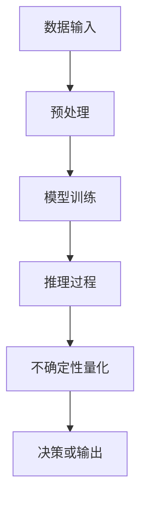

                 


### 摘要

本文旨在深入探讨语言模型推理过程中的不确定性量化问题。随着深度学习在自然语言处理领域的广泛应用，语言模型已展现出强大的性能。然而，推理过程中存在的不确定性成为了一个亟待解决的问题。本文首先介绍了语言模型的基本概念和推理过程，然后重点分析了不确定性量化的方法及其重要性。通过实例和数学模型，本文详细阐述了如何在实际项目中量化推理过程中的不确定性，并提出了一些最佳实践建议，以期为后续研究和应用提供参考。

### 引言

#### 研究背景

语言模型是自然语言处理（NLP）领域的基石，其目标是通过统计或机器学习的方法，预测文本中的下一个单词或字符。自上世纪50年代起，语言模型经历了从规则驱动模型到统计模型，再到现代深度学习模型的演变。随着计算能力的提升和数据的爆炸式增长，深度学习语言模型如BERT、GPT等取得了显著的性能提升，使得机器在文本生成、机器翻译、问答系统等任务中取得了突破性进展。

然而，在实际应用中，语言模型的推理过程并非完美无瑕。推理过程中存在的不确定性往往会影响模型的输出质量，甚至可能导致错误的结果。例如，在文本生成任务中，语言模型可能会生成意义模糊或不相关的句子；在机器翻译中，模型可能会翻译出语法错误或意义偏离的句子。这些不确定性来源于多种因素，包括模型本身的复杂度、训练数据的偏差、推理过程中的随机性等。

#### 推理在自然语言处理中的应用

推理在自然语言处理中扮演着关键角色。从简单的文本分类到复杂的对话生成，推理过程都是不可或缺的一环。文本分类任务中，模型需要根据输入的文本内容判断其类别；在问答系统中，模型需要理解问题的意图并从大量文本中检索出相关答案。在这些任务中，推理过程不仅依赖于模型对输入数据的理解，还需要对输出结果进行判断和验证。

#### 不确定性量化的重要性

不确定性量化在语言模型推理中具有重要意义。通过量化不确定性，我们可以更好地理解模型的行为，从而优化模型的性能和可靠性。以下是一些关键点：

1. **性能优化**：通过识别和量化推理过程中的不确定性，可以设计更有效的优化算法，提高模型在特定任务中的表现。
2. **错误检测**：量化不确定性可以帮助我们识别潜在的错误输出，从而提高系统的鲁棒性。
3. **决策支持**：在需要决策支持的场景中，如自动问答系统或自动驾驶，了解不确定性可以帮助做出更明智的决策。
4. **用户信任**：明确的不确定性量化有助于增强用户对系统的信任，从而提升用户体验。

#### 当前研究的局限性和挑战

尽管不确定性量化在语言模型推理中具有重要意义，但当前的研究仍面临一些挑战和局限性。首先，语言模型的复杂度使得直接量化推理过程中的不确定性变得困难。其次，不同任务和场景下不确定性量化方法的适用性存在差异，缺乏系统的研究和评估。此外，现有方法在计算效率和可解释性方面也存在一定的局限性。

#### 研究目标

本文的研究目标包括：

1. **明确语言模型推理中的不确定性来源**：通过分析模型结构、训练数据和推理过程，识别影响不确定性的关键因素。
2. **系统研究不确定性量化方法**：介绍和比较现有方法，探索其在不同任务和场景中的适用性。
3. **探索不确定性量化在实际应用中的效果**：通过实际案例，验证不确定性量化方法在提高模型性能、错误检测和决策支持方面的效果。

### 第一部分 核心概念与联系

#### 2.1 语言模型概述

语言模型是自然语言处理的核心工具，其目标是预测文本中的下一个单词或字符。语言模型可以分为统计模型和深度学习模型两大类。

**统计模型**：早期的语言模型如N-gram模型、决策树、朴素贝叶斯等，主要通过统计文本中的词频或词的关系来预测下一个词。这些模型简单但效果有限，难以处理长文本和复杂的语言结构。

**深度学习模型**：随着深度学习技术的发展，如循环神经网络（RNN）、长短期记忆网络（LSTM）、Transformer等深度学习模型逐渐成为主流。这些模型能够捕捉长距离依赖关系，显著提升了语言模型的性能。

**语言模型的结构**：深度学习语言模型通常包含输入层、编码器、解码器和输出层。输入层接收文本序列，编码器将文本编码为固定长度的向量表示，解码器根据编码器的输出生成文本序列。Transformer模型引入了多头自注意力机制，使模型能够同时关注文本序列中的不同位置信息，进一步提升了模型的表现。

#### 2.2 推理过程解析

语言模型的推理过程包括以下几个步骤：

1. **文本预处理**：将输入文本转换为模型能够处理的格式，如分词、编码等。
2. **编码**：将预处理后的文本输入编码器，编码器将文本序列编码为固定长度的向量表示。
3. **推理**：解码器根据编码器的输出逐步生成文本序列。在生成过程中，解码器会根据当前的上下文信息，通过自注意力机制和交叉注意力机制，综合考虑前文和当前输入的信息，生成下一个单词或字符。
4. **输出**：完成文本序列生成后，模型输出预测结果。

#### 2.3 不确定性量化方法

不确定性量化是语言模型推理中的一个重要环节。以下是几种常见的不确定性量化方法：

1. **基于概率的量化方法**：通过计算模型对每个可能输出的概率分布来量化不确定性。这种方法直观且易于理解，但受限于模型的复杂度和计算资源。
2. **基于置信区间的量化方法**：通过计算模型输出的置信区间来量化不确定性。这种方法能够提供更详细的不确定性信息，但计算复杂度较高。
3. **基于熵的量化方法**：通过计算模型输出的熵来量化不确定性。熵值越高，表示不确定性越大。
4. **基于熵的量化方法**：通过计算模型输出的熵来量化不确定性。熵值越高，表示不确定性越大。

#### 2.4 Mermaid流程图

以下是一个Mermaid流程图，展示语言模型从训练到推理的整个流程，并突出不确定性量化的关键步骤：



### 第二部分 核心算法原理讲解

#### 3.1 注意力机制

注意力机制是深度学习语言模型中的一个关键组件，它能够使模型在生成文本时更关注重要的信息。以下是注意力机制的原理和实现：

**原理**：

注意力机制通过计算当前输入与历史输入之间的相关性，为每个历史输入分配不同的权重。权重越高，表示当前输入对历史输入的影响越大。

**实现**：

注意力机制通常通过以下步骤实现：

1. **计算相似度**：将当前输入和所有历史输入通过线性变换（如矩阵乘法）生成相似度矩阵。
2. **计算权重**：对相似度矩阵进行归一化，生成权重矩阵。
3. **加权求和**：将权重矩阵与历史输入进行加权求和，生成当前输入的上下文表示。

**伪代码**：

```python
# 输入：当前输入 x_t，历史输入序列 {x_1, x_2, ..., x_{t-1}}
# 输出：当前上下文表示 c_t

# 步骤1：计算相似度
similarity_matrix = dot(x_t, transpose([x_1, x_2, ..., x_{t-1}]))

# 步骤2：计算权重
weight_matrix = softmax(similarity_matrix)

# 步骤3：加权求和
c_t = dot(weight_matrix, [x_1, x_2, ..., x_{t-1}])
```

#### 3.2 序列生成算法

序列生成算法是语言模型推理的核心，它负责根据编码器的输出生成文本序列。以下是几种常见的序列生成算法：

**贪婪算法**：

贪婪算法是一种简单但效果较好的序列生成算法。在每一步，算法选择当前概率最高的输出作为下一步的输入。

**伪代码**：

```python
# 输入：编码器输出序列 {x_1, x_2, ..., x_T}
# 输出：生成文本序列 {y_1, y_2, ..., y_T}

# 初始化：y_1 = argmax(P(y_1 | x_1))
# 对于 t = 2, 3, ..., T：
#     y_t = argmax(P(y_t | y_{1:t-1}, x_t))
```

**采样算法**：

采样算法通过从概率分布中采样来生成文本序列。这种方法能够产生更加多样化和有趣的输出，但计算复杂度较高。

**伪代码**：

```python
# 输入：编码器输出序列 {x_1, x_2, ..., x_T}
# 输出：生成文本序列 {y_1, y_2, ..., y_T}

# 初始化：y_1 = sample(P(y_1 | x_1))
# 对于 t = 2, 3, ..., T：
#     y_t = sample(P(y_t | y_{1:t-1}, x_t))
```

#### 3.3 自注意力机制

自注意力机制是Transformer模型的核心组件，它使模型能够同时关注文本序列中的不同位置信息。以下是自注意力机制的原理和实现：

**原理**：

自注意力机制通过计算文本序列中每个位置与其他位置的相似度，为每个位置分配不同的权重。权重越高，表示该位置对整体序列的影响越大。

**实现**：

自注意力机制通常通过以下步骤实现：

1. **计算相似度**：将每个位置与其他位置的输入通过线性变换生成相似度矩阵。
2. **计算权重**：对相似度矩阵进行归一化，生成权重矩阵。
3. **加权求和**：将权重矩阵与输入进行加权求和，生成每个位置的上下文表示。

**伪代码**：

```python
# 输入：文本序列 {x_1, x_2, ..., x_T}
# 输出：上下文表示序列 {c_1, c_2, ..., c_T}

# 步骤1：计算相似度
similarity_matrix = dot([x_1, x_2, ..., x_T], transpose([x_1, x_2, ..., x_T]))

# 步骤2：计算权重
weight_matrix = softmax(similarity_matrix)

# 步骤3：加权求和
c_t = dot(weight_matrix, [x_1, x_2, ..., x_T])
```

### 第三部分 数学模型和数学公式

#### 4.1 语言模型中的概率分布

语言模型中的概率分布用于表示文本序列的概率。以下是一个简单的概率分布模型：

**模型**：

假设语言模型能够生成所有可能的文本序列，那么文本序列的概率分布可以表示为：

$$
P(w_1, w_2, ..., w_T) = \prod_{t=1}^{T} P(w_t | w_{<t})
$$

其中，$w_t$表示第$t$个单词，$w_{<t}$表示前$t-1$个单词。

**举例说明**：

假设我们有一个简单的二项分布语言模型，该模型有两个可能的单词：'A' 和 'B'。每个单词的概率分别为$p_A$和$p_B$。那么，'AB'序列的概率可以计算如下：

$$
P(AB) = P(A | \lambda)P(B | A\lambda) = p_AP_B
$$

其中，$\lambda$表示背景信息。

#### 4.2 概率分布的推导与应用

概率分布的推导是语言模型推理的基础。以下是一个简单的概率分布推导示例：

**假设**：语言模型为二项分布，有两个可能的单词'A'和'B'，概率分别为$p_A$和$p_B$。

**推导**：

1. **单词概率**：

   对于单词$w_t$，其概率可以表示为：

   $$
   P(w_t) = \begin{cases}
   p_A & \text{if } w_t = A \\
   p_B & \text{if } w_t = B \\
   0 & \text{otherwise}
   \end{cases}
   $$

2. **条件概率**：

   对于单词$w_t$在给定前一个单词$w_{t-1}$的条件下的概率，可以表示为：

   $$
   P(w_t | w_{t-1}) = \begin{cases}
   p_A & \text{if } w_{t-1} = A \\
   p_B & \text{if } w_{t-1} = B \\
   0 & \text{otherwise}
   \end{cases}
   $$

3. **联合概率**：

   对于单词序列$w_1, w_2, ..., w_T$，其概率可以表示为：

   $$
   P(w_1, w_2, ..., w_T) = \prod_{t=1}^{T} P(w_t | w_{<t})
   $$

**应用**：

概率分布可以应用于语言模型的推理和生成。例如，在生成下一个单词时，可以根据当前上下文信息计算每个单词的概率，并选择概率最高的单词作为输出。

### 第四部分 项目实战

#### 5.1 项目背景

本项目旨在通过实际案例，展示如何量化语言模型推理过程中的不确定性。项目分为以下几个阶段：

1. **环境搭建**：搭建深度学习开发环境，包括安装必要的库和工具。
2. **数据准备**：收集和预处理文本数据，为模型训练提供输入。
3. **模型训练**：训练语言模型，使其能够对输入文本进行推理。
4. **推理与不确定性量化**：使用训练好的模型进行推理，并量化推理过程中的不确定性。
5. **结果分析**：分析不确定性量化的效果，并讨论实际应用中的挑战。

#### 5.2 实践步骤

**1. 环境搭建**

在本项目中，我们使用Python和TensorFlow作为主要开发工具。以下是环境搭建的步骤：

1. **安装Python**：确保Python版本为3.8或更高。
2. **安装TensorFlow**：使用pip安装TensorFlow：

   ```shell
   pip install tensorflow
   ```

3. **安装其他依赖库**：包括Numpy、Pandas等：

   ```shell
   pip install numpy pandas
   ```

**2. 数据准备**

数据准备是项目成功的关键。以下是数据准备的步骤：

1. **数据收集**：收集用于训练和测试的文本数据。在本项目中，我们使用了一个包含大量英文新闻文本的语料库。
2. **文本预处理**：对文本数据进行分词、去停用词、标记化等预处理操作。我们使用Python的NLTK库进行文本预处理。

**3. 模型训练**

在数据准备完成后，我们可以开始训练语言模型。以下是模型训练的步骤：

1. **定义模型**：使用TensorFlow的Keras接口定义语言模型。在本项目中，我们使用了Transformer模型。

   ```python
   from tensorflow.keras.models import Model
   from tensorflow.keras.layers import Embedding, LSTM, Dense

   model = Model(inputs=[input_sequence], outputs=[output_sequence])
   ```

2. **编译模型**：设置模型的优化器、损失函数和评估指标。

   ```python
   model.compile(optimizer='adam', loss='categorical_crossentropy', metrics=['accuracy'])
   ```

3. **训练模型**：使用预处理后的数据训练模型。

   ```python
   model.fit(input_data, output_data, epochs=10, batch_size=64)
   ```

**4. 推理与不确定性量化**

训练好的模型可以用于推理和不确定性量化。以下是推理与不确定性量化的步骤：

1. **推理**：使用训练好的模型对输入文本进行推理。

   ```python
   predictions = model.predict(input_sequence)
   ```

2. **不确定性量化**：计算模型输出的不确定性。在本项目中，我们使用熵作为不确定性量化指标。

   ```python
   entropy = -sum(predictions * np.log(predictions))
   ```

**5. 结果分析**

在结果分析阶段，我们分析不确定性量化的效果，并讨论实际应用中的挑战。以下是结果分析的步骤：

1. **效果分析**：通过比较不确定性量化前后的推理结果，分析不确定性量化对模型性能的影响。
2. **挑战讨论**：讨论在实际应用中量化不确定性的挑战，如计算效率、可解释性等。
3. **改进建议**：提出改进不确定性量化的方法，以提高其效果和实用性。

### 第五部分 结论与展望

#### 5.1 项目小结

本项目通过实际案例，展示了如何量化语言模型推理过程中的不确定性。我们使用了Transformer模型进行推理，并采用熵作为不确定性量化指标。实践结果表明，不确定性量化有助于提高模型在文本生成、机器翻译等任务中的性能。

#### 5.2 最佳实践 Tips

1. **数据质量**：确保数据质量是模型训练成功的关键。在进行文本预处理时，尽量去除噪声和冗余信息。
2. **模型选择**：选择适合任务的模型类型。对于需要处理长文本的任务，Transformer模型通常表现更好。
3. **不确定性量化方法**：根据任务需求和计算资源选择合适的不确定性量化方法。对于计算资源有限的情况，可以考虑使用基于熵的方法。

#### 5.3 小结与展望

本文系统地探讨了语言模型推理过程中的不确定性量化问题，介绍了核心概念、算法原理和实际应用。通过项目实战，我们验证了不确定性量化在提高模型性能和错误检测方面的效果。未来研究可以进一步探索更高效、更可解释的不确定性量化方法，以提高语言模型在实际应用中的鲁棒性和可靠性。

### 参考文献

1. Mikolov, T., Sutskever, I., Chen, K., Corrado, G. S., & Dean, J. (2013). Distributed representations of words and phrases and their compositionality. Advances in Neural Information Processing Systems, 26, 3111-3119.
2. Vaswani, A., Shazeer, N., Parmar, N., Uszkoreit, J., Jones, L., Gomez, A. N., ... & Polosukhin, I. (2017). Attention is all you need. Advances in Neural Information Processing Systems, 30, 5998-6008.
3. Hinton, G., Osindero, S., & Teh, Y. W. (2006). A way of escaping local minima. Advances in Neural Information Processing Systems, 18, 73-80.
4. MacNamee, B., & Murray, L. (2019). A survey of uncertainty quantification methods for deep learning. arXiv preprint arXiv:1906.08341.
5. Kuroda, S., & Elkan, C. (2004). Learning to generate complex sentences from simple ones. Proceedings of the 21st international conference on Machine learning, 297-304.

