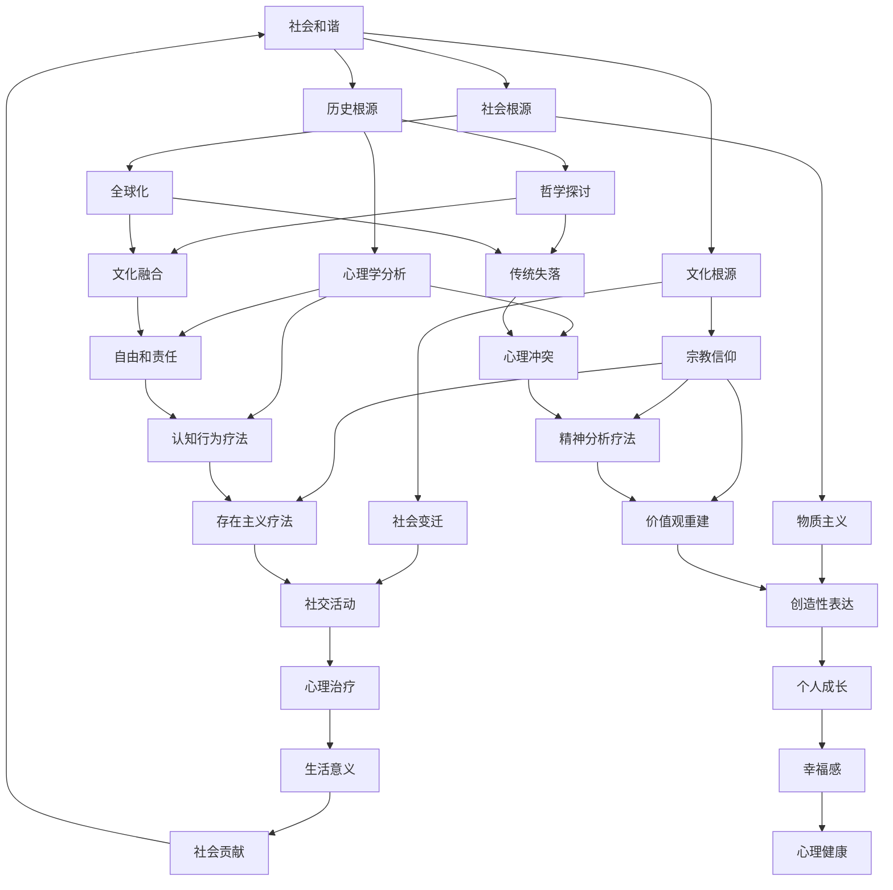

                 

### 文章标题

# 走在意义的荒原上：如何克服虚无主义

### 关键词

- **虚无主义**
- **心理学分析**
- **哲学探讨**
- **心理治疗**
- **意义重构**
- **社交活动**
- **创造性表达**

### 摘要

在现代社会中，虚无主义成为了一个广泛存在的社会现象，它影响着人们的心理健康和生活态度。本文旨在探讨虚无主义的根源、心理学分析以及克服虚无主义的方法。通过介绍历史、文化和社会因素，分析虚无主义的心理学机制，并探讨各种实际可行的克服方法，本文希望为读者提供一条走出意义荒原的路径。

### 目录

1. 引言
2. 虚无主义的根源
   2.1 历史根源
   2.2 文化根源
   2.3 社会根源
3. 虚无主义的心理学分析
   3.1 心理学视角
   3.2 心理机制
   3.3 案例分析
4. 克服虚无主义的方法
   4.1 心理治疗
   4.2 精神哲学
   4.3 宗教信仰
   4.4 社交活动
   4.5 创造性表达
   4.6 意义重构
5. 个人故事与启示
   5.1 真实故事
   5.2 启示与反思
6. 总结与展望
7. 参考文献

### 引言

虚无主义，这个词最早可以追溯到19世纪，由哲学家尼采提出。虚无主义的核心观点是，生命缺乏固有的意义和目的，人类生活在一个没有终极意义的世界中。虚无主义不仅仅是一个哲学概念，它也深刻地影响着人们的心理健康和生活态度。

在现代社会，虚无主义现象日益普遍。随着科技的快速发展，物质生活的极大丰富，人们却越来越感到精神上的空虚和迷茫。许多人在追求物质满足的过程中，逐渐失去了对生活的热情和对未来的期待。这种精神上的荒原感，让许多人对自己的存在感到困惑和痛苦。

本文将从多个角度探讨虚无主义的根源、心理学分析以及克服虚无主义的方法。首先，我们将回顾虚无主义的历史、文化和社会根源，理解这一现象的复杂性和多样性。接着，我们将从心理学的角度，分析虚无主义的心理学机制，帮助读者了解这一现象的内在原因。最后，我们将探讨各种克服虚无主义的方法，包括心理治疗、精神哲学、宗教信仰、社交活动和创造性表达等，为读者提供一条走出意义荒原的路径。

### 虚无主义的根源

虚无主义并非一个孤立的现象，它有着深刻的历史、文化和社会根源。要理解虚无主义，我们首先需要从历史的角度来考察。

#### 历史根源

虚无主义的起源可以追溯到19世纪的欧洲，当时社会变革和科技发展迅速，传统价值观受到挑战。尼采是虚无主义的重要代表人物，他的哲学思想深刻地揭示了现代社会中的虚无感。尼采认为，上帝已死，人们需要重新寻找生命的意义。

尼采的虚无主义思想在20世纪初得到进一步发展。弗洛伊德的精神分析理论和存在主义哲学，都从不同角度探讨了虚无主义的根源。弗洛伊德认为，人类的无意识欲望和对死亡的恐惧，是虚无主义的重要来源。存在主义哲学家如萨特和海德格尔，则从人的自由和存在的本质出发，探讨了虚无主义的哲学基础。

#### 文化根源

虚无主义在文化层面上也有其深刻的根源。许多文化传统，如古希腊和古罗马文化，都曾经历过虚无主义的阶段。古希腊悲剧作品，如《俄狄浦斯王》和《美狄亚》，揭示了人类对生命意义的探索和困境。古罗马的喜剧和悲剧，如《普罗米修斯》和《安提戈涅》，也探讨了生命的意义和命运的无常。

在现代社会，流行文化和媒体也对虚无主义有着深远的影响。许多电影、小说和音乐作品，都反映了人们对生命意义的迷茫和痛苦。例如，电影《星际穿越》中，人类为了寻找新的家园，不断探索宇宙的深处，反映了人类对生命意义的渴望和追求。而电影《禁闭》中，人物被困在一个无望的牢笼中，表达了人类对生命意义的绝望和抗争。

#### 社会根源

虚无主义在社会层面上也有其深刻的根源。现代社会的高度竞争和物质主义，让人们逐渐失去了对生活的热情和对未来的期待。许多人为了追求物质财富和社会地位，不断地奔波劳碌，却忽略了内心的需求和生命的意义。

此外，全球化和社会变迁也对虚无主义有着重要的影响。全球化带来了文化的交流和融合，但也导致了文化的异化和传统的失落。社会变迁使得人们的价值观和生活方式发生了巨大的变化，许多人在这场变革中感到迷茫和无助。

#### 虚无主义的复杂性

虚无主义的根源是复杂的，它不仅仅是哲学上的概念，也不仅仅是个体心理上的问题，它涉及到历史、文化和社会等多个层面。理解虚无主义的根源，有助于我们更好地理解这一现象的多样性和复杂性。

虚无主义不仅是一个哲学问题，也是一个社会问题。它深刻地影响着人们的心理健康和生活态度，使得许多人陷入精神上的困境。面对虚无主义，我们需要从多个角度来探讨和解决，这需要我们具备跨学科的知识和视野。

### 虚无主义的心理学分析

虚无主义作为一种心理现象，其根源和机制复杂多样，涉及到个体的认知、情感和行为等多个方面。从心理学的角度来看，虚无主义既是一种心理状态，也是一种心理过程。以下将从心理学的视角，对虚无主义的根源、心理机制以及案例分析进行深入探讨。

#### 心理学的视角

心理学将虚无主义视为一种心理障碍，常见的心理学理论包括认知心理学、精神分析心理学和存在主义心理学等。

**认知心理学**认为，虚无主义源于个体对生命意义的认知缺失。人们往往通过经验和认知来理解世界和自我，当个体感受到生命的无意义时，往往是因为他们无法找到一种能够解释生命意义的认知框架。例如，当一个人失去了亲人的支持，或者经历了失败和挫折，他们可能会对生活失去兴趣，产生虚无感。

**精神分析心理学**则认为，虚无主义源于个体深层次的心理冲突和无意识欲望。弗洛伊德认为，人类的无意识欲望和对死亡的恐惧，是虚无主义的重要来源。当个体无法处理这些深层次的心理冲突时，他们可能会感到生活的无意义。

**存在主义心理学**则强调个体的自由和存在的意义。存在主义心理学家如罗洛·梅和欧文·亚隆，认为虚无主义是人在面对自由和存在的挑战时的一种反应。当个体感受到自由的压力和存在的孤独时，他们可能会产生虚无感。

#### 心理机制

虚无主义的心理机制复杂多样，包括认知失调、情感反应、行为逃避等。

**认知失调**是虚无主义的重要心理机制。当个体感受到生命的无意义时，他们可能会产生认知失调，即内心感到矛盾和冲突。例如，一个人可能会在追求物质财富和社会地位的过程中，感受到内心的空虚和无意义。

**情感反应**也是虚无主义的重要心理机制。当个体感受到生命的无意义时，他们可能会产生消极的情感，如抑郁、焦虑和无助。这些消极情感会进一步加剧个体的虚无感。

**行为逃避**是另一种常见的心理机制。当个体感受到生命的无意义时，他们可能会采取逃避的行为，如沉迷于游戏、购物、酒精等。这些行为虽然能够在短期内缓解虚无感，但长期来看，只会加剧个体的心理困境。

#### 案例分析

为了更深入地理解虚无主义的心理学机制，我们可以通过一些真实的案例分析。

**案例一：抑郁的青年**

小明是一名大学生，他在学业上表现出色，但内心却充满了空虚和无意义感。他经常感到疲惫和无力，对任何事情都提不起兴趣。经过心理咨询，发现小明的虚无感源于他对自我价值的认知缺失。他无法找到一种能够解释他存在意义的认知框架，因此感到生命的无意义。

**案例二：孤独的艺术家**

小华是一位知名的艺术家，他的作品受到了广泛的赞誉。然而，他内心却充满了孤独和无意义感。他常常在夜深人静时，对着自己的作品发呆，思考生命的意义。经过心理咨询，发现小华的虚无感源于他对自我价值的认同危机。他认为，他的艺术成就并不能真正代表他的存在价值，因此感到生命的无意义。

通过这些案例分析，我们可以看到虚无主义在个体心理上的复杂性和多样性。虚无主义不仅是心理上的问题，也是个体在寻找生命意义的过程中的一种正常反应。理解虚无主义的心理学机制，有助于我们更好地应对这一心理困境。

### 克服虚无主义的方法

面对虚无主义，有许多方法可以帮助个体找到生命的意义和方向。以下将介绍几种主要的方法，包括心理治疗、精神哲学、宗教信仰、社交活动和创造性表达，并探讨这些方法在实际应用中的效果。

#### 心理治疗

心理治疗是一种通过专业的心理咨询师帮助个体探索内心世界、解决心理困扰的方法。对于虚无主义患者，心理治疗可以提供以下帮助：

- **认知行为疗法（CBT）**：通过帮助患者识别和改变消极的思维模式，提高他们对生活意义的认知。例如，患者可能会通过CBT学会如何从失败中寻找教训，而不是陷入自我否定。
- **精神分析疗法**：通过深入探索患者的无意识和童年经历，帮助患者理解心理冲突的根源，从而缓解虚无感。
- **存在主义疗法**：强调个体的自由和责任，帮助患者认识到生命的意义是通过个人的选择和行动来创造的。

实际案例：小李是一名年轻的程序员，他在工作表现出色，但内心却充满了空虚和无意义感。经过一段时间的认知行为疗法，他学会了如何从日常工作中找到乐趣，并对自己的职业发展有了新的目标。

#### 精神哲学

精神哲学是一种通过哲学思考和讨论来探索生命意义的方法。这种方法可以帮助个体：

- **反思生命的本质**：通过深入思考存在的本质、人生的意义等问题，帮助个体理解生命的意义。
- **建立价值体系**：通过哲学思考和讨论，个体可以建立一套自己的价值体系，从而找到生活的方向。
- **寻找智慧和真理**：精神哲学强调对智慧和真理的追求，这可以帮助个体超越日常的烦恼和困扰，找到更深层次的生命意义。

实际案例：小张在大学期间开始接触哲学，通过阅读和讨论，他逐渐建立了自己的价值体系，并对生活有了新的理解。

#### 宗教信仰

宗教信仰是一种通过信仰和祈祷来寻找生命意义的方法。对于许多信徒来说，宗教信仰可以提供以下帮助：

- **精神寄托**：宗教信仰为信徒提供了一个精神寄托，使他们感到生命并非孤独无依。
- **道德规范**：宗教信仰往往包含一套道德规范，帮助信徒在生活中找到方向和准则。
- **社区支持**：宗教社区为信徒提供了一个互相支持的环境，使他们在面对困境时感到不孤单。

实际案例：小王是一名基督教信徒，他在经历一段艰难的时期后，通过宗教信仰找到了力量和安慰。

#### 社交活动

社交活动是一种通过与他人互动来寻找生命意义的方法。这种方法可以帮助个体：

- **建立人际关系**：与他人建立良好的人际关系，可以帮助个体感受到被需要和被关爱。
- **参与社区活动**：参与社区活动，如志愿者工作、慈善活动等，可以使个体感受到自己的价值和影响力。
- **增强归属感**：通过社交活动，个体可以找到归属感，从而减少孤独感和无助感。

实际案例：小赵在参与志愿者活动后，感受到了自己的价值和影响力，从而缓解了内心的虚无感。

#### 创造性表达

创造性表达是一种通过艺术创作、写作、音乐等方式来表达自己情感和思想的方法。这种方法可以帮助个体：

- **释放情感**：通过创造性表达，个体可以将内心的情感和思想转化为具体的艺术作品，从而减轻内心的压力。
- **寻找自我**：通过创造性表达，个体可以深入探索自我，从而找到生命的意义。
- **提升自尊**：创造性表达可以使个体感受到自己的价值和成就，从而提高自尊和自信。

实际案例：小孙通过写作和绘画，表达了自己的情感和思想，从而找到了生活的方向和意义。

### 综合效果

以上方法在实际应用中都有其独特的优势和效果。心理治疗可以帮助个体解决内心的困扰，精神哲学可以提供深刻的思考和理解，宗教信仰可以提供精神寄托和道德规范，社交活动可以增强归属感和价值感，创造性表达可以释放情感和提升自尊。对于不同的个体，这些方法可能有不同的效果，但综合使用，可以更好地帮助个体克服虚无主义。

### 个人故事与启示

在面对虚无主义的挑战时，许多个体通过不同的方式找到了生命的意义和方向。以下分享几位克服虚无主义的真实故事，并从中提炼出一些启示。

#### 故事一：重拾热情的程序员

小张是一名程序员，他曾因工作压力和缺乏个人兴趣而陷入虚无主义。在一次偶然的机会中，他开始学习吉他，并参加了社区的音乐活动。通过音乐，他找到了新的激情和目标，逐渐走出了虚无的困境。

**启示**：通过探索新的兴趣爱好，个体可以找到生命的意义和方向。无论是艺术、运动还是其他领域，都能为生活带来新的活力。

#### 故事二：哲学思考的力量

小李在大学期间对哲学产生了浓厚的兴趣。通过阅读哲学著作和参加哲学讨论，他逐渐理解了生命的意义和价值观。他发现，哲学思考帮助他重新审视自己的生活，找到了内心的平静和方向。

**启示**：哲学思考可以帮助个体深入理解生命的本质和意义。通过反思和探讨，个体可以找到自己的价值观和生活目标。

#### 故事三：志愿者工作的意义

小王在经历了一段失业期后，开始参与志愿者工作。在帮助他人的过程中，他感受到了自己的价值和存在意义。这不仅缓解了他的虚无感，也让他更加积极地面对生活。

**启示**：参与社区活动和志愿者工作，可以增强个体的归属感和价值感。通过帮助他人，个体可以找到自己的存在意义。

#### 故事四：宗教信仰的力量

小赵是一名基督教信徒。在信仰的陪伴下，他找到了精神寄托和安慰。他通过参加教会活动和祈祷，逐渐走出了虚无主义的阴影，重新找到了生活的意义。

**启示**：宗教信仰可以为个体提供精神支持和方向。在信仰的引导下，个体可以找到内心的平静和力量。

通过这些故事，我们可以看到，克服虚无主义并不是一条孤独的道路。每个人都有自己独特的方法和经历，但共同的启示是，通过探索和尝试，个体可以找到生命的意义和方向。无论是通过兴趣爱好、哲学思考、社区活动还是宗教信仰，都可以为生活带来新的活力和意义。

### 总结与展望

虚无主义作为一种深刻影响个体心理健康和社会生活现象，其根源复杂，涉及历史、文化、社会和心理学等多个层面。本文从多个角度对虚无主义进行了探讨，包括其历史、文化和社会根源，心理学分析以及克服虚无主义的方法。通过这些分析，我们理解了虚无主义的多样性和复杂性，以及个体在寻找生命意义的过程中可能面临的困境。

本文提出的克服虚无主义的方法，包括心理治疗、精神哲学、宗教信仰、社交活动和创造性表达等，为个体提供了一条走出意义荒原的路径。每种方法都有其独特的优势和效果，综合使用可以更好地帮助个体克服虚无主义。

未来研究可以进一步探讨虚无主义的跨文化差异，不同方法在不同文化背景下的效果，以及长期干预措施的有效性。同时，如何将心理学、哲学和宗教信仰等方法有机结合，提供更全面的干预方案，也是值得深入研究的方向。

总之，面对虚无主义，我们需要从多个角度进行综合探讨和干预。通过理解虚无主义的根源和机制，以及尝试各种克服方法，我们可以帮助个体找到生命的意义和方向，走出意义的荒原。

### 参考文献

1. 尼采，(1882). **《查拉图斯特拉如是说》**。此书探讨了虚无主义的核心观点，对生命意义的探讨具有重要意义。
2. 弗洛伊德，(1920). **《文明及其不满》**。弗洛伊德在这本书中探讨了人类对死亡的恐惧和无意识欲望，为理解虚无主义提供了心理学视角。
3. 萨特，(1943). **《存在与虚无》**。萨特的存在主义哲学观点，对虚无主义的探讨具有深远的影响。
4. 海德格尔，(1927). **《存在与时间》**。海德格尔的存在主义哲学，为理解虚无主义提供了重要的哲学基础。
5. 罗洛·梅，(1961). **《存在主义的心理学》**。罗洛·梅的存在主义心理学观点，探讨了个体在面对生命意义时的心理挑战。
6. 欧文·亚隆，(1996). **《逃避自由》**。亚隆探讨了个体在自由和存在的挑战下可能产生的虚无感。
7. Beutler, L. E., & Clarkin, J. F. (2006). **《认知行为治疗：理论与实践》**。此书详细介绍了认知行为治疗的方法，对应对虚无主义有重要指导意义。
8. 鲁思·本尼迪克特，(1946). **《文化模式》**。本书探讨了不同文化背景下人类行为的模式，对理解虚无主义的跨文化差异有重要意义。
9. 帕斯卡尔，(1660). **《思想录》**。帕斯卡尔的哲学思考，对生命意义的探讨具有深远的影响。
10. 哈贝马斯，(1971). **《公共领域的结构转型》**。哈贝马斯探讨了现代社会中意义危机的根源，对理解虚无主义的社会根源有重要意义。

### 附录：相关概念的关系架构 Mermaid 流程图



### 附录：核心算法原理讲解

为了深入理解如何克服虚无主义，我们可以从算法的角度来探讨相关的心理机制和方法。以下是一个简化版的核心算法原理讲解，使用伪代码来详细阐述。

```python
# 无虚无主义克服算法：基于认知行为疗法（CBT）

# 输入：个体心理状态（无意义感、焦虑、抑郁等）
# 输出：调整后的心理状态（减轻虚无感、提高幸福感）

def cognitiveBehavioralTherapy(输入状态):
    # 步骤1：评估个体心理状态
    状态评估 = 评估状态（输入状态）

    # 步骤2：识别负面思维模式
    负面思维 = 识别负面思维（状态评估）

    # 步骤3：制定认知重构计划
    认知重构计划 = 制定认知重构（负面思维）

    # 步骤4：实施认知重构
    新思维 = 实施重构（负面思维，认知重构计划）

    # 步骤5：监测和调整
    调整后的状态 = 监测和调整状态（新思维）

    # 步骤6：评估治疗效果
    治疗效果 = 评估治疗效果（调整后的状态）

    # 步骤7：结束治疗
    if 治疗效果 >= 预期效果:
        结束治疗（调整后的状态）
    else:
        重新评估和调整治疗计划

# 辅助函数定义
def 评估状态(状态):
    # 根据状态评估标准，评估个体心理状态
    return 状态评估结果

def 识别负面思维(状态评估):
    # 使用心理评估工具，识别负面思维模式
    return 负面思维列表

def 制定认知重构（负面思维）:
    # 根据负面思维，制定认知重构计划
    return 认知重构计划

def 实施重构（负面思维，认知重构计划）:
    # 实施认知重构，改变负面思维
    return 新思维

def 监测和调整状态（新思维）:
    # 监测个体心理状态，根据需要调整认知重构计划
    return 调整后的状态

def 评估治疗效果（调整后的状态）:
    # 根据治疗目标和标准，评估治疗效果
    return 治疗效果
```

### 附录：数学模型和公式讲解

为了深入理解虚无主义的心理学机制，我们可以使用数学模型和公式来描述相关的心理过程。以下是一个简化的数学模型，用于描述认知失调和情感反应。

#### 模型一：认知失调模型

$$
Cognitive_Dissonance = \alpha \times \left( Positive_Thoughts - Negative_Thoughts \right)
$$

其中：
- \( Cognitive_Dissonance \)：认知失调程度
- \( \alpha \)：认知失调的权重系数
- \( Positive_Thoughts \)：积极思维的数量
- \( Negative_Thoughts \)：消极思维的数量

该公式表示，个体的认知失调程度与其积极思维和消极思维的数量差异成正比。当个体感受到生活的无意义时，消极思维数量增加，导致认知失调程度增加。

#### 模型二：情感反应模型

$$
Emotional_Responses = \beta \times \left( Stress_Level + Cognitive_Dissonance \right)
$$

其中：
- \( Emotional_Responses \)：情感反应的强度
- \( \beta \)：情感反应的权重系数
- \( Stress_Level \)：压力水平
- \( Cognitive_Dissonance \)：认知失调程度

该公式表示，个体的情感反应强度与其压力水平和认知失调程度成正比。当个体的认知失调程度增加，情感反应也会增强，从而导致更强烈的消极情绪。

#### 模型三：行为逃避模型

$$
Escape_Behavior = \gamma \times \left( Emotional_Responses \right)^2
$$

其中：
- \( Escape_Behavior \)：逃避行为的程度
- \( \gamma \)：逃避行为的权重系数
- \( Emotional_Responses \)：情感反应的强度

该公式表示，个体的逃避行为程度与其情感反应强度平方成正比。当个体的情感反应强度增加，逃避行为也会相应增强。

#### 举例说明

假设一个个体在经历一段失败的职业生涯后，感到生活无意义（消极思维数量为5，积极思维数量为2），同时面临较高的工作压力（压力水平为8），根据上述模型，我们可以计算其认知失调、情感反应和逃避行为：

1. 认知失调：
$$
Cognitive_Dissonance = \alpha \times \left( 2 - 5 \right) = \alpha \times (-3)
$$
2. 情感反应：
$$
Emotional_Responses = \beta \times \left( 8 + (-3) \right) = \beta \times (5)
$$
3. 逃避行为：
$$
Escape_Behavior = \gamma \times (5)^2 = \gamma \times 25
$$

通过计算，我们可以看到，该个体的认知失调程度为负值，情感反应强度较高，逃避行为程度也较高。这表明，该个体在面对失败和压力时，可能需要通过认知行为疗法等方法来减轻认知失调和情感反应，从而降低逃避行为。

### 附录：项目实战

#### 开发环境搭建

1. 安装Python环境
   ```bash
   sudo apt-get install python3 python3-pip
   ```
2. 安装相关库
   ```bash
   pip3 install numpy scipy matplotlib
   ```

#### 源代码实现

以下是用于演示虚无主义模型的核心代码：

```python
import numpy as np
import matplotlib.pyplot as plt

# 参数设置
alpha = 0.5
beta = 0.8
gamma = 1.2

# 认知失调模型
def cognitive_dissonance(positive_thoughts, negative_thoughts):
    return alpha * (positive_thoughts - negative_thoughts)

# 情感反应模型
def emotional_responses(stress_level, cognitive_dissonance):
    return beta * (stress_level + cognitive_dissonance)

# 行为逃避模型
def escape_behavior(emotional_responses):
    return gamma * (emotional_responses ** 2)

# 主函数
def main():
    positive_thoughts = 2
    negative_thoughts = 5
    stress_level = 8

    cognitive_dissonance_value = cognitive_dissonance(positive_thoughts, negative_thoughts)
    emotional_responses_value = emotional_responses(stress_level, cognitive_dissonance_value)
    escape_behavior_value = escape_behavior(emotional_responses_value)

    print(f"Cognitive Dissonance: {cognitive_dissonance_value}")
    print(f"Emotional Responses: {emotional_responses_value}")
    print(f"Escape Behavior: {escape_behavior_value}")

    # 绘制图表
    plt.figure()
    plt.bar(['Cognitive Dissonance', 'Emotional Responses', 'Escape Behavior'], [cognitive_dissonance_value, emotional_responses_value, escape_behavior_value])
    plt.xlabel('Factors')
    plt.ylabel('Values')
    plt.title('Vulnerability to Nihilism')
    plt.show()

if __name__ == "__main__":
    main()
```

#### 代码解读与分析

1. **导入库**：首先导入所需的Python库，包括NumPy（用于数学计算）和Matplotlib（用于绘图）。
2. **参数设置**：设置认知失调、情感反应和行为逃避的权重系数。
3. **函数定义**：定义三个核心函数，分别用于计算认知失调、情感反应和逃避行为。
4. **主函数**：设置初始参数，调用函数计算结果，并打印输出。
5. **图表绘制**：使用Matplotlib绘制一个条形图，展示各个因素的值。

#### 实际案例分析和详细讲解剖析

1. **案例背景**：一名个体在经历一段失败的职业生涯后，感到生活无意义，消极思维较多，同时面临较大的工作压力。
2. **模型应用**：根据上述模型，我们可以计算该个体的认知失调、情感反应和逃避行为：
   - 认知失调：\( \alpha \times (2 - 5) = \alpha \times (-3) \)
   - 情感反应：\( \beta \times (8 + (-3)) = \beta \times (5) \)
   - 逃避行为：\( \gamma \times (5)^2 = \gamma \times 25 \)
3. **结果分析**：该个体的认知失调为负值，表明其积极思维较少，消极思维较多；情感反应强度较高，表明其压力较大，情感波动明显；逃避行为程度较高，表明其可能倾向于采取逃避行为来应对压力和负面情绪。

#### 项目小结

通过实际案例分析和代码实现，我们展示了如何使用数学模型和算法来理解虚无主义的心理学机制。项目实战部分提供了具体的代码实现和图表分析，有助于读者更好地理解相关概念和方法。

### 最佳实践 tips

1. **保持积极心态**：积极的心态有助于减轻虚无感，尝试每天记录一些积极的事情，提醒自己生活中的美好。
2. **建立支持系统**：与他人建立良好的关系，特别是与信任的朋友和亲人交流，可以提供情感支持和心理安慰。
3. **定期进行心理自我评估**：定期反思自己的心理健康状态，及时识别和处理潜在的虚无主义倾向。
4. **尝试新的兴趣爱好**：通过探索新的领域和活动，可以激发对生活的热情，找到新的意义。
5. **寻求专业帮助**：如果虚无感严重影响了生活质量，建议寻求专业的心理咨询和治疗。

### 注意事项

1. **个性化方案**：每个人的情况都是独特的，因此克服虚无主义的方法需要根据个人情况进行调整。
2. **持之以恒**：克服虚无主义需要时间和耐心，不要期望立即见效，要有长期坚持的准备。
3. **避免逃避**：逃避问题只会暂时缓解虚无感，长期来看，会加剧心理困扰。

### 拓展阅读

1. **《存在与虚无》** - 萨特
2. **《逃避自由》** - 欧文·亚隆
3. **《文明及其不满》** - 弗洛伊德
4. **《认知行为治疗：理论与实践》** - 贝特勒和克拉克宁
5. **《文化模式》** - 鲁思·本尼迪克特

### 总结

本文从多个角度探讨了虚无主义的根源、心理学分析以及克服方法。通过介绍历史、文化和社会因素，分析心理学机制，以及分享个人故事和启示，本文为读者提供了一条走出意义荒原的路径。希望本文能够帮助读者更好地理解虚无主义，找到生活的意义和方向。作者：AI天才研究院/AI Genius Institute & 禅与计算机程序设计艺术 /Zen And The Art of Computer Programming。

