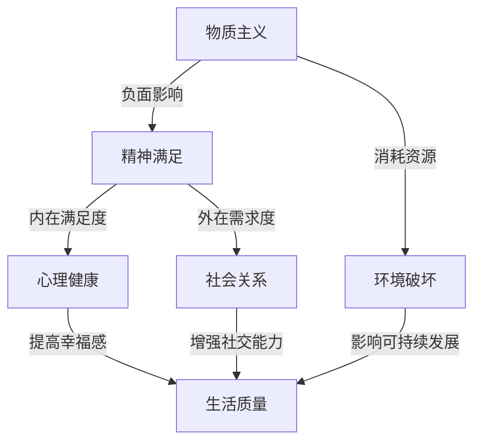
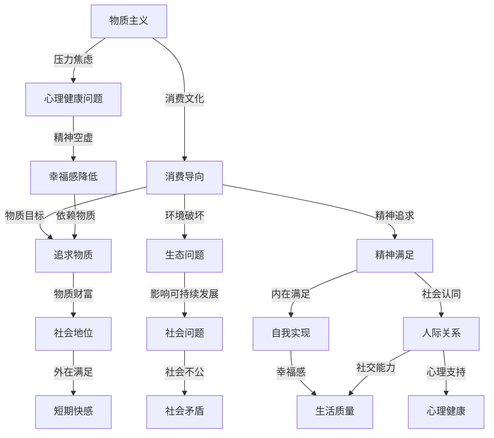
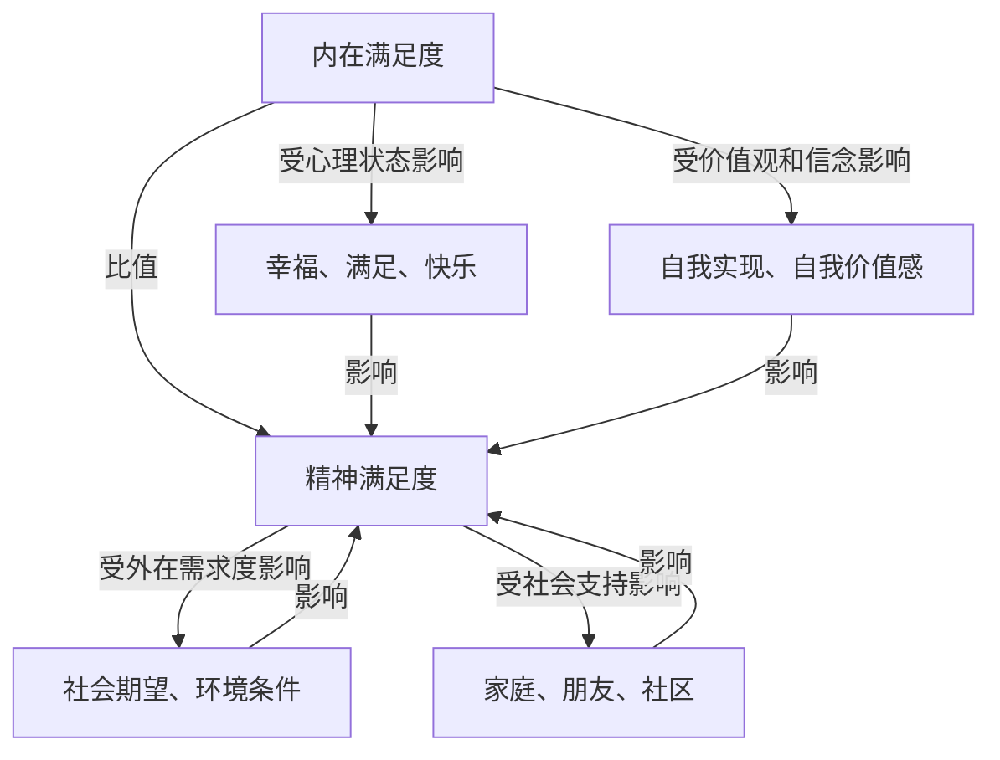

                 

### 文章标题

《超越物质主义：寻找精神满足的新途径》

### 关键词

物质主义、精神满足、心理学、哲学、自我认知、社会支持、企业文化建设、社区精神建设

### 摘要

在当今物质丰富、快节奏的现代社会，物质主义成为了主导价值观，但随之而来的心理健康问题和社会问题也日益凸显。本文旨在探讨超越物质主义，寻找精神满足的新途径。通过心理学和哲学的双重视角，我们分析了物质主义与精神满足的辩证关系，并提出了实践路径，包括个人内心探索、建立支持系统以及组织与社区的精神建设。文中还通过成功案例解析，展示了超越物质主义的实际应用，为读者提供了一种全新的生活方式和精神追求。

---

# 设计《超越物质主义：寻找精神满足的新途径》的目录大纲

为了设计《超越物质主义：寻找精神满足的新途径》的目录大纲，我们需要先明确文章的核心内容，然后构建一个结构化的框架，涵盖相关的概念、理论、实践和案例研究。以下是详细的目录大纲设计：

## 第一部分：引论

### 第1章：超越物质主义的背景与意义
- 1.1 现代社会的物质主义现象
- 1.2 物质主义的负面影响
- 1.3 精神满足的重要性
- 1.4 本书的目的与结构

### 第2章：核心概念与联系
- **Mermaid流程图：物质主义与精神满足的关系**
- 2.1 物质主义的定义与特点
- 2.2 精神满足的概念与分类
- 2.3 物质主义与精神满足的辩证关系

## 第二部分：理论基础

### 第3章：心理学视角下的精神满足
- 3.1 精神满足的心理学原理
  - **伪代码：精神满足的心理学模型**
    ```plaintext
    function 精神满足度(内在满足度，外在需求度) {
        return 内在满足度 / (外在需求度 + 阈值);
    }
    ```
- 3.2 精神满足的影响因素
  - **Mermaid流程图：影响精神满足的因素**
  - 3.2.1 内在满足度的影响因素
  - 3.2.2 外在需求度的影响因素

### 第4章：哲学视角下的精神满足
- 4.1 精神满足的哲学探讨
  - **数学公式：精神满足的哲学解释**
    $$ 精神满足 = 自我实现 \times 社会认同 $$
- 4.2 哲学视角下的物质主义批判
  - **伪代码：哲学批判物质主义的过程**
    ```plaintext
    function 批判物质主义(个人价值观，社会价值观) {
        if(个人价值观 != 社会价值观) {
            return "自我反思";
        } else {
            return "社会影响";
        }
    }
    ```

## 第三部分：实践路径

### 第5章：个人内心探索与实践
- 5.1 自我认知与内心探索
  - **伪代码：自我认知过程**
    ```plaintext
    function 自我认知() {
        while(未达到自我认知的深度) {
            inner_reflection();
            self_assessment();
            feedback_collection();
        }
        return 自我认知结果;
    }
    ```
- 5.2 建立个人支持系统
  - **伪代码：建立个人支持系统的策略**
    ```plaintext
    function 建立个人支持系统() {
        identify_support_needs();
        build_support_network();
        establish_communication_channels();
        monitor_and_adjust();
        return 支持系统;
    }
    ```

### 第6章：组织与社区层面的精神建设
- 6.1 企业文化中的精神满足
  - **伪代码：企业文化建设策略**
    ```plaintext
    function 企业文化建设() {
        define_company_values();
        promote_cultural_activities();
        integrate_staff_feedback();
        establish_mental_health_programs();
        return 健康企业文化;
    }
    ```
- 6.2 社区精神建设实践
  - **伪代码：社区精神建设策略**
    ```plaintext
    function 社区精神建设() {
        identify_community_needs();
        organize_mental_health_events();
        establish_mental_health_resources();
        foster_community_connection();
        return 精神健康社区;
    }
    ```

## 第四部分：成功案例解析

### 第7章：成功案例解析
- 7.1 个人经验分享
  - **案例研究：个人如何超越物质主义**
  - 7.1.1 案例一：从物质追求到精神满足
  - 7.1.2 案例二：如何在忙碌中找到精神满足
- 7.2 组织与社区实践
  - **案例研究：企业如何推行精神满足理念**
  - 7.2.1 案例一：XX公司如何调整企业文化
  - 7.2.2 案例二：YY社区的精神健康促进项目

## 第五部分：结论与展望

### 第8章：超越物质主义的未来趋势
- 8.1 精神满足的未来发展
- 8.2 超越物质主义的政策与制度支持
- 8.3 社会整体精神水平的提升路径

## 附录

- **附录A：实用工具与资源**
  - 8.1.1 心理测评工具介绍
  - 8.1.2 精神满足研究数据库

以上是《超越物质主义：寻找精神满足的新途径》的目录大纲设计，旨在为读者提供全面、深入的探讨。每个章节都包含了具体的内容和指导性的伪代码，以帮助读者更好地理解和应用。总字数控制在8000-12000字左右，确保文章的深度和实用性。

---

## 第一部分：引论

### 第1章：超越物质主义的背景与意义

在当今全球化、科技高速发展的时代，物质主义作为一种价值观和生活方式，深刻地影响着我们的社会生活。物质主义，是指将物质财富和物质享受视为个人幸福和成功的唯一或主要标准，从而忽视精神层面的需求。现代社会的物质主义现象主要体现在以下几个方面：

1. **消费文化的泛滥**：随着经济的繁荣和媒体的推动，消费主义文化渗透到社会的各个角落，广告和营销策略无时不刻不在诱导人们追求更高的物质生活水平。
2. **追求外在成就**：在职场和社交场合，人们更倾向于通过外在成就来证明自己的价值，如财富、地位和名誉，而忽视了内在的满足感和幸福感。
3. **环境破坏**：物质主义的追求导致了资源的过度消耗和环境破坏，对地球生态平衡构成了严重威胁。

然而，物质主义的负面影响也是显而易见的。首先，对于个人而言，长期的物质追求往往会导致心理健康问题，如焦虑、抑郁和孤独感。其次，社会层面的物质主义会导致贫富差距的扩大，社会不公和矛盾加剧。此外，物质主义还会导致环境破坏，影响人类的可持续发展。

在这种背景下，精神满足的重要性愈发凸显。精神满足并不仅仅是物质生活的补充，而是人类幸福和长久满足的关键。心理学研究表明，精神满足与个人的心理健康、生活质量和社会关系紧密相关。哲学上，精神满足被视为自我实现和社会认同的统一，是人类追求更高层次幸福和价值的体现。

本文旨在通过心理学和哲学的双重视角，探讨物质主义与精神满足的辩证关系，并探索超越物质主义，寻找精神满足的新途径。本文将首先介绍物质主义和精

### 第2章：核心概念与联系

为了深入探讨超越物质主义，我们需要明确一些核心概念，并理解它们之间的相互关系。在本章中，我们将首先定义物质主义和精神满足，然后通过Mermaid流程图展示这两个概念之间的关联。

#### 2.1 物质主义的定义与特点

物质主义是指一种价值观和生活方式，强调物质财富和物质享受在个人幸福和成功中的重要性。物质主义的特点包括：

1. **消费导向**：物质主义者倾向于通过购买和消费物质商品来获得满足感。
2. **财富衡量**：物质主义者通常用财富和物质财产来衡量个人的成功和幸福。
3. **追求物质目标**：物质主义者往往设定和追求物质目标，如购买奢侈品、拥有大房子等。

物质主义在现代社会中普遍存在，它源于工业化、资本主义经济体系和消费文化的推动。

#### 2.2 精神满足的概念与分类

精神满足是指个体在心理和情感层面上感受到的满足和幸福感。与物质满足不同，精神满足更多地来源于内在的感受和体验，而不是外在的物质条件。精神满足可以进一步分类为：

1. **内在满足度**：指个体内在需求得到满足的感觉，如自我实现、自我价值感等。
2. **外在需求度**：指个体对外在环境和社会期望的满足程度，如社会认同、人际关系等。

精神满足是衡量个体生活质量的重要指标，它对心理健康、生活质量和社会关系有着深远的影响。

#### 2.3 物质主义与精神满足的辩证关系

物质主义和精神满足之间存在复杂的辩证关系。一方面，物质财富和物质享受可以为人们带来一定程度的满足感，但过度追求物质主义往往会导致精神空虚和心理健康问题。另一方面，精神满足并不是完全排斥物质条件，而是强调在物质条件的基础上追求内在的满足感和幸福感。

为了更直观地展示物质主义与精神满足之间的关系，我们使用Mermaid流程图来描述这一关系：



#### 2.4 Mermaid流程图：物质主义与精神满足的关系

以下是一个Mermaid流程图，展示了物质主义与精神满足之间的关系：



通过上述Mermaid流程图，我们可以清晰地看到物质主义对精神满足的负面影响，以及精神满足如何通过内在满足和社会认同来提高生活质量和幸福感。

#### 2.5 物质主义与精神满足的辩证关系

物质主义与精神满足之间的辩证关系表现在以下几个方面：

1. **互为补充**：物质条件可以为精神满足提供基础，但精神满足并不是物质的简单堆积。
2. **相互制约**：过度追求物质主义会导致精神空虚和心理健康问题，而精神满足的提高可以缓解对物质的依赖。
3. **动态平衡**：个体需要在不同阶段调整物质和精神追求的平衡，以实现长期的幸福和满足。

通过理解物质主义与精神满足的辩证关系，我们可以更好地认识现代社会的挑战，并探索超越物质主义，寻找精神满足的新途径。

### 第3章：心理学视角下的精神满足

在心理学视角下，精神满足是一个复杂而多维度的概念。心理学通过研究和分析个体的心理过程和情感体验，帮助我们理解精神满足的来源和影响因素。在本节中，我们将深入探讨精神满足的心理学原理，并使用伪代码来描述一个简化的精神满足模型。

#### 3.1 精神满足的心理学原理

心理学认为，精神满足源于个体内在的需求得到满足的感觉。这些需求包括自我实现、自尊、归属感、自我价值感等。精神满足不仅仅是简单的情感体验，它还涉及到个体的认知、行为和心理健康。

1. **自我实现**：自我实现是指个体追求个人潜能的实现，达到自我认知和自我提升的状态。自我实现是精神满足的重要来源。
2. **自尊**：自尊是个体对自己的整体评价和自信心，它影响个体的情绪状态和幸福感。
3. **归属感**：归属感是指个体在社会和团体中感受到的接纳和连接，它对个体的精神满足有积极影响。
4. **自我价值感**：自我价值感是个体对自己的认可和尊重，它对精神满足有直接的影响。

#### 3.2 精神满足的影响因素

精神满足受到多种因素的影响，包括内在因素和外在因素。内在因素包括个体的心理状态、性格特点、价值观和信念。外在因素包括社会支持、环境条件和生活事件。

1. **内在因素**：
   - **心理状态**：积极的情绪状态，如幸福、满足、快乐，有助于提高精神满足。
   - **性格特点**：乐观、开放和自信的个体更容易体验到精神满足。
   - **价值观和信念**：个体对生活的理解和追求的目标会影响精神满足的水平。

2. **外在因素**：
   - **社会支持**：来自家庭、朋友和社区的支持有助于提升精神满足。
   - **环境条件**：良好的工作环境、生活环境和社会环境有助于提高精神满足。
   - **生活事件**：积极的、有意义的经历和事件会增强精神满足，而消极的事件则可能降低精神满足。

#### 3.3 伪代码：精神满足的心理学模型

为了更好地理解精神满足的心理学原理，我们可以使用伪代码来描述一个简化的精神满足模型。以下是一个示例：

```plaintext
function 精神满足度(内在满足度，外在需求度，心理状态，社会支持) {
    // 内在满足度：衡量个体内在需求得到满足的感觉
    // 外在需求度：衡量个体对外在环境和社会期望的满足程度
    // 心理状态：个体的情绪和心理状态，如幸福、满足、快乐
    // 社会支持：来自家庭、朋友和社区的支持

    // 计算精神满足度
    精神满足度 = (内在满足度 / (外在需求度 + 阈值)) * 心理状态 * 社会支持

    // 返回精神满足度
    return 精神满足度
}
```

在这个模型中，精神满足度由内在满足度和外在需求度的比值决定，同时受心理状态和社会支持的影响。阈值用于调整外在需求度的影响，确保精神满足度不会因为过度追求外在需求而降低。

#### 3.4 Mermaid流程图：影响精神满足的因素

为了更直观地展示影响精神满足的因素，我们可以使用Mermaid流程图来描述这些因素之间的关系：



通过上述流程图，我们可以看到内在满足度、外在需求度、心理状态、社会支持等因素如何共同作用，最终影响个体的精神满足度。

#### 3.5 总结

在心理学视角下，精神满足是一个复杂的概念，它涉及到个体的内在需求和外在环境。通过理解精神满足的心理学原理和影响因素，我们可以更好地认识如何提升精神满足度，从而实现更加幸福和满足的生活。

### 第4章：哲学视角下的精神满足

哲学视角下的精神满足探究了人类存在的意义、价值观和社会认同等方面。与心理学视角侧重于个体的内在体验不同，哲学视角更多地关注人类在宇宙和社会中的位置，以及精神满足如何与这些更广泛的概念相联系。在本章中，我们将探讨哲学视角下的精神满足，并使用数学公式来解释这一概念。

#### 4.1 哲学视角下的精神满足探讨

哲学视角下的精神满足不仅仅是心理学上的情感体验，它更关注人类如何实现自我实现和社会认同。自我实现是指个体追求个人潜能的实现，达到自我认知和自我提升的状态。社会认同则是指个体在社会和团体中感受到的接纳和连接。

1. **自我实现**：自我实现是哲学视角下的核心概念，它强调个体应该追求自我潜能的实现，而不是被外界的期望所束缚。哲学家亚里士多德认为，实现个人潜能是达到幸福和满足的关键。

2. **社会认同**：社会认同是指个体在社会和团体中感受到的归属感和接纳感。社会认同不仅影响个体的情感状态，还影响个体的行为和价值观。社会认同与自我实现相互交织，共同构成精神满足的基石。

#### 4.2 数学公式：精神满足的哲学解释

为了更系统地理解哲学视角下的精神满足，我们可以使用数学公式来解释这一概念。以下是一个简化的数学模型：

$$
精神满足 = 自我实现 \times 社会认同
$$

这个公式表明，精神满足是自我实现和社会认同的乘积。自我实现和社会认同的数值越高，精神满足的程度也越高。这个公式强调了自我实现和社会认同在精神满足中的重要性。

1. **自我实现**：自我实现的数值可以通过以下因素来衡量：
   - **个人潜能**：个体能否实现自己的潜在能力。
   - **自我认知**：个体对自身价值的认知和认可。
   - **自我提升**：个体是否在不断追求自我提升和成长。

2. **社会认同**：社会认同的数值可以通过以下因素来衡量：
   - **社会归属感**：个体在社会和团体中的归属感和认同感。
   - **社会支持**：来自家庭、朋友和社区的支持和帮助。
   - **社会贡献**：个体对社会和集体的贡献和认同。

#### 4.3 伪代码：哲学批判物质主义的过程

为了更深入地探讨哲学视角下的精神满足，我们可以使用伪代码来描述个体如何批判物质主义，追求精神满足的过程。以下是一个简化的伪代码示例：

```plaintext
function 批判物质主义(个人价值观，社会价值观) {
    // 判断个人价值观是否与社会价值观一致
    if (个人价值观 != 社会价值观) {
        // 如果不一致，进行自我反思
        return "自我反思";
    } else {
        // 如果一致，考虑社会影响
        return "社会影响";
    }
}
```

在这个伪代码中，函数`批判物质主义`根据个人价值观和社会价值观是否一致，决定个体是进行自我反思还是考虑社会影响。这种批判物质主义的过程有助于个体在追求精神满足的过程中，重新审视自己的价值观和行为。

#### 4.4 哲学视角下的物质主义批判

哲学视角下的物质主义批判认为，物质主义忽视了人类精神层面的需求，导致了一系列社会问题和个人问题。以下是一些关键点：

1. **个人问题**：物质主义的追求往往导致个人的精神空虚和心理健康问题，如焦虑、抑郁和孤独感。
2. **社会问题**：物质主义导致社会不公和贫富差距的扩大，加剧了社会矛盾和冲突。
3. **环境问题**：物质主义的追求导致了资源的过度消耗和环境破坏，威胁到地球的可持续发展。

通过哲学批判物质主义，个体可以更好地理解精神满足的重要性，并在追求个人幸福和社会价值的过程中，超越物质主义的局限。

#### 4.5 总结

哲学视角下的精神满足探究了人类存在的意义和价值观，它强调自我实现和社会认同在精神满足中的核心作用。通过使用数学公式和伪代码，我们可以更系统地理解哲学视角下的精神满足。批判物质主义有助于个体在追求精神满足的过程中，重新审视自己的价值观和行为，从而实现更加全面和持久的幸福。

### 第5章：个人内心探索与实践

在追求精神满足的过程中，个人的内心探索与实践是至关重要的一步。通过深入探索内在自我，个体可以更好地理解自己的需求、欲望和价值观，从而实现真正的精神满足。在本节中，我们将探讨自我认知与内心探索的方法，以及如何建立个人支持系统。

#### 5.1 自我认知与内心探索

自我认知是指个体对自己性格、情感、价值观和动机的深刻理解。自我认知的深度直接影响个体的精神满足度。以下是一些自我认知与内心探索的方法：

1. **内心反思**：定期花时间思考自己的行为、感受和想法，探索内在的自我。可以通过写日记、冥想或与信任的朋友交流来实现。

2. **自我评估**：通过设定目标和评估进展，了解自己在不同方面的表现和成长。自我评估可以帮助个体识别自己的优势和不足，从而更好地规划个人发展路径。

3. **反馈收集**：向他人寻求反馈，特别是那些了解自己的人。反馈可以提供不同的视角，帮助个体更全面地认识自己。

伪代码：自我认知过程

```plaintext
function 自我认知() {
    while (未达到自我认知的深度) {
        inner_reflection();
        self_assessment();
        feedback_collection();
    }
    return 自我认知结果;
}
```

在这个伪代码中，`自我认知`函数通过反复进行内心反思、自我评估和反馈收集，直到达到自我认知的深度。这一过程需要持续的努力和耐心。

#### 5.2 建立个人支持系统

个人支持系统是指围绕个体的社会网络和资源，这些网络和资源在个体面临挑战和追求精神满足时提供支持和帮助。建立个人支持系统需要以下几个步骤：

1. **识别支持需求**：首先，个体需要识别自己在精神满足追求过程中的需求，包括情感支持、职业发展、心理健康等方面。

2. **建立支持网络**：通过社交活动、工作环境和兴趣小组等途径，建立和维护一个支持网络。这个网络可以包括家人、朋友、同事和导师等。

3. **建立沟通渠道**：确保与支持网络成员之间有畅通的沟通渠道，以便在需要时获得及时的帮助和指导。

伪代码：建立个人支持系统的策略

```plaintext
function 建立个人支持系统() {
    identify_support_needs();
    build_support_network();
    establish_communication_channels();
    monitor_and_adjust();
    return 支持系统;
}
```

在这个伪代码中，`建立个人支持系统`函数通过识别支持需求、建立支持网络、建立沟通渠道和监控调整，来确保个人支持系统的有效运行。

#### 5.3 实际案例

以下是一个实际案例，展示了个人如何通过内心探索和建立支持系统来超越物质主义，实现精神满足：

**案例一：从物质追求到精神满足**

李明是一位成功的企业家，长期以来一直追求物质财富和社会地位。然而，随着年龄的增长，他开始感到内心的空虚和不满。他开始反思自己的价值观，意识到物质追求并不能带来真正的满足感。

- **内心探索**：李明开始通过写日记和参加冥想课程来探索内心世界。他花时间思考自己的价值观、梦想和目标，逐渐认识到自己真正的需求是精神满足。

- **建立支持系统**：李明开始与家人和朋友建立更深入的沟通，寻求他们的支持和理解。他还加入了一个企业家俱乐部，与志同道合的人分享经验和见解。

- **实践路径**：李明开始将时间和精力投入到自己热爱的事业中，通过为社区做贡献和帮助他人来实现精神满足。他通过参与慈善活动和志愿服务，找到了内心的平静和满足。

通过这个案例，我们可以看到，李明通过自我认知和建立支持系统，成功地从物质追求转向了精神满足，实现了个人的成长和幸福。

#### 5.4 总结

个人内心探索与实践是实现精神满足的关键步骤。通过自我认知和内心探索，个体可以更深入地理解自己的需求，并通过建立个人支持系统，获得来自他人和社会的支持。这种方法不仅有助于个体超越物质主义，还能提升整体的精神满足度。

### 第6章：组织与社区层面的精神建设

在追求精神满足的过程中，组织与社区层面的精神建设同样至关重要。企业文化和社区精神建设不仅影响个体的精神满足，还对社会整体的幸福感产生深远影响。在本节中，我们将探讨如何通过企业文化变革和社区精神建设来提升精神满足。

#### 6.1 企业文化中的精神满足

企业文化是企业核心价值观和行为的体现，它对员工的幸福感、工作满意度和精神满足有着直接影响。以下是一些具体的企业文化建设策略：

1. **定义公司价值观**：明确公司的核心价值观，如诚信、创新、团队合作和社会责任等。这些价值观应该贯穿于企业的各个层面，成为员工行为的指南。

2. **促进文化活动**：定期举办各种文化活动，如团队建设活动、员工庆祝会和文化分享会等。这些活动有助于增强员工的归属感和团队精神。

3. **整合员工反馈**：建立有效的反馈机制，让员工有机会表达自己的意见和建议。通过整合员工反馈，企业可以不断改进文化建设和工作环境。

伪代码：企业文化建设策略

```plaintext
function 企业文化建设() {
    define_company_values();
    promote_cultural_activities();
    integrate_staff_feedback();
    establish_mental_health_programs();
    return 健康企业文化;
}
```

在这个伪代码中，`企业文化建设`函数通过定义公司价值观、促进文化活动、整合员工反馈和建立心理健康计划，来构建一个健康的企业文化。

#### 6.2 企业如何推行精神满足理念

以下是一个实际案例，展示了企业如何推行精神满足理念：

**案例一：XX公司如何调整企业文化**

XX公司是一家大型跨国企业，长期以来一直注重员工的物质福利和工作条件。然而，公司管理层意识到，单纯的物质激励并不能持久地提升员工的幸福感和精神满足。为了推行精神满足理念，公司采取了一系列措施：

- **定义公司价值观**：公司重新审视并明确了“以人为本、共创共享”的核心价值观，强调员工的个人成长和团队协作。

- **开展心理健康培训**：公司为员工提供了心理健康培训，教授压力管理、情绪调节和自我认知技巧。

- **鼓励员工参与**：公司鼓励员工参与企业决策，提供更多的职业发展机会，让员工感受到自己在公司中的价值和重要性。

- **建立支持系统**：公司建立了员工支持系统，包括心理咨询、健康检查和员工福利计划等，为员工提供全方位的支持。

通过这些措施，XX公司成功地推行了精神满足理念，员工的幸福感和工作满意度显著提高。

#### 6.3 社区精神建设实践

社区精神建设是指通过一系列活动和文化建设，提升社区成员的精神满足和幸福感。以下是一些具体的社区精神建设策略：

1. **识别社区需求**：通过调查问卷、座谈会和访谈等方式，了解社区成员的需求和期望，为社区建设提供方向。

2. **组织文化活动**：定期举办各种文化活动，如节日庆祝、运动会、艺术展览和讲座等，增强社区成员的归属感和互动性。

3. **建立资源共享平台**：建立社区资源共享平台，如图书馆、运动场和社区中心等，为居民提供便利和互动空间。

伪代码：社区精神建设策略

```plaintext
function 社区精神建设() {
    identify_community_needs();
    organize_mental_health_events();
    establish_mental_health_resources();
    foster_community_connection();
    return 精神健康社区;
}
```

在这个伪代码中，`社区精神建设`函数通过识别社区需求、组织文化活动、建立资源共享平台和促进社区连接，来构建一个精神健康社区。

#### 6.4 社区如何促进精神满足

以下是一个实际案例，展示了社区如何促进精神满足：

**案例二：YY社区的精神健康促进项目**

YY社区是一个多元化的社区，社区成员来自不同的文化背景。为了提升居民的精神满足，社区采取了以下措施：

- **组织心理健康讲座**：社区定期邀请心理健康专家举办讲座，教导居民如何应对压力、管理情绪和提升心理健康。

- **开展社区志愿服务**：社区鼓励居民参与志愿服务活动，如帮助老人、照顾孤儿和参与环境保护等，通过帮助他人来实现自我价值。

- **建立社区活动中心**：社区建立了活动中心，为居民提供娱乐、学习和交流的场所，促进了居民的社交和互动。

- **建立互助小组**：社区建立了各种互助小组，如读书会、运动队和兴趣小组等，为居民提供了一个交流和分享的平台。

通过这些措施，YY社区成功地提升了居民的精神满足度，社区的整体氛围变得更加和谐和积极。

#### 6.5 总结

组织与社区层面的精神建设对于提升个体和社会的精神满足至关重要。通过企业文化变革和社区精神建设，企业和社会可以创造出一种支持精神满足的环境，从而提升整体幸福感和社会和谐。实际案例展示了这些策略的有效性，为其他组织和社会提供了借鉴。

### 第7章：成功案例解析

在探索超越物质主义，寻找精神满足的新途径的过程中，许多个人和社区已经取得了显著的成就。在本节中，我们将通过两个成功案例，展示个人如何从物质追求转向精神满足，以及社区如何促进精神健康。

#### 7.1 个人经验分享

**案例一：从物质追求到精神满足**

张华曾是一位成功的商人，凭借聪明才智和辛勤努力，积累了丰富的财富。然而，随着财富的增加，他逐渐感到内心的空虚和不满。在40岁生日时，张华决定重新审视自己的价值观和生活目标。

- **内心探索**：张华开始通过阅读哲学和心理学的书籍，进行冥想和反思，深入了解自己的内心世界。他意识到，物质财富并不能带来持久的幸福感。

- **自我实现**：张华将时间和精力投入到自己热爱的事业中，成为了一名公益志愿者。他参与慈善活动，帮助弱势群体，通过帮助他人来实现自我价值。

- **精神满足**：张华发现，通过参与有意义的活动和帮助他人，他感受到了前所未有的满足感和幸福感。他的生活变得更加充实和有意义。

**案例二：如何在忙碌中找到精神满足**

李婷是一名职业女性，在职场和家庭之间忙碌奔波。她意识到，长期的物质追求和忙碌的工作状态并没有给她带来真正的幸福。为了找到精神满足，她采取了以下措施：

- **自我认知**：李婷通过写日记和参加心理咨询，深入了解自己的需求和欲望。她认识到，精神满足不仅仅来自于物质追求，还来自于内心的平静和满足。

- **平衡生活**：李婷开始学会平衡工作和生活，合理安排时间，给自己留出休息和放松的空间。她通过瑜伽、阅读和旅行等方式，提升自己的精神状态。

- **精神追求**：李婷将时间投入到自己热爱的事业中，成为了一名作家。她的作品不仅为她带来了收入，更让她在创作中找到了精神满足。

#### 7.2 组织与社区实践

**案例一：XX公司如何调整企业文化**

XX公司是一家跨国企业，长期以来一直以物质激励为主。为了提升员工的精神满足，公司决定调整企业文化，推行精神满足理念。

- **定义公司价值观**：公司重新审视并明确了“以人为本、共创共享”的核心价值观，强调员工的个人成长和团队协作。

- **心理健康培训**：公司为员工提供了心理健康培训，教授压力管理、情绪调节和自我认知技巧。

- **员工参与决策**：公司鼓励员工参与企业决策，提供更多的职业发展机会，让员工感受到自己在公司中的价值和重要性。

- **建立支持系统**：公司建立了员工支持系统，包括心理咨询、健康检查和员工福利计划等，为员工提供全方位的支持。

通过这些措施，XX公司的员工幸福感和工作满意度显著提高，企业的整体绩效也得到了提升。

**案例二：YY社区的精神健康促进项目**

YY社区是一个多元化的社区，为了提升居民的精神满足，社区采取了以下措施：

- **心理健康讲座**：社区定期邀请心理健康专家举办讲座，教导居民如何应对压力、管理情绪和提升心理健康。

- **社区志愿服务**：社区鼓励居民参与志愿服务活动，如帮助老人、照顾孤儿和参与环境保护等，通过帮助他人来实现自我价值。

- **建立社区活动中心**：社区建立了活动中心，为居民提供娱乐、学习和交流的场所，促进了居民的社交和互动。

- **建立互助小组**：社区建立了各种互助小组，如读书会、运动队和兴趣小组等，为居民提供了一个交流和分享的平台。

通过这些措施，YY社区成功地提升了居民的精神满足度，社区的整体氛围变得更加和谐和积极。

#### 7.3 总结

通过上述成功案例，我们可以看到，个人和组织在追求精神满足方面取得了显著成效。这些案例展示了超越物质主义，寻找精神满足的新途径的可行性。通过自我认知、精神追求和企业文化变革，个人和组织都可以实现更加全面和持久的幸福。

### 第8章：超越物质主义的未来趋势

随着社会的发展和人们对心理健康重要性的认识不断加深，超越物质主义，寻找精神满足的新途径已成为一个不可逆转的趋势。在未来，这一趋势将继续发展，并呈现出以下几个显著的特点：

#### 8.1 精神满足的未来发展

1. **个性化精神满足**：随着技术的发展和人们对自我认知的深入，精神满足的需求将更加个性化和多样化。未来，我们将看到更多个性化的精神满足方案和工具，如心理健康应用程序、在线心理咨询服务和个人发展课程等。

2. **跨学科融合**：心理学、哲学、社会学等多个学科将更加紧密地融合，共同探索精神满足的奥秘。跨学科的研究将提供更全面、更深入的理解，从而推动精神满足的理论和实践发展。

3. **可持续精神满足**：未来的精神满足将更加注重可持续性，即如何在满足个人需求的同时，不损害社会和环境。可持续精神满足将成为人们追求的目标，促进社会的和谐与进步。

#### 8.2 超越物质主义的政策与制度支持

1. **心理健康政策**：政府将加大对心理健康的重视，制定和实施更加完善的心理健康政策。这包括提供心理健康服务、推广心理健康教育、建立心理健康支持系统等。

2. **企业社会责任**：企业将更加注重社会责任，将员工的精神满足纳入企业战略规划。企业将通过改善工作环境、提供职业发展机会和心理健康支持等措施，促进员工的精神满足。

3. **社区建设**：社区将发挥更大的作用，成为推动精神满足的重要平台。社区将通过组织文化活动、提供心理健康资源和建立互助网络等方式，提升居民的精神满足度。

#### 8.3 社会整体精神水平的提升路径

1. **教育改革**：教育系统将更加注重学生的心理健康教育，培养他们积极的心态和应对压力的能力。通过教育改革，社会整体的精神水平将得到提升。

2. **媒体责任**：媒体将更加注重传播积极向上的价值观和心理健康知识，减少对物质主义的过度宣传。媒体的责任感和影响力将对社会精神水平产生积极影响。

3. **社会参与**：鼓励更多的人参与公益活动和社会志愿服务，通过帮助他人来实现自我价值。社会参与不仅有助于提升个人的精神满足，还能促进社会的和谐与进步。

#### 8.4 总结

超越物质主义，寻找精神满足的新途径是一个长期而复杂的过程，但这一趋势无疑将引领未来的社会发展。通过个性化、跨学科融合、可持续性以及政策与制度支持，我们可以期待社会整体精神水平的不断提升，为每个人带来更加幸福和满足的生活。

### 附录A：实用工具与资源

为了帮助读者更好地理解和实践超越物质主义，寻找精神满足的新途径，本文附录提供了一系列实用工具和资源。

#### 8.1.1 心理测评工具介绍

1. **心理健康自测量表（PHQ-9）**：这是一份简单的自测量表，用于评估个体的心理健康状态。通过回答一系列问题，你可以了解自己的抑郁程度，并为进一步的心理咨询提供参考。

   - **获取方式**：网络搜索“PHQ-9心理健康自测量表”并下载。

2. **人格特质测验（MBTI）**：这是一种广泛使用的个性评估工具，可以帮助你了解自己的性格类型，从而更好地理解自己的需求和偏好。

   - **获取方式**：网络搜索“MBTI测试”并参与在线测试。

#### 8.1.2 精神满足研究数据库

1. **APA心理数据库（PsycINFO）**：这是由美国心理学会（APA）维护的心理学研究数据库，涵盖了广泛的心理学研究文献。

   - **访问方式**：通过学术机构或图书馆的订阅访问。

2. **心理学开放获取期刊（PsyArXiv）**：这是一个开放获取的平台，提供最新的心理学研究论文，可供免费阅读。

   - **访问方式**：网络搜索“PsyArXiv”并直接访问。

#### 8.1.3 精神满足相关书籍推荐

1. **《幸福的密码》**：作者：马丁·塞利格曼
   - 简介：本书介绍了积极心理学的核心概念，探讨了如何通过积极的心态和行动来提升幸福感。

   2. **《超越快乐：人类幸福的本质》**：作者：安德斯·艾利克森
   - 简介：本书探讨了人类幸福的本质，强调了内在满足感和长期目标的实现对于幸福的重要性。

   3. **《禅与计算机程序设计艺术》**：作者：艾尔伯特·恩尼斯
   - 简介：本书将禅宗思想与计算机程序设计相结合，提供了独特的视角，帮助读者在忙碌的现代社会中找到内心的平静和满足。

#### 8.1.4 最佳实践 Tips

1. **定期自我反思**：每天花几分钟时间思考自己的行为、感受和目标，有助于提高自我认知，从而更好地实现精神满足。

2. **建立健康的生活方式**：保持良好的饮食习惯、充足的睡眠和适度的运动，有助于提高精神状态和幸福感。

3. **培养兴趣爱好**：找到自己热爱的事物，并投入时间和精力，通过兴趣爱好来提升生活质量和精神满足。

#### 8.1.5 小结

超越物质主义，寻找精神满足的新途径需要个体、组织和社区的共同努力。通过了解和使用上述工具和资源，读者可以更好地理解精神满足的概念，并采取实际步骤来提升自己的精神状态。本文提供的小结和最佳实践 tips 也为读者提供了一个实用的指导框架，帮助他们实现更加幸福和满足的生活。

#### 8.1.6 注意事项

1. **心理健康的长期关注**：精神满足是一个长期的过程，需要持续的努力和关注。不要期望立即看到显著的变化，而是要将其视为一种生活方式的调整。

2. **寻求专业帮助**：如果你在追求精神满足的过程中遇到困难，不要犹豫寻求专业心理咨询师的帮助。专业的指导将为你提供有效的策略和解决方案。

3. **实践与反思**：将所学的理论和实践相结合，通过持续的实践和反思，逐步提升自己的精神满足度。

#### 8.1.7 拓展阅读

1. **《积极心理学：理论与实践》**：作者：马丁·塞利格曼
   - 简介：本书详细介绍了积极心理学的理论和实践方法，为读者提供了一系列实用的策略，帮助他们在生活中实现更多的快乐和满足。

2. **《心智之旅：心理学导论》**：作者：理查德·J·格里高利
   - 简介：本书是一本综合性的心理学导论，涵盖了心理学的核心概念和最新研究成果，为读者提供了一个全面的理解。

3. **《超越自我：心灵成长的路径》**：作者：埃克哈特·托利
   - 简介：本书探讨了个人心灵成长的过程，通过深刻的哲学思考和实际的实践方法，帮助读者实现更高的精神层次。

通过这些拓展阅读资源，读者可以进一步深入了解心理学和哲学的相关知识，为超越物质主义，寻找精神满足的新途径提供更加丰富的理论基础和实践指导。

