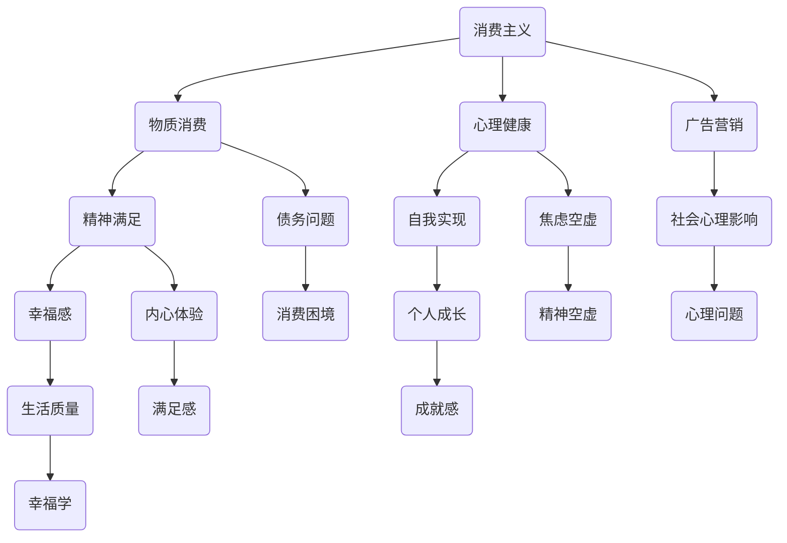
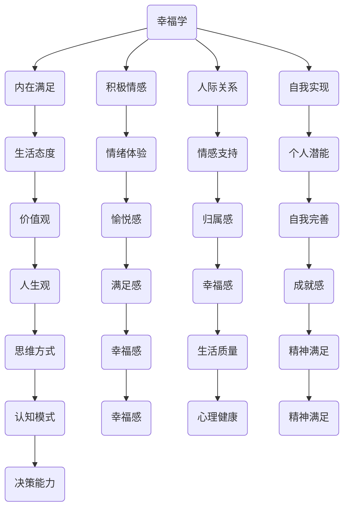

                 

### 背景介绍

在当今社会，物质财富的积累已成为衡量个体成功的重要标准。然而，随着消费主义的盛行，人们逐渐发现自己陷入了物质追求的漩涡，而精神层面的满足却日渐稀缺。这种现象不仅引发了心理健康问题，也促使人们开始思考如何在消费主义社会中寻找精神满足。

消费主义，是指一种以过度消费和物质享受为核心价值观的社会现象。在这种社会中，人们被引导着不断购买新产品、追求更高品质的生活，以满足自身的欲望和需求。然而，这种追求往往导致了过度消费、债务问题，甚至精神上的空虚和焦虑。

精神满足，则是一种超越物质层面的内心体验，通常与个人的内在情感、心理健康、人际关系等因素相关。在现代社会中，随着物质生活的改善，人们对精神满足的追求也越来越强烈。然而，如何在这种消费主义社会中实现精神满足，仍然是一个值得深入探讨的问题。

本文旨在通过对消费主义社会和个体精神需求的深入分析，探讨如何在这样的社会中寻找精神满足。我们将从以下几个方面进行讨论：

1. **消费主义社会下的精神状态**：分析消费主义如何影响个体的心理健康，以及这种影响背后的心理机制。
2. **精神满足的理论探讨**：介绍有关幸福学、自我实现理论等概念，探讨这些理论在理解精神满足方面的作用。
3. **实践方法与策略**：提供一些具体的实践方法和策略，帮助个体在消费主义社会中实现精神满足。
4. **结论与展望**：总结本文的主要观点，并对未来的发展趋势进行展望。

通过以上的结构设计，我们希望读者能够对消费主义社会和个体精神满足的关系有一个全面、深入的理解，从而找到适合自己的精神满足之道。

### 核心概念与联系

在探讨如何实现精神满足之前，我们需要明确一些核心概念，并理解它们之间的关系。以下是一些关键概念及其相互联系：

#### 1. 消费主义

消费主义是指一种社会文化现象，强调物质消费和消费行为的重要性。它不仅仅涉及个人购买商品和服务的行为，还包括广告、营销等商业手段对社会心理的影响。消费主义的核心在于通过物质财富的积累和消费来追求个人的满足和幸福感。

#### 2. 精神满足

精神满足是指个体在心理和情感上感受到的满足和幸福状态。这种满足并不完全依赖于物质财富的积累，而是更多地与个人的内在情感、心理健康、人际关系等因素相关。精神满足可以来源于自我实现、人际互动、个人成长等多个方面。

#### 3. 心理健康

心理健康是指个体在心理上的健康状态，包括情绪稳定、认知功能正常、适应能力强等。心理健康是精神满足的重要基础，一个心理健康的人更有可能感受到精神上的满足。

#### 4. 自我实现

自我实现是指个体在生活过程中，通过不断追求个人潜能的实现，达到自我完善和成长的状态。自我实现是精神满足的一个重要方面，它促使个体在精神层面上感受到满足和成就感。

#### 5. 幸福学

幸福学是研究幸福及其影响因素的学科。它探讨如何通过科学的方法提升个体的幸福感，包括心理、社会、经济等多个方面的因素。幸福学提供了理论框架，帮助我们理解如何在不同环境中实现精神满足。

#### 关系架构 Mermaid 流 Diagram

为了更好地理解这些概念之间的联系，我们可以使用Mermaid Diagram绘制一个关系架构图：

通过这个图，我们可以看到消费主义如何影响个体的物质消费和心理健康，进而影响精神满足和幸福感。同时，心理健康和自我实现是精神满足的重要基础，而幸福学则为提升幸福感提供了理论支持。

### 消费主义对心理健康的影响

消费主义在现代社会中扮演着举足轻重的角色，它不仅影响了人们的生活方式，还深刻地影响了个体的心理健康。首先，我们需要了解消费主义对心理健康的基本影响，包括积极的和消极的方面。

#### 消费主义的积极影响

消费主义在一定程度上可以提升个体的幸福感。首先，通过购买和拥有物质商品，个体可以获得即时的满足和快乐。这种满足感通常来源于新商品的吸引力和社会比较中的优越感。其次，消费行为可以作为一种逃避现实压力的手段，帮助个体暂时忘记生活中的烦恼和压力。

此外，消费主义还可以促进社会互动和社区建设。例如，通过参加购物活动或消费体验，人们可以建立新的社交关系，增强社区归属感。在某些情况下，消费行为甚至可以作为一种表达个人身份和价值观的方式，从而增强个体的自我认同感。

#### 消费主义的消极影响

然而，消费主义的消极影响同样不可忽视。首先，长期的过度消费会导致经济负担，使个体陷入债务困境。这不仅会引发财务压力，还可能导致焦虑、抑郁等心理问题。其次，消费主义强调物质拥有和社会比较，容易引发个体内心的焦虑和不满。例如，当人们看到他人拥有更好的物质条件时，可能会感到自卑和失落，从而影响心理健康。

此外，消费主义还可能导致精神空虚和孤独感。当个体过度依赖物质消费来追求幸福时，可能会忽视内心的情感需求。这种情感上的空虚感，可能导致个体在精神层面上感到不满足，甚至产生孤独感。

#### 心理机制分析

为了深入理解消费主义对心理健康的影响，我们需要探讨其背后的心理机制。

首先，从心理学角度来看，消费行为可以被视为一种逃避现实的方法。当个体面临生活中的压力和挑战时，他们可能会通过购物来逃避这些问题。购物活动中的即时满足感和愉悦感，可以暂时缓解个体的压力和焦虑。然而，这种逃避行为并不能从根本上解决问题，反而可能使问题进一步恶化。

其次，社会比较是影响心理健康的重要因素之一。消费主义强调物质拥有和社会比较，这使个体更容易进行社会比较。当个体看到他人拥有更好的物质条件时，他们可能会感到不满和自卑。这种社会比较心理，往往会导致个体在精神层面上感到不满足，从而影响心理健康。

此外，消费主义还可能导致个体内心的冲突和矛盾。例如，当个体追求物质财富时，可能会忽视内心的情感需求，从而导致内心的空虚和失落。这种内在的冲突和矛盾，可能会进一步加剧个体的焦虑和抑郁情绪。

#### 案例分析

为了更好地理解消费主义对心理健康的影响，我们可以通过一些真实的案例进行分析。

一个典型的案例是“购物成瘾”。购物成瘾是一种心理障碍，患者会因为无法控制购物欲望而导致严重的经济问题和心理健康问题。这种成瘾行为往往与个体内心的焦虑、空虚和孤独感有关。通过过度购物，患者可以暂时逃避这些问题，但长期来看，这种逃避行为只会使问题更加严重。

另一个案例是“社交媒体上的攀比现象”。在社交媒体上，人们往往会展示自己最好的一面，包括豪华的旅游照片、高档的购物物品等。这种展示行为容易引发观众的社会比较心理，使他们感到自卑和不满。这种现象在年轻人中尤为普遍，可能会导致心理健康问题，如焦虑、抑郁等。

总的来说，消费主义对心理健康的影响是多方面的，既有积极的方面，也有消极的方面。了解这些影响及其背后的心理机制，可以帮助我们更好地应对消费主义带来的挑战，实现精神层面的满足。

### 精神满足的理论探讨

在探讨如何实现精神满足之前，我们需要理解一些相关的理论和概念。幸福学、自我实现理论和马斯洛的需求层次理论，都是理解精神满足的重要工具。通过这些理论，我们可以更深入地理解精神满足的来源和实现方式。

#### 幸福学

幸福学是研究幸福感及其影响因素的学科。它关注如何通过科学的方法提升个体的幸福感。幸福学的核心观点是，幸福感不仅仅取决于物质条件，还包括心理、社会、文化等多个方面的因素。

幸福学认为，幸福感来源于以下几个方面：

1. **内在满足**：个体内心的平静和满足感，通常与个人的价值观和生活态度有关。这种满足感通常不依赖于外部的物质条件，而是与个体内心的感受相关。
2. **积极情感**：积极的情感体验，如快乐、满足和兴奋，是幸福感的重要来源。通过培养积极的心态和情绪，个体可以提高幸福感。
3. **人际关系**：良好的人际关系对幸福感有重要影响。与家人、朋友和同事建立积极的关系，可以帮助个体感受到情感上的支持和满足。
4. **自我实现**：个体通过追求个人潜能的实现，达到自我完善和成长的状态，可以获得深层次的精神满足。

#### 自我实现理论

自我实现理论是心理学中的一种理论，由美国心理学家马斯洛提出。马斯洛认为，人类的需求可以分为五个层次，从基本的生理需求到最高层次的自我实现需求。

1. **生理需求**：包括食物、水、睡眠等基本生理需求。
2. **安全需求**：包括安全感、健康保障和就业等。
3. **社交需求**：包括爱和被爱、友谊和归属感。
4. **尊重需求**：包括自尊、自信和受到他人的尊重。
5. **自我实现需求**：个体通过实现个人潜能，达到自我完善和成长的状态。

自我实现需求是最高层次的需求，也是实现精神满足的关键。通过追求自我实现，个体可以在精神层面上感受到满足和成就感。

#### 马斯洛的需求层次理论

马斯洛的需求层次理论，是一种关于人类需求的分层模型。根据这个理论，人类的需求可以分为五个层次，从基本的生理需求到最高层次的自我实现需求。每一层需求都必须得到满足，才能进入下一层次。

1. **生理需求**：这是人类最基本的需求，包括食物、水、睡眠等。
2. **安全需求**：在生理需求得到满足后，人类会追求安全需求，包括安全感、健康保障和就业等。
3. **社交需求**：当安全需求得到满足后，人类会追求社交需求，包括爱和被爱、友谊和归属感。
4. **尊重需求**：在社交需求得到满足后，人类会追求尊重需求，包括自尊、自信和受到他人的尊重。
5. **自我实现需求**：这是人类最高层次的需求，个体通过实现个人潜能，达到自我完善和成长的状态。

马斯洛的需求层次理论，为我们提供了一个理解人类需求和精神满足的框架。通过这个框架，我们可以看到，精神满足的实现需要从满足基本的生理需求开始，逐步向更高层次的需求发展。

#### 关系架构 Mermaid Diagram

为了更好地理解这些理论之间的关系，我们可以使用Mermaid Diagram绘制一个关系架构图：

通过这个图，我们可以看到幸福学、自我实现理论和马斯洛的需求层次理论之间的联系。幸福学强调内在满足、积极情感、人际关系和自我实现，而自我实现理论则将自我实现视为最高层次的需求。马斯洛的需求层次理论，为我们提供了一个从基本生理需求到最高层次自我实现需求的理解框架。

### 实践方法与策略

在了解了消费主义对心理健康的影响以及精神满足的理论探讨后，接下来我们将提供一些具体的实践方法和策略，帮助读者在消费主义社会中实现精神满足。这些方法涵盖了内在探索、增强个人韧性、社区支持和人际互动等多个方面。

#### 内在探索

内在探索是精神满足的重要途径。通过深入自我，我们可以更好地理解自己的需求和价值观，从而实现更深层次的精神满足。

1. **冥想和自我反思**：冥想是一种有效的内在探索方法，通过冥想，个体可以静下心来，聆听内心的声音。每天花一些时间进行冥想，有助于减少焦虑，增强内心的平静。自我反思则是通过思考自己的行为、感受和信念，来深入理解自己。

2. **日记写作**：通过写日记，个体可以将内心的感受和想法记录下来，这有助于更好地理解自己。在日记中，可以记录自己的情绪波动、思考过程和心得体会，从而逐渐找到内心的平衡点。

3. **探索自己的兴趣和激情**：找到自己真正感兴趣的事物，并投入其中，可以帮助个体找到精神上的满足。通过不断地尝试和探索，个体可以发现自己在不同领域的潜能和兴趣，从而实现自我价值的提升。

#### 增强个人韧性

个人韧性是指个体在面对挑战和压力时，能够迅速适应并恢复的能力。增强个人韧性可以帮助个体在消费主义社会中更好地应对压力，从而实现精神满足。

1. **设定目标和计划**：设定明确的目标和计划，有助于个体在实现目标的过程中获得成就感。通过分步骤地实现小目标，个体可以逐渐建立起自信和韧性。

2. **培养积极心态**：积极的心态可以帮助个体更好地应对生活中的挑战。通过积极地看待问题，个体可以找到解决问题的方法，从而减少焦虑和压力。

3. **学会放松和减压**：适当的放松和减压方法，如深呼吸、瑜伽、冥想等，可以帮助个体缓解压力，增强个人韧性。定期进行放松活动，有助于保持身心健康。

#### 社区支持与人际互动

社区支持和人际互动是精神满足的重要来源。通过与他人的互动，个体可以获得情感上的支持和满足。

1. **建立有意义的人际关系**：与他人建立深厚的友谊和人际关系，可以提供情感上的支持和安慰。通过共同的活动和交流，个体可以感受到归属感和价值感。

2. **参与社区活动**：参与社区活动，如志愿服务、社区会议等，可以帮助个体融入社区，增强归属感。通过为他人提供帮助和支持，个体可以获得成就感，从而提升精神满足感。

3. **培养合作精神**：与他人合作，共同完成任务，可以增强个体的团队合作能力。通过合作，个体可以学会倾听和理解他人，从而建立更深厚的人际关系。

#### 实践案例

以下是一个具体的实践案例，说明如何在日常生活中应用这些方法：

**案例**：李明是一名年轻的职场人士，他常常感到工作压力大，生活缺乏意义。为了实现精神满足，他采取了以下措施：

1. **内在探索**：李明开始每天花30分钟进行冥想和自我反思，通过这种方式，他逐渐找到了内心的平静，并明确了生活的目标。

2. **增强个人韧性**：李明设定了短期和长期的目标，并制定了详细的计划。通过逐步实现这些目标，他逐渐增强了自信和韧性。

3. **社区支持与人际互动**：李明加入了志愿者团队，定期参与社区活动。通过与团队成员的互动，他不仅感受到了归属感，还找到了自己的社会角色。

4. **培养兴趣和激情**：李明发现自己对摄影非常感兴趣，于是开始系统地学习摄影技巧。通过摄影，他不仅找到了精神上的满足，还结识了一群志同道合的朋友。

通过这些实践方法，李明在消费主义社会中找到了精神满足，生活也变得更加充实和有意义。

### 结论与展望

本文通过对消费主义社会和个体精神需求的深入分析，探讨了如何在这样的社会中寻找精神满足。我们首先介绍了消费主义和心理健康之间的关系，分析了消费主义如何影响个体的心理健康，并探讨了背后的心理机制。接着，我们探讨了幸福学、自我实现理论和马斯洛的需求层次理论，理解了这些理论在理解精神满足方面的作用。

在实践方法与策略部分，我们提供了一系列具体的实践方法，包括内在探索、增强个人韧性、社区支持与人际互动等，帮助读者在消费主义社会中实现精神满足。通过具体的案例，我们展示了这些方法在实际生活中的应用。

未来的研究方向可以进一步探讨不同文化背景下消费主义与精神满足的关系，以及如何通过政策和社会干预来改善个体的精神满足状态。此外，研究如何利用数字技术和人工智能来提高个体的精神满足感，也是一个值得关注的领域。

### 附录

#### 附录A: 参考文献

1. **理查德·泰特洛克（Richard Thaler）**，《行为金融学》（Misbehaving: The Making of Behavioral Economics）
2. **马丁·塞利格曼（Martin Seligman）**，《真实的幸福》（Authentic Happiness: Using the New Positive Psychology to Realize Your Potential for Lasting Fulfillment）
3. **马斯洛（Abraham Maslow）**，《动机与个性》（Motivation and Personality）
4. **爱德华·L·德西（Edward L. Deci）和理查德·瑞安（Richard Ryan）**，《自我决定论》（Self-Determination Theory: Basic Psychological Needs in Motivation, Development, and Health）
5. **菲利普·库利昂（Philippe A. Civilotti）**，《幸福心理学》（Positive Psychology: Theory, Research, and Practice）
6. **托马斯·古斯塔夫·马斯（Thomas G. Musil）**，《消费主义的阴影》（Consuming Desires: Markets, Power, and the Social Logic of Dependency）

#### 附录B: 推荐阅读

1. **《消费社会》（La Société de Consommation）** - 让·鲍德里亚（Jean Baudrillard）
2. **《精神分析的四个基本概念》** - 雅克·拉康（Jacques Lacan）
3. **《焦虑的时代》** - 阿尔弗雷德·阿德勒（Alfred Adler）
4. **《幸福之路》** - 米哈里·契克森米哈伊（Mihaly Csikszentmihalyi）
5. **《消费主义与自我认同》** - 帕特里克·贝尔（Patrick Belien）

#### 附录C: 相关术语解释

1. **消费主义（Consumerism）**：一种社会文化现象，强调物质消费和消费行为的重要性。
2. **心理健康（Mental Health）**：个体在心理上的健康状态，包括情绪稳定、认知功能正常、适应能力强等。
3. **精神满足（Spiritual Fulfillment）**：个体在心理和情感上感受到的满足和幸福状态，通常与个人的内在情感、心理健康、人际关系等因素相关。
4. **幸福学（Happiness Studies）**：研究幸福及其影响因素的学科，关注如何通过科学的方法提升个体的幸福感。
5. **自我实现（Self-Actualization）**：个体通过实现个人潜能，达到自我完善和成长的状态。
6. **马斯洛的需求层次理论（Maslow's Hierarchy of Needs）**：一种关于人类需求的分层模型，将人类的需求分为五个层次，从基本的生理需求到最高层次的自我实现需求。
7. **社会比较（Social Comparison）**：个体通过与他人进行比较来评估自己的社会地位和自我价值。
8. **内在满足（Intrinsic Satisfaction）**：个体内心的平静和满足感，通常与个人的价值观和生活态度有关。

