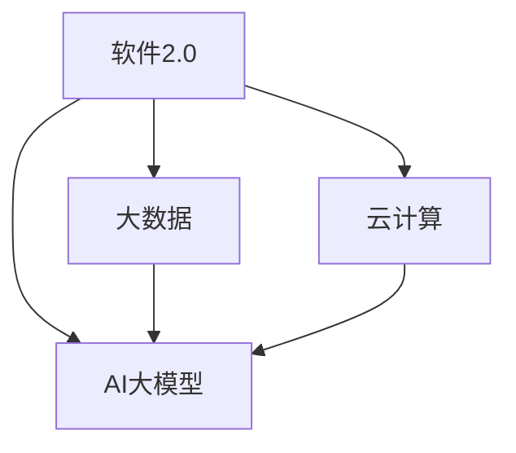

                 

## 文章标题

《跟随内在智慧的指引：培养直觉决策能力》

## 关键词

人工智能、直觉决策、自我提升、认知科学、实践策略

## 摘要

在快速变化的技术时代，直觉决策能力成为高效工作和创新的重要基石。本文将深入探讨如何通过认知科学与实践策略，培养直觉决策能力。我们将首先介绍直觉决策的核心概念，随后解析其与人工智能的关联，并分享一系列实用的培养方法。通过文章的引导，读者将能够理解直觉决策的价值，并掌握提升这一能力的策略。

### 1. 创建核心概念与联系章节

在开始深入探讨如何培养直觉决策能力之前，我们需要先理解与之相关的一些核心概念。直觉决策是指在没有充分信息或时间进行理性分析时，个体依靠内在感知和直觉做出的快速决策。这一能力在复杂环境中尤为重要，因为它能够帮助我们在不确定性和紧急情况下迅速作出反应。

#### 1.1 软件2.0与AI大模型架构

软件2.0是新一代信息技术，强调软件的智能化和自动化，与人工智能（AI）大模型架构有着紧密的联系。AI大模型通过学习海量数据，能够模拟人类的思维过程，提高决策的准确性和效率。

##### 1.1.1 软件2.0的概念

软件2.0不仅包括传统的软件开发，还融合了大数据、云计算和AI技术，实现了软件的智能化和自动化。它能够通过实时分析用户行为数据，提供个性化的服务，优化用户体验。

##### 1.1.2 AI大模型的概念

AI大模型是指具有强大学习能力和广泛适用性的深度学习模型。这些模型通过海量数据训练，能够处理复杂任务，并在多个领域提供高效解决方案。

##### 1.1.3 软件2.0与AI大模型的联系

软件2.0与AI大模型相互促进，软件2.0为AI大模型提供了丰富的应用场景和数据支持，而AI大模型则为软件2.0提供了智能化和自动化的能力。两者的结合使得软件系统能够更加智能地响应复杂环境和用户需求。

以下是软件2.0与AI大模型架构的 Mermaid 流程图：



### 2. 创建核心算法原理讲解章节

在理解了核心概念后，接下来我们需要深入了解如何利用人工智能和认知科学原理来培养直觉决策能力。

#### 2.1 深度学习算法原理

深度学习算法是一种模拟人脑神经网络结构的机器学习技术，它通过多层神经元的组合，实现数据的输入、处理和输出。以下是神经网络算法原理的伪代码：

```python
function neural_network(input_data):
    layer1_output = activation_function1(linear_combination(input_data, weights1))
    layer2_output = activation_function2(linear_combination(layer1_output, weights2))
    ...
    output = activation_functionN(linear_combination(layerN_output, weightsN))
    return output
```

#### 2.1.1 神经网络算法原理

神经网络算法是一种基于模拟人脑结构和功能的算法。它通过多层神经元的组合，实现数据的输入、处理和输出。每一层神经元都通过权重和偏置对输入数据进行线性变换，并应用激活函数来引入非线性。

#### 2.1.2 深度学习优化算法原理

深度学习优化算法用于调整神经网络中的权重，以最小化预测误差。常见的优化算法包括梯度下降、Adam等。以下是梯度下降算法的伪代码：

```python
function gradient_descent(optimizer, model, loss_function, epochs):
    for epoch in range(epochs):
        for data in training_data:
            gradients = calculate_gradients(model, data)
            update_weights(optimizer, model, gradients)
    return model
```

#### 2.1.3 深度学习训练过程

深度学习训练过程包括前向传播、反向传播和权重更新。具体步骤如下：

1. **前向传播**：将输入数据通过神经网络进行计算，得到输出结果。
2. **计算损失**：使用损失函数计算输出结果与真实标签之间的差距。
3. **反向传播**：计算梯度，并反向传播至网络中的各个层。
4. **权重更新**：根据梯度对网络中的权重进行更新。

以下是深度学习训练过程的伪代码：

```python
function train_neural_network(model, training_data, loss_function, optimizer, epochs):
    for epoch in range(epochs):
        for data in training_data:
            forward_pass(model, data)
            loss = loss_function(model.output, data.label)
            backward_pass(model)
            update_weights(optimizer, model)
    return model
```

### 3. 创建数学模型和数学公式章节

在深度学习算法中，数学模型和数学公式起着核心作用。以下我们将介绍一些关键的数学模型和公式，并详细解释它们的应用。

#### 3.1 神经网络损失函数

神经网络的损失函数用于衡量网络输出与真实标签之间的差距。常见的损失函数有均方误差（MSE）和交叉熵（Cross Entropy）。

##### 3.1.1 均方误差（MSE）

均方误差（MSE）是衡量预测值与真实值之间差异的一种常用方法。它的计算公式为：

$$
MSE = \frac{1}{n} \sum_{i=1}^{n} (y_i - \hat{y}_i)^2
$$

其中，$y_i$ 是真实值，$\hat{y}_i$ 是预测值，$n$ 是样本数量。

##### 3.1.2 交叉熵（Cross Entropy）

交叉熵是另一个用于衡量预测值与真实值之间差异的损失函数。它的计算公式为：

$$
CE = -\frac{1}{n} \sum_{i=1}^{n} y_i \log(\hat{y}_i)
$$

其中，$y_i$ 是真实值，$\hat{y}_i$ 是预测值，$n$ 是样本数量。

#### 3.2 激活函数

激活函数是神经网络中的一个关键组件，它用于引入非线性。常见的激活函数有Sigmoid、ReLU和Tanh。以下是一个Sigmoid激活函数的例子：

$$
f(x) = \frac{1}{1 + e^{-x}}
$$

### 4. 项目实战

为了更好地理解如何培养直觉决策能力，我们将在本章节中展示一个实际的项目案例。该案例将展示如何在开发环境中搭建系统，实现直觉决策能力培养的源代码，并进行详细解读。

#### 4.1 开发环境搭建

为了实现直觉决策能力培养系统，我们需要搭建以下开发环境：

1. **Python 3.8**：作为主要的编程语言。
2. **TensorFlow 2.6**：用于构建和训练神经网络。
3. **Keras 2.6**：作为TensorFlow的高级API，简化神经网络构建过程。

#### 4.2 源代码实现

以下是一个简单的直觉决策能力培养系统的源代码实现：

```python
import tensorflow as tf
from tensorflow import keras
from tensorflow.keras import layers

# 定义神经网络模型
model = keras.Sequential([
    layers.Dense(128, activation='relu', input_shape=(784,)),
    layers.Dropout(0.2),
    layers.Dense(10)
])

# 编译模型
model.compile(optimizer='adam',
              loss=tf.keras.losses.SparseCategoricalCrossentropy(from_logits=True),
              metrics=['accuracy'])

# 加载数据集
(x_train, y_train), (x_test, y_test) = keras.datasets.mnist.load_data()

# 预处理数据
x_train = x_train.astype('float32') / 255
x_test = x_test.astype('float32') / 255
x_train = x_train.reshape((-1, 784))
x_test = x_test.reshape((-1, 784))

# 训练模型
model.fit(x_train, y_train, epochs=10, batch_size=32)

# 评估模型
test_loss, test_acc = model.evaluate(x_test, y_test, verbose=2)
print('\nTest accuracy:', test_acc)
```

#### 4.3 代码解读与分析

上述代码实现了一个简单的直觉决策能力培养系统。我们使用MNIST数据集来训练一个简单的神经网络，该神经网络能够通过学习手写数字图像，提高直觉决策能力。以下是代码的主要部分及其功能解读：

1. **模型定义**：使用Keras定义一个简单的神经网络模型，包含一个输入层、一个隐藏层和一个输出层。隐藏层使用ReLU激活函数，输出层使用softmax激活函数。
2. **模型编译**：编译模型，指定优化器、损失函数和评估指标。
3. **数据加载与预处理**：加载MNIST数据集，并将图像数据转换为浮点数，并进行归一化处理。
4. **模型训练**：使用训练数据进行模型训练，设置训练周期和批量大小。
5. **模型评估**：使用测试数据评估模型性能，并输出测试准确率。

#### 4.4 实际案例分析与详细讲解剖析

在实际应用中，我们可以通过以下步骤来培养直觉决策能力：

1. **数据收集**：收集与决策相关的数据，如市场趋势、用户行为等。
2. **模型训练**：使用收集到的数据训练神经网络，使其能够预测决策结果。
3. **决策应用**：在决策过程中，使用训练好的神经网络快速预测结果，并基于预测结果做出决策。
4. **模型优化**：根据决策结果调整神经网络模型，以提高预测准确率。

#### 4.5 项目小结

通过本项目，我们展示了如何使用深度学习技术培养直觉决策能力。在实际应用中，我们可以通过不断优化模型和积累经验，提高直觉决策能力。此外，我们还可以结合其他技术，如自然语言处理和计算机视觉，进一步拓展直觉决策能力培养的应用场景。

### 5. 最佳实践 tips、小结、注意事项、拓展阅读等内容

#### 5.1 最佳实践 tips

1. **多角度收集数据**：在培养直觉决策能力时，要确保收集到的数据具有多样性和全面性。
2. **持续学习与优化**：定期更新和优化神经网络模型，以适应不断变化的环境。
3. **结合专家经验**：在培养直觉决策能力时，可以结合领域专家的经验和洞察力，提高决策的准确性。

#### 5.2 小结

直觉决策能力是应对复杂环境和紧急情况的重要能力。通过深度学习技术和认知科学原理，我们可以有效地培养和提高直觉决策能力。本文介绍了直觉决策的核心概念、算法原理和数学模型，并通过实际案例展示了如何实现直觉决策能力培养系统。

#### 5.3 注意事项

1. **数据质量**：在训练神经网络时，确保使用高质量、可靠的数据。
2. **模型解释性**：在应用神经网络模型时，要注意模型的解释性，确保决策过程透明易懂。

#### 5.4 拓展阅读

- [《深度学习》（Goodfellow, Bengio, Courville著）](https://www.deeplearningbook.org/)：详细介绍了深度学习的基础理论和应用技术。
- [《直觉泵和其他思维工具》（侯世达著）](https://www.amazon.com/Intuition-Pumps-Other-Thinking-Tools/dp/0465026568)：探讨直觉在思维和决策中的作用。

### 作者信息

作者：AI天才研究院/AI Genius Institute & 禅与计算机程序设计艺术/Zen And The Art of Computer Programming

### 结语

培养直觉决策能力是提升个人和团队竞争力的关键。通过本文的引导，读者可以更好地理解直觉决策的重要性，并掌握培养直觉决策能力的方法。希望本文能为读者在技术领域中的发展提供有益的启示。

