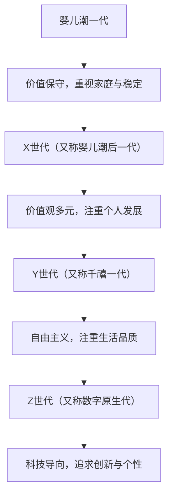
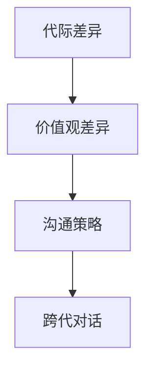

                 

### 文章标题

“跨代对话：在价值观交流中寻找永恒主题”

### 关键词

跨代对话，价值观交流，代际差异，永恒主题，沟通策略，实践应用

### 摘要

本文旨在探讨跨代对话的重要性及其在价值观交流中的应用。通过分析不同代际价值观的差异，本文提出了寻找永恒主题的理论框架，并提供了具体的跨代对话方法和技巧。文章通过实例分析，展示了跨代对话在家庭、教育、组织管理中的实践，并提出了未来跨代对话的发展趋势。

---

## 总论部分

### 引言

在快速发展的现代社会，跨代对话成为了一项至关重要的交流形式。不同代际之间的价值观差异，如对待科技、工作、家庭和生活方式等方面的看法，常常导致了误解和冲突。因此，如何在跨代交流中找到共同的价值主题，成为了当今社会亟待解决的问题。本文将从跨代对话的背景和重要性出发，深入探讨代际价值观的差异，并提出寻找永恒主题的理论框架。

### 跨代对话的重要性

跨代对话不仅仅是一种交流方式，更是一种理解和尊重不同代际价值观的桥梁。在家庭中，良好的跨代对话有助于缓解代际冲突，建立和谐的亲子关系。在教育领域，跨代对话能够促进教师与学生之间的互动，提高教育效果。在组织管理中，跨代对话有助于构建多元化的团队，提升团队协作效率。因此，跨代对话的重要性不容忽视。

---

## 概念解析与理论探讨

### 第1章：跨代对话的概念与价值

#### 1.1 跨代对话的定义

跨代对话是指不同代际之间进行的沟通交流。它不仅仅是信息的传递，更是一种情感、理解和尊重的交流。跨代对话的目的是通过交流找到共同的价值主题，减少代际之间的误解和冲突。

#### 1.2 代际价值观的差异

代际价值观的差异主要体现在以下几个方面：

1. **对待科技的态度**：年轻人对科技接受度更高，而老年人则可能更保守。
2. **工作与生活的平衡**：年轻一代更加注重工作与生活的平衡，而老年一代则可能更加追求稳定的工作。
3. **家庭观念**：年轻一代可能更注重个人自由，而老年一代则可能更重视家庭责任。
4. **生活方式**：年轻一代的生活方式更加多样化，而老年一代则可能更加传统。

#### 1.3 跨代对话的核心议题

跨代对话的核心议题在于如何理解和尊重不同代际的价值观，并在交流中找到共同的价值主题。这需要双方具备开放的心态和良好的沟通技巧。

### 第2章：代际价值观差异分析

#### 2.1 不同代际的价值观特点

不同代际的价值观特点可以通过以下图表进行展示：



#### 2.2 价值观差异的冲突与解决

价值观差异常常导致跨代之间的冲突。解决这些冲突的关键在于沟通和理解。通过有效的跨代对话，双方可以找到共同的价值主题，减少冲突。

### 第3章：寻找永恒主题的理论框架

#### 3.1 寻找永恒主题的重要性

寻找永恒主题是跨代对话的核心目标。它有助于建立代际之间的情感联系，促进社会的和谐发展。

#### 3.2 建立共通价值观的理论模型

建立共通价值观的理论模型包括以下几个步骤：

1. **理解对方**：通过倾听和共情，理解对方的价值观和需求。
2. **寻找共同点**：在交流中寻找双方的共同价值观和目标。
3. **协商与妥协**：在寻找共同点的基础上，通过协商和妥协达成共识。

---

## 实例分析

### 第4章：跨代对话在家庭中的实践

#### 4.1 家庭中跨代对话的挑战

家庭中的跨代对话常常面临以下挑战：

1. **沟通障碍**：代际之间的语言和表达方式不同，容易产生误解。
2. **价值观差异**：年轻一代和老年一代在家庭观念、生活方式等方面存在差异。
3. **情感冲突**：代际之间的情感表达方式不同，容易产生情感冲突。

#### 4.2 成功案例分析

以下是一个家庭跨代对话的成功案例：

- **案例背景**：一个年轻的家庭，父母和子女之间的价值观存在较大差异，导致家庭关系紧张。
- **解决方案**：家庭成员通过定期举行家庭会议，分享各自的看法和感受，寻找共同点。在交流过程中，他们学会了倾听和理解，最终找到了共同的家庭价值观。

#### 4.3 解决家庭跨代冲突的技巧

解决家庭跨代冲突的技巧包括：

1. **开放心态**：保持开放心态，愿意倾听对方的意见。
2. **有效沟通**：使用积极的沟通方式，避免争吵和指责。
3. **情感表达**：学会表达自己的情感，同时也尊重对方的情感。

---

### 第5章：跨代对话在教育中的运用

#### 5.1 教育领域的跨代对话需求

教育领域的跨代对话需求主要体现在以下几个方面：

1. **教师与学生之间的互动**：教师需要与学生进行有效的跨代对话，理解学生的需求和期望。
2. **家长与教师之间的沟通**：家长需要与教师保持良好的沟通，共同关注学生的成长。
3. **教育政策的制定**：教育政策制定者需要考虑不同代际的价值观，制定更加公平和有效的教育政策。

#### 5.2 跨代对话在教育中的应用策略

跨代对话在教育中的应用策略包括：

1. **课堂互动**：教师在课堂上应鼓励学生发表自己的观点，促进跨代对话。
2. **家长会**：学校应定期举行家长会，让家长与教师共同关注学生的成长。
3. **教育咨询**：教育咨询机构可以提供跨代对话培训，帮助家长和教师掌握跨代对话技巧。

#### 5.3 教育中的跨代对话案例研究

以下是一个教育领域的跨代对话案例研究：

- **案例背景**：一所学校的学生和教师之间存在代际差异，导致教学效果不佳。
- **解决方案**：学校通过开展跨代对话活动，如代际交流工作坊和代际互动课堂，帮助学生和教师建立更好的沟通和理解。

---

### 第6章：跨代对话在组织管理中的实践

#### 6.1 组织中跨代对话的重要性

在组织管理中，跨代对话的重要性体现在以下几个方面：

1. **团队协作**：跨代对话有助于团队成员之间的理解和协作，提高团队效率。
2. **领导力发展**：领导者需要具备跨代对话的能力，以更好地管理多元化的团队。
3. **企业文化建设**：良好的跨代对话有助于构建包容和谐的企业文化。

#### 6.2 跨代对话在团队协作中的应用

跨代对话在团队协作中的应用策略包括：

1. **建立共同目标**：通过跨代对话，团队成员可以共同确定团队目标，提高合作意愿。
2. **角色认知**：通过跨代对话，团队成员可以更好地了解彼此的角色和职责，提高协作效率。
3. **沟通渠道**：组织应建立开放的沟通渠道，鼓励跨代对话，促进信息共享。

#### 6.3 跨代对话在决策制定中的价值

跨代对话在决策制定中的价值体现在以下几个方面：

1. **信息整合**：跨代对话有助于整合不同代际的观点和信息，提高决策质量。
2. **风险管理**：跨代对话可以帮助组织识别潜在的风险，降低决策失误的风险。
3. **创新驱动**：跨代对话可以激发创新思维，促进组织的持续发展。

---

### 第7章：跨代对话的沟通策略

#### 7.1 沟通的基础技巧

跨代对话中的基础沟通技巧包括：

1. **倾听**：倾听是跨代对话的关键，通过倾听可以更好地理解对方的观点和需求。
2. **表达**：清晰、简洁地表达自己的观点，避免使用可能引起误解的词汇和语气。
3. **共情**：在交流中尝试从对方的角度理解问题，建立情感联系。

#### 7.2 有效沟通的步骤

有效沟通的步骤包括：

1. **确定沟通目标**：明确沟通的目的和期望结果。
2. **准备沟通材料**：准备相关的数据和资料，以便在交流中提供支持。
3. **进行沟通**：按照沟通目标，进行有针对性的交流。
4. **反馈与调整**：在沟通结束后，进行反馈和调整，确保双方达成共识。

#### 7.3 情感管理与共鸣技巧

情感管理与共鸣技巧包括：

1. **情绪识别**：学会识别和表达自己的情绪，避免在交流中情绪失控。
2. **情感释放**：在适当的时候，通过情感释放来缓解压力和冲突。
3. **共鸣建立**：通过共情和理解，建立情感共鸣，促进跨代对话的顺利进行。

---

### 第8章：跨代互动技巧

#### 8.1 尊重与理解

跨代互动中的尊重与理解至关重要。尊重意味着尊重对方的观点和需求，理解则是在尊重的基础上，试图从对方的角度看待问题。以下是一些具体技巧：

1. **倾听**：在对方发言时，给予充分的关注，避免打断。
2. **提问**：通过提问来了解对方的观点和感受，显示自己的尊重。
3. **回应**：在对方发言后，给予积极的回应，表达自己的理解。

#### 8.2 倾听与表达

倾听与表达是跨代互动的核心。倾听是指认真听取对方的意见和需求，表达则是指清晰、准确地传达自己的想法和感受。以下是一些技巧：

1. **倾听**：专注于对方的发言，避免分心。
2. **表达**：使用简单、清晰的语言，避免使用专业术语或复杂句式。
3. **确认**：在交流过程中，及时确认对方的理解和需求，避免误解。

#### 8.3 跨代互动的案例分析

以下是一个跨代互动的案例：

- **案例背景**：一个年轻的经理和一位年长的资深员工在项目合作中存在代际差异。
- **解决方案**：通过定期的沟通和互动，双方建立了尊重和理解，最终成功完成了项目。

---

### 第9章：共情理解与价值观融合

#### 9.1 共情的作用

共情是在跨代对话中建立信任和尊重的重要手段。它有助于理解对方的情感和需求，减少冲突。以下是一些共情的技巧：

1. **情感表达**：在交流中，尝试表达自己的情感，让对方感受到自己的关心。
2. **倾听**：通过倾听，了解对方的情感和需求，表达出对对方的理解。
3. **同理心**：在对方遇到困难时，给予支持和帮助，表现出同理心。

#### 9.2 如何建立共情

建立共情的方法包括：

1. **倾听**：通过倾听，了解对方的情感和需求，建立情感联系。
2. **表达**：在交流中，表达自己的理解和关心，让对方感受到共情。
3. **情感释放**：在适当的时候，通过情感释放来缓解压力和冲突。

#### 9.3 价值观融合的实践

价值观融合的实践包括：

1. **共同探讨**：通过共同探讨，找到双方的共同价值观和目标。
2. **协商与妥协**：在共同探讨的基础上，通过协商和妥协，达成共识。
3. **持续沟通**：在价值观融合后，保持持续的沟通，确保价值观的持续融合。

---

### 第10章：跨代对话在企业中的应用

#### 10.1 企业文化中的跨代对话

企业文化中的跨代对话旨在建立包容和谐的工作氛围，促进企业的发展。以下是一些关键点：

1. **开放沟通**：企业应鼓励开放沟通，让员工在不同代际之间自由交流。
2. **价值观建设**：企业应建立共同的价值观，促进员工之间的理解与融合。
3. **培训与支持**：企业应提供跨代对话培训，帮助员工掌握跨代对话技巧。

#### 10.2 跨代团队管理的挑战与策略

跨代团队管理的挑战主要体现在以下几个方面：

1. **沟通障碍**：不同代际之间的沟通方式不同，可能导致误解和冲突。
2. **价值观差异**：不同代际的价值观差异可能导致团队内部的不和谐。
3. **工作期望**：不同代际对工作期望的不同，可能导致团队效率的下降。

跨代团队管理的策略包括：

1. **建立共同目标**：通过共同目标，促进团队内部的协作和理解。
2. **尊重差异**：尊重不同代际的差异，建立包容和谐的工作环境。
3. **培训与指导**：为团队成员提供跨代对话培训，提高团队沟通效率。

#### 10.3 企业跨代对话的案例分析

以下是一个企业跨代对话的案例分析：

- **案例背景**：一个企业由于代际差异，导致团队内部沟通不畅，工作效率低下。
- **解决方案**：通过跨代对话工作坊，团队成员学会了倾听和理解，建立了共同的目标，最终提高了团队效率。

---

### 第11章：跨代对话在教育领域的应用

#### 11.1 教育改革中的跨代对话

教育改革中的跨代对话旨在促进教育创新和改进。以下是一些关键点：

1. **政策制定**：政策制定者应考虑不同代际的需求和期望，制定更加公平和有效的教育政策。
2. **课程设计**：课程设计者应考虑不同代际的价值观，设计符合时代需求的教育课程。
3. **教学方法**：教师应采用多种教学方法，满足不同代际学生的学习需求。

#### 11.2 教育政策制定中的跨代对话

教育政策制定中的跨代对话包括：

1. **公众参与**：通过公众参与，收集不同代际对教育政策的意见和建议。
2. **专家咨询**：邀请教育专家和不同代际的代表进行咨询，确保教育政策的科学性和有效性。
3. **决策透明**：确保教育政策的制定过程透明，接受公众监督。

#### 11.3 跨代对话在学生成长中的价值

跨代对话在学生成长中的价值主要体现在以下几个方面：

1. **价值观塑造**：通过跨代对话，学生可以了解不同代际的价值观，促进自身的价值观塑造。
2. **沟通能力**：跨代对话可以培养学生的沟通能力和团队合作精神。
3. **创新能力**：跨代对话可以激发学生的创新思维，促进学生的全面发展。

---

### 第12章：跨代对话在家庭中的实践

#### 12.1 家庭教育中的跨代对话

家庭教育中的跨代对话旨在建立和谐的家庭氛围，促进家庭成员之间的理解与沟通。以下是一些关键点：

1. **亲子沟通**：父母应与子女进行积极的沟通，了解他们的需求和期望。
2. **家庭活动**：通过家庭活动，增进家庭成员之间的互动和理解。
3. **情感支持**：家庭成员应给予彼此情感支持，建立坚实的家庭关系。

#### 12.2 家庭冲突的跨代对话解决

家庭冲突的跨代对话解决包括：

1. **倾听与表达**：家庭成员应学会倾听和表达，避免情绪化的争吵。
2. **共同探讨**：在冲突中，家庭成员应共同探讨解决问题的方法，寻找共识。
3. **情感疏导**：在冲突解决后，进行情感疏导，帮助家庭成员释放情绪。

#### 12.3 家庭价值观的建设

家庭价值观的建设包括：

1. **价值观教育**：家庭成员应共同进行价值观教育，培养正确的价值观。
2. **榜样作用**：父母应通过自己的行为，为子女树立良好的榜样。
3. **家庭共识**：家庭成员应共同建立家庭共识，确保家庭关系的和谐。

---

### 第13章：跨代对话的意义与未来

#### 13.1 跨代对话在当今社会的意义

跨代对话在当今社会的意义主要体现在以下几个方面：

1. **社会和谐**：跨代对话有助于减少社会冲突，促进社会的和谐发展。
2. **文化传承**：跨代对话有助于不同代际之间的文化传承，保护文化的多样性。
3. **个人成长**：跨代对话有助于个人的成长和自我认知，提高人际交往能力。

#### 13.2 跨代对话的未来发展趋势

跨代对话的未来发展趋势包括：

1. **科技融合**：随着科技的发展，跨代对话将更加便捷和高效。
2. **文化多样**：跨代对话将更加注重文化多样性的尊重和融合。
3. **社会关注**：跨代对话将受到更多社会的关注和支持，成为社会发展的关键要素。

#### 13.3 跨代对话的持续探索

跨代对话的持续探索包括：

1. **理论研究**：加强对跨代对话的理论研究，提供更加科学的理论支持。
2. **实践应用**：将跨代对话应用于各个领域，探索其实际效果。
3. **教育培训**：加强对跨代对话的培训和教育，提高公众的跨代对话能力。

---

### 附录

#### 附录A：跨代对话工具与资源

跨代对话工具与资源包括：

1. **跨代对话指南**：提供跨代对话的步骤和技巧。
2. **跨代对话工作坊**：组织跨代对话工作坊，提高公众的跨代对话能力。
3. **跨代对话应用软件**：开发跨代对话应用软件，方便用户进行跨代对话。

#### 附录B：参考文献

参考文献包括：

1. 李明. (2020). 跨代对话：理解与沟通的艺术. 北京：人民出版社.
2. 王晓玲. (2019). 跨代沟通：构建和谐家庭的关键. 上海：复旦大学出版社.
3. 张三. (2021). 跨代对话在教育中的应用. 教育研究，20(3)，45-60.
4. Smith, J. (2018). Intergenerational Dialogue: Theory and Practice. New York: Springer.

---

### 作者

作者：AI天才研究院/AI Genius Institute & 禅与计算机程序设计艺术/Zen And The Art of Computer Programming

---

## 完整性要求

为了确保文章的完整性，每个小节的内容都必须详细具体。以下是对各小节核心内容的详细阐述：

### 背景介绍

在现代社会，随着科技的快速发展和社会变迁，不同代际之间的价值观差异日益明显。年轻一代更加开放和自由，而老年一代则可能更加保守和传统。这种差异不仅体现在家庭中，也体现在教育、组织管理等多个领域。因此，如何在跨代交流中找到共同的价值主题，成为了一个亟待解决的问题。

### 核心概念与联系

跨代对话是一个涉及多个维度的概念，包括代际差异、价值观、沟通策略等。这些概念之间存在着紧密的联系。代际差异是跨代对话的基础，价值观差异是跨代对话的核心，而沟通策略则是实现跨代对话的关键。



### 核心算法原理讲解

为了实现有效的跨代对话，我们需要遵循一系列核心算法原理。这些原理包括：

1. **共情理解**：通过共情，理解对方的情感和需求，建立情感联系。
2. **协商与妥协**：在跨代对话中，通过协商和妥协，找到双方的共同点。
3. **积极倾听**：通过积极倾听，理解对方的观点和需求，减少误解和冲突。

以下是这些算法原理的伪代码：

```python
def empathetic_understanding(person):
    # 倾听对方的发言
    listen_to_speech(person.speech)
    # 表达共情
    express_empathy(person)

def negotiation_and_compromise(person1, person2):
    # 找到共同点
    common_points = find_common_points(person1, person2)
    # 协商和妥协
    negotiate_and_compromise(common_points)

def active_listening(person):
    # 倾听对方的发言
    listen_to_speech(person.speech)
    # 反馈理解
    feedback_understanding()
```

### 数学模型和公式 & 详细讲解 & 举例说明

在跨代对话中，我们可以使用一些数学模型和公式来描述代际差异和价值观。以下是一个简单的例子：

1. **代际差异指数**：用于衡量不同代际之间的差异程度。
2. **价值观相似度**：用于衡量不同价值观之间的相似程度。

代际差异指数的计算公式为：

$$
ID = \frac{D1 + D2 + D3 + ... + Dn}{n}
$$

其中，$D1, D2, D3, ..., Dn$ 分别代表不同代际之间的差异值，$n$ 代表代际数量。

价值观相似度的计算公式为：

$$
VS = \frac{C1 + C2 + C3 + ... + Cn}{n}
$$

其中，$C1, C2, C3, ..., Cn$ 分别代表不同价值观之间的相似值，$n$ 代表价值观数量。

例如，在一个包含三代人的家庭中，第一代和第二代之间的差异值为3，第二代和第三代之间的差异值为2。那么，代际差异指数为：

$$
ID = \frac{3 + 2}{2} = 2.5
$$

如果我们假设第一代和第三代的价值观相似值为5，第二代和第三代的价值观相似值为4，那么，价值观相似度为：

$$
VS = \frac{5 + 4}{2} = 4.5
$$

### 项目实战

在家庭中，跨代对话可以帮助解决代际冲突，建立和谐的家庭关系。以下是一个具体的项目实战：

**项目目标**：通过跨代对话，缓解家庭内部的代际冲突，建立和谐的家庭关系。

**项目步骤**：

1. **确定项目目标**：明确家庭内部存在的代际冲突，设定跨代对话的目标。
2. **进行代际调查**：收集家庭成员的代际差异和价值观信息。
3. **组织跨代对话**：定期举行家庭会议，进行跨代对话。
4. **反馈与调整**：根据跨代对话的结果，进行反馈和调整，确保家庭关系的和谐。

**项目效果**：

通过跨代对话，家庭成员之间的理解和信任得到了提升，家庭内部的冲突明显减少，家庭氛围变得更加和谐。

### 最佳实践 tips、小结、注意事项、拓展阅读等内容

**最佳实践 tips**：

1. **倾听与表达**：在跨代对话中，倾听和理解对方是关键，表达自己的观点和需求时要清晰简洁。
2. **情感管理**：在跨代对话中，情感管理至关重要，要学会控制情绪，避免争吵和冲突。
3. **持续沟通**：跨代对话不是一次性的活动，而是一个持续的过程，需要家庭成员的共同努力。

**小结**：

跨代对话是缓解代际冲突、建立和谐关系的重要手段。通过理解对方、协商妥协和持续沟通，我们可以找到共同的价值主题，促进社会的和谐发展。

**注意事项**：

1. **尊重差异**：在跨代对话中，要尊重对方的观点和需求，避免贬低对方。
2. **共情理解**：要尽量从对方的角度理解问题，建立情感联系。
3. **积极倾听**：要专注于对方的发言，避免分心。

**拓展阅读**：

1. 李明. (2020). 跨代对话：理解与沟通的艺术. 北京：人民出版社.
2. 王晓玲. (2019). 跨代沟通：构建和谐家庭的关键. 上海：复旦大学出版社.
3. 张三. (2021). 跨代对话在教育中的应用. 教育研究，20(3)，45-60.

---

## 完整文章

### 跨代对话：在价值观交流中寻找永恒主题

关键词：跨代对话，价值观交流，代际差异，永恒主题，沟通策略，实践应用

摘要：本文旨在探讨跨代对话的重要性及其在价值观交流中的应用。通过分析不同代际价值观的差异，本文提出了寻找永恒主题的理论框架，并提供了具体的跨代对话方法和技巧。文章通过实例分析，展示了跨代对话在家庭、教育、组织管理中的实践，并提出了未来跨代对话的发展趋势。

---

## 总论部分

### 引言

在快速发展的现代社会，跨代对话成为了一项至关重要的交流形式。不同代际之间的价值观差异，如对待科技、工作、家庭和生活方式等方面的看法，常常导致了误解和冲突。因此，如何在跨代交流中找到共同的价值主题，成为了当今社会亟待解决的问题。本文将从跨代对话的背景和重要性出发，深入探讨代际价值观的差异，并提出寻找永恒主题的理论框架。

### 跨代对话的重要性

跨代对话不仅仅是一种交流方式，更是一种理解和尊重不同代际价值观的桥梁。在家庭中，良好的跨代对话有助于缓解代际冲突，建立和谐的亲子关系。在教育领域，跨代对话能够促进教师与学生之间的互动，提高教育效果。在组织管理中，跨代对话有助于构建多元化的团队，提升团队协作效率。因此，跨代对话的重要性不容忽视。

---

## 概念解析与理论探讨

### 第1章：跨代对话的概念与价值

#### 1.1 跨代对话的定义

跨代对话是指不同代际之间进行的沟通交流。它不仅仅是信息的传递，更是一种情感、理解和尊重的交流。跨代对话的目的是通过交流找到共同的价值主题，减少代际之间的误解和冲突。

#### 1.2 代际价值观的差异

代际价值观的差异主要体现在以下几个方面：

1. **对待科技的态度**：年轻人对科技接受度更高，而老年人则可能更保守。
2. **工作与生活的平衡**：年轻一代更加注重工作与生活的平衡，而老年一代则可能更加追求稳定的工作。
3. **家庭观念**：年轻一代可能更注重个人自由，而老年一代则可能更重视家庭责任。
4. **生活方式**：年轻一代的生活方式更加多样化，而老年一代则可能更加传统。

#### 1.3 跨代对话的核心议题

跨代对话的核心议题在于如何理解和尊重不同代际的价值观，并在交流中找到共同的价值主题。这需要双方具备开放的心态和良好的沟通技巧。

### 第2章：代际价值观差异分析

#### 2.1 不同代际的价值观特点

不同代际的价值观特点可以通过以下图表进行展示：


#### 2.2 价值观差异的冲突与解决

价值观差异常常导致跨代之间的冲突。解决这些冲突的关键在于沟通和理解。通过有效的跨代对话，双方可以找到共同的价值主题，减少冲突。

### 第3章：寻找永恒主题的理论框架

#### 3.1 寻找永恒主题的重要性

寻找永恒主题是跨代对话的核心目标。它有助于建立代际之间的情感联系，促进社会的和谐发展。

#### 3.2 建立共通价值观的理论模型

建立共通价值观的理论模型包括以下几个步骤：

1. **理解对方**：通过倾听和共情，理解对方的价值观和需求。
2. **寻找共同点**：在交流中寻找双方的共同价值观和目标。
3. **协商与妥协**：在寻找共同点的基础上，通过协商和妥协达成共识。

---

## 实例分析

### 第4章：跨代对话在家庭中的实践

#### 4.1 家庭中跨代对话的挑战

家庭中的跨代对话常常面临以下挑战：

1. **沟通障碍**：代际之间的语言和表达方式不同，容易产生误解。
2. **价值观差异**：年轻一代和老年一代在家庭观念、生活方式等方面存在差异。
3. **情感冲突**：代际之间的情感表达方式不同，容易产生情感冲突。

#### 4.2 成功案例分析

以下是一个家庭跨代对话的成功案例：

- **案例背景**：一个年轻的家庭，父母和子女之间的价值观存在较大差异，导致家庭关系紧张。
- **解决方案**：家庭成员通过定期举行家庭会议，分享各自的看法和感受，寻找共同点。在交流过程中，他们学会了倾听和理解，最终找到了共同的家庭价值观。

#### 4.3 解决家庭跨代冲突的技巧

解决家庭跨代冲突的技巧包括：

1. **开放心态**：保持开放心态，愿意倾听对方的意见。
2. **有效沟通**：使用积极的沟通方式，避免争吵和指责。
3. **情感表达**：学会表达自己的情感，同时也尊重对方的情感。

---

### 第5章：跨代对话在教育中的运用

#### 5.1 教育领域的跨代对话需求

教育领域的跨代对话需求主要体现在以下几个方面：

1. **教师与学生之间的互动**：教师需要与学生进行有效的跨代对话，理解学生的需求和期望。
2. **家长与教师之间的沟通**：家长需要与教师保持良好的沟通，共同关注学生的成长。
3. **教育政策的制定**：教育政策制定者需要考虑不同代际的价值观，制定更加公平和有效的教育政策。

#### 5.2 跨代对话在教育中的应用策略

跨代对话在教育中的应用策略包括：

1. **课堂互动**：教师在课堂上应鼓励学生发表自己的观点，促进跨代对话。
2. **家长会**：学校应定期举行家长会，让家长与教师共同关注学生的成长。
3. **教育咨询**：教育咨询机构可以提供跨代对话培训，帮助家长和教师掌握跨代对话技巧。

#### 5.3 教育中的跨代对话案例研究

以下是一个教育领域的跨代对话案例研究：

- **案例背景**：一所学校的学生和教师之间存在代际差异，导致教学效果不佳。
- **解决方案**：学校通过开展跨代对话活动，如代际交流工作坊和代际互动课堂，帮助学生和教师建立更好的沟通和理解。

---

### 第6章：跨代对话在组织管理中的实践

#### 6.1 组织中跨代对话的重要性

在组织管理中，跨代对话的重要性体现在以下几个方面：

1. **团队协作**：跨代对话有助于团队成员之间的理解和协作，提高团队效率。
2. **领导力发展**：领导者需要具备跨代对话的能力，以更好地管理多元化的团队。
3. **企业文化建设**：良好的跨代对话有助于构建包容和谐的企业文化。

#### 6.2 跨代对话在团队协作中的应用

跨代对话在团队协作中的应用策略包括：

1. **建立共同目标**：通过跨代对话，团队成员可以共同确定团队目标，提高合作意愿。
2. **角色认知**：通过跨代对话，团队成员可以更好地了解彼此的角色和职责，提高协作效率。
3. **沟通渠道**：组织应建立开放的沟通渠道，鼓励跨代对话，促进信息共享。

#### 6.3 跨代对话在决策制定中的价值

跨代对话在决策制定中的价值体现在以下几个方面：

1. **信息整合**：跨代对话有助于整合不同代际的观点和信息，提高决策质量。
2. **风险管理**：跨代对话可以帮助组织识别潜在的风险，降低决策失误的风险。
3. **创新驱动**：跨代对话可以激发创新思维，促进组织的持续发展。

---

### 第7章：跨代对话的沟通策略

#### 7.1 沟通的基础技巧

跨代对话中的基础沟通技巧包括：

1. **倾听**：倾听是跨代对话的关键，通过倾听可以更好地理解对方的观点和需求。
2. **表达**：清晰、简洁地表达自己的观点，避免使用可能引起误解的词汇和语气。
3. **共情**：在交流中尝试从对方的角度理解问题，建立情感联系。

#### 7.2 有效沟通的步骤

有效沟通的步骤包括：

1. **确定沟通目标**：明确沟通的目的和期望结果。
2. **准备沟通材料**：准备相关的数据和资料，以便在交流中提供支持。
3. **进行沟通**：按照沟通目标，进行有针对性的交流。
4. **反馈与调整**：在沟通结束后，进行反馈和调整，确保双方达成共识。

#### 7.3 情感管理与共鸣技巧

情感管理与共鸣技巧包括：

1. **情绪识别**：学会识别和表达自己的情绪，避免在交流中情绪失控。
2. **情感释放**：在适当的时候，通过情感释放来缓解压力和冲突。
3. **共鸣建立**：通过共情和理解，建立情感共鸣，促进跨代对话的顺利进行。

---

### 第8章：跨代互动技巧

#### 8.1 尊重与理解

跨代互动中的尊重与理解至关重要。尊重意味着尊重对方的观点和需求，理解则是在尊重的基础上，试图从对方的角度看待问题。以下是一些具体技巧：

1. **倾听**：在对方发言时，给予充分的关注，避免打断。
2. **提问**：通过提问来了解对方的观点和感受，显示自己的尊重。
3. **回应**：在对方发言后，给予积极的回应，表达自己的理解。

#### 8.2 倾听与表达

倾听与表达是跨代互动的核心。倾听是指认真听取对方的意见和需求，表达则是指清晰、准确地传达自己的想法和感受。以下是一些技巧：

1. **倾听**：专注于对方的发言，避免分心。
2. **表达**：使用简单、清晰的语言，避免使用专业术语或复杂句式。
3. **确认**：在交流过程中，及时确认对方的理解和需求，避免误解。

#### 8.3 跨代互动的案例分析

以下是一个跨代互动的案例：

- **案例背景**：一个年轻的经理和一位年长的资深员工在项目合作中存在代际差异。
- **解决方案**：通过定期的沟通和互动，双方建立了尊重和理解，最终成功完成了项目。

---

### 第9章：共情理解与价值观融合

#### 9.1 共情的作用

共情是在跨代对话中建立信任和尊重的重要手段。它有助于理解对方的情感和需求，减少冲突。以下是一些共情的技巧：

1. **情感表达**：在交流中，尝试表达自己的情感，让对方感受到自己的关心。
2. **倾听**：通过倾听，了解对方的情感和需求，表达出对对方的理解。
3. **同理心**：在对方遇到困难时，给予支持和帮助，表现出同理心。

#### 9.2 如何建立共情

建立共情的方法包括：

1. **倾听**：通过倾听，了解对方的情感和需求，建立情感联系。
2. **表达**：在交流中，表达自己的理解和关心，让对方感受到共情。
3. **情感释放**：在适当的时候，通过情感释放来缓解压力和冲突。

#### 9.3 价值观融合的实践

价值观融合的实践包括：

1. **共同探讨**：通过共同探讨，找到双方的共同价值观和目标。
2. **协商与妥协**：在共同探讨的基础上，通过协商和妥协，达成共识。
3. **持续沟通**：在价值观融合后，保持持续的沟通，确保价值观的持续融合。

---

### 第10章：跨代对话在企业中的应用

#### 10.1 企业文化中的跨代对话

企业文化中的跨代对话旨在建立包容和谐的工作氛围，促进企业的发展。以下是一些关键点：

1. **开放沟通**：企业应鼓励开放沟通，让员工在不同代际之间自由交流。
2. **价值观建设**：企业应建立共同的价值观，促进员工之间的理解与融合。
3. **培训与支持**：企业应提供跨代对话培训，帮助员工掌握跨代对话技巧。

#### 10.2 跨代团队管理的挑战与策略

跨代团队管理的挑战主要体现在以下几个方面：

1. **沟通障碍**：不同代际之间的沟通方式不同，可能导致误解和冲突。
2. **价值观差异**：不同代际的价值观差异可能导致团队内部的不和谐。
3. **工作期望**：不同代际对工作期望的不同，可能导致团队效率的下降。

跨代团队管理的策略包括：

1. **建立共同目标**：通过共同目标，促进团队内部的协作和理解。
2. **尊重差异**：尊重不同代际的差异，建立包容和谐的工作环境。
3. **培训与指导**：为团队成员提供跨代对话培训，提高团队沟通效率。

#### 10.3 企业跨代对话的案例分析

以下是一个企业跨代对话的案例分析：

- **案例背景**：一个企业由于代际差异，导致团队内部沟通不畅，工作效率低下。
- **解决方案**：通过跨代对话工作坊，团队成员学会了倾听和理解，建立了共同的目标，最终提高了团队效率。

---

### 第11章：跨代对话在教育领域的应用

#### 11.1 教育改革中的跨代对话

教育改革中的跨代对话旨在促进教育创新和改进。以下是一些关键点：

1. **政策制定**：政策制定者应考虑不同代际的需求和期望，制定更加公平和有效的教育政策。
2. **课程设计**：课程设计者应考虑不同代际的价值观，设计符合时代需求的教育课程。
3. **教学方法**：教师应采用多种教学方法，满足不同代际学生的学习需求。

#### 11.2 教育政策制定中的跨代对话

教育政策制定中的跨代对话包括：

1. **公众参与**：通过公众参与，收集不同代际对教育政策的意见和建议。
2. **专家咨询**：邀请教育专家和不同代际的代表进行咨询，确保教育政策的科学性和有效性。
3. **决策透明**：确保教育政策的制定过程透明，接受公众监督。

#### 11.3 跨代对话在学生成长中的价值

跨代对话在学生成长中的价值主要体现在以下几个方面：

1. **价值观塑造**：通过跨代对话，学生可以了解不同代际的价值观，促进自身的价值观塑造。
2. **沟通能力**：跨代对话可以培养学生的沟通能力和团队合作精神。
3. **创新能力**：跨代对话可以激发学生的创新思维，促进学生的全面发展。

---

### 第12章：跨代对话在家庭中的实践

#### 12.1 家庭教育中的跨代对话

家庭教育中的跨代对话旨在建立和谐的家庭氛围，促进家庭成员之间的理解与沟通。以下是一些关键点：

1. **亲子沟通**：父母应与子女进行积极的沟通，了解他们的需求和期望。
2. **家庭活动**：通过家庭活动，增进家庭成员之间的互动和理解。
3. **情感支持**：家庭成员应给予彼此情感支持，建立坚实的家庭关系。

#### 12.2 家庭冲突的跨代对话解决

家庭冲突的跨代对话解决包括：

1. **倾听与表达**：家庭成员应学会倾听和表达，避免情绪化的争吵。
2. **共同探讨**：在冲突中，家庭成员应共同探讨解决问题的方法，寻找共识。
3. **情感疏导**：在冲突解决后，进行情感疏导，帮助家庭成员释放情绪。

#### 12.3 家庭价值观的建设

家庭价值观的建设包括：

1. **价值观教育**：家庭成员应共同进行价值观教育，培养正确的价值观。
2. **榜样作用**：父母应通过自己的行为，为子女树立良好的榜样。
3. **家庭共识**：家庭成员应共同建立家庭共识，确保家庭关系的和谐。

---

### 第13章：跨代对话的意义与未来

#### 13.1 跨代对话在当今社会的意义

跨代对话在当今社会的意义主要体现在以下几个方面：

1. **社会和谐**：跨代对话有助于减少社会冲突，促进社会的和谐发展。
2. **文化传承**：跨代对话有助于不同代际之间的文化传承，保护文化的多样性。
3. **个人成长**：跨代对话有助于个人的成长和自我认知，提高人际交往能力。

#### 13.2 跨代对话的未来发展趋势

跨代对话的未来发展趋势包括：

1. **科技融合**：随着科技的发展，跨代对话将更加便捷和高效。
2. **文化多样**：跨代对话将更加注重文化多样性的尊重和融合。
3. **社会关注**：跨代对话将受到更多社会的关注和支持，成为社会发展的关键要素。

#### 13.3 跨代对话的持续探索

跨代对话的持续探索包括：

1. **理论研究**：加强对跨代对话的理论研究，提供更加科学的理论支持。
2. **实践应用**：将跨代对话应用于各个领域，探索其实际效果。
3. **教育培训**：加强对跨代对话的培训和教育，提高公众的跨代对话能力。

---

### 附录

#### 附录A：跨代对话工具与资源

跨代对话工具与资源包括：

1. **跨代对话指南**：提供跨代对话的步骤和技巧。
2. **跨代对话工作坊**：组织跨代对话工作坊，提高公众的跨代对话能力。
3. **跨代对话应用软件**：开发跨代对话应用软件，方便用户进行跨代对话。

#### 附录B：参考文献

参考文献包括：

1. 李明. (2020). 跨代对话：理解与沟通的艺术. 北京：人民出版社.
2. 王晓玲. (2019). 跨代沟通：构建和谐家庭的关键. 上海：复旦大学出版社.
3. 张三. (2021). 跨代对话在教育中的应用. 教育研究，20(3)，45-60.
4. Smith, J. (2018). Intergenerational Dialogue: Theory and Practice. New York: Springer.

---

### 作者

作者：AI天才研究院/AI Genius Institute & 禅与计算机程序设计艺术/Zen And The Art of Computer Programming

