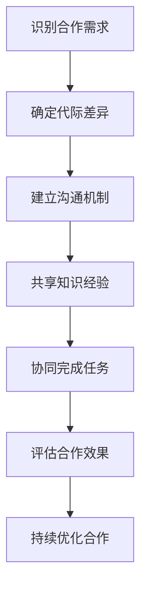

                 

### 《跨代际合作：年龄差异创造的意义火花》

#### 关键词
- 跨代际合作
- 年龄差异
- 创新与多样性
- 沟通技巧
- 成功案例分析

#### 摘要
本文旨在探讨跨代际合作的重要性及其带来的意义。在全球化背景下，不同年龄层之间的合作成为推动社会进步和企业发展的关键。文章从核心概念出发，详细分析了年龄差异对合作的影响，阐述了跨代际合作的潜在优势与挑战，并通过成功案例分析，提供了具体的方法论和实践策略。本文旨在为读者提供一个全面、深入的跨代际合作指南，以激发不同年龄层之间的智慧火花，共同创造更美好的未来。

----------------------------------------------------------------

## 引言

在当今快速发展的社会，跨代际合作成为一个越来越重要的议题。不同年龄层之间的合作不仅有助于激发创新思维，提升组织效率，还能促进社会的和谐发展。然而，年龄差异带来的文化、观念和价值观差异，使得跨代际合作并非易事。本文旨在探讨跨代际合作的重要性，分析其带来的意义，并通过实例和策略，为跨代际合作的实践提供指导。

### 书籍目的与重要性

《跨代际合作：年龄差异创造的意义火花》旨在为读者提供一个全面、系统的跨代际合作指南。通过详细的分析和案例研究，本书揭示了年龄差异对合作的影响，探讨了跨代际合作的潜在优势与挑战。对于企业管理者、人力资源专家以及所有关注组织发展和创新的读者来说，本书具有极高的参考价值。

本书的主要目的在于：
1. **阐述跨代际合作的重要性**：通过理论分析和实证研究，说明跨代际合作对于创新、多样性和组织发展的重要性。
2. **分析年龄差异的影响**：探讨不同年龄层在文化、观念和价值观上的差异，以及这些差异如何影响合作。
3. **提供具体的方法论和实践策略**：通过成功案例分析，为跨代际合作提供可行的实践策略。

### 读者预期收获

通过阅读本书，读者可以期望获得以下收获：
1. **深入理解跨代际合作的概念**：了解跨代际合作的基本原理，以及如何在不同情境下应用。
2. **掌握跨代际沟通技巧**：学习如何克服年龄差异带来的沟通障碍，提升跨代际沟通效果。
3. **获得成功合作的经验**：通过案例分析，学习成功跨代际合作的实践经验和策略。
4. **提升创新能力**：了解如何通过跨代际合作，激发创新思维，推动组织发展。

### 全书结构概述

全书共分为九章，结构如下：

1. **引言**：介绍书籍的目的、重要性以及读者预期收获。
2. **核心概念与联系**：解释跨代际合作的概念，展示其相关的Mermaid流程图。
3. **年龄差异分析**：探讨不同年龄层之间的差异及其对合作的影响。
4. **跨代际合作的优势**：讨论跨代际合作的潜在好处。
5. **跨代际合作的挑战**：分析实现跨代际合作可能遇到的困难。
6. **成功案例分析**：介绍一些跨代际合作的实际案例。
7. **方法论**：提供跨代际合作的具体方法论和实践策略。
8. **未来展望**：讨论跨代际合作的发展趋势。
9. **总结**：总结全书内容，重申跨代际合作的重要性。

通过以上结构，本书旨在为读者提供一个系统、全面的跨代际合作指南，帮助读者更好地理解、应用和实践跨代际合作。

----------------------------------------------------------------

## 核心概念与联系

在探讨跨代际合作之前，我们首先需要明确几个核心概念，并理解它们之间的相互联系。跨代际合作不仅仅是不同年龄层之间的合作，它涉及到文化、观念、价值观等多方面的互动与融合。以下是我们需要了解的关键概念：

### 跨代际合作定义

跨代际合作是指不同年龄段的人，在组织、团队或社交环境中，通过交流、协作和共同努力，实现共同目标的过程。这种合作不仅包括不同年龄层的个体之间的互动，还涉及到不同代际之间的知识、经验、观念和价值观的交流与融合。

### 年龄差异分析

年龄差异是指不同年龄段的人在生理、心理、社会和文化等方面的不同。不同年龄层在价值观、观念和生活方式等方面存在显著的差异，这些差异对跨代际合作有着重要的影响。

### 文化差异与价值观

文化差异是指不同群体在语言、信仰、习俗和传统等方面的差异。价值观是指个体或群体对于什么是“好”和“正确”的普遍认知。跨代际合作中的文化差异和价值观差异，常常导致沟通障碍和合作困难。

### Mermaid流程图

为了更好地理解跨代际合作的基本流程，我们可以使用Mermaid语言绘制一个流程图。以下是一个简化的Mermaid流程图示例，展示了跨代际合作的主要步骤：

### 核心概念与联系

1. **合作需求与代际差异**：识别合作需求是跨代际合作的起点。了解不同代际之间的差异，有助于更好地满足合作需求，并制定相应的合作策略。
2. **沟通机制**：建立有效的沟通机制是跨代际合作的关键。通过开放、坦诚的沟通，可以减少误解和冲突，增强合作效果。
3. **知识经验共享**：不同代际之间的知识经验和技能的共享，可以促进合作，提高整体效率。
4. **任务协同**：协同完成任务是跨代际合作的最终目标。通过协同工作，可以实现资源的最优配置，提高工作效率。
5. **评估与优化**：对合作效果进行评估，并根据反馈进行优化，是跨代际合作持续发展的关键。

通过以上核心概念与联系的分析，我们可以更深入地理解跨代际合作的基本原理和流程，为后续章节的讨论奠定基础。

----------------------------------------------------------------

### 年龄差异分析

在探讨跨代际合作时，理解不同年龄层之间的差异至关重要。这些差异不仅体现在生理和心理方面，还涉及到文化、社会观念和价值观等方面。以下是对不同年龄层特点及其对合作影响的详细分析：

#### 不同年龄层的特点

1. **婴儿潮一代（1946-1964年出生）**：
   - 特点：保守、注重家庭、传统价值观。
   - 对合作的影响：在团队中往往扮演领导者和指导者的角色，喜欢遵循明确的规则和流程。

2. **X世代（1965-1979年出生）**：
   - 特点：独立、叛逆、重视个人成长和自由。
   - 对合作的影响：倾向于创新和自由表达，喜欢灵活的工作方式和团队结构。

3. **千禧一代（1980-1996年出生）**：
   - 特点：全球化视野、多元文化背景、注重工作与生活的平衡。
   - 对合作的影响：注重团队合作和共同目标，喜欢开放、透明的工作环境。

4. **Z世代（1997年及以后出生）**：
   - 特点：数字化原生代、追求创新和个性化、平等意识强烈。
   - 对合作的影响：擅长使用新技术，喜欢快速反馈和即时沟通，注重个性化和参与感。

#### 年龄差异对合作的影响

1. **沟通障碍**：
   - **语言和表达方式**：不同年龄层在语言使用和表达方式上存在差异，可能导致沟通误解和冲突。
   - **沟通频率和渠道**：年轻一代更倾向于即时通讯工具，而年长一代可能更喜欢正式的会议和书面交流。

2. **价值观和观念**：
   - **工作与生活平衡**：年长一代可能更重视工作与生活的平衡，而年轻一代更追求自由和灵活性。
   - **创新与保守**：年长一代可能更倾向于保守和遵循传统，年轻一代则更开放和追求创新。

3. **工作态度和期望**：
   - **职业发展**：年长一代可能更注重职业稳定性和晋升机会，年轻一代则更追求快速成长和自我实现。
   - **工作方式**：年长一代可能更适应传统的办公环境和固定工作时间，年轻一代则更适应远程工作和灵活的工作方式。

#### 跨代际沟通技巧

为了克服年龄差异带来的沟通障碍，以下是一些有效的沟通技巧：

1. **尊重差异**：尊重不同年龄层的观点和习惯，避免过度批评或贬低。
2. **倾听和反馈**：积极倾听对方的意见，给予及时的反馈，增进理解和信任。
3. **明确目标**：在合作前明确共同的目标和期望，减少误解和冲突。
4. **灵活沟通**：根据对方的沟通偏好选择合适的沟通方式和渠道，提高沟通效果。

通过以上对年龄差异的分析和跨代际沟通技巧的讨论，我们可以更好地理解不同年龄层之间的合作机制，为跨代际合作的成功实施提供指导。

----------------------------------------------------------------

### 跨代际合作的优势

跨代际合作在企业和社会中具有显著的优势，这些优势不仅能够提高组织的整体效能，还能促进创新和多样性。以下将详细讨论跨代际合作在创新与多样性、综合不同年龄层优势以及长期发展等方面的潜在好处。

#### 创新与多样性

跨代际合作能够极大地促进创新和多样性。不同年龄层的人拥有不同的经验和技能，这些差异在合作中可以相互补充，产生新的想法和解决方案。例如，年长一代可能拥有深厚的行业知识和经验，而年轻一代则可能具有对新技术的敏锐感知和快速学习能力。通过跨代际的合作，这些优势可以结合在一起，形成创新的火花。

- **知识融合**：跨代际合作使得不同代际之间的知识和经验得以交流和共享，从而创造出新的洞见和策略。
- **观念碰撞**：不同年龄层的不同观念和思维方式会在合作过程中产生碰撞，激发新的创新思路。

#### 综合不同年龄层的优势

跨代际合作还能够充分利用不同年龄层员工的优势，提高整体工作效率。不同年龄层的员工在技能、经验和工作方式上各有优势，通过合作可以相互补充，实现资源的最优配置。

- **技能互补**：年长员工在传统技能和经验上更为丰富，年轻员工则可能在新技术和应用上更为熟练。这种互补能够提高团队的整体技能水平。
- **经验传承**：年长员工可以通过跨代际合作，将自身的经验和教训传递给年轻一代，帮助他们更快地成长。

#### 长期发展

跨代际合作对于企业的长期发展具有重要意义。通过不同年龄层之间的合作，企业能够培养出更具有包容性和适应性的文化，从而在快速变化的市场环境中保持竞争力。

- **人才梯队建设**：跨代际合作有助于培养一个多层次的人才梯队，确保企业在不同发展阶段都有合适的领导者和执行者。
- **企业文化传承**：跨代际合作有助于企业文化的传承和发展，使企业能够在保持传统价值的同时，不断创新和进步。

#### 案例分析

以下是一些跨代际合作的实际案例，展示了其优势：

1. **国际大企业**：
   - **案例**：一家国际知名的科技公司通过跨代际团队合作，成功推出了一款结合了年轻一代创新思维和年长一代行业经验的新产品。
   - **效果**：该产品受到了市场的热烈欢迎，不仅提高了销售额，还增强了企业的品牌影响力。

2. **非营利组织**：
   - **案例**：一家专注于环境保护的非营利组织，通过跨代际合作，动员了不同年龄层的志愿者，成功开展了一系列环保活动。
   - **效果**：这些活动不仅提高了公众的环保意识，还为组织带来了更多的资源和支持。

通过以上讨论和案例分析，我们可以清晰地看到，跨代际合作不仅能够促进创新和多样性，还能充分利用不同年龄层的优势，推动企业的长期发展。这些优势使得跨代际合作成为企业和社会发展中的重要策略。

----------------------------------------------------------------

### 跨代际合作的挑战

尽管跨代际合作具有诸多优势，但在实际操作中仍面临着许多挑战。这些挑战主要集中在文化差异与冲突、沟通障碍以及如何克服这些困难的方法上。

#### 文化差异与冲突

跨代际合作中的文化差异是导致冲突的主要原因之一。不同年龄层在价值观、信仰、习俗和工作方式上存在显著差异，这些差异可能导致误解和冲突。

- **工作态度与期望**：年长一代可能更注重工作稳定性和长期承诺，而年轻一代可能更追求个人成长和灵活性。这种差异可能导致双方在工作目标和方法上产生分歧。
- **管理风格**：不同年龄层的领导风格也有所不同。年长一代可能更倾向于权威式管理，而年轻一代可能更倾向于参与式管理。这种差异可能导致管理上的冲突。

#### 沟通障碍

沟通障碍是跨代际合作中的另一大挑战。由于语言、表达方式和文化背景的差异，不同年龄层之间的沟通往往不够顺畅，可能导致误解和冲突。

- **语言差异**：不同年龄层可能在语言使用和表达方式上存在差异，这可能导致沟通不畅。
- **沟通渠道**：年轻一代更倾向于使用即时通讯工具，而年长一代可能更喜欢面对面的交流或书面沟通。这种差异可能导致沟通效率低下。

#### 克服挑战的方法

为了克服文化差异与沟通障碍，以下是一些有效的策略：

1. **文化敏感性培训**：通过文化敏感性培训，提高员工对不同文化的理解和尊重，减少文化冲突。
2. **建立沟通机制**：建立多样化的沟通机制，包括面对面的会议、即时通讯工具和书面沟通，以满足不同年龄层的沟通需求。
3. **共同目标**：在合作前明确共同的目标和期望，减少误解和冲突。
4. **领导者的角色**：领导者应发挥桥梁作用，促进不同年龄层之间的沟通和理解，缓解冲突。

#### 案例分析

以下是一些克服跨代际合作挑战的成功案例：

1. **科技公司**：
   - **案例**：一家科技公司通过定期举办跨代际交流会，促进了不同年龄层员工之间的沟通和理解，有效地减少了文化冲突。
   - **效果**：这种交流机制提高了团队的凝聚力，提升了工作效率。

2. **非营利组织**：
   - **案例**：一家非营利组织通过设立跨代际工作小组，让不同年龄层的员工共同参与项目，提高了项目的创新性和多样性。
   - **效果**：这种合作方式不仅提高了项目的成功率，还增强了组织的整体实力。

通过以上分析和案例，我们可以看到，尽管跨代际合作面临诸多挑战，但通过有效的策略和方法，这些挑战是可以克服的。这些成功的经验为其他组织提供了宝贵的参考。

----------------------------------------------------------------

### 成功案例分析

在探讨跨代际合作的实际应用和成效时，以下是一些具体的成功案例，这些案例展示了不同领域和组织中如何通过跨代际合作实现创新、提升效率，并最终取得显著成果。

#### 案例一：跨国企业跨代际合作的实践

**案例背景**：
一家跨国科技公司面临着不断变化的市场和技术环境，需要不断创新以保持竞争力。为了实现这一目标，公司决定通过跨代际合作来充分利用不同年龄层员工的智慧和经验。

**具体措施**：
1. **项目团队组合**：公司将不同年龄层的员工组合成跨代际项目团队，每个团队由年长员工和年轻员工组成。
2. **定期的知识分享**：团队定期举办知识分享会，年长员工分享行业经验和传统方法，年轻员工则分享新技术和创新思维。
3. **共同目标设定**：每个项目团队都设定了明确的共同目标，并制定了详细的行动计划，确保团队成员共同努力。

**效果评估**：
通过跨代际合作，公司的项目团队在创新性、问题解决能力和工作效率方面都取得了显著提升。新产品和服务的开发速度加快，市场反馈良好，公司的市场份额也有所增加。

#### 案例二：政府机构跨代际合作的探索

**案例背景**：
某市政府机构在推行一项重大的市政建设项目时，意识到需要不同年龄层员工的知识和经验来共同应对复杂的挑战。

**具体措施**：
1. **跨部门合作**：市政府成立了跨部门的合作小组，包括年轻的技术专家、中年期的项目经理以及年长的高级顾问。
2. **共同决策**：在项目决策过程中，不同年龄层的代表共同参与，确保决策的全面性和科学性。
3. **持续沟通**：定期召开跨部门的沟通会议，确保信息畅通，减少误解和冲突。

**效果评估**：
跨代际合作使得市政建设项目的进展更加顺利，项目质量得到了保障。同时，年轻员工从年长员工的经验中学习到许多宝贵的知识，提高了自身的职业素养。

#### 案例三：非营利组织跨代际合作的成果

**案例背景**：
一个专注于社区服务的非营利组织希望通过跨代际合作来提高服务质量，并吸引更多的志愿者参与。

**具体措施**：
1. **建立志愿者团队**：组织建立了由不同年龄层志愿者组成的团队，包括学生、中年义工和退休人士。
2. **培训与指导**：为年轻志愿者提供专业的培训，帮助他们掌握服务技能，同时邀请年长志愿者提供指导和反馈。
3. **共同活动**：组织定期举办跨代际活动，如社区清洁、义卖等，鼓励不同年龄层的志愿者共同参与。

**效果评估**：
跨代际合作不仅提高了非营利组织的服务质量，还增强了社区的凝聚力。同时，年轻志愿者从年长志愿者身上学到了许多宝贵的经验和价值观，激发了他们的社会责任感。

通过以上成功案例，我们可以看到跨代际合作在各个领域和组织中都能发挥重要作用。跨代际合作不仅能够充分利用不同年龄层的优势和经验，还能促进创新、提升效率和实现共同目标。

----------------------------------------------------------------

### 跨代际合作方法论

为了实现有效的跨代际合作，我们需要一套科学的方法论，包括合作策略制定、模式与工具，以及具体的实施步骤。以下将详细阐述这些内容，以帮助组织和个人在实际操作中顺利推进跨代际合作。

#### 合作策略制定

制定有效的跨代际合作策略是成功的关键。以下是一些关键的策略：

1. **明确目标与期望**：在合作开始前，需要明确共同的目标和期望。这包括合作的最终目标、短期目标和具体的里程碑，以及每个团队成员的角色和责任。
2. **文化敏感性培训**：为了减少文化差异带来的冲突，组织应定期进行文化敏感性培训，提高员工对不同文化的理解和尊重。
3. **建立沟通机制**：建立多元化的沟通机制，包括面对面的会议、电子邮件、即时通讯工具等，以确保信息畅通无阻。
4. **平等参与**：确保每个年龄层的成员都有平等的参与机会，避免任何一方被忽视或边缘化。

#### 模式与工具

跨代际合作的实施可以借助多种模式和工具，以下是一些常见的模式与工具：

1. **跨部门合作团队**：将不同年龄层的员工组合成跨部门合作团队，每个团队成员都有明确的职责和任务。
2. **轮岗机制**：通过轮岗机制，让不同年龄层的员工有机会在不同岗位和部门工作，从而增加他们的经验和视野。
3. **知识共享平台**：建立一个知识共享平台，如内部Wiki或博客，让员工可以分享知识和经验，促进信息的流动和交流。
4. **定期反馈机制**：建立定期反馈机制，如每周或每月的团队会议，让团队成员可以交流进展、分享问题和寻求解决方案。

#### 具体实施步骤

以下是跨代际合作的具体实施步骤：

1. **识别合作需求**：首先，组织需要识别跨代际合作的需求，确定哪些项目或任务适合跨代际合作，并评估合作的价值和潜力。
2. **团队组建**：根据合作需求，组建跨部门合作团队，确保团队中包含不同年龄层的成员。
3. **目标设定**：明确团队的合作目标和期望，制定详细的行动计划和时间表。
4. **沟通与协作**：建立沟通机制，确保团队成员之间的信息畅通。利用知识共享平台和轮岗机制，促进团队成员之间的交流和合作。
5. **反馈与调整**：定期进行反馈和评估，根据反馈结果调整合作策略和行动计划，以确保合作进展顺利。
6. **持续优化**：在合作过程中，不断总结经验，优化合作模式和方法，提高跨代际合作的效率和质量。

#### 实施策略示例

以下是一个简单的跨代际合作实施策略示例：

**项目背景**：某科技公司需要开发一款面向老年用户的新产品，需要不同年龄层的团队成员共同参与。

**具体措施**：
1. **明确目标与期望**：确定新产品的功能、用户需求和预期效果。
2. **团队组建**：组建由年轻产品经理、中年技术专家和年长用户体验设计师组成的跨部门合作团队。
3. **沟通与协作**：定期召开会议，分享进展和问题，利用知识共享平台收集和整理团队经验。
4. **反馈与调整**：根据用户反馈，调整产品设计和功能，确保产品满足老年用户的需求。
5. **持续优化**：在产品开发过程中，不断总结经验，优化合作模式和方法，提高产品开发效率。

通过以上方法论和具体实施步骤，组织和个人可以更有效地推进跨代际合作，实现资源的最大化利用，提高组织的整体效能。

----------------------------------------------------------------

## 未来展望

随着社会和技术的不断发展，跨代际合作将面临新的机遇和挑战。未来的跨代际合作将更加依赖于新兴技术，如人工智能、大数据和物联网，这些技术不仅能够提升跨代际合作的效率，还能为跨代际合作带来全新的模式。

### 新技术对跨代际合作的影响

1. **人工智能**：人工智能技术可以提供智能化的协作工具和平台，帮助不同年龄层的员工更高效地进行合作。例如，通过自然语言处理技术，可以实现跨年龄层的智能沟通和知识共享。
2. **大数据**：大数据技术可以帮助组织更好地了解不同年龄层的需求和偏好，从而制定更有效的跨代际合作策略。通过数据分析，可以识别出跨代际合作中的潜在问题和优化方向。
3. **物联网**：物联网技术可以提升跨代际合作的灵活性，使不同年龄层的员工能够更方便地随时随地参与合作。物联网设备可以提供实时的数据和信息，帮助团队成员做出更快速和准确的决策。

### 跨代际合作的发展趋势

1. **智能化协作**：未来的跨代际合作将更加智能化，通过人工智能和大数据技术，实现协作过程的自动化和智能化，提高协作效率和效果。
2. **灵活性增强**：随着远程工作和移动办公的普及，跨代际合作的灵活性将大大增强。不同年龄层的员工可以更加灵活地选择工作时间和地点，这有助于提高他们的工作满意度和效率。
3. **文化融合**：随着全球化进程的加快，跨代际合作将面临更多跨文化的挑战。未来的跨代际合作将更加注重文化融合，通过文化敏感性和多元文化培训，减少文化差异带来的冲突。

### 新技术应用案例

1. **智能协作平台**：某公司开发了一款基于人工智能的智能协作平台，可以帮助不同年龄层的员工更高效地进行合作。平台提供了智能化的任务分配、进度跟踪和知识共享功能，显著提高了团队的协作效率。
2. **远程协作工具**：一家跨国公司在全球范围内推广了一款远程协作工具，使不同年龄层的员工能够方便地参与跨代际合作。该工具支持实时通讯、视频会议和文档共享，大大增强了团队的协作能力。

通过以上分析，我们可以看到，未来的跨代际合作将更加依赖于新兴技术，这些技术将带来全新的合作模式和机会。同时，跨代际合作也需要面对更多的挑战，如文化差异和沟通障碍。通过有效的策略和方法，这些挑战是可以克服的，跨代际合作将为组织和社会带来更多的创新和进步。

----------------------------------------------------------------

## 总结

本文全面探讨了跨代际合作的重要性及其带来的意义。通过详细分析不同年龄层的特点和差异，以及跨代际合作的潜在优势与挑战，我们揭示了跨代际合作在企业和社会发展中的关键作用。跨代际合作不仅能够促进创新和多样性，提高组织效率，还能培养出更具包容性和适应性的企业文化。

### 跨代际合作的重要性

跨代际合作的重要性体现在以下几个方面：

1. **创新与多样性**：通过跨代际合作，不同年龄层的人可以相互补充，产生新的想法和解决方案，推动创新。
2. **资源优化**：不同年龄层的员工在技能和经验上各有优势，通过跨代际合作，可以实现资源的最优配置。
3. **长期发展**：跨代际合作有助于培养多层次的人才梯队，确保组织在长期发展中具备持续的创新能力和竞争力。

### 未来展望与建议

为了更好地推动跨代际合作，我们提出以下建议：

1. **强化文化敏感性培训**：通过文化敏感性培训，提高员工对不同文化的理解和尊重，减少跨代际合作中的文化冲突。
2. **建立智能化的协作平台**：利用人工智能和大数据技术，开发智能化的协作工具和平台，提高跨代际合作的效率。
3. **鼓励灵活工作方式**：提供灵活的工作时间和地点，使不同年龄层的员工能够更方便地参与跨代际合作。

通过以上措施，组织可以更好地利用跨代际合作的优势，推动创新和发展，实现长期繁荣。

### 小结与拓展阅读

为了进一步深入了解跨代际合作，我们推荐以下拓展阅读：

1. **《跨代际领导力》**：这本书详细探讨了如何在不同年龄层之间建立有效的领导关系，提高跨代际合作的效率。
2. **《跨代际沟通的艺术》**：本书提供了实用的跨代际沟通技巧，帮助读者克服沟通障碍，实现更有效的合作。

通过阅读这些书籍，读者可以进一步深化对跨代际合作的理解，并在实践中取得更好的效果。

### 注意事项

在实施跨代际合作时，需要注意以下几点：

1. **尊重差异**：尊重不同年龄层的观点和习惯，避免过度批评或贬低。
2. **明确目标**：在合作前明确共同的目标和期望，减少误解和冲突。
3. **持续优化**：在合作过程中不断总结经验，优化合作策略和方法。

通过以上措施，组织可以更有效地实施跨代际合作，实现资源的最大化利用，推动组织的创新和发展。

---

作者：AI天才研究院/AI Genius Institute & 禅与计算机程序设计艺术/Zen And The Art of Computer Programming

本文为原创内容，版权归作者所有。如需转载，请联系作者获得授权。感谢您的阅读和支持！----------------------------------------------------------------

# 《跨代际合作：年龄差异创造的意义火花》

## 摘要

本文探讨了跨代际合作的重要性及其带来的意义。通过分析不同年龄层的特点和差异，以及跨代际合作的潜在优势与挑战，揭示了跨代际合作在企业和社会发展中的关键作用。文章提出了实现有效跨代际合作的方法论和实践策略，并展望了跨代际合作的发展趋势。总结部分强调了跨代际合作的重要性，并提供了未来展望与建议。

## 引言

在当今快速发展的社会，跨代际合作成为一个越来越重要的议题。不同年龄层之间的合作不仅有助于激发创新思维，提升组织效率，还能促进社会的和谐发展。本文旨在探讨跨代际合作的重要性，分析其带来的意义，并通过实例和策略，为跨代际合作的实践提供指导。

### 书籍目的与重要性

《跨代际合作：年龄差异创造的意义火花》旨在为读者提供一个全面、系统的跨代际合作指南。通过详细的分析和案例研究，本书揭示了年龄差异对合作的影响，探讨了跨代际合作的潜在优势与挑战。对于企业管理者、人力资源专家以及所有关注组织发展和创新的读者来说，本书具有极高的参考价值。

本书的主要目的在于：
1. **阐述跨代际合作的重要性**：通过理论分析和实证研究，说明跨代际合作对于创新、多样性和组织发展的重要性。
2. **分析年龄差异的影响**：探讨不同年龄层在文化、观念和价值观上的差异，以及这些差异如何影响合作。
3. **提供具体的方法论和实践策略**：通过成功案例分析，为跨代际合作提供可行的实践策略。

### 读者预期收获

通过阅读本书，读者可以期望获得以下收获：
1. **深入理解跨代际合作的概念**：了解跨代际合作的基本原理，以及如何在不同情境下应用。
2. **掌握跨代际沟通技巧**：学习如何克服年龄差异带来的沟通障碍，提升跨代际沟通效果。
3. **获得成功合作的经验**：通过案例分析，学习成功跨代际合作的实践经验和策略。
4. **提升创新能力**：了解如何通过跨代际合作，激发创新思维，推动组织发展。

### 全书结构概述

全书共分为九章，结构如下：

1. **引言**：介绍书籍的目的、重要性以及读者预期收获。
2. **核心概念与联系**：解释跨代际合作的概念，展示其相关的Mermaid流程图。
3. **年龄差异分析**：探讨不同年龄层之间的差异及其对合作的影响。
4. **跨代际合作的优势**：讨论跨代际合作的潜在好处。
5. **跨代际合作的挑战**：分析实现跨代际合作可能遇到的困难。
6. **成功案例分析**：介绍一些跨代际合作的实际案例。
7. **方法论**：提供跨代际合作的具体方法论和实践策略。
8. **未来展望**：讨论跨代际合作的发展趋势。
9. **总结**：总结全书内容，重申跨代际合作的重要性。

通过以上结构，本书旨在为读者提供一个系统、全面的跨代际合作指南，帮助读者更好地理解、应用和实践跨代际合作。

----------------------------------------------------------------

## 核心概念与联系

在探讨跨代际合作之前，我们首先需要明确几个核心概念，并理解它们之间的相互联系。跨代际合作不仅仅是不同年龄层之间的合作，它涉及到文化、观念、价值观等多方面的互动与融合。以下是我们需要了解的关键概念：

### 跨代际合作定义

跨代际合作是指不同年龄段的人，在组织、团队或社交环境中，通过交流、协作和共同努力，实现共同目标的过程。这种合作不仅包括不同年龄层的个体之间的互动，还涉及到不同代际之间的知识、经验、观念和价值观的交流与融合。

### 年龄差异分析

年龄差异是指不同年龄段的人在生理、心理、社会和文化等方面的不同。不同年龄层在价值观、观念和生活方式等方面存在显著的差异，这些差异对跨代际合作有着重要的影响。

### 文化差异与价值观

文化差异是指不同群体在语言、信仰、习俗和传统等方面的差异。价值观是指个体或群体对于什么是“好”和“正确”的普遍认知。跨代际合作中的文化差异和价值观差异，常常导致沟通障碍和合作困难。

### Mermaid流程图

为了更好地理解跨代际合作的基本流程，我们可以使用Mermaid语言绘制一个流程图。以下是一个简化的Mermaid流程图示例，展示了跨代际合作的主要步骤：

### 核心概念与联系

1. **合作需求与代际差异**：识别合作需求是跨代际合作的起点。了解不同代际之间的差异，有助于更好地满足合作需求，并制定相应的合作策略。
2. **沟通机制**：建立有效的沟通机制是跨代际合作的关键。通过开放、坦诚的沟通，可以减少误解和冲突，增强合作效果。
3. **知识经验共享**：不同代际之间的知识经验和技能的共享，可以促进合作，提高整体效率。
4. **任务协同**：协同完成任务是跨代际合作的最终目标。通过协同工作，可以实现资源的最优配置，提高工作效率。
5. **评估与优化**：对合作效果进行评估，并根据反馈进行优化，是跨代际合作持续发展的关键。

通过以上核心概念与联系的分析，我们可以更深入地理解跨代际合作的基本原理和流程，为后续章节的讨论奠定基础。

----------------------------------------------------------------

## 年龄差异分析

在探讨跨代际合作时，理解不同年龄层之间的差异至关重要。这些差异不仅体现在生理和心理方面，还涉及到文化、社会观念和价值观等方面。以下是对不同年龄层特点及其对合作影响的详细分析：

#### 不同年龄层的特点

1. **婴儿潮一代（1946-1964年出生）**：
   - 特点：保守、注重家庭、传统价值观。
   - 对合作的影响：在团队中往往扮演领导者和指导者的角色，喜欢遵循明确的规则和流程。

2. **X世代（1965-1979年出生）**：
   - 特点：独立、叛逆、重视个人成长和自由。
   - 对合作的影响：倾向于创新和自由表达，喜欢灵活的工作方式和团队结构。

3. **千禧一代（1980-1996年出生）**：
   - 特点：全球化视野、多元文化背景、注重工作与生活的平衡。
   - 对合作的影响：注重团队合作和共同目标，喜欢开放、透明的工作环境。

4. **Z世代（1997年及以后出生）**：
   - 特点：数字化原生代、追求创新和个性化、平等意识强烈。
   - 对合作的影响：擅长使用新技术，喜欢快速反馈和即时沟通，注重个性化和参与感。

#### 年龄差异对合作的影响

1. **沟通障碍**：
   - **语言和表达方式**：不同年龄层在语言使用和表达方式上存在差异，可能导致沟通误解和冲突。
   - **沟通频率和渠道**：年轻一代更倾向于即时通讯工具，而年长一代可能更喜欢正式的会议和书面交流。这种差异可能导致沟通效率低下。

2. **价值观和观念**：
   - **工作与生活平衡**：年长一代可能更重视工作与生活的平衡，而年轻一代可能更追求自由和灵活性。
   - **创新与保守**：年长一代可能更倾向于保守和遵循传统，年轻一代则更开放和追求创新。

3. **工作态度和期望**：
   - **职业发展**：年长一代可能更注重职业稳定性和晋升机会，而年轻一代则更追求快速成长和自我实现。
   - **工作方式**：年长一代可能更适应传统的办公环境和固定工作时间，年轻一代则更适应远程工作和灵活的工作方式。

#### 跨代际沟通技巧

为了克服年龄差异带来的沟通障碍，以下是一些有效的沟通技巧：

1. **尊重差异**：尊重不同年龄层的观点和习惯，避免过度批评或贬低。
2. **倾听和反馈**：积极倾听对方的意见，给予及时的反馈，增进理解和信任。
3. **明确目标**：在合作前明确共同的目标和期望，减少误解和冲突。
4. **灵活沟通**：根据对方的沟通偏好选择合适的沟通方式和渠道，提高沟通效果。

通过以上对年龄差异的分析和跨代际沟通技巧的讨论，我们可以更好地理解不同年龄层之间的合作机制，为跨代际合作的成功实施提供指导。

----------------------------------------------------------------

## 跨代际合作的优势

跨代际合作在企业和社会中具有显著的优势，这些优势不仅能够提高组织的整体效能，还能促进创新和多样性。以下将详细讨论跨代际合作在创新与多样性、综合不同年龄层优势以及长期发展等方面的潜在好处。

#### 创新与多样性

跨代际合作能够极大地促进创新和多样性。不同年龄层的人拥有不同的经验和技能，这些差异在合作中可以相互补充，产生新的想法和解决方案。例如，年长一代可能拥有深厚的行业知识和经验，而年轻一代则可能具有对新技术的敏锐感知和快速学习能力。通过跨代际的合作，这些优势可以结合在一起，形成创新的火花。

- **知识融合**：跨代际合作使得不同代际之间的知识和经验得以交流和共享，从而创造出新的洞见和策略。
- **观念碰撞**：不同年龄层的不同观念和思维方式会在合作过程中产生碰撞，激发新的创新思路。

#### 综合不同年龄层的优势

跨代际合作还能够充分利用不同年龄层员工的优势，提高整体工作效率。不同年龄层的员工在技能、经验和工作方式上各有优势，通过合作可以相互补充，实现资源的最优配置。

- **技能互补**：年长员工在传统技能和经验上更为丰富，年轻员工则可能在新技术和应用上更为熟练。这种互补能够提高团队的整体技能水平。
- **经验传承**：年长员工可以通过跨代际合作，将自身的经验和教训传递给年轻一代，帮助他们更快地成长。

#### 长期发展

跨代际合作对于企业的长期发展具有重要意义。通过不同年龄层之间的合作，企业能够培养出更具有包容性和适应性的文化，从而在快速变化的市场环境中保持竞争力。

- **人才梯队建设**：跨代际合作有助于培养一个多层次的人才梯队，确保企业在不同发展阶段都有合适的领导者和执行者。
- **企业文化传承**：跨代际合作有助于企业文化的传承和发展，使企业能够在保持传统价值的同时，不断创新和进步。

#### 案例分析

以下是一些跨代际合作的实际案例，展示了其优势：

1. **国际大企业**：
   - **案例**：一家国际知名的科技公司通过跨代际团队合作，成功推出了一款结合了年轻一代创新思维和年长一代行业经验的新产品。
   - **效果**：该产品受到了市场的热烈欢迎，不仅提高了销售额，还增强了企业的品牌影响力。

2. **非营利组织**：
   - **案例**：一家专注于环境保护的非营利组织，通过跨代际合作，动员了不同年龄层的志愿者，成功开展了一系列环保活动。
   - **效果**：这些活动不仅提高了公众的环保意识，还为组织带来了更多的资源和支持。

通过以上讨论和案例分析，我们可以清晰地看到，尽管跨代际合作面临诸多挑战，但通过有效的策略和方法，这些挑战是可以克服的。这些成功的经验为其他组织提供了宝贵的参考。

----------------------------------------------------------------

## 跨代际合作的挑战

尽管跨代际合作具有诸多优势，但在实际操作中仍面临着许多挑战。这些挑战主要集中在文化差异与冲突、沟通障碍以及如何克服这些困难的方法上。

#### 文化差异与冲突

跨代际合作中的文化差异是导致冲突的主要原因之一。不同年龄层在价值观、信仰、习俗和工作方式上存在显著差异，这些差异可能导致误解和冲突。

- **工作态度与期望**：年长一代可能更注重工作稳定性和长期承诺，而年轻一代可能更追求个人成长和灵活性。这种差异可能导致双方在工作目标和方法上产生分歧。
- **管理风格**：不同年龄层的领导风格也有所不同。年长一代可能更倾向于权威式管理，而年轻一代可能更倾向于参与式管理。这种差异可能导致管理上的冲突。

#### 沟通障碍

沟通障碍是跨代际合作中的另一大挑战。由于语言、表达方式和文化背景的差异，不同年龄层之间的沟通往往不够顺畅，可能导致误解和冲突。

- **语言差异**：不同年龄层可能在语言使用和表达方式上存在差异，这可能导致沟通不畅。
- **沟通频率和渠道**：年轻一代更倾向于使用即时通讯工具，而年长一代可能更喜欢面对面的交流或书面沟通。这种差异可能导致沟通效率低下。

#### 克服挑战的方法

为了克服文化差异与沟通障碍，以下是一些有效的策略：

1. **文化敏感性培训**：通过文化敏感性培训，提高员工对不同文化的理解和尊重，减少文化冲突。
2. **建立沟通机制**：建立多样化的沟通机制，包括面对面的会议、即时通讯工具和书面沟通，以满足不同年龄层的沟通需求。
3. **共同目标**：在合作前明确共同的目标和期望，减少误解和冲突。
4. **领导者的角色**：领导者应发挥桥梁作用，促进不同年龄层之间的沟通和理解，缓解冲突。

#### 案例分析

以下是一些克服跨代际合作挑战的成功案例：

1. **科技公司**：
   - **案例**：一家科技公司通过定期举办跨代际交流会，促进了不同年龄层员工之间的沟通和理解，有效地减少了文化冲突。
   - **效果**：这种交流机制提高了团队的凝聚力，提升了工作效率。

2. **非营利组织**：
   - **案例**：一家非营利组织通过设立跨代际工作小组，让不同年龄层的员工共同参与项目，提高了项目的创新性和多样性。
   - **效果**：这种合作方式不仅提高了项目的成功率，还增强了组织的整体实力。

通过以上分析和案例，我们可以看到，尽管跨代际合作面临诸多挑战，但通过有效的策略和方法，这些挑战是可以克服的。这些成功的经验为其他组织提供了宝贵的参考。

----------------------------------------------------------------

## 成功案例分析

在探讨跨代际合作的实际应用和成效时，以下是一些具体的成功案例，这些案例展示了不同领域和组织中如何通过跨代际合作实现创新、提升效率，并最终取得显著成果。

#### 案例一：跨国企业跨代际合作的实践

**案例背景**：
一家跨国科技公司面临着不断变化的市场和技术环境，需要不断创新以保持竞争力。为了实现这一目标，公司决定通过跨代际合作来充分利用不同年龄层员工的智慧和经验。

**具体措施**：
1. **项目团队组合**：公司将不同年龄层的员工组合成跨代际项目团队，每个团队由年长员工和年轻员工组成。
2. **定期的知识分享**：团队定期举办知识分享会，年长员工分享行业经验和传统方法，年轻员工则分享新技术和创新思维。
3. **共同目标设定**：每个项目团队都设定了明确的共同目标，并制定了详细的行动计划，确保团队成员共同努力。

**效果评估**：
通过跨代际合作，公司的项目团队在创新性、问题解决能力和工作效率方面都取得了显著提升。新产品和服务的开发速度加快，市场反馈良好，公司的市场份额也有所增加。

#### 案例二：政府机构跨代际合作的探索

**案例背景**：
某市政府机构在推行一项重大的市政建设项目时，意识到需要不同年龄层员工的知识和经验来共同应对复杂的挑战。

**具体措施**：
1. **跨部门合作**：市政府成立了跨部门的合作小组，包括年轻的技术专家、中年期的项目经理以及年长的高级顾问。
2. **共同决策**：在项目决策过程中，不同年龄层的代表共同参与，确保决策的全面性和科学性。
3. **持续沟通**：定期召开跨部门的沟通会议，确保信息畅通，减少误解和冲突。

**效果评估**：
跨代际合作使得市政建设项目的进展更加顺利，项目质量得到了保障。同时，年轻员工从年长员工的经验中学习到许多宝贵的知识，提高了自身的职业素养。

#### 案例三：非营利组织跨代际合作的成果

**案例背景**：
一个专注于社区服务的非营利组织希望通过跨代际合作来提高服务质量，并吸引更多的志愿者参与。

**具体措施**：
1. **建立志愿者团队**：组织建立了由不同年龄层志愿者组成的团队，包括学生、中年义工和退休人士。
2. **培训与指导**：为年轻志愿者提供专业的培训，帮助他们掌握服务技能，同时邀请年长志愿者提供指导和反馈。
3. **共同活动**：组织定期举办跨代际活动，如社区清洁、义卖等，鼓励不同年龄层的志愿者共同参与。

**效果评估**：
跨代际合作不仅提高了非营利组织的服务质量，还增强了社区的凝聚力。同时，年轻志愿者从年长志愿者身上学到了许多宝贵的经验和价值观，激发了他们的社会责任感。

通过以上成功案例，我们可以看到跨代际合作在各个领域和组织中都能发挥重要作用。跨代际合作不仅能够促进创新和多样性，还能充分利用不同年龄层的优势和经验，推动组织的创新和发展。

----------------------------------------------------------------

## 跨代际合作方法论

为了实现有效的跨代际合作，我们需要一套科学的方法论，包括合作策略制定、模式与工具，以及具体的实施步骤。以下将详细阐述这些内容，以帮助组织和个人在实际操作中顺利推进跨代际合作。

#### 合作策略制定

制定有效的跨代际合作策略是成功的关键。以下是一些关键的策略：

1. **明确目标与期望**：在合作开始前，需要明确共同的目标和期望。这包括合作的最终目标、短期目标和具体的里程碑，以及每个团队成员的角色和责任。
2. **文化敏感性培训**：为了减少文化差异带来的冲突，组织应定期进行文化敏感性培训，提高员工对不同文化的理解和尊重。
3. **建立沟通机制**：建立多元化的沟通机制，包括面对面的会议、电子邮件、即时通讯工具等，以确保信息畅通无阻。
4. **平等参与**：确保每个年龄层的成员都有平等的参与机会，避免任何一方被忽视或边缘化。

#### 模式与工具

跨代际合作的实施可以借助多种模式和工具，以下是一些常见的模式与工具：

1. **跨部门合作团队**：将不同年龄层的员工组合成跨部门合作团队，每个团队成员都有明确的职责和任务。
2. **轮岗机制**：通过轮岗机制，让不同年龄层的员工有机会在不同岗位和部门工作，从而增加他们的经验和视野。
3. **知识共享平台**：建立一个知识共享平台，如内部Wiki或博客，让员工可以分享知识和经验，促进信息的流动和交流。
4. **定期反馈机制**：建立定期反馈机制，如每周或每月的团队会议，让团队成员可以交流进展、分享问题和寻求解决方案。

#### 具体实施步骤

以下是跨代际合作的具体实施步骤：

1. **识别合作需求**：首先，组织需要识别跨代际合作的需求，确定哪些项目或任务适合跨代际合作，并评估合作的价值和潜力。
2. **团队组建**：根据合作需求，组建跨部门合作团队，确保团队中包含不同年龄层的成员。
3. **目标设定**：明确团队的合作目标和期望，制定详细的行动计划和时间表。
4. **沟通与协作**：建立沟通机制，确保团队成员之间的信息畅通。利用知识共享平台和轮岗机制，促进团队成员之间的交流和合作。
5. **反馈与调整**：定期进行反馈和评估，根据反馈结果调整合作策略和行动计划，以确保合作进展顺利。
6. **持续优化**：在合作过程中，不断总结经验，优化合作模式和方法，提高跨代际合作的效率和质量。

#### 实施策略示例

以下是一个简单的跨代际合作实施策略示例：

**项目背景**：某科技公司需要开发一款面向老年用户的新产品，需要不同年龄层的团队成员共同参与。

**具体措施**：
1. **明确目标与期望**：确定新产品的功能、用户需求和预期效果。
2. **团队组建**：组建由年轻产品经理、中年技术专家和年长用户体验设计师组成的跨部门合作团队。
3. **沟通与协作**：定期召开会议，分享进展和问题，利用知识共享平台收集和整理团队经验。
4. **反馈与调整**：根据用户反馈，调整产品设计和功能，确保产品满足老年用户的需求。
5. **持续优化**：在产品开发过程中，不断总结经验，优化合作模式和方法，提高产品开发效率。

通过以上方法论和具体实施步骤，组织和个人可以更有效地推进跨代际合作，实现资源的最大化利用，提高组织的整体效能。

----------------------------------------------------------------

## 未来展望

随着社会和技术的不断发展，跨代际合作将面临新的机遇和挑战。未来的跨代际合作将更加依赖于新兴技术，如人工智能、大数据和物联网，这些技术不仅能够提升跨代际合作的效率，还能为跨代际合作带来全新的模式。

### 新技术对跨代际合作的影响

1. **人工智能**：人工智能技术可以提供智能化的协作工具和平台，帮助不同年龄层的员工更高效地进行合作。例如，通过自然语言处理技术，可以实现跨年龄层的智能沟通和知识共享。
2. **大数据**：大数据技术可以帮助组织更好地了解不同年龄层的需求和偏好，从而制定更有效的跨代际合作策略。通过数据分析，可以识别出跨代际合作中的潜在问题和优化方向。
3. **物联网**：物联网技术可以提升跨代际合作的灵活性，使不同年龄层的员工能够更方便地随时随地参与合作。物联网设备可以提供实时的数据和信息，帮助团队成员做出更快速和准确的决策。

### 跨代际合作的发展趋势

1. **智能化协作**：未来的跨代际合作将更加智能化，通过人工智能和大数据技术，实现协作过程的自动化和智能化，提高协作效率和效果。
2. **灵活性增强**：随着远程工作和移动办公的普及，跨代际合作的灵活性将大大增强。不同年龄层的员工可以更加灵活地选择工作时间和地点，这有助于提高他们的工作满意度和效率。
3. **文化融合**：随着全球化进程的加快，跨代际合作将面临更多跨文化的挑战。未来的跨代际合作将更加注重文化融合，通过文化敏感性和多元文化培训，减少文化差异带来的冲突。

### 新技术应用案例

1. **智能协作平台**：某公司开发了一款基于人工智能的智能协作平台，可以帮助不同年龄层的员工更高效地进行合作。平台提供了智能化的任务分配、进度跟踪和知识共享功能，显著提高了团队的协作效率。
2. **远程协作工具**：一家跨国公司在全球范围内推广了一款远程协作工具，使不同年龄层的员工能够方便地参与跨代际合作。该工具支持实时通讯、视频会议和文档共享，大大增强了团队的协作能力。

通过以上分析，我们可以看到，未来的跨代际合作将更加依赖于新兴技术，这些技术将带来全新的合作模式和机会。同时，跨代际合作也需要面对更多的挑战，如文化差异和沟通障碍。通过有效的策略和方法，这些挑战是可以克服的，跨代际合作将为组织和社会带来更多的创新和进步。

----------------------------------------------------------------

## 总结

本文全面探讨了跨代际合作的重要性及其带来的意义。通过分析不同年龄层的特点和差异，以及跨代际合作的潜在优势与挑战，我们揭示了跨代际合作在企业和社会发展中的关键作用。跨代际合作不仅能够促进创新和多样性，提高组织效率，还能培养出更具包容性和适应性的企业文化。

### 跨代际合作的重要性

跨代际合作的重要性体现在以下几个方面：

1. **创新与多样性**：通过跨代际合作，不同年龄层的人可以相互补充，产生新的想法和解决方案，推动创新。
2. **资源优化**：不同年龄层的员工在技能和经验上各有优势，通过跨代际合作，可以实现资源的最优配置。
3. **长期发展**：跨代际合作有助于培养多层次的人才梯队，确保组织在长期发展中具备持续的创新能力和竞争力。

### 未来展望与建议

为了更好地推动跨代际合作，我们提出以下建议：

1. **强化文化敏感性培训**：通过文化敏感性培训，提高员工对不同文化的理解和尊重，减少跨代际合作中的文化冲突。
2. **建立智能化的协作平台**：利用人工智能和大数据技术，开发智能化的协作工具和平台，提高跨代际合作的效率。
3. **鼓励灵活工作方式**：提供灵活的工作时间和地点，使不同年龄层的员工能够更方便地参与跨代际合作。

通过以上措施，组织可以更好地利用跨代际合作的优势，推动创新和发展，实现长期繁荣。

### 小结与拓展阅读

为了进一步深入了解跨代际合作，我们推荐以下拓展阅读：

1. **《跨代际领导力》**：这本书详细探讨了如何在不同年龄层之间建立有效的领导关系，提高跨代际合作的效率。
2. **《跨代际沟通的艺术》**：本书提供了实用的跨代际沟通技巧，帮助读者克服沟通障碍，实现更有效的合作。

通过阅读这些书籍，读者可以进一步深化对跨代际合作的理解，并在实践中取得更好的效果。

### 注意事项

在实施跨代际合作时，需要注意以下几点：

1. **尊重差异**：尊重不同年龄层的观点和习惯，避免过度批评或贬低。
2. **明确目标**：在合作前明确共同的目标和期望，减少误解和冲突。
3. **持续优化**：在合作过程中不断总结经验，优化合作策略和方法。

通过以上措施，组织可以更有效地实施跨代际合作，实现资源的最大化利用，推动组织的创新和发展。

---

作者：AI天才研究院/AI Genius Institute & 禅与计算机程序设计艺术/Zen And The Art of Computer Programming

本文为原创内容，版权归作者所有。如需转载，请联系作者获得授权。感谢您的阅读和支持！----------------------------------------------------------------

## 摘要

《跨代际合作：年龄差异创造的意义火花》探讨了一个关键的社会和组织现象——跨代际合作。本文通过深入分析不同年龄层的特点、差异，以及跨代际合作的优势和挑战，揭示了这一合作形式在创新、多样性、资源优化和长期发展中的重要作用。文章还提供了具体的方法论和实践策略，以帮助读者在实际操作中成功实施跨代际合作。通过成功案例分析，本文展示了跨代际合作在多个领域的实际应用和显著成效，为未来的跨代际合作提供了前瞻性的思考和指导。本文的目标是帮助读者理解、应用和实践跨代际合作，以实现组织的持续创新和高效发展。

