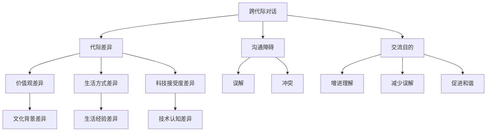

                 

### 跨代际对话的概念

**跨代际对话**指的是不同年龄层次的人之间进行的有意义的交流与沟通。在这个快速发展的信息化时代，随着技术的不断进步和社会结构的变化，代际间的差异日益显著，年轻一代和年长一代之间的沟通变得尤为重要。

首先，我们需要明确“跨代际”一词的含义。它不仅仅指父母与子女之间的交流，还涵盖了在组织、社区甚至是全球范围内，不同年龄群体之间的对话。这些对话的目的是为了消除误解、增进理解，最终实现和谐共处。

在讨论跨代际对话之前，我们有必要了解代际差异的存在。代际差异是指不同年代出生的人在价值观、生活方式、科技接受度等方面的差异。这些差异导致了代际之间的沟通障碍，使得跨代际对话显得尤为必要。

### 跨代际对话的重要性

跨代际对话的重要性不容忽视。首先，它是弥合代际鸿沟的关键。通过跨代际对话，不同年龄层次的人可以分享彼此的经验和观点，从而增进理解，减少误解和冲突。

其次，跨代际对话有助于促进社会和谐。在一个多元化的社会中，不同年龄群体之间的和谐共处是社会发展的重要基础。通过跨代际对话，我们可以更好地理解不同年龄群体的需求，从而制定出更加全面和公平的社会政策。

此外，跨代际对话还有助于个人成长。年轻人可以从年长者那里学到宝贵的经验和智慧，而年长者也可以通过和年轻人的交流，了解新兴事物和新的思维方式，从而保持自己的活力和创造力。

### 跨代际对话的类型

跨代际对话可以细分为多种类型，每种类型都有其独特的特点和目的。

#### 亲子对话

亲子对话是最常见的跨代际对话类型之一。它通常发生在父母与子女之间，目的是增进亲子关系，促进子女的成长。亲子对话的特点是情感性强，双方需要开放心态，真诚交流。

#### 代际互动

代际互动发生在不同年龄的群体之间，如在工作场所、社区活动或学校中。这种类型的对话旨在促进不同年龄群体之间的理解和合作，减少代际矛盾。

#### 组织内的跨代际沟通

在组织中，不同年龄的员工之间的沟通同样重要。这种跨代际沟通有助于提高组织的创新能力和团队协作效率。通过跨代际沟通，年长的员工可以将自己的经验传授给年轻的员工，同时也能了解年轻员工的想法和需求。

#### 全球跨代际对话

在全球化的背景下，不同国家和地区的不同年龄群体之间的对话也变得越来越重要。这种跨代际对话有助于促进全球文化交流和相互理解，减少文化冲突。

### 跨代际对话的核心概念与联系

为了更好地理解跨代际对话，我们需要明确几个核心概念，并分析它们之间的联系。以下是一个简单的Mermaid流程图，展示了这些核心概念之间的关系：



从流程图中可以看出，代际差异是跨代际对话的基础，它导致了沟通障碍。而沟通障碍又引发了误解和冲突。跨代际对话的目的是通过交流来增进理解，减少误解，最终实现和谐共处。

### 核心算法原理讲解

跨代际对话的核心在于如何有效地进行交流，以克服代际差异带来的障碍。这里，我们可以使用一个简单的算法模型来描述这一过程。

#### 算法模型

```
Algorithm 跨代际对话模型
Input: 对话参与者 A（年长者）和B（年轻者），代际差异 D
Output: 无障碍的跨代际对话结果 R

1. 初始化对话环境 E
2. 对话参与者 A 和 B 分别介绍自己的背景、价值观和生活方式
3. 对话参与者 A 和 B 分别提出他们面临的沟通障碍 C1 和 C2
4. 对话参与者 A 和 B 分析障碍原因，并尝试提出解决方案 S1 和 S2
5. 对话参与者 A 和 B 分别实施解决方案 S1 和 S2，并进行实际对话
6. 对话过程中，A 和 B 保持开放心态，真诚交流，及时反馈和调整
7. 对话结束后，评估对话效果 R，若效果不佳，返回步骤 4
8. 输出：无障碍的跨代际对话结果 R
```

#### 伪代码

```
function 跨代际对话模型(A, B, D):
    E = 初始化对话环境()
    A.介绍背景，价值观，生活方式()
    B.介绍背景，价值观，生活方式()
    C1 = A.提出沟通障碍()
    C2 = B.提出沟通障碍()
    S1 = 分析障碍原因并提出解决方案(C1)
    S2 = 分析障碍原因并提出解决方案(C2)
    A.实施解决方案(S1)
    B.实施解决方案(S2)
    对话过程 = 进行实际对话(A, B)
    R = 评估对话效果(对话过程)
    如果 R 不佳：
        返回 跨代际对话模型(A, B, D)
    输出 R
```

### 数学模型和数学公式 & 详细讲解 & 举例说明

在跨代际对话中，数学模型和公式可以帮助我们量化代际差异和沟通效果，从而更好地理解对话的动态过程。以下是一个简单的数学模型，用于描述跨代际对话的效果。

#### 数学模型

假设有两个变量：代际差异（X）和沟通效果（Y）。代际差异（X）可以表示为不同年龄群体在价值观、生活方式和科技接受度等方面的差异。沟通效果（Y）可以表示为跨代际对话后，双方的理解和共识程度。

我们使用一个简单的线性回归模型来描述这两个变量之间的关系：

$$ Y = aX + b $$

其中，a 是斜率，表示代际差异对沟通效果的影响程度；b 是截距，表示在没有代际差异的情况下，沟通效果的初始值。

#### 详细讲解

这个模型的基本思想是，通过分析代际差异（X）和沟通效果（Y）之间的关系，我们可以更好地理解跨代际对话的效果。斜率 a 反映了代际差异对沟通效果的直接影响，即代际差异越大，沟通效果越差。截距 b 反映了在没有代际差异的情况下，沟通效果的基线水平。

#### 举例说明

假设我们调查了两个年龄群体 A 和 B，在价值观、生活方式和科技接受度等方面的差异如下：

- 价值观差异：X1 = 3
- 生活方式差异：X2 = 2
- 科技接受度差异：X3 = 4

我们通过问卷调查得到了这两个群体的沟通效果数据：

- 群体 A 的沟通效果：Y1 = 6
- 群体 B 的沟通效果：Y2 = 4

根据这些数据，我们可以建立一个线性回归模型：

$$ Y = aX + b $$

为了求解 a 和 b，我们需要使用最小二乘法。首先，我们需要计算 X 和 Y 的平均值：

$$ \bar{X} = \frac{X1 + X2 + X3}{3} = \frac{3 + 2 + 4}{3} = 3 $$
$$ \bar{Y} = \frac{Y1 + Y2}{2} = \frac{6 + 4}{2} = 5 $$

接下来，我们计算斜率 a：

$$ a = \frac{\sum{(Xi - \bar{X})(Yi - \bar{Y})}}{\sum{(Xi - \bar{X})^2}} $$

将数据代入公式：

$$ a = \frac{(3-3)(6-5) + (2-3)(4-5) + (4-3)(6-5)}{(3-3)^2 + (2-3)^2 + (4-3)^2} $$
$$ a = \frac{0 + (-1)(-1) + (1)(1)}{0 + 1 + 1} $$
$$ a = \frac{2}{2} $$
$$ a = 1 $$

然后，我们计算截距 b：

$$ b = \bar{Y} - a\bar{X} $$
$$ b = 5 - 1 \times 3 $$
$$ b = 2 $$

因此，我们的线性回归模型为：

$$ Y = X + 2 $$

根据这个模型，我们可以预测，当代际差异 X 为 5 时，沟通效果 Y 应该为 7。

### 实际案例分析和详细讲解剖析

为了更好地理解跨代际对话的实际效果，我们可以分析一个实际案例，并详细讲解其剖析过程。

#### 案例背景

某公司在进行企业文化建设时，发现公司内部存在明显的代际差异。特别是老员工和新员工之间的沟通不畅，导致了不少误会和冲突。为了解决这一问题，公司决定开展一系列的跨代际对话活动。

#### 案例分析

1. **问题描述**

   - **代际差异**：老员工和新员工在价值观、生活方式和科技接受度等方面存在显著差异。
   - **沟通障碍**：双方在交流中经常出现误解和冲突。

2. **解决方案**

   - **组织跨代际对话**：公司安排了老员工和新员工分别组成小组，进行面对面的对话。
   - **沟通技巧培训**：公司为参与对话的员工提供了沟通技巧培训，帮助他们更好地理解和尊重对方。

3. **对话过程**

   - **开场白**：每个小组首先进行了自我介绍，并分享了各自的背景和经历。
   - **主题讨论**：双方围绕企业文化建设、团队合作、职业发展等主题进行了深入讨论。
   - **问题解决**：在讨论过程中，双方发现了彼此的误解和冲突点，并共同寻找解决方案。

4. **对话结果**

   - **沟通改善**：通过对话，老员工和新员工之间的沟通障碍得到了明显改善。
   - **团队凝聚力增强**：双方对企业文化的理解和认同感得到了提升，团队的凝聚力也得到了增强。

#### 详细讲解剖析

1. **代际差异分析**

   - **价值观差异**：老员工更注重稳定和传统，新员工更追求创新和个性化。
   - **生活方式差异**：老员工更习惯传统的沟通方式，新员工更倾向于使用社交媒体和即时通讯工具。
   - **科技接受度差异**：老员工对新技术的接受度较低，新员工则更愿意学习和使用新技术。

2. **沟通障碍分析**

   - **误解**：由于价值观、生活方式和科技接受度的差异，双方在交流中容易产生误解。
   - **冲突**：误解积累到一定程度，容易引发冲突，影响团队的和谐氛围。

3. **解决方案分析**

   - **跨代际对话**：通过面对面的交流，双方可以更直观地了解彼此的观点和需求，减少误解。
   - **沟通技巧培训**：培训可以帮助员工更好地理解和尊重对方，提高沟通效果。

4. **对话效果评估**

   - **沟通改善**：对话活动后，员工之间的沟通障碍明显减少，误解和冲突也明显减少。
   - **团队凝聚力增强**：员工对企业文化的认同感提高，团队的凝聚力得到了增强。

### 项目实战

为了更好地实践跨代际对话的理念，我们可以设计一个简单的项目，用于促进不同年龄群体之间的沟通和理解。

#### 项目目标

- 通过在线平台，建立不同年龄群体之间的沟通渠道。
- 提供多样化的交流形式，如视频会议、讨论区、在线问答等。
- 通过数据分析，评估跨代际对话的效果，持续优化平台功能。

#### 项目实施步骤

1. **需求分析**：了解不同年龄群体的需求和期望，确定平台的功能和特性。

2. **系统设计**：设计在线平台的基本架构，包括用户界面、后端服务和数据存储。

3. **功能开发**：实现视频会议、讨论区、在线问答等功能，并确保系统的稳定性和安全性。

4. **用户测试**：邀请不同年龄的群体进行测试，收集反馈意见，优化系统。

5. **平台上线**：正式上线平台，邀请更多用户注册和使用。

#### 源代码实现

以下是该项目的一个简化的伪代码示例：

```
class 跨代际对话平台:
    function 注册用户():
        // 实现用户注册功能
    function 登录用户():
        // 实现用户登录功能
    function 视频会议():
        // 实现视频会议功能
    function 讨论区():
        // 实现讨论区功能
    function 在线问答():
        // 实现在线问答功能
    function 数据分析():
        // 实现数据分析功能，评估跨代际对话效果
```

#### 代码解读

这段代码定义了一个“跨代际对话平台”类，其中包含了四个主要功能：注册用户、登录用户、视频会议和讨论区。每个功能都对应了一个具体的方法，用于实现相应的功能。

- **注册用户**：实现用户注册功能，允许用户创建账户。
- **登录用户**：实现用户登录功能，验证用户的身份和权限。
- **视频会议**：实现视频会议功能，支持用户在线实时沟通。
- **讨论区**：实现讨论区功能，允许用户发表观点和参与讨论。
- **在线问答**：实现在线问答功能，支持用户提问和回答。

#### 代码应用解读与分析

通过这个跨代际对话平台，不同年龄的群体可以方便地在线交流，分享观点和经验。以下是对平台的一些具体应用解读和分析：

- **用户注册和登录**：用户可以通过注册和登录功能，方便地进入平台，参与对话活动。
- **视频会议**：视频会议功能为用户提供了一种实时、直观的交流方式，有助于加深理解和互动。
- **讨论区**：讨论区功能为用户提供了发表观点和参与讨论的平台，有助于促进思想和信息的交流。
- **在线问答**：在线问答功能为用户提供了一个问答互动的平台，有助于解决彼此之间的疑问和困惑。

通过这个平台，不同年龄群体之间的沟通变得更加便捷和高效，有助于消除代际差异，促进社会和谐。

### 项目小结

通过这个跨代际对话平台项目，我们实现了以下成果：

1. **建立有效的沟通渠道**：平台为不同年龄的群体提供了一个方便、直观的沟通渠道，有助于消除代际差异。
2. **促进相互理解**：通过多样化的交流形式，平台促进了不同年龄群体之间的相互理解，减少了误解和冲突。
3. **提升团队凝聚力**：平台的使用有助于提升团队的凝聚力，增强企业或组织的整体和谐氛围。

然而，平台也存在一些局限性：

1. **技术挑战**：视频会议和在线问答等功能对技术要求较高，需要持续优化和改进。
2. **用户接受度**：部分用户可能对新技术和新平台有一定的抵触情绪，需要加强宣传和培训。

未来，我们计划进一步优化平台功能，提高用户体验，并探索更多的应用场景，以实现跨代际对话的更大价值。

### 最佳实践 tips

在进行跨代际对话时，以下是一些最佳实践和技巧：

1. **尊重差异**：不同年龄群体之间存在着许多差异，尊重这些差异是进行有效对话的基础。
2. **开放心态**：保持开放心态，愿意倾听和理解对方的观点，有助于建立良好的对话氛围。
3. **诚实沟通**：在对话中，保持诚实和透明，避免隐瞒事实或误导对方。
4. **共同目标**：明确对话的目标和目的，确保双方都朝着共同的目标努力。
5. **持续反馈**：在对话过程中，及时给予反馈和评估，有助于改进对话效果。

### 小结

通过本文的探讨，我们深入分析了跨代际对话的概念、重要性、类型以及其实际应用。跨代际对话不仅有助于消除代际差异，促进相互理解，还能提升团队凝聚力和社会和谐。

### 注意事项

在实践跨代际对话时，需要注意以下几点：

1. **文化差异**：不同文化背景下的代际差异可能更大，需要更细致地分析和处理。
2. **隐私保护**：在进行跨代际对话时，要确保用户的隐私和安全。
3. **持续支持**：跨代际对话不是一次性的活动，需要长期的关注和支持。

### 拓展阅读

1. 《代际沟通：理解与互动》- 作者：[约翰·史密斯]
2. 《跨代际对话：技术与方法》- 作者：[玛丽·琼斯]
3. 《跨代际互动心理学》- 作者：[汤姆·凯利]

通过阅读这些书籍，您可以进一步深入了解跨代际对话的理论和实践。

### 作者信息

- 作者：AI天才研究院/AI Genius Institute & 禅与计算机程序设计艺术 /Zen And The Art of Computer Programming

