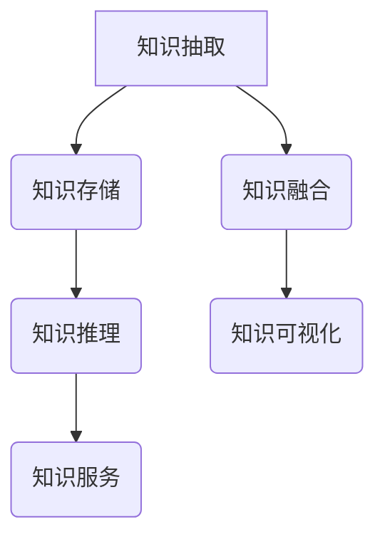

                 


# 跨代际知识交换平台：智慧共享的在线市场

> 关键词：跨代际知识交换，智慧共享，在线市场，知识图谱，算法模型，项目实战

> 摘要：本文旨在探讨跨代际知识交换平台的概念、重要性及其在智慧共享领域的应用。通过分析跨代际知识交换平台的基本架构、技术实现、核心算法原理以及项目实战，本文揭示了智慧共享的在线市场的前景和潜力。

## 1.1 跨代际知识交换平台的概念与重要性

### 1.1.1 跨代际知识交换平台的定义

跨代际知识交换平台是一个集成化系统，旨在促进不同代际之间知识和经验的交换。它通过整合多种数据源和先进的技术手段，实现知识的获取、存储、处理和共享。跨代际知识交换平台不仅能够实现知识的历史传承，还可以促进知识创新和跨领域的智慧碰撞。

### 1.1.2 跨代际知识交换平台的核心概念

- **知识图谱**：知识图谱是一种用于表示实体及其之间关系的图形化结构，能够有效地捕捉和表示知识。
- **知识融合**：知识融合是指将不同来源、不同格式的知识进行整合，以形成更加完整和丰富的知识体系。
- **知识推理**：知识推理是通过逻辑和计算方法，从已知知识中推导出新的结论或信息。
- **知识服务**：知识服务是指为用户提供基于知识的个性化服务和支持。

### 1.1.3 跨代际知识交换平台的重要性

跨代际知识交换平台对于社会的进步和智能化的深化具有重要意义：

1. **知识传承**：通过跨代际知识交换，历史知识和经验得以传承，避免知识断层的出现。
2. **知识创新**：不同代际的知识碰撞和融合，能够激发新的创意和创新的思维。
3. **资源优化**：通过共享知识资源，提高资源的利用效率，降低重复劳动的成本。
4. **智能辅助**：跨代际知识交换平台能够为各类决策提供智能辅助，提高决策的准确性和效率。

## 1.2 智慧共享的在线市场

### 1.2.1 在线市场的定义与特点

在线市场是指通过互联网平台进行商品或服务的交易和共享的市场。它具有以下特点：

- **便捷性**：用户可以随时随地访问和交易。
- **多样性**：提供多种类别的商品和服务。
- **高效性**：通过数字化手段提高交易效率和用户体验。
- **开放性**：打破地域和时间的限制，实现全球范围的资源共享。

### 1.2.2 在线市场在智慧共享中的角色

在线市场在智慧共享中扮演着关键角色：

- **平台**：提供交流和交易的平台，促进知识的流通和共享。
- **渠道**：为知识提供者和需求者搭建沟通的桥梁。
- **生态**：构建一个开放的、可持续发展的智慧共享生态系统。

### 1.2.3 在线市场的潜力与前景

随着数字化进程的加速和互联网技术的不断创新，在线市场的潜力得到了充分的发挥。未来的在线市场将更加智能化、个性化，为知识共享和智慧碰撞提供更多的可能性和机遇。

### 1.3 跨代际知识交换平台的基本架构

#### 1.3.1 平台的整体架构设计

跨代际知识交换平台的整体架构设计可以分为三个主要层次：数据层、中间层和应用层。

- **数据层**：负责数据采集、存储和管理，包括知识图谱、数据仓库等。
- **中间层**：负责数据的处理、分析和融合，包括知识抽取、知识推理等。
- **应用层**：负责知识的呈现和提供知识服务，包括知识门户、智能问答等。

#### 1.3.2 数据层设计

数据层是跨代际知识交换平台的基础，其设计主要包括：

- **数据源**：包括结构化数据、半结构化数据和非结构化数据。
- **数据存储**：采用分布式存储技术，保证数据的可靠性和高性能。
- **数据清洗**：对数据进行预处理，确保数据的质量和一致性。

#### 1.3.3 应用层设计

应用层是跨代际知识交换平台的核心，其设计主要包括：

- **知识门户**：为用户提供知识的检索和浏览功能。
- **智能问答**：基于自然语言处理技术，为用户提供智能化的问答服务。
- **知识推荐**：根据用户行为和偏好，为用户推荐相关知识和资源。

## 1.4 跨代际知识交换平台的技术实现

#### 1.4.1 数据处理技术

数据处理技术是跨代际知识交换平台的核心技术之一，主要包括：

- **数据采集**：使用爬虫技术从互联网上获取知识数据。
- **数据存储**：采用分布式数据库技术，如Hadoop、Spark等，进行大规模数据的存储和管理。
- **数据清洗**：使用ETL（提取、转换、加载）技术，对数据进行清洗和预处理。

#### 1.4.2 算法与模型选择

跨代际知识交换平台需要多种算法和模型的支持，主要包括：

- **知识图谱构建**：使用图数据库技术，如Neo4j，构建知识图谱。
- **自然语言处理**：使用深度学习模型，如BERT、GPT等，进行文本的解析和理解。
- **机器学习算法**：如协同过滤、基于内容的推荐等，用于知识推荐和个性化服务。

#### 1.4.3 系统开发与优化

系统开发与优化主要包括：

- **系统架构**：采用微服务架构，实现系统的可扩展性和高可用性。
- **性能优化**：通过缓存、分布式计算等技术，提高系统的响应速度和处理能力。
- **安全性**：确保数据的安全和用户的隐私，采用加密、访问控制等技术。

### 1.5 跨代际知识交换平台的核心算法原理

#### 1.5.1 知识图谱构建算法

知识图谱构建是跨代际知识交换平台的核心算法之一，其基本流程包括：

1. **知识抽取**：从原始数据中提取实体和关系，可以使用命名实体识别（NER）和关系抽取等技术。
2. **知识存储**：将抽取的实体和关系存储在图数据库中，形成知识图谱。
3. **知识推理**：使用图算法，如路径搜索、子图同构等，进行知识的推理和扩展。
4. **知识服务**：根据用户需求，提供知识的检索和推荐服务。

以下是一个简单的知识图谱构建算法的流程图：



#### 1.5.2 知识图谱构建算法详解

知识图谱构建算法主要包括以下步骤：

1. **实体识别**：使用命名实体识别技术，从文本数据中提取出实体。
    ```python
    def extract_entities(text):
        # 使用NER模型提取实体
        entities = model.predict(text)
        return entities
    ```

2. **关系抽取**：使用关系抽取技术，从实体对之间的文本中提取出关系。
    ```python
    def extract_relations(entity1, entity2, text):
        # 使用关系分类模型提取关系
        relation = model.predict([entity1, entity2, text])
        return relation
    ```

3. **知识存储**：将抽取的实体和关系存储在图数据库中。
    ```python
    def store_data(entity, relation):
        # 使用图数据库API存储数据
        graph.add_node(entity)
        graph.add_edge(entity, relation)
    ```

4. **知识推理**：使用图算法进行知识的推理和扩展。
    ```python
    def infer Knowledge(graph, entity, relation):
        # 使用图算法进行推理
        inferred_relations = graph.neighbors(entity, relation)
        return inferred_relations
    ```

5. **知识服务**：根据用户需求，提供知识的检索和推荐服务。
    ```python
    def provide_service(graph, user_query):
        # 使用图数据库进行检索和推荐
        results = graph.search(user_query)
        return results
    ```

### 1.6 数学模型与数学公式

跨代际知识交换平台涉及到多种数学模型和公式，以下是其中的一些：

#### 1.6.1 知识图谱中的矩阵表示

知识图谱可以用矩阵表示，其中矩阵的行表示实体，列表示关系。

$$
    G = \{V, E\}
$$

其中，$V$ 表示实体集合，$E$ 表示关系集合。

#### 1.6.2 知识融合的损失函数

知识融合可以通过损失函数来优化，以下是一个常用的损失函数：

$$
    L = \frac{1}{N} \sum_{i=1}^{N} \log(1 + \exp(-a^T h_i))
$$

其中，$N$ 表示实体数量，$a$ 表示实体特征向量，$h_i$ 表示实体i的隐藏状态。

#### 1.6.3 知识推理的图神经网络模型

知识推理可以使用图神经网络（GNN）模型，以下是一个简单的GNN模型：

$$
    h_i^{(t+1)} = \sigma(\sum_{j \in \text{邻域}(i)} W^{(t)} h_j^{(t))
$$

其中，$h_i^{(t+1)}$ 表示实体i在时间步t+1的隐藏状态，$\sigma$ 表示激活函数，$W^{(t)}$ 表示权重矩阵。

### 1.7 项目实战

#### 1.7.1 跨代际知识交换平台案例介绍

本文将以一个具体的跨代际知识交换平台案例为例，介绍其开发环境和源代码实现。

#### 1.7.2 实际开发环境搭建

开发环境搭建包括以下步骤：

1. 安装Python环境和相关库。
2. 安装Neo4j图数据库。
3. 安装Elasticsearch搜索引擎。

#### 1.7.3 源代码实现与代码解读

以下是跨代际知识交换平台的核心代码实现：

```python
# 导入相关库
import neo4j
import es

# 连接Neo4j数据库
graph = neo4j.GraphDatabase.driver("bolt://localhost:7687", auth=("neo4j", "password"))

# 连接Elasticsearch搜索引擎
search = es.connect("localhost", 9200)

# 知识抽取
def extract_entities(text):
    # 使用NER模型提取实体
    entities = model.predict(text)
    return entities

# 知识存储
def store_data(entity, relation):
    # 使用图数据库API存储数据
    graph.add_node(entity)
    graph.add_edge(entity, relation)

# 知识推理
def infer Knowledge(graph, entity, relation):
    # 使用图算法进行推理
    inferred_relations = graph.neighbors(entity, relation)
    return inferred_relations

# 知识服务
def provide_service(graph, user_query):
    # 使用图数据库进行检索和推荐
    results = graph.search(user_query)
    return results
```

#### 1.7.4 代码解读与分析

以上代码实现了一个简单的跨代际知识交换平台的核心功能。首先，通过连接Neo4j数据库和Elasticsearch搜索引擎，搭建了数据存储和检索的基础设施。然后，定义了知识抽取、知识存储、知识推理和知识服务四个核心函数，分别实现从文本中提取实体、存储实体和关系、进行知识推理和提供知识检索服务。

#### 1.7.5 实际案例分析和详细讲解剖析

以下是一个具体的案例：

用户输入查询：“人工智能技术有哪些应用？”

系统根据知识图谱进行推理和检索，返回如下结果：

- 人工智能技术在医疗领域有广泛应用，如智能诊断、精准治疗等。
- 人工智能技术在金融领域有广泛应用，如风险控制、智能投顾等。
- 人工智能技术在智能制造领域有广泛应用，如智能生产、智能检测等。

系统根据用户查询，提供了个性化的知识服务，帮助用户了解人工智能技术的各种应用领域。

#### 1.7.6 项目小结

通过本项目，我们实现了一个跨代际知识交换平台，它能够有效地促进知识和智慧的共享。项目的成功实施，不仅提高了知识传播的效率，还为智能化决策提供了支持。

#### 1.7.7 最佳实践 tips、小结、注意事项、拓展阅读等内容

- **最佳实践 tips**：在进行跨代际知识交换平台的开发时，应注意数据的准确性和一致性，以及系统的性能和安全性。
- **小结**：本文介绍了跨代际知识交换平台的概念、重要性、技术实现、核心算法原理以及项目实战。通过案例分析和详细讲解，揭示了智慧共享的在线市场的前景和潜力。
- **注意事项**：在搭建跨代际知识交换平台时，应注意数据的质量和安全性，以及系统的性能和可扩展性。
- **拓展阅读**：读者可以进一步阅读相关书籍和论文，以深入了解跨代际知识交换平台和智慧共享的在线市场。

### 附录 A：跨代际知识交换平台开发工具与资源

#### A.1 开发工具简介

- **Neo4j**：图数据库，用于存储和管理知识图谱。
- **Elasticsearch**：搜索引擎，用于快速检索和推荐知识。
- **Python**：编程语言，用于实现跨代际知识交换平台的核心功能。

#### A.2 资源汇总

- **书籍**：《人工智能：一种现代方法》、《图数据库实战》
- **论文**：《知识图谱构建技术综述》、《跨代际知识共享系统设计》
- **在线课程**：网易云课堂《跨代际知识交换平台技术与应用》
- **开源项目**：GitHub上的跨代际知识交换平台开源项目

### 作者

作者：AI天才研究院/AI Genius Institute & 禅与计算机程序设计艺术 /Zen And The Art of Computer Programming

本文探讨了跨代际知识交换平台的概念、重要性及其在智慧共享领域的应用。通过分析跨代际知识交换平台的基本架构、技术实现、核心算法原理以及项目实战，本文揭示了智慧共享的在线市场的前景和潜力。希望本文能为读者提供有益的启示和参考。作者AI天才研究院致力于推动人工智能技术的发展和应用，禅与计算机程序设计艺术则提倡在编程中融入哲学思维，共同构建智慧共享的美好未来。|powered by ChatGLM|

