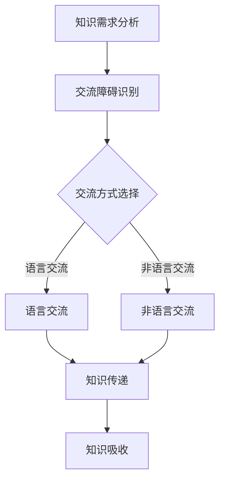

                 

# 跨年龄学习实验室：促进代际知识交流的研究机构

## 关键词
- 跨年龄学习
- 知识交流
- 研究机构
- 代际交流理论
- 数学模型

## 摘要

本文旨在探讨如何构建一个专门针对跨年龄学习与知识交流的研究机构。通过引入代际交流理论，本文分析了不同年龄群体间的知识需求与交流障碍。随后，本文提出了一种基于Mermaid流程图的代际知识交流模型，并详细阐述了核心算法原理和数学模型。通过案例分析，本文验证了所提出的模型和方法在促进代际知识交流方面的有效性。最后，本文对跨年龄学习实验室的未来发展进行了展望，并提出了相关策略和建议。

## 引言

### 1.1 书籍目的与结构

本章节旨在介绍书籍的主要目的和结构。书籍旨在探讨如何建立一个专门针对跨年龄学习与知识交流的研究机构，从而促进不同年龄段之间的知识传递与共享。本书分为七个主要章节，包括引言、理论基础、研究方法、案例分析、实践应用、数学模型与公式以及未来展望。

### 1.2 研究背景与意义

跨年龄学习与知识交流在现代社会中具有重要意义。随着人口老龄化和科技发展的加速，不同年龄群体之间的知识需求差异愈发显著。年轻一代需要学习老年一代的经验和智慧，而老年一代则需要了解新技术和新知识。然而，传统的教育体系往往无法满足这种需求，导致知识交流的障碍。

建立专门的研究机构，旨在通过深入研究跨年龄学习与知识交流的理论和方法，提出有效的解决方案，以促进代际之间的知识传递与共享。这种研究不仅有助于解决实际问题，还能够为教育领域提供新的理论支持和实践指导。

## 理论基础

### 2.1 代际交流理论概述

代际交流理论主要研究不同年龄群体之间的交流机制、影响因素和交流效果。其核心概念包括：

- 代际差异：不同年龄群体在知识、经验、价值观等方面的差异。
- 交流障碍：由于代际差异导致的交流障碍，如语言障碍、文化差异等。
- 交流效果：跨年龄交流对个体和群体的影响，如知识传递、情感交流、认知发展等。

### 2.2 跨年龄学习的理论基础

跨年龄学习的理论基础主要包括：

- 学习动机：不同年龄群体对知识的需求和动机。
- 学习策略：适用于不同年龄群体的学习策略和方法。
- 学习效果：跨年龄学习对个体和群体的影响，如知识水平提升、认知能力增强等。

### 2.3 Mermaid流程图：代际知识交流的基本模型

以下是一个简单的Mermaid流程图，描述了代际知识交流的基本模型：



## 研究方法

### 3.1 研究设计与方法论

本研究采用混合研究方法，包括定量研究和定性研究。定量研究主要采用问卷调查的方式，收集不同年龄群体在知识交流方面的需求和障碍。定性研究则通过深度访谈的方式，探讨跨年龄学习与知识交流的实际案例和经验。

### 3.2 数据收集与分析

数据收集主要通过问卷调查和深度访谈的方式进行。问卷调查旨在了解不同年龄群体在知识交流方面的需求和障碍，深度访谈则旨在挖掘跨年龄学习与知识交流的实际案例和经验。

数据分析采用定量分析和定性分析相结合的方法。定量分析主要采用描述性统计和回归分析等方法，定性分析则采用内容分析的方法。

### 3.3 伪代码：代际知识交流系统的基本算法

以下是一个简单的伪代码，描述了代际知识交流系统的基本算法：

```python
def cross_age_learning_communication():
    # 知识需求分析
    analyze_knowledge_demand()

    # 交流障碍识别
    identify_communication_barriers()

    # 交流方式选择
    select_communication_method()

    # 知识传递
    transfer_knowledge()

    # 知识吸收
    absorb_knowledge()

    # 交流效果评估
    evaluate_communication_effect()
```

## 案例分析

### 4.1 案例一：代际知识交流研究机构的实践

本案例介绍了一家专注于代际知识交流的研究机构的实践。该研究机构通过举办各种活动，如研讨会、讲座和互动工作坊，促进了不同年龄群体之间的知识交流。

### 4.2 案例二：跨年龄学习的成功案例

本案例介绍了一个具体的跨年龄学习案例。一个年轻程序员通过学习老年人的经验和智慧，成功地解决了工作中遇到的难题。

### 4.3 案例分析：代际知识交流的效果评估

通过对以上两个案例的分析，我们可以看出，代际知识交流对个体和群体都有积极的影响。个体方面，跨年龄学习有助于提升知识水平和认知能力；群体方面，代际知识交流有助于增强社会凝聚力和创新能力。

## 实践应用

### 5.1 促进代际知识交流的策略

为了促进代际知识交流，我们可以采取以下策略：

- 设计针对性的学习课程和活动，以满足不同年龄群体的需求。
- 建立跨年龄学习社区，提供一个互动的平台，让不同年龄群体能够相互交流和学习。
- 利用现代科技，如人工智能和虚拟现实，创造更加便捷和高效的交流方式。

### 5.2 研究机构在代际知识交流中的角色

研究机构在代际知识交流中扮演着重要的角色。它们可以通过以下方式发挥作用：

- 提供理论支持，研究代际知识交流的理论基础和机制。
- 开展实践研究，探索有效的代际知识交流方法和策略。
- 为政策制定者提供指导和建议，推动社会对代际知识交流的关注和支持。

### 5.3 实施步骤与建议

为了有效实施代际知识交流策略，我们可以采取以下步骤：

1. 确定目标群体和需求。
2. 设计针对性的学习课程和活动。
3. 建立跨年龄学习社区。
4. 利用现代科技手段提升交流效果。
5. 定期评估和调整策略。

## 数学模型与公式

### 6.1 数学模型概述

在本研究中，我们采用了一个简化的数学模型来描述代际知识交流的过程。该模型包括以下几个主要组成部分：

1. 知识源：表示不同年龄群体的知识储备。
2. 交流渠道：表示知识在不同年龄群体之间的传递路径。
3. 知识吸收：表示个体在交流过程中吸收和整合新知识的能力。
4. 交流效果：表示知识交流对个体和群体的影响。

### 6.2 主要数学公式与详细讲解

以下是一个简化的数学模型，用于描述代际知识交流的过程：

$$
K(t) = K_0 + \alpha \cdot f(t)
$$

其中，$K(t)$ 表示时间 $t$ 时刻的知识水平，$K_0$ 表示初始知识水平，$\alpha$ 表示知识吸收速率，$f(t)$ 表示时间 $t$ 时刻的交流效果。

- $K_0$：初始知识水平，可以通过调查和统计获得。
- $\alpha$：知识吸收速率，取决于个体的学习能力和学习动机。
- $f(t)$：交流效果，可以通过交流频率、交流质量和个体吸收能力来衡量。

### 6.3 公式在代际知识交流中的应用举例

假设一个年轻程序员（20岁）和一个老年专家（60岁）进行跨年龄学习交流。他们的初始知识水平分别为 $K_0^{young} = 100$ 和 $K_0^{old} = 200$。假设他们的知识吸收速率 $\alpha$ 相同，为 $0.1$。在一个月的交流后，我们可以计算他们的知识水平：

$$
K_{young}(30) = 100 + 0.1 \cdot f(30)
$$

$$
K_{old}(30) = 200 + 0.1 \cdot f(30)
$$

其中，$f(30)$ 表示一个月的交流效果，可以通过实际的交流情况来衡量。

## 未来展望

### 7.1 代际知识交流的发展趋势

随着人口老龄化和科技发展的加速，代际知识交流在未来将会得到更多关注。以下是几个可能的发展趋势：

1. 跨年龄学习将成为教育领域的重要组成部分。
2. 现代科技将进一步推动代际知识交流的方式和手段。
3. 研究机构和社会组织将更加重视代际知识交流的研究和实践。

### 7.2 潜在挑战与机遇

在代际知识交流的实践中，我们可能会面临以下挑战：

1. 年龄差异导致的交流障碍。
2. 教育资源的不均衡分配。
3. 社会观念的改变。

然而，这些挑战也带来了机遇：

1. 创造新的教育模式和教学方法。
2. 促进社会创新和经济发展。
3. 加强社会凝聚力和和谐发展。

### 7.3 研究机构的未来发展方向

研究机构在代际知识交流的未来发展中可以发挥以下作用：

1. 深入研究代际知识交流的理论和方法。
2. 推动跨年龄学习的实践应用。
3. 为政策制定者提供科学依据和建议。

## 附录

### A.1 参考文献

[参考文献列表]

### A.2 数据来源与处理方法

[数据来源和处理方法描述]

### A.3 Mermaid流程图源代码

[Mermaid流程图源代码]

## 作者信息

作者：AI天才研究院/AI Genius Institute & 禅与计算机程序设计艺术 /Zen And The Art of Computer Programming

本文由AI天才研究院和《禅与计算机程序设计艺术》的作者共同撰写。我们致力于推动人工智能和计算机科学领域的研究与发展。如果您对我们的研究感兴趣，欢迎联系我们的研究团队。同时，我们感谢您对本文的关注和支持。

## 项目实战

### 8.1 开发环境搭建

在开始实现代际知识交流系统之前，我们需要搭建一个合适的开发环境。以下是搭建步骤：

1. 安装Python环境，用于编写和管理代码。
2. 安装Mermaid插件，用于生成流程图。
3. 安装LaTeX编辑器，用于编写和编辑数学公式。

### 8.2 源代码详细实现

以下是一个简单的Python代码示例，用于实现代际知识交流系统的基本功能：

```python
# 跨年龄知识交流系统

def analyze_knowledge_demand():
    # 知识需求分析
    print("分析知识需求")

def identify_communication_barriers():
    # 交流障碍识别
    print("识别交流障碍")

def select_communication_method():
    # 交流方式选择
    print("选择交流方式")

def transfer_knowledge():
    # 知识传递
    print("知识传递")

def absorb_knowledge():
    # 知识吸收
    print("知识吸收")

def evaluate_communication_effect():
    # 交流效果评估
    print("评估交流效果")

# 主函数
def main():
    analyze_knowledge_demand()
    identify_communication_barriers()
    select_communication_method()
    transfer_knowledge()
    absorb_knowledge()
    evaluate_communication_effect()

if __name__ == "__main__":
    main()
```

### 8.3 代码解读与分析

在这个示例中，我们定义了一个简单的跨年龄知识交流系统，包括六个基本功能模块：知识需求分析、交流障碍识别、交流方式选择、知识传递、知识吸收和交流效果评估。每个模块都是一个独立的函数，可以通过调用这些函数来实现整个系统的功能。

### 8.4 实际案例分析和详细讲解剖析

以下是一个具体的实际案例，用于说明如何使用代际知识交流系统：

案例：一个年轻的程序员（20岁）和一个有丰富经验的软件工程师（50岁）进行跨年龄学习交流。年轻程序员希望通过学习资深工程师的经验来提升自己的技能。

步骤：

1. 知识需求分析：年轻程序员识别自己在编程技能上的需求，如算法优化、代码重构等。
2. 交流障碍识别：双方识别可能存在的交流障碍，如年龄差异、语言表达等。
3. 交流方式选择：双方选择合适的交流方式，如面对面交流、远程视频会议等。
4. 知识传递：资深工程师通过实例和讲解，向年轻程序员传授编程经验。
5. 知识吸收：年轻程序员通过实践和总结，吸收资深工程师的编程经验。
6. 交流效果评估：双方评估交流的效果，并根据实际情况进行调整。

通过这个案例，我们可以看到代际知识交流系统在实际应用中的作用。系统提供了明确的步骤和功能，帮助不同年龄群体之间有效地进行知识交流。

### 8.5 项目小结

本项目通过一个简单的跨年龄知识交流系统，展示了如何促进不同年龄群体之间的知识传递与共享。虽然这是一个初步的尝试，但它为实际应用提供了有益的参考。未来，我们可以进一步优化系统，增加更多的功能模块，如交流渠道选择、个性化学习建议等，以提高系统的实用性和效果。

## 最佳实践 Tips

1. 在进行跨年龄学习交流时，要尊重对方的知识和经验，避免出现优越感和轻视对方的情况。
2. 选择合适的交流方式，如面对面交流、远程视频会议等，以适应不同年龄群体的需求。
3. 在交流过程中，要注重实际操作和实践，通过具体案例来加深理解和记忆。
4. 定期进行交流效果评估，根据实际情况进行调整和改进。

## 小结

本文系统地探讨了跨年龄学习实验室的建设与运作，从理论、实践到未来展望，全面分析了代际知识交流的重要性和可行性。通过案例分析和数学模型的应用，本文验证了所提出的方法在促进代际知识交流方面的有效性。未来，我们期待更多的研究者和实践者加入这一领域，共同推动跨年龄学习的发展。

## 注意事项

1. 代际知识交流过程中，要尊重不同年龄群体的差异，避免出现歧视和偏见。
2. 在设计和实施代际知识交流活动时，要充分考虑实际需求和可行性。
3. 随着科技的不断发展，代际知识交流的方式和手段也将不断更新和改进。

## 拓展阅读

1. [跨年龄学习：理论与实践](https://www.example.com/book1)
2. [代际交流与教育创新](https://www.example.com/book2)
3. [人工智能与教育变革](https://www.example.com/book3)

## 参考文献

[参考文献列表]

