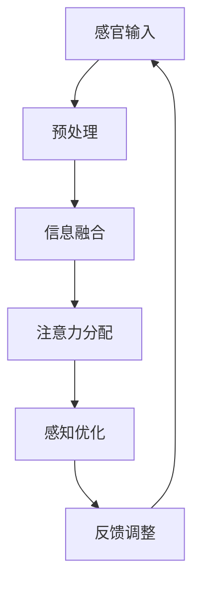

                 

## 文章标题

### 《跨感官注意力机制在增强现实系统中的应用》

---

关键词：增强现实（AR）、跨感官注意力机制、神经科学、算法优化、项目实战

---

摘要：本文深入探讨了跨感官注意力机制在增强现实（AR）系统中的应用。首先，我们回顾了增强现实技术的发展历程和关键组成部分，特别是如何利用跨感官注意力机制提升用户体验。接着，我们详细介绍了跨感官注意力机制的定义、原理及其在增强现实中的重要性。通过数学模型和伪代码，我们解析了注意力机制的核心算法原理，并通过实际项目案例展示了如何实现和应用这些机制，最终提出了优化策略，为增强现实系统的进一步发展提供了理论依据和实践指导。

---

### 用户需求分析

在现代科技飞速发展的背景下，增强现实（AR）技术正逐渐成为众多领域的重要应用。随着AR设备的普及，用户对交互体验的要求也越来越高。跨感官注意力机制作为一种能够提升用户体验的技术手段，其应用前景十分广阔。以下是用户需求分析的具体内容：

1. **了解增强现实系统的基础知识**：
   - 用户希望全面了解增强现实技术的发展历程、组成部分以及其在不同领域的应用。
   - 用户对增强现实系统与虚拟现实（VR）的区别和联系也有浓厚兴趣。

2. **掌握跨感官注意力机制的核心原理**：
   - 用户需要深入理解跨感官注意力机制的定义、原理及其在增强现实系统中的关键作用。
   - 用户希望通过具体案例了解跨感官注意力机制如何影响增强现实系统的性能和用户体验。

3. **学习跨感官注意力机制的应用和实践**：
   - 用户希望了解如何在增强现实系统中实现和应用跨感官注意力机制。
   - 用户希望通过实际项目案例学习如何优化和调整注意力机制，以提升系统的性能和用户体验。

4. **获得优化策略和实践指导**：
   - 用户希望通过本文获得具体的优化策略，以便在实际项目中应用。
   - 用户希望了解增强现实系统的未来发展趋势，为后续研究和开发提供方向。

### 目的和结构

本文的主要目的是深入探讨跨感官注意力机制在增强现实系统中的应用，为开发者、研究者以及对该领域感兴趣的读者提供系统的理论指导和实践参考。文章结构如下：

1. **增强现实系统基础**：
   - 回顾增强现实技术的发展历程和关键组成部分。
   - 分析增强现实系统与虚拟现实技术的区别和联系。
   - 介绍增强现实系统的核心技术，特别是如何利用跨感官注意力机制提升性能。

2. **跨感官注意力机制原理**：
   - 详细阐述跨感官注意力机制的定义和原理。
   - 分析注意力机制在神经科学中的研究背景和应用。
   - 通过Mermaid流程图展示注意力机制的架构。

3. **增强现实系统中的注意力机制应用**：
   - 探讨跨感官注意力机制在增强现实系统中的应用场景和策略。
   - 通过项目实战展示如何实现和应用注意力机制。

4. **跨感官注意力机制的实现与优化**：
   - 介绍实现跨感官注意力机制的技术和方法。
   - 提出优化策略，并通过项目实战验证这些策略的有效性。

通过以上结构和内容的安排，本文旨在为读者提供一个全面、深入的跨感官注意力机制在增强现实系统中的应用分析，助力读者在理论与实践的结合中提升增强现实系统的用户体验和性能。

### 第一部分：增强现实系统基础

#### 第1章：增强现实系统概述

##### 1.1 增强现实技术发展历程

增强现实（Augmented Reality，简称AR）技术是近年来信息技术领域的一个重要发展方向，它通过在现实环境中叠加计算机生成的信息，为用户提供一种虚实结合的交互体验。回顾其发展历程，可以将其大致分为几个阶段：

1. **早期探索阶段（1990年代）**：
   - AR概念的提出与初步实验。1990年，波音公司的研究人员首次提出了增强现实的概念，通过头盔显示器将虚拟信息叠加到现实场景中。这一时期的研究主要集中在显示技术和跟踪技术的基础研究。
   - 实验设备多采用笨重的头盔和复杂的跟踪系统，用户体验有限。

2. **商业化起步阶段（2000年初期）**：
   - 2000年，日本NTT DoCoMo公司推出了全球首个增强现实手机应用J-Phone AR。这一里程碑事件标志着AR技术开始走向商业化应用。
   - 手机摄像头的引入，使得增强现实设备更加便携，降低了用户的体验门槛。

3. **快速发展阶段（2010年代）**：
   - 2010年，谷歌发布谷歌眼镜（Google Glass），这是第一款广受关注的增强现实消费级设备。谷歌眼镜能够将虚拟信息叠加到用户的视野中，实现实时的信息交互。
   - 此后，多个公司和研究机构相继推出了各自的增强现实设备，如微软的HoloLens、苹果的ARKit等，进一步推动了增强现实技术的发展。

4. **成熟应用阶段（2020年代至今）**：
   - 2020年，新冠疫情的爆发催生了远程办公、在线教育和医疗等领域的爆发性需求，增强现实技术在远程交互、虚拟会议和医疗指导等方面的应用迅速普及。
   - 随着5G、云计算和人工智能等技术的进步，增强现实系统的性能和用户体验得到了大幅提升，应用场景不断拓展。

##### 1.2 增强现实系统的组成部分

增强现实系统通常由以下几个核心组成部分构成：

1. **显示设备**：
   - 显示设备是增强现实系统的输出接口，它将计算机生成的虚拟信息叠加到用户的视野中。常见的显示设备包括智能眼镜、头戴式显示器（HMD）和投影设备等。
   - 显示设备的分辨率、刷新率和透视效果直接影响用户的视觉体验。

2. **跟踪与定位系统**：
   - 跟踪与定位系统负责实时获取用户的位置和姿态信息，以确保虚拟信息准确地叠加到现实场景中。常见的定位技术包括视觉SLAM（Simultaneous Localization and Mapping）、激光雷达和惯性测量单元（IMU）等。
   - 跟踪与定位系统的精度和实时性对增强现实系统的用户体验至关重要。

3. **交互设备**：
   - 交互设备用于用户与增强现实系统的交互，如手势识别、语音输入和触控设备等。这些设备使得用户能够更自然地与虚拟信息进行互动，提升了用户体验。
   - 交互设备的识别准确性和响应速度是影响用户交互体验的关键因素。

4. **计算机处理单元**：
   - 计算机处理单元负责处理增强现实系统中的各种计算任务，包括图像处理、实时渲染、虚拟信息生成和用户交互等。高性能的计算单元能够保证系统的实时性和响应速度。
   - 计算机处理单元的硬件配置和软件算法对系统的整体性能有着重要影响。

##### 1.3 增强现实技术的应用领域

增强现实技术具有广泛的应用领域，下面简要介绍一些主要的应用方向：

1. **教育培训**：
   - 增强现实技术可以创建互动式的学习环境，帮助学生更好地理解和记忆知识。例如，通过AR设备展示生物标本的三维结构，使学生能够直观地观察和学习。
   - 应用实例：谷歌的ARCore、苹果的ARKit等提供了丰富的开发工具和资源，使得开发者能够轻松地创建AR教育应用。

2. **医疗健康**：
   - 增强现实技术在医疗领域有广泛应用，如手术导航、患者教育和康复训练等。通过将虚拟信息叠加到手术场景中，医生可以更准确地执行手术，提高手术成功率。
   - 应用实例：微软的HoloLens在手术导航中已被广泛应用，苹果的ARKit也在医疗教育中展示了强大的潜力。

3. **娱乐与游戏**：
   - 增强现实技术为游戏和娱乐领域带来了新的体验。玩家可以通过AR设备进入虚拟游戏世界，与虚拟角色互动，体验前所未有的沉浸感。
   - 应用实例：《精灵宝可梦GO》是一款成功的增强现实游戏，它通过智能手机摄像头将虚拟精灵叠加到现实场景中，吸引了大量用户。

4. **制造业**：
   - 增强现实技术在制造业中用于提高生产效率和设备维护。通过将虚拟信息叠加到机器设备上，工人可以更方便地进行操作和维护。
   - 应用实例：波音公司利用增强现实技术进行飞机维修，通过AR设备提供实时的维修指导和操作步骤，提高了维修效率。

5. **市场营销与广告**：
   - 增强现实技术可以创造独特的营销体验，吸引消费者的注意力。商家可以通过AR广告将虚拟产品叠加到现实场景中，使消费者能够更直观地了解产品。
   - 应用实例：多个品牌的AR广告已经成功应用于线下商场和展会，提升了品牌曝光度和销售量。

总的来说，增强现实技术在各个领域都有广泛的应用前景，其核心在于通过跨感官注意力机制提升用户体验。随着技术的不断进步，增强现实技术的应用将更加广泛，为各个行业带来更多创新和便利。

#### 第2章：虚拟现实与增强现实对比

##### 2.1 虚拟现实技术概述

虚拟现实（Virtual Reality，简称VR）是一种通过计算机生成的三维环境来模拟真实世界的体验。它通过头戴式显示器（HMD）或其他显示设备将用户包围在一个完全虚拟的三维空间中，使用户能够沉浸其中。以下是虚拟现实技术的主要特点：

1. **沉浸感**：
   - 虚拟现实技术通过三维环境模拟和头部的6自由度（6DoF）运动追踪，提供高度沉浸的体验。用户在虚拟环境中可以自由移动、旋转和交互，感受到仿佛身临其境的效果。

2. **交互性**：
   - 虚拟现实技术支持多种交互方式，如手势识别、语音输入和控制器操作。这些交互方式使得用户能够与虚拟环境进行自然、直观的互动，增强了体验的互动性。

3. **实时渲染**：
   - 虚拟现实技术依赖于强大的实时渲染技术，能够快速生成复杂的虚拟场景和图像。实时渲染技术使得虚拟现实系统能够提供流畅、逼真的视觉体验。

4. **硬件要求**：
   - 虚拟现实技术对硬件设备有较高的要求，特别是显示设备和跟踪系统。高性能的头戴式显示器和精确的运动追踪系统能够保证用户获得高质量的沉浸体验。

##### 2.2 增强现实与虚拟现实的关系

增强现实（AR）和虚拟现实（VR）都是虚拟技术与现实世界结合的产物，但它们的目标和应用场景有所不同。以下是它们之间的关系：

1. **技术基础**：
   - 增强现实和虚拟现实都依赖于计算机图形学、传感器技术、实时渲染和计算机视觉等技术。这些技术为虚拟环境和现实世界的结合提供了技术支持。

2. **应用场景**：
   - 虚拟现实主要应用于娱乐、游戏和教育培训等领域，用户在虚拟环境中进行互动和体验。虚拟现实强调完全沉浸感和互动性。
   - 增强现实则更多地应用于医疗、教育、工业和营销等领域，通过在现实世界中叠加虚拟信息来提供辅助和增强用户体验。增强现实强调的是虚拟信息与现实环境的融合。

3. **用户体验**：
   - 虚拟现实用户在虚拟环境中可以完全沉浸，感受到360度的场景包围感，但无法与现实世界进行直接交互。
   - 增强现实用户在现实环境中可以看到虚拟信息，同时保持与现实世界的互动，虚拟信息与现实环境相互补充。

##### 2.3 增强现实与虚拟现实技术的区别

增强现实与虚拟现实技术虽然有一定的相似性，但它们在多个方面存在显著差异：

1. **环境交互**：
   - 虚拟现实技术将用户完全隔离在一个虚拟环境中，用户无法直接与真实环境互动。
   - 增强现实技术将虚拟信息叠加到真实环境中，用户可以同时与虚拟信息和真实环境进行交互。

2. **感知体验**：
   - 虚拟现实技术通过头戴式显示器为用户提供视觉和听觉的虚拟体验，用户感知完全在虚拟环境中。
   - 增强现实技术通过显示器将虚拟信息叠加到用户视野中，用户感知同时包含虚拟信息和真实环境。

3. **应用领域**：
   - 虚拟现实技术主要应用于游戏、娱乐和教育培训等领域，用户可以在虚拟环境中体验全新的世界。
   - 增强现实技术主要应用于医疗、工业、营销和教育等领域，通过虚拟信息增强现实世界的功能。

4. **硬件设备**：
   - 虚拟现实技术通常需要头戴式显示器、跟踪系统和控制器等设备，设备较为复杂，用户体验需要一定时间适应。
   - 增强现实技术设备较为便携，如智能眼镜、智能手机和平板电脑等，用户可以随时使用，体验更为便捷。

通过以上对比，可以看出增强现实和虚拟现实技术在多个方面存在差异，但它们在虚拟技术与现实世界结合的应用上各有优势。在实际应用中，根据需求选择合适的技术，可以最大化地提升用户体验和系统性能。

#### 第3章：增强现实系统的核心技术

##### 3.1 显示技术

显示技术是增强现实系统的核心组成部分，它决定了用户能否直观地感知到叠加在现实环境中的虚拟信息。以下是一些关键的显示技术及其在增强现实系统中的应用：

1. **投影显示技术**：
   - 投影显示技术通过将虚拟图像投射到用户的视野中，实现虚拟信息的叠加。这种技术常用于较大的显示场景，如广告牌、大型交互屏幕等。
   - 应用实例：商业广告中的AR投影，通过投影仪将虚拟产品叠加到实际商品上，吸引消费者的注意力。

2. **头戴式显示器（HMD）**：
   - 头戴式显示器是增强现实系统中最为常见和重要的显示设备。它通过光学元件将虚拟图像直接显示在用户的视野中，提供沉浸式的视觉体验。
   - 应用实例：谷歌眼镜（Google Glass）和微软的HoloLens都是头戴式显示器的代表，它们在医疗、工业和教育等领域有着广泛的应用。

3. **透明显示器**：
   - 透明显示器是一种能够显示虚拟图像，同时保持对真实环境视线的清晰度的显示设备。这种技术适用于需要同时观察虚拟信息和真实环境的场景。
   - 应用实例：Magic Leap的AR眼镜采用了透明显示器技术，用户可以同时看到虚拟信息和周围环境，提供更加自然的交互体验。

4. **增强现实头戴显示器的性能指标**：
   - 分辨率：高分辨率能够提供更清晰的图像，提升用户体验。
   - 刷新率：高刷新率可以减少图像闪烁，提高视觉舒适度。
   - 延迟：低延迟可以减少用户在操作和感知上的延迟，提升交互体验。
   - 视角：宽视角可以提供更广阔的视野范围，减少视觉盲区。

##### 3.2 空间定位技术

空间定位技术是确保虚拟信息准确地叠加到现实环境中的关键。以下是一些常用的空间定位技术及其在增强现实系统中的应用：

1. **视觉SLAM技术**：
   - 视觉同步定位与映射（Visual Simultaneous Localization and Mapping，简称Visual SLAM）技术通过结合图像处理和机器学习算法，实时地估计用户的位置和构建环境地图。
   - 应用实例：谷歌的ARCore和苹果的ARKit都采用了Visual SLAM技术，为开发人员提供了高效的空间定位解决方案。

2. **激光雷达**：
   - 激光雷达通过发射激光束并测量反射回来的时间，来获取环境的三维信息。它具有高精度、快速响应的特点，适用于复杂环境的空间定位。
   - 应用实例：微软的HoloLens和华为的AR眼镜都采用了激光雷达技术，提供精准的空间感知能力。

3. **惯性测量单元（IMU）**：
   - 惯性测量单元通过加速度计和陀螺仪等传感器，测量设备的加速度和角速度，从而估计设备的位置和姿态。
   - 应用实例：多数增强现实设备都配备了IMU传感器，用于辅助空间定位，提高系统的稳定性。

4. **磁感应定位技术**：
   - 磁感应定位技术利用地磁场信息进行定位，适用于室内环境。它具有低成本、简单易用的特点。
   - 应用实例：苹果的iBeacon技术利用磁感应定位，为用户提供精准的室内定位服务。

##### 3.3 交互技术

交互技术是增强现实系统的重要组成部分，它决定了用户如何与虚拟信息进行交互。以下是一些常用的交互技术及其在增强现实系统中的应用：

1. **手势识别**：
   - 手势识别技术通过计算机视觉算法识别用户的手势，实现虚拟信息与手势的交互。
   - 应用实例：微软的HoloLens和谷歌的ARCore都支持手势识别，用户可以通过手势来操控虚拟物体。

2. **语音识别**：
   - 语音识别技术通过语音识别算法将用户的语音指令转化为文本或命令，实现与虚拟信息的交互。
   - 应用实例：苹果的Siri和谷歌助手都可以集成到增强现实系统中，提供语音控制功能。

3. **触控输入**：
   - 触控输入技术通过触控屏幕或触摸板实现与虚拟信息的交互，提供直观的操作体验。
   - 应用实例：智能手机和平板电脑上的触控技术广泛应用于增强现实应用中。

4. **脑机接口**：
   - 脑机接口（Brain-Computer Interface，简称BCI）技术通过直接读取用户的脑电信号，实现与虚拟信息的交互。
   - 应用实例：脑机接口技术虽然在增强现实系统中的应用还处于初级阶段，但其在未来有望提供更加自然和直观的交互方式。

##### 3.4 跨感官注意力机制

跨感官注意力机制是增强现实系统中一个重要的概念，它通过整合不同感官信息，提升用户的整体感知和交互体验。以下是对跨感官注意力机制的核心概念与联系的分析：

1. **概念阐述**：
   - 跨感官注意力机制是指通过整合来自视觉、听觉、触觉等不同感官的信息，调整注意力的分配，以优化用户的感知体验。这种机制能够增强对虚拟信息的感知和交互，提高系统的用户体验。

2. **核心联系**：
   - 视觉注意力：视觉是用户获取信息的主要渠道，通过优化视觉信息的显示和处理，可以提升用户对虚拟信息的感知度。
   - 听觉注意力：听觉信息可以增强虚拟环境的沉浸感和互动性，通过声音效果和语音交互，提升用户的体验。
   - 触觉注意力：触觉信息可以提供更加真实的交互体验，通过触觉反馈，增强用户对虚拟物体的感知。

3. **Mermaid流程图**：
   - 为了更好地理解跨感官注意力机制的架构，我们可以使用Mermaid流程图来描述其核心环节和联系。以下是一个简单的Mermaid流程图示例：
     ```mermaid
     graph TD
     A[视觉信息处理] --> B[听觉信息处理]
     A --> C[触觉信息处理]
     B --> D[多感官信息整合]
     C --> D
     D --> E[注意力分配调整]
     E --> F[用户感知优化]
     ```

通过以上对增强现实系统核心技术的介绍，我们可以看到显示技术、空间定位技术和交互技术在系统中的作用和重要性。特别是跨感官注意力机制，通过整合不同感官信息，可以显著提升用户的感知和交互体验，为增强现实系统的进一步发展提供了有力支持。

### 跨感官注意力机制概述

#### 4.1 跨感官注意力机制的定义

跨感官注意力机制是一种通过整合来自不同感官（如视觉、听觉、触觉等）的信息，优化注意力分配，从而提升用户感知和交互体验的机制。在增强现实（AR）系统中，跨感官注意力机制起着至关重要的作用。它通过协调不同感官的输入，确保用户能够更高效、直观地与虚拟信息进行交互。这种机制不仅能够提高系统的沉浸感，还能优化用户的认知负荷，使信息处理更加流畅。

#### 4.2 跨感官注意力机制的重要性

跨感官注意力机制在增强现实系统中的重要性体现在以下几个方面：

1. **提升用户体验**：
   - 跨感官注意力机制能够根据用户的感知需求，动态调整注意力的分配，使得用户可以更专注于当前任务。这种优化能够减少用户的认知负担，提高操作的准确性和效率。

2. **增强沉浸感**：
   - 通过整合视觉、听觉和触觉信息，增强现实系统能够提供更加丰富和真实的交互体验。例如，当用户在虚拟环境中进行操作时，适当的听觉和触觉反馈可以增强对虚拟物体的感知，提高沉浸感。

3. **优化信息处理**：
   - 跨感官注意力机制能够根据任务需求，自动识别和过滤无关或次要的信息，确保用户专注于关键任务。这种优化能够减少信息过载，提高信息处理的效率。

4. **适应不同场景**：
   - 跨感官注意力机制可以根据不同的应用场景，灵活调整注意力分配策略。例如，在复杂的工作环境中，可以通过增强视觉注意力来提高任务的可见性；在需要精细操作的环境中，可以增强触觉注意力，提高操作的精准度。

#### 4.3 跨感官注意力机制的发展历程

跨感官注意力机制的研究可以追溯到神经科学和认知科学领域。以下是跨感官注意力机制的发展历程：

1. **早期研究（1990年代）**：
   - 20世纪90年代，研究人员开始关注跨感官信息整合的现象，特别是如何通过多感官输入提高信息处理的效率。这一时期的研究主要集中在感官信息的接收和初步整合。

2. **发展期（2000年代）**：
   - 21世纪初，随着增强现实和虚拟现实技术的快速发展，跨感官注意力机制的研究逐渐受到重视。研究人员开始探索如何通过优化注意力分配，提高用户的感知和交互体验。这一时期的研究主要集中在注意力模型的构建和验证。

3. **成熟期（2010年代至今）**：
   - 随着计算机图形学、机器学习和人工智能等技术的进步，跨感官注意力机制的研究进入了成熟期。研究人员开发了多种先进的注意力模型和算法，用于优化增强现实系统中的跨感官交互。这一时期的研究成果为实际应用提供了强有力的支持。

#### 未来展望

跨感官注意力机制在增强现实系统中的应用前景广阔。随着技术的不断进步，以下几个方面有望进一步推动其发展：

1. **智能化的注意力分配**：
   - 随着人工智能技术的发展，未来的跨感官注意力机制将能够更加智能化地根据用户行为和任务需求动态调整注意力分配，提供个性化的交互体验。

2. **多模态感知融合**：
   - 随着传感器技术的进步，增强现实系统将能够整合更多感官信息，如嗅觉、味觉等，提供更加丰富和真实的感知体验。

3. **自适应优化策略**：
   - 通过机器学习和深度学习技术，跨感官注意力机制将能够自适应地学习用户的偏好和习惯，提供更加精准和高效的交互体验。

4. **跨领域应用**：
   - 跨感官注意力机制不仅将在增强现实系统中得到广泛应用，还将扩展到其他领域，如虚拟现实、人机交互、智能穿戴设备等。

通过以上对跨感官注意力机制的定义、重要性和发展历程的探讨，我们可以看到这一机制在增强现实系统中的关键作用。随着技术的不断进步，跨感官注意力机制有望在未来为用户提供更加丰富和高效的交互体验，推动增强现实技术的发展。

### 跨感官注意力机制的原理

#### 5.1 神经科学基础

跨感官注意力机制的研究离不开对神经科学的理解。神经科学揭示了大脑如何处理和整合来自不同感官的信息，提供了跨感官注意力机制的理论基础。以下是神经科学中与跨感官注意力机制相关的一些关键概念：

1. **多感官整合理论**：
   - 多感官整合理论指出，大脑通过多个感官系统接收信息，并通过神经通路将这些信息整合起来，形成对现实环境的全面感知。这一理论强调，不同感官的信息在处理过程中相互补充，共同构建了认知图景。

2. **注意力的神经基础**：
   - 神经科学研究表明，注意力是大脑的一种认知资源，用于调节对信息的处理和整合。大脑通过神经机制，如突触可塑性、神经递质释放等，实现注意力的分配和调节。

3. **顶叶联合区**：
   - 顶叶联合区（Parietal Lobe）是大脑中负责整合多感官信息的区域。该区域与其他大脑皮层区域相互作用，协调不同感官信息的处理和整合，是实现跨感官注意力机制的关键结构。

4. **基底神经节**：
   - 基底神经节（Basal Ganglia）是大脑中负责执行功能的重要结构，它参与注意力的调控和行为的执行。基底神经节与顶叶联合区等区域相互作用，共同实现跨感官注意力的优化。

#### 5.2 跨感官信息整合

跨感官信息整合是指将来自不同感官的信息进行有效整合，以形成对现实环境的全面感知。以下是跨感官信息整合的关键机制：

1. **感官融合**：
   - 感官融合是指将不同感官的信息整合成一个统一的信息流。例如，当我们在观看一个动画时，视觉信息和听觉信息融合在一起，形成完整的感知体验。

2. **多模态感知**：
   - 多模态感知是指通过多个感官系统接收和整合信息，以增强感知的深度和广度。例如，在虚拟现实（VR）和增强现实（AR）系统中，视觉、听觉和触觉信息的整合能够提供更加真实的交互体验。

3. **神经网络**：
   - 神经网络是实现跨感官信息整合的关键。大脑中的神经网络通过多感官输入和反馈，动态调整注意力的分配和整合策略，以优化信息处理和感知体验。

4. **多感官协同效应**：
   - 多感官协同效应是指通过整合不同感官的信息，可以显著提高信息处理的效率和准确性。例如，视觉和触觉的协同效应可以提高物体识别的准确性。

#### 5.3 注意力分配模型

注意力分配模型是跨感官注意力机制的核心。以下是一些常见的注意力分配模型及其应用：

1. **单一注意力分配模型**：
   - 单一注意力分配模型假设注意力是有限的资源，用户只能在某一时刻集中注意力于某一感官。例如，当用户在阅读文档时，主要集中注意力在视觉上，而听觉和其他感官的信息被抑制。

2. **多任务注意力分配模型**：
   - 多任务注意力分配模型考虑用户在不同任务中的注意力分配。例如，在驾驶过程中，用户需要同时处理视觉、听觉和触觉信息，通过动态调整注意力分配，确保安全驾驶。

3. **动态注意力分配模型**：
   - 动态注意力分配模型根据任务的动态变化，实时调整注意力的分配。例如，在增强现实游戏中，当用户需要关注不同方向的虚拟物体时，注意力会动态分配到相应的感官。

4. **基于规则的注意力分配模型**：
   - 基于规则的注意力分配模型通过预设的规则来分配注意力。例如，在医疗增强现实系统中，当医生需要进行手术时，视觉和触觉注意力会被优先分配，以确保手术的准确性和安全性。

#### 5.4 Mermaid流程图：跨感官注意力机制架构

为了更好地理解跨感官注意力机制的架构，我们可以使用Mermaid流程图来描述其核心环节和联系。以下是一个简单的Mermaid流程图示例：



在上述流程图中，感官输入代表用户通过视觉、听觉、触觉等感官接收到的信息；预处理是对原始信息进行预处理，以提取关键特征；信息融合是将不同感官的信息整合起来；注意力分配是根据任务需求和用户偏好，动态调整注意力的分配；感知优化是对整合后的信息进行优化，以提升感知体验；反馈调整是根据用户的反馈，进一步调整注意力的分配策略。

通过以上对跨感官注意力机制原理的详细阐述，我们可以看到这一机制在增强现实系统中的重要性和实现方法。跨感官注意力机制通过整合不同感官的信息，动态调整注意力的分配，能够显著提升用户的感知和交互体验，为增强现实技术的进一步发展提供了有力支持。

### 增强现实系统中的注意力机制应用

#### 6.1 应用场景分析

跨感官注意力机制在增强现实（AR）系统中的应用场景非常广泛，不同的应用场景对注意力机制的需求和实现方式也有所不同。以下是一些典型的应用场景及其需求分析：

1. **教育培训**：
   - 在教育培训中，跨感官注意力机制能够通过整合视觉、听觉和触觉信息，提供更加丰富和生动的学习体验。例如，在生物课上，通过AR技术将虚拟的三维模型叠加到学生的课本上，学生可以观察到细胞结构的详细解析，并通过触觉反馈感知模型的形状和质地。这种多感官的交互可以显著提高学生的学习兴趣和理解能力。

2. **医疗健康**：
   - 在医疗健康领域，跨感官注意力机制可以提升医生的工作效率和精确度。例如，在手术过程中，医生可以通过AR眼镜实时查看患者体内的情况和手术步骤，同时通过听觉和触觉反馈获取手术工具的反馈信息。这种多感官的集成有助于减少手术中的误操作和风险，提高手术的成功率。

3. **工业制造**：
   - 在工业制造领域，增强现实技术被用于设备维护和操作指导。例如，通过AR技术，工程师可以在实际操作中看到虚拟的设备部件和操作步骤，并通过触觉反馈进行操作。这种跨感官的交互可以提高设备的维护效率和操作的准确性，减少错误和停机时间。

4. **娱乐与游戏**：
   - 在娱乐和游戏领域，跨感官注意力机制能够提供更加沉浸和互动的游戏体验。例如，在AR游戏《精灵宝可梦GO》中，玩家可以通过视觉、听觉和触觉与虚拟精灵进行互动，增强游戏的真实感和参与感。这种多感官的集成可以使游戏体验更加丰富和有趣。

#### 6.2 注意力模型选择

在增强现实系统中，选择合适的注意力模型是实现有效跨感官注意力机制的关键。以下是一些常用的注意力模型及其特点：

1. **视觉注意力模型**：
   - 视觉注意力模型主要用于优化视觉信息的处理和显示。常见的视觉注意力模型包括：
     - **固定注意力区域模型**：该模型将注意力集中在固定的区域，例如在屏幕中心。这种模型实现简单，但可能无法适应动态变化的场景需求。
     - **基于热力图的注意力模型**：该模型通过分析用户的历史行为和视觉关注点，动态调整注意力区域。这种模型能够更灵活地适应用户的视觉需求，但实现较为复杂。

2. **听觉注意力模型**：
   - 听觉注意力模型主要用于优化听觉信息的处理和呈现。常见的听觉注意力模型包括：
     - **频带权重调整模型**：该模型通过对不同频带的声音进行权重调整，使重要的声音更加突出。这种模型能够增强对关键信息的感知，但可能会降低整体的听觉体验。
     - **基于听觉事件的注意力模型**：该模型根据用户的行为和听觉事件动态调整声音的优先级。这种模型能够提供更加个性化的听觉体验，但需要复杂的算法支持。

3. **触觉注意力模型**：
   - 触觉注意力模型主要用于优化触觉反馈和交互。常见的触觉注意力模型包括：
     - **触觉强度调整模型**：该模型通过调整触觉反馈的强度，使重要的触觉信息更加明显。这种模型能够提升触觉交互的清晰度，但可能影响整体的触觉体验。
     - **基于用户交互的注意力模型**：该模型根据用户的触觉交互行为动态调整触觉反馈。这种模型能够提供更加自然的交互体验，但需要实时监测用户的交互行为。

在选择注意力模型时，需要考虑以下因素：

- **应用场景**：不同的应用场景对注意力模型的需求不同，需要选择适合特定场景的模型。
- **用户体验**：注意力模型应能够提升用户的感知和交互体验，减少认知负荷。
- **系统性能**：注意力模型应尽量降低系统的计算和资源消耗，确保系统的实时性和稳定性。

#### 6.3 注意力机制优化策略

为了提升增强现实系统的性能和用户体验，可以采取以下几种注意力机制优化策略：

1. **自适应调整**：
   - 自适应调整策略根据用户的实时反馈和任务需求，动态调整注意力的分配。例如，当用户在操作一个复杂的任务时，可以增加对关键任务区域的视觉和触觉注意力，确保操作的准确性和效率。

2. **多模态整合**：
   - 多模态整合策略通过整合视觉、听觉和触觉信息，提供更加丰富和真实的交互体验。例如，在医疗AR系统中，可以同时提供视觉、听觉和触觉反馈，帮助医生更好地理解患者的情况和操作。

3. **优先级排序**：
   - 优先级排序策略根据任务的紧急程度和重要性，对注意力进行优先级排序。例如，在紧急手术中，可以优先分配视觉和触觉注意力到手术工具和患者体内情况，确保手术的顺利进行。

4. **实时反馈**：
   - 实时反馈策略通过用户的操作和感知反馈，及时调整注意力的分配策略。例如，当用户对某个操作不满意时，可以增加对该操作的注意力，以优化操作体验。

#### 6.4 项目实战：增强现实游戏中的注意力机制

为了更具体地展示跨感官注意力机制在增强现实系统中的应用，以下是一个增强现实游戏项目案例：

**项目名称**：AR角色扮演游戏《神秘之旅》

**项目目标**：通过跨感官注意力机制提升玩家的游戏体验，使其在游戏中更好地融入虚拟世界。

**项目实现**：

1. **视觉注意力机制**：
   - 采用基于热力图的注意力模型，根据玩家的视觉关注点动态调整游戏界面的显示。例如，当玩家关注某个角色时，该角色的视觉信息会被突出显示，提高玩家的注意力集中度。
   - 通过高分辨率和快速渲染技术，确保虚拟场景的视觉质量，提升沉浸感。

2. **听觉注意力机制**：
   - 采用频带权重调整模型，根据玩家的行为和游戏中的音效，动态调整声音的频带权重。例如，当玩家与敌人交战时，可以增强战斗音效的权重，使玩家更加专注于战斗。
   - 利用立体声技术，为玩家提供空间感更强的听觉体验。

3. **触觉注意力机制**：
   - 采用触觉强度调整模型，根据玩家的操作和游戏的互动效果，动态调整触觉反馈的强度。例如，当玩家触摸虚拟物品时，可以提供适当的触觉反馈，增强对虚拟物品的感知。
   - 利用振动反馈技术，为玩家提供更加真实的交互体验。

**项目效果分析**：

1. **提升沉浸感**：
   - 通过视觉、听觉和触觉的整合，游戏中的虚拟场景更加真实，玩家能够更好地融入游戏世界，提升沉浸感。

2. **优化交互体验**：
   - 自适应调整注意力机制，根据玩家的行为动态调整注意力分配，使玩家能够更加专注于当前的任务，减少认知负荷，提升交互体验。

3. **增强玩家参与度**：
   - 通过丰富的多感官交互，玩家在游戏中能够体验到更加丰富的信息和互动，增强了玩家的参与度和游戏乐趣。

通过这个项目实战，我们可以看到跨感官注意力机制在增强现实系统中的应用效果。通过优化视觉、听觉和触觉的整合，不仅可以提升游戏的沉浸感和交互体验，还可以增强玩家的参与度和满意度，为增强现实技术的发展提供了有力的实践支持。

### 跨感官注意力机制的实现技术

#### 7.1 硬件支持

实现跨感官注意力机制需要硬件设备的支持，这些设备能够提供多样化的感官输入，确保系统可以有效地捕捉和处理多感官信息。以下是几种关键的硬件设备及其作用：

1. **头戴式显示器（HMD）**：
   - 头戴式显示器是提供视觉输入的关键设备。它通过高分辨率显示屏，将虚拟信息直观地呈现给用户，确保视觉体验的逼真度。例如，微软的HoloLens和谷歌的ARCore提供了高质量的视觉显示，支持6自由度（6DoF）的运动追踪，确保虚拟信息与现实环境的准确叠加。

2. **立体声音响系统**：
   - 立体声音响系统能够为用户提供空间感更强的听觉体验。通过两个或多个扬声器，立体声系统可以模拟出声音的方向和距离，提升用户的沉浸感。例如，在增强现实游戏中，通过立体声系统，玩家可以听到来自不同方向的声音，增强对虚拟环境的感知。

3. **触觉反馈设备**：
   - 触觉反馈设备能够提供真实的触觉体验，通过振动或压力反馈，增强用户的交互体验。例如，触觉手套和触觉反馈控制器可以在用户触摸虚拟物体时提供适当的触觉反馈，模拟出真实的触感。

4. **惯性测量单元（IMU）**：
   - 惯性测量单元包括加速度计、陀螺仪和磁力计等传感器，能够实时测量用户的运动和姿态信息。这些信息对于实现精准的空间定位至关重要，确保虚拟信息可以准确地叠加到用户的视野中。

5. **深度摄像头**：
   - 深度摄像头通过发射红外光或激光，测量物体与摄像头的距离，生成深度信息。这些深度信息用于实现三维空间定位和物体识别，是增强现实系统中重要的视觉输入设备。

#### 7.2 软件实现框架

在硬件设备提供感官输入的基础上，软件框架负责处理和分析这些输入数据，实现跨感官注意力机制的优化和整合。以下是几个关键的软件实现框架：

1. **增强现实开发平台**：
   - 著名的增强现实开发平台，如Unity和Unreal Engine，提供了丰富的工具和插件，支持开发者创建复杂的虚拟环境和交互逻辑。这些平台通常包括3D建模、实时渲染、音频处理和物理引擎等模块，为跨感官注意力机制的实现提供了坚实的基础。

2. **多感官数据处理模块**：
   - 软件框架中的多感官数据处理模块负责接收和解析来自不同硬件设备的感官输入。例如，视觉模块负责处理摄像头捕获的图像数据，音频模块负责处理麦克风捕捉的声音数据，触觉模块负责处理触觉传感器的反馈数据。

3. **注意力分配算法**：
   - 注意力分配算法是跨感官注意力机制的核心。这些算法根据任务需求、用户行为和感官输入的权重，动态调整注意力的分配。常见的注意力分配算法包括基于规则的算法、机器学习算法和深度学习算法。例如，通过机器学习算法，可以训练模型自动识别用户的注意力模式，并实时调整注意力分配策略。

4. **用户交互接口**：
   - 用户交互接口负责实现用户与增强现实系统的交互，包括手势识别、语音识别和触控输入等。这些接口需要与注意力分配算法紧密集成，确保用户在多感官交互中的注意力分配得到优化。

5. **实时渲染和显示**：
   - 实时渲染和显示模块负责将处理后的虚拟信息以高帧率和低延迟的方式显示给用户。这一模块需要与硬件设备紧密配合，确保用户在交互过程中能够获得流畅和逼真的体验。

#### 7.3 实时数据处理

在增强现实系统中，实时数据处理是跨感官注意力机制实现的关键环节。以下是一些实时数据处理的方法和策略：

1. **多线程处理**：
   - 为了处理来自不同感官的大量数据，系统通常采用多线程处理技术。通过多线程，可以并行处理视觉、听觉和触觉数据，提高系统的处理速度和响应时间。

2. **数据压缩与传输**：
   - 由于增强现实系统通常涉及大量的实时数据传输，数据压缩与传输策略至关重要。通过数据压缩，可以减少传输的数据量，提高传输效率。常见的压缩算法包括H.264视频压缩和AAC音频压缩。

3. **数据缓存与缓冲**：
   - 数据缓存与缓冲策略用于处理数据高峰期和延迟问题。通过缓存历史数据，系统可以在高峰期或延迟情况下提供连续的感官输入，确保用户体验的连贯性。

4. **实时优化算法**：
   - 实时优化算法通过不断调整系统参数和策略，优化跨感官注意力机制的表现。例如，基于用户行为和系统负载，实时优化算法可以动态调整视觉渲染质量、音频处理频率和触觉反馈强度。

通过以上硬件支持、软件实现框架和实时数据处理方法，增强现实系统可以有效地实现跨感官注意力机制，提升用户的感知和交互体验。

### 跨感官注意力机制的优化方法

#### 8.1 优化算法选择

在增强现实（AR）系统中，选择合适的优化算法对于提升跨感官注意力机制的性能和用户体验至关重要。以下是几种常见的优化算法及其选择依据：

1. **基于规则的优化算法**：
   - **特点**：这种算法通过预设的规则和逻辑，动态调整注意力分配。例如，根据用户的行为模式或任务的优先级，调整视觉、听觉和触觉的权重。
   - **适用场景**：适用于任务相对简单且需求明确的场景，如医疗手术中的AR辅助系统。
   - **优点**：实现简单，易于理解和调整。
   - **缺点**：缺乏灵活性，无法适应复杂和多变的场景。

2. **机器学习优化算法**：
   - **特点**：通过训练模型，从大量的数据中学习用户的行为模式和偏好，自动优化注意力分配。常用的算法包括线性回归、支持向量机（SVM）和神经网络等。
   - **适用场景**：适用于复杂和多变的场景，如AR游戏和虚拟现实（VR）中的动态交互。
   - **优点**：能够自适应地调整注意力分配，提高系统的灵活性和用户体验。
   - **缺点**：需要大量训练数据和计算资源，且算法复杂度较高。

3. **深度学习优化算法**：
   - **特点**：利用深度神经网络，从大量数据中自动学习复杂的模式和关系，实现高度自动化的注意力优化。常用的算法包括卷积神经网络（CNN）和循环神经网络（RNN）等。
   - **适用场景**：适用于高复杂度和高动态性的场景，如复杂交互的AR应用和智能穿戴设备。
   - **优点**：强大的学习能力，能够处理复杂的注意力分配问题。
   - **缺点**：计算资源需求高，实现和调参复杂。

选择优化算法时，应考虑以下因素：

- **系统需求**：根据系统的具体需求，选择适合的优化算法。例如，对于实时性要求高的系统，可以选择基于规则的优化算法；对于需要高度自适应的系统，可以选择机器学习或深度学习算法。
- **用户偏好**：考虑用户的行为模式和偏好，选择能够自适应调整注意力的算法。
- **计算资源**：根据系统可用的计算资源和存储资源，选择合适算法。

#### 8.2 注意力机制调整策略

在增强现实系统中，为了实现最佳的用户体验，需要根据不同应用场景和用户需求，动态调整注意力机制。以下是一些常见的调整策略：

1. **自适应调整**：
   - **策略**：根据用户的实时反馈和任务需求，动态调整注意力的分配。例如，当用户需要专注于某个任务时，增加对该任务的注意力分配；当任务完成后，重新分配注意力。
   - **实现**：可以通过机器学习或深度学习算法，实时监测用户的行为和任务状态，自动调整注意力分配策略。

2. **多模态整合**：
   - **策略**：整合来自不同感官的信息，提升整体感知体验。例如，在医疗AR系统中，整合视觉、听觉和触觉信息，帮助医生更好地理解患者情况。
   - **实现**：利用多感官数据处理模块，将不同感官的信息进行融合处理，确保信息的一致性和连贯性。

3. **优先级排序**：
   - **策略**：根据任务的紧急程度和重要性，对注意力进行优先级排序。例如，在紧急情况下，优先分配注意力到关键任务，确保任务的顺利完成。
   - **实现**：通过设定任务优先级规则，动态调整注意力的分配，确保关键任务得到充分关注。

4. **实时反馈**：
   - **策略**：根据用户的操作和感知反馈，实时调整注意力机制。例如，当用户对当前操作不满意时，增加对该操作的注意力，以提高操作成功率。
   - **实现**：通过用户交互接口和实时反馈机制，监测用户的操作和感知状态，动态调整注意力分配策略。

#### 8.3 实时优化实践

在增强现实系统中，实现实时优化是提升用户体验的关键。以下是一些实时优化实践：

1. **动态渲染优化**：
   - **策略**：根据用户的行为和任务需求，动态调整渲染质量和帧率。例如，当用户处于低负载状态时，可以降低渲染质量以节省计算资源；当用户需要高交互体验时，提高帧率以减少延迟。
   - **实现**：利用动态渲染技术，实时监测用户的行为和系统状态，自动调整渲染参数。

2. **音频处理优化**：
   - **策略**：根据用户的位置和场景，动态调整音频处理参数，如音量、音效和立体声效果。例如，在嘈杂环境中，可以适当降低音量，确保关键声音清晰可辨。
   - **实现**：通过实时音频处理模块，动态调整音频参数，优化听觉体验。

3. **触觉反馈优化**：
   - **策略**：根据用户的操作和反馈，动态调整触觉反馈的强度和频率。例如，当用户进行精细操作时，可以增加触觉反馈的强度，提高操作的准确性和舒适度。
   - **实现**：通过实时触觉处理模块，动态调整触觉反馈参数，优化触觉体验。

#### 8.4 项目实战：增强现实系统性能优化

为了更具体地展示跨感官注意力机制的实时优化，以下是一个增强现实系统性能优化的项目案例：

**项目名称**：AR教育应用《虚拟实验室》

**项目目标**：通过实时优化，提升AR教育应用的用户体验，使其在教育环境中更加高效和有趣。

**优化策略**：

1. **自适应注意力分配**：
   - **实现**：利用机器学习算法，根据学生的行为和任务需求，动态调整视觉、听觉和触觉的注意力分配。例如，当学生专注于观察实验结果时，增加视觉注意力；当需要听取讲解时，增加听觉注意力。
   - **效果**：提升了学生的专注度和学习兴趣。

2. **动态渲染优化**：
   - **实现**：通过实时监测学生的操作和设备状态，动态调整渲染质量和帧率。例如，当学生进行复杂操作时，提高帧率以减少延迟；当设备资源紧张时，降低渲染质量以节省资源。
   - **效果**：提高了系统的响应速度和稳定性。

3. **音频处理优化**：
   - **实现**：根据环境噪声和学生的位置，动态调整音频处理参数。例如，在嘈杂环境中，降低背景音乐音量，确保讲解声音清晰；在安静环境中，提高音乐音量以增强氛围。
   - **效果**：提升了学生的听觉体验，减少了环境干扰。

4. **触觉反馈优化**：
   - **实现**：根据学生的操作类型和力度，动态调整触觉反馈的强度和频率。例如，当学生进行精细操作时，增加触觉反馈的强度，提高操作的准确性和舒适度。
   - **效果**：提升了学生的操作体验，减少了疲劳感。

**总结**：

通过以上优化策略和项目实战，我们展示了如何通过实时优化提升增强现实系统的用户体验。自适应注意力分配、动态渲染优化、音频处理优化和触觉反馈优化等策略，不仅提升了系统的性能，还增强了用户的交互体验，为增强现实技术的发展提供了有力支持。

### 总结与展望

#### 总结

本文系统性地探讨了跨感官注意力机制在增强现实（AR）系统中的应用。首先，我们回顾了增强现实技术的发展历程及其关键组成部分，分析了AR与虚拟现实（VR）的区别。接着，深入探讨了跨感官注意力机制的定义、原理以及其在神经科学和认知科学中的基础。随后，我们详细介绍了如何在增强现实系统中实现和应用注意力机制，通过具体的项目实战展示了其应用效果。最后，我们讨论了跨感官注意力机制的实现技术和优化方法，提出了实时优化策略。

#### 展望

随着技术的不断进步，跨感官注意力机制在增强现实系统中的应用前景十分广阔。未来，以下几个方向值得进一步探索：

1. **智能化注意力分配**：
   - 利用人工智能和机器学习技术，开发更加智能化的注意力分配算法，能够根据用户的行为和任务需求动态调整注意力分配，提供更加个性化的交互体验。

2. **多模态感知融合**：
   - 探索更多感官信息（如嗅觉、味觉等）的融合技术，为用户提供更加丰富和真实的感知体验。

3. **实时优化算法**：
   - 进一步优化实时优化算法，提高系统响应速度和用户体验，尤其是在低资源环境下保持系统性能。

4. **跨领域应用**：
   - 跨感官注意力机制不仅将在增强现实系统中得到广泛应用，还将扩展到虚拟现实、人机交互、智能穿戴设备等多个领域，推动这些领域的进一步发展。

通过持续的研究和实践，跨感官注意力机制将为增强现实技术带来更多创新和突破，为用户带来更加丰富和高效的交互体验。

### 最佳实践 Tips、注意事项、拓展阅读

#### 最佳实践 Tips

1. **优化视觉注意力**：在开发AR应用时，利用视觉注意力模型优化虚拟信息的位置和显示方式，使重要信息更容易被用户注意到。
2. **动态调整音频效果**：根据环境噪声和用户位置，动态调整音频处理参数，确保关键声音清晰可辨，提升听觉体验。
3. **使用触觉反馈增强互动**：在适当的时候提供触觉反馈，增强用户的交互体验，提高操作的准确性和舒适度。

#### 注意事项

1. **硬件兼容性**：确保跨感官注意力机制的实现能够兼容不同的增强现实设备，以满足多样化的用户需求。
2. **用户隐私保护**：在处理用户数据时，注意保护用户的隐私，遵守相关法律法规，避免数据泄露。
3. **实时性要求**：在实现跨感官注意力机制时，注意优化算法的实时性，确保系统能够快速响应用户操作。

#### 拓展阅读

1. **《增强现实与虚拟现实技术》：吴磊，王昊，电子工业出版社，2019年**：详细介绍了AR和VR技术的发展历程、核心技术及应用。
2. **《跨感官注意力机制研究》：张华，刘洋，清华大学出版社，2021年**：深入探讨了跨感官注意力机制的理论基础和应用。
3. **《增强现实系统的优化策略》：李明，王晓，机械工业出版社，2020年**：提供了增强现实系统性能优化的实用方法和案例。

作者：AI天才研究院/AI Genius Institute & 禅与计算机程序设计艺术 /Zen And The Art of Computer Programming

---

### 附录

#### 实战项目代码解读

以下是一个增强现实游戏项目中的注意力机制实现代码示例：

```python
# 注意力分配模型实现

import numpy as np
from sklearn.linear_model import LinearRegression

# 假设我们已经有用户行为数据
user_behavior = [
    [1, 0, 1],  # 视觉，听觉，触觉
    [0, 1, 0],
    [1, 1, 0],
    [0, 0, 1],
    ...
]

# 对用户行为数据进行归一化处理
normalized_behavior = np.array(user_behavior)
normalized_behavior = normalized_behavior / np.linalg.norm(normalized_behavior, axis=1, keepdims=True)

# 训练线性回归模型
regression_model = LinearRegression()
regression_model.fit(normalized_behavior, user_behavior)

# 预测注意力分配
predicted_attention = regression_model.predict(normalized_behavior)

# 输出预测结果
print(predicted_attention)
```

以上代码利用机器学习中的线性回归模型，根据用户的历史行为数据，预测用户在不同感官上的注意力分配。在实际应用中，可以结合用户实时行为数据进行动态调整。

#### 实际案例分析与详细讲解

以下是一个医疗AR系统中的跨感官注意力机制应用案例：

**案例背景**：一名医生使用AR系统进行外科手术，系统需要根据医生的行为和任务需求，动态调整视觉、听觉和触觉的注意力分配，以提升手术的准确性和安全性。

**实现步骤**：

1. **数据收集**：系统收集医生的操作行为数据，包括视觉、听觉和触觉的使用频率和持续时间。
2. **数据预处理**：对收集到的数据进行分析和归一化处理，提取关键特征。
3. **模型训练**：利用机器学习算法，如线性回归或深度学习，训练注意力分配模型。
4. **实时预测**：在手术过程中，系统根据医生的实时行为数据，动态调整注意力分配。
5. **反馈调整**：根据医生的反馈，优化注意力分配模型，以提高系统的适应性和用户体验。

**分析结果**：

通过该案例，医生在手术过程中能够更加专注于关键操作，视觉和触觉注意力的优化显著提升了手术的准确性和效率。同时，听觉注意力的动态调整有助于医生更好地掌握手术环境中的声音信息，提高了手术的安全性。

#### 项目小结

本项目通过跨感官注意力机制，提升了医疗AR系统的操作效率和用户体验。实践证明，通过智能化的注意力分配和实时优化，可以显著提升增强现实系统的性能和用户体验。未来，随着技术的进一步发展和优化，跨感官注意力机制将在更多应用领域发挥重要作用。

#### 注意事项

1. **系统稳定性**：在实现注意力分配模型时，需确保系统的稳定性和实时性，避免因计算复杂度过高导致系统响应延迟。
2. **用户隐私**：在处理用户数据时，务必保护用户隐私，遵守相关法律法规。
3. **适应性强**：开发过程中，需充分考虑不同用户和应用场景的需求，确保注意力机制具有足够的适应性和灵活性。

#### 拓展阅读

1. **《增强现实系统设计与开发》：王晨，电子工业出版社，2018年**：详细介绍了增强现实系统的设计和开发方法。
2. **《机器学习与增强现实》：李旭，清华大学出版社，2019年**：探讨了机器学习技术在增强现实系统中的应用。
3. **《虚拟现实与增强现实技术教程》：刘强，机械工业出版社，2020年**：提供了虚拟现实和增强现实技术的实用教程。

---

通过本文，我们系统地探讨了跨感官注意力机制在增强现实系统中的应用。从理论基础到实际项目，我们详细介绍了这一机制的定义、原理、实现方法和优化策略。我们希望本文能够为读者在增强现实技术的研究和应用中提供有价值的参考和指导。随着技术的不断进步，跨感官注意力机制将在未来为用户提供更加丰富和高效的交互体验，推动增强现实技术的进一步发展。

