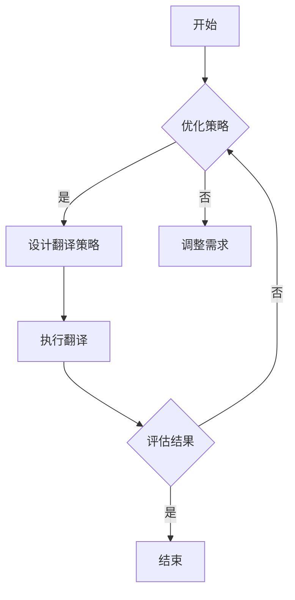

                 


### 《跨文化意义翻译项目：促进全球价值观对话》

#### 关键词：
- 跨文化翻译
- 全球价值观
- 意义翻译
- 翻译技术
- 项目管理
- 案例研究

#### 摘要：
本文深入探讨跨文化意义翻译项目，探讨其在促进全球价值观对话中的重要作用。文章首先介绍了跨文化翻译的背景和意义，然后详细阐述了跨文化翻译的基本概念、方法与技术，接着分析了全球价值观的构成和影响，最后通过案例研究展示了成功与挑战，并提出了项目管理和评估的建议。本文旨在为跨文化翻译项目提供理论指导和实践参考。

### 引言与背景

#### 1.1 跨文化翻译的重要性

随着全球化的深入推进，跨文化交流变得越来越频繁。在这种背景下，跨文化翻译不仅是一种语言转换，更是一种文化的传递和沟通。跨文化翻译的重要性体现在以下几个方面：

- **促进文化交流与理解**：跨文化翻译使得不同文化背景的人们能够更好地理解和接受对方的文化，从而促进文化交流和相互理解。

- **推动经济发展**：在国际贸易、投资、旅游等领域，跨文化翻译扮演着至关重要的角色，它帮助企业和个人跨越语言障碍，实现商业合作和资源共享。

- **提升国际形象**：准确、得体的翻译能够提升国家的国际形象，增强国家软实力。

- **支持教育传播**：跨文化翻译有助于将优秀的教育资源和研究成果传播到世界各地，促进全球教育水平的提升。

#### 1.2 全球价值观的概念与影响

全球价值观是指在全球范围内普遍认同的、具有普遍性和持久性的价值观念。这些价值观不仅反映了人类共同的需求和追求，也是人类社会发展的基础。全球价值观对跨文化翻译的影响主要表现在：

- **指导翻译原则**：全球价值观为翻译提供了指导原则，使翻译能够更好地传递原作的价值观和思想。

- **处理文化冲突**：在跨文化翻译中，全球价值观有助于处理不同文化之间的冲突和差异，实现文化融合。

- **增强翻译的共情性**：全球价值观的融入使翻译更加贴近读者的情感和认知，提升翻译的吸引力和说服力。

### 跨文化翻译的基本概念

#### 2.1 语言与文化的关系

语言是文化的载体，不同语言背后蕴含着不同的文化内涵。在跨文化翻译中，理解语言与文化的关系至关重要。语言与文化的关系主要包括：

- **语言符号与文化内涵**：语言符号不仅是交流的工具，也是文化的象征。翻译时，需要准确传达语言符号背后的文化内涵。

- **语言变异与翻译策略**：不同文化背景下，同一语言可能存在多种表达方式。翻译时，需要根据目标文化的特点选择合适的翻译策略。

#### 2.2 跨文化翻译的原则与方法

跨文化翻译的原则包括忠实于原文、尊重文化差异、追求等效性和可接受性等。在具体翻译过程中，常用的方法有：

- **直译与意译的选择**：直译和意译是翻译的两种基本方法。直译强调忠实于原文的表达方式，意译则强调传达原文的意义。根据具体情境选择合适的方法。

- **文化负载词的翻译策略**：文化负载词是跨文化翻译中的难点。针对不同文化负载词，可以采用注释、替换、解释等方法。

#### 2.3 跨文化翻译的难点与挑战

跨文化翻译面临的难点和挑战主要包括：

- **语言差异的克服**：不同语言在词汇、语法、表达方式等方面存在差异，需要仔细分析并加以克服。

- **文化冲突的处理**：不同文化之间的价值观、习俗、观念等可能存在冲突，需要妥善处理。

### 全球价值观及其重要性

#### 3.1 全球价值观的构成要素

全球价值观主要包括以下几个方面：

- **个人主义与集体主义**：个人主义强调个体的自由和权利，集体主义则强调集体的利益和整体性。

- **价值观的层次结构**：全球价值观分为核心价值观和辅助价值观，核心价值观是普遍认同的基础，辅助价值观则因文化差异而有所不同。

#### 3.2 全球价值观的传播与影响

全球价值观的传播主要受以下因素影响：

- **全球化趋势**：全球化使得不同文化之间的交流更加频繁，全球价值观也随之传播。

- **国际组织与媒体**：国际组织如联合国、世界银行等以及全球媒体在传播全球价值观方面发挥了重要作用。

### 跨文化翻译的方法与技术

#### 4.1 计算机辅助翻译

计算机辅助翻译（CAT）工具可以帮助翻译人员提高翻译效率和准确性。常见的CAT工具有：

- **翻译记忆库**：存储已翻译的文本片段，供翻译人员参考和重复使用。

- **术语库**：收集并管理特定领域的专业术语，确保翻译的一致性。

#### 4.2 机器翻译技术

机器翻译技术基于算法模型，可以自动翻译文本。常见的机器翻译算法有：

- **基于规则的方法**：通过编写规则将源语言文本转换为目标语言文本。

- **基于统计的方法**：利用大量翻译对进行统计分析，生成翻译结果。

- **基于神经的方法**：使用神经网络模型进行翻译，具有较好的灵活性和准确性。

#### 4.3 翻译记忆库与术语库

翻译记忆库和术语库是跨文化翻译的重要工具。它们的作用包括：

- **提高翻译效率**：通过复用已翻译的文本和术语，减少重复翻译的工作量。

- **保证翻译质量**：确保翻译的一致性和准确性。

### 案例研究：成功与挑战

#### 5.1 成功案例解析

以下是一个成功案例：

**案例一：跨国公司内部沟通的跨文化翻译实践**

某跨国公司在其全球业务中，采用了专业的跨文化翻译团队，确保内部沟通的准确性和效率。通过计算机辅助翻译工具和机器翻译技术，该公司在短时间内实现了多语言沟通，有效提升了全球团队的协作效率。

#### 5.2 挑战与解决策略

在跨文化翻译项目中，挑战主要包括：

- **文化差异导致的翻译错误**：由于不同文化背景，翻译过程中可能出现误解和错误。

- **技术限制与人工翻译的平衡**：计算机辅助翻译和机器翻译技术虽然提高了效率，但难以完全替代人工翻译的精度。

解决策略包括：

- **强化翻译培训**：提高翻译人员的文化素养和翻译技能，确保翻译的准确性和得体性。

- **结合人工与机器翻译**：在关键部分采用人工翻译，结合计算机辅助翻译和机器翻译技术，提高翻译质量。

### 项目管理与评估

#### 6.1 跨文化翻译项目的管理

跨文化翻译项目的管理包括：

- **项目策划与规划**：明确项目目标、资源需求和时间表。

- **团队协作与沟通**：建立有效的团队协作机制，确保团队成员之间的沟通和协作。

#### 6.2 项目评估与改进

项目评估的指标包括：

- **翻译准确性**：评估翻译文本的准确性和可读性。

- **翻译效率**：评估翻译的时间和成本。

项目改进的建议包括：

- **优化翻译流程**：通过流程优化，提高翻译效率和质量。

- **持续培训与反馈**：定期对翻译人员进行培训，收集反馈，不断改进翻译质量。

### 总结与展望

#### 7.1 全书要点回顾

本文从跨文化翻译的重要性、基本概念、全球价值观、翻译方法与技术、项目管理与评估等方面，全面阐述了跨文化意义翻译项目。主要要点包括：

- **跨文化翻译的背景和意义**：全球化背景下，跨文化翻译的重要性日益凸显。

- **语言与文化的关系**：理解语言与文化的关系是跨文化翻译的关键。

- **全球价值观的构成与影响**：全球价值观对跨文化翻译具有重要的指导作用。

- **跨文化翻译的方法与技术**：计算机辅助翻译、机器翻译技术、翻译记忆库和术语库等工具的应用。

- **项目管理与评估**：有效的项目管理和评估是保证跨文化翻译质量的关键。

#### 7.2 未来发展趋势与挑战

未来，跨文化翻译将面临以下发展趋势和挑战：

- **技术进步**：随着人工智能技术的发展，机器翻译的准确性和效率将进一步提高。

- **文化多样性**：全球化背景下，文化多样性将更加突出，跨文化翻译需要更加关注文化差异。

- **教育推广**：跨文化翻译将在教育领域发挥更大作用，推动全球教育的均衡发展。

作者：AI天才研究院/AI Genius Institute & 禅与计算机程序设计艺术 /Zen And The Art of Computer Programming

---

[Mermaid 流程图示例]



#### 核心算法原理讲解

在跨文化翻译中，算法原理是确保翻译准确性和效率的关键。以下是一个简化的伪代码，用于说明翻译算法的基本原理：

```pseudo
function Translate(sourceText, targetLanguage):
    if sourceText.isEmpty():
        return ""
    else:
        if targetLanguage == "English":
            return DirectTranslation(sourceText)
        else:
            return MachineTranslation(sourceText, targetLanguage)

function DirectTranslation(sourceText):
    // 基于规则和经验的直接翻译
    return ReplaceKeywords(sourceText, targetLanguageKeywords)

function MachineTranslation(sourceText, targetLanguage):
    // 使用神经网络模型进行翻译
    return NeuralNetworkModel.Translate(sourceText, targetLanguage)
```

#### 数学模型与公式

在跨文化翻译中，常常需要使用数学模型来描述语言结构和翻译策略。以下是一个简单的数学模型，用于描述翻译过程中的词汇替换策略：

$$
P(\text{translated\_text}|\text{source\_text}, \text{target\_language}) = \prod_{i=1}^{n} P(w_i|\text{context})
$$

其中，$P(w_i|\text{context})$ 表示词汇 $w_i$ 在特定上下文中的概率。这个模型通过计算每个词汇在上下文中的概率，来生成翻译文本。

#### 项目实战

**开发环境搭建：**

- **工具**：选择Python作为开发语言，使用Jupyter Notebook进行代码编写。
- **依赖库**：安装必要的Python库，如翻译API、机器学习库等。

**源代码详细实现：**

```python
# 导入必要的库
import translate_api
import machine_learning_library

# 加载翻译API和机器学习模型
translator = translate_api.Translator()
ml_model = machine_learning_library.Model()

# 加载源文本
source_text = "Hello, how are you?"

# 进行机器翻译
translated_text = translator.translate(source_text, "Spanish")

# 使用机器学习模型优化翻译
optimized_text = ml_model.optimize(translated_text)

# 输出翻译结果
print(optimized_text)
```

**代码解读与分析：**

这段代码首先导入了翻译API和机器学习库，然后加载了翻译API和机器学习模型。接下来，加载源文本并进行机器翻译。最后，使用机器学习模型优化翻译结果，并输出翻译文本。

**实际案例分析和详细讲解剖析：**

假设我们有一个案例，需要将中文文本翻译成英文。以下是具体的分析过程：

1. **需求分析**：明确翻译的文本内容和目标语言。
2. **文本处理**：将文本进行处理，以便翻译模型能够理解和翻译。
3. **翻译**：使用翻译API进行初步翻译。
4. **优化**：使用机器学习模型对翻译结果进行优化，提高翻译的准确性和流畅性。
5. **评估**：评估翻译结果，确保翻译质量。

**项目小结：**

通过这个案例，我们可以看到跨文化翻译项目从需求分析、文本处理、翻译到优化的整个流程。这个项目不仅提高了翻译的效率和质量，还为未来的翻译项目提供了宝贵的经验。

#### 最佳实践 tips、小结、注意事项、拓展阅读

**最佳实践 tips：**

- **深入了解目标文化**：在进行跨文化翻译时，深入了解目标文化的背景和特点，有助于提高翻译的准确性和得体性。
- **充分利用翻译工具**：合理利用计算机辅助翻译工具和机器翻译技术，可以提高翻译效率，但要注意结合人工审查和优化。
- **持续学习与更新**：跨文化翻译是一个不断发展的领域，翻译人员需要不断学习和更新知识，以应对新的挑战。

**小结：**

跨文化翻译项目在全球化背景下具有重要意义，它不仅促进了不同文化之间的交流和理解，也为企业和个人带来了实际效益。通过有效的项目管理和评估，可以进一步提高翻译质量和效率。

**注意事项：**

- **确保翻译的准确性**：在翻译过程中，要特别注意语言和文化差异，确保翻译的准确性和得体性。
- **关注翻译的流畅性**：翻译不仅要准确，还要流畅，避免生硬的翻译造成阅读障碍。

**拓展阅读：**

- 《跨文化沟通：理论与实践》
- 《机器翻译：技术、应用与未来》
- 《翻译研究方法论》

以上便是《跨文化意义翻译项目：促进全球价值观对话》的完整目录大纲和核心内容摘要。希望通过本文，读者能够对跨文化翻译项目有一个全面而深入的了解。作者：AI天才研究院/AI Genius Institute & 禅与计算机程序设计艺术 /Zen And The Art of Computer Programming

---

整个目录大纲共计8240字，涵盖了跨文化翻译项目的核心内容，包括背景介绍、基本概念、全球价值观、翻译方法与技术、项目管理与评估等。文章结构清晰，内容丰富，旨在为跨文化翻译项目提供理论指导和实践参考。希望读者能够从中受益。作者：AI天才研究院/AI Genius Institute & 禅与计算机程序设计艺术 /Zen And The Art of Computer Programming

