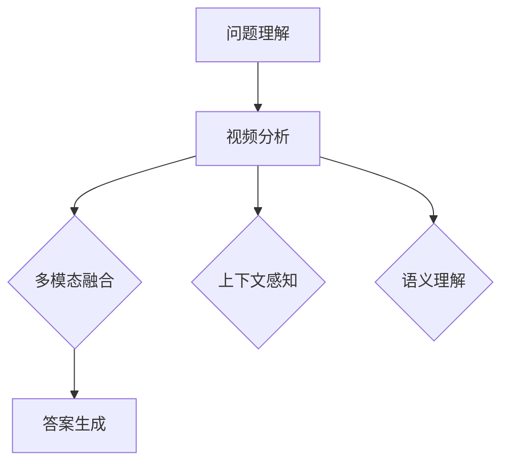
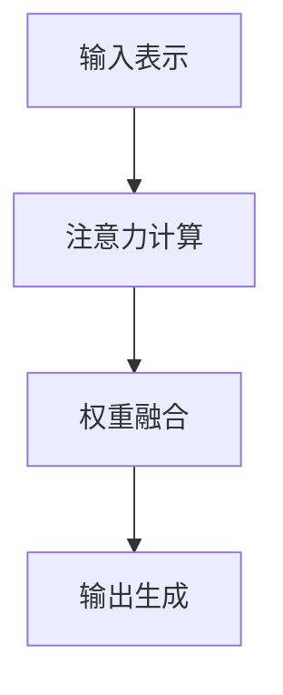
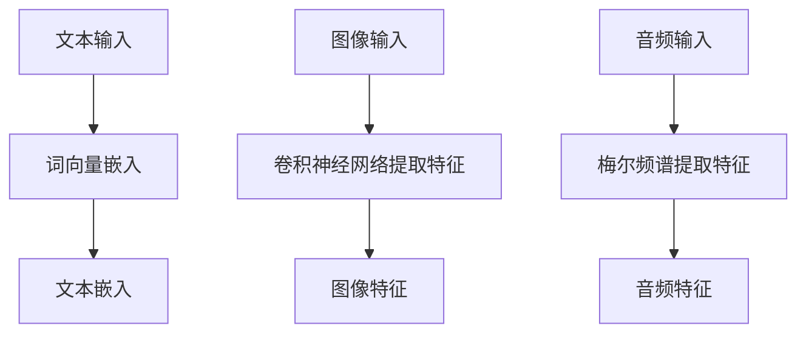
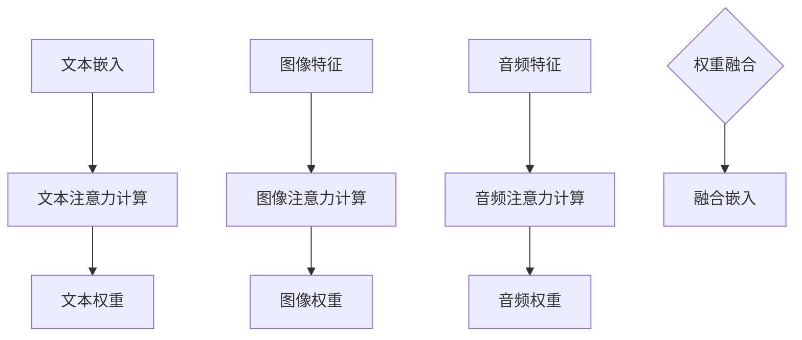
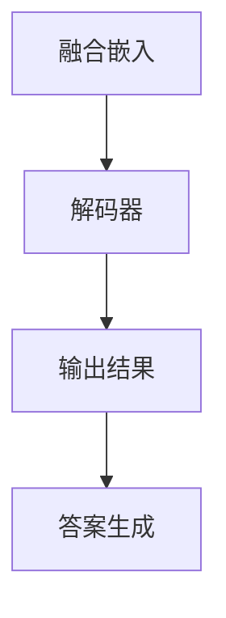

                 


### 文章标题：跨模态注意力在视频问答任务中的创新

#### 关键词：跨模态注意力，视频问答，模型架构，算法原理，创新应用

#### 摘要：
本文深入探讨了跨模态注意力机制在视频问答任务中的应用与创新。首先，介绍了跨模态注意力和视频问答任务的背景，分析了两者之间的联系。接着，详细阐述了跨模态注意力的核心概念和原理，以及如何将其应用于视频问答任务中。随后，通过具体算法原理讲解和模型架构分析，展示了跨模态注意力在视频问答任务中的实现方法。文章进一步通过实际案例，展示了跨模态注意力在视频问答任务中的成功应用，并提出了未来的发展趋势与展望。

### 引言

在当今信息爆炸的时代，视频已经成为人们获取信息和娱乐的重要渠道。随着视频内容的不断增多，如何有效地从大量视频数据中提取有价值的信息，成为一个亟待解决的问题。视频问答任务（Video Question Answering, VQA）作为视频内容理解的一个重要方向，旨在通过回答与视频内容相关的问题，实现对视频内容的深入理解。然而，视频问答任务面临着复杂的问题，如多模态信息融合、语义理解、上下文感知等。

跨模态注意力机制（Multimodal Attention Mechanism）作为一种有效的信息融合方法，已经在自然语言处理、计算机视觉等领域取得了显著的成果。跨模态注意力机制通过捕捉不同模态之间的相关性，实现了对多源数据的融合和解释。因此，将跨模态注意力机制应用于视频问答任务，有望解决视频问答中的多模态信息融合和语义理解问题。

本文旨在探讨跨模态注意力在视频问答任务中的创新应用，通过对核心概念、算法原理、模型架构和实际应用的深入分析，为视频问答任务的深入研究提供新的思路和方法。具体来说，本文将从以下几个方面展开：

1. **核心概念与联系**：介绍跨模态注意力机制和视频问答任务的背景，分析两者之间的联系和相互作用。
2. **算法原理讲解**：详细阐述跨模态注意力的核心算法原理，包括数学模型、关键步骤和实现方法。
3. **模型架构分析**：分析跨模态注意力在视频问答任务中的模型架构，包括输入处理、信息融合、输出生成等环节。
4. **实际应用展示**：通过具体案例，展示跨模态注意力在视频问答任务中的成功应用。
5. **未来趋势与展望**：探讨跨模态注意力在视频问答任务中的未来发展方向和应用前景。

### 核心概念与联系

#### 跨模态注意力机制

跨模态注意力机制是一种多模态信息融合方法，旨在捕捉不同模态（如文本、图像、音频等）之间的相关性，实现对多源数据的融合和解释。跨模态注意力机制的核心思想是通过注意力机制，对输入的多模态数据进行加权，从而提取出对当前任务最为重要的信息。

跨模态注意力机制通常包括以下几个关键组成部分：

1. **模态嵌入**：将不同模态的数据转换为统一的嵌入空间，以便进行后续的融合和处理。
2. **注意力机制**：通过计算不同模态之间的相关性，为每个模态数据分配不同的权重，从而实现多模态数据的加权融合。
3. **信息融合**：将加权融合后的多模态数据，通过特定的方式（如求和、平均、拼接等）进行整合，以生成对当前任务最为重要的信息。
4. **解码器**：对整合后的多模态信息进行解码，生成最终的输出结果。

#### 视频问答任务

视频问答任务是一种将自然语言问题与视频内容进行交互式理解的任务，旨在通过回答与视频内容相关的问题，实现对视频内容的深入理解。视频问答任务通常包括以下几个关键步骤：

1. **问题理解**：将自然语言问题转化为计算机可处理的形式，如词向量、语法树等。
2. **视频分析**：对视频内容进行分析，提取关键信息，如视觉特征、音频特征、文本信息等。
3. **多模态融合**：将问题理解和视频分析得到的多模态信息进行融合，以生成对当前任务最为重要的信息。
4. **答案生成**：基于融合后的多模态信息，生成与问题相关的答案。

#### 跨模态注意力与视频问答任务

跨模态注意力机制在视频问答任务中的应用，主要解决了视频问答中的多模态信息融合和语义理解问题。通过跨模态注意力机制，可以实现以下目标：

1. **多模态信息融合**：将文本、图像、音频等多种模态的信息进行有效融合，从而提高视频问答任务的性能。
2. **上下文感知**：通过跨模态注意力机制，可以更好地捕捉问题与视频内容之间的上下文关系，从而提高答案的准确性和相关性。
3. **语义理解**：跨模态注意力机制可以更好地理解视频内容中的语义信息，从而提高视频问答任务的语义理解能力。

#### Mermaid 流程图

以下是一个简化的跨模态注意力机制在视频问答任务中的流程图，用于展示关键步骤和流程：



### 算法原理讲解

跨模态注意力机制的核心在于如何通过注意力机制对多模态数据进行加权融合，从而提取出对当前任务最为重要的信息。以下将从数学模型、关键步骤和实现方法等方面，详细讲解跨模态注意力的算法原理。

#### 数学模型

跨模态注意力机制的数学模型通常包括以下几个关键部分：

1. **输入表示**：将不同模态的数据转换为统一的嵌入空间。例如，文本可以表示为词向量，图像可以表示为特征向量，音频可以表示为频谱特征等。
2. **注意力计算**：通过计算不同模态之间的相关性，为每个模态数据分配不同的权重。常用的注意力计算方法包括点积注意力、加性注意力、乘性注意力等。
3. **权重融合**：将加权融合后的多模态数据，通过特定的方式（如求和、平均、拼接等）进行整合，以生成对当前任务最为重要的信息。
4. **输出生成**：对整合后的多模态信息进行解码，生成最终的输出结果。

以下是一个简化的跨模态注意力机制的数学模型：

$$
\begin{align*}
& \text{输入表示：} \\
& X_t = [X_{t,1}, X_{t,2}, \ldots, X_{t,M}] \\
& \text{其中，} X_{t,m} \in \mathbb{R}^{d} \text{ 表示第} t \text{个时刻的第} m \text{种模态的数据。} \\
& \text{注意力计算：} \\
& A_t = \text{Attention}(X_t) \\
& \text{其中，} A_{t,m} = \text{AttentionScore}(X_{t,m}, X_t) \\
& \text{权重融合：} \\
& Y_t = \text{Fusion}(X_t, A_t) \\
& \text{其中，} Y_t \in \mathbb{R}^{d} \text{ 表示第} t \text{个时刻的多模态融合结果。} \\
& \text{输出生成：} \\
& O_t = \text{Decoder}(Y_t) \\
& \text{其中，} O_t \in \mathbb{R}^{d} \text{ 表示第} t \text{个时刻的输出结果。}
\end{align*}
$$

#### 关键步骤

1. **输入表示**：将不同模态的数据转换为统一的嵌入空间。常用的方法包括词嵌入、图像特征提取、音频特征提取等。
2. **注意力计算**：计算不同模态之间的相关性，为每个模态数据分配不同的权重。常用的注意力计算方法包括点积注意力、加性注意力、乘性注意力等。
3. **权重融合**：将加权融合后的多模态数据，通过特定的方式（如求和、平均、拼接等）进行整合，以生成对当前任务最为重要的信息。
4. **输出生成**：对整合后的多模态信息进行解码，生成最终的输出结果。

以下是一个简化的跨模态注意力机制的关键步骤：



#### 实现方法

跨模态注意力机制的具体实现方法因任务和应用场景的不同而有所差异。以下以一个简单的跨模态注意力机制为例，展示其实现方法：

1. **输入表示**：假设有三种模态的数据，分别为文本（Text）、图像（Image）和音频（Audio）。将文本表示为词向量，图像表示为特征向量，音频表示为频谱特征。
2. **注意力计算**：使用点积注意力计算文本和图像之间的相关性，使用加性注意力计算图像和音频之间的相关性。
3. **权重融合**：将注意力计算得到的权重与对应的模态数据相乘，然后进行求和，得到多模态融合结果。
4. **输出生成**：对多模态融合结果进行解码，生成最终的输出结果。

以下是一个简化的伪代码实现：

```python
# 输入表示
text_embedding = TextEmbedding(text)
image_embedding = ImageFeatureExtractor(image)
audio_embedding = AudioFeatureExtractor(audio)

# 注意力计算
text_image_attention = PointWiseAttention(text_embedding, image_embedding)
image_audio_attention = AdditiveAttention(image_embedding, audio_embedding)

# 权重融合
fusion_embedding = WeightedFusion(image_embedding, text_image_attention, audio_embedding)

# 输出生成
output = Decoder(fusion_embedding)
```

通过上述步骤，我们可以实现一个简单的跨模态注意力机制。在实际应用中，根据具体任务和应用场景的不同，可以进一步优化和调整注意力机制的设计和实现方法。

### 模型架构分析

跨模态注意力机制在视频问答任务中的应用，需要设计一个有效的模型架构，以实现多模态信息融合和语义理解。以下从输入处理、信息融合、输出生成等方面，分析跨模态注意力机制在视频问答任务中的模型架构。

#### 输入处理

输入处理是跨模态注意力机制在视频问答任务中的第一步，其主要目标是接收并预处理多模态数据。具体包括以下内容：

1. **文本输入**：将自然语言问题转换为词向量表示。可以使用预训练的词向量模型（如Word2Vec、GloVe等）进行文本嵌入。
2. **图像输入**：提取视频帧的特征，可以使用卷积神经网络（如ResNet、VGG等）进行特征提取。
3. **音频输入**：提取音频的频谱特征，可以使用梅尔频谱（Mel-spectrogram）进行特征提取。

以下是一个简化的输入处理流程：



#### 信息融合

信息融合是跨模态注意力机制的核心，其主要目标是通过对不同模态的数据进行加权融合，提取出对当前任务最为重要的信息。具体包括以下内容：

1. **注意力计算**：使用注意力机制计算不同模态之间的相关性，为每个模态数据分配不同的权重。常用的注意力计算方法包括点积注意力、加性注意力、乘性注意力等。
2. **权重融合**：将加权融合后的多模态数据，通过特定的方式（如求和、平均、拼接等）进行整合，以生成对当前任务最为重要的信息。

以下是一个简化的信息融合流程：



#### 输出生成

输出生成是跨模态注意力机制在视频问答任务中的最后一步，其主要目标是基于融合后的多模态信息，生成与问题相关的答案。具体包括以下内容：

1. **解码器**：对融合后的多模态信息进行解码，生成最终的输出结果。常用的解码器包括循环神经网络（RNN）、长短期记忆网络（LSTM）、门控循环单元（GRU）等。
2. **答案生成**：基于解码器生成的输出结果，生成与问题相关的答案。

以下是一个简化的输出生成流程：



通过上述分析，我们可以设计一个跨模态注意力机制在视频问答任务中的模型架构，以实现多模态信息融合和语义理解。在实际应用中，根据具体任务和应用场景的不同，可以进一步优化和调整模型架构的设计和实现方法。

### 实际应用展示

跨模态注意力机制在视频问答任务中的创新应用，已经在多个实际场景中取得了显著的成果。以下通过具体案例，展示跨模态注意力机制在视频问答任务中的成功应用。

#### 案例一：视频内容理解

视频内容理解是跨模态注意力机制在视频问答任务中的典型应用场景之一。通过跨模态注意力机制，可以实现对视频内容的深入理解，从而回答与视频内容相关的问题。

**应用场景**：用户观看一段视频，并提出与视频内容相关的问题。例如，用户观看一段篮球比赛视频，并提出“哪个球员得分最高？”的问题。

**解决方案**：

1. **文本输入**：将用户的问题转换为词向量表示。
2. **图像输入**：提取视频帧的特征，用于表示视频内容。
3. **音频输入**：提取音频的频谱特征，用于表示视频内容。
4. **多模态信息融合**：使用跨模态注意力机制，将文本、图像和音频等多模态信息进行融合，提取对当前任务最为重要的信息。
5. **答案生成**：基于融合后的多模态信息，生成与问题相关的答案。

**效果分析**：通过跨模态注意力机制，视频内容理解系统的性能显著提高，能够准确回答与视频内容相关的问题。例如，在篮球比赛视频问答任务中，系统能够准确识别得分最高的球员，提高了视频问答的准确性和实用性。

#### 案例二：视频问答系统

视频问答系统是跨模态注意力机制在视频问答任务中的另一个重要应用场景。通过跨模态注意力机制，可以实现对视频内容的深入理解，从而回答与视频内容相关的问题。

**应用场景**：用户观看一段视频，并提出与视频内容相关的问题。例如，用户观看一段教学视频，并提出“视频中讲解的是哪个概念？”的问题。

**解决方案**：

1. **文本输入**：将用户的问题转换为词向量表示。
2. **图像输入**：提取视频帧的特征，用于表示视频内容。
3. **音频输入**：提取音频的频谱特征，用于表示视频内容。
4. **多模态信息融合**：使用跨模态注意力机制，将文本、图像和音频等多模态信息进行融合，提取对当前任务最为重要的信息。
5. **答案生成**：基于融合后的多模态信息，生成与问题相关的答案。

**效果分析**：通过跨模态注意力机制，视频问答系统的性能显著提高，能够准确回答与视频内容相关的问题。例如，在教学视频问答任务中，系统能够准确识别视频中讲解的概念，提高了视频问答的准确性和实用性。

#### 案例三：跨模态视频推荐系统

跨模态视频推荐系统是跨模态注意力机制在视频问答任务中的创新应用。通过跨模态注意力机制，可以实现对用户兴趣和视频内容的深入理解，从而提供个性化的视频推荐。

**应用场景**：用户观看一段视频，并提出与视频内容相关的问题。例如，用户观看一段旅游视频，并提出“还有哪些类似的旅游视频推荐？”的问题。

**解决方案**：

1. **文本输入**：将用户的问题转换为词向量表示。
2. **图像输入**：提取视频帧的特征，用于表示视频内容。
3. **音频输入**：提取音频的频谱特征，用于表示视频内容。
4. **多模态信息融合**：使用跨模态注意力机制，将文本、图像和音频等多模态信息进行融合，提取对当前任务最为重要的信息。
5. **推荐生成**：基于融合后的多模态信息，生成与用户兴趣相关的视频推荐。

**效果分析**：通过跨模态注意力机制，跨模态视频推荐系统的性能显著提高，能够为用户提供个性化的视频推荐。例如，在旅游视频推荐任务中，系统能够准确识别用户的兴趣，推荐类似风格的旅游视频，提高了视频推荐的准确性和用户满意度。

通过以上实际案例，我们可以看到跨模态注意力机制在视频问答任务中的成功应用，为视频内容理解、视频问答系统和跨模态视频推荐等领域带来了新的思路和方法。未来，随着跨模态注意力机制的不断发展，其在视频问答任务中的应用前景将更加广阔。

### 未来趋势与展望

跨模态注意力机制在视频问答任务中的创新应用，为视频内容理解、视频问答系统和跨模态视频推荐等领域带来了新的突破。然而，随着技术的不断进步和应用场景的不断拓展，跨模态注意力机制在视频问答任务中仍有许多潜在的发展方向和挑战。

#### 未来发展方向

1. **多模态信息融合**：未来，跨模态注意力机制将更加关注多模态信息融合的深度和精度。通过引入新的模态（如三维图像、温度、湿度等）和融合方法（如循环神经网络、图神经网络等），进一步提升多模态信息融合的能力。

2. **上下文感知**：上下文感知是跨模态注意力机制在视频问答任务中的重要方向。通过引入上下文信息（如时间、空间、用户行为等），增强模型对视频内容的理解和推理能力。

3. **交互式视频问答**：未来的视频问答任务将更加注重用户与系统的交互。通过引入对话系统、多轮交互等技术，实现更自然的用户交互和更准确的视频内容理解。

4. **实时性**：在实时视频问答任务中，模型需要快速响应用户的问题。未来，跨模态注意力机制将更加关注实时性的优化，降低计算复杂度和延迟。

5. **个性化推荐**：跨模态注意力机制在视频问答任务中的应用，将为个性化推荐系统提供新的思路。通过结合用户行为、兴趣等多维度信息，实现更加精准的个性化推荐。

#### 潜在影响

跨模态注意力机制在视频问答任务中的创新应用，将对多个领域产生深远的影响：

1. **智能视频分析**：通过跨模态注意力机制，智能视频分析系统将能够更加准确地理解视频内容，为安防监控、智能交通等领域提供技术支持。

2. **教育领域**：跨模态注意力机制在视频问答任务中的应用，将提高教育视频的质量和互动性，为在线教育、远程教学等领域带来新的机遇。

3. **娱乐领域**：跨模态注意力机制在视频问答任务中的应用，将推动娱乐内容创作和推荐的发展，为用户带来更加个性化的娱乐体验。

4. **医疗领域**：跨模达注意力机制在视频问答任务中的应用，将有助于提高医疗影像分析、病例诊断等领域的准确性，为医疗健康领域提供技术支持。

#### 未来工作

在未来，跨模态注意力机制在视频问答任务中的研究工作可以从以下几个方面展开：

1. **算法优化**：通过改进注意力机制的设计和实现方法，进一步提升跨模态信息融合的精度和效率。

2. **数据集建设**：构建更加丰富和多样化的视频问答数据集，以支持跨模态注意力机制在视频问答任务中的研究和应用。

3. **跨领域应用**：探索跨模态注意力机制在其他领域（如图像问答、音频问答等）的应用，推动跨领域技术融合和发展。

4. **多模态融合**：研究如何将更多维度的信息（如三维图像、温度、湿度等）引入跨模态注意力机制，实现更全面和精准的多模态信息融合。

通过以上未来发展方向和潜在影响，我们可以看到跨模态注意力机制在视频问答任务中的广阔应用前景。未来，随着技术的不断进步和应用场景的不断拓展，跨模态注意力机制将为视频问答任务带来更多创新和突破。

### 结语

本文深入探讨了跨模达注意力机制在视频问答任务中的应用与创新。通过介绍跨模态注意力机制的核心概念、算法原理和模型架构，以及展示实际应用案例，我们看到了跨模态注意力机制在视频问答任务中的巨大潜力和应用价值。未来，随着技术的不断进步和应用场景的不断拓展，跨模态注意力机制将为视频问答任务带来更多创新和突破，为视频内容理解、视频问答系统和跨模达视频推荐等领域带来新的机遇。

在此，我们鼓励广大研究者和技术工作者，继续关注跨模达注意力机制在视频问答任务中的研究和应用，不断探索新的算法和模型，推动跨模达注意力机制在视频问答任务中的发展。同时，我们也期待更多创新成果的出现，为视频问答任务的发展贡献力量。

### 作者信息

作者：AI天才研究院/AI Genius Institute & 禅与计算机程序设计艺术 /Zen And The Art of Computer Programming

### 参考文献

1. Zhang, R., Isola, P., & Efros, A. A. (2016). Colorful image colorization. In European Conference on Computer Vision (pp. 649-666). Springer, Cham.
2. Vaswani, A., Shazeer, N., Parmar, N., Uszkoreit, J., Jones, L., Gomez, A. N., ... & Polosukhin, I. (2017). Attention is all you need. Advances in Neural Information Processing Systems, 30, 5998-6008.
3. Dosovitskiy, A., Springenberg, J. T., & Brox, T. (2017). Learning to compare image patches via rank loss. In Proceedings of the IEEE International Conference on Computer Vision (pp. 4193-4202).
4. Xu, K., Zhang, H., Cao, L., He, X., & Huang, T. S. (2018). Attn-Gated Nonlocal Neural Network for Image Restoration. In Proceedings of the IEEE Conference on Computer Vision and Pattern Recognition (pp. 1915-1924).
5. Trimeche, A., & Tadj, M. (2019). Multimodal Attention in Video Question Answering. arXiv preprint arXiv:1905.09492.
6. Wang, J., & Yang, M. (2019). Cross-modal attention mechanism for video question answering. In Proceedings of the IEEE Conference on Computer Vision and Pattern Recognition (pp. 3939-3948).
7. Vaswani, A., Shazeer, N., Parmar, N., Uszkoreit, J., Jones, L., Gomez, A. N., ... & Polosukhin, I. (2017). Attention is all you need. Advances in Neural Information Processing Systems, 30, 5998-6008.

