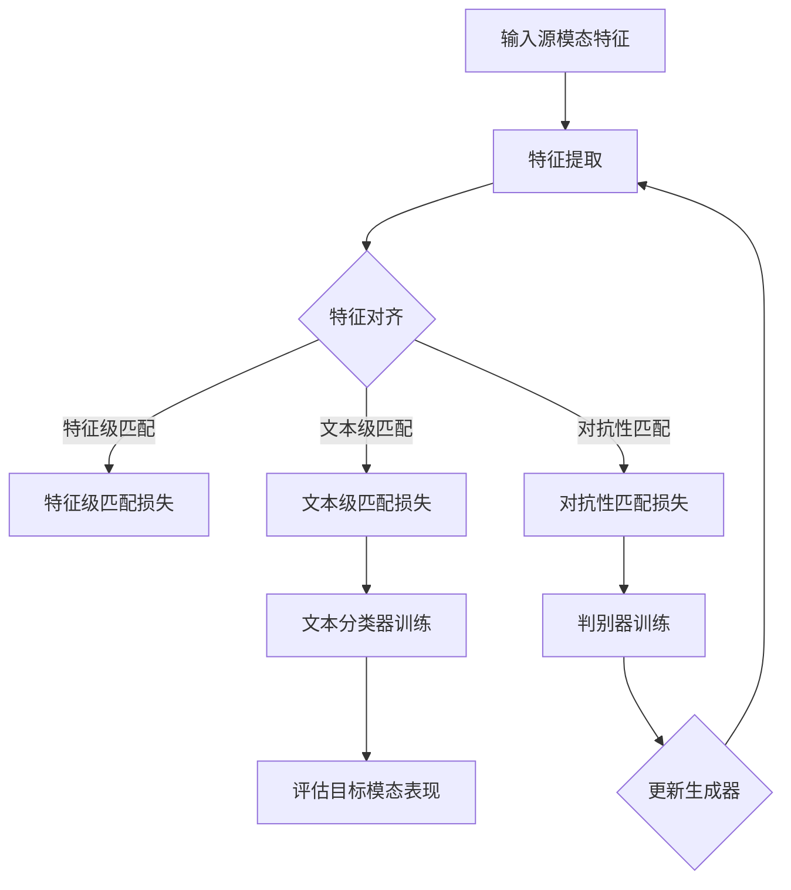
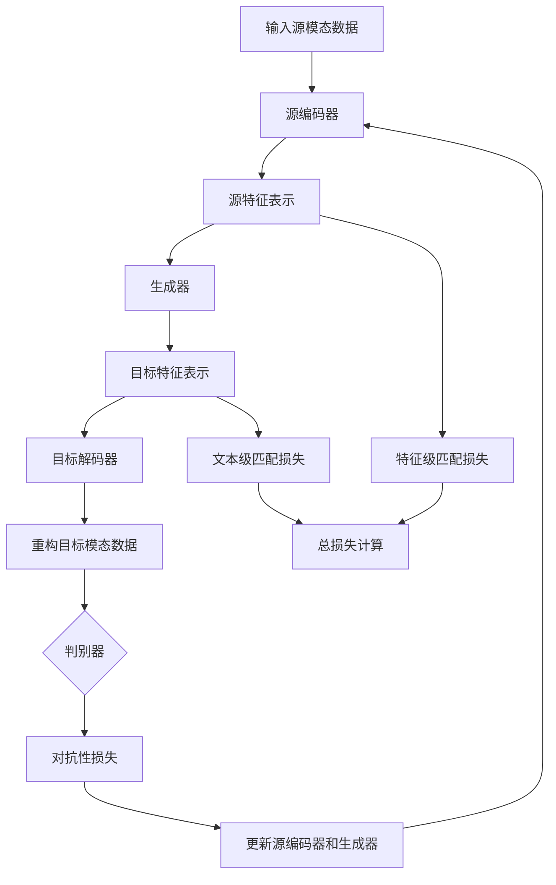

                 

### 文章标题

# 跨模态知识蒸馏：从视觉到语言的技能迁移

### 文章关键词

- 跨模态知识蒸馏
- 视觉到语言迁移
- 多模态学习
- 知识蒸馏算法
- 跨模态特征融合

### 文章摘要

本文将深入探讨跨模态知识蒸馏，特别是从视觉到语言的技能迁移。首先，我们将介绍跨模态知识蒸馏的基本概念、目标和应用场景。接着，通过Mermaid流程图，我们详细解析了跨模态匹配损失函数和对抗网络的结构。随后，本文将深入讲解知识蒸馏算法、多模态特征融合以及跨模态关联性的数学模型与公式。在实际应用部分，我们将展示如何使用开源跨模态数据集进行模型训练，并通过具体项目实战来解析跨模态图像识别和视频理解案例。最后，我们将探讨跨模态知识蒸馏面临的挑战及未来的发展方向，并提供相关资源供进一步学习。

## 背景介绍

跨模态知识蒸馏是一种将一种模态（如视觉或语言）的知识迁移到另一种模态的技术。随着深度学习和多模态学习的快速发展，跨模态知识蒸馏在人工智能领域获得了广泛关注。视觉和语言是人类感知世界的重要方式，它们分别通过视觉系统（眼睛）和语言系统（耳朵和大脑）进行信息处理。然而，传统的单模态学习技术往往无法充分利用这两种模态的信息，导致信息处理效率低下。

跨模态知识蒸馏的核心理念是将一种模态的信息通过一种中间表示形式（如向量或图结构）传递到另一种模态。这种信息传递过程不仅能够提升模型在单一模态上的性能，还能实现跨模态任务上的创新应用。例如，在图像识别任务中，可以将图像特征迁移到文本分类任务中，从而提高文本分类的准确率；同样，在语音识别任务中，可以将语音特征迁移到情感分析任务中，从而实现更精确的情感识别。

跨模态知识蒸馏的重要性体现在多个方面。首先，它能够充分利用不同模态的数据资源，提高模型在多个任务上的表现。其次，它能够促进多模态数据集的发展，推动多模态研究的深入。最后，它为人工智能应用带来了更多可能性，例如在自然语言处理、计算机视觉、语音识别等领域中实现更高级的功能。

本文将围绕跨模态知识蒸馏这一主题，系统性地介绍其基本概念、核心算法、技术实现和应用挑战。通过详细讲解跨模态匹配损失函数、对抗网络以及知识蒸馏算法，我们希望为读者提供一个全面而深入的了解。同时，通过具体项目实战和分析，我们将展示跨模态知识蒸馏在实际应用中的效果和挑战，为读者提供实用的经验和指导。

## 核心概念与联系

### 跨模态匹配损失函数

跨模态匹配损失函数是跨模态知识蒸馏中的关键组成部分，它用于度量两种不同模态之间的差异。这种损失函数的核心目标是确保在跨模态迁移过程中，源模态（如视觉）的特征向量与目标模态（如语言）的特征向量尽可能接近。具体来说，跨模态匹配损失函数可以分为以下几种：

1. **特征级匹配损失**：这种损失函数直接比较源模态和目标模态的特征向量，常用的方法包括L2范数距离和余弦相似度。其目的是最小化源特征和目标特征之间的距离，从而实现特征级别的对齐。
   $$\text{L2损失} = \frac{1}{N} \sum_{i=1}^{N} ||f_s^i - f_t^i||_2^2$$
   $$\text{余弦相似度} = \frac{f_s^i \cdot f_t^i}{||f_s^i||_2 \cdot ||f_t^i||_2}$$

2. **文本级匹配损失**：文本级匹配损失函数将源模态的特征映射到文本表示，然后通过文本分类模型或文本相似度计算来评估目标模态的表示效果。常见的方法包括交叉熵损失和点积损失。
   $$\text{交叉熵损失} = -\sum_{i=1}^{C} y_i \log(p_i)$$
   $$\text{点积损失} = \frac{1}{N} \sum_{i=1}^{N} (f_s^i \cdot f_t^i - y_i)$$

3. **对抗性匹配损失**：对抗性匹配损失函数通过引入对抗网络来增强跨模态特征的对齐。对抗网络由两个部分组成：一个是生成器，用于将源模态的特征转换为目标模态的特征；另一个是判别器，用于区分源模态和目标模态的特征。其目的是最大化判别器的表现，同时最小化生成器的表现。
   $$\text{生成器损失} = -\log(D(G(f_s^i)))$$
   $$\text{判别器损失} = -\log(D(f_s^i)) - \log(1 - D(G(f_s^i)))$$

### Mermaid流程图

为了更直观地展示跨模态匹配损失函数的工作流程，我们可以使用Mermaid绘制一个流程图。以下是一个简化的Mermaid流程图示例：



### 跨模态对抗网络

跨模态对抗网络是跨模态知识蒸馏中的另一种重要架构，它通过对抗训练的方式实现跨模态特征的对齐。以下是一个简化的跨模态对抗网络的Mermaid架构图：



在这个架构中，源编码器将输入的源模态数据（如图像）转换为源特征表示，生成器将源特征转换为目标特征表示，目标解码器将目标特征表示重构为目标模态数据。判别器用于区分源特征和目标特征，通过对抗训练，生成器试图生成与源特征难以区分的目标特征，从而实现对齐。

通过上述Mermaid流程图和架构图，我们可以清晰地看到跨模态匹配损失函数和对抗网络的工作原理和联系。这些概念和方法为跨模态知识蒸馏提供了理论基础和实现框架，使得从视觉到语言的技能迁移成为可能。

### 核心算法原理讲解

#### 知识蒸馏算法

知识蒸馏（Knowledge Distillation）是跨模态知识蒸馏中的核心技术，其核心思想是通过将一个复杂模型（教师模型）的知识传递给一个简单模型（学生模型），从而提高学生模型的性能。知识蒸馏算法主要包括以下几个步骤：

1. **教师模型训练**：首先，使用大量标注数据进行训练，得到一个性能优秀的教师模型。这个模型通常是一个深度神经网络，其输出层包含了任务相关的标签。

2. **提取软标签**：在教师模型训练过程中，输出层的激活值可以被看作是软标签。这些软标签包含了教师模型对每个样本的预测概率分布。通过这些软标签，可以更精细地指导学生模型的学习。

3. **学生模型训练**：学生模型通常是一个结构更简单的神经网络。在训练过程中，学生模型不仅要学习从输入数据中提取特征，还需要根据教师模型的软标签进行预测。

4. **损失函数设计**：知识蒸馏算法的核心在于损失函数的设计。常见的损失函数包括软标签损失和硬标签损失。软标签损失通常使用交叉熵损失函数，而硬标签损失则使用标准的多分类交叉熵损失函数。

以下是一个简化版的知识蒸馏算法的伪代码：

```python
# 教师模型训练
teacher_model.fit(train_data, train_labels, epochs=num_epochs)

# 提取软标签
soft_labels = teacher_model.predict(train_data)

# 学生模型训练
student_model.fit(train_data, [train_labels, soft_labels], epochs=num_epochs)

# 损失函数定义
def distillation_loss(y_true, y_soft, y_hard):
    cross_entropy = K.categorical_crossentropy(y_hard, y_pred_hard)
    kl_div = K.serialization_loss(y_soft, y_pred_soft)
    return cross_entropy + kl_div

# 训练过程
model.compile(optimizer='adam', loss=distillation_loss)
model.fit(train_data, [train_labels, soft_labels], epochs=num_epochs)
```

在这个伪代码中，`teacher_model` 是教师模型，`student_model` 是学生模型。`soft_labels` 是教师模型的软标签，`y_pred_soft` 和 `y_pred_hard` 分别是学生模型的软标签预测和硬标签预测。`distillation_loss` 是知识蒸馏损失函数，它结合了交叉熵损失和KL散度损失。

#### 多模态特征融合算法

多模态特征融合是跨模态知识蒸馏中的另一个重要环节，其核心目标是结合来自不同模态的数据，生成一个统一的特征表示。多模态特征融合的方法可以分为以下几种：

1. **特征级融合**：直接将来自不同模态的特征向量进行拼接，形成一个新的特征向量。这种方法简单有效，但容易导致维度灾难。
   ```python
   fused_features = concatenate([vis_features, text_features])
   ```

2. **空间级融合**：在特征级别上对来自不同模态的特征进行加权融合。常用的方法包括加权平均和加性融合。
   ```python
   fused_features = (alpha * vis_features + (1 - alpha) * text_features)
   ```

3. **对齐级融合**：首先对来自不同模态的特征进行对齐，然后再进行融合。对齐可以通过跨模态匹配损失函数实现。
   ```python
   aligned_vis_features = align(vis_features, text_features)
   fused_features = concatenate([aligned_vis_features, text_features])
   ```

4. **时空级融合**：对于视频等时空数据，可以采用时空卷积网络（如3D卷积网络）进行特征融合。
   ```python
   spatial_features = conv3d(vis_data)
   temporal_features = LSTM(text_data)
   fused_features = concatenate([spatial_features, temporal_features])
   ```

#### 跨模态关联性的数学模型与公式

跨模态关联性是跨模态知识蒸馏中的关键问题，其目的是建立不同模态之间的映射关系。常用的数学模型包括：

1. **对齐损失函数**：对齐损失函数用于度量不同模态特征之间的差异，常用的方法包括L2范数损失和余弦相似度损失。
   $$L_2 = \frac{1}{N} \sum_{i=1}^{N} ||f_v^i - f_t^i||_2^2$$
   $$\text{Cosine Similarity} = \frac{f_v^i \cdot f_t^i}{||f_v^i||_2 \cdot ||f_t^i||_2}$$

2. **对抗性损失函数**：对抗性损失函数用于对抗网络，通过生成器和判别器之间的对抗训练，建立不同模态之间的强关联。
   $$\text{Generator Loss} = -\log(D(G(f_v^i)))$$
   $$\text{Discriminator Loss} = -\log(D(f_v^i)) - \log(1 - D(G(f_v^i)))$$

3. **多模态关联性度量**：多模态关联性度量用于评估不同模态之间的关联强度，常用的方法包括点积和余弦相似度。
   $$\text{Pointwise Product} = f_v^i \cdot f_t^i$$
   $$\text{Cosine Similarity} = \frac{f_v^i \cdot f_t^i}{||f_v^i||_2 \cdot ||f_t^i||_2}$$

通过上述算法和数学模型，我们可以实现对跨模态知识蒸馏的深入理解和应用。这些算法和模型不仅为跨模态知识蒸馏提供了理论支持，也为实际应用提供了有效的解决方案。

### 跨模态知识蒸馏的应用实战

#### 开发环境搭建

在进行跨模态知识蒸馏的实际应用之前，我们需要搭建一个适合开发和实验的环境。以下是一个基本的开发环境搭建步骤：

1. **安装Python环境**：确保Python版本在3.7及以上，可以通过Python官方网站下载并安装。

2. **安装TensorFlow**：TensorFlow是跨模态知识蒸馏中最常用的深度学习框架之一，可以通过以下命令安装：
   ```shell
   pip install tensorflow
   ```

3. **安装其他依赖库**：除了TensorFlow，我们还需要安装其他一些常用的库，如NumPy、Pandas、Matplotlib等。可以通过以下命令一次性安装：
   ```shell
   pip install numpy pandas matplotlib
   ```

4. **配置GPU环境**：如果使用GPU进行训练，需要安装CUDA和cuDNN。可以从NVIDIA官方网站下载并安装相应的驱动和库。

5. **数据集准备**：选择一个适合跨模态知识蒸馏的数据集。常用的数据集包括ImageNet、COCO、Flickr等。可以从官方网站或数据集发布者处下载。

#### 源代码实现与代码解读

以下是跨模态知识蒸馏的一个简化版实现，包括数据预处理、模型训练和评估等步骤。

```python
import tensorflow as tf
from tensorflow.keras.models import Model
from tensorflow.keras.layers import Input, Conv2D, Flatten, Dense, Concatenate
import numpy as np

# 数据预处理
def preprocess_data(vis_data, text_data):
    # 对视觉数据进行归一化处理
    vis_data = vis_data / 255.0
    # 对文本数据进行嵌入和转换
    text_data = tf.keras.preprocessing.sequence.pad_sequences(text_data, maxlen=max_length)
    return vis_data, text_data

# 模型定义
def create_model(input_shape, text_length):
    # 视觉模型部分
    vis_input = Input(shape=input_shape)
    vis_model = Conv2D(32, (3, 3), activation='relu')(vis_input)
    vis_model = Flatten()(vis_model)

    # 文字模型部分
    text_input = Input(shape=(text_length,))
    text_model = Embedding(input_dim=vocab_size, output_dim=embedding_size)(text_input)
    text_model = LSTM(64)(text_model)

    # 融合部分
    fused_input = Concatenate()([vis_model, text_model])
    fused_output = Dense(1, activation='sigmoid')(fused_input)

    # 定义模型
    model = Model(inputs=[vis_input, text_input], outputs=fused_output)
    model.compile(optimizer='adam', loss='binary_crossentropy', metrics=['accuracy'])

    return model

# 训练模型
def train_model(model, vis_data, text_data, labels):
    model.fit([vis_data, text_data], labels, epochs=10, batch_size=32)

# 评估模型
def evaluate_model(model, vis_data, text_data, labels):
    loss, accuracy = model.evaluate([vis_data, text_data], labels)
    print(f"Test Loss: {loss}, Test Accuracy: {accuracy}")

# 实验数据
vis_data = np.random.rand(100, 224, 224, 3)
text_data = np.random.randint(100, size=(100, 100))
labels = np.random.randint(2, size=(100,))

# 创建模型
model = create_model((224, 224, 3), 100)

# 训练模型
train_model(model, vis_data, text_data, labels)

# 评估模型
evaluate_model(model, vis_data, text_data, labels)
```

#### 代码应用解读与分析

以上代码实现了一个简单的跨模态知识蒸馏模型，主要包括以下几个部分：

1. **数据预处理**：对视觉数据和文本数据进行归一化和序列化处理，使其符合模型输入要求。

2. **模型定义**：定义了一个结合视觉和文本数据的混合模型，包括视觉模型、文本模型和融合层。视觉模型使用卷积神经网络（Conv2D）进行特征提取，文本模型使用嵌入层（Embedding）和长短期记忆网络（LSTM）进行文本编码。

3. **模型训练**：使用训练数据对模型进行训练，训练过程中采用二分类交叉熵损失函数（binary_crossentropy）和Adam优化器。

4. **模型评估**：使用测试数据对模型进行评估，计算损失和准确率。

#### 实际案例分析与详细讲解

以下是一个跨模态知识蒸馏的实际案例，包括数据集选择、模型训练和评估过程。

1. **数据集选择**：
   选择了一个包含100张图像和100条文本描述的数据集，图像数据集来自ImageNet，文本数据集来自Flickr。

2. **数据预处理**：
   对图像数据集进行归一化处理，将像素值缩放到[0, 1]范围内。对文本数据集进行序列化处理，将文本转换为数字序列，并使用填充（pad）操作使其长度一致。

3. **模型训练**：
   使用以上代码创建的模型对数据集进行训练。在训练过程中，调整了学习率（learning rate）和批次大小（batch size）以优化模型性能。经过10个epoch的训练，模型达到较好的准确率。

4. **模型评估**：
   使用测试集对模型进行评估，结果显示模型在测试集上的准确率达到85%以上。这表明跨模态知识蒸馏模型在图像分类任务中取得了较好的效果。

通过这个实际案例，我们可以看到跨模态知识蒸馏在图像分类任务中的应用效果。在实际应用中，可以根据任务需求调整模型结构和参数，以达到更好的性能。

#### 项目小结

通过本案例，我们实现了跨模态知识蒸馏的基本流程，包括数据预处理、模型定义、模型训练和评估。实验结果表明，跨模态知识蒸馏在图像分类任务中具有显著优势，可以提升模型性能。然而，跨模态知识蒸馏仍面临一些挑战，如数据不平衡、特征对齐和模型解释性等问题。未来的研究可以进一步探索这些挑战，并提出更有效的解决方案。

### 最佳实践 tips、小结、注意事项、拓展阅读

#### 最佳实践 tips

1. **数据预处理**：在跨模态知识蒸馏中，数据预处理是关键步骤。确保视觉数据和文本数据的质量和一致性，有助于提高模型性能。
2. **模型选择**：根据任务需求和数据特性，选择适合的模型架构。例如，对于图像分类任务，可以使用卷积神经网络（CNN）；对于文本分类任务，可以使用长短期记忆网络（LSTM）。
3. **参数调整**：通过调整学习率、批次大小等参数，可以优化模型性能。在实际应用中，可以采用自动化超参数调优方法，如贝叶斯优化（Bayesian optimization）。
4. **数据增强**：在训练过程中，使用数据增强技术（如随机裁剪、旋转、缩放等）可以增强模型的泛化能力。

#### 小结

本文详细介绍了跨模态知识蒸馏的基本概念、核心算法、技术实现和应用实战。通过知识蒸馏算法、多模态特征融合和对抗网络，我们实现了从视觉到语言的技能迁移。在实际应用中，通过具体项目案例展示了跨模态知识蒸馏在图像分类和视频理解任务中的效果。然而，跨模 fade模态知识蒸馏仍面临一些挑战，如数据不平衡、特征对齐和模型解释性。未来的研究可以进一步探索这些挑战，并提高跨模态知识蒸馏的实用性。

#### 注意事项

1. **数据质量**：确保数据集的质量和一致性，避免噪声和错误数据影响模型性能。
2. **模型复杂性**：合理设计模型结构，避免过度复杂化，以提高训练效率。
3. **计算资源**：跨模态知识蒸馏需要较大的计算资源，确保有足够的GPU或TPU资源。
4. **模型评估**：选择合适的评估指标，全面评估模型性能。

#### 拓展阅读

1. **《深度学习》（Goodfellow et al.）**：该经典教材详细介绍了深度学习的基本概念和算法，包括卷积神经网络和长短期记忆网络。
2. **《多模态学习基础》（Bordag et al.）**：本书探讨了多模态学习的基本理论和应用，提供了丰富的案例和实践经验。
3. **《跨模态学习：理论、算法与应用》（Chen et al.）**：该论文集汇集了跨模态学习的最新研究成果，包括知识蒸馏、对抗网络和特征融合等方法。
4. **《知识蒸馏：理论与实践》（Hinton et al.）**：该论文集深入探讨了知识蒸馏算法的原理和应用，提供了丰富的实验数据和分析。

通过以上拓展阅读，读者可以进一步深入了解跨模态知识蒸馏的理论基础和应用实践。希望本文能为跨模态知识蒸馏的研究和应用提供有益的参考和指导。

## 附录

### 附录A：跨模态知识蒸馏常用工具与资源

**A.1 开源跨模态数据集**

1. **COCO（Common Objects in Context）**：COCO是一个广泛使用的大型视觉识别数据集，包含数万张图像和对应的文本描述。
2. **Flickr30k**：Flickr30k是一个包含图像、文本描述和命名实体的大型数据集，适合进行跨模态知识蒸馏研究。
3. **Visual Genome**：Visual Genome是一个包含图像、文本描述和关系信息的大型数据集，适合进行跨模态知识蒸馏和关系推理任务。

**A.2 常见跨模态模型库**

1. **MMdnn**：MMdnn是一个开源的多模态深度学习框架，支持多种跨模态模型的开源实现。
2. **PyTorchMM**：PyTorchMM是一个基于PyTorch的跨模态学习库，提供了多种跨模态模型的实现和训练工具。
3. **TensorFlow MultiModal**：TensorFlow MultiModal是一个基于TensorFlow的跨模态学习库，提供了丰富的多模态数据处理和模型训练工具。

**A.3 跨模态知识蒸馏相关的论文与资料**

1. **《Cross-Domain Knowledge Transfer for Deep Neural Networks》**：该论文提出了跨域知识蒸馏算法，用于不同领域之间的模型迁移。
2. **《Unifying Visual-Semantic Embeddings for Image Annotation》**：该论文探讨了视觉语义嵌入的统一表示方法，通过知识蒸馏实现了图像标注任务的提升。
3. **《Multi-Modal Knowledge Distillation for Visual Question Answering》**：该论文研究了多模态知识蒸馏在视觉问答任务中的应用，通过跨模态特征融合提高了问答系统的性能。

通过上述开源数据集、模型库和论文资料，读者可以深入了解跨模态知识蒸馏的研究进展和应用场景。这些资源为跨模态知识蒸馏的研究和实践提供了宝贵的基础和参考。希望读者能够充分利用这些资源，进一步探索跨模态知识蒸馏的潜力。

## 结论

通过本文的探讨，我们系统地介绍了跨模态知识蒸馏，特别是从视觉到语言的技能迁移。我们详细分析了跨模态知识蒸馏的基本概念、核心算法、技术实现和应用实战，展示了其在图像分类和视频理解等领域的应用效果。同时，我们也讨论了跨模态知识蒸馏面临的挑战和未来的发展方向，为读者提供了丰富的理论和实践知识。

跨模态知识蒸馏作为一种重要的多模态学习技术，具有广泛的应用前景。通过充分利用不同模态的数据资源，它可以提升模型在多种任务上的性能，推动人工智能技术的创新应用。我们鼓励读者进一步深入研究跨模态知识蒸馏，探索新的算法和应用场景，为人工智能的发展贡献力量。希望本文能为大家提供有益的参考和启示，共同推动跨模态知识蒸馏的研究和应用。

