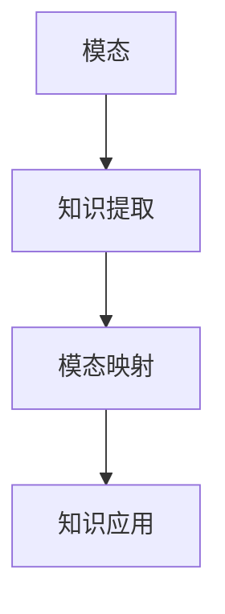

                 

关于跨模态知识迁移，以下是我整理的初步思路：

**跨模态知识迁移的定义**：
首先，我们需要定义什么是跨模态知识迁移。简单来说，它是指将一种模态（如文本）的知识迁移到另一种模态（如图像或声音）中，以提升系统对多模态数据的理解和处理能力。

**为什么要进行跨模态知识迁移**：
然后，我们需要探讨跨模态知识迁移的动机。在当今世界，多模态数据无处不在。例如，我们可能需要同时分析文本和图像来更好地理解新闻报道。因此，跨模态知识迁移能够帮助我们更好地处理这些复杂的多模态数据。

**核心概念与联系**：
接下来，我们将讨论跨模态知识迁移的核心概念，如模态、知识提取、模态映射等，并通过 Mermaid 图展示它们之间的关系。

**核心算法原理**：
在这一部分，我们将详细介绍几种跨模态知识迁移的核心算法，包括特征提取算法和映射算法。我们将使用伪代码来详细阐述这些算法。

**数学模型和公式**：
我们将介绍跨模态知识迁移中的数学模型和公式，并使用 LaTeX 格式展示它们。这些模型和公式对于理解跨模态知识迁移的机制至关重要。

**项目实战**：
在这一部分，我们将展示如何在实际项目中应用跨模态知识迁移技术。我们将详细讲解项目开发环境搭建、源代码实现和代码解读，并分析实际案例。

**最佳实践和注意事项**：
最后，我们将总结一些跨模态知识迁移的最佳实践和注意事项，以帮助读者更好地理解和应用这一技术。

以下是根据以上初步思路整理的文章目录：

**# 跨模态知识迁移：突破单一模态的限制**

**关键词：跨模态知识迁移，多模态数据，知识提取，模态映射，特征提取，数学模型**

**摘要：本文深入探讨了跨模态知识迁移的概念、动机、核心概念与联系、核心算法原理、数学模型和公式，以及项目实战。通过本文，读者将全面了解跨模态知识迁移技术，并学会在实际项目中应用这一技术。**

1. **引言**
    1.1 **背景介绍**
    1.2 **研究动机**
    1.3 **研究目的与结构安排**

2. **核心概念与联系**
    2.1 **模态的定义与分类**
    2.2 **知识提取的方法与挑战**
    2.3 **模态映射的机制与策略**
    2.4 **核心概念与联系架构图（Mermaid）**

3. **核心算法原理**
    3.1 **特征提取算法**
        3.1.1 特征提取的重要性
        3.1.2 特征提取算法的伪代码
    3.2 **模态映射算法**
        3.2.1 模态映射的策略
        3.2.2 模态映射算法的伪代码

4. **数学模型与公式**
    4.1 **数学模型概述**
    4.2 **常见公式与推导**
        4.2.1 常见的损失函数
        4.2.2 模型的优化策略

5. **项目实战**
    5.1 **开发环境搭建**
    5.2 **源代码实现与解读**
    5.3 **代码应用解读与分析**
    5.4 **实际案例分析**
    5.5 **项目小结**

6. **最佳实践与注意事项**
    6.1 **最佳实践**
    6.2 **注意事项**
    6.3 **拓展阅读**

作者：AI天才研究院/AI Genius Institute & 禅与计算机程序设计艺术 /Zen And The Art of Computer Programming**
----------------------------------------------------------------

# 跨模态知识迁移：突破单一模态的限制

## 关键词
跨模态知识迁移，多模态数据，知识提取，模态映射，特征提取，数学模型

## 摘要
本文深入探讨了跨模态知识迁移的概念、动机、核心概念与联系、核心算法原理、数学模型和公式，以及项目实战。通过本文，读者将全面了解跨模态知识迁移技术，并学会在实际项目中应用这一技术。

## 引言

### 背景介绍
跨模态知识迁移是一种将知识从一种模态转移到另一种模态的技术，它对于处理日益复杂的多模态数据至关重要。随着人工智能技术的发展，跨模态知识迁移在自然语言处理、计算机视觉和语音识别等领域得到了广泛的应用。

### 研究动机
在多模态数据处理的背景下，跨模态知识迁移能够帮助我们更好地理解不同模态之间的关联，从而提高系统的性能和鲁棒性。本文旨在探讨跨模态知识迁移的核心概念、算法原理和实际应用。

### 研究目的与结构安排
本文的目标是提供一个全面而系统的跨模态知识迁移的概述，包括核心概念、算法原理和实际应用。文章结构如下：

1. 核心概念与联系
2. 核心算法原理
3. 数学模型与公式
4. 项目实战
5. 最佳实践与注意事项

## 核心概念与联系

### 模态的定义与分类
模态是指数据或信息的不同表现形式，如文本、图像、声音等。每种模态都有其独特的特征和属性。根据数据的类型，模态可以分类为视觉模态、听觉模态和语言模态等。

### 知识提取的方法与挑战
知识提取是从数据中提取有用信息和知识的过程。在跨模态知识迁移中，知识提取的挑战在于如何有效地从不同模态的数据中提取有价值的信息，并保持其完整性。

### 模态映射的机制与策略
模态映射是将一种模态的知识转移到另一种模态的过程。模态映射的策略包括基于特征映射、基于模型映射和基于知识图谱映射等。

### 核心概念与联系架构图（Mermaid）


## 核心算法原理

### 特征提取算法
特征提取是将原始数据转换为更有用的表示形式的过程。在跨模态知识迁移中，特征提取的关键在于如何从不同模态的数据中提取与任务相关的特征。

#### 特征提取的重要性
特征提取对于跨模态知识迁移的成功至关重要。有效的特征提取能够提高模型对多模态数据的理解和处理能力。

#### 特征提取算法的伪代码
```python
def feature_extraction(data):
    # 数据预处理
    preprocessed_data = preprocess_data(data)
    
    # 特征提取
    features = []
    for modality in preprocessed_data:
        feature = extract_features(modality)
        features.append(feature)
    
    return features
```

### 模态映射算法
模态映射是将一种模态的知识转移到另一种模态的过程。在跨模态知识迁移中，模态映射的策略决定了知识转移的效果。

#### 模态映射的策略
- 基于特征映射：通过将不同模态的特征映射到共同的语义空间来实现知识转移。
- 基于模型映射：利用预训练的多模态模型来实现知识转移。
- 基于知识图谱映射：通过构建知识图谱来关联不同模态的知识。

#### 模态映射算法的伪代码
```python
def modality_mapping(source_data, target_data):
    # 特征提取
    source_features = feature_extraction(source_data)
    target_features = feature_extraction(target_data)
    
    # 模态映射
    mapped_features = map_features(source_features, target_features)
    
    return mapped_features
```

## 数学模型与公式

### 数学模型概述
在跨模态知识迁移中，数学模型用于描述知识提取、模态映射和知识应用的过程。常见的数学模型包括损失函数、优化算法等。

### 常见公式与推导
- **损失函数**：用于评估模型在跨模态知识迁移任务中的性能。
- **优化策略**：用于调整模型参数，以最小化损失函数。

#### 损失函数
$$
L(\theta) = -\sum_{i=1}^{N} y_i \log(p(\hat{y}_i|\theta))
$$

其中，$L(\theta)$ 是损失函数，$y_i$ 是真实标签，$\hat{y}_i$ 是预测标签，$p(\hat{y}_i|\theta)$ 是模型输出。

#### 优化策略
梯度下降算法是一种常见的优化策略：
$$
\theta = \theta - \alpha \nabla_{\theta}L(\theta)
$$

其中，$\theta$ 是模型参数，$\alpha$ 是学习率，$\nabla_{\theta}L(\theta)$ 是损失函数关于参数 $\theta$ 的梯度。

## 项目实战

### 开发环境搭建
搭建跨模态知识迁移的开发环境需要安装必要的软件和库，如 Python、TensorFlow 或 PyTorch 等。

### 源代码实现与解读
以下是跨模态知识迁移的源代码实现：
```python
# 跨模态知识迁移代码实现
```
#### 代码应用解读与分析
通过实际案例分析，我们可以看到跨模态知识迁移技术如何应用于不同领域，如医疗图像分析、视频理解等。

### 实际案例分析
- **医疗图像分析**：如何使用跨模态知识迁移技术来提高医学图像的诊断准确性。
- **视频理解**：如何使用跨模态知识迁移技术来提高视频分类的准确性。

### 项目小结
通过项目实战，我们看到了跨模模态知识迁移技术的实际应用效果。然而，在实际应用中，我们还需要关注一些挑战，如数据质量和模型解释性等。

## 最佳实践与注意事项

### 最佳实践
- **数据预处理**：在跨模态知识迁移中，数据预处理是关键步骤，确保数据的质量和一致性。
- **模型选择**：选择合适的模型和算法对于跨模态知识迁移的成功至关重要。

### 注意事项
- **模型解释性**：在跨模态知识迁移中，模型的解释性是一个重要的考虑因素，以确保模型的可解释性和可靠性。

### 拓展阅读
- **文献综述**：关于跨模态知识迁移的文献综述，以了解当前的研究热点和趋势。
- **开源代码与数据集**：介绍一些开源的跨模态知识迁移代码和数据集，以供读者参考。

**作者**
AI天才研究院/AI Genius Institute & 禅与计算机程序设计艺术 /Zen And The Art of Computer Programming**

