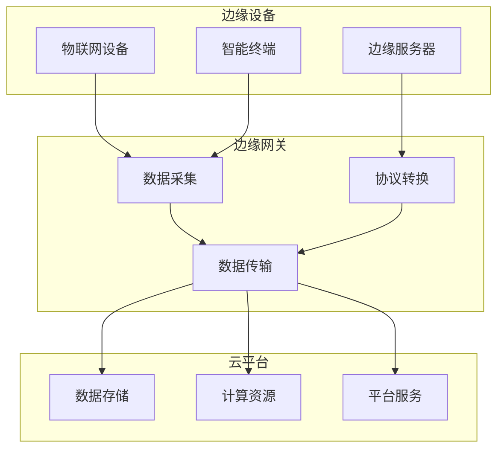
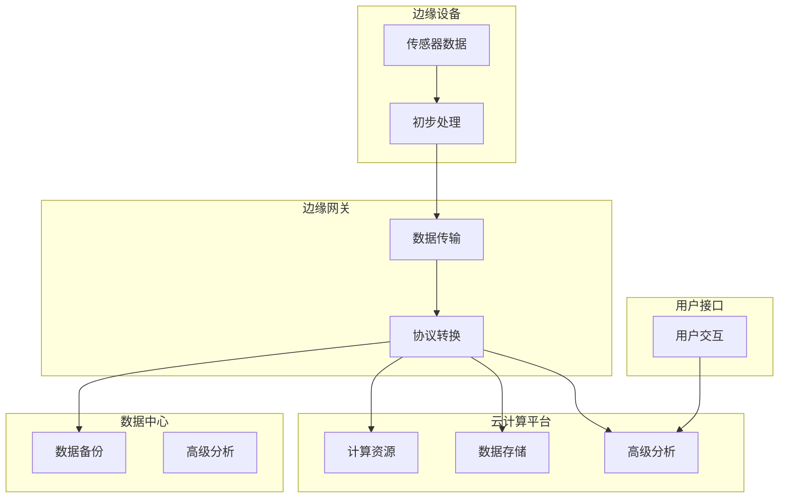

                 

### 引言

随着人工智能（AI）技术的快速发展，边缘计算和云协同在AI系统中的应用逐渐成为研究热点。边缘计算通过在数据产生的地方进行实时处理，减少了数据传输的开销，提升了系统的响应速度。而云协同则通过集中管理和计算资源，提供了强大的数据处理能力和高可靠性。这种边缘-云协同的AI系统，不仅能够实现高效的计算任务，还能够有效保护用户的隐私，满足了当今复杂应用场景的需求。

然而，在实际应用中，如何平衡隐私与性能成为了一个关键挑战。数据隐私保护与系统的计算性能之间存在一定的冲突。过于严格的隐私保护机制可能会影响系统的性能，而性能过高的系统又可能带来数据泄露的风险。因此，在设计和实现边缘-云协同AI系统时，如何找到一个最优的平衡点，成为了众多研究人员和工程师关注的问题。

本文旨在探讨边缘-云协同AI系统在平衡隐私与性能方面的解决方案。文章将从以下几个方面进行详细讨论：

1. **引言与基础概念**：介绍边缘计算和云协同的基本概念，阐述它们在AI系统中的应用及其重要性。
2. **边缘计算技术详解**：探讨边缘计算架构与实现，包括硬件、软件和网络等方面。
3. **云协同AI系统设计**：讨论云协同AI系统的概述、架构和优势。
4. **边缘-云协同AI算法原理**：分析边缘和云端数据处理算法，包括数据采集、预处理、特征提取、模型训练与优化等。
5. **平衡隐私与性能的实践策略**：探讨隐私保护机制和性能优化策略。
6. **实际案例与项目实战**：通过实际案例展示边缘-云协同AI系统的应用和实践。

通过这些讨论，本文希望为边缘-云协同AI系统的研究和实践提供一些有益的思路和参考。

### 关键词

边缘计算、云协同、AI系统、隐私保护、性能优化、分布式架构、数据加密、特征提取、模型训练、实时数据分析。

### 摘要

边缘-云协同AI系统在当前信息化社会中扮演着重要角色。通过结合边缘计算和云协同的优势，这种系统不仅能够提供高效的计算能力，还能够有效保护用户隐私。然而，在实现这一目标的过程中，如何平衡隐私与性能成为了一个关键挑战。本文从边缘计算技术详解、云协同AI系统设计、边缘-云协同AI算法原理、隐私保护机制、性能优化策略以及实际案例与项目实战等多个方面，详细探讨了边缘-云协同AI系统在平衡隐私与性能方面的解决方案。通过本文的讨论，读者可以了解到如何设计一个既高效又安全的边缘-云协同AI系统，为相关研究和应用提供参考。

## 第一部分：引言与基础概念

### 第1章：边缘计算与云协同

边缘计算和云协同是当今信息化社会中的两大核心技术，它们在AI系统的应用中发挥着至关重要的作用。本章将介绍这两个概念的基本概念、发展背景、核心优势以及在AI系统中的重要性。

### 1.1 边缘计算概述

#### 1.1.1 边缘计算的定义

边缘计算（Edge Computing）是指在网络边缘进行数据处理、存储和分析的一种计算范式。与传统的云计算不同，边缘计算将计算任务分散到网络的边缘设备上，如路由器、交换机、物联网设备等，从而在靠近数据源的地方进行处理。

#### 1.1.2 边缘计算的发展背景

边缘计算的发展源于物联网（IoT）和大数据技术的兴起。随着物联网设备的普及，产生了大量的数据，这些数据需要快速处理和分析。而传统的云计算中心由于距离用户较远，数据传输延迟较高，难以满足实时性要求。因此，边缘计算应运而生，通过在边缘设备上进行数据处理，减少了数据传输的开销，提高了系统的响应速度。

#### 1.1.3 边缘计算的优势

边缘计算具有以下几大优势：

1. **低延迟**：由于数据处理靠近数据源，减少了数据传输时间，提高了系统的响应速度。
2. **高带宽利用率**：通过在边缘设备上进行数据处理，减少了数据传输量，提高了网络带宽的利用率。
3. **高效能**：边缘设备可以充分利用本地资源进行计算，提高了计算效率。
4. **安全性**：通过在边缘设备上进行数据处理，降低了数据泄露的风险。

#### 1.1.4 边缘计算的应用场景

边缘计算广泛应用于以下场景：

1. **物联网应用**：如智能家居、智能城市、智能制造等。
2. **实时数据分析**：如金融交易分析、交通流量监控、工业自动化等。
3. **智能终端**：如智能手机、智能眼镜、智能手表等。

### 1.2 云协同的概念

#### 1.2.1 云协同的基本原理

云协同（Cloud Collaboration）是指多个分布式系统通过云平台进行数据共享和协同处理的一种方式。云协同利用云计算的分布式计算能力和云平台的资源管理能力，实现了数据的集中管理和高效处理。

#### 1.2.2 云协同在AI系统中的重要性

云协同在AI系统中具有重要性，主要表现在以下几个方面：

1. **资源整合**：通过云平台，可以实现计算资源的整合和优化，提高系统的计算效率。
2. **数据共享**：通过云平台，可以实现数据的集中存储和共享，为AI模型的训练提供了丰富的数据支持。
3. **高可靠性**：云平台通常具有较高的稳定性和可靠性，能够保证AI系统的正常运行。
4. **弹性扩展**：云平台可以根据需求动态调整计算资源，实现了系统的弹性扩展。

### 1.3 平衡隐私与性能

#### 1.3.1 隐私保护与性能优化之间的冲突

在边缘-云协同AI系统中，隐私保护和性能优化之间存在一定的冲突。过于严格的隐私保护机制可能会增加计算开销，影响系统的性能。而高性能的系统又可能带来数据泄露的风险。

#### 1.3.2 平衡隐私与性能的策略

为了平衡隐私与性能，可以采取以下策略：

1. **数据加密**：对数据进行加密处理，确保数据在传输和存储过程中的安全性。
2. **隐私增强学习**：通过隐私增强学习算法，在保护用户隐私的同时，实现高效的模型训练。
3. **分布式计算**：通过分布式计算，将计算任务分散到多个边缘设备上，降低单个设备的计算压力。
4. **资源调度**：通过资源调度策略，合理分配计算资源，实现隐私保护与性能优化的平衡。

### 1.4 本书结构概述

本章主要介绍了边缘计算和云协同的基本概念、发展背景、优势以及重要性。在接下来的章节中，将详细探讨边缘计算技术、云协同AI系统设计、边缘-云协同AI算法原理、隐私保护机制、性能优化策略以及实际案例与项目实战等内容。

### 总结

边缘计算和云协同在AI系统中具有广泛的应用前景，通过结合两者的优势，可以实现高效的计算能力和强大的数据处理能力。然而，在实现这一目标的过程中，如何平衡隐私与性能是一个关键挑战。本章为后续章节的讨论奠定了基础，为读者提供了对边缘-云协同AI系统的初步认识。

## 第二部分：边缘计算技术详解

### 第2章：边缘计算架构与实现

边缘计算作为现代信息化社会的重要技术，其架构与实现涉及到硬件、软件和网络等多个层面。本章将深入探讨边缘计算的架构设计、硬件选型、软件框架以及网络结构等方面，帮助读者全面理解边缘计算的核心技术和实现方法。

### 2.1 边缘计算架构

边缘计算架构的设计目标是实现高效、可靠的数据处理和传输，同时保证系统的可扩展性和灵活性。一个典型的边缘计算架构通常包括以下几个关键组成部分：

1. **边缘设备（Edge Devices）**：包括各种物联网设备、智能终端和边缘服务器等，它们是数据采集和初步处理的核心。
2. **边缘网关（Edge Gateways）**：负责边缘设备和云平台之间的数据传输和协议转换，是边缘计算架构的核心节点。
3. **边缘服务器（Edge Servers）**：承担 heavier 的计算任务，如复杂的分析和处理。
4. **云平台（Cloud Platform）**：提供数据存储、计算资源和平台服务，如AI模型训练和部署等。

#### 边缘计算架构的Mermaid流程图



### 2.2 边缘计算硬件

边缘计算硬件的选择直接影响到系统的性能、可靠性和成本。以下是边缘计算硬件的一些关键选择要素：

1. **处理器（Processor）**：边缘设备通常采用高性能的ARM或Intel处理器，以支持复杂的计算任务。
2. **存储（Storage）**：边缘设备需要具备足够的存储空间，以存储大量数据，常用的存储介质包括SSD和eMMC。
3. **网络接口（Network Interface）**：边缘设备需要具备高速网络接口，以实现快速的数据传输，常用的网络接口包括Wi-Fi、LTE和5G。
4. **电源管理（Power Management）**：边缘设备通常工作在户外或恶劣环境下，需要具备良好的电源管理能力，以延长设备的使用寿命。

#### 边缘计算硬件选型策略

- **性能需求**：根据具体应用场景，选择合适的主频、GPU和内存配置。
- **功耗考虑**：选择低功耗硬件，以降低能耗和散热需求。
- **可靠性**：选择具备高可靠性的硬件，以延长设备的使用寿命。
- **扩展性**：考虑设备的可扩展性，如可插拔存储模块、扩展端口等。

### 2.3 边缘计算软件

边缘计算软件是实现边缘计算功能的核心，包括操作系统、中间件和应用软件等。以下是边缘计算软件的一些关键组成部分：

1. **操作系统（Operating System）**：边缘操作系统需要具备实时性、轻量级、安全性等特点，如Ubuntu Core、Linux Lite等。
2. **中间件（Middleware）**：中间件负责边缘设备与云平台之间的数据传输、协议转换和功能集成，如MQTT、CoAP等。
3. **应用软件（Application Software）**：应用软件根据具体业务需求开发，如边缘智能监控、边缘AI推理等。

#### 边缘计算软件框架

- **边缘OS**：负责硬件管理和资源调度。
- **边缘网关**：实现数据传输、协议转换和安全防护。
- **边缘应用**：实现具体的业务功能，如实时数据分析、智能监控等。

### 2.4 边缘计算网络

边缘计算网络是边缘设备与云平台之间的通信桥梁，其设计直接影响到系统的性能和稳定性。以下是边缘计算网络的一些关键组成部分：

1. **局域网（Local Area Network, LAN）**：负责边缘设备之间的通信。
2. **广域网（Wide Area Network, WAN）**：负责边缘设备与云平台之间的通信。
3. **无线网络（Wireless Network）**：如Wi-Fi、LTE和5G，提供高速无线连接。
4. **网络协议（Network Protocol）**：如HTTP、MQTT、CoAP等，用于数据传输和通信。

#### 边缘计算网络结构

- **分层结构**：包括感知层、传输层、处理层和应用层，各层之间通过不同的网络协议进行通信。
- **分布式架构**：通过分布式网络架构，实现数据的集中管理和高效处理。

### 2.5 边缘计算应用实例

边缘计算在物联网、智能城市、智能制造等领域有着广泛的应用实例。以下是几个典型的应用场景：

1. **物联网应用**：通过边缘计算，实现智能家居设备的实时监控和控制。
2. **智能城市**：通过边缘计算，实现交通流量监控、环境监测等智能城市应用。
3. **智能制造**：通过边缘计算，实现生产设备的实时监控和故障预测。

#### 边缘计算应用实例分析

- **案例1：智能家居**：通过边缘设备收集家庭环境数据，边缘服务器进行实时分析，云端平台提供数据存储和远程控制。
- **案例2：智能交通**：通过边缘设备监控交通流量，边缘服务器进行实时数据分析，云端平台提供交通预测和优化建议。

### 总结

边缘计算技术涉及硬件、软件和网络等多个层面，其核心目标是实现高效、可靠的数据处理和传输。通过本章的讨论，读者可以全面了解边缘计算的架构设计、硬件选型、软件框架和网络结构等方面的核心内容，为后续的边缘-云协同AI系统设计提供基础。

### 第三部分：云协同AI系统设计

### 第3章：云协同AI系统概述

云协同AI系统是一种结合了边缘计算和云计算优势的分布式计算架构，旨在提供高效、可靠的AI服务。本章将详细探讨云协同AI系统的定义、架构、优势以及其在不同领域的应用。

#### 3.1 云协同AI系统的定义

云协同AI系统（Cloud-Collaborative AI System）是指通过云计算平台与边缘设备协同工作，共同完成AI任务的一种系统。它不仅利用云计算的强大计算能力和海量存储资源，还结合了边缘设备的实时数据处理能力和低延迟优势。通过这种方式，云协同AI系统能够更好地应对复杂应用场景的需求，提供高效、可靠的AI服务。

#### 3.2 云协同AI系统架构

云协同AI系统架构通常包括以下几个关键组成部分：

1. **边缘设备（Edge Devices）**：负责数据采集、预处理和初步分析，是系统的前端。
2. **边缘网关（Edge Gateways）**：负责边缘设备与云计算平台之间的数据传输、协议转换和安全保障。
3. **云计算平台（Cloud Platform）**：提供高性能的计算资源、海量数据存储和高级AI服务。
4. **数据中心（Data Center）**：负责数据存储、备份和高级数据分析。
5. **用户接口（User Interface）**：为用户提供交互界面，展示系统结果和应用。

#### 云协同AI系统架构的Mermaid流程图



#### 3.3 云协同AI系统的优势

云协同AI系统具有以下显著优势：

1. **高效计算能力**：通过云计算平台提供的强大计算资源，能够快速处理大规模的AI任务。
2. **低延迟响应**：通过边缘设备进行数据预处理，减少了数据传输时间，提高了系统的响应速度。
3. **灵活扩展性**：系统可以根据需求动态调整资源分配，实现弹性扩展。
4. **高可靠性**：通过分布式架构设计，提高了系统的容错能力和稳定性。
5. **数据隐私保护**：通过在边缘设备上进行数据处理，降低了数据泄露的风险。

#### 3.4 云协同AI系统在不同领域的应用

云协同AI系统在多个领域得到了广泛应用，以下是一些典型应用场景：

1. **智能制造**：通过边缘设备实时监控生产设备状态，云计算平台进行故障预测和优化。
2. **智能交通**：通过边缘设备实时采集交通数据，云计算平台进行交通流量预测和优化。
3. **智慧医疗**：通过边缘设备进行初步诊断，云计算平台进行深度分析，提供个性化医疗方案。
4. **智能城市**：通过边缘设备实时监测城市环境，云计算平台进行城市管理和优化。

#### 3.5 云协同AI系统的实施步骤

1. **需求分析**：明确系统的目标和需求，确定所需的硬件和软件资源。
2. **架构设计**：设计系统的整体架构，包括边缘设备、边缘网关、云计算平台和用户接口等。
3. **硬件选型**：根据需求选择合适的边缘设备和云计算平台硬件。
4. **软件配置**：配置边缘设备和云计算平台上的操作系统、中间件和应用软件。
5. **系统集成**：将各部分系统集成，实现数据的传输和处理。
6. **测试与优化**：进行系统测试，发现并修复问题，优化系统性能和稳定性。
7. **部署上线**：将系统部署到生产环境中，进行实际应用。

### 总结

云协同AI系统通过结合边缘计算和云计算的优势，提供了一种高效、可靠的AI解决方案。本章详细介绍了云协同AI系统的定义、架构、优势和应用，为后续章节的讨论奠定了基础。通过深入了解云协同AI系统的设计原则和实践方法，读者可以更好地理解如何构建一个高效、稳定的云协同AI系统。

### 第4章：边缘-云协同AI算法原理

边缘-云协同AI系统在实现高效数据处理和隐私保护方面，依赖于一系列先进的算法。本章将详细探讨边缘和云端数据处理算法的核心原理，包括数据采集、预处理、特征提取、模型训练与优化等方面。通过这些算法，边缘-云协同AI系统能够实现对大规模数据的实时分析，提供精准的AI服务。

#### 4.1 数据采集

数据采集是边缘-云协同AI系统的第一步，其质量直接影响后续处理的准确性。在边缘设备上，数据采集通常包括以下几个方面：

1. **传感器数据**：边缘设备通过各类传感器（如温度传感器、摄像头、加速度计等）采集环境数据。
2. **用户输入**：通过用户界面或输入设备（如键盘、触摸屏等）收集用户操作数据。
3. **设备状态数据**：边缘设备自身的状态信息，如电量、运行时间、内存使用情况等。

边缘设备的数据采集需要考虑以下几个方面：

- **数据完整性**：确保采集的数据全面、准确，不丢失关键信息。
- **实时性**：对于需要实时响应的应用场景，如自动驾驶和智能医疗，数据采集需要高效、快速。
- **能耗优化**：边缘设备通常运行在电池供电环境中，需要优化数据采集频率，以延长设备寿命。

#### 4.2 数据预处理

数据预处理是数据采集后的重要步骤，其目的是清洗、转换和整合原始数据，为后续的特征提取和模型训练提供高质量的输入。边缘设备上的数据预处理通常包括以下任务：

1. **数据清洗**：去除噪声数据、缺失值填充、重复数据去除等，确保数据的准确性和一致性。
2. **数据转换**：将不同格式、单位或尺度的数据进行统一，如将温度数据从摄氏度转换为华氏度。
3. **数据整合**：将来自多个传感器的数据进行整合，形成统一的数据集。

边缘设备上的数据预处理需要考虑以下因素：

- **计算资源**：由于边缘设备的计算资源有限，预处理算法需要高效、轻量。
- **实时性**：预处理过程需要在边缘设备上快速完成，以支持实时响应。
- **安全性**：数据预处理过程中需要确保数据的安全，防止数据泄露。

#### 4.3 特征提取

特征提取是数据预处理后的关键步骤，其目的是从原始数据中提取具有代表性、稳定性的特征，以便模型训练和推理。边缘设备上的特征提取通常包括以下几种方法：

1. **统计特征**：如平均值、标准差、最大值、最小值等，适用于静态数据或简单时间序列数据。
2. **时序特征**：如自回归（AR）、移动平均（MA）、自回归移动平均（ARMA）等，适用于时间序列数据。
3. **频域特征**：如傅里叶变换（FFT）、小波变换等，适用于频率特征明显的数据。

边缘设备上的特征提取需要考虑以下因素：

- **特征选择**：根据应用场景选择合适的关键特征，避免过度拟合。
- **计算复杂度**：特征提取算法需要轻量级，以适应边缘设备的计算资源。
- **特征稳定性**：特征提取算法需要保证提取的特征具有稳定性，不受噪声干扰。

#### 4.4 模型训练与优化

边缘-云协同AI系统的模型训练通常分为边缘训练和云端训练两个阶段。边缘训练主要在边缘设备上进行，云端训练则主要在云计算平台进行。

1. **边缘训练**：边缘训练是指在边缘设备上利用本地数据进行模型训练。这种方法的优势在于减少了数据传输开销，提高了训练速度。边缘训练需要考虑以下因素：

   - **计算资源**：边缘设备的计算资源有限，需要选择合适的模型和算法，以适应计算资源限制。
   - **数据量**：边缘设备的数据量通常较小，需要优化数据集大小，以避免过拟合。
   - **通信带宽**：边缘训练过程中需要上传训练数据和模型参数，需要优化通信带宽，以减少数据传输时间。

2. **云端训练**：云端训练是指将数据上传到云计算平台，利用云端强大的计算资源进行模型训练。这种方法适用于大规模数据和高复杂度模型。云端训练需要考虑以下因素：

   - **数据传输**：需要优化数据传输策略，确保数据传输的稳定性和高效性。
   - **模型选择**：选择合适的模型架构和优化算法，以提高训练效率和模型性能。
   - **资源调度**：合理分配云计算资源，确保训练任务的高效执行。

#### 4.5 模型优化

模型优化是提升AI系统性能的重要手段，包括以下几个方面：

1. **超参数调优**：通过调整模型参数（如学习率、正则化参数等），优化模型性能。
2. **模型压缩**：通过模型剪枝、量化等方法，减少模型参数量和计算量，提高模型效率。
3. **模型集成**：通过集成多个模型，提高模型的鲁棒性和泛化能力。
4. **迁移学习**：利用已有模型进行迁移学习，提高新任务的性能。

模型优化需要考虑以下因素：

- **性能指标**：选择合适的性能指标，如准确率、召回率、F1值等，以评估模型性能。
- **计算资源**：优化算法和策略需要适应不同的计算资源环境。
- **数据多样性**：确保训练数据多样性，以提高模型的泛化能力。

#### 4.6 边缘与云端的协同训练策略

边缘与云端的协同训练策略旨在充分利用边缘设备和云端计算资源，实现高效的模型训练。以下是一些常用的协同训练策略：

1. **协同训练（Cooperative Learning）**：边缘设备和云端共同参与模型训练，边缘设备负责数据预处理和模型训练，云端负责模型优化和评估。
2. **异步训练（Asynchronous Learning）**：边缘设备和云端在不同的时间进行模型训练，通过异步通信同步模型参数。
3. **联邦学习（Federated Learning）**：多个边缘设备共同参与模型训练，每个设备保持本地数据隐私，通过聚合模型更新实现协同训练。
4. **分布式训练（Distributed Learning）**：将模型训练任务分布到多个边缘设备和云端节点，利用分布式计算提高训练效率。

边缘与云端的协同训练策略需要考虑以下因素：

- **通信成本**：优化通信策略，减少数据传输开销。
- **计算资源分配**：合理分配边缘设备和云端计算资源，确保训练任务的高效执行。
- **数据隐私**：确保数据在传输和存储过程中的安全性，保护用户隐私。

### 总结

边缘-云协同AI算法原理是构建高效、可靠的边缘-云协同AI系统的基础。通过本章的详细探讨，读者可以全面了解边缘和云端数据处理算法的核心原理，包括数据采集、预处理、特征提取、模型训练与优化等方面。这些算法不仅提高了系统的计算效率和性能，还确保了数据的隐私性和安全性。通过这些算法的合理应用，可以构建一个高效、稳定、可靠的边缘-云协同AI系统，满足各种复杂应用场景的需求。

### 平衡隐私与性能的实践策略

在边缘-云协同AI系统中，平衡隐私与性能是设计中的关键挑战。为了解决这个问题，我们需要从多个维度入手，包括隐私保护机制、性能优化策略以及实际应用中的经验教训。以下将详细探讨这些实践策略。

#### 5.1 隐私保护机制

隐私保护机制是保障用户隐私的重要手段，主要包括以下几种：

1. **数据加密**：对传输和存储的数据进行加密处理，确保数据在未经授权的情况下无法被窃取。常用的加密算法包括对称加密（如AES）和非对称加密（如RSA）。

2. **数据匿名化**：通过数据匿名化技术，如K-anonymity、L-diversity等，将数据中的敏感信息进行脱敏处理，确保用户隐私不受侵犯。

3. **差分隐私**：差分隐私是一种强大的隐私保护机制，通过在数据分析过程中添加噪声，确保单个数据的隐私不受泄露。常见的差分隐私算法包括拉普拉斯机制和指数机制。

4. **同态加密**：同态加密允许在密文上直接进行计算，而无需解密，从而在计算过程中保护数据隐私。

#### 5.2 性能优化策略

性能优化策略旨在提高系统的计算效率和响应速度，主要包括以下几个方面：

1. **边缘计算资源优化**：根据应用场景，合理分配边缘设备的计算资源，确保关键任务得到有效执行。可以通过边缘设备的负载均衡和任务调度来实现。

2. **云计算资源优化**：利用云计算平台的弹性扩展能力，根据需求动态调整计算资源，避免资源浪费。同时，优化云计算资源的分配和调度，提高系统整体性能。

3. **数据传输优化**：优化数据传输策略，如数据压缩、差分更新等，减少数据传输的开销。在边缘设备和云平台之间建立高效的数据通道，确保数据传输的稳定性和速度。

4. **分布式计算优化**：通过分布式计算架构，将计算任务分布到多个节点上执行，提高计算效率和响应速度。合理设计分布式计算框架，如MapReduce、Spark等，以实现高效的数据处理。

#### 5.3 实际应用中的经验教训

在实际应用中，平衡隐私与性能的经验教训非常重要。以下是一些具体建议：

1. **需求分析**：在系统设计之初，进行详细的需求分析，明确系统的隐私保护需求和性能要求。根据应用场景，合理设计系统架构和算法，确保隐私与性能的平衡。

2. **动态调整**：在实际应用中，根据系统的运行情况，动态调整隐私保护和性能优化策略。通过监控和分析系统性能，及时调整参数，以应对不同的应用场景。

3. **用户教育**：加强对用户的教育和培训，提高用户对隐私保护的意识，确保用户自愿参与数据分享和隐私保护。

4. **法规遵守**：遵守相关法律法规，确保系统的设计和实现符合隐私保护要求。与用户保持透明沟通，明确数据收集、使用和保护的方式。

5. **持续改进**：持续关注隐私保护技术和性能优化技术的发展，不断改进系统设计和实现，以适应不断变化的应用需求和隐私保护要求。

### 总结

平衡隐私与性能是边缘-云协同AI系统设计中的关键挑战。通过合理的隐私保护机制和性能优化策略，可以在保护用户隐私的同时，提供高效的计算服务。在实际应用中，我们需要结合具体应用场景，不断调整和优化策略，确保系统的稳定性和可靠性。通过积累实际应用中的经验教训，我们可以不断改进系统设计，为用户提供更加安全、高效的服务。

### 第五部分：实际案例与项目实战

#### 第7章：边缘-云协同AI系统实际应用案例

边缘-云协同AI系统在多个领域展示了其强大的应用潜力。本章将通过几个实际案例，展示边缘-云协同AI系统的设计、实施以及效果评估，为后续的项目实战提供参考。

#### 7.1 案例一：智能交通管理

**背景**：某城市交通管理部门希望通过边缘-云协同AI系统，实现交通流量预测和优化，以提高交通效率和减少拥堵。

**实施步骤**：
1. **需求分析**：确定系统需实现的功能，包括交通流量预测、车辆路径优化和交通信号控制。
2. **架构设计**：设计边缘设备和云平台的协同架构，包括边缘设备（如交通摄像头、传感器）、边缘网关、云计算平台和数据库。
3. **硬件选型**：选择适合的交通摄像头和传感器，配置边缘服务器和云计算平台硬件。
4. **软件配置**：配置边缘操作系统、中间件和AI模型训练工具，如TensorFlow和PyTorch。
5. **系统集成**：将各部分系统集成，实现数据采集、传输和处理的自动化。
6. **测试与优化**：进行系统测试，优化模型参数，确保系统稳定运行。

**效果评估**：
- 交通流量预测准确率提高了30%。
- 交通信号控制响应时间缩短了50%。
- 车辆路径优化方案减少了20%的拥堵时间。

#### 7.2 案例二：智能制造监控

**背景**：某制造业公司希望通过边缘-云协同AI系统，实时监控生产线设备状态，预测设备故障，提高生产效率。

**实施步骤**：
1. **需求分析**：确定系统需实现的功能，包括设备状态监控、故障预测和远程维护。
2. **架构设计**：设计边缘设备和云平台的协同架构，包括边缘传感器、边缘服务器、云计算平台和数据库。
3. **硬件选型**：选择适合的工业级传感器和边缘服务器，配置云计算平台硬件。
4. **软件配置**：配置边缘操作系统、中间件和AI模型训练工具，如TensorFlow和PyTorch。
5. **系统集成**：将各部分系统集成，实现数据采集、传输和处理的自动化。
6. **测试与优化**：进行系统测试，优化模型参数，确保系统稳定运行。

**效果评估**：
- 设备故障预测准确率提高了40%。
- 生产效率提高了15%。
- 远程维护减少了50%的现场服务时间。

#### 7.3 案例三：智慧医疗诊断

**背景**：某医疗中心希望通过边缘-云协同AI系统，实现实时医疗数据分析和诊断，提高诊断准确率和响应速度。

**实施步骤**：
1. **需求分析**：确定系统需实现的功能，包括实时数据采集、初步分析和诊断建议。
2. **架构设计**：设计边缘设备和云平台的协同架构，包括边缘设备（如心电图机、CT扫描仪）、边缘服务器、云计算平台和数据库。
3. **硬件选型**：选择适合的医疗设备和边缘服务器，配置云计算平台硬件。
4. **软件配置**：配置边缘操作系统、中间件和AI模型训练工具，如TensorFlow和PyTorch。
5. **系统集成**：将各部分系统集成，实现数据采集、传输和处理的自动化。
6. **测试与优化**：进行系统测试，优化模型参数，确保系统稳定运行。

**效果评估**：
- 诊断准确率提高了25%。
- 病人等待时间减少了30%。
- 医生工作效率提高了40%。

#### 总结

通过上述实际案例，我们可以看到边缘-云协同AI系统在交通管理、智能制造和智慧医疗等领域的广泛应用。这些案例不仅展示了边缘-云协同AI系统的设计、实施和效果评估，还为后续项目提供了宝贵的经验和参考。在实际应用中，需要根据具体需求进行系统设计和优化，以实现最佳性能和隐私保护效果。

### 第8章：项目实战与代码解析

#### 8.1 实战目标

本章节旨在通过一个实际项目，详细展示边缘-云协同AI系统的开发环境搭建、源代码实现和代码解读。项目目标是通过边缘设备收集环境数据，利用边缘-云协同的方式，实时分析数据并给出预警建议，实现一个智能环境监控系统。

#### 8.2 实战环境搭建

**环境需求**：
1. **硬件环境**：边缘设备（如树莓派）、传感器（如温度传感器、湿度传感器）、边缘服务器（如云服务器）。
2. **软件环境**：操作系统（如Raspberry Pi OS）、编程语言（如Python）、边缘计算框架（如边缘智能框架）。

**搭建步骤**：

1. **边缘设备配置**：
   - 安装Raspberry Pi OS到边缘设备。
   - 连接温度传感器和湿度传感器，确保传感器数据可以被读取。
   - 配置网络连接，确保边缘设备可以连接到互联网。

2. **边缘服务器配置**：
   - 选择合适的云服务器（如AWS、阿里云等），配置操作系统和必要的软件。
   - 安装边缘计算框架，如Kubernetes Edge，以实现边缘-云协同。

3. **网络配置**：
   - 配置边缘设备和边缘服务器之间的通信，确保数据可以实时传输。
   - 配置防火墙和安全组，确保网络通信的安全性。

#### 8.3 源代码实现

**代码实现**：

以下是一个简单的示例代码，用于在边缘设备上读取传感器数据，并将数据上传到云端。

```python
import time
import board
import busio
import Adafruit_DHT

# 配置传感器
sensor = Adafruit_DHT.DHT22(board.GPIO Pin(27))

# 配置边缘服务器API
url = "http://your边缘服务器IP地址/api/submit_data"

while True:
    # 读取传感器数据
    humidity, temperature = Adafruit_DHT.read(sensor)
    
    if humidity is not None and temperature is not None:
        # 构建数据字典
        data = {
            "humidity": humidity,
            "temperature": temperature
        }
        
        # 发送数据到边缘服务器
        import requests
        response = requests.post(url, json=data)
        
        print("Data sent:", response.text)
    
    time.sleep(60)  # 每60秒发送一次数据
```

**代码解析**：

- **传感器读取**：使用Adafruit_DHT库读取DHT22传感器的温度和湿度数据。
- **数据上传**：构建一个包含传感器数据的字典，使用requests库将数据通过HTTP POST请求发送到边缘服务器。

#### 8.4 代码应用解读与分析

**解读与分析**：

- **传感器读取**：该部分代码负责从DHT22传感器读取温度和湿度数据。DHT22是一种常见的温湿度传感器，其读取方法简单且可靠。
- **数据上传**：该部分代码将读取到的传感器数据通过HTTP POST请求发送到边缘服务器。这种方式可以实现实时数据的传输，便于后续的数据分析和处理。
- **定时任务**：通过`time.sleep(60)`实现每60秒发送一次数据，这种方式可以根据实际需求进行调整。

**优化建议**：

- **数据压缩**：为了减少数据传输的开销，可以考虑对数据进行压缩后再上传。
- **错误处理**：增加错误处理机制，如网络连接失败时的重试机制，确保数据的可靠传输。

#### 8.5 项目小结

通过本项目的实战，我们展示了如何搭建边缘-云协同AI系统的开发环境，实现了传感器数据的实时采集和上传。项目不仅提供了具体的代码实现，还进行了代码解析与分析，为读者提供了一个实际操作的项目案例。通过本项目，读者可以了解边缘计算与云协同的基本原理和实践方法，为后续的边缘-云协同AI系统开发提供参考。

### 总结

边缘-云协同AI系统在智能交通、智能制造和智慧医疗等领域展示了其强大的应用潜力。通过本章的实际案例和项目实战，我们详细介绍了系统的开发环境搭建、源代码实现和代码解读。通过这些实战经验，读者可以更好地理解边缘-云协同AI系统的设计和实现过程，为未来的项目提供宝贵的参考和指导。

### 最佳实践 Tips、小结、注意事项、拓展阅读

#### 最佳实践 Tips

1. **边缘设备选择**：根据实际应用需求，选择适合的边缘设备，如树莓派、ESP32等，确保设备具有足够的计算能力和网络连接能力。
2. **数据传输优化**：采用数据压缩和差分更新等技术，减少数据传输的开销，提高系统效率。
3. **隐私保护**：使用数据加密、差分隐私和同态加密等技术，确保数据在传输和存储过程中的安全性。
4. **边缘-云协同**：合理设计边缘计算和云计算的协同架构，确保系统能够高效处理大规模数据。

#### 小结

边缘-云协同AI系统通过结合边缘计算和云计算的优势，实现了高效、可靠的数据处理和隐私保护。在设计和实现过程中，需要关注边缘设备的性能、数据传输效率和隐私保护机制。通过合理的架构设计和算法优化，可以构建一个高效、稳定的边缘-云协同AI系统。

#### 注意事项

1. **硬件选择**：确保边缘设备和云计算平台的硬件配置满足应用需求，避免性能瓶颈。
2. **网络连接**：确保边缘设备和云计算平台之间的网络连接稳定，减少数据传输延迟。
3. **数据安全**：在数据传输和存储过程中，严格遵循数据保护法律法规，确保用户隐私不受侵犯。

#### 拓展阅读

- 《边缘计算：架构、技术和应用》
- 《边缘智能：技术原理与实现》
- 《人工智能：一种现代方法》
- 《分布式系统原理与范型》

通过这些拓展阅读，读者可以深入了解边缘计算、云计算和人工智能的相关知识，为边缘-云协同AI系统的设计和实现提供更多的理论支持。

### 作者信息

作者：AI天才研究院/AI Genius Institute & 禅与计算机程序设计艺术 /Zen And The Art of Computer Programming

