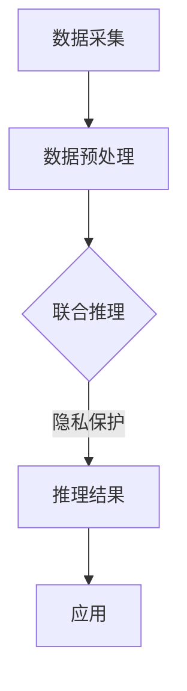

                 

### 文章标题

边缘计算中的联合推理技术与隐私保护

### 关键词

边缘计算、联合推理、隐私保护、协同学习、联邦学习、数据加密、差分隐私

### 摘要

本文深入探讨了边缘计算中的联合推理技术与隐私保护的重要性。首先，介绍了边缘计算的基础理论，包括其起源、发展与网络架构。接着，详细阐述了边缘计算中的资源调度与优化策略。然后，重点讨论了边缘计算中的联合推理技术，包括其基本概念、框架、算法及性能评估。最后，本文探讨了隐私保护技术在边缘计算中的应用，包括数据加密、差分隐私技术及其挑战。通过本文的研究，旨在为边缘计算中的联合推理与隐私保护提供一种系统性的理解和解决方案。

### 第一部分：边缘计算基础理论

#### 第1章：边缘计算概述

边缘计算（Edge Computing）是一种分布式计算架构，其核心思想是将数据处理、存储、分析和应用尽量接近数据生成的源头，从而降低延迟、减少带宽消耗并提高数据处理效率。边缘计算起源于物联网（IoT）和智能设备的发展需求，旨在解决云计算中心处理数据时存在的延迟和带宽瓶颈问题。

1.1 边缘计算的起源与发展

边缘计算的概念最早可以追溯到20世纪80年代，当时为了提高网络传输效率，一些研究开始探索将数据处理任务从中心节点转移到网络边缘。随着物联网、5G、云计算和人工智能等技术的发展，边缘计算逐渐成为一个独立的研究领域和应用方向。

1.2 边缘计算与传统云计算的对比

传统云计算依赖于中心化的数据中心，数据处理任务集中在中心节点进行，而边缘计算则将部分计算任务分散到网络边缘的设备上进行。两者的主要区别如下：

- **数据处理位置**：传统云计算在中心节点处理数据，而边缘计算在数据生成的源头附近处理数据。
- **响应速度**：边缘计算具有更低的延迟，能够更快地响应用户需求，而传统云计算可能存在一定的延迟。
- **带宽消耗**：边缘计算减少了数据传输的带宽需求，而传统云计算需要大量的数据传输。
- **计算能力**：传统云计算通常拥有更强的计算能力和存储资源，而边缘计算设备则更注重轻量级计算和资源优化。

1.3 边缘计算的关键概念与技术

边缘计算涉及多个关键概念和技术，主要包括：

- **边缘节点**：边缘计算中的计算实体，可以是智能手机、路由器、网关、服务器等。
- **边缘设备**：边缘计算中的终端设备，如传感器、摄像头、智能手表等。
- **边缘网络**：连接边缘节点和边缘设备的网络，包括无线网络、光纤网络等。
- **边缘平台**：提供边缘计算服务的平台，包括云计算平台、边缘计算平台等。
- **边缘应用**：在边缘计算环境中运行的应用程序，如物联网应用、智能城市应用、自动驾驶等。

#### 第2章：边缘计算网络架构

边缘计算网络架构是边缘计算系统的重要组成部分，决定了系统的性能、可靠性和可扩展性。边缘计算网络架构通常包括多个层级，从设备层到平台层再到应用层，每个层级都有其特定的功能和职责。

2.1 边缘计算网络的层级结构

边缘计算网络的层级结构可以分为以下几个层级：

- **设备层**：包括各种边缘设备，如传感器、摄像头、智能设备等，这些设备负责数据的采集和初步处理。
- **边缘节点层**：包括边缘服务器、网关、路由器等，这些节点负责进一步的数据处理、存储和通信。
- **边缘平台层**：包括边缘计算平台、云计算平台等，这些平台提供更高级别的数据处理、分析和应用服务。
- **应用层**：包括各种边缘应用，如物联网应用、智能城市应用、自动驾驶等，这些应用直接服务于最终用户。

2.2 边缘节点的作用与分类

边缘节点在边缘计算网络中扮演着重要的角色，它们负责数据的处理、存储和转发。根据其功能和性能的不同，边缘节点可以分为以下几类：

- **轻量级边缘节点**：这类节点通常部署在设备密集的场景，如工业物联网、智能家居等，负责轻量级数据处理和通信。
- **高性能边缘节点**：这类节点通常部署在需要高性能计算和存储的场景，如自动驾驶、实时视频分析等，具备较强的计算和存储能力。
- **边缘网关**：边缘网关是连接边缘设备和边缘节点的关键设备，负责数据传输、协议转换和网络管理。

2.3 边缘计算网络的通信协议与关键技术

边缘计算网络的通信协议和关键技术决定了边缘计算系统的性能和可靠性。以下是一些常见的通信协议和关键技术：

- **MQTT（消息队列遥测传输）**：MQTT是一种轻量级的消息传输协议，适用于低带宽、高延迟的网络环境，广泛应用于物联网应用。
- **CoAP（约束应用协议）**：CoAP是一种基于UDP的轻量级协议，适用于资源受限的设备，如传感器和智能设备。
- **SDN（软件定义网络）**：SDN通过集中控制平面和分布数据平面的分离，实现网络的灵活管理和优化。
- **NFV（网络功能虚拟化）**：NFV将传统的网络功能（如防火墙、路由器等）虚拟化为软件，实现网络的灵活部署和扩展。

#### 第3章：边缘计算中的资源调度与优化

资源调度和优化是边缘计算中至关重要的一环，直接影响到系统的性能和效率。资源调度涉及到计算资源、存储资源和网络资源的合理分配和调度，以最大化系统的利用率和响应速度。

3.1 资源调度策略与方法

边缘计算中的资源调度策略主要包括以下几种：

- **基于优先级的调度**：根据任务的优先级进行调度，优先级高的任务优先执行。
- **基于负载的调度**：根据系统的负载情况动态调整任务分配，将任务分配到负载较低的节点上。
- **基于QoS的调度**：根据服务质量要求进行调度，保证高优先级或高QoS要求的任务得到优先处理。
- **基于资源可用性的调度**：根据节点的资源可用性进行调度，将任务分配到资源充足的节点上。

3.2 负载均衡技术

负载均衡技术是边缘计算中常用的优化手段，通过将任务分配到多个节点上，实现任务的负载均衡和系统的性能优化。常见的负载均衡技术包括：

- **轮询负载均衡**：将任务按照轮询顺序分配到各个节点上。
- **最小连接负载均衡**：将任务分配到当前连接数最少的节点上。
- **源地址哈希负载均衡**：根据源地址的哈希值将任务分配到特定的节点上。
- **动态负载均衡**：根据实时负载情况动态调整任务分配策略。

3.3 资源优化算法

资源优化算法是边缘计算中的一项重要研究内容，旨在通过优化资源分配和调度策略，提高系统的资源利用率和性能。常见的资源优化算法包括：

- **贪心算法**：通过贪心策略逐个选择最优解，直到达到最优解。
- **遗传算法**：通过模拟生物进化过程，逐步优化资源分配策略。
- **粒子群优化算法**：通过模拟鸟群觅食过程，逐步优化资源分配策略。
- **神经网络优化算法**：通过神经网络模型，学习最优的资源分配策略。

### 第二部分：边缘计算中的联合推理技术

#### 第4章：边缘计算中的联合推理概述

联合推理（Joint Inference）是一种在边缘计算中应用广泛的技术，它允许多个边缘节点共同参与推理任务，通过数据共享和模型共享实现高效的推理。联合推理在边缘计算中具有重要的应用价值，能够解决数据隐私、带宽限制和计算能力不足等问题。

4.1 联合推理的基本概念

联合推理涉及多个边缘节点，它们共享数据或模型参数，共同完成推理任务。联合推理的基本概念包括：

- **联合模型**：多个边缘节点共同训练的模型，用于推理任务。
- **协作学习**：多个边缘节点通过共享数据和模型参数进行协同学习。
- **联邦学习**：多个边缘节点在不共享数据的情况下，通过模型参数的交换实现联合推理。
- **本地化推理**：边缘节点在本地执行推理任务，并将结果汇总。

4.2 联合推理的优势与应用场景

联合推理在边缘计算中具有以下优势：

- **隐私保护**：通过数据本地化处理和模型参数共享，联合推理能够有效保护数据隐私。
- **降低带宽消耗**：联合推理减少了数据传输的需求，降低了网络带宽的消耗。
- **提升计算效率**：多个边缘节点协同工作，能够提高推理任务的效率和精度。

联合推理的应用场景包括：

- **智能物联网**：边缘节点协同处理传感器数据，实现实时智能分析和决策。
- **智能城市**：边缘节点共同处理交通、环境等数据，实现智能监控和优化。
- **医疗健康**：边缘节点协同处理医学影像、健康数据等，实现精准诊断和预测。
- **工业制造**：边缘节点协同处理生产数据，实现智能监控和优化。

4.3 联合推理的关键挑战

尽管联合推理在边缘计算中具有广泛的应用价值，但仍然面临一些关键挑战：

- **数据隐私**：如何在不泄露数据隐私的前提下实现联合推理，是一个重要的研究问题。
- **通信带宽**：边缘节点之间的通信带宽有限，如何优化数据传输和模型交换，是一个关键问题。
- **计算资源**：边缘节点的计算资源相对有限，如何优化模型和算法，提高推理效率，是一个重要挑战。
- **一致性**：在多个边缘节点之间保持模型参数的一致性，是一个需要解决的问题。

#### 第5章：边缘计算中的联合推理框架

联合推理框架是边缘计算中的重要组成部分，它决定了联合推理的性能和效率。联合推理框架通常包括以下几个关键组件：

5.1 联合推理框架的组成

联合推理框架主要包括以下组件：

- **边缘节点**：边缘节点是联合推理框架的基本单元，负责数据的采集、处理和推理。
- **通信网络**：边缘节点通过通信网络进行数据交换和模型参数共享。
- **联合模型**：多个边缘节点共同训练的模型，用于推理任务。
- **协调器**：协调器负责管理边缘节点的调度和协同工作，协调模型训练和推理过程。

5.2 常见的联合推理框架介绍

以下是一些常见的联合推理框架：

- **联邦学习框架**：联邦学习框架允许多个边缘节点在不共享数据的情况下，通过模型参数的交换实现联合推理。常见的联邦学习框架包括TensorFlow Federated（TFF）、PySyft等。
- **分布式推理框架**：分布式推理框架允许多个边缘节点共同训练联合模型，实现高效的推理。常见的分布式推理框架包括Horovod、Ray等。
- **边缘云计算框架**：边缘云计算框架将边缘计算与云计算相结合，提供高效的联合推理服务。常见的边缘云计算框架包括Apache Flink、Apache Spark等。

5.3 联合推理框架的设计原则与优化

联合推理框架的设计原则主要包括：

- **数据本地化**：尽量在边缘节点本地处理数据，减少数据传输的需求。
- **模型压缩**：通过模型压缩技术，减少模型参数的大小，提高数据传输效率。
- **通信优化**：优化通信网络的结构和协议，降低通信延迟和带宽消耗。
- **资源调度**：合理调度边缘节点的计算资源，提高推理效率和系统性能。

优化策略包括：

- **动态资源调度**：根据实时负载情况动态调整边缘节点的计算资源和任务分配。
- **模型并行化**：将模型分解为多个部分，在多个边缘节点上并行训练，提高推理效率。
- **数据流分析**：通过数据流分析，优化数据传输和模型交换的路径，提高数据传输效率。

#### 第6章：边缘计算中的联合推理算法

联合推理算法是实现边缘计算中联合推理的核心，它决定了推理任务的效率和准确性。边缘计算中的联合推理算法可以分为以下几类：

6.1 联合推理算法的基本原理

联合推理算法的基本原理包括：

- **模型共享**：多个边缘节点共享相同的模型结构，通过更新模型参数实现联合推理。
- **数据共享**：多个边缘节点共享部分或全部数据，通过模型参数的交换实现联合推理。
- **协同学习**：多个边缘节点通过协同学习，共同优化模型参数，实现联合推理。

6.2 联合推理算法的分类与应用

边缘计算中的联合推理算法可以分为以下几类：

- **协作式推理**：协作式推理是一种多个边缘节点共同参与推理任务的算法，通过数据共享和模型共享实现高效的推理。协作式推理适用于需要多个边缘节点协同处理的数据密集型应用，如智能物联网、智能城市等。
- **联邦学习**：联邦学习是一种多个边缘节点在不共享数据的情况下，通过模型参数的交换实现联合推理的算法。联邦学习适用于数据隐私要求较高的应用，如医疗健康、金融等。
- **分布式推理**：分布式推理是一种多个边缘节点共同训练联合模型的算法，通过并行计算提高推理效率。分布式推理适用于大规模边缘计算应用，如自动驾驶、工业制造等。

6.3 联合推理算法的性能评估与优化

联合推理算法的性能评估主要包括推理速度、推理精度和通信带宽等方面。以下是一些常见的性能评估指标：

- **推理速度**：推理速度是衡量联合推理算法性能的重要指标，通常用推理时间（秒）来表示。
- **推理精度**：推理精度是衡量推理结果准确性的指标，通常用准确率（百分比）来表示。
- **通信带宽**：通信带宽是衡量通信网络性能的指标，通常用比特每秒（bps）来表示。

以下是一些常见的性能优化策略：

- **模型压缩**：通过模型压缩技术，减少模型参数的大小，降低通信带宽的需求。
- **数据本地化**：通过数据本地化处理，减少数据传输的需求，提高推理速度。
- **并行计算**：通过并行计算技术，提高推理效率和系统性能。
- **通信优化**：通过优化通信网络的结构和协议，降低通信延迟和带宽消耗。

### 第三部分：隐私保护技术

#### 第7章：边缘计算中的隐私保护概述

隐私保护是边缘计算中一个关键的研究领域，随着边缘计算应用的普及，如何确保数据隐私成为了一个亟待解决的问题。边缘计算中的隐私保护涉及多种技术和方法，旨在保护用户数据不被未经授权的访问和泄露。

7.1 隐私保护的重要性

隐私保护在边缘计算中具有重要意义，主要体现在以下几个方面：

- **数据安全**：边缘计算中的数据通常包含用户的敏感信息，如个人身份信息、健康数据、金融信息等。如果这些数据被泄露，可能会导致严重的隐私泄露问题。
- **用户信任**：用户对边缘计算服务的信任取决于其对数据隐私保护的程度。如果用户无法信任边缘计算服务提供商，可能会选择不使用这些服务。
- **法律法规**：许多国家和地区已经制定了相关法律法规，要求企业在处理用户数据时必须采取有效的隐私保护措施。

7.2 边缘计算中的隐私泄露风险

边缘计算中的隐私泄露风险主要包括以下几个方面：

- **数据传输泄露**：边缘节点之间的数据传输可能受到网络攻击，导致数据泄露。
- **数据存储泄露**：边缘节点上的数据存储可能受到恶意攻击，导致数据泄露。
- **数据共享泄露**：边缘节点在共享数据时，可能无法确保数据隐私，导致隐私泄露。
- **数据聚合泄露**：边缘计算应用中的数据聚合可能产生新的隐私泄露风险。

7.3 隐私保护技术的分类与应用场景

隐私保护技术可以分为以下几类：

- **数据加密技术**：数据加密技术通过将明文数据转换为密文，保护数据在传输和存储过程中的隐私。常见的加密算法包括对称加密和非对称加密。
- **差分隐私技术**：差分隐私技术通过在数据集中添加噪声，确保单个数据的隐私保护，同时保持数据的统计特性。差分隐私技术适用于数据分析和机器学习等领域。
- **同态加密技术**：同态加密技术允许在加密数据上进行计算，而不需要解密数据。同态加密技术适用于需要保持数据隐私的计算任务。
- **安全多方计算技术**：安全多方计算技术允许多个参与方在不共享数据的情况下，共同计算和分析数据。安全多方计算技术适用于数据共享和协同计算场景。

#### 第8章：边缘计算中的数据加密技术

数据加密技术是边缘计算中常用的隐私保护手段，通过加密算法将明文数据转换为密文，确保数据在传输和存储过程中的隐私安全。以下介绍几种常见的数据加密技术及其在边缘计算中的应用。

8.1 数据加密的基本原理

数据加密的基本原理是通过加密算法将明文数据转换为密文，只有拥有正确密钥的接收者才能将密文解密为明文。加密算法通常包括加密算法和密钥管理两部分。

- **加密算法**：加密算法是一种将明文数据转换为密文的算法。常见的加密算法包括对称加密算法和非对称加密算法。
  - **对称加密算法**：对称加密算法使用相同的密钥进行加密和解密，如AES、DES等。对称加密算法的优点是加密速度快，缺点是密钥分发和管理复杂。
  - **非对称加密算法**：非对称加密算法使用一对密钥进行加密和解密，公钥用于加密，私钥用于解密，如RSA、ECC等。非对称加密算法的优点是密钥分发简单，缺点是加密速度较慢。

- **密钥管理**：密钥管理是确保加密算法安全性的关键。常见的密钥管理技术包括密钥生成、密钥存储、密钥传输和密钥销毁等。

8.2 常见的数据加密算法

以下介绍几种常见的数据加密算法：

- **AES（高级加密标准）**：AES是一种对称加密算法，采用128位密钥，支持128位、192位和256位密钥长度。AES具有高性能、高效能和安全性高等优点，广泛应用于边缘计算领域。
- **RSA（RSA加密算法）**：RSA是一种非对称加密算法，使用一个大素数和一个小素数构造密钥，支持多种密钥长度，如1024位、2048位等。RSA具有密钥分发简单、加密速度快等优点，但密钥长度较长时加密速度较慢。
- **ECC（椭圆曲线加密算法）**：ECC是一种非对称加密算法，采用椭圆曲线构造密钥，支持较短密钥长度，如256位、384位等。ECC具有高性能、高效能和安全性高等优点，是边缘计算中常用的加密算法。

8.3 数据加密在边缘计算中的应用

数据加密在边缘计算中具有广泛的应用，包括以下几个方面：

- **数据传输加密**：在边缘节点之间的数据传输过程中，使用数据加密技术确保数据的安全性。常用的协议包括TLS（传输层安全协议）、SSL（安全套接字层协议）等。
- **数据存储加密**：在边缘节点上的数据存储过程中，使用数据加密技术确保数据的隐私保护。常用的技术包括文件加密、数据库加密等。
- **数据共享加密**：在多个边缘节点之间共享数据时，使用数据加密技术确保数据的隐私安全。常用的技术包括同态加密、安全多方计算等。

#### 第9章：边缘计算中的差分隐私技术

差分隐私（Differential Privacy）是一种隐私保护技术，通过在数据集中添加噪声，确保单个数据的隐私保护，同时保持数据的统计特性。差分隐私技术在边缘计算中具有广泛的应用，能够有效解决数据隐私泄露问题。

9.1 差分隐私的基本概念

差分隐私的基本概念包括：

- **隐私定义**：差分隐私通过确保对单个数据的查询不会泄露太多信息，从而保护数据的隐私。
- **ε-差分隐私**：ε-差分隐私是一种常用的差分隐私度量，ε表示隐私预算，ε值越大，隐私保护程度越高。
- **拉普拉斯机制**：拉普拉斯机制是一种常用的差分隐私机制，通过在数据集中添加拉普拉斯噪声，实现ε-差分隐私。

9.2 差分隐私算法的分类与应用

差分隐私算法可以分为以下几类：

- **基于拉普拉斯机制的算法**：基于拉普拉斯机制的算法通过在数据集中添加拉普拉斯噪声，实现ε-差分隐私。常见的算法包括Laplace Mechanism、Gaussian Mechanism等。
- **基于剪枝机制的算法**：基于剪枝机制的算法通过减少数据集的大小，实现ε-差分隐私。常见的算法包括Count-Min Sketch、Laplace Sketch等。
- **基于随机响应机制的算法**：基于随机响应机制的算法通过为每个查询生成随机响应，实现ε-差分隐私。常见的算法包括Randomized Response、ANS等。

差分隐私算法在边缘计算中具有广泛的应用，包括：

- **数据发布**：在边缘计算中，差分隐私算法可以用于发布数据集，确保数据的隐私保护。
- **机器学习**：在边缘计算中，差分隐私算法可以用于训练机器学习模型，确保训练数据集的隐私保护。
- **统计分析**：在边缘计算中，差分隐私算法可以用于进行统计分析，确保分析结果的隐私保护。

9.3 差分隐私在边缘计算中的实现与挑战

差分隐私在边缘计算中的实现面临以下挑战：

- **计算开销**：差分隐私算法通常需要添加噪声和处理大量数据，可能导致计算开销较大。
- **准确性影响**：差分隐私算法通过添加噪声实现隐私保护，可能会影响数据的准确性和统计分析结果。
- **通信带宽**：差分隐私算法可能需要传输大量数据，可能对通信带宽造成压力。
- **模型适应性**：差分隐私算法需要针对不同的应用场景和任务进行优化，以适应边缘计算的需求。

为解决这些挑战，研究人员提出了多种差分隐私优化算法，包括基于剪枝机制的优化算法、基于分布式计算优化算法等。通过优化差分隐私算法，可以提高其在边缘计算中的应用效果。

#### 第10章：边缘计算中的隐私保护策略

隐私保护策略是确保边缘计算系统安全性和可靠性的关键。隐私保护策略需要综合考虑数据安全、通信安全和计算安全等多个方面，以提供全面的数据隐私保护。以下介绍隐私保护策略的设计原则、实施与评估，以及优化策略。

10.1 隐私保护策略的设计原则

隐私保护策略的设计原则包括：

- **最小化数据收集**：只收集必要的数据，避免过度收集敏感信息。
- **最小化数据处理**：在数据处理过程中，尽量减少数据处理操作的复杂度，降低隐私泄露风险。
- **数据加密**：对传输和存储的数据进行加密，确保数据在传输和存储过程中的安全性。
- **访问控制**：通过访问控制机制，限制对数据的访问权限，确保数据不被未经授权的访问。
- **审计与监控**：建立审计与监控机制，实时监控系统的安全状态，及时发现和应对安全威胁。

10.2 隐私保护策略的实施与评估

隐私保护策略的实施与评估包括以下几个方面：

- **数据收集与处理**：在边缘计算系统中，制定数据收集和处理策略，确保数据的隐私保护。实施过程中，需要遵循最小化数据收集和处理的原则，避免过度收集和处理敏感信息。
- **数据加密**：在数据传输和存储过程中，采用数据加密技术，确保数据在传输和存储过程中的安全性。常用的加密技术包括对称加密、非对称加密和同态加密等。
- **访问控制**：通过访问控制机制，限制对数据的访问权限。访问控制机制可以基于用户身份、角色和权限进行设置，确保数据不被未经授权的访问。
- **审计与监控**：建立审计与监控机制，实时监控系统的安全状态，及时发现和应对安全威胁。审计与监控机制可以记录系统的操作日志，进行安全事件分析，识别潜在的安全威胁。

隐私保护策略的评估包括以下几个方面：

- **安全性评估**：评估隐私保护策略的安全性，确保系统在面临攻击时能够有效抵抗。
- **性能评估**：评估隐私保护策略对系统性能的影响，确保系统的响应速度和效率不受严重影响。
- **合规性评估**：评估隐私保护策略是否符合相关法律法规和标准，确保系统的合法合规性。

10.3 隐私保护策略的优化与挑战

隐私保护策略的优化包括以下几个方面：

- **数据加密优化**：优化数据加密算法的选择和实现，提高加密速度和安全性。
- **访问控制优化**：优化访问控制机制，提高访问控制的安全性和灵活性。
- **审计与监控优化**：优化审计与监控机制，提高实时性和准确性，增强系统的安全性。

隐私保护策略的优化面临以下挑战：

- **计算资源限制**：边缘计算设备通常具有有限的计算资源，如何在有限的计算资源下实现高效的隐私保护策略，是一个重要挑战。
- **通信带宽限制**：边缘计算设备之间的通信带宽有限，如何在有限带宽下实现高效的隐私保护策略，是一个重要挑战。
- **动态性**：边缘计算系统具有动态性，隐私保护策略需要适应系统的变化，如何实现动态调整，是一个重要挑战。

为解决这些挑战，研究人员提出了多种优化策略，包括基于机器学习的优化策略、基于分层的优化策略等。通过优化隐私保护策略，可以提高边缘计算系统的安全性和可靠性。

### 第四部分：边缘计算中的联合推理与隐私保护实践

#### 第11章：边缘计算中的联合推理与隐私保护应用实例

在本章中，我们将通过具体的实例来展示边缘计算中的联合推理与隐私保护技术的实际应用，包括应用场景的介绍、实现细节和效果分析。

11.1 联合推理与隐私保护在实际应用中的结合

边缘计算中的联合推理与隐私保护技术的结合，可以应用于多种场景，如智能物联网、智能交通、智能医疗等。以下是一个具体的实例：

**应用场景**：智能交通系统

在智能交通系统中，边缘节点分布在城市各个路口和交通监测点，用于实时采集交通流量、车速、交通状况等信息。通过联合推理，边缘节点可以协同处理这些数据，实现交通流量预测、交通信号优化等智能功能。

**实现细节**：

1. **数据收集**：每个边缘节点收集本地的交通数据，包括流量、车速等。
2. **数据预处理**：边缘节点对采集到的数据进行预处理，包括数据清洗、归一化等。
3. **联合推理**：边缘节点将预处理后的数据发送到协调器，协调器负责将多个边缘节点的数据汇总，并训练联合模型。
4. **隐私保护**：在数据传输和模型训练过程中，采用差分隐私技术和数据加密技术，确保数据隐私和安全。

**效果分析**：

通过联合推理与隐私保护技术的结合，智能交通系统可以实时分析交通数据，优化交通信号，减少交通拥堵，提高交通效率。同时，数据隐私得到有效保护，用户隐私得到保障。

11.2 应用案例介绍

以下是一个具体的智能医疗应用案例：

**应用场景**：远程医疗诊断系统

在远程医疗诊断系统中，边缘节点分布在医院的不同科室和诊所，用于实时采集患者数据，如血压、心率、血糖等。通过联合推理，边缘节点可以协同处理这些数据，实现远程医疗诊断。

**实现细节**：

1. **数据收集**：每个边缘节点收集本地的患者数据，包括生命体征、医疗记录等。
2. **数据预处理**：边缘节点对采集到的数据进行预处理，包括数据清洗、归一化等。
3. **联合推理**：边缘节点将预处理后的数据发送到协调器，协调器负责将多个边缘节点的数据汇总，并训练联合模型。
4. **隐私保护**：在数据传输和模型训练过程中，采用差分隐私技术和数据加密技术，确保数据隐私和安全。

**效果分析**：

通过联合推理与隐私保护技术的结合，远程医疗诊断系统可以实时分析患者数据，提高诊断的准确性和效率。同时，数据隐私得到有效保护，患者隐私得到保障。

11.3 应用效果分析与优化建议

通过实际应用案例，我们可以看到边缘计算中的联合推理与隐私保护技术在智能交通、远程医疗等领域具有广泛的应用前景。以下是应用效果分析与优化建议：

- **效果分析**：
  - **实时性**：联合推理与隐私保护技术可以实时处理大量交通或医疗数据，提高系统的实时性和响应速度。
  - **准确性**：联合推理技术通过协同处理多个边缘节点的数据，可以提高模型的准确性和诊断能力。
  - **隐私保护**：差分隐私和数据加密技术可以有效保护数据的隐私和安全，防止数据泄露。

- **优化建议**：
  - **模型优化**：针对不同应用场景，优化联合模型的架构和参数，提高模型的性能和准确性。
  - **通信优化**：优化边缘节点之间的通信协议和传输路径，降低通信延迟和带宽消耗。
  - **计算优化**：在计算资源有限的情况下，优化计算资源和任务的调度策略，提高系统的效率和性能。
  - **隐私保护技术优化**：不断研究和应用新的隐私保护技术，提高隐私保护的安全性和效率。

#### 第12章：边缘计算中的联合推理与隐私保护技术展望

随着边缘计算技术的不断发展，联合推理与隐私保护技术将在未来边缘计算领域发挥越来越重要的作用。以下是对边缘计算中的联合推理与隐私保护技术未来发展的展望。

12.1 技术发展趋势

边缘计算中的联合推理与隐私保护技术未来发展趋势包括：

- **多样化应用场景**：随着边缘计算技术的应用场景不断拓展，联合推理与隐私保护技术将在智能物联网、智能交通、智能医疗、工业制造等多个领域得到广泛应用。
- **高效能模型设计**：针对不同应用场景，设计高效的联合推理模型和隐私保护算法，提高模型性能和推理速度。
- **分布式计算架构**：随着边缘计算节点的增加，分布式计算架构将得到广泛应用，联合推理与隐私保护技术需要适应分布式计算环境。
- **新型隐私保护技术**：新型隐私保护技术，如基于区块链的隐私保护、联邦学习与差分隐私的结合等，将不断涌现，为边缘计算中的隐私保护提供更多选择。

12.2 未来研究方向

边缘计算中的联合推理与隐私保护技术未来的研究方向包括：

- **隐私保护算法优化**：研究新型隐私保护算法，提高隐私保护的安全性和效率，如基于差分隐私的优化算法、基于同态加密的隐私保护算法等。
- **分布式联合推理**：研究分布式联合推理算法，提高分布式计算环境下的推理效率和性能，如基于联邦学习的分布式推理算法、基于模型压缩的分布式推理算法等。
- **跨域数据共享**：研究跨域数据共享与隐私保护技术，实现不同领域的数据协同分析和处理，如跨行业的数据共享、跨地域的数据协同等。
- **隐私保护法律法规**：研究隐私保护法律法规的制定和实施，确保边缘计算中的隐私保护工作符合法律法规要求，为边缘计算技术的发展提供法律保障。

12.3 技术应用前景与挑战

边缘计算中的联合推理与隐私保护技术具有广阔的应用前景，但也面临一定的挑战：

- **应用前景**：
  - **智能化提升**：通过联合推理与隐私保护技术，边缘计算可以实现更加智能化和高效化的数据处理与分析，提高各行业的生产效率和服务质量。
  - **隐私保障**：隐私保护技术的应用可以确保边缘计算中的数据隐私和安全，提高用户对边缘计算服务的信任度。
  - **跨领域协同**：联合推理与隐私保护技术可以实现跨领域的数据协同分析与处理，推动不同领域的技术融合和创新。

- **挑战**：
  - **计算资源限制**：边缘计算设备通常具有有限的计算资源，如何在有限的计算资源下实现高效的联合推理与隐私保护，是一个重要挑战。
  - **通信带宽限制**：边缘计算设备之间的通信带宽有限，如何在有限带宽下实现高效的联合推理与隐私保护，是一个重要挑战。
  - **动态性**：边缘计算系统具有动态性，如何在系统的动态变化中保持联合推理与隐私保护技术的有效性和稳定性，是一个重要挑战。
  - **法律法规**：隐私保护法律法规的制定和实施尚不完善，如何确保边缘计算中的隐私保护工作符合法律法规要求，是一个重要挑战。

通过不断研究和优化边缘计算中的联合推理与隐私保护技术，我们可以应对这些挑战，推动边缘计算技术的可持续发展。

### Mermaid 流程图

以下是一个简单的 Mermaid 流程图，展示了边缘计算中的联合推理与隐私保护技术的基本流程：



### 核心算法原理讲解

边缘计算中的联合推理算法是边缘计算中的一种关键技术，它允许多个边缘节点协同工作，共同完成推理任务，从而提高数据处理效率和准确性。以下是几种常见的边缘计算中的联合推理算法及其核心原理。

#### 1.协作式推理

协作式推理是一种多个边缘节点通过数据共享和模型共享共同参与推理任务的算法。其主要原理如下：

- **数据共享**：每个边缘节点将本地数据上传到中央服务器或协调器，协调器负责汇总和预处理这些数据。
- **模型共享**：协调器将训练好的模型参数分发给所有边缘节点，边缘节点使用本地数据对模型进行微调。
- **结果汇总**：每个边缘节点将微调后的模型参数上传到协调器，协调器负责汇总这些参数，更新全局模型。

**伪代码**：

```python
# 协作式推理算法
def collaborative_inference(data_nodes, model):
    # 数据共享
    global_data = aggregate_local_data(data_nodes)
    
    # 模型共享
    local_model = copy(model)
    
    # 模型微调
    for data in global_data:
        local_model = fine_tune(local_model, data)
        
    # 结果汇总
    global_model = aggregate_local_models(data_nodes, local_model)
    
    return global_model
```

#### 2.联邦学习

联邦学习（Federated Learning）是一种在不共享数据的情况下，通过模型参数的交换实现联合推理的算法。其主要原理如下：

- **模型初始化**：每个边缘节点初始化一个本地模型。
- **模型更新**：边缘节点使用本地数据进行模型训练，并将更新后的模型参数上传到中央服务器。
- **参数聚合**：中央服务器接收所有边缘节点的模型参数，进行聚合更新。
- **模型反馈**：中央服务器将聚合后的模型参数反馈给所有边缘节点，边缘节点使用这些参数更新本地模型。

**伪代码**：

```python
# 联邦学习算法
def federated_learning(data_nodes, global_model):
    local_models = []
    for node in data_nodes:
        local_model = node.train_model(global_model)
        local_models.append(local_model)
        
    global_model = aggregate_models(local_models)
    
    return global_model
```

#### 3.分布式推理

分布式推理是一种多个边缘节点共同训练联合模型的算法，其主要原理如下：

- **模型分割**：将联合模型分割为多个部分，每个边缘节点负责训练模型的一部分。
- **模型传输**：每个边缘节点将训练好的模型部分上传到中央服务器，中央服务器负责汇总这些模型部分。
- **模型融合**：中央服务器将汇总后的模型部分重新组合成完整的联合模型。

**伪代码**：

```python
# 分布式推理算法
def distributed_inference(data_nodes, model_parts):
    local_models = []
    for part in model_parts:
        local_model = train_model(part)
        local_models.append(local_model)
        
    global_model = combine_models(local_models)
    
    return global_model
```

通过上述三种算法，边缘计算中的联合推理可以实现多个边缘节点的协同工作，提高数据处理效率和准确性。在实际应用中，可以根据具体场景和需求选择合适的联合推理算法。同时，结合隐私保护技术，可以确保边缘计算中的数据隐私和安全。

