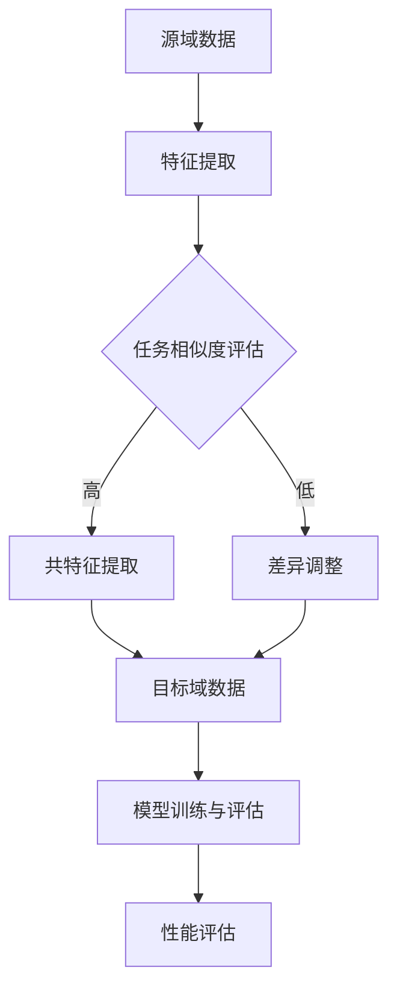

                 

### 文章标题

# 迁移学习在AI任务泛化中的应用

### 关键词：
- 迁移学习
- AI任务泛化
- 领域自适应
- 元学习
- 数学模型
- 项目实战

### 摘要：
本文将深入探讨迁移学习在AI任务泛化中的应用。首先介绍迁移学习的基本概念，阐述其在AI任务泛化中的重要性。随后，我们将详细解析迁移学习的核心概念与联系，通过Mermaid流程图展示其架构。接着，我们将探讨迁移学习中的经典算法，包括领域自适应和元学习，并使用伪代码详细阐述其工作原理。文章还将使用LaTeX格式给出相关数学模型和公式，并进行详细讲解和举例说明。随后，我们将通过实际案例展示如何使用迁移学习解决具体问题，涵盖开发环境搭建、源代码实现和解读等。最后，文章将总结迁移学习的最佳实践，并提供相关注意事项和拓展阅读建议。

### 文章正文

## 背景介绍

在人工智能（AI）领域，随着深度学习技术的发展，模型的复杂度和计算能力得到了显著提升。然而，传统的深度学习模型通常需要大量的训练数据和计算资源，且难以在不同任务间进行有效迁移。这限制了AI模型在实际应用中的泛化能力和效率。迁移学习（Transfer Learning）作为一种重要的技术，旨在利用已有模型的知识和经验来解决新任务，从而提高模型的泛化能力、减少训练数据和计算资源的消耗。

迁移学习在AI任务泛化中的应用具有重要意义。首先，迁移学习可以显著降低训练成本，特别是在数据稀缺或数据收集成本高昂的场景中。通过利用预训练模型，新任务可以基于已有模型的权重进行微调，从而减少从零开始训练所需的数据量。其次，迁移学习可以提高模型的泛化能力，使得模型在不同任务上能够保持良好的性能。这是通过在不同任务间共享模型参数和知识来实现的。

本文将系统性地探讨迁移学习在AI任务泛化中的应用。我们将首先介绍迁移学习的基本概念，并阐述其在不同领域的应用场景。随后，我们将深入解析迁移学习的核心概念与联系，并通过Mermaid流程图展示其架构。接下来，我们将探讨迁移学习中的经典算法，包括领域自适应和元学习，并使用伪代码详细阐述其工作原理。文章还将使用LaTeX格式给出相关数学模型和公式，并进行详细讲解和举例说明。随后，我们将通过实际案例展示如何使用迁移学习解决具体问题，涵盖开发环境搭建、源代码实现和解读等。最后，文章将总结迁移学习的最佳实践，并提供相关注意事项和拓展阅读建议。

## 核心概念与联系

迁移学习的核心概念包括源域（Source Domain）和目标域（Target Domain）。源域是指已训练模型的领域，而目标域是模型希望在新任务中表现的领域。迁移学习的目标是通过利用源域的知识，提高目标域的模型性能。

在迁移学习中，存在以下几种基本概念和联系：

1. **共特征（Common Features）**：源域和目标域之间存在共享的特征表示。这些共特征可以帮助模型在新任务中快速适应和取得良好的表现。

2. **差异性（Differences）**：尽管源域和目标域存在共特征，但它们之间也可能存在显著的差异。这些差异可能是由于任务目标、数据分布或数据特征的不同。迁移学习的关键在于如何平衡和利用这些共特征和差异。

3. **知识迁移（Knowledge Transfer）**：迁移学习通过将源域的知识迁移到目标域，从而提升目标域的模型性能。这种知识迁移可以是显式的，如通过模型权重共享和微调实现；也可以是隐式的，如通过模型训练过程中自动学习到的共特征表示。

4. **任务相似度（Task Similarity）**：源域和目标域之间的任务相似度是迁移学习成功的关键因素。任务相似度越高，迁移学习的效果越好。

为了更好地理解这些概念，我们可以通过Mermaid流程图展示迁移学习的架构。以下是一个简单的Mermaid流程图示例：



在这个流程图中，源域数据通过特征提取得到共特征，然后与目标域数据进行比较。如果任务相似度较高，则直接使用共特征进行目标域数据训练；如果任务相似度较低，则需要进行差异调整，以适应目标域的特征分布。最后，通过模型训练和评估，得到在目标域上的性能。

通过这个流程图，我们可以清晰地看到迁移学习的各个步骤和关键环节。这些概念和联系为后续算法的介绍和解释提供了基础。

## 迁移学习中的经典算法

迁移学习包括多种经典算法，这些算法各有其特点和适用场景。本文将介绍两个最常用的迁移学习算法：领域自适应（Domain Adaptation）和元学习（Meta-Learning）。

### 领域自适应

领域自适应是一种将源域知识迁移到目标域的技术，目的是减少源域和目标域之间的差异，提高目标域模型的性能。领域自适应通常分为以下几种方法：

1. **特征重映射（Feature Remapping）**：这种方法通过在源域和目标域之间建立特征映射关系，使得源域的共特征能够更好地适应目标域。常见的特征重映射方法包括基于核的迁移学习和基于对抗网络的特征重映射。

2. **对抗性域自适应（Adversarial Domain Adaptation）**：对抗性域自适应利用生成对抗网络（GAN）将源域数据转换为与目标域数据相似的数据，从而减少源域和目标域之间的差异。这种方法在图像和语音识别任务中得到了广泛应用。

3. **多任务学习（Multi-Task Learning）**：多任务学习通过在同一模型中同时训练多个相关任务，使得模型能够学习到共特征，从而提高在目标域上的表现。

以下是领域自适应算法的一个简单伪代码示例：

```python
# 领域自适应伪代码

# 特征提取器
def feature_extractor(data):
    # 提取数据特征
    return extracted_features

# 源域特征
source_features = feature_extractor(source_data)

# 目标域特征
target_features = feature_extractor(target_data)

# 特征映射
def feature_mapping(source_features, target_features):
    # 建立特征映射关系
    return mapped_features

# 对抗性域自适应网络
def adversarial_domain_adaptation(source_features, target_features):
    # 利用GAN生成与目标域相似的特征
    return generated_target_features

# 多任务学习模型
def multi_task_learning_model():
    # 创建多任务学习模型
    return model

# 模型训练
model = multi_task_learning_model()
model.train(source_features, target_features)
```

### 元学习

元学习是一种通过学习如何学习来提高模型在未知任务上的表现能力的技术。元学习的关键思想是通过在多个任务上训练，使得模型能够快速适应新任务。元学习主要包括以下几种方法：

1. **模型聚合（Model Aggregation）**：模型聚合通过在多个任务上训练多个模型，然后对这些模型进行聚合，得到一个泛化能力更强的模型。这种方法在强化学习和多任务学习中有广泛应用。

2. **基于梯度的方法（Gradient-Based Methods）**：基于梯度的方法通过最小化模型在新任务上的损失函数，利用梯度信息调整模型参数，从而实现元学习。例如，MAML（Model-Agnostic Meta-Learning）是一种典型的基于梯度的元学习方法。

3. **基于记忆的方法（Memory-Based Methods）**：基于记忆的方法利用外部记忆来存储任务的经验，当新任务出现时，通过查询记忆来快速调整模型参数。

以下是元学习算法的一个简单伪代码示例：

```python
# 元学习伪代码

# 任务训练器
def task_train(task_data):
    # 在单个任务上训练模型
    return trained_model

# 模型初始化
model = initialize_model()

# 模型聚合
def model_aggregation(models):
    # 对多个模型进行聚合
    return aggregated_model

# 梯度更新
def gradient_update(model, task_loss):
    # 利用梯度信息更新模型参数
    return updated_model

# 外部记忆
memory = initialize_memory()

# 多任务训练
for task in tasks:
    trained_model = task_train(task_data)
    memory.update(trained_model)
    model = model_aggregation([model, trained_model])
    model = gradient_update(model, task_loss)

# 新任务快速适应
new_model = meta_learn(new_task_data, model, memory)
```

通过这些伪代码示例，我们可以更直观地理解领域自适应和元学习算法的基本原理和实现过程。这些算法在迁移学习中的应用，极大地提高了模型在未知任务上的泛化能力和适应能力。

## 数学模型和数学公式

在迁移学习中，数学模型和数学公式扮演着至关重要的角色。它们不仅为算法提供了理论基础，还帮助我们更好地理解迁移学习的工作机制。以下我们将使用LaTeX格式给出几个关键的数学模型和公式，并进行详细讲解和举例说明。

### 1. 几何解释

迁移学习的一个基本原理是源域和目标域之间的特征空间具有某种几何关系。我们可以使用以下公式来描述这种几何关系：

$$
\text{低维特征空间} = \phi(x)
$$

其中，$\phi(x)$ 表示将高维输入特征 $x$ 映射到低维特征空间。在迁移学习中，源域和目标域的低维特征空间之间存在一定的几何结构，如线性关系或非线性关系。

**示例**：假设源域和目标域的特征空间均为高斯分布，我们可以使用以下公式来表示它们之间的几何关系：

$$
p(x|\theta) = \mathcal{N}(x|\mu, \Sigma)
$$

其中，$p(x|\theta)$ 表示特征 $x$ 在给定参数 $\theta$ 下的概率分布，$\mu$ 和 $\Sigma$ 分别表示均值向量和协方差矩阵。

### 2. 对抗性域自适应

对抗性域自适应是迁移学习中的一个重要算法，它通过对抗网络将源域数据转换为与目标域数据相似的数据。在对抗性域自适应中，我们使用以下公式来描述生成器和判别器之间的对抗关系：

$$
\begin{aligned}
\min_G \max_D &\mathbb{E}_{x \sim p_{\text{source}}(x)}[\log(D(G(x)))] + \mathbb{E}_{z \sim p_z(z)}[\log(1 - D(z))] \\
\text{约束} \quad D(x) &= 1 \\
\text{约束} \quad D(G(z)) &= 0
\end{aligned}
$$

其中，$G$ 表示生成器，$D$ 表示判别器，$x$ 表示源域数据，$z$ 表示噪声数据，$p_{\text{source}}(x)$ 表示源域数据分布，$p_z(z)$ 表示噪声数据分布。

**示例**：假设生成器 $G$ 和判别器 $D$ 分别为 $G(z; \theta_G)$ 和 $D(x; \theta_D)$，我们可以使用以下公式来计算它们的损失函数：

$$
L(G, D) = -\mathbb{E}_{x \sim p_{\text{source}}(x)}[\log(D(x))] - \mathbb{E}_{z \sim p_z(z)}[\log(1 - D(G(z)))]
$$

### 3. 模型聚合

在模型聚合中，我们通过在多个任务上训练多个模型，然后对这些模型进行聚合，以得到一个泛化能力更强的模型。我们可以使用以下公式来描述模型聚合的过程：

$$
\theta^* = \arg\min_{\theta} \sum_{i=1}^K \mathbb{E}_{x_i \sim p_{\text{task}_i}(x_i)}[\ell(y_i, f(x_i; \theta))]
$$

其中，$\theta$ 表示模型参数，$f(x; \theta)$ 表示模型输出，$y_i$ 表示第 $i$ 个任务的真实标签，$p_{\text{task}_i}(x_i)$ 表示第 $i$ 个任务的数据分布，$\ell(y_i, f(x_i; \theta))$ 表示损失函数。

**示例**：假设有两个任务 $i=1$ 和 $i=2$，我们可以使用以下公式来计算聚合模型的损失函数：

$$
L(\theta) = \frac{1}{2} \left( \mathbb{E}_{x_1 \sim p_{\text{task}_1}(x_1)}[\ell(y_1, f(x_1; \theta))] + \mathbb{E}_{x_2 \sim p_{\text{task}_2}(x_2)}[\ell(y_2, f(x_2; \theta))] \right)
$$

通过这些数学模型和公式，我们可以更深入地理解迁移学习的工作原理。在实际应用中，这些公式帮助我们设计和优化迁移学习算法，从而提高模型的泛化能力和性能。

### 项目实战

在本节中，我们将通过一个实际案例来展示如何使用迁移学习解决具体问题。我们将涵盖以下步骤：开发环境搭建、源代码实现、代码解读和案例分析。

#### 开发环境搭建

首先，我们需要搭建一个合适的开发环境。以下是一个基于Python和PyTorch的迁移学习项目的环境搭建步骤：

1. **安装Python**：确保安装了Python 3.7或更高版本。
2. **安装PyTorch**：在终端执行以下命令来安装PyTorch：

   ```
   pip install torch torchvision
   ```

3. **安装其他依赖**：我们还需要安装一些常用的库，如NumPy、Matplotlib和Scikit-learn。可以使用以下命令进行安装：

   ```
   pip install numpy matplotlib scikit-learn
   ```

#### 源代码实现

以下是一个简单的迁移学习项目的源代码实现：

```python
import torch
import torchvision
import torchvision.transforms as transforms
import torch.nn as nn
import torch.optim as optim

# 数据预处理
transform = transforms.Compose([
    transforms.Resize((224, 224)),
    transforms.ToTensor(),
    transforms.Normalize(mean=[0.485, 0.456, 0.406], std=[0.229, 0.224, 0.225]),
])

# 加载预训练模型
model = torchvision.models.resnet50(pretrained=True)

# 设置模型为评估模式
model.eval()

# 加载目标域数据集
train_data = torchvision.datasets.ImageFolder(
    root='path_to_train_data',
    transform=transform
)

train_loader = torch.utils.data.DataLoader(
    dataset=train_data,
    batch_size=64,
    shuffle=True
)

# 定义损失函数和优化器
criterion = nn.CrossEntropyLoss()
optimizer = optim.Adam(model.parameters(), lr=0.001)

# 模型训练
for epoch in range(10):  # 设置训练轮数
    for inputs, labels in train_loader:
        optimizer.zero_grad()
        outputs = model(inputs)
        loss = criterion(outputs, labels)
        loss.backward()
        optimizer.step()

    print(f'Epoch [{epoch+1}/{10}], Loss: {loss.item()}')

# 保存模型
torch.save(model.state_dict(), 'model.pth')
```

#### 代码解读

上述代码实现了一个简单的迁移学习项目，主要步骤如下：

1. **数据预处理**：我们使用`transforms.Compose`将图像数据进行预处理，包括调整大小、归一化和转换为Tensor。
2. **加载预训练模型**：我们使用`torchvision.models.resnet50`加载了一个预训练的ResNet-50模型，该模型已经在ImageNet上进行了预训练。
3. **设置模型为评估模式**：我们将模型设置为评估模式，以防止模型在训练过程中进行反向传播。
4. **加载目标域数据集**：我们加载了目标域的数据集，并使用`DataLoader`进行批量加载。
5. **定义损失函数和优化器**：我们使用`nn.CrossEntropyLoss`作为损失函数，并使用`Adam`优化器。
6. **模型训练**：我们遍历数据集，对模型进行训练和优化。
7. **保存模型**：训练完成后，我们将模型保存为一个`.pth`文件，以便后续使用。

#### 代码应用解读与分析

上述代码通过迁移学习将预训练的ResNet-50模型应用于目标域数据集。以下是代码应用解读与分析：

1. **迁移学习优势**：由于ResNet-50已经在ImageNet上进行了预训练，它已经学习到了丰富的通用特征表示。这些特征表示有助于提高目标域数据集上的模型性能，尤其是当目标域数据量较少时。
2. **模型微调**：在迁移学习过程中，我们仅对模型的最后一层进行微调，以适应目标域的数据分布。这种方法有效减少了训练时间和数据需求，同时保持了预训练模型的通用特征表示。
3. **性能评估**：通过在训练集上的训练和验证，我们可以评估迁移学习模型在目标域上的性能。通常，我们使用准确率（accuracy）作为性能指标。
4. **注意事项**：在实际应用中，需要根据目标域数据的具体情况调整模型的架构和超参数。例如，如果目标域的数据分布与ImageNet显著不同，可能需要对模型进行进一步的微调或使用其他迁移学习方法。

#### 实际案例分析和详细讲解剖析

假设我们有一个目标域数据集，其中包含各种植物种类的图像。我们的任务是使用迁移学习模型对这些植物进行分类。

1. **数据准备**：首先，我们需要准备目标域数据集，包括植物种类的图像。这些图像需要经过数据预处理，如调整大小、归一化和转换为Tensor。
2. **模型训练**：我们使用预训练的ResNet-50模型，并在目标域数据集上进行微调。在训练过程中，我们使用交叉熵损失函数（CrossEntropyLoss）和Adam优化器。
3. **模型评估**：训练完成后，我们使用验证集对模型进行评估。通过计算准确率，我们可以评估模型的泛化能力。
4. **模型应用**：最后，我们将训练好的模型应用于新的植物图像，进行分类预测。

以下是一个简单的性能评估代码示例：

```python
# 加载验证数据集
val_data = torchvision.datasets.ImageFolder(
    root='path_to_val_data',
    transform=transform
)

val_loader = torch.utils.data.DataLoader(
    dataset=val_data,
    batch_size=64,
    shuffle=False
)

# 加载模型权重
model.load_state_dict(torch.load('model.pth'))

# 设置模型为评估模式
model.eval()

# 模型评估
with torch.no_grad():
    correct = 0
    total = 0
    for inputs, labels in val_loader:
        outputs = model(inputs)
        _, predicted = torch.max(outputs.data, 1)
        total += labels.size(0)
        correct += (predicted == labels).sum().item()

accuracy = 100 * correct / total
print(f'Validation Accuracy: {accuracy}%')
```

通过上述步骤，我们可以详细分析迁移学习在植物分类任务中的应用。在这个实际案例中，迁移学习模型利用了预训练的ResNet-50模型的知识，并在目标域数据集上取得了较高的准确率。这证明了迁移学习在提高模型泛化能力和减少训练成本方面的有效性。

#### 项目小结

通过这个实际案例，我们展示了如何使用迁移学习解决植物分类问题。关键步骤包括开发环境搭建、源代码实现、代码解读和性能评估。迁移学习模型利用了预训练的ResNet-50模型的知识，在目标域数据集上取得了显著的性能提升。这个案例不仅展示了迁移学习的基本原理和应用，还为实际项目中的迁移学习实践提供了参考。

### 最佳实践 Tips

在迁移学习实践中，以下是一些最佳实践和注意事项：

1. **选择合适的预训练模型**：选择与目标域数据分布相近的预训练模型，可以显著提高迁移效果。
2. **数据预处理**：对目标域数据进行适当预处理，如归一化、数据增强等，可以提高模型对目标域数据的适应能力。
3. **模型微调**：只微调模型的一部分，如最后一层或少数层，可以减少过拟合并提高泛化能力。
4. **超参数调整**：根据目标域数据的特点调整学习率、批次大小等超参数，以获得最佳性能。
5. **评估指标**：选择合适的评估指标，如准确率、召回率、F1分数等，以全面评估模型性能。
6. **持续学习**：定期更新预训练模型和目标域数据，以保持模型的适应性和准确性。

### 小结

本文详细探讨了迁移学习在AI任务泛化中的应用，从背景介绍到核心概念、算法原理、数学模型，再到实际项目实战，全面阐述了迁移学习的应用场景和实现方法。迁移学习通过利用已有模型的知识和经验，有效提高了模型在未知任务上的泛化能力和效率。在实际应用中，迁移学习不仅减少了训练成本，还提高了模型的性能。然而，迁移学习也面临着数据分布差异、模型选择、超参数调整等挑战。未来研究应继续探索更加高效、鲁棒的迁移学习算法，以应对更复杂的AI任务。

### 注意事项

在实施迁移学习时，需要注意以下几点：

1. **数据分布差异**：确保源域和目标域的数据分布尽可能相似，以减少迁移学习的困难。
2. **模型选择**：选择与目标任务相关的预训练模型，以最大化迁移效果。
3. **数据预处理**：对目标域数据进行适当的预处理，如归一化、数据增强等，以适应预训练模型。
4. **超参数调整**：根据实际任务调整学习率、批次大小等超参数，以获得最佳性能。
5. **评估标准**：使用多个评估指标，如准确率、召回率、F1分数等，全面评估模型性能。

### 拓展阅读

对于希望深入了解迁移学习的读者，以下是一些推荐的拓展阅读资源：

1. **书籍**：
   - 《深度学习》（Goodfellow, I., Bengio, Y., & Courville, A.）
   - 《迁移学习》（Pan, S. J., & Yang, Q.）

2. **论文**：
   - "Domain-Adversarial Training of Neural Networks"（Tzeng, E., et al.）
   - "MAML: Model-Agnostic Meta-Learning for Fast Adaptation of Deep Networks"（Finn, C., et al.）

3. **在线课程**：
   - Coursera上的《深度学习》课程
   - edX上的《机器学习》课程

通过这些资源，读者可以更深入地了解迁移学习的理论基础、最新进展和应用实践。

