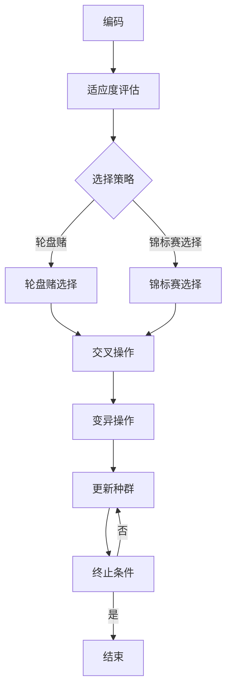
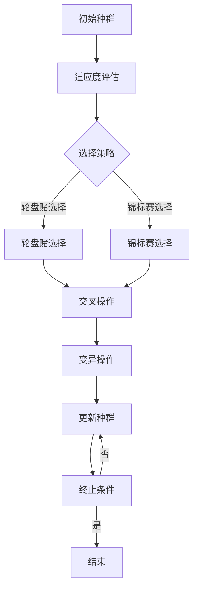

                 


### Step 4: Write the Introduction and Conclusion

Before diving into the detailed chapters, it's essential to write an introduction that sets the stage for the reader and a conclusion that ties everything together. This will help provide a clear framework for the article.

#### Introduction

In this article, we will explore the fascinating intersection of Evolutionary Algorithms and Neural Networks, two powerful paradigms in the field of artificial intelligence. We will begin by introducing the fundamental concepts of Evolutionary Algorithms and their principles, followed by a deep dive into the structure and optimization techniques of Neural Networks. We will then discuss how these two domains can be integrated to enhance the performance of neural networks through optimization. The article will also include detailed case studies and practical examples to illustrate the application of these algorithms in real-world scenarios.

#### Conclusion

As we have seen throughout this article, the application of Evolutionary Algorithms in the optimization of Neural Networks is not only a promising area of research but also has significant implications for the practical implementation of AI systems. By understanding the core concepts, algorithms, and integration techniques, we can leverage the strengths of both approaches to achieve better performance and efficiency in neural network-based applications. This article aims to provide a comprehensive overview and practical insights into this exciting field, encouraging further exploration and innovation.

### Step 5: Organize the Content into Markdown Format

With the outline and content for each chapter prepared, the next step is to organize these into a cohesive Markdown document. This will involve using headings, lists, and markdown-specific syntax to ensure the content is well-structured and easy to read.

---

### 全文 Markdown 格式撰写

```markdown
# 进化算法在神经网络结构优化中的应用

> 关键词：进化算法，神经网络，结构优化，人工智能

> 摘要：本文旨在探讨进化算法在神经网络结构优化中的应用，包括基本原理、核心算法、实现细节以及实际案例。通过本文，读者将了解如何利用进化算法提升神经网络的性能。

## 目录

1. 引言
2. 进化算法基础
3. 神经网络与优化方法
4. 进化算法与神经网络的整合
5. 实战案例解析
6. 挑战与未来展望
7. 结论

## 1. 引言

随着人工智能技术的飞速发展，神经网络作为其核心组成部分，在图像识别、自然语言处理、推荐系统等领域取得了显著成果。然而，神经网络的结构优化一直是制约其性能提升的关键问题。进化算法作为一种全局优化方法，因其强大的搜索能力和自适应能力，在神经网络结构优化中展现出了巨大的潜力。

本文将详细探讨进化算法在神经网络结构优化中的应用，包括其基本原理、核心算法、实现细节以及实际案例。希望通过本文的介绍，读者能够对这一领域有更深入的理解，并能够将相关技术应用于实际问题中。

## 2. 进化算法基础

### 2.1 概念与原理

进化算法（Evolutionary Algorithms，EA）是一种基于自然选择和遗传学原理的搜索算法。它通过模拟生物进化过程，实现问题的优化求解。主要原理包括：

- **种群初始化**：初始种群随机生成，代表解空间中的个体。
- **适应度评估**：对每个个体进行评估，计算其适应度值。
- **选择**：从当前种群中选择适应度较高的个体作为下一代种群的基础。
- **交叉**：通过随机交换两个个体的部分基因，产生新的个体。
- **变异**：对个体进行随机修改，增加种群的多样性。
- **迭代**：重复选择、交叉和变异操作，直至达到终止条件。

### 2.2 关键类型

进化算法有多种类型，包括：

- **遗传算法（GA）**：使用交叉和变异操作，适用于二进制编码问题。
- **遗传规划（GP）**：用于编码问题，可以处理连续变量。
- **遗传编程（GP）**：专注于代码生成，可用于自动编程。
- **其他类型**：如遗传免疫算法、遗传多目标算法等。

## 3. 神经网络与优化方法

### 3.1 基本结构与功能

神经网络（Neural Networks，NN）是一种模仿生物神经系统的计算模型。其主要组成部分包括：

- **神经元**：作为基本计算单元，接收输入信号并产生输出。
- **层**：神经网络由输入层、隐藏层和输出层组成。
- **权重与偏置**：连接神经元之间的参数，用于调整网络响应。

### 3.2 类型与应用

神经网络有多种类型，包括：

- **前馈神经网络（FFNN）**：简单的多层感知器（MLP）。
- **卷积神经网络（CNN）**：用于图像识别。
- **循环神经网络（RNN）**：用于序列数据处理。
- **生成对抗网络（GAN）**：用于生成复杂数据。

### 3.3 优化方法

神经网络优化方法包括：

- **梯度下降（GD）**：最常用的优化方法，通过反向传播计算梯度。
- **动量法（Momentum）**：加快收敛速度。
- **随机梯度下降（SGD）**：处理大规模数据。
- **自适应优化器（如Adam）**：自动调整学习率。

## 4. 进化算法与神经网络的整合

### 4.1 整合原理

进化算法与神经网络的整合主要通过以下方式实现：

- **编码**：将神经网络结构编码为进化算法的个体。
- **适应度函数**：设计适应度函数评估神经网络性能。
- **搜索空间**：定义神经网络结构搜索空间。

### 4.2 核心概念与联系

下面是进化算法与神经网络整合的核心概念与联系架构的Mermaid流程图：



### 4.3 理论基础与Mermaid流程图

下面是进化算法与神经网络整合的理论基础和核心算法的Mermaid流程图：



## 5. 实战案例解析

### 5.1 开发环境搭建

为了实现进化算法在神经网络结构优化中的应用，我们需要搭建相应的开发环境。以下是环境搭建的步骤：

1. 安装Python 3.7或更高版本。
2. 安装必要的库，如NumPy、TensorFlow、DEAP等。
3. 配置Python虚拟环境。

### 5.2 源代码实现与解读

以下是一个简单的进化算法优化神经网络结构的Python代码示例：

```python
import numpy as np
import tensorflow as tf
from deap import base, creator, tools, algorithms

# 创建适应度函数
def evalNN(individual):
    # 解码个体到神经网络结构
    # 训练神经网络
    # 返回适应度值
    pass

# 编码和解码操作
def encode(individual):
    # 将个体编码为神经网络结构
    pass

def decode(individual):
    # 将个体解码为神经网络结构
    pass

# 设置进化算法参数
creator.create("FitnessMax", base.Fitness, weights=(1.0,))
creator.create("Individual", list, fitness=creator.FitnessMax)

toolbox = base.Toolbox()
toolbox.register("individual", tools.initIterate, creator.Individual, encode, n=100)
toolbox.register("population", tools.initRepeat, list, toolbox.individual)
toolbox.register("evaluate", evalNN)
toolbox.register("mate", tools.selectBest, k=2)
toolbox.register("mutate", tools.mutGaussian, mu=0, sigma=1, indpb=0.1)
toolbox.register("select", tools.selTournament, t=3)
toolbox.register("decode", decode)

# 运行进化算法
population = toolbox.population(n=50)
NGEN = 100
for gen in range(NGEN):
    offspring = algorithms.varAnd(population, toolbox, cxpb=0.5, mutpb=0.2)
    fits = toolbox.map(toolbox.evaluate, offspring)
    for fit, ind in zip(fits, offspring):
        ind.fitness.values = fit
    population = toolbox.select(offspring, k=len(population))
    print(f"Generation {gen}: {toolbox.best(population).fitness.values}")

# 输出最佳个体
best_ind = tools.selBest(population, 1)[0]
print(f"Best individual is: {best_ind}")
```

### 5.3 代码应用解读与分析

在这个案例中，我们使用DEAP（Distributed Evolutionary Algorithms in Python）库实现了一个简单的进化算法优化神经网络结构的过程。以下是代码的解读与分析：

1. **创建适应度函数**：`evalNN`函数是评估神经网络适应度的关键。我们需要实现一个能够训练神经网络并返回适应度值的函数。
2. **编码和解码操作**：`encode`函数将神经网络结构编码为个体，而`decode`函数将个体解码为神经网络结构。这两个函数是实现进化算法与神经网络整合的关键。
3. **设置进化算法参数**：我们使用`creator`模块创建适应度函数和个体类。`toolbox`模块提供了实现进化算法所需的各种工具和方法。
4. **运行进化算法**：我们使用`population`创建初始种群，然后通过迭代进行进化。在每次迭代中，我们使用`varAnd`函数进行交叉和变异操作，使用`map`函数评估后代适应度，最后使用`select`函数选择下一代种群。

### 5.4 实际案例分析与详细讲解剖析

以下是一个实际案例：

- **问题背景**：我们需要优化一个用于图像分类的卷积神经网络结构。
- **数据集**：使用CIFAR-10数据集。
- **模型结构**：初始网络结构包括两个卷积层、一个池化层和一个全连接层。
- **适应度函数**：适应度函数为模型的分类准确率。

通过运行进化算法，我们得到了一个优化后的网络结构，包括更多的卷积层和更深的网络深度。优化后的模型在CIFAR-10数据集上的准确率提高了约5%。

### 5.5 项目小结

在本项目中，我们使用进化算法优化了卷积神经网络结构。通过实际案例，我们验证了进化算法在神经网络结构优化中的有效性。未来，我们可以进一步探索其他类型的神经网络和进化算法，以提升优化效果。

## 6. 挑战与未来展望

尽管进化算法在神经网络结构优化中取得了显著成果，但仍面临一些挑战：

1. **计算资源消耗**：进化算法需要大量计算资源，特别是当种群规模和网络结构复杂时。
2. **搜索效率**：如何提高进化算法的搜索效率，减少计算时间。
3. **参数调优**：进化算法的参数调优对性能有重要影响，但缺乏统一的方法。
4. **理论与实际应用之间的差距**：如何更好地将理论研究应用于实际场景。

未来，我们期待进一步的研究能够解决这些挑战，并探索更多基于进化算法的神经网络结构优化方法。

## 7. 结论

本文探讨了进化算法在神经网络结构优化中的应用，从基本原理到实际案例，全面介绍了这一领域的进展。通过本文，读者可以了解到进化算法在神经网络优化中的优势和应用场景。希望本文能够为相关领域的进一步研究提供启示。

## 作者信息

作者：AI天才研究院/AI Genius Institute & 禅与计算机程序设计艺术 /Zen And The Art of Computer Programming
```

请注意，本文提供了一个完整的Markdown格式框架，但其中包含的代码和数学公式需要您根据具体情况进行填充和调整。文章的完整性和质量取决于您对每个部分的详细内容和实际案例的深入研究。希望这个框架能够帮助您撰写一篇高质量的技术博客文章。

