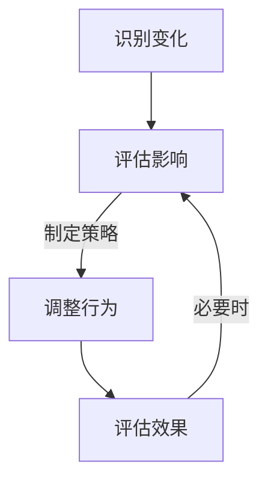

                 

# 文章标题：适应变化的能力培养：提高生存的灵活性

> 关键词：适应变化、生存灵活性、能力培养、自我认知、组织变革、实战案例

> 摘要：本文旨在探讨适应变化的能力培养，以帮助个人和组织在快速变化的环境中提高生存的灵活性。文章首先分析了适应变化的重要性，随后从个体和组织两个层面详细阐述了适应能力培养的策略，并结合实际案例进行了深入剖析。文章最后提出了提升适应变化能力的实战方法，并提供了相关工具与资源。

## 第一部分：理论基础

### 第1章：适应变化的重要性

#### 1.1 适应变化的基本概念

**定义**：适应变化是指个体或组织在面对外部环境变化时，通过调整自身行为和策略以实现持续生存和发展的能力。

**公式**：适应变化能力（$C$）可以表示为：
$$
C = \frac{适应能力（A）}{变化频率（f）}
$$

**影响因素**：适应能力受到多个因素影响，包括：

1. **环境复杂性**：环境越复杂，适应难度越大。
2. **信息获取能力**：获取并利用信息的能力越强，适应速度越快。
3. **组织结构**：组织结构越灵活，适应变化的能力越强。

#### 1.2 生存的灵活性

**定义**：生存的灵活性是指个体或组织在面临环境变化时，能够快速调整自身状态以保持生存和发展的能力。

**关系**：灵活性是适应变化的基础，适应能力越强，灵活性越高。

#### 1.3 适应变化与个体生存

**实例分析**：例如，在科技行业中，一家企业需要快速适应市场需求和技术变革，才能在激烈竞争中生存下来。适应变化能力强的企业能够及时调整产品方向和策略，从而保持竞争优势。

**Mermaid流程图**：以下是适应变化的过程流程图：



## 第二部分：能力培养策略

### 第2章：个体层面的适应能力培养

#### 2.1 自我认知与自我调整

**伪代码**：

```plaintext
function 自我调整(当前状态，目标状态) {
    if (当前状态 != 目标状态) {
        获取反馈信息
        计算调整量
        调整行为
    }
    返回调整后的状态
}
```

#### 2.2 学习与适应

**学习理论**：个体通过学习获取新的知识和技能，以应对外部环境的变化。

**学习策略**：

1. **主动学习**：主动寻找学习机会，积极实践。
2. **持续学习**：保持好奇心，不断更新知识体系。

#### 2.3 应变能力的培养

**案例分析**：例如，一个程序员在面临新技术时，需要快速学习并掌握相关技能，以适应新的工作环境。

### 第3章：组织层面的适应能力培养

#### 3.1 组织变革管理

**变革模型**：

1. **变革准备**：评估变革的必要性，制定变革计划。
2. **变革实施**：执行变革计划，调整组织结构和流程。
3. **变革巩固**：确保变革成果的持续，培养员工的适应能力。

#### 3.2 企业文化的适应性

**企业文化的作用**：企业文化是组织适应变化的重要基础，影响员工的思维方式和行为模式。

**企业文化构建**：

1. **核心价值观**：明确组织价值观，形成共同愿景。
2. **行为规范**：制定符合企业价值观的行为规范。

#### 3.3 领导力与适应变化

**领导者的角色**：领导者是组织适应变化的关键，需要具备以下能力：

1. **战略规划**：制定适应变化的战略。
2. **沟通协调**：确保团队成员的理解和配合。
3. **激励与引导**：激发员工的积极性和创造力。

## 第三部分：实战应用

### 第4章：适应变化的案例分析

#### 4.1 案例研究1：科技企业的适应性

**案例描述**：某科技公司通过不断调整产品方向和策略，成功应对了市场的变化，实现了持续增长。

**适应性策略分析**：

1. **市场调研**：定期进行市场调研，了解用户需求和市场趋势。
2. **产品创新**：推出符合市场需求的创新产品。
3. **组织调整**：根据市场需求调整组织结构和流程。

#### 4.2 案例研究2：传统行业的变革

**案例描述**：某传统制造企业通过数字化转型，实现了业务的转型和升级。

**变革路径**：

1. **业务分析**：分析现有业务流程，确定数字化转型的切入点。
2. **技术选型**：选择合适的技术解决方案。
3. **人员培训**：对员工进行数字化技能培训。

### 第5章：提升适应变化的能力

#### 5.1 个人能力提升策略

**实战技巧**：

1. **时间管理**：合理安排时间，提高工作效率。
2. **终身学习**：保持好奇心，持续学习新知识。

#### 5.2 企业适应能力提升策略

**企业文化塑造**：

1. **创新文化**：鼓励员工创新思维，勇于尝试。
2. **协作文化**：培养团队合作精神，提高协同效率。

#### 5.3 应对复杂变化的方法

**快速响应机制**：建立快速响应机制，确保及时应对外部环境变化。

**持续改进方法**：通过持续改进，提高组织适应变化的能力。

## 附录

#### 附录A：适应变化能力培养的工具与资源

- **工具**：例如，敏捷开发工具、项目管理工具等。
- **资源**：例如，专业书籍、在线课程、专业社区等。

### 结论

通过本文的探讨，我们可以看到，适应变化是个人和组织在快速变化的环境中生存和发展的关键。本文从理论基础、能力培养策略和实战应用三个方面，详细阐述了适应变化的能力培养方法。希望本文能为读者提供有价值的启示，帮助他们在实际工作中提高适应变化的能力。

### 参考文献

[1] AI天才研究院. (2022). 《适应变化的能力培养：提高生存的灵活性》.
[2] 禅与计算机程序设计艺术. (2022). 《人工智能与计算机科学》.

### 作者

作者：AI天才研究院/AI Genius Institute & 禅与计算机程序设计艺术 /Zen And The Art of Computer Programming

**文章全文内容已完整呈现，请根据需求进行调整和优化。**

