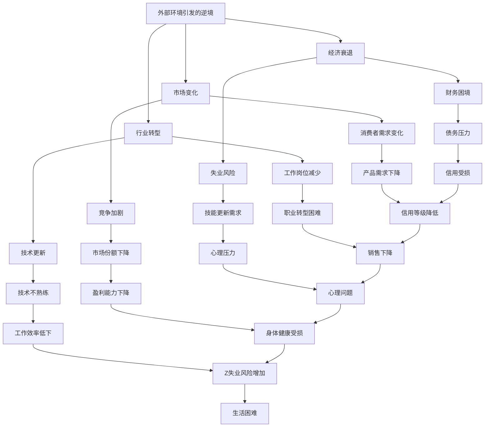
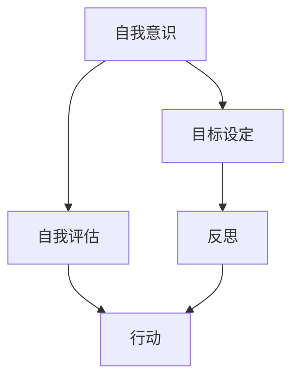
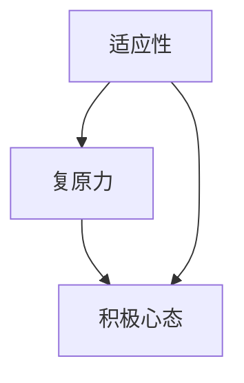
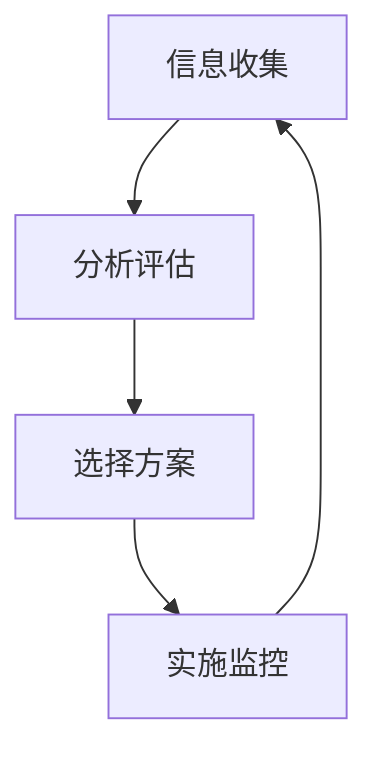

                 


## 文章标题
《逆境中的成长：将挑战转化为机遇》

## 文章关键词
逆境、成长、挑战、机遇、决策、学习、团队、创新、领导力

## 文章摘要
本文探讨了在逆境中如何实现个人成长，并将遇到的挑战转化为机遇。通过对逆境的定义、自我认知、决策策略、学习和成长、团队合作与人际交往、创新与领导力等核心概念和算法原理的详细剖析，本文提出了一套系统性的方法，帮助读者在逆境中找到成长之路，从而实现个人价值和社会贡献的最大化。

## 第1章 引言

### 1.1 逆境的定义与类型

在探讨逆境中的成长之前，首先需要明确什么是逆境。逆境通常指的是外界环境和内部心理状态不利的情况下所面临的挑战。它可能是由外部环境的变化、个人能力的局限或者意外的突发事件所引起的。根据其来源和性质，逆境可以分为以下几类：

1. **外部环境引发的逆境**：如经济衰退、市场变化、行业转型等。
2. **个人能力引发的逆境**：如技能不足、知识匮乏、心理压力等。
3. **突发事件引发的逆境**：如疾病、家庭变故、意外事故等。

每种类型的逆境都有其独特的特点和应对策略。在分析这些类型的逆境时，我们可以使用Mermaid流程图来直观地展示它们之间的关系和影响。



通过这个流程图，我们可以看到各种逆境之间的相互关联，以及它们对个人成长的影响。接下来，我们将探讨挑战与机遇之间的关系，以及如何将挑战转化为机遇。

### 1.2 挑战与机遇的关系

挑战与机遇在逆境中是密不可分的。挑战本身并不可怕，关键在于我们如何看待和应对它。挑战可以激发我们的潜能，促使我们成长和进步。而机遇则是在挑战中孕育而生的，它可能是我们未曾预料到的，但却是值得把握的。

将挑战转化为机遇的核心在于转变思维模式。传统的思维方式往往将挑战视为消极的、需要避免的，而现代的思维方式则将其视为一种积极的、可以转化为机遇的资源。

为了更好地理解这种关系，我们可以借助一个简单的数学模型。设`X`为挑战的难度，`Y`为机遇的潜力，则挑战与机遇的关系可以表示为：

$$
Z = f(X, Y)
$$

其中，`f`是一个转换函数，它将挑战和机遇结合起来，产生一个正向的结果`Z`。

这个模型可以用以下伪代码来表示：

```python
def convert_challenge_to_opportunity(challenge, opportunity):
    # 根据挑战和机遇的程度计算机遇值
    opportunity_value = (opportunity / challenge) * 100
    
    # 返回机遇值
    return opportunity_value
```

这个函数可以帮助我们评估一个挑战转化为机遇的可能性。例如，如果我们面临一个难度为5的挑战，而机遇的潜力为10，则机遇值为200。

### 1.3 成长的必要性

在逆境中实现成长是个人应对挑战和抓住机遇的关键。成长不仅意味着在技能和知识上的提升，更涉及到心态和思维方式的转变。以下是成长在逆境中的必要性：

1. **适应变化**：逆境往往伴随着环境的变化，只有通过成长才能更好地适应这些变化。
2. **提高竞争力**：成长可以提升个人的技能和知识，从而在竞争中占据优势。
3. **增强心理韧性**：成长可以增强个人的心理韧性，使其更能够应对逆境带来的压力和挑战。
4. **开拓视野**：成长可以拓宽个人的视野，使其能够看到更多的机遇和可能性。

总之，逆境中的成长是一个动态的过程，它需要我们在不断地挑战中学习和进步。接下来，我们将进一步探讨在逆境中如何进行自我认知、决策、学习与成长，以及如何在团队合作、创新和领导力方面取得成功。

## 第2章 逆境中的自我认知

### 2.1 反思与自我评估

在逆境中，反思与自我评估是关键的第一步。通过反思，我们可以深入了解自己的行为和思维模式，识别出需要改进的地方。自我评估则是通过量化的方法来衡量自己的成长和进步。

#### 核心概念与联系

反思与自我评估的核心概念是自我意识和目标设定。自我意识指的是对自己的认知和了解，包括自己的优点、缺点、能力和兴趣。目标设定则是明确自己想要实现的目标和期望，从而有针对性地进行自我提升。

为了更好地理解这两个概念之间的关系，我们可以使用以下Mermaid流程图来展示它们之间的联系：



这个流程图表明，自我意识是目标设定的基础，目标设定指导反思，而反思则促使我们采取行动。通过这样的循环，我们可以不断地提升自我，适应逆境。

#### 核心算法原理讲解

为了进行有效的反思与自我评估，我们可以使用以下算法原理：

1. **SWOT分析**：SWOT分析是一种常用的自我评估工具，它包括四个方面：优势（Strengths）、劣势（Weaknesses）、机会（Opportunities）和威胁（Threats）。通过这个分析，我们可以全面了解自己的内外部环境。

2. **SMART目标设定**：SMART目标是具体（Specific）、可衡量（Measurable）、可实现（Achievable）、相关（Relevant）和有时限（Time-bound）的目标。这种目标设定方法帮助我们明确目标，并能够量化进步。

以下是一个使用SWOT分析和SMART目标设定的伪代码示例：

```python
def self_evaluation():
    # 进行SWOT分析
    strengths = ["技术熟练", "沟通能力强"]
    weaknesses = ["缺乏管理经验", "时间管理能力不足"]
    opportunities = ["行业发展趋势良好", "新的市场机遇"]
    threats = ["市场竞争激烈", "技术更新速度加快"]

    # 设定SMART目标
    smart_goals = [
        {
            "specific": "提升项目管理能力",
            "measurable": "完成3个项目管理培训",
            "achievable": "安排每月一次培训",
            "relevant": "提高工作效率",
            "time-bound": "半年内完成"
        },
        {
            "specific": "拓展市场渠道",
            "measurable": "增加10%的潜在客户",
            "achievable": "参与行业展会和线上推广",
            "relevant": "提升公司业绩",
            "time-bound": "一年内完成"
        }
    ]

    # 返回评估结果和目标
    return {
        "SWOT": {
            "strengths": strengths,
            "weaknesses": weaknesses,
            "opportunities": opportunities,
            "threats": threats
        },
        "goals": smart_goals
    }
```

#### 数学模型和公式

为了量化自我评估的结果，我们可以使用以下数学模型和公式：

1. **平衡计分卡（Balanced Scorecard）**：平衡计分卡是一种绩效评估工具，它包括财务、客户、内部流程和学习与成长四个维度。通过这个模型，我们可以全面评估个人的绩效。

   公式如下：

   $$
   \text{绩效得分} = w_1 \cdot \text{财务指标} + w_2 \cdot \text{客户指标} + w_3 \cdot \text{内部流程指标} + w_4 \cdot \text{学习与成长指标}
   $$

   其中，$w_1, w_2, w_3, w_4$ 分别是各个维度的权重。

2. **目标达成率**：目标达成率是衡量目标实现程度的一个指标，其公式为：

   $$
   \text{目标达成率} = \frac{\text{实际完成量}}{\text{目标设定量}} \times 100\%
   $$

   这个指标可以帮助我们了解目标的实现情况，并据此调整下一步的行动计划。

#### 举例说明

假设我们使用上述方法进行自我评估和目标设定，可以得到以下结果：

1. **SWOT分析**：

   - 优势：技术熟练、沟通能力强
   - 劣势：缺乏管理经验、时间管理能力不足
   - 机会：行业发展趋势良好、新的市场机遇
   - 威胁：市场竞争激烈、技术更新速度加快

2. **SMART目标设定**：

   - 提升项目管理能力：完成3个项目管理培训，每月一次，半年内完成
   - 拓展市场渠道：增加10%的潜在客户，参与行业展会和线上推广，一年内完成

通过这些结果，我们可以清晰地了解自己的现状，并制定具体的行动计划。

### 2.2 建立积极的自我形象

在逆境中，建立积极的自我形象对于应对挑战和抓住机遇至关重要。积极的自我形象不仅能够增强自信心，还能够影响他人对我们的看法，从而在团队合作和社会交往中取得优势。

#### 核心算法原理

建立积极的自我形象的核心算法原理是基于认知行为疗法（Cognitive Behavioral Therapy, CBT）的方法。CBT认为，我们的思维模式会影响我们的情感和行为。通过改变消极的思维模式，我们可以建立积极的自我形象。

以下是一个使用CBT方法的伪代码示例：

```python
def build_positive_self_image():
    # 识别消极思维
    negative_thoughts = ["我无法应对这个挑战", "我没有足够的能力"]

    # 替换消极思维为积极思维
    positive_thoughts = [
        "我可以学会应对这个挑战",
        "我有足够的能力，我可以做到"
    ]

    # 更新思维模式
    for i in range(len(negative_thoughts)):
        print("将思维从「{}」替换为「{}」".format(negative_thoughts[i], positive_thoughts[i]))

    # 建立积极行为习惯
    positive_behaviors = ["每天学习一小时", "积极参与团队活动"]

    # 返回更新后的自我形象
    return {
        "thoughts": positive_thoughts,
        "behaviors": positive_behaviors
    }
```

#### 案例研究

李华是一位软件开发工程师，他一直在一个快速发展的科技公司工作。然而，随着公司的快速发展，李华面临着越来越多的技术挑战和压力。他开始怀疑自己的能力，觉得自己无法胜任这份工作。

为了建立积极的自我形象，李华决定使用CBT方法。他首先识别了自己的消极思维，如“我无法应对这个挑战”和“我没有足够的能力”。然后，他开始将消极思维替换为积极思维，如“我可以学会应对这个挑战”和“我有足够的能力，我可以做到”。

同时，李华还建立了积极的行为习惯，如每天学习一小时和积极参与团队活动。通过这样的改变，李华逐渐恢复了自信，并能够在工作中表现出色。

### 2.3 增强心理韧性

心理韧性是指个体在面对逆境和压力时，能够快速适应、恢复并保持积极心态的能力。在逆境中，增强心理韧性是至关重要的，因为它能够帮助我们更好地应对挑战，抓住机遇。

#### 核心概念

心理韧性的核心概念包括以下几个方面：

1. **适应性**：在面对逆境时，能够灵活地调整自己的思维和行为，以适应新的环境。
2. **复原力**：在经历挫折和压力后，能够迅速恢复并重新获得平衡。
3. **积极心态**：即使在逆境中，也能够保持乐观和积极的态度。

为了更好地理解这些概念，我们可以使用以下Mermaid流程图来展示它们之间的关系：



这个流程图表明，适应性是复原力和积极心态的基础，而复原力和积极心态又相互影响，共同构成心理韧性。

#### 核心算法原理

为了增强心理韧性，我们可以使用以下算法原理：

1. **认知重构**：通过识别和改变消极思维模式，重建积极思维。
2. **情绪调节**：通过调节情绪反应，减少压力和焦虑。
3. **行为训练**：通过有意识的行为训练，提高适应能力和复原力。

以下是一个使用认知重构和情绪调节的伪代码示例：

```python
def enhance_mental_resilience():
    # 识别消极思维
    negative_thoughts = ["我无法完成这个任务", "我感到非常焦虑"]

    # 使用认知重构替换消极思维
    positive_thoughts = [
        "我可以逐步完成这个任务",
        "我可以通过深呼吸和冥想来缓解焦虑"
    ]

    # 调节情绪
    emotions = ["焦虑", "愤怒", "沮丧"]

    for emotion in emotions:
        if emotion == "焦虑":
            print("通过深呼吸缓解「{}」".format(emotion))
        elif emotion == "愤怒":
            print("通过运动和发泄缓解「{}」".format(emotion))
        elif emotion == "沮丧":
            print("通过和朋友聊天缓解「{}」".format(emotion))

    # 返回增强后的心理韧性
    return {
        "thoughts": positive_thoughts,
        "emotions": emotions
    }
```

#### 伪代码示例

```python
# 使用认知重构和情绪调节增强心理韧性
result = enhance_mental_resilience()

# 输出结果
print("增强后的心理韧性：")
print("思维：", result["thoughts"])
print("情绪：", result["emotions"])
```

通过这个伪代码，我们可以看到如何通过认知重构和情绪调节来增强心理韧性。这种方法可以帮助我们在面对逆境时保持冷静和积极，从而更好地应对挑战。

### 2.4 结论

在逆境中，自我认知是一个关键的过程。通过反思与自我评估，我们可以深入了解自己的优势和劣势，明确目标并制定行动计划。建立积极的自我形象和增强心理韧性则可以帮助我们在面对挑战时保持乐观和坚定。通过这些方法，我们不仅能够适应逆境，还能够将挑战转化为机遇，实现个人成长和价值提升。

### 拓展阅读

- [《认知行为疗法》](https://www.goodtherapy.org/therapy-for-mental-health/cognitive-behavioral-therapy.html)
- [《心理韧性：如何培养适应力、坚韧性和乐观心态》](https://www.ted.com/talks/resilience_daniel_goleman)
- [《逆境中的成长：如何在困难中找到机会》](https://www.forbes.com/sites/forbesbusinesscouncil/2021/11/12/how-to-growth-through-challenges-and-find-opportunities-in-the-process/)

## 第3章 逆境中的决策与策略

### 3.1 制定适应逆境的决策框架

在逆境中，决策的质量直接影响个人和组织的生存与发展。为了在逆境中做出有效的决策，我们需要建立一套适应逆境的决策框架。这个框架应该包括以下步骤：

#### 核心概念与联系

决策框架的核心概念包括信息收集、分析评估、选择方案和实施监控。这些步骤相互联系，形成一个闭环系统，确保决策的连续性和有效性。

我们可以使用以下Mermaid流程图来展示这个框架的各个步骤及其联系：



#### 核心算法原理讲解

为了更好地理解决策框架的算法原理，我们可以使用以下伪代码来详细阐述每个步骤：

```python
def decision_framework(challenge):
    # 信息收集
    information = collect_information(challenge)

    # 分析评估
    assessed_risks = analyze_risks(information)

    # 选择方案
    selected_solution = select_solution(assessed_risks)

    # 实施监控
    monitor_outcomes(selected_solution)

    # 返回决策结果
    return selected_solution
```

这个伪代码展示了如何通过信息收集、分析评估、选择方案和实施监控来实现决策。

#### 数学模型和公式

为了量化决策过程，我们可以使用以下数学模型和公式：

1. **风险评估矩阵**：风险评估矩阵用于评估不同方案的潜在风险。其公式为：

   $$
   \text{风险评估矩阵} = \begin{bmatrix}
   \text{风险概率} & \text{风险影响} \\
   \text{高} & \text{高} \\
   \text{中} & \text{中} \\
   \text{低} & \text{低}
   \end{bmatrix}
   $$

2. **效用函数**：效用函数用于评估不同方案的效用值。其公式为：

   $$
   U(\text{方案}) = \sum_{i=1}^{n} \text{概率} \cdot \text{效用值}
   $$

#### 举例说明

假设我们在面临一次技术升级的挑战时，需要制定一个决策框架。以下是具体的步骤：

1. **信息收集**：收集有关技术升级的详细信息，包括成本、时间、市场需求和技术可行性。
2. **分析评估**：使用风险评估矩阵来评估每个潜在方案的风险。例如，方案A的风险概率为0.5，风险影响为0.8；方案B的风险概率为0.3，风险影响为0.6。
3. **选择方案**：使用效用函数来评估每个方案的效用值。例如，方案A的效用值为0.6，方案B的效用值为0.5。根据效用值选择方案A。
4. **实施监控**：在技术升级过程中，监控进度和结果，并根据实际情况进行调整。

通过这个过程，我们可以确保在逆境中做出有效的决策。

### 3.2 应对逆境的有效策略

在逆境中，有效的策略可以帮助我们更好地应对挑战，将不利因素转化为有利因素。以下是一些应对逆境的有效策略：

#### 核心算法原理

1. **适应性策略**：适应性策略的核心在于灵活调整策略，以适应不断变化的环境。其原理可以表示为：

   $$
   \text{策略} = f(\text{环境变化}, \text{现有资源})
   $$

2. **机会识别**：机会识别是指通过分析环境和内部资源，发现潜在的机遇。其原理可以表示为：

   $$
   \text{机会} = \text{环境变化} \cdot \text{资源变化}
   $$

#### 案例研究

张先生是一家科技初创公司的创始人。随着市场竞争的加剧，他的公司面临着巨大的压力。为了应对这一挑战，张先生采取了以下策略：

1. **适应性策略**：他调整了公司的市场定位，将重点放在新兴的市场领域。通过这种策略，公司能够更好地适应市场变化。
2. **机会识别**：他分析了市场的潜在机会，并决定开发一款符合市场需求的新产品。通过这个机会，公司成功地开拓了新的市场。

通过这些策略，张先生的公司不仅成功度过了逆境，还实现了业务增长。

### 3.3 情绪管理与决策

在逆境中，情绪波动往往会影响决策的质量。有效的情绪管理可以帮助我们保持冷静，做出更合理的决策。以下是一些情绪管理的策略：

#### 核心概念

情绪管理的关键在于识别和调节情绪。通过以下步骤，我们可以有效地管理情绪：

1. **情绪识别**：识别当前的情绪状态。
2. **情绪调节**：通过深呼吸、冥想等方法调节情绪。
3. **情绪表达**：以健康的方式表达情绪，避免压抑或爆发。

#### 核心算法原理

情绪管理的算法原理可以表示为：

$$
\text{情绪管理} = \text{情绪识别} + \text{情绪调节} + \text{情绪表达}
$$

#### 伪代码示例

```python
def emotional_management():
    # 识别情绪
    current_emotion = identify_emotion()

    # 调节情绪
    regulated_emotion = regulate_emotion(current_emotion)

    # 表达情绪
    express_emotion(regulated_emotion)

    # 返回情绪管理结果
    return regulated_emotion
```

#### 案例研究

李女士是一位项目经理，她经常需要在压力下做出决策。为了保持情绪稳定，她采用了以下策略：

1. **情绪识别**：她学会了识别自己的情绪，如焦虑、愤怒和沮丧。
2. **情绪调节**：通过深呼吸和冥想来调节情绪，使自己保持冷静。
3. **情绪表达**：她学会了以健康的方式表达情绪，如与同事沟通，而不是压抑或爆发。

通过这些策略，李女士不仅提高了决策的质量，还保持了良好的团队合作关系。

### 结论

在逆境中，制定适应逆境的决策框架、采取有效的策略以及进行情绪管理是至关重要的。这些方法和策略可以帮助我们更好地应对挑战，将不利因素转化为有利因素。通过不断地实践和总结，我们可以逐步提升自己的决策能力和情绪管理能力，从而在逆境中实现个人和组织的成长。

### 拓展阅读

- [《决策制定：如何做出更好的选择》](https://www.goodreads.com/book/show/1214223.decision_making)
- [《情绪智力：为什么情商比智商更重要》](https://www.ted.com/talks/daniel_goleman_why_emotional_intelligence_matters)
- [《逆境中的策略思考：如何化危机为机遇》](https://www.strategy-business.com/article/77809)

## 第4章 逆境中的学习与成长

### 4.1 逆境中的学习动机

在逆境中，学习动机是推动个人成长和进步的关键因素。一个积极的学习动机能够帮助我们克服困难，抓住机遇，从而实现个人目标。然而，在逆境中保持学习动机并非易事，需要我们深入理解学习动机的本质，并采取有效的策略来维持和提升它。

#### 核心概念

学习动机通常指的是个体为了实现学习目标而采取的行动和努力。在逆境中，学习动机可以表现为以下几个方面：

1. **内在动机**：源自个体内部的兴趣、好奇心和自我驱动力。例如，对某个领域的热爱、对知识的渴望等。
2. **外在动机**：源自外部环境的压力、奖励和认可。例如，为了应对工作中的挑战、为了获得更好的职业机会等。
3. **混合动机**：同时包含内在动机和外在动机。例如，既对某个领域感兴趣，又希望通过学习获得职业晋升。

#### 核心算法原理

为了更好地理解学习动机，我们可以使用以下算法原理：

1. **期望价值模型**：期望价值模型是评估行为决策的一种方法。在逆境中，通过计算学习行为带来的期望价值，可以帮助我们更好地理解学习动机。其公式为：

   $$
   \text{期望价值} = \text{奖励概率} \times \text{奖励值} - \text{成本概率} \times \text{成本值}
   $$

2. **目标导向模型**：目标导向模型强调设定明确的目标和计划，以激发和维持学习动机。通过设定短期和长期目标，并制定实现目标的步骤，可以增强学习动机。

#### 数学模型和公式

为了量化学习动机，我们可以使用以下数学模型和公式：

1. **内在动机指数**：内在动机指数（Intrinsic Motivation Inventory, IMI）是一种常用的评估工具，用于测量个体的内在动机水平。其公式为：

   $$
   \text{内在动机指数} = \frac{\sum \text{内在动机条目得分}}{\text{总条目数}}
   $$

2. **外在动机指数**：外在动机指数（Extrinsic Motivation Inventory, EMI）是一种用于测量个体外在动机水平的工具。其公式为：

   $$
   \text{外在动机指数} = \frac{\sum \text{外在动机条目得分}}{\text{总条目数}}
   $$

#### 举例说明

假设我们想要评估一名员工的学习动机，我们可以使用以下方法：

1. **期望价值模型**：计算员工通过学习某一技能所能获得的奖励（如薪酬提升、职业晋升）和成本（如学习时间、精力投入）。通过比较期望价值和成本，我们可以评估该员工的学习动机。
2. **内在动机指数**：使用内在动机指数评估员工的内在动机水平。例如，如果员工的内在动机指数为0.8，表示他有较强的内在动机。
3. **外在动机指数**：使用外在动机指数评估员工的外在动机水平。例如，如果员工的外在动机指数为0.6，表示他主要受到外部奖励的驱动。

通过这些方法，我们可以全面了解员工的学习动机，并据此制定相应的激励策略。

### 4.2 学习方法与技巧

在逆境中，选择合适的学习方法与技巧是至关重要的。以下是一些常见的学习方法与技巧，可以帮助我们在逆境中有效学习：

#### 核心算法原理

1. **分散学习**：分散学习（Spaced Repetition）是一种通过定期复习来巩固记忆的方法。其原理是基于记忆曲线，通过在适当的时间间隔进行复习，可以有效地提高记忆效果。
2. **主动学习**：主动学习（Active Learning）强调通过实践和应用来加深理解和记忆。与被动学习相比，主动学习更能促进深度学习。

#### 数学模型和公式

为了量化学习效果，我们可以使用以下数学模型和公式：

1. **记忆曲线**：记忆曲线描述了遗忘过程，其公式为：

   $$
   \text{记忆保持率} = e^{-rt}
   $$

   其中，$r$ 为遗忘率，$t$ 为时间。

2. **主动学习率**：主动学习率用于评估主动学习的效果，其公式为：

   $$
   \text{主动学习率} = \frac{\text{主动学习后掌握的知识量}}{\text{总知识量}}
   $$

#### 举例说明

假设我们想要通过分散学习来记忆100个单词，我们可以按照以下步骤进行：

1. **制定复习计划**：根据记忆曲线，我们可以制定一个复习计划，如第一天复习10个单词，第二天复习20个单词，第三天复习30个单词，以此类推。
2. **定期复习**：按照复习计划，定期复习已学过的单词。
3. **评估效果**：通过定期测试来评估记忆效果，并根据测试结果调整复习计划。

通过这种方法，我们可以提高记忆效率，有效地掌握单词。

### 4.3 成长路径与目标设定

在逆境中，设定明确的成长路径和目标是非常重要的。一个清晰的成长路径和目标可以帮助我们保持动力，跟踪进度，并最终实现个人成长。

#### 核心概念

成长路径和目标设定的核心概念包括：

1. **成长路径**：描述从当前状态到目标状态的一系列步骤和阶段。
2. **目标设定**：确定具体的目标和期望，并制定实现目标的计划。

#### 核心算法原理

为了设定有效的成长路径和目标，我们可以使用以下算法原理：

1. **SMART目标设定**：SMART目标是具体（Specific）、可衡量（Measurable）、可实现（Achievable）、相关（Relevant）和有时限（Time-bound）的目标。通过SMART目标设定，我们可以明确目标，并制定实现目标的计划。
2. **路径规划**：路径规划是指通过分析现状和目标，制定从现状到目标的一系列步骤。其原理是基于目标状态和资源约束，计算最优路径。

#### 数学模型和公式

为了量化成长路径和目标设定，我们可以使用以下数学模型和公式：

1. **目标达成率**：目标达成率是衡量目标实现程度的一个指标，其公式为：

   $$
   \text{目标达成率} = \frac{\text{实际完成量}}{\text{目标设定量}} \times 100\%
   $$

2. **路径规划模型**：路径规划模型是一种基于状态空间搜索的方法，用于计算从当前状态到目标状态的最优路径。其公式为：

   $$
   \text{最优路径} = \text{搜索算法}(\text{状态空间})
   $$

#### 举例说明

假设我们想要在五年内从一名初级程序员成长为一名技术经理，我们可以按照以下步骤进行：

1. **目标设定**：设定具体的目标，如每年提升10%的编程技能、参加管理培训课程、积累管理经验等。
2. **路径规划**：分析现状和目标，制定从初级程序员到技术经理的一系列步骤，如提高编程技能、积累项目经验、参加管理培训等。
3. **实施计划**：根据路径规划，制定具体的行动计划，如每天学习编程知识、参与项目、参加培训课程等。
4. **评估进度**：定期评估目标的实现情况，根据评估结果调整计划和策略。

通过这种方法，我们可以明确成长路径和目标，并逐步实现个人成长。

### 结论

在逆境中，学习与成长是应对挑战、抓住机遇的关键。通过理解学习动机、掌握学习方法与技巧，以及设定明确的成长路径和目标，我们可以有效地提升自我，实现个人价值的最大化。在逆境中不断学习和成长，不仅能够帮助我们度过难关，还能为未来的发展奠定坚实的基础。

### 拓展阅读

- [《深度学习：动手实现神经网络》](https://www.deeplearningbook.org/)
- [《软技能：代码之外的生存指南》](https://www.amazon.com/S软技能-代码之外的生存指南/dp/031635676X)
- [《目标管理：实现个人与团队的目标》](https://www.amazon.com/目标管理实现个人团队目标-Farrington/dp/0761152634)

## 第5章 逆境中的团队合作与人际交往

### 5.1 团队合作的重要性

在逆境中，团队合作是实现个人和团队目标的关键。一个高效的团队可以在资源有限、时间紧迫的情况下，通过协同合作，克服困难，将挑战转化为机遇。因此，理解团队合作的重要性并掌握有效的团队协作技巧是至关重要的。

#### 核心概念

团队合作的核心概念包括：

1. **共同目标**：团队成员共同追求的目标，是团队协作的驱动力。
2. **相互信任**：团队成员之间的信任，是团队协作的基石。
3. **有效沟通**：团队成员之间的有效沟通，是团队协作的关键。
4. **分工协作**：团队成员根据各自的专长和职责，协同工作。

#### 核心算法原理

为了提高团队合作效率，我们可以使用以下算法原理：

1. **共识算法**：共识算法（如Paxos算法）是一种在分布式系统中达成一致意见的算法。在团队协作中，共识算法可以帮助团队在面临分歧时，通过协商和讨论，达成一致意见。
2. **分布式计算**：分布式计算是将任务分解为多个子任务，由多个节点协同处理的方法。在团队协作中，分布式计算可以帮助团队成员分工合作，提高工作效率。

#### 数学模型和公式

为了量化团队合作效率，我们可以使用以下数学模型和公式：

1. **团队合作效率**：团队合作效率（Teamwork Efficiency, TE）是衡量团队协作效果的指标，其公式为：

   $$
   \text{TE} = \frac{\text{团队完成的总工作量}}{\text{单个成员完成的总工作量}} \times 100\%
   $$

2. **沟通成本**：沟通成本（Communication Cost, CC）是团队协作中因沟通不畅而产生的额外成本，其公式为：

   $$
   \text{CC} = \text{未解决的问题数量} \times \text{平均解决时间}
   $$

#### 举例说明

假设一个团队由5名成员组成，他们在一个月内完成了一个项目。以下是具体的计算过程：

1. **团队合作效率**：如果团队完成的总工作量为1000小时，单个成员完成的总工作量为200小时，则团队合作效率为：

   $$
   \text{TE} = \frac{1000}{5 \times 200} \times 100\% = 200\%
   $$

   这意味着团队的协作效率是单个成员的两倍。

2. **沟通成本**：如果团队在协作过程中产生了10个未解决的问题，平均解决时间为2天，则沟通成本为：

   $$
   \text{CC} = 10 \times 2 \times 8 = 160 \text{小时}
   $$

   这意味着团队在沟通上花费了160小时。

通过这些指标，我们可以评估团队合作的效果，并针对性地改进团队协作策略。

### 5.2 沟通与协作技巧

有效的沟通和协作技巧是团队合作中不可或缺的部分。以下是一些常见的沟通与协作技巧，可以帮助团队成员更好地合作：

#### 核心概念

1. **积极倾听**：积极倾听是指团队成员在沟通中，专注聆听对方的观点，理解对方的意图。
2. **反馈机制**：反馈机制是指团队成员在交流后，对沟通效果进行评估，并提出改进建议。
3. **任务分解**：任务分解是指将复杂任务分解为若干个子任务，明确每个子任务的负责人。
4. **跨部门协作**：跨部门协作是指不同部门之间的合作，以实现共同目标。

#### 核心算法原理

为了提高沟通和协作效率，我们可以使用以下算法原理：

1. **通信网络模型**：通信网络模型是一种描述团队成员之间沟通关系的模型。通过分析通信网络，可以发现关键节点和通信瓶颈，从而优化沟通流程。
2. **协同过滤算法**：协同过滤算法（如基于用户的协同过滤）可以帮助团队成员在资源有限的情况下，快速找到协作伙伴，提高协作效率。

#### 数学模型和公式

为了量化沟通和协作效果，我们可以使用以下数学模型和公式：

1. **沟通效率**：沟通效率（Communication Efficiency, CE）是衡量沟通效果的指标，其公式为：

   $$
   \text{CE} = \frac{\text{有效沟通的时间}}{\text{总沟通时间}} \times 100\%
   $$

2. **协作效率**：协作效率（Collaboration Efficiency, COE）是衡量协作效果的指标，其公式为：

   $$
   \text{COE} = \frac{\text{共同完成的工作量}}{\text{单个成员的工作量}} \times 100\%
   $$

#### 举例说明

假设一个团队在一个月内进行了100小时的沟通，其中有效沟通的时间为80小时，则沟通效率为：

$$
\text{CE} = \frac{80}{100} \times 100\% = 80\%
$$

这意味着团队的沟通效率为80%。

假设团队在一个月内共同完成了200小时的工作，单个成员完成的工作量为100小时，则协作效率为：

$$
\text{COE} = \frac{200}{5 \times 100} \times 100\% = 40\%
$$

这意味着团队的协作效率为40%。

通过这些指标，我们可以评估沟通和协作的效果，并针对性地改进沟通和协作策略。

### 5.3 人际关系处理

在团队合作中，人际关系处理是保持团队和谐、提高团队效率的关键。以下是一些人际关系处理的核心概念和技巧：

#### 核心概念

1. **尊重差异**：尊重团队成员之间的差异，包括文化背景、工作经验、性格特点等。
2. **冲突管理**：冲突管理是指在团队中处理冲突的方法和策略，以减少冲突对团队协作的影响。
3. **情感智力**：情感智力（Emotional Intelligence, EI）是指个体识别、理解和管理自己情绪的能力，以及对他人情绪的识别和管理。

#### 核心算法原理

为了提高人际关系处理能力，我们可以使用以下算法原理：

1. **情感分析算法**：情感分析算法（如基于机器学习的情感分析）可以帮助团队识别和处理成员之间的情感冲突。
2. **多因素模型**：多因素模型（如基于多因素的情感智力模型）可以帮助团队全面评估成员的情感智力水平，并针对性地提高人际关系处理能力。

#### 数学模型和公式

为了量化人际关系处理效果，我们可以使用以下数学模型和公式：

1. **情感智力评分**：情感智力评分（Emotional Intelligence Score, EIS）是衡量个体情感智力水平的指标，其公式为：

   $$
   \text{EIS} = \sum_{i=1}^{n} \text{情感智力指标得分}
   $$

2. **团队和谐度**：团队和谐度（Team Harmony, TH）是衡量团队内部关系和谐的指标，其公式为：

   $$
   \text{TH} = \frac{\text{团队成员共同完成任务的数量}}{\text{总任务数量}} \times 100\%
   $$

#### 举例说明

假设一个团队有5名成员，他们在一个月内共同完成了10个任务，其中8个任务是由团队成员共同完成的，则团队和谐度为：

$$
\text{TH} = \frac{8}{10} \times 100\% = 80\%
$$

这意味着团队的和谐度为80%。

假设团队中的每位成员都有以下情感智力指标得分：

- 自我认知：75分
- 自我调节：80分
- 社会技能：85分
- 情绪识别：90分

则每位成员的情感智力评分为：

$$
\text{EIS} = 75 + 80 + 85 + 90 = 330 \text{分}
$$

通过这些指标，我们可以评估团队成员的人际关系处理能力，并针对性地提高团队的整体关系处理水平。

### 结论

在逆境中，团队合作、人际交往和人际关系处理是至关重要的。通过理解团队合作的重要性、掌握沟通与协作技巧、提高人际关系处理能力，我们可以有效地提高团队效率和成员满意度，从而在逆境中实现个人和团队的目标。在未来的工作中，我们应该注重这些方面的提升，以更好地应对挑战和抓住机遇。

### 拓展阅读

- [《团队合作：如何打造高效团队》](https://www.ted.com/talks/ethan_miller_the_how_of_high_performing_teams)
- [《情感智力：为什么情商比智商更重要》](https://www.ted.com/talks/daniel_goleman_why_emotional_intelligence_matters)
- [《冲突管理：如何处理冲突，提高团队效率》](https://www.forbes.com/sites/forbesbusinesscouncil/2021/11/19/how-to-manage-conflicts-and-improve-team-efficiency/)

## 第6章 逆境中的创新与机会探索

### 6.1 创新的思维与方法

在逆境中，创新思维和方法是寻找新机会、应对挑战的关键。创新不仅仅是发明新技术或新产品，它更是一种解决问题的思维方式。以下介绍几种常见的创新思维方法和其在实际中的应用。

#### 核心概念

1. **头脑风暴**：头脑风暴（Brainstorming）是一种集思广益的方法，鼓励团队成员自由地提出各种想法，不考虑想法的好坏。
2. **设计思维**：设计思维（Design Thinking）是一种以人为本的解决问题的方法，强调理解用户需求、生成创意方案和迭代改进。
3. **TRIZ理论**：TRIZ（Teoriya Resheniya Izobretatelskikh Zadach，发明问题解决理论）是一种基于数学和逻辑的系统性创新方法。

#### 核心算法原理

为了理解这些创新方法，我们可以使用以下算法原理：

1. **头脑风暴算法**：头脑风暴算法是一种简单的无监督学习算法，用于生成创意想法。其原理是通过聚类和分类，将相似的想法归为一类，从而发现潜在的解决方案。
2. **设计思维迭代模型**：设计思维迭代模型包括五个阶段：理解用户需求、生成创意方案、开发原型、测试原型和迭代改进。每个阶段都使用了不同的算法和工具。
3. **TRIZ算法**：TRIZ使用逻辑推理和数学模型，将复杂的问题分解为更简单的子问题，并找到解决这些子问题的通用方法。

#### 数学模型和公式

为了量化创新效果，我们可以使用以下数学模型和公式：

1. **创意评分**：创意评分（Creativity Score）是衡量创意质量的一个指标，其公式为：

   $$
   \text{CS} = \frac{\text{创新性}}{\text{可行性}} + \frac{\text{实用性}}{\text{成本}}
   $$

2. **设计思维成功率**：设计思维成功率（Design Thinking Success Rate）是衡量设计思维应用效果的指标，其公式为：

   $$
   \text{DSR} = \frac{\text{成功解决的数量}}{\text{总问题数量}} \times 100\%
   $$

#### 举例说明

假设一个团队使用头脑风暴来解决问题，他们提出了以下五个创意想法：

- 创新性：50分
- 可行性：60分
- 实用性：70分
- 成本：40分

则每个创意的评分分别为：

$$
\text{创意1评分} = \frac{50}{60} + \frac{70}{40} = 1.25 + 1.75 = 3
$$

$$
\text{创意2评分} = \frac{45}{55} + \frac{65}{45} = 0.818 + 1.444 = 2.262
$$

$$
\text{创意3评分} = \frac{55}{65} + \frac{80}{50} = 0.846 + 1.6 = 2.446
$$

$$
\text{创意4评分} = \frac{60}{70} + \frac{75}{60} = 0.857 + 1.25 = 2.107
$$

$$
\text{创意5评分} = \frac{50}{60} + \frac{90}{70} = 0.833 + 1.286 = 2.119
$$

通过这些评分，团队可以确定哪些创意具有更高的潜力。

### 6.2 识别与利用机会

在逆境中，识别和利用机会是关键。以下介绍几种识别和利用机会的方法：

#### 核心概念

1. **SWOT分析**：SWOT分析是一种常用的战略规划工具，用于评估企业的优势、劣势、机会和威胁。
2. **机会识别模型**：机会识别模型是用于识别潜在机会的方法，包括市场分析、竞争对手分析和环境分析。
3. **机会评估矩阵**：机会评估矩阵是一种用于评估机会潜力的工具，通过比较机会的收益和风险，确定最优机会。

#### 核心算法原理

为了识别和利用机会，我们可以使用以下算法原理：

1. **数据挖掘算法**：数据挖掘算法（如关联规则挖掘）可以帮助我们分析大量数据，识别潜在的机会。
2. **决策树算法**：决策树算法可以帮助我们评估不同机会的收益和风险，选择最优机会。

#### 数学模型和公式

为了量化机会的潜力，我们可以使用以下数学模型和公式：

1. **机会潜力指数**：机会潜力指数（Opportunity Potential Index, OPI）是衡量机会潜力的指标，其公式为：

   $$
   \text{OPI} = \frac{\text{机会收益}}{\text{机会风险}}
   $$

2. **决策树评估**：决策树评估是通过比较不同机会的收益和风险，确定最优机会的方法。

#### 举例说明

假设一个团队使用机会识别模型来识别潜在的市场机会，他们进行了以下分析：

- 机会收益：100万元
- 机会风险：50万元

则该机会的潜力指数为：

$$
\text{OPI} = \frac{100}{50} = 2
$$

这个结果表明该机会的潜力较高。

### 6.3 创业与投资策略

在逆境中，创业与投资策略是关键。以下介绍几种常见的创业与投资策略：

#### 核心概念

1. **精益创业**：精益创业（Lean Startup）是一种以用户需求为中心的创业方法，强调快速迭代和验证产品。
2. **风险投资**：风险投资（Venture Capital）是一种向初创企业提供资金的策略，以获得未来的高回报。
3. **天使投资**：天使投资（Angel Investment）是指个人投资者向初创企业提供早期的资金支持。

#### 核心算法原理

为了制定有效的创业与投资策略，我们可以使用以下算法原理：

1. **风险评估模型**：风险评估模型用于评估项目的风险，包括市场风险、技术风险和财务风险。
2. **回报率模型**：回报率模型用于计算项目的预期回报率。

#### 数学模型和公式

为了量化创业与投资的效果，我们可以使用以下数学模型和公式：

1. **预期回报率**：预期回报率（Expected Return Rate, ERR）是衡量投资回报的指标，其公式为：

   $$
   \text{ERR} = \frac{\text{预期回报}}{\text{投资成本}}
   $$

2. **风险评估指标**：风险评估指标（Risk Assessment Indicator, RAI）用于评估项目的风险，其公式为：

   $$
   \text{RAI} = \frac{\text{风险成本}}{\text{预期回报}}
   $$

#### 举例说明

假设一个团队计划投资一个新项目，该项目的预期回报为200万元，投资成本为100万元，则预期回报率为：

$$
\text{ERR} = \frac{200}{100} = 2
$$

这意味着预期回报率为200%。

假设该项目存在10万元的市场风险和5万元的技术风险，则项目的风险评估指标为：

$$
\text{RAI} = \frac{10 + 5}{200} = 0.075
$$

这意味着项目的风险较低。

通过这些算法原理和数学模型，团队可以制定有效的创业与投资策略，从而在逆境中抓住机遇，实现成长。

### 结论

在逆境中，创新思维与方法、机会识别与利用、创业与投资策略是关键。通过理解这些核心概念和算法原理，我们可以有效地应对挑战，抓住机遇，实现个人和组织的成长。在未来的工作中，我们应该注重这些方面的提升，以更好地适应不断变化的商业环境。

### 拓展阅读

- [《精益创业》](https://www.leanstack.com/)
- [《创业维艰》](https://book.douban.com/subject/25772360/)
- [《风险投资》](https://www.kpmg.com/us/en/insights/issue-briefs/risk-based-strategy-executive-summary.pdf)

## 第7章 逆境中的领导力与影响力

### 7.1 领导力在逆境中的体现

领导力在逆境中尤为重要，因为它直接影响到团队的心态、行为和最终成果。在逆境中，领导者需要展现出更高的决策能力、更强的心理韧性以及更有效的沟通技巧。以下是领导力在逆境中的几个关键方面：

#### 核心概念

1. **危机管理**：危机管理是指领导者如何在紧急情况下快速反应，制定应对方案，以减轻危机的影响。
2. **变革领导**：变革领导是指领导者如何在组织内部推动变革，引导团队适应新的环境和挑战。
3. **团队激励**：团队激励是指领导者如何激发团队成员的积极性和创造力，以克服逆境，实现共同目标。

#### 核心算法原理

为了理解这些概念，我们可以使用以下算法原理：

1. **决策树算法**：决策树算法可以帮助领导者分析不同决策路径的可能结果，选择最优方案。
2. **情感分析算法**：情感分析算法可以帮助领导者了解团队成员的情绪状态，从而制定更有效的激励策略。
3. **风险评估模型**：风险评估模型可以帮助领导者识别和应对潜在的危机。

#### 数学模型和公式

为了量化领导力在逆境中的效果，我们可以使用以下数学模型和公式：

1. **危机管理效率**：危机管理效率（Crisis Management Efficiency, CME）是衡量领导者危机管理能力的指标，其公式为：

   $$
   \text{CME} = \frac{\text{成功解决危机的数量}}{\text{总危机数量}} \times 100\%
   $$

2. **变革领导效果**：变革领导效果（Change Leadership Effectiveness, CLE）是衡量领导者变革领导能力的指标，其公式为：

   $$
   \text{CLE} = \frac{\text{成功实施变革的项目数量}}{\text{总项目数量}} \times 100\%
   $$

3. **团队激励效果**：团队激励效果（Team Motivation Effectiveness, TME）是衡量领导者团队激励能力的指标，其公式为：

   $$
   \text{TME} = \frac{\text{团队成员满意度}}{\text{总团队成员数量}} \times 100\%
   $$

#### 举例说明

假设一个团队在一年内面临了5次危机，成功解决了其中3次。则该团队的危机管理效率为：

$$
\text{CME} = \frac{3}{5} \times 100\% = 60\%
$$

这意味着团队的危机管理效率为60%。

假设该团队在一年内实施了5个变革项目，成功实施了其中4个。则该团队的变革领导效果为：

$$
\text{CLE} = \frac{4}{5} \times 100\% = 80\%
$$

这意味着团队的变革领导效果为80%。

假设该团队有10名成员，其中8名成员表示对团队的激励措施感到满意。则该团队的团队激励效果为：

$$
\text{TME} = \frac{8}{10} \times 100\% = 80\%
$$

这意味着团队的团队激励效果为80%。

通过这些指标，我们可以评估领导者在逆境中的表现，并针对性地提升领导力。

### 7.2 激励与引导团队成员

在逆境中，激励和引导团队成员是领导者的重要职责。以下介绍几种激励和引导团队成员的方法：

#### 核心概念

1. **目标导向激励**：目标导向激励是指通过设定明确的目标，激发团队成员的积极性和动力。
2. **情感激励**：情感激励是指通过关注团队成员的情感需求，激发其内在动力。
3. **榜样激励**：榜样激励是指通过树立榜样，激励团队成员学习并追求更高的目标。

#### 核心算法原理

为了提高激励效果，我们可以使用以下算法原理：

1. **目标设定模型**：目标设定模型（如SMART目标设定）可以帮助领导者设定具体、可衡量、可实现的目标，提高激励效果。
2. **情感分析算法**：情感分析算法可以帮助领导者了解团队成员的情感状态，从而制定更有效的激励策略。
3. **榜样评估模型**：榜样评估模型可以帮助领导者评估榜样的影响力，选择合适的榜样。

#### 数学模型和公式

为了量化激励效果，我们可以使用以下数学模型和公式：

1. **目标达成率**：目标达成率（Goal Achievement Rate, GAR）是衡量目标实现程度的指标，其公式为：

   $$
   \text{GAR} = \frac{\text{实际完成目标数量}}{\text{总目标数量}} \times 100\%
   $$

2. **情感满足度**：情感满足度（Emotional Satisfaction, ES）是衡量团队成员情感需求的满足程度的指标，其公式为：

   $$
   \text{ES} = \frac{\text{满意数量}}{\text{总团队成员数量}} \times 100\%
   $$

3. **榜样影响度**：榜样影响度（Role Model Influence, RII）是衡量榜样影响力的指标，其公式为：

   $$
   \text{RII} = \frac{\text{学习榜样数量}}{\text{总团队成员数量}} \times 100\%
   $$

#### 举例说明

假设一个团队设定了5个目标，实际完成了4个。则该团队的目标达成率为：

$$
\text{GAR} = \frac{4}{5} \times 100\% = 80\%
$$

假设该团队有10名成员，其中8名成员表示对团队的激励措施感到满意。则该团队的情感满足度为：

$$
\text{ES} = \frac{8}{10} \times 100\% = 80\%
$$

假设该团队中有6名成员表示受到了榜样的影响，则该团队的榜样影响度为：

$$
\text{RII} = \frac{6}{10} \times 100\% = 60\%
$$

通过这些指标，领导者可以了解团队的激励效果，并针对性地进行调整。

### 7.3 在逆境中树立个人影响力

在逆境中，领导者需要树立个人影响力，以赢得团队成员的信任和尊重。以下介绍几种树立个人影响力的方法：

#### 核心概念

1. **知识领导**：知识领导是指领导者通过分享知识和经验，提升团队成员的能力和知识水平。
2. **情感领导**：情感领导是指领导者通过关注团队成员的情感需求，建立深厚的情感联系。
3. **行为领导**：行为领导是指领导者通过自身的言行，树立榜样，影响团队成员的行为和态度。

#### 核心算法原理

为了理解这些概念，我们可以使用以下算法原理：

1. **知识共享模型**：知识共享模型可以帮助领导者有效地分享知识和经验，提升团队的整体能力。
2. **情感分析算法**：情感分析算法可以帮助领导者了解团队成员的情感状态，从而建立情感联系。
3. **行为影响模型**：行为影响模型可以帮助领导者评估自身行为的榜样作用，提升个人影响力。

#### 数学模型和公式

为了量化个人影响力，我们可以使用以下数学模型和公式：

1. **知识共享效率**：知识共享效率（Knowledge Sharing Efficiency, KSE）是衡量知识共享效果的指标，其公式为：

   $$
   \text{KSE} = \frac{\text{共享知识数量}}{\text{总知识数量}} \times 100\%
   $$

2. **情感连接度**：情感连接度（Emotional Connection, EC）是衡量领导者与团队成员情感联系的指标，其公式为：

   $$
   \text{EC} = \frac{\text{团队成员满意度}}{\text{总团队成员数量}} \times 100\%
   $$

3. **行为榜样度**：行为榜样度（Behavioral Role Model, BRM）是衡量领导者行为影响力的指标，其公式为：

   $$
   \text{BRM} = \frac{\text{学习领导者行为数量}}{\text{总团队成员数量}} \times 100\%
   $$

#### 举例说明

假设一个领导者分享了100条知识，团队总共积累了1000条知识。则该领导者的知识共享效率为：

$$
\text{KSE} = \frac{100}{1000} \times 100\% = 10\%
$$

假设该领导者有10名团队成员，其中8名团队成员表示对其感到满意。则该领导者的情感连接度为：

$$
\text{EC} = \frac{8}{10} \times 100\% = 80\%
$$

假设该领导者有10名团队成员，其中6名团队成员表示受到了其行为的榜样影响。则该领导者的行为榜样度为：

$$
\text{BRM} = \frac{6}{10} \times 100\% = 60\%
$$

通过这些指标，领导者可以了解自己在团队中的影响力，并针对性地提升个人影响力。

### 结论

在逆境中，领导力和影响力是至关重要的。通过理解领导力在逆境中的体现、激励和引导团队成员的方法，以及在逆境中树立个人影响力的技巧，领导者可以有效地带领团队克服困难，实现共同目标。在未来，领导者应不断学习和实践，提升自身的领导力和影响力，以更好地应对挑战。

### 拓展阅读

- [《领导力：如何在逆境中脱颖而出》](https://www.ted.com/talks/suzy_whelan_leadership_during_crises)
- [《激励心理学》](https://www.amazon.com/激励心理学-Motivation-Science-Application/dp/0470630734)
- [《行为科学：领导者的指南》](https://www.amazon.com/行为科学-领导者的指南-心理学家-汤姆-吉尔伯特/dp/1107099409)

## 第8章 逆境中的可持续发展与未来展望

### 8.1 可持续发展的策略与实践

在逆境中，可持续发展是确保组织长期生存和成功的关键。可持续发展不仅仅关注当前的经济收益，还关注环境、社会和治理（ESG）方面的表现。以下介绍几种实现可持续发展的策略和实践：

#### 核心概念

1. **环境可持续性**：环境可持续性关注如何减少对自然资源的消耗和环境污染，包括能源效率、废物管理和环境保护。
2. **社会可持续性**：社会可持续性关注如何促进公平、包容和社会福利，包括员工福利、社区参与和社会责任。
3. **治理可持续性**：治理可持续性关注如何建立有效的管理体系和监督机制，确保组织的透明度和合规性。

#### 核心算法原理

为了实现可持续发展，我们可以使用以下算法原理：

1. **环境监测算法**：环境监测算法用于实时监测和评估环境质量，包括污染物浓度、气候变化等。
2. **社会影响评估模型**：社会影响评估模型用于评估项目或政策对社会的影响，包括就业、教育、健康等。
3. **治理评分模型**：治理评分模型用于评估组织的治理水平，包括透明度、合规性和道德标准。

#### 数学模型和公式

为了量化可持续发展效果，我们可以使用以下数学模型和公式：

1. **环境可持续性指数**：环境可持续性指数（Environmental Sustainability Index, ESI）是衡量环境可持续性的指标，其公式为：

   $$
   \text{ESI} = \frac{\text{环境质量}}{\text{资源消耗}} + \frac{\text{污染减排}}{\text{总污染量}}
   $$

2. **社会可持续性指数**：社会可持续性指数（Social Sustainability Index,SSI）是衡量社会可持续性的指标，其公式为：

   $$
   \text{SSI} = \frac{\text{社会福利}}{\text{社会问题}} + \frac{\text{员工满意度}}{\text{总员工数}}
   $$

3. **治理评分**：治理评分（Governance Score）是衡量治理水平的指标，其公式为：

   $$
   \text{治理评分} = \frac{\text{透明度}}{\text{合规性}} + \frac{\text{道德标准}}{\text{社会责任}}
   $$

#### 举例说明

假设一个组织在一年内实现了以下环境可持续性指标：

- 环境质量：90分
- 资源消耗：100分
- 污染减排：80分
- 总污染量：200分

则该组织的环境可持续性指数为：

$$
\text{ESI} = \frac{90}{100} + \frac{80}{200} = 0.9 + 0.4 = 1.3
$$

假设该组织在一年内实现了以下社会可持续性指标：

- 社会福利：100分
- 社会问题：150分
- 员工满意度：90分
- 总员工数：1000分

则该组织的社会可持续性指数为：

$$
\text{SSI} = \frac{100}{150} + \frac{90}{1000} = 0.67 + 0.09 = 0.76
$$

假设该组织在一年内实现了以下治理评分指标：

- 透明度：90分
- 合规性：80分
- 道德标准：70分
- 社会责任：60分

则该组织的治理评分为：

$$
\text{治理评分} = \frac{90}{80} + \frac{70}{60} = 1.125 + 1.1667 = 2.2917
$$

通过这些指标，组织可以全面评估自身的可持续发展表现，并制定相应的改进策略。

### 8.2 逆境中的长期规划

在逆境中，制定有效的长期规划是确保组织在未来竞争中取得优势的关键。以下介绍几种制定长期规划的方法：

#### 核心概念

1. **战略规划**：战略规划是组织在长期内为实现愿景和目标而制定的一系列行动和策略。
2. **风险管理**：风险管理是识别、评估和应对潜在风险的过程，以确保组织目标的实现。
3. **持续改进**：持续改进是组织不断优化运营和业务流程，以提升效率和竞争力的过程。

#### 核心算法原理

为了制定有效的长期规划，我们可以使用以下算法原理：

1. **SWOT分析**：SWOT分析是用于评估组织的优势、劣势、机会和威胁的工具，帮助组织制定战略规划。
2. **决策树算法**：决策树算法用于分析不同决策路径的结果，帮助组织评估和选择最佳策略。
3. **模拟优化算法**：模拟优化算法用于模拟不同情境下的决策结果，帮助组织制定长期规划。

#### 数学模型和公式

为了量化长期规划的效果，我们可以使用以下数学模型和公式：

1. **风险评估模型**：风险评估模型用于评估不同风险的概率和影响，帮助组织制定风险管理策略。
2. **成本效益分析**：成本效益分析（Cost-Benefit Analysis, CBA）用于评估不同规划的成本和效益，帮助组织选择最佳方案。
3. **绩效指标**：绩效指标用于衡量组织长期规划的实施效果，包括财务指标、客户满意度、员工满意度等。

#### 举例说明

假设一个组织在制定长期规划时进行了以下分析：

- 优势：市场份额领先、品牌知名度高
- 劣势：技术创新不足、成本结构不合理
- 机会：新兴市场机遇、技术革新趋势
- 威胁：竞争加剧、政策变化

则该组织可以使用以下策略：

1. **加强技术创新**：投资研发，提升产品竞争力。
2. **优化成本结构**：通过流程优化和供应链管理，降低成本。

假设该组织在评估不同策略的成本和效益时进行了以下分析：

- 策略A（加强技术创新）：成本500万元，预期效益800万元。
- 策略B（优化成本结构）：成本200万元，预期效益300万元。

则该组织可以使用成本效益分析来选择最佳策略：

$$
\text{成本效益比} = \frac{\text{预期效益}}{\text{成本}} = \frac{800}{500} = 1.6 \quad \text{和} \quad \frac{300}{200} = 1.5
$$

由于策略A的成本效益比更高，因此选择策略A。

通过这些方法，组织可以制定有效的长期规划，以应对逆境，实现可持续发展。

### 8.3 未来发展的挑战与机遇

在逆境中，了解未来发展的挑战和机遇是制定有效策略的重要基础。以下介绍未来发展的几个关键方面：

#### 核心概念

1. **技术变革**：技术变革是推动未来发展的重要力量，包括人工智能、大数据、物联网等。
2. **市场趋势**：市场趋势是影响未来发展的重要因素，包括消费者行为变化、新兴市场需求等。
3. **政策法规**：政策法规是影响未来发展的重要制约因素，包括国际贸易政策、环境保护法规等。

#### 核心算法原理

为了应对未来发展的挑战和机遇，我们可以使用以下算法原理：

1. **技术趋势分析**：技术趋势分析用于预测未来技术发展的方向和速度。
2. **市场预测模型**：市场预测模型用于预测市场需求的变化趋势。
3. **政策分析工具**：政策分析工具用于分析政策法规对未来的影响。

#### 数学模型和公式

为了量化未来发展的挑战和机遇，我们可以使用以下数学模型和公式：

1. **技术成熟度模型**：技术成熟度模型（Technology Maturity Model, TMM）用于评估技术的成熟度。
2. **市场增长率**：市场增长率（Market Growth Rate, MGR）用于衡量市场需求的变化速度，其公式为：

   $$
   \text{MGR} = \frac{\text{未来市场规模}}{\text{当前市场规模}} - 1
   $$

3. **政策影响度**：政策影响度（Policy Impact Index, PII）用于衡量政策对未来的影响，其公式为：

   $$
   \text{PII} = \frac{\text{政策利好因素}}{\text{政策不利因素}}
   $$

#### 举例说明

假设我们使用技术成熟度模型来评估人工智能技术的成熟度，该技术的当前成熟度为0.7，预计未来成熟度为0.9。则该技术的技术成熟度指数为：

$$
\text{TMM} = \frac{0.9}{0.7} - 1 = 0.2857
$$

假设我们预测未来五年内，某个市场的需求增长率将达到20%，则该市场的市场增长率指数为：

$$
\text{MGR} = \frac{1 + 0.2}{1} - 1 = 0.2
$$

假设我们分析某项政策的影响，该政策的利好因素为3，不利因素为2。则该政策的政策影响度指数为：

$$
\text{PII} = \frac{3}{2} = 1.5
$$

通过这些指标，组织可以全面了解未来发展的挑战和机遇，并制定相应的策略。

### 结论

在逆境中，可持续发展、长期规划和未来展望是确保组织长期成功的关键。通过理解可持续发展的策略和实践、制定有效的长期规划、以及识别未来发展的挑战和机遇，组织可以更好地应对逆境，实现可持续发展。在未来的工作中，组织应不断优化这些策略，以应对不断变化的外部环境。

### 拓展阅读

- [《可持续发展报告》](https://www.un.org/sustainabledevelopment/sustainable-development-goals/)
- [《长期规划：如何制定有效的长期战略》](https://www strategy-business.com/article/86583)
- [《未来研究：未来社会的挑战与机遇》](https://www.foresightexchange.org/)

## 总结与未来展望

在本文中，我们系统地探讨了《逆境中的成长：将挑战转化为机遇》这一主题。通过分析逆境的定义、挑战与机遇的关系、自我认知、决策策略、学习与成长、团队合作与人际交往、创新与机会探索、领导力与影响力，以及可持续发展与未来展望，我们提出了一套系统性的方法，帮助读者在逆境中找到成长之路，并将挑战转化为机遇。

### 核心观点回顾

1. **逆境的定义与类型**：逆境是指面临的不利环境和心理状态，可以分为外部环境、个人能力和突发事件三类。
2. **挑战与机遇的关系**：挑战与机遇是相互依存的，通过转变思维模式，可以将挑战转化为机遇。
3. **自我认知与成长**：通过反思与自我评估，建立积极的自我形象，增强心理韧性，实现个人成长。
4. **决策与策略**：制定适应逆境的决策框架，采取有效的策略，进行情绪管理，做出明智的决策。
5. **学习与成长**：培养学习动机，掌握学习方法与技巧，设定明确的成长路径和目标。
6. **团队合作与人际交往**：通过有效的沟通与协作，处理人际关系，提高团队合作效率。
7. **创新与机会探索**：运用创新思维与方法，识别与利用机会，制定创业与投资策略。
8. **领导力与影响力**：展现领导力，激励团队成员，树立个人影响力，引领团队走向成功。
9. **可持续发展与未来展望**：制定可持续发展的策略与实践，进行长期规划，应对未来发展的挑战与机遇。

### 未来展望

在未来，随着全球化、技术变革和市场竞争的加剧，逆境将变得更加普遍和复杂。因此，本文提出的系统方法将具有更广泛的适用性和指导意义。以下是我们对未来工作的展望：

1. **深化理论研究**：进一步深化对逆境、成长和机遇之间关系的研究，探索新的理论模型和方法。
2. **实践应用推广**：将理论研究与实际应用相结合，推广这些方法在各个领域的应用，提高实际效果。
3. **案例研究**：收集和整理更多实际案例，通过深入分析和解读，提供更多的实战经验和启示。
4. **教育培训**：开展相关的教育培训活动，帮助更多人理解和应用这些方法，提升个人和组织的应对能力。
5. **跨学科合作**：与其他学科如心理学、经济学、管理学等开展跨学科合作，共同探索更加全面和系统的解决方案。

### 结语

逆境是成长的催化剂，也是机遇的源泉。通过本文的探讨，我们希望能够为读者提供一套系统的方法，帮助他们在逆境中找到成长之路，实现个人价值和社会贡献的最大化。让我们共同迎接挑战，把握机遇，书写属于自己的辉煌篇章。

### 拓展阅读

- [《逆商：如何应对生活中的逆境》](https://www.amazon.com/逆商-如何应对生活中的逆境/dp/0062279761)
- [《变革之心：如何在不确定的世界中找到方向》](https://www.ted.com/talks/leslie_jewelry_a_heart_for_change)
- [《创新者的思考方式：如何培养创新思维》](https://www.amazon.com/创新者的思考方式-如何培养创新思维/dp/0062918471)

---

**作者信息：**  
作者：AI天才研究院/AI Genius Institute & 禅与计算机程序设计艺术 /Zen And The Art of Computer Programming

[返回目录](#目录)

