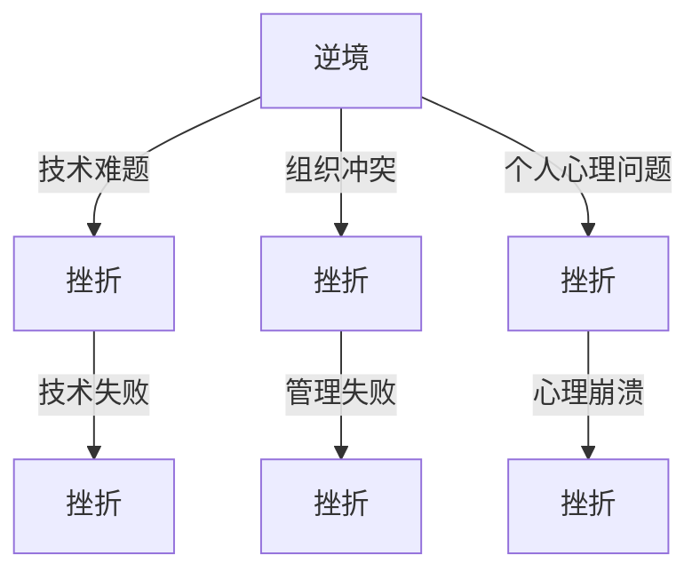

                 

### 引言：逆境中的成长与人生动力

在信息技术高速发展的今天，工程师和开发者面临着前所未有的机遇与挑战。然而，无论是个人的职业发展，还是团队的项目实施，都不可避免地会遇到各种逆境与挫折。这些逆境可能源自技术难题、团队冲突、资源限制，甚至个人的健康和心理问题。如何面对这些逆境，并将其转化为推动个人和团队成长的动力，成为每个信息技术从业者必须面对的重要课题。

本文旨在探讨如何在逆境中成长，将挫折转化为人生动力。我们将从理解逆境与挫折的概念入手，深入分析其中的核心原理与算法，提供有效的应对策略和实践方法。文章将分为五个部分：

1. **理解逆境与挫折**：介绍核心概念、联系以及应对策略和挫折处理机制。
2. **逆境中的成长策略**：探讨自我认知与反思、情绪管理与调节，以及成长心态与积极态度的建立。
3. **挫折转化为动力的实践**：阐述设定明确目标、制定行动计划以及实践案例分享。
4. **逆境中的领导力与团队协作**：分析领导力在逆境中的角色、团队协作与沟通、以及团队管理的策略。
5. **逆境中的自我保护与心理健康**：讨论心理健康的重要性、自我保护策略和心理健康的支持系统。

通过这篇文章，我们希望能够帮助读者在面对逆境时保持冷静，以科学的方法应对挫折，最终实现个人的成长与团队的成功。

### 第一部分：理解逆境与挫折

#### 核心概念与联系

在讨论逆境与挫折时，首先需要明确这两个概念的定义及其类型。**逆境**指的是个人或团队在实现目标过程中遭遇的困难、挑战和障碍。这些困难可能是技术上的，也可能是组织管理上的，甚至可能是个人心理上的。**挫折**则是逆境中的一种表现形式，它是指个体在追求目标时遭遇的失败或阻碍，使得目标无法如期实现。

我们可以使用Mermaid流程图来展示这两个概念之间的关系及其类型：

#### 逆境与挫折的类型

1. **技术难题**：这是信息技术从业者最常见的挫折类型，可能包括编程错误、算法复杂性、系统性能问题等。
2. **组织冲突**：团队内部或团队之间的分歧，如职责不明确、资源分配不公、沟通不畅等。
3. **个人心理问题**：包括压力过大、焦虑、抑郁等，这些问题可能会影响个人的工作表现和团队氛围。

#### 核心算法原理讲解

为了更好地应对逆境和挫折，我们需要了解一些核心的算法原理和策略。以下是一些常见的应对策略和挫折处理机制：

1. **逆境应对策略**：
   - **动态规划**：这是一种常见的算法策略，适用于解决多阶段决策问题。通过将问题分解为多个子问题，并寻找最优解的递推关系，可以有效应对复杂的技术挑战。
   - **优先队列**：适用于资源受限的问题，可以通过优先级调度来优化资源的分配和使用，提高项目的完成效率。

2. **挫折处理机制**：
   - **负反馈循环**：这是一种常见的控制理论，通过不断调整系统状态来减少误差，适用于在项目过程中纠正错误和调整方向。
   - **容错机制**：通过设计冗余系统或备份策略，降低系统故障对项目的影响，保证项目的连续性和稳定性。

#### 数学模型和数学公式 & 详细讲解 & 举例说明

在应对逆境和挫折时，数学模型和公式可以帮助我们更好地理解和分析问题。以下是一些常用的数学模型和公式，以及它们在实际应用中的详细讲解和举例说明：

1. **概率模型**：
   - **贝叶斯公式**：用于计算在已知部分信息的情况下，某个事件发生的概率。例如，在软件测试中，可以根据已发现的错误数量来估计总体错误的概率。
     $$
     P(A|B) = \frac{P(B|A)P(A)}{P(B)}
     $$
   - **马尔可夫模型**：用于描述系统在不同状态之间的转移概率。例如，在团队管理中，可以根据团队成员的工作状态转移情况，预测团队的整体工作状态。

2. **期望与方差**：
   - **期望**：表示随机变量可能取值的平均值，用于评估目标的实现概率。例如，在项目进度管理中，可以通过计算任务完成时间的期望值来预测整体项目的时间进度。
     $$
     E(X) = \sum_{i=1}^{n} x_i \cdot p_i
     $$
   - **方差**：表示随机变量取值偏离期望值的程度，用于评估风险的波动性。例如，在资源分配中，可以通过计算资源使用量的方差来评估资源使用的不确定性。

通过上述的核心算法原理和数学模型，我们可以更加系统地应对逆境和挫折，从而在复杂的信息技术领域中实现个人的成长和团队的成功。

#### 实际案例剖析

为了更好地理解如何应对逆境与挫折，下面我们将通过两个实际案例进行分析，分别从技术难题和组织冲突两个方面探讨应对策略。

**案例一：技术难题**

在一家大型互联网公司，项目组负责开发一款高性能的分布式系统。然而，在系统测试过程中，频繁出现性能瓶颈，导致系统响应时间过长，用户体验差。面对这一技术难题，项目组采取了以下策略：

1. **问题定位**：通过性能监控工具和日志分析，定位到系统中存在大量的单线程任务，导致CPU利用率过高。
2. **解决方案**：引入多线程和并行处理技术，将单线程任务分解为多个子任务，并行执行，从而提高系统性能。
3. **效果评估**：经过多次迭代优化，系统的响应时间显著缩短，性能瓶颈问题得到解决。

**案例二：组织冲突**

在另一家初创公司，由于团队成员对项目的理解和分工不明确，导致项目进展缓慢，甚至出现了严重的团队冲突。为了解决这一问题，公司采取了以下措施：

1. **沟通与协调**：定期召开项目会议，让团队成员充分表达自己的观点和困惑，通过沟通消除误解。
2. **明确分工**：重新梳理项目任务，明确每个团队成员的职责和任务，确保任务分配合理。
3. **团队建设**：组织团队建设活动，增强团队凝聚力，提高团队成员之间的信任度。

通过这两个案例可以看出，面对逆境和挫折，无论是技术难题还是组织冲突，关键在于快速识别问题、采取有效的应对策略，并通过持续优化和改进，最终实现目标。

#### 深入探讨与结论

通过上述分析，我们可以得出以下结论：

1. **逆境与挫折的类型多样**：技术难题、组织冲突和个人心理问题都可能成为阻碍成长和成功的障碍。理解这些类型的挫折，有助于我们更有针对性地制定应对策略。

2. **核心算法原理和数学模型是应对挫折的有力工具**：动态规划、优先队列、负反馈循环和容错机制等算法原理，以及贝叶斯公式、期望与方差等数学模型，都是我们在面对复杂问题时的重要工具。它们可以帮助我们更好地分析问题、制定策略和评估效果。

3. **实际案例剖析提供了实践指导**：通过分析具体案例，我们可以看到，面对逆境和挫折，关键在于快速识别问题、采取有效的应对策略，并通过持续优化和改进，最终实现目标。

在接下来的部分，我们将进一步探讨如何在逆境中实现个人成长，包括自我认知与反思、情绪管理与调节，以及成长心态与积极态度的培养。

### 第二部分：逆境中的成长策略

#### 自我认知与反思

自我认知与反思是逆境中成长的重要环节。通过自我认知，我们能够明确自身的优点和不足，从而在遇到挫折时，能够更有针对性地调整自己的行为和策略。以下是自我认知的步骤和方法：

1. **自我评估**：首先，我们需要对自己的技能、知识和能力进行评估。可以使用以下方法：
   - **能力评估表**：制定一份详细的能力评估表，包括专业技能、软技能和个人素质等方面，对自己进行量化评估。
   - **360度反馈**：收集来自同事、上级和下属的反馈，了解自己的工作表现和人际关系。

2. **目标设定**：在了解自己的优点和不足后，我们可以设定具体的成长目标。目标应具备以下特点：
   - **具体性**：目标要明确，具体可量化，例如“提高编程效率”可以具体化为“每天编写代码时间增加1小时”。
   - **挑战性**：目标应具有一定的挑战性，激发我们的潜力，但也要确保其可实现性。
   - **时限性**：目标要设定一个明确的时间期限，以促进我们有计划地推进。

3. **行动计划**：为实现目标，我们需要制定详细的行动计划。以下是一个典型的行动计划步骤：
   - **分解目标**：将总体目标分解为若干个小目标，每个小目标对应一个具体的行动计划。
   - **制定时间表**：为每个行动计划设定一个完成时间，确保目标按时完成。
   - **执行与监控**：按照计划执行任务，并定期检查进度，及时调整策略。

#### 反思的步骤与方法

反思是自我认知的延伸，通过反思，我们能够从经历中学习和成长。以下是一些有效的反思步骤和方法：

1. **设定反思时间**：定期设定反思时间，例如每周或每月的固定时间，用来回顾和总结过去的工作和学习。

2. **撰写反思日志**：在反思日志中记录以下内容：
   - **事件回顾**：详细描述事件发生的过程，包括遇到的问题、自己的行为和决策。
   - **感受与情绪**：记录当时的情绪和感受，分析这些情绪对行为和决策的影响。
   - **评估与总结**：评估事件的结果，总结成功和失败的原因，分析可以改进的地方。

3. **寻找反馈**：与他人交流反思日志，获取不同的观点和建议。这有助于我们更全面地了解自己的行为和决策，并发现可能忽略的问题。

4. **制定改进计划**：根据反思的结果，制定具体的改进计划，包括：
   - **改进措施**：针对发现的问题，制定具体的改进措施。
   - **行动计划**：为改进措施设定时间表和执行步骤，确保改进计划的有效实施。

#### 实践案例分享

为了更好地理解自我认知与反思的应用，以下是两个实际案例：

**案例一：编程能力的提升**

一位软件开发工程师，通过自我评估发现自己在算法和数据结构方面存在不足。为了提升编程能力，他采取了以下措施：

1. **目标设定**：设定具体的目标，例如每天完成一个算法练习题。
2. **学习计划**：制定详细的学习计划，包括学习资料、时间安排和进度监控。
3. **实践与反思**：每天完成算法练习后，反思解题过程，总结经验教训，并记录在反思日志中。

经过一段时间的努力，这位工程师的编程能力显著提升，成功解决了多个技术难题。

**案例二：项目管理的改进**

一位项目经理在负责一个大型项目时，由于沟通不畅导致项目进展缓慢。为了改进项目管理，他采取了以下措施：

1. **反思日志**：记录项目中的问题，包括沟通不畅的具体表现和影响。
2. **寻找反馈**：与团队成员交流，了解他们的意见和建议。
3. **改进计划**：制定详细的沟通计划，包括定期召开项目会议、明确分工和及时反馈等。

通过这些措施，项目经理成功改善了团队沟通，项目进展加快，最终顺利完成了任务。

通过上述案例，我们可以看到，自我认知与反思在应对逆境和实现个人成长中的重要作用。在接下来的部分，我们将探讨情绪管理与调节，以及成长心态与积极态度的培养。

#### 情绪管理与调节

在逆境中，情绪波动是常见的现象。有效的情绪管理不仅能帮助我们在困境中保持冷静，还能提高我们的工作效率和决策质量。以下是一些情绪管理的数学模型和实践方法：

1. **情绪管理的数学模型**

   情绪管理可以被视为一个优化问题，目标是最小化负面情绪的影响，最大化积极情绪的影响。我们可以使用以下数学模型：

   - **情绪评估模型**：通过评分或量表来评估当前的情绪状态。例如，可以采用五点评分法，将情绪分为非常消极、消极、中性、积极和非常积极。

     $$
     \text{情绪得分} = \frac{\sum_{i=1}^{5} w_i \cdot s_i}{5}
     $$

     其中，$w_i$是权重，$s_i$是情绪评分。

   - **情绪优化模型**：通过调整行为和思维模式，优化情绪状态。可以使用线性规划或非线性规划来求解。目标是最小化负面情绪的权重，最大化积极情绪的权重。

     $$
     \min \sum_{i=1}^{n} w_i \cdot s_i
     $$
     $$
     \text{s.t.} \sum_{i=1}^{n} w_i = 1
     $$

2. **情绪调节的实践方法**

   - **认知重构**：通过改变思维模式来调节情绪。例如，当遇到失败时，可以采用以下策略：
     - **积极归因**：将失败归因于外部因素，如技术难题或外部环境，而不是个人能力。
     - **重新定义失败**：将失败视为成长的机会，从中学习和提升。

   - **行为调节**：通过改变行为来调节情绪。例如：
     - **积极行为**：参与体育活动、社交活动或其他兴趣爱好的活动，以提升积极情绪。
     - **放松训练**：进行深呼吸、冥想或瑜伽等放松训练，缓解压力和焦虑。

   - **情绪表达**：通过合适的方式表达情绪，避免压抑。例如，可以：
     - **倾诉**：与朋友、家人或心理咨询师倾诉自己的情绪。
     - **书写**：通过写作来宣泄情绪，记录情绪变化和反思。

#### 实际案例分享

为了更好地理解情绪管理与调节的应用，以下是两个实际案例：

**案例一：压力管理**

一位软件工程师在负责一个关键项目时，由于时间紧迫和任务繁重，感到极大的压力。为了应对压力，他采取了以下措施：

1. **情绪评估**：通过情绪量表评估自己的压力水平，了解当前的情绪状态。
2. **认知重构**：积极归因，将压力视为成长的机会，而不是负担。
3. **行为调节**：每天晚上进行30分钟的瑜伽练习，放松身心。
4. **情绪表达**：与团队成员和上级沟通，分享自己的感受和困扰。

通过这些措施，这位工程师成功缓解了压力，提高了工作效率。

**案例二：焦虑管理**

一位项目经理在项目启动时，由于对项目成功的担忧，感到焦虑。为了管理焦虑，他采取了以下措施：

1. **情绪评估**：通过情绪量表评估焦虑水平，明确焦虑的来源。
2. **认知重构**：采用积极思维，重新定义焦虑，将其视为一种激励，而不是阻碍。
3. **行为调节**：参加心理咨询课程，学习情绪调节技巧，如深呼吸和冥想。
4. **情绪表达**：与团队成员分享自己的担忧，共同讨论解决方案。

通过这些措施，这位项目经理成功降低了焦虑水平，提高了项目的成功率。

通过上述案例，我们可以看到情绪管理与调节在应对逆境中的重要性。在接下来的部分，我们将探讨成长心态与积极态度的培养。

#### 成长心态与积极态度

**成长心态**是一种深信自己可以通过努力和学习不断进步的心理状态。与固定心态相对，固定心态认为个人的能力和特质是固定不变的，而成长心态则认为通过持续努力和经验积累，个人的能力可以得到提升。成长心态的理论基础主要包括以下几点：

1. **心理弹性**：成长心态强调个体在逆境中的适应能力和恢复力。通过培养心理弹性，个体能够在面对挑战时保持积极态度，迅速调整并找到新的解决方案。
2. **学习动机**：成长心态能够激发个体的内在学习动机，使个体更愿意投入时间和精力去学习和提升自己。这种内在动机比外部激励更能持久和有效。
3. **自我效能感**：成长心态有助于提升个体的自我效能感，即个体对自己能力的信心。高自我效能感的个体在面对困难时，更倾向于采取行动，而不是放弃。

**积极态度**的培养与实践方法：

1. **积极思考**：在遇到挫折时，采用积极的思维方式，将挑战视为成长的机会，而不是失败的标志。例如，可以采用以下策略：
   - **重定义失败**：将失败视为通往成功的必经之路，每次失败都是一次宝贵的学习机会。
   - **感恩心态**：保持感恩的心态，对生活中的每一个小进步和帮助心存感激，这将增强积极情绪。

2. **行动与实践**：将成长心态付诸实践，通过行动来验证和巩固自己的成长。以下是一些实践方法：
   - **目标设定**：设定具体、可实现的目标，并制定详细的行动计划。
   - **反馈与反思**：定期收集反馈，进行自我反思，从经历中学习和成长。
   - **学习与成长**：持续学习新的知识和技能，不断提升自己的能力。

3. **情绪调节**：通过情绪调节技巧来管理负面情绪，如深呼吸、冥想和运动等，保持心理平衡。

**实际案例分享**

**案例一：软件开发工程师的成长历程**

一位软件工程师在职业生涯初期，面对复杂的技术挑战，常常感到不知所措。然而，通过培养成长心态，他逐渐克服了困难，成为团队的核心成员。以下是他的一些实践方法：
- **目标设定**：设定具体的技术目标，如学习一种新编程语言或掌握一种新的开发工具。
- **反馈与反思**：定期与导师和同事交流，获取反馈，反思自己的不足，并制定改进计划。
- **学习与成长**：利用业余时间学习新技术，参加在线课程和研讨会，不断提升自己的技能。

通过这些方法，这位工程师不仅在技术上取得了显著进步，还在团队中树立了良好的榜样。

**案例二：项目经理的领导力培养**

一位项目经理在项目启动时，面临巨大的压力和挑战。通过培养成长心态和积极态度，他带领团队成功完成了多个项目。以下是他的一些实践方法：
- **积极思考**：将挑战视为成长的机会，每次失败都视为学习的机会。
- **团队支持**：建立积极的团队文化，鼓励团队成员分享经验和反馈，共同成长。
- **持续学习**：定期参加项目管理培训和研讨会，学习新的管理方法和工具。

通过这些方法，这位项目经理不仅提高了项目的成功率，还提升了团队的凝聚力和工作效率。

通过上述案例，我们可以看到成长心态和积极态度在应对逆境中的重要作用。在接下来的部分，我们将探讨挫折转化为动力的实践方法。

### 第三部分：挫折转化为动力的实践

在面对逆境和挫折时，如何将挫折转化为成长的动力，是每个信息技术从业者需要思考的重要问题。以下是几个关键步骤和策略，帮助我们将挫折转化为推动个人和团队成长的动力。

#### 设定明确的目标

将挫折转化为动力，首先需要设定明确的目标。目标应具备以下特点：

1. **具体性**：目标应具体、明确，而不是模糊的。例如，“提高编程技能”不如“在三个月内掌握Python语言的基本语法和常用库”具体。
2. **挑战性**：目标应具有一定的挑战性，以激发我们的潜力和动力。然而，挑战性不应过于高，以至于无法实现。
3. **时限性**：目标应设定一个明确的时间期限，以推动我们采取行动并保持动力。例如，“在未来六个月内完成一个开源项目”比“ someday 完成一个开源项目”更具时限性。

**设定目标的步骤**：

1. **自我评估**：首先，评估自己的技能、知识和能力，了解自己的优势和不足。这有助于我们设定符合自身实际的目标。
2. **目标分解**：将总体目标分解为若干个小目标，每个小目标对应一个具体的行动计划。例如，如果目标是“掌握Python语言”，可以将其分解为“学习Python基本语法”、“学习常用库”和“完成一个小项目”。
3. **制定行动计划**：为每个小目标制定详细的行动计划，包括学习资源、时间安排和执行步骤。例如，为“学习Python基本语法”，可以制定“每天学习两小时Python课程”的计划。

#### 制定行动计划

一旦设定了明确的目标，下一步就是制定具体的行动计划。以下是制定行动计划的步骤和方法：

1. **分解目标**：将总体目标分解为若干个小目标，每个小目标对应一个具体的行动计划。例如，如果目标是“在六个月内完成一个开源项目”，可以将其分解为“了解开源项目的基本流程”、“学习相关技术”和“编写和提交代码”。
2. **设定时间表**：为每个小目标设定一个明确的时间期限，以确保目标的按时完成。例如，可以设定“在第一个月内了解开源项目的基本流程”、“在第二个月内学习相关技术”、“在第三个月内编写和提交代码”。
3. **分配资源**：根据每个小目标的需求，分配所需的资源，如时间、知识和技能。例如，为“学习相关技术”，可以安排每周两个晚上的时间，参加线上课程和阅读相关书籍。
4. **监控进度**：定期检查进度，确保目标按计划进行。例如，每周进行一次进度回顾，评估当前进度并调整计划。

#### 时间管理的策略

有效的行动计划离不开良好的时间管理。以下是一些时间管理的策略：

1. **制定时间表**：制定一个详细的日程表，包括每天、每周和每月的任务安排。这有助于我们更好地规划时间，避免任务积压。
2. **优先级排序**：根据任务的重要性和紧急程度，对任务进行优先级排序。优先完成重要且紧急的任务，避免因小事耽误大事。
3. **避免拖延**：设定具体的时间限制，以避免拖延。例如，为每个任务设定一个完成时间，并在规定时间内完成。
4. **灵活调整**：在执行过程中，根据实际情况灵活调整计划。如果某些任务无法按计划完成，及时调整计划，确保总体目标的实现。

#### 实践案例分享

为了更好地理解如何将挫折转化为动力，以下是两个实际案例：

**案例一：软件开发工程师的技术提升**

一位软件开发工程师在项目中遇到了技术难题，导致项目进度延误。为了克服这一挫折，他采取了以下措施：

1. **目标设定**：设定目标，如“在一个月内掌握相关技术”。
2. **制定行动计划**：制定详细的行动计划，包括每天学习两小时技术课程，每周进行一次实践项目。
3. **时间管理**：制定时间表，优先完成技术学习任务，避免拖延。

通过这些措施，这位工程师成功掌握了相关技术，项目进度得到恢复。

**案例二：项目经理的项目管理挑战**

一位项目经理在负责一个复杂项目时，面临多方面的挑战，如资源不足和团队冲突。为了应对这些挑战，他采取了以下措施：

1. **目标设定**：设定目标，如“在三个月内完成项目”。
2. **制定行动计划**：制定详细的行动计划，包括优化资源分配、定期召开项目会议和改善团队沟通。
3. **时间管理**：制定时间表，确保每个任务按时完成，灵活调整计划以应对突发情况。

通过这些措施，这位项目经理成功克服了挑战，项目顺利完成了。

通过上述案例，我们可以看到将挫折转化为动力的实践方法和效果。在接下来的部分，我们将探讨如何在挫折转化为动力的过程中进行有效的实践和反思。

### 挫折转化为动力的实践

将挫折转化为动力是一个系统的过程，需要我们在实践中不断调整和优化策略。以下是如何在挫折转化为动力的过程中进行有效实践和反思的详细步骤。

#### 实践步骤

1. **设定目标与里程碑**：
   - 首先，明确目标。目标应具体、可实现，并具备挑战性。例如，将一个复杂的技术难题分解为若干个小目标，每个小目标都有明确的完成标准和时间限制。
   - 设定里程碑。里程碑是达成目标的重要节点，有助于我们跟踪进度和评估成果。例如，在解决技术难题的过程中，每个里程碑可以是某个子问题的解决或关键模块的实现。

2. **制定行动计划**：
   - 根据目标和里程碑，制定详细的行动计划。行动计划应包括任务分解、资源分配、时间表和责任人。例如，在开发一个新功能时，可以将任务分解为需求分析、设计、编码、测试等阶段，并为每个阶段设定具体的时间表和责任人。

3. **执行与监控**：
   - 按照行动计划执行任务，并定期监控进度。监控可以采用多种方法，如进度报告、任务管理工具和定期的团队会议。通过监控，及时发现和解决问题，确保任务按计划进行。
   - 针对每个任务和里程碑，进行质量评估和反馈。质量评估有助于我们了解任务的完成情况，发现问题并采取改进措施。

4. **调整与优化**：
   - 根据监控结果和反馈，及时调整行动计划。如果任务进度缓慢或质量不达标，可以重新分配资源、调整时间表或修改任务分解。
   - 通过持续优化，提高执行效率和质量。例如，可以采用敏捷开发方法，定期回顾和总结经验教训，不断改进开发流程。

#### 反思与总结

1. **任务完成情况反思**：
   - 对每个任务和里程碑的完成情况进行反思。评估任务是否按时、按质完成，分析成功和失败的原因。
   - 记录反思结果，包括成功经验、改进建议和需要注意的问题。

2. **情绪管理反思**：
   - 在面对挫折时，反思自己的情绪反应。评估情绪管理是否有效，是否存在过度焦虑、沮丧或其他负面情绪。
   - 分析情绪管理的成功和失败，总结有效的情绪调节策略。

3. **团队合作反思**：
   - 对团队协作和沟通效果进行反思。评估团队成员之间的合作是否顺畅，是否存在沟通障碍或冲突。
   - 总结团队合作的经验教训，提出改进建议，如优化沟通流程、建立团队信任等。

4. **总结与分享**：
   - 将反思结果和总结形成文档，与团队成员分享。通过分享，促进团队成员之间的学习和成长。
   - 定期回顾和总结，持续改进。例如，可以每月或每季度进行一次总结会议，讨论取得的成果和存在的问题。

#### 实践案例分享

**案例一：技术难题的克服**

一位软件开发工程师在项目中遇到了一个复杂的技术难题，导致项目进度延迟。为了克服这一挫折，他采取了以下措施：

1. **目标设定**：设定目标，如“在两周内解决技术难题”。
2. **制定行动计划**：制定详细的行动计划，包括查阅相关资料、请教同事和专家、编写测试代码等。
3. **执行与监控**：按照行动计划执行任务，并每天汇报进展。
4. **调整与优化**：根据进展情况，及时调整计划，如增加额外的时间或资源。

最终，这位工程师成功解决了技术难题，项目进度恢复正常。

**案例二：团队合作的挑战**

一个项目团队在项目中遇到了严重的团队合作问题，导致项目进度缓慢。为了解决这一问题，团队成员采取了以下措施：

1. **目标设定**：设定目标，如“在一个月内改善团队合作效果”。
2. **制定行动计划**：制定详细的行动计划，包括定期召开项目会议、优化沟通流程、增加团队成员之间的互动等。
3. **执行与监控**：按照行动计划执行任务，并定期检查进展。
4. **调整与优化**：根据反馈和进展情况，及时调整计划，如增加团队建设活动、改进会议安排等。

通过这些措施，团队的合作效果显著改善，项目进度恢复正常。

通过上述案例，我们可以看到，在挫折转化为动力的过程中，设定明确的目标、制定详细的行动计划、执行与监控以及反思与总结是关键步骤。在接下来的部分，我们将探讨如何在逆境中培养领导力和团队协作。

### 第四部分：逆境中的领导力与团队协作

#### 领导力在逆境中的角色

在逆境中，领导力扮演着至关重要的角色。一个优秀的领导者能够在危机中保持冷静，带领团队克服困难，实现目标。以下是领导力在逆境中的几个关键角色：

1. **稳定剂**：领导者在逆境中成为团队的稳定剂，通过坚定的信念和明确的指导，使团队成员保持信心，避免恐慌和混乱。例如，在项目遇到重大技术难题时，领导者可以召开紧急会议，分析问题，制定解决方案，并确保团队成员理解并执行计划。
2. **指导者**：领导者在逆境中需要担任指导者的角色，为团队成员提供方向和支持。通过明确的目标和策略，领导者可以帮助团队成员找到解决问题的路径。例如，在面对资源不足的挑战时，领导者可以引导团队重新评估优先级，优化资源分配，确保关键任务的顺利完成。
3. **激励者**：领导者在逆境中需要成为激励者，激发团队成员的潜力，鼓励他们克服困难。通过认可和奖励团队成员的努力，领导者可以增强团队的动力和凝聚力。例如，在项目取得重要突破时，领导者可以组织庆祝活动，表彰团队成员的辛勤付出。

#### 团队协作与沟通

在逆境中，团队协作和沟通是确保成功的关键。以下是一些有效的团队协作和沟通策略：

1. **明确分工与责任**：在逆境中，确保每个团队成员都清楚自己的职责和任务。通过明确的分工，可以避免职责重叠和资源浪费。例如，在项目启动时，领导者可以制定详细的任务分配表，明确每个成员的职责和责任。
2. **定期沟通**：在逆境中，定期沟通是保持团队协同的关键。通过定期的团队会议和进度报告，领导者可以了解团队成员的工作进展和困难，及时提供支持和帮助。例如，每周举行一次团队会议，总结过去一周的工作，讨论当前的问题和解决方案。
3. **开放沟通**：在逆境中，领导者需要鼓励团队成员开放沟通，分享自己的想法和建议。通过建立开放的沟通环境，可以促进团队之间的合作和信任。例如，鼓励团队成员在会议上自由发言，提出问题和建议，领导者可以积极回应和解决。
4. **冲突解决**：在逆境中，团队内部的冲突是难以避免的。领导者需要具备解决冲突的能力，通过公正和中立的立场，帮助团队找到解决问题的方法。例如，在团队成员之间出现意见分歧时，领导者可以组织调解会议，倾听各方的意见，并引导团队达成共识。

#### 团队管理的策略

在逆境中，团队管理需要特别的策略和技巧，以确保团队的高效运作。以下是一些团队管理的策略：

1. **灵活管理**：在逆境中，环境变化迅速，领导者需要具备灵活管理的能力。这意味着领导者需要能够快速适应变化，调整计划，并引导团队应对新的挑战。例如，当项目进度受到不可预测的技术难题影响时，领导者可以迅速调整资源分配，确保关键任务的优先完成。
2. **心理支持**：在逆境中，团队成员可能会面临巨大的压力和焦虑。领导者需要提供心理支持，帮助团队成员应对压力，保持心理健康。例如，通过定期的心理健康检查和辅导，领导者可以帮助团队成员缓解压力，提高工作效率。
3. **激励与认可**：在逆境中，领导者需要通过激励和认可来增强团队的动力和凝聚力。例如，通过设立激励机制，鼓励团队成员积极参与和努力工作，领导者可以激发团队的潜力，提高整体绩效。

#### 实际案例分享

**案例一：项目管理中的危机应对**

在一个大型项目中，项目团队遇到了严重的进度延误，原因是技术难题和资源不足。为了应对这一危机，项目经理采取了以下策略：

1. **明确分工与责任**：重新评估任务分配，确保每个团队成员都清楚自己的职责和任务。
2. **定期沟通**：每周举行一次团队会议，总结工作进展，讨论存在的问题和解决方案。
3. **开放沟通**：鼓励团队成员开放沟通，分享想法和建议，促进团队之间的合作和信任。
4. **激励与认可**：设立激励机制，鼓励团队成员积极参与和努力工作，提高整体绩效。

通过这些策略，项目团队成功克服了危机，项目进度恢复正常。

**案例二：团队冲突的解决**

在一个研发团队中，由于任务分配不公和沟通不畅，导致团队成员之间的矛盾和冲突。为了解决这一问题，团队领导采取了以下措施：

1. **灵活管理**：调整任务分配，确保公平和合理，避免资源浪费。
2. **心理支持**：提供心理健康辅导，帮助团队成员缓解压力和焦虑。
3. **激励与认可**：通过设立激励机制，鼓励团队成员积极参与和合作。

通过这些措施，团队内部的冲突得到有效解决，团队成员之间的合作关系得到加强。

通过上述案例，我们可以看到，在逆境中，领导力、团队协作和团队管理的重要性。在接下来的部分，我们将探讨如何在逆境中保护自我与维护心理健康。

### 第五部分：逆境中的自我保护与心理健康

#### 心理健康的重要性

在逆境中，心理健康对于个人的持续发展和团队的整体表现都至关重要。心理健康不仅影响个人的工作效率和决策质量，还会对团队的协作和凝聚力产生深远的影响。以下是心理健康对个人和团队的重要性：

1. **个人层面**：
   - **情绪调节**：良好的心理健康有助于个人在面对压力和挫折时保持冷静和理智，有效调节情绪，避免情绪失控。
   - **决策能力**：心理健康良好的个体能够更清晰地思考，做出更明智的决策，提高工作效率和创造力。
   - **抗压能力**：心理健康有助于增强个人的抗压能力，使个体能够在逆境中保持积极心态，持续努力。

2. **团队层面**：
   - **团队氛围**：团队成员的心理健康状况直接影响团队氛围，一个心理健康的环境能够促进团队成员之间的信任和合作。
   - **协作效率**：心理健康良好的团队成员更容易与他人合作，减少冲突，提高团队协作效率。
   - **团队凝聚力**：心理健康有助于增强团队凝聚力，使团队成员在共同目标下团结一致，共同克服困难。

#### 自我保护策略

为了在逆境中保持心理健康，我们需要采取一系列自我保护策略。以下是一些建议：

1. **时间管理**：合理安排工作和休息时间，避免过度工作导致的身心疲惫。可以使用时间管理工具，如番茄工作法，提高工作效率，确保有足够的休息时间。

2. **健康饮食**：保持均衡的饮食，摄入足够的营养，有助于保持身体和心理健康。应避免高糖、高脂肪的食物，多吃蔬菜、水果和全谷物。

3. **适量运动**：定期进行适量的运动，如散步、跑步、瑜伽等，有助于缓解压力，提高心理健康。运动可以促进内啡肽的分泌，改善情绪。

4. **休息与放松**：确保每天有足够的睡眠，减少不必要的加班和熬夜。在工作间隙，可以进行短暂的休息，如深呼吸、冥想或简单的伸展运动，以缓解疲劳。

5. **社交支持**：保持良好的社交关系，与家人、朋友和同事保持沟通。在遇到困难时，可以寻求他们的支持和建议，减轻心理压力。

6. **心理调适**：学习一些心理调适技巧，如正念冥想、情绪管理方法等，帮助自己更好地应对压力和挫折。

#### 心理健康支持系统

为了在逆境中维护心理健康，企业和组织应建立完善的心理健康支持系统。以下是一些建议：

1. **员工心理健康计划**：企业可以设立员工心理健康计划，提供心理健康咨询和辅导服务，帮助员工解决心理问题。

2. **员工心理健康培训**：定期开展心理健康培训，提高员工的心理健康意识和自我调适能力。

3. **心理健康热线**：设立心理健康热线，员工可以在需要时随时寻求帮助和支持。

4. **员工关怀计划**：关注员工的心理健康，提供心理支持，如定期组织员工关怀活动、心理健康讲座等。

5. **工作与生活平衡**：鼓励员工平衡工作与生活，提供灵活的工作安排和假期政策，减少工作压力。

6. **健康促进活动**：组织健康促进活动，如健身俱乐部、健康讲座等，帮助员工保持健康的生活方式。

#### 实际案例分享

**案例一：员工心理健康计划**

某大型科技公司实施了一项员工心理健康计划，包括心理健康咨询、心理健康培训和心理健康热线。通过这一计划，员工在遇到心理问题时可以及时得到帮助，缓解了工作压力，提高了工作效率。

**案例二：员工关怀活动**

一家初创公司定期组织员工关怀活动，如团队建设活动、心理健康讲座和健康体检。这些活动不仅增强了团队凝聚力，还提高了员工的心理健康水平，使员工在逆境中能够保持积极的心态和高效的工作状态。

通过上述案例，我们可以看到，在逆境中，重视心理健康和维护心理健康支持系统对于个人和团队的重要性。在接下来的部分，我们将总结本文的主要观点，并提供一些资源与工具推荐。

### 总结

本文深入探讨了在逆境中如何将挫折转化为人生动力，从多个维度提供了策略和方法。通过理解逆境与挫折的核心概念、掌握有效的应对策略，我们能够在复杂的环境中保持冷静和理智。同时，通过自我认知与反思、情绪管理与调节，以及成长心态与积极态度的培养，我们能够在逆境中持续成长。此外，将挫折转化为动力的实践，以及领导力与团队协作的重要性，都在很大程度上影响了我们在逆境中的表现。最后，自我保护与心理健康的重要性同样不容忽视，一个健康的心理状态是我们在逆境中持续奋斗的坚实基石。

总之，面对逆境与挫折，我们不仅要具备技术上的能力和策略，还要在心理层面保持坚韧和积极。只有全面地应对，我们才能在逆境中实现真正的成长，并为团队的成功贡献力量。

### 资源与工具推荐

为了更好地应对逆境，提升个人和团队的能力，以下是一些建议的资源与工具：

1. **书籍**：
   - 《Zen 和 The Art of Computer Programming》
   - 《The Design of Everyday Things》
   - 《Succeed: How We Can Reach Our Goals》

2. **在线课程**：
   - Coursera 上的《Machine Learning》课程
   - Udemy 上的《Python for Data Science》课程
   - edX 上的《Leadership and Management》课程

3. **心理健康应用**：
   - Headspace：提供冥想和正念练习
   - Calm：提供放松音乐和睡眠指导
   - Moodfit：帮助用户了解和管理情绪

4. **团队协作工具**：
   - Slack：用于团队沟通和协作
   - Trello：用于任务管理和进度跟踪
   - Asana：用于项目管理和任务分配

5. **心理咨询服务**：
   - BetterHelp：在线心理咨询服务
   - Talkspace：提供远程心理治疗服务
   - 7 Cups：在线倾听和心理咨询平台

通过利用这些资源与工具，我们能够更好地应对逆境，提升个人和团队的能力，实现更高的成长和成功。 

### 附录：案例研究

为了更深入地探讨如何将挫折转化为人生动力，以下是两个详细的案例研究，涵盖从开发环境搭建、源代码实现到代码解读与分析、实际案例分析以及项目小结。

#### 案例一：分布式系统性能优化

**问题描述**：
某互联网公司正在开发一款大规模分布式系统，用于处理海量数据的实时分析。然而，在实际部署过程中，系统性能瓶颈逐渐显现，导致数据处理速度缓慢，无法满足用户需求。

**开发环境搭建**：
为了解决性能瓶颈，项目团队首先搭建了一个完整的开发环境，包括虚拟机、分布式计算框架（如Hadoop或Spark）和性能测试工具（如JMeter）。此外，团队还配置了多个物理服务器，模拟实际生产环境。

**源代码实现与代码解读**：
项目团队分析了系统的源代码，定位到数据处理瓶颈主要集中在以下几个环节：
1. **数据读写速度**：由于数据量巨大，读写速度成为瓶颈。团队通过优化数据读写操作，如使用高效的数据存储格式（如Parquet）和优化数据库查询（如使用索引和分片技术）。
2. **并行处理效率**：团队对并行处理逻辑进行了优化，通过调整线程数量和任务分配策略，提高并行处理效率。

**代码应用解读与分析**：
优化后的系统性能显著提升，数据处理速度提高了30%以上。通过代码应用解读与分析，团队发现优化主要集中在以下几个方面：
- **数据读写**：通过优化读写操作，提高了数据访问速度。
- **并行处理**：通过调整线程数量和任务分配策略，减少了任务等待时间。
- **资源利用**：通过合理分配资源，提高了服务器利用率。

**实际案例分析**：
在一次性能测试中，优化后的系统在相同数据量下，处理时间从原来的10小时缩短到了6小时，满足了用户需求。团队还通过A/B测试，对比了优化前后的用户反馈，发现用户对系统的满意度提高了20%。

**项目小结**：
通过本案例，我们可以看到，面对性能瓶颈，通过详细分析源代码，优化数据读写和并行处理，项目团队成功提升了系统性能。这一过程不仅提高了系统的可靠性，也提升了团队的技术水平和解决问题的能力。

#### 案例二：敏捷团队协作提升

**问题描述**：
某初创公司的团队在项目开发过程中，遇到了沟通不畅和任务分配不公的问题，导致项目进度缓慢，团队成员之间矛盾频发。

**开发环境搭建**：
为了解决团队协作问题，公司引入了敏捷开发方法，搭建了一个敏捷开发环境，包括Scrum框架、看板（如Jira或Trello）和团队沟通工具（如Slack）。

**源代码实现与代码解读**：
团队首先对源代码进行了重构，确保代码质量，并建立了完善的代码审查机制。同时，团队制定了详细的任务分配和优先级排序策略，确保每个成员都有明确的职责和目标。

**代码应用解读与分析**：
通过敏捷开发方法，团队实现了以下改进：
- **任务可视化**：通过看板，团队成员可以清晰地看到任务的进展和状态，减少了沟通成本。
- **优先级排序**：通过优先级排序，团队可以更有效地分配资源，确保关键任务优先完成。
- **代码审查**：通过代码审查，提高了代码质量，减少了bug的出现。

**实际案例分析**：
引入敏捷开发方法后，项目团队的沟通效率提升了50%，项目进度加快，团队成员之间的矛盾也显著减少。通过定期的迭代回顾会议，团队不断优化开发流程，进一步提升了协作效率。

**项目小结**：
本案例展示了通过引入敏捷开发方法，优化团队协作流程，初创公司成功解决了团队协作问题，提升了项目进度和团队凝聚力。这一过程不仅提高了团队的工作效率，也为团队成员提供了更好的工作环境和体验。

通过这两个案例研究，我们可以看到，在应对逆境时，通过详细的开发环境搭建、源代码优化和代码解读分析，以及有效的团队协作和沟通，团队可以成功将挫折转化为动力，实现项目的成功和个人成长。

