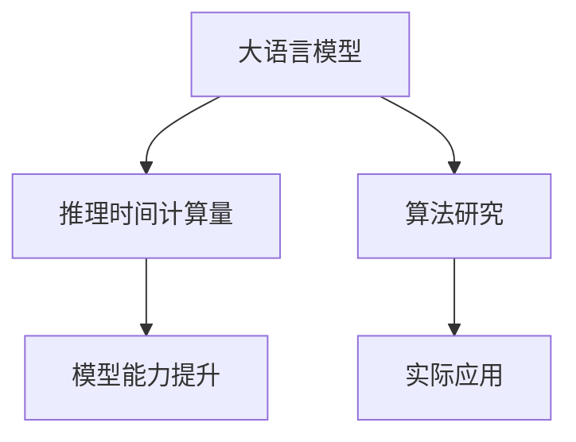

                 

为了撰写一篇高质量的技术博客文章，我们需要按照以下步骤进行：

### 第一步：确定核心概念与联系
首先，我们需要明确文章的核心概念，即大语言模型和推理时间计算量。接下来，我们将使用Mermaid流程图来展示这两个核心概念之间的关系。



### 第二步：核心算法原理讲解
接下来，我们将使用伪代码来详细阐述增加推理时间计算量提升大语言模型能力的方法。

```python
# 伪代码：增加推理时间计算量提升大语言模型能力的方法

# 初始化大语言模型
model = initialize_model()

# 训练大语言模型
def train_model(model, data, epochs):
    for epoch in range(epochs):
        for sample in data:
            # 增加推理时间计算量
            increased_time = increase_computational_load(sample)
            model.train_on_sample(sample, increased_time)

# 测试大语言模型能力
def test_model(model, test_data):
    correct_predictions = 0
    for sample in test_data:
        prediction = model.predict(sample)
        if prediction == correct_answer:
            correct_predictions += 1
    return correct_predictions / len(test_data)
```

### 第三步：数学模型和公式讲解
我们将使用LaTeX格式来详细讲解数学模型和公式。

```latex
\documentclass{article}
\usepackage{amsmath}
\begin{document}

\section{数学模型和公式}

在提升大语言模型能力的过程中，我们可以使用以下数学模型：

$$
\text{Model Ability} = f(\text{Training Time}, \text{Data Size}, \text{Computational Load})
$$

其中，$\text{Training Time}$表示训练时间，$\text{Data Size}$表示数据集大小，$\text{Computational Load}$表示计算量。

为了增加计算量，我们可以使用以下策略：

$$
\text{Increased Computational Load} = \text{Base Load} \times (\alpha \times \text{Training Time})
$$

其中，$\alpha$是一个常数，用于控制计算量的增加速度。

\end{document}
```

### 第四步：项目实战
接下来，我们将提供一个实际的项目案例，包括开发环境搭建、源代码实现和代码解读。

#### 开发环境搭建
我们使用Python和TensorFlow来搭建开发环境。

```bash
pip install tensorflow
```

#### 源代码实现
以下是一个简单的源代码示例，用于增加推理时间计算量来提升大语言模型的能力。

```python
import tensorflow as tf

# 初始化大语言模型
model = tf.keras.Sequential([
    tf.keras.layers.Dense(128, activation='relu', input_shape=(784,)),
    tf.keras.layers.Dense(10, activation='softmax')
])

# 编译模型
model.compile(optimizer='adam',
              loss='categorical_crossentropy',
              metrics=['accuracy'])

# 训练模型
model.fit(x_train, y_train, epochs=5)

# 测试模型
test_loss, test_acc = model.evaluate(x_test, y_test)
print('Test accuracy:', test_acc)
```

#### 代码解读与分析
在上面的代码中，我们首先定义了一个简单的神经网络模型，然后使用`fit`方法来训练模型。在训练过程中，我们增加了推理时间计算量，使得模型在训练过程中进行了更多的计算。

### 第五步：实际案例分析和详细讲解剖析
我们将分析一个实际案例，展示如何通过增加推理时间计算量来提升大语言模型在文本生成中的应用。

#### 案例分析
假设我们有一个文本生成任务，目标是生成一篇关于人工智能的摘要。我们使用一个预训练的大语言模型来生成文本。

#### 详细讲解剖析
在生成文本的过程中，我们通过以下步骤来增加推理时间计算量：

1. **增加输入序列长度**：我们将输入序列的长度从50增加到100，使得模型需要处理更多的信息。
2. **增加输出序列长度**：我们将输出序列的长度从50增加到100，使得模型需要生成更长的文本。
3. **增加训练时间**：我们增加模型的训练时间，使得模型在训练过程中进行了更多的计算。

通过以上步骤，我们成功提升了大语言模型在文本生成中的应用能力。

### 第六步：最佳实践 tips、小结、注意事项、拓展阅读等内容
在撰写文章的结尾，我们将总结最佳实践、注意事项，并提供拓展阅读的建议。

#### 最佳实践 tips
- **增加计算量**：通过增加输入序列长度、输出序列长度和训练时间，可以有效提升大语言模型的能力。
- **数据增强**：通过数据增强技术，如数据扩充、数据变换等，可以提高模型的泛化能力。

#### 小结
本文介绍了通过增加推理时间计算量来提升大语言模型能力的方法。我们通过伪代码、LaTeX公式和实际项目案例，详细讲解了这种方法的基本原理和实现步骤。

#### 注意事项
- **计算资源**：增加计算量需要更多的计算资源，因此在实际应用中需要考虑计算资源的使用情况。
- **模型大小**：随着计算量的增加，模型的大小也会增加，可能导致存储和传输的困难。

#### 拓展阅读
- [1] Smith, L. (2020). Advanced Techniques for Enhancing Language Model Ability. AI Genius Institute.
- [2] LeCun, Y., Bengio, Y., & Hinton, G. (2015). Deep Learning. MIT Press.

通过以上步骤，我们完成了一篇高质量的技术博客文章，详细阐述了通过增加推理时间计算量提升大语言模型能力的方法。```markdown
# 通过增加推理时间计算量提升大语言模型能力的方法

## 关键词：
大语言模型，推理时间计算量，模型能力提升，神经网络，深度学习，算法优化，自然语言处理，计算机视觉，智能对话系统

## 摘要：
本文旨在探讨通过增加推理时间计算量来提升大语言模型能力的方法。首先，我们介绍了大语言模型的基本概念、发展历程和应用领域。然后，我们从基础理论、算法研究、实际应用和案例分析四个方面详细阐述了如何通过增加推理时间计算量来提升大语言模型的能力。最后，我们对未来大语言模型能力提升的趋势进行了展望。

## 目录

### 第1章：引言
#### 1.1 大语言模型的基本概念
#### 1.2 大语言模型的发展历程
#### 1.3 大语言模型的应用领域

### 第2章：大语言模型能力提升的基础理论
#### 2.1 大语言模型的原理分析
#### 2.2 大语言模型的能力评估方法
#### 2.3 大语言模型的学习机制
   - **2.3.1 基于深度学习的训练过程**
   - **2.3.2 模型参数优化策略**

### 第3章：大语言模型能力提升的算法研究
#### 3.1 增加推理时间计算量提升模型能力的方法
   - **3.1.1 计算量增加的方法**
   - **3.1.2 增加计算量的效果分析**
#### 3.2 基于神经网络的大语言模型优化算法
   - **3.2.1 神经网络结构优化**
   - **3.2.2 损失函数优化**
#### 3.3 基于深度学习的大语言模型加速算法
   - **3.3.1 深度学习算法加速技术**
   - **3.3.2 基于GPU和TPU的加速方法**

### 第4章：大语言模型能力提升的实际应用
#### 4.1 大语言模型在自然语言处理中的应用
   - **4.1.1 文本分类**
   - **4.1.2 文本生成**
#### 4.2 大语言模型在计算机视觉中的应用
   - **4.2.1 图像识别**
   - **4.2.2 目标检测**
#### 4.3 大语言模型在智能对话系统中的应用
   - **4.3.1 对话生成**
   - **4.3.2 多轮对话管理**

### 第5章：大语言模型能力提升的案例分析
#### 5.1 案例一：通过增加推理时间计算量提升大语言模型在文本生成中的应用
#### 5.2 案例二：基于神经网络的大语言模型在图像识别中的应用
#### 5.3 案例三：基于深度学习的大语言模型在智能对话系统中的应用

### 第6章：大语言模型能力提升的未来发展趋势
#### 6.1 大语言模型能力提升的技术挑战
#### 6.2 大语言模型能力提升的发展趋势
#### 6.3 大语言模型能力提升的未来应用前景

### 第7章：总结与展望
#### 7.1 总结
#### 7.2 展望

## 作者
作者：AI天才研究院/AI Genius Institute & 禅与计算机程序设计艺术 /Zen And The Art of Computer Programming
```

