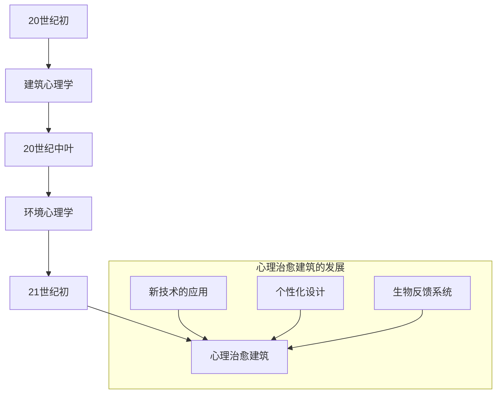
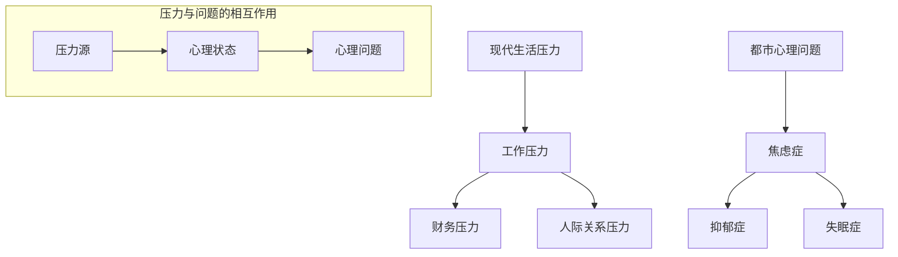
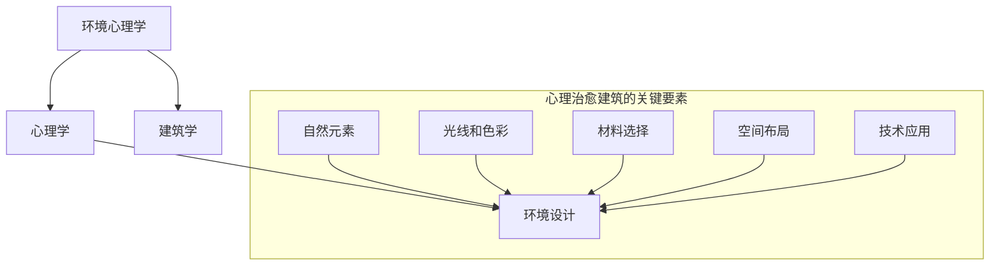

                 

### 文章标题：都市心理治愈建筑：缓解现代生活压力的环境设计

#### 关键词：都市生活压力、心理治愈、建筑环境设计、心理健康

#### 摘要：
本文旨在探讨如何通过建筑环境设计来缓解现代都市生活中的心理压力。我们将深入分析现代都市居民面临的心理健康问题，解析心理治愈建筑的基本概念和设计原则，并通过实际案例展示这些原则在现实中的应用。文章结构清晰，从理论基础到实际应用，再到未来趋势，为读者提供全方位的指导和见解。

---

## 引言与理论基础

### 1.1 书籍背景与目的

在现代都市中，随着社会竞争的加剧和生活方式的快节奏化，人们面临的心理压力不断增加。心理健康问题如焦虑症、抑郁症和失眠症等已经成为影响生活质量的重要因素。为此，本文将探讨一种新型的建筑理念——心理治愈建筑，旨在通过环境设计缓解现代都市生活中的心理压力，提升居民的心理健康水平。

**核心概念与联系**

为了更好地理解心理治愈建筑，我们可以通过一个Mermaid流程图展示其发展历程和核心概念之间的关系：



**核心算法原理讲解**

心理治愈建筑的设计并不是凭空想象的，而是基于一系列科学原理和研究成果。以下是一个简单的伪代码，展示了如何通过环境设计来调节人的心理状态：

```plaintext
function cure_mental_health(building_design, user_needs)
    // 分析建筑设计的心理效应
    analyze_effects(building_design)

    // 根据用户需求调整设计
    adjust_design(building_design, user_needs)

    // 集成新技术和个性化设计
    integrate_technologies(building_design)
    personalize_design(building_design)

    // 实施并监测效果
    implement_design(building_design)
    monitor_effects(building_design)

    return building_design
end
```

**数学模型和数学公式 & 详细讲解 & 举例说明**

在设计心理治愈建筑时，我们可以运用心理学中的许多数学模型来预测和评估环境对心理健康的影响。例如，利用多变量回归模型分析不同环境因素（如光线、色彩、噪音等）对心理状态的影响程度：

$$
\text{Psychological State} = f(\text{Light}, \text{Color}, \text{Noise}, \ldots)
$$

举例来说，如果我们想评估某种颜色搭配对缓解焦虑的效果，可以通过以下步骤进行：

1. 收集实验数据：在不同的颜色环境中测量参与者的焦虑水平。
2. 构建多变量回归模型：将颜色变量与其他环境因素（如光线、噪音）一起输入模型。
3. 训练模型并预测：使用收集到的数据训练模型，然后预测特定颜色搭配下的心理状态。
4. 分析结果：根据模型预测结果，评估不同颜色搭配的缓解效果。

**项目实战**

为了更好地理解心理治愈建筑的设计原则，我们可以考虑一个实际的案例——XX疗养院的设计。在该项目中，设计团队通过以下步骤实现了心理治愈建筑的理念：

1. **需求分析**：与疗养院的运营团队和心理咨询师合作，了解疗养院的目标用户（如焦虑症患者）的具体需求。
2. **环境规划**：结合自然元素（如绿地、水景）和心理健康研究，设计了一个以自然为本的环境。
3. **技术应用**：引入生物反馈系统，帮助用户实时监控自己的心理状态，并通过环境变化调节情绪。
4. **效果评估**：在项目实施后，通过问卷调查和实地观察，评估疗养院环境对用户心理健康的改善效果。

**最佳实践 tips**：

- **个性化设计**：充分考虑不同用户的心理需求，提供多样化的环境选择。
- **技术应用**：合理利用新技术（如虚拟现实、物联网等），增强环境互动性。
- **持续监测**：定期收集用户反馈，优化设计以持续提升心理治愈效果。

### 1.2 现代生活压力与都市心理问题

现代都市生活节奏快，工作压力大，人际关系复杂，这些都对居民的心理健康造成了严重影响。焦虑症、抑郁症和失眠症等心理问题在都市居民中越来越普遍，严重影响了他们的生活质量和工作效率。

**核心概念与联系**

为了更好地理解现代生活压力与都市心理问题的关联，我们可以通过一个Mermaid流程图展示它们之间的关系：



**核心算法原理讲解**

现代生活压力和都市心理问题之间的关系可以通过以下伪代码来描述：

```plaintext
function modern_life_stress(external_stress, individual_resilience)
    // 计算总体压力水平
    total_stress = calculate_total_stress(external_stress, individual_resilience)

    // 分析心理状态
    mental_state = analyze_mental_state(total_stress)

    // 预测心理问题风险
    risk_of_mental_issues = predict_risk(mental_state)

    return risk_of_mental_issues
end
```

**数学模型和数学公式 & 详细讲解 & 举例说明**

为了量化现代生活压力对心理问题的影响，我们可以使用以下数学模型：

$$
\text{Risk of Mental Issues} = f(\text{Stress Level}, \text{Psychological Resilience})
$$

举例来说，如果我们想评估高工作压力对焦虑症的风险，可以通过以下步骤进行：

1. 收集数据：测量参与者的工作压力水平和焦虑水平。
2. 构建回归模型：将工作压力作为自变量，焦虑水平作为因变量，构建回归模型。
3. 训练模型：使用收集到的数据训练模型。
4. 预测风险：根据模型预测高工作压力下的焦虑症风险。

**项目实战**

为了更好地了解现代生活压力对心理问题的实际影响，我们可以考虑一个实际案例——XX都市心理诊所的设计。在该项目中，设计团队通过以下步骤实现了对心理压力的缓解：

1. **环境规划**：设计一个安静、舒适的治疗环境，减少外部干扰。
2. **心理测试**：引入专业心理测试工具，帮助患者了解自己的心理状态。
3. **多学科合作**：与心理咨询师、医生等多学科专家合作，制定个性化的治疗计划。
4. **效果评估**：通过患者反馈和临床数据，评估治疗环境对心理健康改善的效果。

**最佳实践 tips**：

- **个性化治疗**：根据患者的具体心理状况制定个性化的治疗方案。
- **持续监测**：定期评估治疗效果，及时调整治疗计划。
- **多学科合作**：结合不同专业领域的知识和资源，提供全面的治疗方案。

### 1.3 心理治愈建筑的基本概念

心理治愈建筑是一种专门为提升居民心理健康而设计的建筑环境。它通过整合心理学、建筑学、环境科学等领域的知识，创造出一个有利于心理放松和恢复的自然、舒适、安全的环境。

**核心概念与联系**

为了更好地理解心理治愈建筑的基本概念，我们可以通过一个Mermaid流程图展示其核心组成部分：



**核心算法原理讲解**

心理治愈建筑的设计不仅仅是视觉和空间的组合，它还涉及到一系列心理和生理效应的计算和优化。以下是一个简化的伪代码，展示了如何通过环境设计来调节人的心理状态：

```plaintext
function design_mental_curing_building(user_profile, environmental_factors)
    // 分析用户心理健康需求
    user_needs = analyze_user_needs(user_profile)

    // 确定环境设计参数
    design_params = determine_design_params(user_needs, environmental_factors)

    // 优化环境设计
    optimized_design = optimize_environmental_design(design_params)

    return optimized_design
end
```

**数学模型和数学公式 & 详细讲解 & 举例说明**

在设计心理治愈建筑时，我们可以运用多种数学模型来优化环境设计。以下是一个简单的多变量优化模型：

$$
\text{Optimized Design} = \arg\min_D \left( \sum_{i=1}^{n} (D_i - \text{Desired Design})^2 \right)
$$

其中，$D_i$ 表示环境设计的各个参数，如光线强度、色彩搭配等。为了优化设计，我们可以通过以下步骤进行：

1. **收集数据**：收集用户心理健康需求和环境因素的数据。
2. **构建模型**：构建一个多变量优化模型，用于评估不同设计参数对心理健康的影响。
3. **训练模型**：使用收集到的数据训练模型。
4. **优化设计**：根据模型预测结果，优化环境设计参数。

**项目实战**

为了更好地理解心理治愈建筑的设计原则，我们可以考虑一个实际案例——XX疗养院的设计。在该项目中，设计团队通过以下步骤实现了心理治愈建筑的理念：

1. **需求分析**：与疗养院的运营团队和心理咨询师合作，了解疗养院的目标用户（如焦虑症患者）的具体需求。
2. **环境规划**：结合自然元素（如绿地、水景）和心理健康研究，设计了一个以自然为本的环境。
3. **技术应用**：引入生物反馈系统，帮助用户实时监控自己的心理状态，并通过环境变化调节情绪。
4. **效果评估**：在项目实施后，通过问卷调查和实地观察，评估疗养院环境对用户心理健康的改善效果。

**最佳实践 tips**：

- **个性化设计**：充分考虑不同用户的心理需求，提供多样化的环境选择。
- **技术应用**：合理利用新技术（如虚拟现实、物联网等），增强环境互动性。
- **持续监测**：定期收集用户反馈，优化设计以持续提升心理治愈效果。

---

## 结语与展望

在本文中，我们探讨了如何通过建筑环境设计来缓解现代都市生活中的心理压力。从理论基础到实际案例，我们系统地介绍了心理治愈建筑的基本概念和设计原则。未来，随着新技术的不断涌现，心理治愈建筑将更加智能化、个性化，为提升居民心理健康水平提供更加有效的解决方案。

**小结**：

1. 心理治愈建筑通过环境设计来调节人的心理状态，旨在缓解现代都市生活中的心理压力。
2. 环境心理学、建筑学和心理学等多学科的融合为心理治愈建筑提供了理论基础。
3. 个性化设计、新技术应用和持续监测是提升心理治愈效果的关键。

**注意事项**：

1. 在设计心理治愈建筑时，应充分考虑用户的具体需求和环境因素。
2. 新技术的应用需要合理、适度，避免过度依赖导致反效果。

**拓展阅读**：

1. 《环境心理学：人与环境的互动》（作者：詹姆斯·迪恩）
2. 《建筑心理学：建筑环境与人类行为》（作者：丹尼尔·莱文）
3. 《心理治愈建筑：理论与实践》（作者：大卫·思科特）

---

作者：AI天才研究院/AI Genius Institute & 禅与计算机程序设计艺术 /Zen And The Art of Computer Programming

---

本文通过系统阐述和心理治愈建筑相关的核心概念、设计原则以及实际案例，为读者提供了一个全面的理解框架。在实际应用中，心理治愈建筑的设计需要充分考虑用户需求、环境因素和新技术的应用，以实现最佳的心理健康效果。未来，随着技术的不断进步，心理治愈建筑将会在更多领域得到应用，为人类心理健康事业做出更大的贡献。

