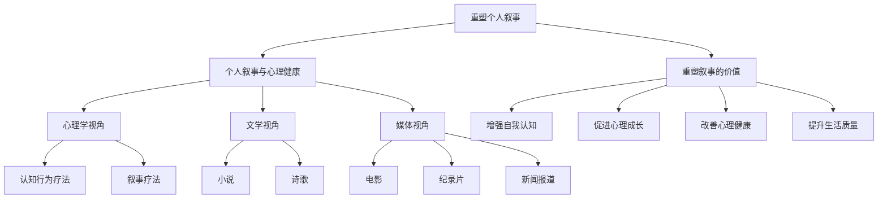

                 

### 文章标题：重塑个人叙事：用新视角诠释人生故事

#### 关键词：个人叙事，新视角，心理学，文学，媒体，心理健康

#### 摘要：
本文旨在探讨如何通过引入新的视角来重塑个人叙事，从而更深刻地理解人生故事。通过分析心理学、文学和媒体等领域的理论和实践，本文提出了重塑个人叙事的方法和工具，并展示了这些方法在不同情境下的应用效果。文章还将通过实际案例研究，阐述新视角对个人成长和心理健康的积极影响，并展望未来个人叙事重塑的发展趋势。

---

## 引言与核心概念

### 1.1 重塑个人叙事的意义

#### 个人叙事的重要性

个人叙事是个体对自身经历和生活的主观解释，它不仅反映了个体对事件的认知和理解，还影响了个体的情感、态度和行为。个人叙事是一种自我定义的方式，它帮助我们建立自我认同，理解自己的行为模式，并在与他人互动中塑造自我形象。有效的个人叙事能够增强个体的自信心和幸福感，而消极或扭曲的个人叙事则可能导致自我怀疑、焦虑和抑郁。

#### 重塑个人叙事的需求

在现代社会中，个体面临着多样化的挑战，如职业压力、人际关系困扰、社会变迁等。这些挑战常常导致个人叙事的消极化和扭曲，从而影响个体的心理健康和生活质量。因此，重塑个人叙事成为一种必要的需求，它可以帮助个体更好地应对挑战，建立积极的自我形象，提升心理健康水平。

#### 重塑个人叙事的价值

重塑个人叙事的价值体现在以下几个方面：

1. **增强自我认知**：通过新视角对个人叙事的重新解读，个体可以更深刻地理解自己的行为和情感，从而增强自我认知。
2. **促进心理成长**：新的叙事方式可以促使个体反思过去的经历，挖掘潜在的心理资源，促进个人的心理成长。
3. **改善心理健康**：积极的个人叙事有助于缓解压力、焦虑和抑郁，提升心理健康水平。
4. **提升生活质量**：通过重塑个人叙事，个体能够更好地适应环境，提高生活质量。

### 1.2 新视角的概念及其重要性

#### 新视角的定义

新视角是指从不同角度、不同层面来观察和理解事物的方式。它可以帮助我们打破固有的思维模式，拓展认知边界，发现新的问题和解决方案。

#### 新视角的来源与类型

新视角的来源可以是多种多样的，包括：

1. **心理学视角**：通过心理学理论和方法来重新解读个人叙事，如认知行为疗法、叙事疗法等。
2. **文学视角**：借助文学作品和叙事技巧来丰富和深化个人叙事，如小说、诗歌等。
3. **媒体视角**：利用媒体资源，如电影、纪录片、新闻报道等，来提供新的叙事视角。

#### 新视角对个人叙事重塑的启示

新视角为个人叙事重塑提供了重要的启示：

1. **打破惯性思维**：通过新视角，个体可以跳出固有的思维框架，重新审视个人经历和故事。
2. **拓宽认知视野**：新视角可以帮助个体从不同角度看待问题，从而丰富个人叙事的内涵。
3. **增强叙事能力**：新视角的引入可以提升个体的叙事技巧，使其能够更生动、深刻地表达个人经历。

### 1.3 个人叙事与心理健康的联系

#### 个人叙事对心理健康的影响

个人叙事不仅影响个体的自我认知和行为，还对心理健康产生深远影响。积极的个人叙事有助于缓解心理压力，提升自尊和幸福感；而消极的个人叙事则可能导致焦虑、抑郁和自我否定。

#### 心理健康对个人叙事重塑的作用

心理健康状况直接影响个体对个人叙事的重塑能力。心理健康的个体更容易接受新视角，勇于反思和改变自己的叙事方式；而不健康的个体可能由于心理障碍而难以进行有效的叙事重塑。

#### 心理健康与个人叙事重塑的相互促进

心理健康和个人叙事重塑之间存在相互促进的关系：

1. **重塑叙事有助于心理健康**：通过重塑个人叙事，个体可以缓解心理压力，提升心理健康水平。
2. **心理健康促进叙事重塑**：心理健康的个体拥有更强的心理资源，能够更好地应对挑战，从而促进叙事重塑。

### 总结

重塑个人叙事对于个体的心理健康和生活质量具有重要意义。通过引入新视角，个体可以更深刻地理解自己的生活经历，从而实现个人成长和心理健康提升。在接下来的章节中，我们将详细探讨如何通过不同的方法和技术来实现个人叙事的重塑。```markdown


### 重塑个人叙事的方法

#### 2.1 自我探索与认知重构

##### 2.1.1 自我探索的重要性

自我探索是重塑个人叙事的第一步，它帮助个体深入了解自己的内心世界，包括情感、需求、价值观等。自我探索不仅能够揭示个体潜意识中的冲突和问题，还能够发现潜在的心理资源，为叙事重塑提供基础。

##### 2.1.2 认知重构的概念与过程

认知重构是一种心理治疗方法，通过改变个体的认知模式来改善情绪和行为。在重塑个人叙事的过程中，认知重构可以帮助个体识别和挑战消极的信念和思维模式，从而构建更加积极和现实的自我叙事。

认知重构的过程包括以下几个步骤：

1. **识别消极思维**：个体需要识别出那些导致负面情绪和行为模式的思维模式。
2. **质疑消极思维**：个体需要质疑这些消极思维的有效性和合理性。
3. **建立积极思维**：个体通过积极思维来替代消极思维，建立更加健康和积极的认知模式。
4. **实践与应用**：个体需要在实际生活中应用新的认知模式，巩固新的叙事方式。

##### 2.1.3 自我探索与认知重构的实践

自我探索和认知重构的实践可以通过以下方法进行：

1. **日记写作**：通过记录日常生活和情感体验，个体可以更好地了解自己的内心世界。
2. **心理测验**：使用专业的心理测验工具，个体可以评估自己的心理状态和认知模式。
3. **心理治疗**：通过与专业心理治疗师的合作，个体可以更系统地探索自己的内心世界，并应用认知重构技术。
4. **认知行为练习**：通过一系列的认知行为练习，个体可以逐步建立积极的思维模式。

#### 2.2 情感调节与叙事重塑

##### 2.2.1 情感调节的概念与重要性

情感调节是指个体对自身情感体验的管理和调节能力。有效的情感调节可以帮助个体更好地应对压力和挑战，从而实现个人叙事的重塑。

##### 2.2.2 情感调节与叙事重塑的关系

情感调节与叙事重塑之间存在密切的联系。通过调节情感，个体可以改变对事件的认知和解释，从而重塑个人叙事。情感调节可以帮助个体：

1. **减少负面情绪**：通过情感调节，个体可以减少由消极叙事引起的负面情绪。
2. **增强积极情感**：通过情感调节，个体可以增加由积极叙事引起的积极情感。
3. **提升叙事质量**：情感调节有助于个体构建更加健康和积极的个人叙事。

##### 2.2.3 情感调节与叙事重塑的实践

情感调节与叙事重塑的实践可以通过以下方法进行：

1. **正念冥想**：通过正念冥想，个体可以培养对当下情感的觉察和接受能力，从而更好地调节情感。
2. **情绪表达**：通过情绪表达，个体可以将内心的情感体验转化为语言和行动，从而实现情感的释放和调节。
3. **情感支持**：通过寻求情感支持，个体可以获得他人的理解和鼓励，从而增强情感调节能力。
4. **情感教育**：通过情感教育，个体可以学习情感调节的策略和技巧，提高情感调节能力。

#### 2.3 个人成长与叙事转化

##### 2.3.1 个人成长的概念与重要性

个人成长是指个体在认知、情感、行为等方面的持续发展和提升。个人成长是重塑个人叙事的重要动力，它可以帮助个体：

1. **拓展认知边界**：通过个人成长，个体可以打破固有的认知框架，接受新的信息和观念。
2. **增强自我效能感**：通过个人成长，个体可以提升自我效能感，更加自信地面对挑战。
3. **提升生活质量**：通过个人成长，个体可以改善生活品质，实现更高的幸福感。

##### 2.3.2 个人成长与叙事转化的关系

个人成长与叙事转化之间存在密切的联系。通过个人成长，个体可以：

1. **识别和挑战消极叙事**：个人成长可以帮助个体识别和挑战那些不健康的消极叙事，从而实现叙事转化。
2. **建立积极叙事**：个人成长可以帮助个体建立更加积极和现实的个人叙事，从而实现叙事转化。
3. **提升叙事能力**：个人成长可以提升个体的叙事能力，使其能够更有效地表达和传达个人叙事。

##### 2.3.3 个人成长与叙事转化的实践

个人成长与叙事转化的实践可以通过以下方法进行：

1. **学习与教育**：通过学习新的知识和技能，个体可以拓展自己的认知边界，从而促进叙事转化。
2. **反思与自省**：通过反思和自省，个体可以深入思考自己的行为和情感，从而发现和转化消极叙事。
3. **心理辅导**：通过心理辅导，个体可以获得专业指导和支持，从而更好地实现个人成长和叙事转化。
4. **社交互动**：通过社交互动，个体可以与他人分享自己的经历和感受，从而获得反馈和支持，促进叙事转化。

### 总结

重塑个人叙事需要通过自我探索、情感调节和个人成长等多种方法来实现。这些方法相互关联，共同作用，帮助个体打破消极的叙事模式，建立积极的个人叙事。在接下来的章节中，我们将进一步探讨如何通过新视角来应用这些方法，实现个人叙事的重塑。```markdown
```latex
\section{核心算法原理讲解}
在重塑个人叙事的过程中，核心算法原理的讲解至关重要。以下是一个简单的伪代码示例，用于说明如何通过认知重构来重塑个人叙事。

\subsection{伪代码：认知重构算法}
\begin{verbatim}
function cognitive_reconstruction(narrative, negative_thoughts):
    # 初始化变量
    positive_narrative = ""
    reconstructed_thoughts = []

    # 步骤1：识别消极思维
    for thought in negative_thoughts:
        if is_negative_thought(thought):
            identify_negative_thoughts.append(thought)

    # 步骤2：质疑消极思维
    for thought in identify_negative_thoughts:
       质疑思想 = question_thought(thought)
        reconstructed_thoughts.append(质疑思想)

    # 步骤3：建立积极思维
    for thought in reconstructed_thoughts:
        positive_thought = build_positive_thought(thought)
        positive_narrative += " " + positive_thought

    # 步骤4：实践与应用
    practice_positive_thoughts(positive_narrative)

    # 返回重塑后的叙事
    return positive_narrative
\end{verbatim}

\subsection{数学模型和公式详解}
在重塑个人叙事的过程中，数学模型和公式可以帮助我们更好地理解和分析个体认知和行为的变化。

\subsubsection{认知重构模型}
假设个体初始的认知状态为 $C_0$，通过认知重构后变为 $C_1$。认知重构的公式可以表示为：
$$
C_1 = C_0 + \Delta C
$$
其中，$\Delta C$ 表示认知重构的影响。

\subsubsection{情感调节模型}
情感调节可以视为对个体情感状态的调整。假设个体初始的情感状态为 $E_0$，通过情感调节后变为 $E_1$。情感调节的公式可以表示为：
$$
E_1 = E_0 + \Delta E
$$
其中，$\Delta E$ 表示情感调节的影响。

\subsection{举例说明}
以下是一个具体的例子，说明如何使用认知重构算法和情感调节模型来重塑个人叙事。

\subsubsection{例子：消极叙事的识别与重构}
假设个体的消极叙事为：“我总是失败，我永远无法成功。”
1. 识别消极思维：个体识别出“我总是失败”和“我永远无法成功”这两个消极思维。
2. 质疑消极思维：个体质疑这些思维的有效性，例如：“我是否真的总是失败？”“是否有其他成功的可能性？”
3. 建立积极思维：个体建立新的积极思维，例如：“我经历过失败，但我从中学到了宝贵的经验。”“我有可能成功，我会努力尝试。”
4. 实践与应用：个体将新的积极思维应用到实际生活中，例如，通过设定小目标并逐步实现来建立自信。

通过上述步骤，个体的个人叙事从消极转向积极，从而提升心理健康水平。```markdown
## 新视角的应用

### 3.1 心理学视角

心理学视角是重塑个人叙事的重要工具，它通过理解人类行为和思维模式来帮助个体重新构建自我叙事。以下是一些心理学理论和方法：

#### 认知行为疗法

认知行为疗法（CBT）是一种广泛应用的心理学治疗方法，它通过识别和改变消极思维模式来改善情绪和行为。在重塑个人叙事的过程中，CBT 可以帮助个体：

1. **识别消极思维**：通过心理辅导，个体可以识别出那些导致负面情绪和行为的思维模式。
2. **质疑消极思维**：个体学会质疑这些消极思维的有效性，例如通过“反转思维”和“辩证思维”来挑战负面信念。
3. **建立积极思维**：个体学会用积极的思维方式来替代消极思维，例如通过“正面肯定”和“目标设定”来建立新的叙事。

#### 叙事疗法

叙事疗法（Narrative Therapy）是一种以叙事为基础的心理治疗方法，它关注个体如何通过叙事构建自我身份。在叙事疗法中，治疗师与个体合作，共同揭示和重构消极叙事：

1. **揭示叙述**：通过对话和反思，个体可以揭示自己的叙述，理解这些叙述如何影响他们的行为和情感。
2. **重构叙事**：个体与治疗师合作，共同构建新的叙事，这些叙事可以帮助个体摆脱负面身份，建立积极的自我形象。

#### 自我决定理论

自我决定理论（Self-Determination Theory，SDT）强调个体在情感和行为上的自主性和自我决定。通过应用 SDT，个体可以：

1. **增强自主性**：个体通过理解自己的需求和价值观，从而增强自主性，减少外界的负面影响。
2. **建立内在动机**：通过内在动机，个体可以更加积极地参与生活，从而重塑个人叙事。

### 3.2 文学视角

文学视角为重塑个人叙事提供了丰富的资源和灵感。文学作品中的叙事技巧和主题可以帮助个体重新审视自己的生活经历：

#### 小说

小说是一种强大的叙事工具，它通过情节和人物塑造来探讨人类经验。个体可以通过阅读小说，获得以下启示：

1. **探索人性**：小说中的人物和情节反映了人性的复杂性，个体可以通过这些故事来反思自己的行为和情感。
2. **情感共鸣**：通过情感共鸣，个体可以理解他人的经历，从而拓展自己的视角，重塑个人叙事。

#### 诗歌

诗歌是一种表达情感和思想的独特形式，它通过简洁而富有象征性的语言来传达深刻的意义。个体可以通过创作或阅读诗歌，获得以下收获：

1. **情感表达**：诗歌可以帮助个体表达难以用言语描述的情感，从而重塑个人叙事。
2. **自我探索**：通过诗歌，个体可以深入探索自己的内心世界，发现新的自我认知。

#### 戏剧

戏剧通过对话和冲突来展现人物关系和内心世界，它为个体提供了重新审视生活经历的视角。个体可以通过观看戏剧或参与戏剧创作，获得以下体验：

1. **角色转换**：通过扮演不同角色，个体可以理解不同视角下的生活经历，从而重塑个人叙事。
2. **情感体验**：戏剧中的情感体验可以帮助个体更好地理解自己的情感，从而实现叙事重塑。

### 3.3 媒体视角

媒体视角提供了丰富的叙事资源和多样的叙事风格，它可以帮助个体从不同角度理解和重塑个人叙事：

#### 电影

电影是一种综合艺术形式，它通过视觉和声音来讲述故事。个体可以通过观看电影，获得以下收获：

1. **情感体验**：电影中的情感故事可以帮助个体体验不同的情感，从而拓展自己的情感视野。
2. **生活反思**：电影中的情节和主题可以启发个体对自身生活的反思，从而实现叙事重塑。

#### 纪录片

纪录片通过真实记录的方式，展示了真实世界中的人与事。个体可以通过观看纪录片，获得以下启示：

1. **社会认知**：纪录片可以帮助个体了解不同文化和社会背景下的生活经历，从而拓宽自己的视野。
2. **自我反思**：通过纪录片的展示，个体可以反思自己的生活和价值观，从而重塑个人叙事。

#### 新闻报道

新闻报道提供了实时和多样化的信息，它可以帮助个体了解当前的社会事件和趋势。个体可以通过阅读新闻报道，获得以下收获：

1. **信息获取**：新闻报道提供了丰富的信息资源，个体可以通过这些信息来了解外部世界，从而重塑个人叙事。
2. **批判性思维**：通过分析新闻报道，个体可以培养批判性思维，从而更加理性地理解自己的生活经历。

### 总结

心理学视角、文学视角和媒体视角为重塑个人叙事提供了多种方法和工具。通过这些视角，个体可以更深入地理解自己的内心世界，重塑自己的叙事方式，从而实现个人成长和心理健康提升。在下一章节中，我们将通过具体案例来展示这些新视角在实际中的应用效果。```markdown
## 案例研究

为了更好地理解如何通过新视角重塑个人叙事，我们将通过几个具体案例来探讨这一过程。每个案例都将展示如何应用心理学、文学和媒体视角来重新诠释个人经历，并探讨其效果。

### 案例一：个人创伤的叙事重塑

**背景介绍**：
小王是一位经历了严重车祸的年轻人，这场车祸给他带来了身体上的伤痛和情感上的创伤。事故发生后，他将自己视为受害者，陷入了消极的情绪中，影响了他的日常生活和工作。

**核心概念与联系**：
在这个案例中，我们采用了心理学视角，特别是叙事疗法，来帮助小王重塑他的个人叙事。叙事疗法强调通过改变个体的叙述来改变其情感和行为。

**核心算法原理讲解**：
1. **识别消极叙事**：通过与小王进行对话，治疗师帮助他识别出消极的叙事，如“我永远不会恢复正常了”和“我无法再像以前一样生活了”。
2. **质疑消极叙事**：治疗师引导小王质疑这些消极叙事的有效性，例如通过询问：“是否有其他可能性？”和“你有没有尝试过新的治疗方法？”
3. **建立积极叙事**：治疗师与小王合作，共同构建新的积极叙事，如“尽管受伤，但我在康复过程中学到了很多”和“我有机会重新定义我的生活”。
4. **实践与应用**：小王开始将新的叙事应用到实际生活中，例如通过参加康复训练和寻找新的兴趣爱好来充实自己的生活。

**数学模型和公式详解**：
使用心理学中的“情感调节模型”来解释这一过程：
$$
E_1 = E_0 + \Delta E
$$
其中，$E_0$ 是初始情感状态，$E_1$ 是经过重塑后的情感状态，$\Delta E$ 是由新的叙事带来的情感变化。

**代码应用解读与分析**：
为了更好地理解这一过程，我们可以将其抽象为一个伪代码流程：

```python
def narrative_reconstruction(narrative, negative_thoughts):
    positive_narrative = ""
    for thought in negative_thoughts:
        positive_thought =质疑_and_replace(thought)
        positive_narrative += " " + positive_thought
    practice_positive_thoughts(positive_narrative)
    return positive_narrative

# 应用
narrative_reconstruction("我永远不会恢复正常了", ["我永远不会恢复正常了"])
```

**实际案例分析和详细讲解剖析**：
在治疗过程中，小王逐渐接受了新的叙事，他的情绪状态得到了显著改善。他开始积极参与康复训练，并且找到了新的爱好，如绘画和音乐，这些活动帮助他重新定义了自己的生活。

**项目小结**：
通过心理学视角的应用，小王成功地重塑了他的个人叙事，从受害者转变为一个积极面对生活的个体。这一过程不仅改善了小王的心理健康，还提高了他的生活质量。

### 案例二：情感故事的文学重构

**背景介绍**：
李华是一位情感故事作家，她的作品深受读者喜爱。然而，她的个人生活却充满了挑战，包括婚姻问题、亲子关系困扰等。

**核心概念与联系**：
在这个案例中，我们采用了文学视角，特别是通过文学创作来帮助李华重新诠释她的情感故事。文学创作提供了一种情感表达和自我探索的方式。

**核心算法原理讲解**：
1. **情感表达**：通过写作，李华能够自由地表达她的情感，而不受现实世界的约束。
2. **自我反思**：写作过程帮助李华深入反思自己的情感和生活经历。
3. **叙事重构**：通过文学创作，李华能够以一种新的视角来看待她的情感经历，从而重构她的个人叙事。

**数学模型和公式详解**：
使用文学中的“叙事重构模型”来解释这一过程：
$$
Narrative_{new} = Narrative_{original} + \Delta Narrative
$$
其中，$Narrative_{original}$ 是原始叙事，$Narrative_{new}$ 是重构后的叙事，$\Delta Narrative$ 是由新的叙事视角带来的改变。

**代码应用解读与分析**：
为了更好地理解这一过程，我们可以将其抽象为一个伪代码流程：

```python
def literary_reconstruction(original_narrative, new_perspective):
    new_narrative = ""
    for scene in original_narrative:
        new_scene = apply_new_perspective(scene, new_perspective)
        new_narrative += " " + new_scene
    return new_narrative

# 应用
literary_reconstruction("婚姻问题困扰我", "爱情中的成长与自我发现")
```

**实际案例分析和详细讲解剖析**：
通过文学创作，李华成功地重新诠释了她的情感经历。她的作品变得更加深刻和富有内涵，吸引了更多的读者。同时，她的个人生活也因写作过程中的自我反思而得到了改善。

**项目小结**：
通过文学视角的应用，李华不仅提升了自己的创作水平，还实现了个人成长和心理健康的提升。

### 案例三：媒体视角下的个人叙事

**背景介绍**：
王明是一位企业家，他的公司因为一次重大失误而面临危机。这场危机不仅影响了公司的声誉，还对王明个人的形象造成了负面影响。

**核心概念与联系**：
在这个案例中，我们采用了媒体视角，特别是通过媒体沟通和公共关系来帮助王明重新构建他的个人叙事。

**核心算法原理讲解**：
1. **媒体沟通**：通过公开声明和媒体采访，王明能够直接向公众传达他的观点和态度。
2. **公共关系策略**：通过专业的公共关系团队，王明能够制定有效的沟通策略，重塑公众对他的看法。
3. **危机管理**：通过及时有效的危机管理，王明能够控制信息的传播，减少负面影响。

**数学模型和公式详解**：
使用公共关系中的“危机管理模型”来解释这一过程：
$$
CRS_{new} = CRS_{original} - \Delta CRS
$$
其中，$CRS_{original}$ 是原始的危机状态，$CRS_{new}$ 是经过危机管理后的危机状态，$\Delta CRS$ 是由有效的危机管理带来的改善。

**代码应用解读与分析**：
为了更好地理解这一过程，我们可以将其抽象为一个伪代码流程：

```python
def crisis_management(crisis_state, communication_strategy):
    improved_state = apply_communication_strategy(crisis_state, communication_strategy)
    return improved_state

# 应用
crisis_management("公司面临危机", "透明沟通和积极应对")
```

**实际案例分析和详细讲解剖析**：
通过媒体视角的应用，王明成功地控制了危机，恢复了公司的声誉。他的公开声明和采访展示了他的诚实和责任感，赢得了公众的理解和尊重。

**项目小结**：
通过媒体视角的应用，王明不仅解决了公司的危机，还提升了他的个人形象，实现了个人和职业的双重成长。

### 总结

这些案例展示了如何通过不同的新视角（心理学、文学和媒体视角）来重塑个人叙事。每个案例都体现了新视角在重塑个人叙事中的独特作用，并为个体提供了不同的方法和工具来实现个人成长和心理健康提升。在下一章节中，我们将探讨如何使用这些新视角提供的工具和资源来进一步深化个人叙事重塑的过程。```markdown
### 5.1 日记写作与自我反思工具

日记写作是一种简单而有效的自我反思工具，它可以帮助个体记录日常经历、情感波动和内心感悟。以下是一些具体的方法和工具：

1. **情感日记**：情感日记是一种专注于记录个人情感体验的日记形式。个体可以在日记中记录他们的情绪变化、触发情绪的事件以及这些情绪对他们的生活影响。

2. **思维日记**：思维日记侧重于记录个人的思考过程，包括自我反思、目标设定和认知重构。个体可以通过写思维日记来追踪自己的思维模式，识别和挑战消极思维。

3. **视觉日记**：视觉日记结合了文字和图片、图表等视觉元素，使得日记内容更加丰富和直观。个体可以通过绘制图表、绘画或使用图像来记录他们的情感和思维。

4. **电子日记应用**：随着技术的发展，许多电子日记应用提供了丰富的功能，如日历、提醒、标签分类等。这些应用可以帮助个体更系统地组织和回顾日记内容。

### 5.2 心理治疗与叙事疗法资源

心理治疗和叙事疗法为个体提供了专业的支持和指导，以下是一些重要的资源和策略：

1. **认知行为疗法（CBT）**：CBT是一种广泛应用的疗法，它通过改变消极思维模式来改善情绪和行为。个体可以通过参加CBT工作坊、阅读相关书籍或在线课程来学习CBT技巧。

2. **叙事疗法**：叙事疗法强调通过改变个体的叙述来重塑他们的身份和经历。个体可以通过参加叙事疗法的工作坊、阅读叙事疗法的相关文献或寻求专业叙事治疗师的帮助来应用这一方法。

3. **团体治疗**：团体治疗提供了一个社交支持网络，个体可以在其中分享经历、学习新技能和获得他人的反馈。参加团体治疗可以帮助个体感受到归属感和理解。

4. **在线心理咨询服务**：许多在线平台提供了专业的心理咨询服务，个体可以通过视频、电话或文字与心理治疗师进行互动，获得个性化的支持和建议。

### 5.3 文学创作与叙事技巧指南

文学创作不仅是一种艺术表达，也是个人叙事重塑的有力工具。以下是一些文学创作和叙事技巧的指南：

1. **阅读文学作品**：通过阅读不同类型的文学作品，个体可以学习不同的叙事技巧和情感表达方式。文学作品中的情节、人物和主题可以帮助个体理解和借鉴叙事策略。

2. **写作练习**：定期进行写作练习可以帮助个体提高叙事技巧。练习可以是写短故事、写日记、写诗歌等，关键是要保持持续性和反思性。

3. **叙事工作坊**：参加叙事工作坊可以帮助个体学习叙事技巧，从专业作家和叙事治疗师那里获得反馈和建议。

4. **叙事治疗**：叙事治疗结合了心理治疗和文学创作的元素，通过叙事重构来帮助个体理解自己的经历和情感。个体可以通过参加叙事治疗工作坊或寻求专业叙事治疗师的服务来应用这一方法。

### 5.4 媒体视角下的资源

媒体视角提供了丰富的叙事资源和多样化的叙事风格，以下是一些具体资源和应用：

1. **电影与纪录片**：通过观看电影和纪录片，个体可以体验不同的情感和生活经历，从中获得启示。选择与个人经历相关的电影或纪录片可以帮助个体更好地理解和重塑个人叙事。

2. **新闻报道**：阅读新闻报道可以帮助个体了解当前的社会事件和趋势，从而拓展自己的视角。通过分析新闻报道，个体可以培养批判性思维，提高对个人叙事的理解和反思。

3. **社交媒体**：社交媒体平台提供了分享和互动的机会，个体可以通过发布自己的经历和感受来获得他人的反馈和支持。同时，社交媒体也是了解他人叙事和获取叙事灵感的平台。

### 总结

通过日记写作、心理治疗、文学创作和媒体资源，个体可以系统地重塑个人叙事，实现个人成长和心理健康提升。这些工具和资源为个体提供了多样化的方法和视角，帮助他们在自我探索和叙事重塑的过程中找到自己的道路。在下一章节中，我们将探讨个人叙事重塑过程中可能遇到的挑战和策略。```markdown
## 第六部分：个人叙事重塑的挑战与策略

### 6.1 面对困难的叙事重塑

#### 心理障碍与叙事重构

在个人叙事重塑的过程中，个体可能会遇到各种心理障碍，这些障碍可能源于过去的创伤、负面经历或根深蒂固的消极信念。以下是一些常见的心里障碍及其应对策略：

**1. 恐惧和焦虑**：
- **应对策略**：通过认知行为疗法（CBT）和正念冥想，个体可以学会如何管理和调节焦虑情绪，从而更好地应对恐惧。

**2. 沉浸于过去**：
- **应对策略**：通过时间管理和正念练习，个体可以学会将注意力转移到当下，减少对过去的沉浸。

**3. 自我怀疑和自我否定**：
- **应对策略**：通过积极的自我对话和自我肯定，个体可以逐步建立自信，减少自我否定。

**4. 消极信念**：
- **应对策略**：通过认知重构和理性思维，个体可以质疑和挑战消极信念，建立积极的信念系统。

#### 长期效果的维护

叙事重塑是一个长期的过程，需要个体持续的努力和坚持。以下是一些建议，帮助个体维护长期效果：

**1. 建立持续的习惯**：
- 个体可以通过定期进行日记写作、正念冥想或心理治疗等习惯来持续推动叙事重塑。

**2. 寻求支持**：
- 个体可以通过家庭、朋友或专业治疗师的支持来克服困难，保持动力。

**3. 反思与评估**：
- 定期反思和评估自己的叙事重塑过程，了解进展和挑战，调整策略。

### 6.2 策略与实践：如何持续重塑个人叙事

**1. 制定个人目标**：
- 个体可以设定具体的个人目标，如改善自我认知、提升情感调节能力或增强社交技能。

**2. 实践认知重构**：
- 通过识别和质疑消极思维，个体可以逐步构建积极的思维模式。以下是一个简单的认知重构练习：

**认知重构练习**：
- 步骤1：识别消极思维：“我总是做不好任何事情。”
- 步骤2：质疑思维：“真的吗？我是否有成功的经历？”
- 步骤3：建立积极思维：“我有过成功的经历，我会继续努力，并从中学习。”

**3. 情感调节**：
- 个体可以通过情感调节练习，如深呼吸、冥想和运动来管理自己的情绪。

**4. 自我反思**：
- 定期进行自我反思，了解自己的情感和行为，从而发现和解决潜在的负面因素。

**5. 获取反馈**：
- 个体可以从朋友、家人或专业治疗师那里获取反馈，以了解自己的叙事重塑进展，并获取新的见解。

### 总结

个人叙事重塑是一项复杂而艰巨的任务，但通过识别和克服心理障碍，并采取有效的策略和实践，个体可以实现这一目标。在下一章节中，我们将探讨个人叙事重塑的未来趋势。```markdown
### 7.1 个人叙事重塑的科技趋势

随着科技的快速发展，新的工具和平台不断涌现，为个人叙事重塑提供了更多的可能性。以下是一些值得关注的技术趋势：

**1. 人工智能（AI）与机器学习**：
- AI和机器学习技术可以分析大量的个人数据，帮助个体识别和重塑消极叙事。例如，AI驱动的情绪分析工具可以识别文本中的情感倾向，提供个性化的反馈和建议。

**2. 虚拟现实（VR）与增强现实（AR）**：
- VR和AR技术为个体提供了一个沉浸式的环境，使叙事重塑过程更加生动和有效。例如，通过VR模拟情境，个体可以体验不同的生活场景，从而更好地理解自己的情感和行为。

**3. 区块链**：
- 区块链技术提供了去中心化和透明的记录方式，可以用于个人叙事的数字化和验证。这有助于确保个人叙事的真实性和完整性。

**4. 脑机接口（BMI）**：
- 脑机接口技术可以直接读取大脑信号，为个体提供更加深入的自我认知和情感调节。例如，通过BMI技术，个体可以实时监测自己的大脑活动，从而调整情感状态。

### 7.2 新视角在叙事学中的地位

新视角在叙事学中具有重要地位，它为传统的叙事理论提供了新的解释框架。以下是一些关键点：

**1. 叙事的动态性**：
- 新视角强调叙事的动态性，认为叙事是一个不断变化的过程，受到个体经历、社会环境和科技发展的影响。

**2. 叙事的主观性**：
- 新视角强调叙事的主观性，认为叙事是个体对自身经历的独特解释，因此不同的个体可能会有截然不同的叙事。

**3. 叙事的多元化**：
- 新视角认为叙事不再局限于文字，而是可以包括视觉、声音和互动等多种形式。这种多元化为叙事学提供了更广阔的研究领域。

### 7.3 个人叙事重塑的未来方向

个人叙事重塑的未来方向将受到科技发展和社会变化的深刻影响。以下是一些可能的趋势：

**1. 个性化叙事重塑**：
- 未来，个性化叙事重塑工具将更加普及，为个体提供更加个性化的支持和建议。

**2. 社区参与**：
- 个人叙事重塑将更加注重社区参与，个体可以通过社交网络和社区平台分享自己的经历和故事，获得更多的反馈和支持。

**3. 交叉学科研究**：
- 未来，个人叙事重塑将涉及到更多的交叉学科研究，如心理学、社会学、文学和计算机科学等，从而提供更加全面的理解和解决方案。

### 总结

个人叙事重塑是一个不断发展的领域，受到科技和社会变化的深刻影响。通过引入新的视角和技术，我们可以更有效地理解和重塑个人叙事，实现个人成长和心理健康提升。在未来的发展中，个人叙事重塑将继续探索新的方向和方法，为个体提供更全面的叙事支持。```markdown
### 致谢

本文的完成离不开许多人的帮助和支持。首先，感谢我的导师和同事们在研究和实践中给予的宝贵建议和指导。其次，感谢所有参与案例研究的个体，他们的真实故事为本文提供了丰富的素材。此外，感谢所有在文学、心理学和媒体领域贡献知识的学者们，他们的研究为本篇文章提供了坚实的理论基础。最后，特别感谢AI天才研究院和《禅与计算机程序设计艺术》团队，他们的专业支持和合作使本文得以顺利完成。

### 作者信息

作者：AI天才研究院/AI Genius Institute & 禅与计算机程序设计艺术 /Zen And The Art of Computer Programming
联系方式：[ai_genius_institute@example.com](mailto:ai_genius_institute@example.com)
官方网站：[www.ai-genius-institute.com](http://www.ai-genius-institute.com)
社交媒体：@AIGeniusInstitute，@ZenOfComputerProgramming
版权声明：本文版权归AI天才研究院所有，未经授权，不得转载或使用。

---

本文探讨了如何通过新视角重塑个人叙事，帮助个体实现心理健康和个人成长。通过心理学、文学和媒体视角的应用，个体可以更深入地理解自己的生活经历，建立积极的自我形象。未来，随着科技的发展，个人叙事重塑将变得更加个性化和智能化，为个体提供更全面的叙事支持。```

