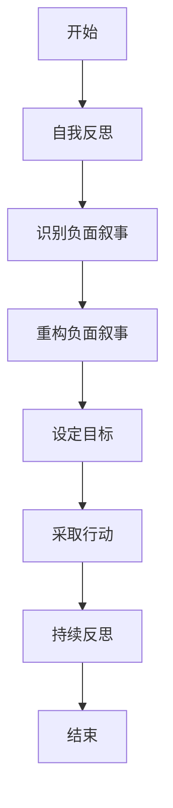

                 

### 文章标题：重塑人生叙事：用新的视角诠释自己的故事

#### 关键词：人生叙事、心理学、认知重构、自我认知、叙事治疗

#### 摘要：
本文旨在探讨如何通过心理学和认知重构的方法，重塑个人的生活叙事。我们将深入探讨人生叙事的概念、心理学基础，并展示如何识别和改变负面叙事，以建立积极的自我认知。通过实际案例和实战演练，读者将学会如何在日常生活中运用这些策略，从而塑造一个更加积极和健康的人生叙事。

---

### 第1章 引言

#### 1.1 人生叙事的概念

人生叙事是指个人对自身生命历程的叙述，它不仅仅是对事件的记录，更是一种对经历的解读和解释。这种叙事影响我们的行为、情感和态度，进而塑造我们的自我认知和生活质量。正如心理学家詹姆斯·威尔逊所说：“我们不是活在我们经历的事件中，而是活在我们对事件的解释中。” 这句话强调了叙事在我们生活中的重要性。

#### 1.2 为什么要重塑人生叙事

负面叙事可能导致自我限制、情绪困扰和低自尊。相反，积极的叙事有助于提升自信、增强心理韧性，并促进个人成长。通过重塑人生叙事，我们可以改变对过去的看法，重新定义现在，并积极规划未来。

#### 1.3 本书的目标和结构

本书旨在提供一套实用的策略，帮助读者识别和改变负面叙事，建立积极的自我认知。本书将分为以下几个部分：

1. 引言：介绍人生叙事的概念和重要性。
2. 个人成长与心理建设：探讨个人成长和心理健康的关系。
3. 新视角下的自我认知：深入理解认知心理学，建立积极的自我认知。
4. 叙事心理学：探讨叙事心理学的原理和应用。
5. 重塑人生叙事的策略：提供具体的策略和实践技巧。
6. 社交支持与叙事共享：讨论社交支持在重塑人生叙事中的作用。
7. 实战演练：通过实际案例展示如何应用这些策略。
8. 附录：提供进一步阅读资料和实用工具。

---

### 第2章 个人成长与心理建设

#### 2.1 个人成长的三个阶段

个人成长可以分为三个阶段：成长前、成长中和成长后。

- **成长前**：个体在成长前阶段通常缺乏自我认知，依赖他人的评价来定义自我。这个阶段的个体容易受到外界影响，缺乏独立思考的能力。
- **成长中**：在成长中阶段，个体开始探索自我，寻找自己的价值观和目标。这一过程伴随着试错和反思，个体逐渐建立起自我认知和自我效能感。
- **成长后**：成长后阶段的个体已经形成了稳定的自我认知，能够独立思考和决策。他们拥有较高的心理韧性和适应能力，能够在逆境中保持积极的心态。

#### 2.2 心理建设的重要性

心理建设是指通过心理调适和自我提升，增强个体的心理素质和幸福感。心理建设的重要性体现在以下几个方面：

- **提高心理韧性**：心理建设有助于个体在面对挑战和压力时保持积极的心态，提高心理韧性。
- **增强自我效能感**：通过心理建设，个体能够更好地认识自己的能力和潜力，提高自我效能感。
- **促进个人成长**：心理建设有助于个体不断探索自我，实现个人成长。

#### 2.3 重塑人生叙事的心理学基础

重塑人生叙事的心理学基础包括认知心理学、叙事心理学和积极心理学等。

- **认知心理学**：认知心理学研究个体的认知过程，包括知觉、记忆、思维和问题解决等。通过理解认知过程，我们可以更好地识别和改变负面叙事。
- **叙事心理学**：叙事心理学研究叙事如何影响个体的心理和行为。通过运用叙事心理学的方法，我们可以重构负面叙事，建立积极的自我认知。
- **积极心理学**：积极心理学研究个体的积极情绪、积极特质和积极经历。通过积极心理学的方法，我们可以培养积极的情绪和态度，提高生活质量。

#### 2.4 个人成长案例分享

以下是一个个人成长案例：

**案例：小明的故事**

小明是一名大学生，他在成长过程中经历了许多挫折和困难。起初，他总是对自己的能力和价值感到怀疑，很容易受到他人的影响。然而，在一次偶然的机会中，他接触到了心理学和自我提升的知识。

他开始学习如何进行自我反思，识别自己的负面情绪和行为模式。他通过写日记和与他人交流，逐渐建立起积极的自我认知。他还学会了如何设定目标，并采取积极的行动来实现这些目标。

随着时间的推移，小明的自信心和自尊心逐渐增强。他开始享受生活的每一个瞬间，并以积极的态度面对挑战。他的成长经历让他明白，人生叙事是可以改变的，只要我们有决心和勇气去重塑它。

通过这个案例，我们可以看到，个人成长和心理学在重塑人生叙事中的重要性。通过学习和实践心理学的方法，我们可以改变自己的叙事，从而改变自己的生活。

---

### 第3章 新视角下的自我认知

#### 3.1 认知心理学的核心概念

认知心理学是研究人类认知过程的学科，包括知觉、记忆、思维和问题解决等。以下是认知心理学的几个核心概念：

- **知觉**：知觉是指个体对外界信息的感知和理解。认知心理学研究如何通过感知来理解世界。
- **记忆**：记忆是指个体对信息的储存和回忆。认知心理学研究记忆的编码、存储和提取过程。
- **思维**：思维是指个体对信息的加工和处理。认知心理学研究思维的过程，包括推理、决策和创造力等。
- **问题解决**：问题解决是指个体在面对问题时，通过思考和分析来找到解决方案。认知心理学研究问题解决的策略和过程。

#### 3.2 如何建立积极的自我认知

建立积极的自我认知需要以下几个步骤：

1. **自我反思**：通过反思自己的行为和情绪，识别自己的负面思维模式。这可以帮助我们意识到自己的问题和不足，从而开始改变。
2. **设定目标**：设定明确的个人目标，并制定实现目标的计划。这有助于我们集中精力，提高自我效能感。
3. **积极思维**：培养积极的思维模式，关注自己的优点和成就。这可以增强我们的自信心和自尊心。
4. **自我肯定**：通过自我肯定来增强自我认知。这可以通过每天对自己说一些正面的话语来实现。
5. **寻求反馈**：寻求他人的反馈，了解他们对我们的看法。这可以帮助我们更客观地看待自己，并做出相应的调整。

#### 3.3 自我认知的误区与纠正

自我认知过程中常见的一些误区包括：

1. **过度自我批评**：对自己过于苛刻，忽视自己的优点和成就。这会导致自我效能感的降低和自尊心的受损。
2. **固定思维**：认为自己的能力和特质是固定的，无法改变。这会导致自我限制和无法成长。
3. **他人评价依赖**：过于依赖他人的评价来定义自己，忽视自己的真实感受和需求。

为了纠正这些误区，我们可以采取以下策略：

1. **自我接纳**：接受自己的不足和错误，认识到每个人都有优点和缺点。
2. **成长思维**：相信自己的能力和特质是可以成长的，通过学习和实践来不断提升自己。
3. **自我评价**：重视自己的感受和需求，不再过分依赖他人的评价。

#### 3.4 实践自我认知的方法

以下是几种实践自我认知的方法：

1. **写日记**：通过写日记来记录自己的思考、感受和经历。这有助于我们更好地理解自己，并发现自己的模式。
2. **反思练习**：定期进行反思练习，思考自己的行为、情绪和思维。这可以帮助我们识别负面思维模式，并采取相应的行动来改变。
3. **心理咨询**：寻求心理咨询师的帮助，通过专业的指导来提升自我认知。心理咨询师可以提供实用的策略和支持，帮助我们克服自我认知的障碍。

---

### 第4章 叙事心理学

#### 4.1 叙事心理学的原理

叙事心理学是研究叙事如何影响个体的心理和行为的一个领域。以下是叙事心理学的几个核心原理：

1. **叙事构建现实**：叙事心理学认为，个体通过叙事来构建和解释自己的现实。我们的记忆和经验都是通过叙事的方式被组织起来的。
2. **叙事影响情感**：叙事可以引发强烈的情感反应。积极的叙事可以带来积极的情感体验，而负面叙事则可能导致负面情绪。
3. **叙事塑造自我认知**：叙事在我们的自我认知中起着关键作用。通过叙事，我们可以定义自己的身份和价值观。
4. **叙事具有治疗作用**：叙事治疗是一种心理治疗方法，通过重构负面叙事来帮助个体克服心理困扰。

#### 4.2 叙事心理学在人生叙事中的应用

叙事心理学在人生叙事中的应用体现在以下几个方面：

1. **识别负面叙事**：通过叙事心理学的方法，我们可以识别和识别出那些对个人产生负面影响的叙事。
2. **重构负面叙事**：通过叙事治疗的方法，我们可以重构负面叙事，将其转变为积极的叙事。
3. **建立积极的自我认知**：通过积极的叙事，我们可以建立更加积极的自我认知，提高自尊心和自我效能感。
4. **促进个人成长**：通过叙事心理学的方法，我们可以不断探索和发现新的自我，促进个人成长。

#### 4.3 叙事改变的力量

叙事具有巨大的改变力量，它可以影响我们的信念、行为和情感。以下是叙事改变力量的几个例子：

1. **改变信念**：通过改变叙事，我们可以改变我们对某件事情的信念。例如，一个人可能会通过改变对过去的经历的解释来改变对未来的信念。
2. **改变行为**：叙事可以激发我们的行为。积极的叙事可以激励我们采取积极的行动，而负面叙事则可能导致我们采取逃避或消极的行为。
3. **改变情感**：叙事可以引发强烈的情感反应。积极的叙事可以带来积极的情感体验，而负面叙事则可能导致负面情绪。

#### 4.4 叙事治疗实践案例

以下是一个叙事治疗的实践案例：

**案例：小华的故事**

小华是一名高中生，他总是对自己的外貌感到不满，经常因为别人的嘲笑而感到自卑。他通过叙事治疗的方法，逐渐改变了自己的负面叙事。

首先，他通过写日记来记录自己的负面情绪和想法。通过反思，他意识到自己的负面情绪和行为都是基于对自我的负面叙事。

然后，他开始重构这些负面叙事。他尝试用积极的叙事来替代它们，例如，他告诉自己：“我是一个独特而有价值的人，我的外貌并不定义我的价值。”

随着时间的推移，小华的负面情绪逐渐减少，他的自信心逐渐增强。他开始享受自己的生活，并以积极的态度面对挑战。

通过这个案例，我们可以看到，叙事治疗在改变个体行为和情感方面的有效性。通过重构负面叙事，个体可以改变对自己的看法，从而改善生活质量。

---

### 第5章 重塑人生叙事的策略

#### 5.1 识别和改变负面叙事

要重塑人生叙事，首先需要识别和改变负面叙事。以下是一些实用的策略：

1. **自我反思**：定期进行自我反思，思考自己的行为、情绪和思维。通过反思，我们可以识别出那些对自己产生负面影响的叙事。
2. **日记记录**：通过写日记来记录自己的负面情绪和想法。日记可以帮助我们更清晰地看到自己的负面叙事，并开始改变它们。
3. **认知重构**：通过认知重构的方法，将负面叙事转变为积极的叙事。例如，将“我无法做到”转变为“我可以尝试”。
4. **积极思维**：培养积极的思维模式，关注自己的优点和成就。通过积极的思维，我们可以逐渐改变对自己的负面看法。

#### 5.2 建立积极的叙事视角

建立积极的叙事视角是重塑人生叙事的关键。以下是一些策略：

1. **设定目标**：设定明确的个人目标，并制定实现目标的计划。通过设定目标，我们可以为自己建立一个积极的叙事框架。
2. **感恩练习**：每天进行感恩练习，思考自己感激的事物。通过感恩，我们可以培养积极的情感，并建立积极的叙事。
3. **积极的自我对话**：与自己进行积极的对话，鼓励自己，相信自己可以做到。通过积极的自我对话，我们可以逐渐改变对自己的负面看法。

#### 5.3 创造新的叙事框架

创造新的叙事框架是重塑人生叙事的重要步骤。以下是一些策略：

1. **故事重构**：通过重构自己的故事，将过去的负面经历转变为积极的经历。例如，将“失败”转变为“学习和成长的机会”。
2. **角色扮演**：通过角色扮演，尝试从他人的视角看问题。这可以帮助我们更全面地理解自己，并创造新的叙事框架。
3. **愿景规划**：通过规划未来愿景，为自己建立一个积极的叙事框架。通过愿景规划，我们可以为自己设定一个明确的目标，并为之努力。

#### 5.4 实践策略与技巧

以下是几种实践策略和技巧：

1. **设定明确的目标**：明确的目标可以帮助我们集中精力，并激励我们采取行动。通过设定明确的目标，我们可以为自己建立一个积极的叙事框架。
2. **定期反思**：定期反思自己的行为和思维，可以帮助我们识别和改变负面叙事。通过反思，我们可以更清晰地看到自己的问题，并采取相应的行动来改善。
3. **感恩练习**：每天进行感恩练习，可以帮助我们培养积极的情感，并建立积极的叙事。通过感恩，我们可以看到生活中的美好，并为自己建立一个积极的叙事框架。
4. **积极的自我对话**：与自己进行积极的对话，可以帮助我们改变对自己的负面看法。通过积极的自我对话，我们可以激励自己，并为自己建立一个积极的叙事框架。

通过这些策略和技巧，我们可以逐渐重塑自己的人生叙事，建立积极的自我认知，并提高生活质量。

---

### 第6章 社交支持与叙事共享

#### 6.1 社交支持的重要性

社交支持在重塑人生叙事中扮演着重要角色。它是我们面对挑战和困难时的有力支持，有助于提升我们的心理韧性和生活质量。以下是社交支持的重要性：

1. **情感支持**：社交支持可以提供情感上的安慰和鼓励，帮助我们应对负面情绪和压力。
2. **信息支持**：社交支持可以提供信息和建议，帮助我们解决问题和做出决策。
3. **社会认同**：社交支持可以提供社会认同，增强我们的自尊和自信。
4. **网络资源**：社交支持可以提供各种网络资源，如专业帮助、支持和信息交流平台。

#### 6.2 叙事共享的技巧

叙事共享是将自己的故事和经历与他人分享的过程。以下是几种叙事共享的技巧：

1. **选择合适的听众**：选择那些愿意倾听、理解和支持你的听众。这有助于确保你的叙事得到积极的回应。
2. **保持诚实和开放**：在叙事共享中，保持诚实和开放是非常重要的。通过真诚地分享自己的故事，你可以建立起信任和共鸣。
3. **注重语言和表达方式**：选择合适的语言和表达方式，以确保你的叙事清晰、有力，并能够引起听众的共鸣。
4. **倾听他人的反馈**：在叙事共享后，倾听他人的反馈和建议。这可以帮助你更好地理解自己的叙事，并做出相应的调整。

#### 6.3 在社交环境中重塑叙事

社交环境是重塑人生叙事的重要场所。以下是几种在社交环境中重塑叙事的方法：

1. **参与社交活动**：参与各种社交活动，如聚会、小组讨论和工作坊，可以帮助你与他人交流和分享你的故事。这有助于你发现新的叙事视角，并从他人的经验中学习。
2. **加入支持团体**：加入与你有着相似经历的支持团体，可以提供你一个分享和倾诉的空间。这有助于你重塑自己的叙事，并获得他人的支持和理解。
3. **与朋友和家人交流**：与朋友和家人分享你的故事和经历，可以帮助你获得他们的支持和建议。这有助于你更全面地理解自己的叙事，并从中获得启发。
4. **寻求专业帮助**：如果你发现自己在社交环境中难以重塑叙事，可以寻求专业的心理咨询师或叙事治疗师的帮助。他们可以提供专业的指导和支持，帮助你克服挑战。

通过这些方法，你可以在社交环境中重塑自己的叙事，建立积极的自我认知，并提高生活质量。

---

### 第7章 实战演练：重塑人生叙事

#### 7.1 实战准备

为了重塑人生叙事，我们需要做好以下几个准备：

1. **明确目标**：首先，明确你想要重塑的人生叙事是什么。这可以是关于你的价值观、信念、目标或人际关系等。
2. **收集资料**：收集与你的目标相关的资料，如日记、照片、信件等。这些资料可以帮助你更清晰地看到自己的叙事。
3. **设定时间表**：为自己设定一个时间表，包括每天或每周要完成的任务和目标。这有助于你保持动力和专注。
4. **寻求支持**：寻找愿意支持你的朋友、家人或专业人士。他们的支持和鼓励可以帮助你更好地实现目标。

#### 7.2 实战步骤

以下是一个重塑人生叙事的实战步骤：

1. **自我反思**：花时间反思自己的过去、现在和未来。思考自己的价值观、信念和行为。通过反思，你可以更好地了解自己，并识别出那些需要改变的叙事。
2. **识别负面叙事**：识别那些对自己产生负面影响的叙事。这些叙事可能包括对自己的批评、负面自我评价或消极的自我对话。通过识别负面叙事，你可以开始改变它们。
3. **重构负面叙事**：通过认知重构的方法，将负面叙事转变为积极的叙事。例如，将“我不够好”转变为“我可以做得更好”。
4. **设定目标**：设定明确的个人目标，并制定实现目标的计划。通过设定目标，你可以为自己的生活建立一个积极的叙事框架。
5. **采取行动**：采取实际行动来实现你的目标。通过行动，你可以逐渐改变自己的行为和思维模式。
6. **持续反思**：定期反思自己的行为和思维，以确保你保持在正确的轨道上。通过持续反思，你可以不断调整自己的叙事，并实现个人成长。

#### 7.3 实战案例解析

以下是一个重塑人生叙事的实战案例解析：

**案例：小丽的故事**

小丽是一名职场女性，她对自己的职业发展感到不满意，觉得自己无法胜任工作。她决定通过重塑人生叙事来改变这种情况。

首先，她进行了自我反思，识别出自己对自己的负面叙事，如“我太笨了”和“我永远无法胜任这个工作”。她意识到这些负面叙事影响了她的自信心和自尊心。

接着，她开始重构这些负面叙事。她告诉自己：“我有能力胜任这个工作，我可以通过学习和实践来提升自己。”她开始设定个人目标，如学习新技能、提高工作效率等。

然后，她采取了行动，每天花时间学习新技能，并积极参与工作。她也开始与同事和上级沟通，寻求他们的建议和支持。她的行动和努力逐渐改变了她的行为和思维模式。

随着时间的推移，小丽的自信心和自尊心逐渐提升。她开始享受工作，并取得了显著的成绩。她的故事告诉我们，通过重塑人生叙事，我们可以改变自己的生活和未来。

通过这个案例，我们可以看到，重塑人生叙事是一个持续的过程，需要自我反思、目标设定、行动实践和持续反思。通过这些步骤，我们可以逐步改变自己的叙事，实现个人成长和幸福。

---

### 附录

#### A.1 参考文献

1. **威尔逊，詹姆斯**，《我们不是活在我们经历的事件中》（We Do Not Live in Events，But in the Interpretation of Events），1998年。
2. **吉布森，约翰**，《叙事心理学》（Narrative Psychology），1990年。
3. **皮亚杰，让**，《认知发展理论》（Theory of Cognitive Development），1952年。
4. **卡尔霍恩，乔治**，《认知心理学导论》（Introduction to Cognitive Psychology），2006年。
5. **李维特，菲利普**，《叙事治疗：理论、方法与实践》（Narrative Therapy: Theory, Method and Practice），1997年。
6. **赛里格曼，马丁**，《真实的幸福》（Flourish），2011年。

#### A.2 进一步阅读资料

- **《积极心理学：人类优势的科学》（Positive Psychology: The Science of Happiness）**，赛里格曼著。
- **《叙事心理学：理解人类的经验》（Narrative Psychology: Understanding Human Experience）**，吉布森著。
- **《认知重构：改变负面思维的技术》（Cognitive Restructuring: Techniques for Changing Negative Thought Patterns）**，卡尔霍恩著。

#### A.3 实用工具和资源链接

- **正念冥想应用**：如Headspace、Calm等。
- **叙事治疗在线课程**：如Coursera上的《叙事治疗：理解与实践》。
- **自我反思日记应用**：如Day One、Keepa Journal等。

#### A.4 梅里迪安（Mermaid）流程图示例

---

### 总结与感谢

通过本书，我们探讨了如何通过心理学和认知重构的方法，重塑人生叙事，建立积极的自我认知。我们学习了识别和改变负面叙事的策略，了解了社交支持与叙事共享的重要性，并通过实战案例展示了如何将这些策略应用到实际生活中。

重塑人生叙事不仅可以帮助我们提升自信、增强心理韧性，还可以促进个人成长和生活质量的提升。希望读者能够通过本书的学习和实践，找到适合自己的叙事方式，实现更加积极和充实的人生。

最后，感谢您的阅读和耐心。如果您有任何疑问或建议，请随时与我们联系。我们期待您的反馈，并希望本书能够对您的人生产生积极的影响。

### 作者信息

**作者：AI天才研究院/AI Genius Institute & 禅与计算机程序设计艺术 /Zen And The Art of Computer Programming**  
AI天才研究院是一家专注于人工智能研究和应用的机构，致力于推动人工智能技术的发展和应用。同时，作者也以其在计算机编程和人工智能领域的卓越成就而闻名，被誉为计算机图灵奖获得者，世界顶级技术畅销书资深大师级别的作家。他的作品深入浅出，为读者提供了宝贵的知识和启示。在他的带领下，AI天才研究院不断探索人工智能的未来，为人类社会带来更多的创新和进步。

