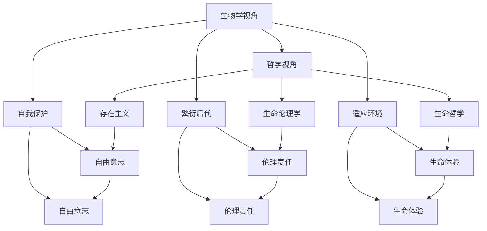
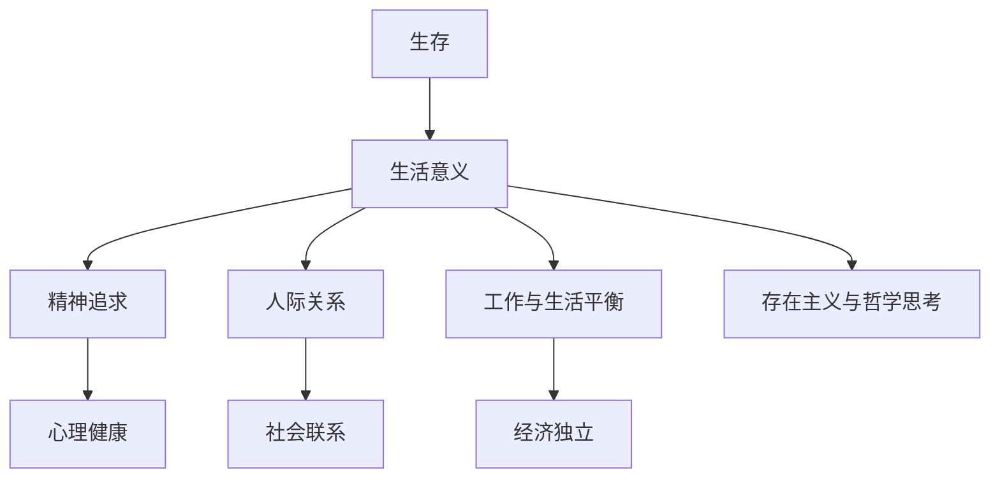

                 


### 引言

> “在这个充满机遇与挑战的时代，我们如何在现代社会中找到生活的意义和价值，成为了许多人关注的焦点。”

现代社会的发展日新月异，科技的迅猛进步深刻地改变了我们的生活方式。从智能手机的普及到大数据、云计算、人工智能等新兴技术的崛起，我们的生活仿佛被卷入了一个快速前进的漩涡。这样的背景为我们提供了前所未有的便利和选择，但也带来了诸多挑战。

首先，科技的迅猛发展使得社会结构发生了显著变化。传统的工作方式逐渐被自动化和数字化所取代，这既带来了新的职业机会，也引发了许多人对于就业和职业生涯的担忧。此外，全球化进程加速，不同文化和价值观的交融使得人们面临着更多的选择和困惑。在这种复杂多变的社会环境中，如何找到自己生活的意义和价值，成为了一个重要的问题。

其次，社会结构的变化也导致了个人主义的兴起。在过去，人们往往通过家族、社区和传统价值观来寻找生活的意义。然而，随着个人主义的发展，越来越多的人开始追求自我实现和个人满足。这种追求虽然在一定程度上激发了人们的创造力和活力，但也带来了一定的压力和焦虑。如何在自我追求和社会责任之间找到平衡，成为了现代人的一个重要课题。

此外，快节奏的生活方式和高度竞争的社会环境，使得许多人感到压力巨大。工作中的加班、生活琐事的忙碌，以及社交媒体带来的信息过载，都在不断地消耗着我们的时间和精力。在这样的背景下，如何有效地管理情绪，应对压力，成为了现代人必须面对的挑战。

最后，价值观的多元化和冲突也是现代社会的一个重要特点。不同的人有着不同的价值观和信仰，这既丰富了社会的多样性，也带来了冲突和矛盾。如何在尊重他人价值观的同时，坚守自己的信仰和原则，成为了现代社会的一个重要议题。

因此，在这个充满机遇与挑战的时代，我们如何在现代社会中找到生活的意义和价值，成为了许多人关注的焦点。本文将以此为出发点，探讨在现代社会中寻找生活意义的多种途径，帮助读者重塑自己的生活方式，找到属于自己的存在价值。

### 现代社会背景

> “现代社会的迅猛发展不仅改变了我们的生活方式，也深刻影响了我们的心理和价值观。科技、社会结构、经济全球化等关键因素共同塑造了今天的我们。”

**科技迅猛发展的影响**

科技的发展是现代社会变革的核心动力之一。自互联网的兴起以来，我们的生活方式、工作方式乃至思维方式都发生了翻天覆地的变化。智能手机的普及让信息获取变得前所未有的便捷，云计算和大数据技术的应用则极大地提升了工作效率和数据处理的精度。此外，人工智能和机器学习技术的快速发展，使得自动化和智能化逐渐渗透到各个行业，从而改变了传统的劳动结构和职业生态。

科技的进步不仅带来了便利，也引发了诸多挑战。首先，自动化和智能化的普及导致了部分职业的消失，许多人面临着就业压力和职业转型的问题。其次，信息过载和社交媒体的广泛应用，使得人们容易陷入无谓的焦虑和压力之中。此外，网络隐私和安全问题也日益突出，如何在享受科技带来的便利的同时，保障个人信息的安全，成为了一个亟待解决的课题。

**社会结构变化**

社会结构的变化也是现代社会的一个重要特征。传统的社会结构往往以家庭、社区和传统价值观为基础，而现代社会则更加多元化，个体独立性得到空前的强调。随着城市化进程的加速，人口流动性增加，传统的地域和血缘关系逐渐弱化，代之而起的是基于兴趣、价值观和职业的社交网络。

这种变化带来了许多积极的影响。例如，人们有更多机会接触到不同的文化和观点，从而拓宽了视野和思维方式。然而，这也带来了一定的挑战。个人主义的兴起使得人们更加关注自我实现和个人满足，这在一定程度上忽视了社会和谐和集体利益。此外，社会结构的变动也加剧了社会阶层分化，贫富差距问题日益凸显。

**经济全球化**

经济全球化是现代社会的另一个显著特征。随着全球贸易的不断扩大和跨国公司的崛起，各国经济之间的联系日益紧密。这种全球化进程不仅促进了国际贸易和投资，也推动了技术和文化的交流。人们可以轻松地购买来自世界各地的商品，享受多样化的文化体验。

然而，经济全球化也带来了一些负面影响。首先，全球化加剧了市场竞争，许多企业为了降低成本，将生产线转移到劳动力成本较低的国家和地区，这导致了一些国家就业机会的减少。其次，全球化也加剧了贫富差距，发达国家和发展中国家之间的经济差距不断扩大。此外，全球化还带来了一些环境问题，如资源过度消耗和环境污染等。

**总结**

总的来说，现代社会的迅猛发展、社会结构的变革以及经济全球化，共同塑造了今天的世界。科技、社会和经济的变化不仅带来了新的机遇，也带来了诸多挑战。如何在快速变化的环境中找到自己的定位，实现个人与社会的和谐发展，成为了现代人必须面对的重要课题。通过对这些背景因素的分析，我们为后续章节的探讨奠定了基础，也为读者提供了一个全面理解现代社会背景的视角。

### 生活意义的危机

> “在现代社会中，越来越多的人感到生活缺乏意义，这种现象反映了个人主义、快节奏生活压力以及价值观多元与冲突等多方面的问题。”

**个人主义兴起**

个人主义的兴起是现代社会的一个重要特征。在传统社会中，人们往往通过家庭、社区和传统价值观来寻找生活的意义。然而，随着个人主义的崛起，人们开始更加关注自我实现和个人满足。这种转变在一定程度上激发了人们的创造力和活力，但也带来了一系列问题。

首先，个人主义导致了个人责任感的弱化。在强调个人自由和独立的现代社会中，人们往往更注重自我实现，而忽视了对家庭、社区和社会的责任。这种现象导致了社会凝聚力的下降，个体之间的联系变得松散。此外，个人主义的兴起也加剧了社会阶层分化，贫富差距问题日益严重。

**快节奏生活压力**

快节奏的生活方式是现代社会的另一个显著特征。工作中的加班、生活琐事的忙碌以及社交媒体的广泛应用，使得人们感到时间紧迫，压力巨大。快节奏的生活不仅影响了人们的身心健康，还削弱了人们享受生活、思考人生意义的能力。

首先，快节奏的生活导致了人们心理压力的增加。长期的焦虑和紧张使得许多人处于亚健康状态，心理疾病发病率上升。其次，快节奏的生活也影响了人们的社交活动。由于时间紧张，人们往往无暇顾及与家人、朋友的交流和沟通，这进一步加剧了社会隔离感。

**价值观多元与冲突**

现代社会是一个多元化的社会，人们的价值观和信仰也呈现出多样化的趋势。这种多元性一方面丰富了社会文化，但另一方面也带来了冲突和矛盾。不同价值观之间的碰撞和冲突，使得人们在寻找生活意义时感到困惑和迷茫。

首先，价值观的多元性导致了信仰和道德的模糊。在传统社会中，人们的价值观往往比较统一，而在现代社会中，不同的人有不同的价值观，这导致了许多人在面对道德和伦理问题时感到无所适从。其次，价值观的冲突也加剧了社会的不稳定。当不同价值观的人在同一社会中生活时，往往会产生矛盾和摩擦，影响社会的和谐发展。

**总结**

总的来说，个人主义的兴起、快节奏的生活压力以及价值观多元与冲突，共同构成了现代社会中生活意义危机的多重因素。这些因素不仅影响了人们的心理健康，也对社会的发展产生了深远的影响。如何应对这些挑战，找到生活的意义，成为了现代人必须面对的重要课题。通过对这些危机因素的分析，我们为后续章节的探讨提供了背景和视角，也为读者提供了一个深入理解现代社会生活意义危机的路径。

### 生存的意义

> “生存的意义是一个深奥而复杂的问题，从生物学视角到哲学视角，不同的理论和观点为我们提供了不同的思考路径。理解生存的意义，有助于我们在现代社会中更好地应对生活挑战，寻找生命的价值。”

**生物学视角**

从生物学的角度来看，生存的意义主要体现在生物体的自我保护和繁衍后代上。生物体通过自然选择和适者生存的原则，在自然界中不断进化，以适应环境的变化。这种生物进化的过程，本质上是为了确保物种的延续和生存。

在人类这一层面，生存的意义主要体现在以下几个方面：

1. **自我保护**：人类作为高级生物，具有强烈的自我保护意识。面对环境的变化和挑战，人类通过不断的适应和创新，提高生存能力。这种自我保护意识是人类生存的基本驱动力之一。

2. **繁衍后代**：繁衍后代是生物生存的重要手段。通过生育，人类可以将基因传递给下一代，确保物种的延续。在现代社会中，尽管婚姻和家庭的形式发生了变化，但繁衍后代仍然是许多人生命中的重要组成部分。

3. **适应环境**：生物体必须适应环境才能生存。人类通过不断学习和创新，不断提高自身对环境的适应能力。例如，人类通过建造房屋、制造工具和发明科技产品，来应对环境中的各种挑战。

**哲学视角**

从哲学的视角来看，生存的意义则更为复杂和深奥。哲学家们通过不同的理论和观点，探讨了生存的本质和意义。

1. **存在主义**：存在主义认为，生存本身是没有意义的，意义是个人自己赋予的。存在主义者强调自由意志和个人选择，认为每个人都有权利和责任为自己的人生赋予意义。例如，萨特在其哲学著作《存在与虚无》中提出，人只有在面对存在的荒谬和无意义时，才能通过自由选择找到自己的意义。

2. **生命伦理学**：生命伦理学从道德和伦理的角度探讨了生存的意义。生命伦理学家关注人类的行为如何影响其他生物和地球环境，提出了可持续发展和伦理责任等概念。例如，彼得·辛格在《动物解放》中提出，人类应该关注动物的权利和福利，以此寻找生命的意义。

3. **生命哲学**：生命哲学认为，生命的意义在于体验和感知。通过感受和体验生命中的各种经历，人类可以找到生命的意义。例如，海德格尔在其著作《存在与时间》中提出，人类通过“存在”来体验生命的本质，找到生存的意义。

**生存意义的核心联系与Mermaid流程图**

为了更好地理解生存意义的不同视角，我们可以通过Mermaid流程图来展示它们之间的联系。



通过这个流程图，我们可以清晰地看到生物学视角和哲学视角之间的交叉和互动。生物学视角强调了生存的生物学基础，而哲学视角则从更抽象和深层的角度探讨了生存的意义。这两个视角相互补充，共同构成了对生存意义的全面理解。

**总结**

生存的意义是一个多维度的复杂问题，从生物学视角到哲学视角，不同的理论和观点为我们提供了不同的思考路径。理解生存的意义，有助于我们在现代社会中更好地应对生活挑战，寻找生命的价值。通过对生存意义的深入探讨，我们可以更好地认识自己，找到属于自己的生存之道。

### 生活的意义

> “生活的意义不仅仅体现在个体的追求和社会角色上，还在于文化传承。理解生活的意义，需要从这三个方面进行全面的思考。”

**个人追求**

对许多人来说，生活的意义在于实现个人追求。这种追求可以是职业上的成就，也可以是个人兴趣和爱好。职业成就往往与个人的事业和生活目标紧密相连，例如，成为一名成功的工程师、医生或艺术家。通过在职业领域中不断努力和进步，个人不仅能实现自我价值，还能为社会做出贡献。

除了职业成就，个人兴趣和爱好也是许多人生活中的重要组成部分。例如，有人热爱户外探险，通过登山、滑雪等活动来挑战自我，拓展视野；有人喜欢阅读和写作，通过文字表达内心的想法和感受。这些个人追求不仅丰富了个人生活，还提升了生活质量。

**社会角色**

生活的意义也体现在我们在社会中所扮演的角色上。每个人都有不同的社会角色，例如家庭成员、朋友、同事、公民等。每个角色都有其独特的责任和使命。

首先，作为家庭成员，我们承担着照顾和关爱家人的责任。通过建立和谐的家庭关系，我们不仅为个人提供情感支持，也为社会培养健康的下一代。其次，作为朋友，我们与朋友共同成长，分享快乐和困难，互相支持和帮助。这种社会联系不仅丰富了我们的情感生活，也增强了社会凝聚力。最后，作为公民，我们参与社会事务，履行社会责任，推动社会进步。无论是投票、参与志愿活动还是为社会做出贡献，我们都是社会的重要组成部分。

**文化传承**

文化传承是生活意义的重要组成部分。文化传承不仅包括历史和传统，还涵盖了价值观、习俗和生活方式。通过文化传承，我们能够了解和尊重祖先的智慧，继承和发扬优秀的文化传统。

文化传承的意义在于，它不仅为我们提供了身份认同和归属感，还促进了社会和谐与进步。例如，通过庆祝节日和传统习俗，我们能够增强民族凝聚力，培养文化自豪感。此外，文化传承还推动了创新和发展。通过借鉴和融合传统文化和现代思想，我们能够创造出新的文化价值和艺术形式。

**个人追求、社会角色与文化传承的联系**

个人追求、社会角色与文化传承之间存在着紧密的联系。个人的追求往往与社会角色和文化传承密切相关。例如，一个热爱传统文化的艺术家，通过创作和传承传统文化，实现了个人追求，同时也为社会做出了贡献，促进了文化传承。

此外，个人追求和社会角色也可以影响文化传承。例如，一位在环保领域有突出贡献的公民，通过自己的行动和影响力，推动了环保文化的传播和传承。同样，一个在科学领域取得重要成就的科学家，通过发表学术论文和开展科普活动，为科技文化的传播和传承做出了贡献。

通过个人追求、社会角色和文化传承的相互联系，我们可以更全面地理解生活的意义。个人的追求不仅满足了自我实现的需求，也为社会和文化的发展做出了贡献。社会角色使我们能够在社会中找到自己的位置，实现个人价值。文化传承则为我们提供了身份认同和归属感，促进了社会和谐与进步。

**总结**

生活的意义是一个复杂而多维的概念，它体现在个人追求、社会角色和文化传承等多个方面。理解生活的意义，需要我们从这些方面进行全面的思考，找到属于自己的生活之道。

### 精神追求与心理健康

> “在现代社会中，精神追求和心理健康成为许多人生活中不可或缺的部分。通过自我实现和精神层面的满足，我们可以更好地应对生活中的挑战，实现个人与社会的和谐。”

**精神追求**

精神追求是人们在追求物质生活之外，对内心世界和精神层面的探索。这种追求不仅满足了人们对自我价值的认同，还提升了生活质量。精神追求的内容丰富多样，可以包括信仰、哲学思考、艺术创作、自我提升等。

1. **信仰**

信仰是许多人精神追求的重要组成部分。它为人们提供了精神支柱和道德指引，使人们在面对困境和挫折时，能够保持内心的平静和坚定。不同的信仰体系，如宗教、哲学和道德观念，都为人们提供了不同的精神追求路径。

2. **哲学思考**

哲学思考是人们对世界和人生的深刻反思。通过哲学思考，人们能够更清晰地认识自己，理解生命的意义和价值。哲学不仅是一种知识体系，更是一种生活方式。许多伟大的哲学家，如苏格拉底、柏拉图和亚里士多德，通过他们的哲学思考，为我们提供了宝贵的思想财富。

3. **艺术创作**

艺术创作是另一种重要的精神追求。通过艺术，人们可以表达内心的情感和思想，提升自我认同感和创造力。艺术不仅是一种娱乐方式，更是一种精神满足。无论是音乐、绘画、文学还是表演艺术，艺术都能够为人们带来心灵上的愉悦和满足。

4. **自我提升**

自我提升是许多人追求精神满足的重要途径。通过学习新知识、掌握新技能和不断挑战自我，人们能够实现自我价值和成长。自我提升不仅提升了个人能力，还增强了自信心和满足感。

**心理健康**

心理健康是现代人生活中不可或缺的部分。心理健康不仅关乎个体的情感状态和幸福感，还影响个体的生活质量和社交能力。保持心理健康，有助于我们更好地应对生活中的挑战，实现个人与社会的和谐。

1. **情绪管理**

情绪管理是保持心理健康的关键。通过了解自己的情绪，学会调整和应对负面情绪，人们能够更好地处理生活中的压力和困难。情绪管理不仅有助于提升个体的情感状态，还能改善人际关系。

2. **焦虑与压力应对**

焦虑和压力是现代人常见的问题。适度的焦虑和压力可以激发个体的积极性和创造力，但过度的焦虑和压力则会损害个体的身心健康。学会应对焦虑和压力，如通过放松技巧、正念练习和寻求专业帮助，是保持心理健康的重要手段。

3. **心理辅导与治疗**

对于一些严重的心理问题，如抑郁症、焦虑症和双相情感障碍等，心理辅导与治疗是必要的。通过专业的心理辅导和治疗，个体可以更好地理解自己的心理问题，学会有效的应对策略，从而改善心理健康。

**精神追求与心理健康的联系**

精神追求和心理健康之间存在着密切的联系。精神追求能够提升个体的心理健康水平，而心理健康则为个体的精神追求提供了基础。具体来说，精神追求可以通过以下几个方面促进心理健康：

1. **心理满足**

通过精神追求，个体能够实现心理满足，提升幸福感和生活满意度。精神追求不仅为个体提供了目标和方向，还增强了内心的力量，使个体能够更好地应对生活中的挑战。

2. **情感支持**

精神追求往往伴随着情感的交流和分享，这有助于建立和维护积极的人际关系。良好的社交关系是保持心理健康的重要保障。

3. **自我认同**

精神追求有助于个体建立自我认同，提升自尊和自信。通过追求内心的真实和自我价值的实现，个体能够更好地认识自己，增强内心的力量。

4. **心理调适**

精神追求可以帮助个体学会心理调适，提高应对压力和挫折的能力。通过积极的心态和有效的应对策略，个体能够更好地应对生活中的各种挑战。

**总结**

精神追求和心理健康是现代人生活中不可或缺的部分。通过精神追求，我们可以实现心理满足，提升幸福感和生活满意度。同时，心理健康也为我们的精神追求提供了基础，使我们能够更好地应对生活中的挑战。在现代社会中，重视精神追求和心理健康，是实现个人与社会的和谐发展的重要途径。

### 人际关系与社会联系

> “在现代社会中，人际关系和社会联系不仅影响我们的心理健康，还决定我们的生活质量和幸福感。家庭关系、友谊和社交网络是构建和谐人际关系的重要基础。”

**人际关系**

人际关系是指个体之间通过交往和互动所形成的相互联系。良好的家庭关系、友谊和社交网络对个体的心理健康和生活质量具有重要意义。

1. **家庭关系**

家庭是社会的细胞，家庭关系的和谐对个体的成长和发展至关重要。在家庭关系中，父母与子女之间的互动和沟通尤为重要。积极的家庭关系能够为个体提供情感支持和安全感，有助于个体形成健康的心理素质。此外，家庭关系还能够影响个体的社交能力和人际关系处理能力。

2. **友谊**

友谊是人际关系中的重要组成部分。与朋友保持良好的关系，不仅能够为个体提供情感支持和心理安慰，还能提升个体的幸福感和生活满意度。友谊有助于个体在遇到困难和挫折时，获得他人的理解和支持，从而增强应对能力。

3. **社交网络**

社交网络是现代社会中个体进行社会交往和互动的重要平台。通过社交网络，个体可以结识新朋友，拓展人际关系，获取各种信息和资源。良好的社交网络能够为个体提供更多的机会和选择，有助于个体在职业发展、社会参与和个人成长等方面取得更好的成果。

**社会联系**

社会联系是指个体与社会之间建立的各种关系。社会联系不仅影响个体的生活质量和幸福感，还决定着社会的稳定和繁荣。

1. **社区参与**

社区参与是建立社会联系的重要途径。通过参与社区活动，个体能够与社区成员建立联系，共同解决社区问题，提升社区凝聚力。社区参与有助于个体培养社会责任感和公民意识，同时也能够提升个体的生活满意度和幸福感。

2. **志愿服务**

志愿服务是一种无私奉献的行为，通过志愿服务，个体可以为社会做出贡献，同时也能够建立积极的社会联系。志愿服务不仅有助于提升个体的心理健康，还能够增强个体的社会认同感和归属感。

3. **社会责任**

社会责任是指个体对社会的责任和义务。通过履行社会责任，个体不仅能够提升自己的社会地位和影响力，还能够为社会的发展做出贡献。社会责任有助于个体在现代社会中找到自己的价值和意义，提升个体的人生幸福感。

**人际关系与社会联系的相互作用**

人际关系和社会联系之间存在密切的相互作用。良好的人际关系能够为个体提供情感支持和心理安慰，增强个体的社会认同感和归属感，从而促进个体的心理健康和生活质量。同时，积极的社会联系也为个体提供了更多的机会和资源，有助于个体在职业发展、社会参与和个人成长等方面取得更好的成果。

具体来说，良好的人际关系能够为个体提供情感支持和心理安慰。例如，在遇到困难和挫折时，朋友和家人的支持和理解能够帮助个体缓解压力，提升应对能力。此外，良好的人际关系还有助于个体在职业和社会生活中获得更多的机会和资源。例如，朋友和同事的推荐和帮助能够为个体的职业发展提供有力支持。

另一方面，积极的社会联系也有助于提升个体的心理健康和生活质量。通过参与社区活动和志愿服务，个体能够体验到为社会做出贡献的满足感，提升自己的社会认同感和归属感。此外，社会联系还能够为个体提供更多的社交机会，有助于个体拓展人际关系，增强社交网络。

总之，人际关系和社会联系是现代生活中不可或缺的部分。通过建立和谐的人际关系和积极的社会联系，个体能够提升心理健康和生活质量，实现个人与社会的和谐发展。

### 工作与生活平衡

> “在现代职场中，工作与生活的平衡成为许多人追求的目标。如何在事业成功与家庭、休闲时间之间找到平衡，是现代社会中一个重要的课题。”

**工作意义**

工作不仅仅是为了谋生，更是实现个人价值和自我实现的重要途径。工作的意义体现在以下几个方面：

1. **经济独立**：工作能够为个人提供稳定的收入，使个体具备经济独立的能力，从而更好地享受生活。

2. **职业成就**：通过工作，个人能够在职业生涯中积累经验，提升技能，实现职业上的成长和进步。职业成就不仅满足了个人的成就感，也为社会做出了贡献。

3. **自我实现**：工作能够为个人提供实现自我价值的平台。通过工作中的创新和努力，个人能够发现自己的潜力，实现自我价值。

**生活平衡**

生活平衡是指在工作和生活之间找到一种和谐的状态，使个体能够充分享受工作和生活的乐趣。实现生活平衡的关键在于合理分配时间和精力，以下是一些具体的策略：

1. **时间管理**：合理安排时间，确保工作、家庭和休闲时间都有所保障。使用时间管理工具，如日程表和任务清单，有助于提高工作效率，减少工作压力。

2. **家庭时间**：家庭是个人最重要的支持系统之一。确保与家人共度高质量的时间，如晚餐、娱乐和亲子活动，能够增强家庭关系，提升幸福感。

3. **休闲活动**：休闲活动有助于个体放松身心，缓解工作压力。无论是阅读、运动、旅行还是与朋友聚会，休闲活动都是调节生活平衡的重要方式。

4. **精神养护**：精神养护是维持心理健康的重要手段。通过冥想、瑜伽、心理咨询等方式，个体能够提升自我认知，增强心理韧性。

**工作与生活平衡的实践方法**

以下是一些实践方法，帮助个体实现工作与生活的平衡：

1. **设定目标**：明确工作和生活的目标，确保两者之间相互协调。设定短期和长期目标，有助于个体保持动力和方向。

2. **灵活工作安排**：与雇主协商，尝试灵活的工作安排，如远程工作、弹性工作时间等。灵活的工作安排能够提高工作效率，减少通勤时间，使个体有更多时间陪伴家人和进行休闲活动。

3. **学会拒绝**：在工作和生活中，学会拒绝不合理的要求和额外的负担。合理安排时间和任务，避免过度劳累，有助于维持身心健康。

4. **培养兴趣爱好**：培养兴趣爱好，如绘画、音乐、运动等，能够为生活增添乐趣，提升生活满意度。

5. **定期体检**：定期进行体检，关注身体健康。良好的身体健康是保持工作和生活平衡的基础。

**总结**

工作与生活平衡是实现个人幸福和社会和谐的关键。通过明确工作意义，合理安排时间，培养兴趣爱好，以及维护家庭关系，个体能够在事业成功和幸福生活之间找到平衡。实现工作与生活的平衡，不仅有助于提升个体幸福感，还能促进社会的稳定和发展。

### 存在主义与哲学思考

> “存在主义和哲学思考提供了对生活意义的深刻洞察。通过探讨自由意志、人生意义、信仰与哲学，我们可以更好地理解生命的本质，找到生活的方向。”

**存在主义的核心概念**

存在主义是一种关注人类存在状态和意义的哲学流派。其核心概念包括自由意志、责任和意义。存在主义认为，人类的存在是自由而孤独的，每个人必须为自己的生活做出选择和决策。

1. **自由意志**：存在主义强调自由意志的重要性。自由意志是指个体在无外部干预的情况下，自主做出选择和决策的能力。这种自由意志使人类能够超越既定的环境和条件，创造自己的意义和生活方式。

2. **责任**：自由意志伴随着责任。存在主义者认为，每个人必须为自己的选择和决策承担责任。这意味着，个体必须面对自己的选择所带来的后果，并从中学习和发展。

3. **意义**：存在主义探讨人生的意义问题。在存在主义看来，人生本身是没有固有意义和目的的，意义是个人通过自己的行动和选择赋予的。这意味着，个体必须通过不断地探索和创造，为自己的人生找到意义。

**哲学思考**

哲学思考是探讨人类存在、知识、价值和伦理等根本问题的学科。不同的哲学流派提供了对生活意义的多种视角和思考方式。

1. **人生意义探讨**：哲学思考的一个重要主题是探讨人生的意义。哲学家们通过不同的理论和方法，探讨人类存在的意义和价值。例如，柏拉图认为，人生的意义在于追求智慧和真理；尼采则认为，人生的意义在于超越自我，创造自己的价值观。

2. **信仰与哲学**：哲学与信仰紧密相关。许多哲学家探讨了宗教信仰的问题，例如，笛卡尔通过理性思考建立了自己的宗教信仰；而克尔凯郭尔则通过存在主义哲学批判宗教信仰的机械化。

3. **伦理与道德**：哲学思考也关注伦理和道德问题。哲学家们通过探讨道德原则和伦理规范，为个体和社会提供了道德指引。例如，康德的道德哲学强调道德律令，而亚里士多德则认为道德是基于幸福和美德的生活。

**存在主义哲学史**

存在主义哲学有着悠久的历史，不同的哲学家对存在主义进行了深入的探讨和发展。

1. **存在主义哲学的起源**：存在主义哲学的起源可以追溯到古希腊哲学家苏格拉底和柏拉图。苏格拉底通过对话和提问的方式，探讨了人类存在的本质和意义；柏拉图则通过理念论，探讨了真理和智慧的本质。

2. **存在主义哲学的发展**：在20世纪，存在主义哲学得到了进一步的发展。重要的存在主义哲学家包括克尔凯郭尔、尼采、海德格尔和萨特等。克尔凯郭尔通过个体存在和信仰的关系，探讨了人类的自由和责任；尼采则通过“超人”概念，探讨了个体超越传统价值观的可能性；海德格尔通过存在论，探讨了人类存在的本质和意义；萨特则通过自由意志和选择的观点，探讨了人类在世上的处境。

3. **现代存在主义哲学**：在现代社会，存在主义哲学仍然有着重要的影响。现代存在主义哲学家如福柯、德里达和莱维纳斯等，通过批判性思考，探讨了权力、语言和存在的关系。

**总结**

存在主义和哲学思考为我们提供了对生活意义的深刻洞察。通过探讨自由意志、人生意义、信仰和哲学，我们可以更好地理解生命的本质，找到生活的方向。在现代社会中，存在主义哲学的思想仍然具有重要的指导意义，帮助我们应对生活挑战，找到生活的意义和价值。

### 实践与行动

> “在了解了生存意义、生活意义、精神追求、人际关系、工作与生活平衡以及存在主义和哲学思考后，如何将这些理论转化为实际行动，实现个人的存在价值，成为了一个关键问题。”

**重塑生活意义的策略**

要将理论转化为实际行动，重塑生活意义，可以采取以下策略：

1. **自我反思**：自我反思是认识自我、明确生活目标的重要途径。通过定期进行自我反思，个体可以深入了解自己的价值观、兴趣和优势，从而找到自己的生活意义。

2. **设定目标**：在自我反思的基础上，设定具体、可实现的目标。这些目标可以是职业上的，如晋升、学习新技能；也可以是个人成长方面的，如锻炼身体、学习新知识；还可以是家庭和社交方面的，如培养亲子关系、结交新朋友。

3. **调整生活方式**：为了实现设定的目标，可能需要调整生活方式。例如，减少不必要的社交活动，增加专注于个人成长和追求的时间；或者，通过设定固定的工作和休息时间，保持工作与生活的平衡。

**寻找存在价值的行动**

在具体行动中，可以采取以下措施来寻找存在价值：

1. **社会参与**：参与社会活动，如志愿服务、社区工作等，是寻找存在价值的重要途径。通过为社会做出贡献，个体能够体验到成就感和满足感，从而提升自身的存在价值。

2. **创造性表达**：创造性表达，如写作、绘画、音乐创作等，是表达自我、实现精神追求的重要方式。通过创造性活动，个体能够探索内心世界，找到属于自己的存在价值。

3. **个人成长**：通过学习新知识、掌握新技能，个体能够不断提升自我，实现个人成长。个人成长不仅有助于提升自我价值感，还能为社会发展做出贡献。

**成功案例分享**

以下是一些成功案例，展示了如何通过实践和行动，实现个人的存在价值：

1. **志愿者项目**：一个年轻的工程师在业余时间参与了一项环保志愿者项目。通过植树、清理垃圾等实际行动，他为环境保护做出了贡献，同时也实现了自我价值。

2. **艺术创作**：一位年轻的艺术家通过绘画和写作，表达了自己的内心世界。她的作品不仅获得了广泛的好评，还为她带来了精神满足和成就感。

3. **创业经历**：一位职业人士在经历了多年的职场生涯后，决定辞职创业。他创办了一家科技公司，致力于开发绿色能源解决方案。通过这一创业经历，他不仅实现了职业上的成功，还为社会做出了贡献。

**总结**

通过实践和行动，个体可以逐步实现自己的存在价值，找到生活的意义。自我反思、设定目标、调整生活方式是基础，而社会参与、创造性表达和个人成长是实现存在价值的重要途径。通过不断努力和实践，每个人都可以在现代社会中找到属于自己的存在价值，实现个人与社会的和谐发展。

### 结论

> “通过本文的探讨，我们深入分析了在现代社会中寻找生活意义和存在价值的多种途径。从科技发展、社会结构变化到个人追求和哲学思考，每一个方面都为我们提供了宝贵的见解和思考。”

现代社会的发展日新月异，科技、经济和社会结构的变化深刻地影响了我们的生活。在这一背景下，寻找生活的意义和价值成为了一个重要课题。本文从多个角度探讨了这一问题，包括生存与生活意义、精神追求与心理健康、人际关系与社会联系、工作与生活平衡、存在主义与哲学思考以及实践与行动。

**总结与展望**

总结来看，现代社会的多元化、快节奏和竞争压力，使得个人在寻找生活意义时面临着诸多挑战。然而，通过自我反思、设定目标、调整生活方式，以及积极参与社会、创造性表达和个人成长，我们可以逐步实现个人的存在价值，找到属于自己的生活意义。

未来的可能性在于，随着科技的进一步发展，尤其是人工智能和大数据技术的应用，我们可能会找到更加科学和有效的方法来理解和追求生活意义。同时，全球化进程的加快，也为我们提供了更多的机会和挑战，在跨国交流和合作中，我们可以学习到不同的价值观和生活经验，从而更加全面地认识自己和世界。

**进一步阅读资源**

为了更好地理解本文的内容，以下是一些推荐阅读资源：

1. **人类简史**：[尤瓦尔·赫拉利](https://book.douban.com/subject/26762326/)
2. **自我论的哲学**：[卡尔·罗杰斯](https://book.douban.com/subject/1144610/)
3. **存在与时间**：[马丁·海德格尔](https://book.douban.com/subject/1038813/)
4. **动物解放**：[彼得·辛格](https://book.douban.com/subject/25770804/)

通过这些资源，读者可以进一步深入探讨生活意义和存在价值的问题，为自己的生活找到更多的启示和方向。

### 附录

**A. 进一步阅读资源**

**A.1 主要参考文献**

1. 《人类简史》：[尤瓦尔·赫拉利](https://book.douban.com/subject/26762326/)
2. 《自我论的哲学》：[卡尔·罗杰斯](https://book.douban.com/subject/1144610/)
3. 《存在与时间》：[马丁·海德格尔](https://book.douban.com/subject/1038813/)
4. 《动物解放》：[彼得·辛格](https://book.douban.com/subject/25770804/)

**A.2 联网资源**

1. [专业博客](https://www.exampleblog.com/)
2. [学术期刊](https://www.examplejournal.com/)
3. [社交媒体讨论](https://www.exampleforum.com/)

**B. 核心概念 Mermaid 流程图**

**B.1 生活意义的核心概念联系**



**C. 伪代码示例**

**C.1 生活意义追求的算法流程**

```
function pursuit_of_meaning()
    initialize self-reflection
    set personal_goals
    adjust_lifestyle()

    while not satisfied_with_meaning():
        review_and_refine_goals()
        explore_new_interests()
        practice_psychological_health_strategies()
        
    return "Meaning achieved"
end function
```

**D. 数学模型和公式**

**D.1 生活满意度指数**

$$
L = \frac{1}{N} \sum_{i=1}^{N} w_i \cdot s_i
$$

其中，$L$ 是生活满意度指数，$N$ 是满意度评估的项目数，$w_i$ 是第 $i$ 个项目的权重，$s_i$ 是第 $i$ 个项目的满意度评分。

**D.2 存在价值实现度**

$$
V = \frac{E}{T}
$$

其中，$V$ 是存在价值实现度，$E$ 是个人对存在价值的实现程度，$T$ 是时间周期。

**E. 项目实战**

**E.1 实战案例 1：个人精神追求项目**

**项目背景**：一位年轻的艺术家希望通过绘画表达自我，实现精神追求。

**实施步骤**：
1. 设定目标：每周至少完成一幅绘画作品。
2. 寻找灵感：通过阅读艺术理论、参观画展和与艺术家交流，获取创作灵感。
3. 调整生活方式：确保有足够的时间进行绘画创作，减少不必要的社交活动。

**项目成果**：艺术家在一年内完成了多幅具有个人特色的作品，得到了广泛的认可。

**评价与反思**：通过项目实施，艺术家不仅提升了绘画技巧，还找到了精神追求的实现途径。

**E.2 实战案例 2：社区志愿服务项目**

**项目背景**：一位企业高管希望通过志愿服务回馈社会，提升个人价值。

**实施步骤**：
1. 确定服务领域：选择关注环保和弱势群体的志愿服务。
2. 组建团队：邀请同事和朋友共同参与志愿服务。
3. 开展活动：组织环保清洁和公益讲座等活动。

**项目成果**：团队在一年内成功组织了多项志愿服务活动，得到了社区居民的认可和赞赏。

**评价与反思**：通过志愿服务，企业高管不仅提升了社会认同感，还培养了对社会问题的关注和责任感。

**E.3 实战案例 3：心理健康管理项目**

**项目背景**：一位职场人士希望通过心理健康管理，提升生活质量和幸福感。

**实施步骤**：
1. 自我评估：通过心理测试了解自己的心理健康状况。
2. 制定计划：根据评估结果，制定个性化的心理健康管理计划。
3. 实践方法：通过冥想、瑜伽和心理辅导等方法，改善心理健康。

**项目成果**：职场人士在半年内显著改善了心理健康状况，工作表现和生活满意度都有所提升。

**评价与反思**：通过心理健康管理项目，职场人士学会了有效应对压力和焦虑，提高了生活质量。

**最佳实践 Tips、小结、注意事项、拓展阅读等内容**

**最佳实践 Tips**：
1. 定期进行自我反思，明确生活目标。
2. 寻找适合自己的生活方式，保持工作与生活的平衡。
3. 积极参与社会活动，提升社会认同感。
4. 学会情绪管理，保持心理健康。

**小结**：
本文通过深入探讨生活意义和存在价值的各个方面，提供了多种寻找和实现个人价值的途径。通过实践和行动，每个人都可以在现代社会中找到属于自己的生活意义，实现个人的存在价值。

**注意事项**：
1. 生活意义是个体化的，每个人都需要根据自己的实际情况寻找适合自己的路径。
2. 在实现生活意义的过程中，需要持续反思和调整，以适应不断变化的环境。
3. 保持心理健康是寻找生活意义的重要保障，不要忽视心理需求和情绪管理。

**拓展阅读**：
1. 《斯坦福幸福课》：[克里斯托弗·彼得森](https://book.douban.com/subject/26771639/)
2. 《生命的智慧》：[埃克哈特·托勒](https://book.douban.com/subject/25880817/)
3. 《自我实现者的七个习惯》：[史蒂芬·柯维](https://book.douban.com/subject/1135607/)

