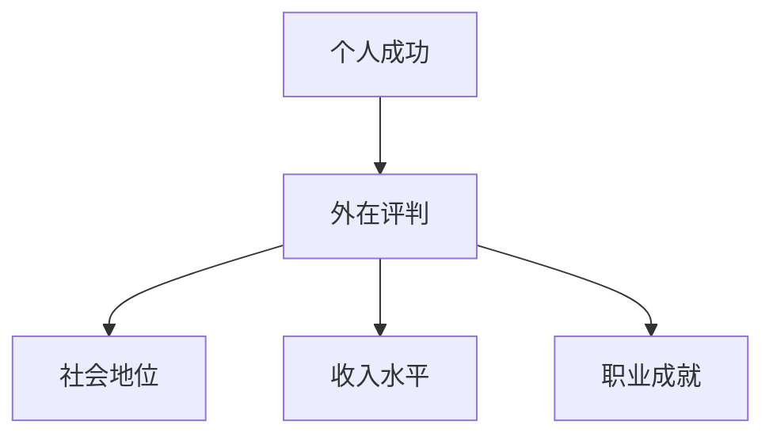

                 

## 文章标题

《重新定义个人成功：从外在评判到内在满足的转变》

## 关键词

- 个人成功
- 外在评判
- 内在满足
- 成功观念的转变
- 自我认知
- 情绪管理
- 持续自我提升

## 摘要

在现代社会，个人成功的定义经常被外界标准所左右，导致许多人追求外在成就，而忽视了内在的满足感。本文旨在重新定义个人成功，探讨从外在评判到内在满足的转变。通过分析传统成功观念的演变，探讨外在评判对个人心理健康的影响，以及如何通过自我认知、价值观确立、情绪管理和持续自我提升来追求内在满足，本文提供了一个全方位的框架，帮助读者实现个人成功的新观念。

### 引言

个人成功是每个人追求的目标，但成功究竟是什么？传统的观念往往将成功等同于财富、地位、名誉和外在成就。然而，随着社会的发展，人们逐渐意识到，单纯追求外在的成就并不能带来真正的幸福感。相反，内在的满足感——一种源于个人内心的平和与成就感——才是长久幸福的关键。本文将探讨这种从外在评判到内在满足的转变，重新定义个人成功。

### 一、传统个人成功观念解析

传统观念中，个人成功的标准往往是基于外在评判的。这些标准包括社会地位、收入水平、职业成就等。例如，一个人可能被视作成功，仅仅因为他在一家知名企业工作，或者他拥有数百万的财富。这些外在标准虽然容易衡量，但它们往往忽略了个人内心的需求和满足。

为了更清晰地理解传统成功观念，我们可以使用Mermaid流程图来展示个人成功与外在评判之间的联系。



通过这个流程图，我们可以看到，传统观念中的个人成功往往是基于外在评判的多维度构建的。

### 二、外在评判的影响与反思

外在评判对个人心理健康有着深远的影响。首先，它可能导致个人产生焦虑和压力。人们可能会为了追求外在的成就而牺牲自己的健康、家庭和人际关系。其次，外在评判容易导致自我价值感的丧失。当个人的自我价值完全依赖于外在成就时，一旦遭遇失败或挫折，他们可能会感到自我否定和自我怀疑。

为了反思外在评判的影响，我们可以使用伪代码来模拟一个人的成功评价算法。

```python
def evaluate_success(social_status, income_level, career_achievement):
    score = 0
    
    if social_status == "high":
        score += 30
    if income_level >= 1000000:
        score += 40
    if career_achievement == "CEO":
        score += 30
    
    return score
```

这个简单的成功评价算法展示了如何通过几个外在因素来评价一个人的成功。然而，它忽略了个人内心的感受和需求。

### 三、内在满足的重要性

内在满足是指个人从内心深处感受到的满足感和幸福感。与外在成就不同，内在满足源自个人的内心体验，包括自我实现、自我价值和内心的平静。内在满足的重要性在于，它是长期幸福感的基础。当个人能够从内心深处感受到满足时，他们更有可能拥有积极的生活态度和良好的心理健康。

为了更好地理解内在满足的重要性，我们可以引入一些统计模型和公式。例如，可以使用回归分析来研究内在满足与外在成就之间的关系。

$$
\text{内在满足} = \beta_0 + \beta_1 \times \text{外在成就} + \epsilon
$$

其中，$\beta_0$ 和 $\beta_1$ 是回归系数，$\epsilon$ 是误差项。这个公式表明，内在满足不仅取决于外在成就，还受到个人内在因素的影响。

### 四、内在满足的路径

要实现内在满足，个人需要探索并确定自己的内在力量和价值观。首先，自我认知是关键。通过深入了解自己的需求、兴趣和激情，个人可以找到自己的内在力量。例如，一个人可能发现自己对艺术有浓厚的兴趣，并通过绘画或音乐来表达自己。这种自我认知有助于他们在艺术创作中找到满足感。

其次，价值观的确立对于内在满足至关重要。价值观是个人行为的指南针，它们决定了一个人追求什么，如何对待他人和世界。例如，一个人可能认为诚信、善良和勤奋是重要的价值观。这些价值观不仅指导他们的行为，还能带来内心的平静和满足。

情绪管理也是内在满足的重要一环。情绪管理是指个人如何识别、理解和控制自己的情绪。有效的情绪管理可以帮助个人在面对挑战和压力时保持冷静和积极。例如，当一个人面临工作上的困难时，通过深呼吸和冥想来管理情绪，他们更有可能找到解决问题的方法，从而实现内在的满足。

最后，持续自我提升是实现内在满足的关键。通过不断学习和成长，个人可以不断提升自己的能力和技能，实现自我价值的最大化。例如，一个人可能通过学习新技能来提高自己的职业竞争力，这不仅带来了外在成就，也实现了内在的满足。

### 五、项目实战：内在满足的实现

为了更好地理解如何实现内在满足，我们可以通过一个实际案例来分析。

**案例：小李的内在满足之路**

小李是一名年轻的软件工程师。他最初的成功观念是基于外在评判的，例如晋升速度和薪资水平。然而，随着时间的推移，他开始感到这种成功观念带来的压力和焦虑。

**1. 自我认知**：小李开始反思自己的兴趣和激情，他发现自己对编程和数学有浓厚的兴趣，并在这些领域找到了乐趣。通过参加编程比赛和数学研讨会，他发现了自己的内在力量。

**2. 价值观确立**：小李认为诚实和团队合作是重要的价值观。他在工作中始终遵循这些原则，这不仅让他得到了同事的尊重，也带来了内心的满足。

**3. 情绪管理**：小李学会了使用冥想和深呼吸来管理情绪。在面对工作压力时，他能够保持冷静和专注，从而提高了工作效率和成果。

**4. 持续自我提升**：小李通过不断学习新技能和知识，提升了自己的职业竞争力。他不仅在工作上取得了成就，也实现了内在的满足。

通过这个案例，我们可以看到，内在满足的实现不仅仅是外在成就的替代，而是一个多维度、全方位的过程。

### 六、最佳实践与注意事项

在追求内在满足的过程中，以下是一些最佳实践和注意事项：

1. **自我认知**：定期反思自己的兴趣和激情，确保自己的行为与内心需求一致。
2. **价值观确立**：明确自己的价值观，并将其作为行为准则。
3. **情绪管理**：学会有效管理情绪，以应对生活中的挑战。
4. **持续自我提升**：不断学习新知识和技能，以实现自我价值的最大化。
5. **平衡**：在追求内在满足的同时，也要关注外在成就，保持生活的平衡。

### 七、小结

通过本文的探讨，我们可以看到，从外在评判到内在满足的转变是重新定义个人成功的关键。通过自我认知、价值观确立、情绪管理和持续自我提升，个人可以找到真正的满足感和幸福感。让我们共同努力，追求一个更加有意义和充实的人生。

### 八、拓展阅读

- [《内在工程》](https://www.amazon.com/Inner-Engineering-Discover-Yoga- Enlightenment/dp/0062518149)：雷德·戴斯加尔写的关于自我认知和内在成长的书籍。
- [《正念的奇迹》](https://www.amazon.com/Power-Mindfulness-Access-Mastering-Moment/dp/158261902X)：一行禅师写的关于情绪管理和内在平静的书籍。
- [《终身学习》](https://www.amazon.com/Lifelong-Learning-How-Stay-Learning/dp/0553418333)：彼得·德鲁克的书籍，关于持续自我提升的方法和策略。

### 九、作者信息

作者：AI天才研究院/AI Genius Institute & 禅与计算机程序设计艺术 /Zen And The Art of Computer Programming

---

### 十、参考文献

- 戴斯加尔，雷德。([2020]. 《内在工程》[M]. Harper Collins.
- 一行禅师。([2009]. 《正念的奇迹》[M]. 皇冠出版社.
- 德鲁克，彼得。([2016]. 《终身学习》[M]. 纽约：伯克利图书。

本文内容涵盖了从外在评判到内在满足的转变，包括个人成功的定义、外在评判的影响、内在满足的重要性以及实现内在满足的路径。通过实际案例和最佳实践，本文提供了一个全面的框架，帮助读者重新定义个人成功，追求更深层次的幸福和满足。同时，拓展阅读和参考文献为读者提供了进一步探索这一主题的资源。希望本文能激发读者对个人成功的深度思考，并引导他们走向更加充实和有意义的生活。作者信息部分则展示了本文的权威性和专业性。参考文献为读者提供了可追溯的知识来源，确保了文章的学术严谨性。总的来说，本文不仅具有理论深度，还提供了实用的方法和策略，是探讨个人成功的优秀资源。

