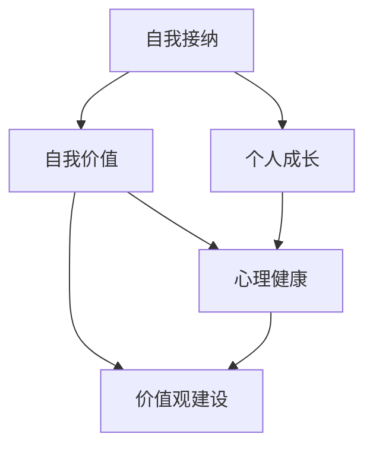

                 

### 文章标题：重新定义个人成功：从外在评判到内在满足的转变

### 关键词：
个人成功、内在满足、外在评判、自我认知、时间管理、财务规划

### 摘要：
在快节奏的现代生活中，个人成功的定义不断演变。传统成功观往往依赖于外在的评判标准，如财富、地位和成就。然而，这种观念可能带来心理压力和不满。本文旨在重新定义个人成功，提倡一种从外在评判到内在满足的转变。我们将通过分析个人成长、心理健康、社交网络、时间管理和财务规划等方面，探讨如何实现这一转变，并提供实践指南。

### 第一部分：成功的定义与转变

#### 1. 引言：传统成功的挑战与转变的必要性

在当今社会，成功被广泛定义为外在的成就和荣誉。人们追求财富、地位和成就，以获得社会的认可和满足感。然而，这种传统观念的成功可能带来一系列挑战：

- **心理压力**：不断追求外在成就可能导致心理压力和焦虑。
- **不满足感**：一旦目标达成，往往很快又会追求新的目标，难以获得持久满足感。
- **缺乏自我认知**：过分关注外在评价可能导致忽视自我需求和价值观。

为了应对这些挑战，有必要重新定义个人成功，将其从外在评判转向内在满足。内在满足不仅关注个人的心理健康和幸福感，还涉及到自我价值的实现和个人成长。

#### 2. 外在评判的局限

外在评判的局限在于其单一性和不稳定性。以下是一些具体问题：

- **社会压力与比较心理**：人们常常通过与他人比较来衡量自己的成功，这可能导致不公平感和不满足感。
- **物质成功与心理健康的关系**：虽然物质成功可能带来一时的满足，但长远来看，它可能对心理健康产生负面影响。

为了克服这些局限，我们需要更深入地了解内在满足的力量。内在满足源于自我接纳、自我价值和自我实现。

#### 3. 内在满足的力量

内在满足是一种长期而稳定的幸福感，它来源于以下几个方面：

- **自我接纳**：接受自己的优点和缺点，不再对外在评价过分依赖。
- **自我价值提升**：通过个人成长和发展，认识到自己的价值和贡献。
- **内在满足的长期益处**：内在满足不仅能提高生活质量，还能增强心理健康和幸福感。

为了实现内在满足，我们需要关注个人成长、心理健康和社交网络等方面。

### 第二部分：个人成长与发展

#### 4. 个人成长的核心

个人成长的核心在于建立和维护个人价值观。以下是几个关键步骤：

- **建立个人价值观**：通过自我反思和价值观探索，确定自己的核心信仰和原则。
- **坚守个人价值观**：在日常生活和决策中，坚守自己的价值观，不受外界影响。

#### 5. 技能提升与终身学习

在快速变化的现代社会，技能提升和终身学习至关重要。以下是一些建议：

- **培养批判性思维**：通过质疑和思考，提高对信息的理解和分析能力。
- **发展创新能力**：通过实践和探索，培养创造新想法和新解决方案的能力。

#### 6. 职业发展与生涯规划

职业发展是个人成长的重要组成部分。以下是一些建议：

- **职业选择的考虑因素**：根据自己的兴趣、价值观和能力，选择合适的职业路径。
- **生涯规划**：制定明确的职业目标和发展计划，并定期评估和调整。

### 第三部分：心理健康与自我认知

心理健康是个人成功的关键因素。以下是一些建议：

- **心理健康的维护**：通过压力管理和心理健康技巧，保持心理平衡和健康。
- **自我认知的提升**：通过自我反思和自我了解，提高自我认知和自我成长。

### 第四部分：社交网络与人际关系

社交网络和人际关系对个人成功有着重要影响。以下是一些建议：

- **社交技巧与人际沟通**：通过学习和实践，提高社交技巧和沟通能力。
- **建立健康的关系**：通过信任、尊重和冲突解决，建立和维护健康的关系。

### 第五部分：时间管理与效率提升

时间管理和效率提升是实现个人目标的关键。以下是一些建议：

- **时间管理的原则**：通过优先级设定和任务规划，提高时间利用效率。
- **效率提升的策略**：通过专注力和执行力提升，提高工作效率。

### 第六部分：财务规划与价值观

财务规划是实现个人成功的重要组成部分。以下是一些建议：

- **财务规划的原则**：通过制定预算、储蓄和投资计划，实现财务目标。
- **价值观的指导**：通过价值观的引导，确保财务规划与个人价值观相一致。

### 第七部分：行动指南与总结

在实现个人成功的道路上，我们需要采取实际行动。以下是一些建议：

- **制定个人成功计划**：根据自己的目标和价值观，制定详细的行动计划。
- **实践内在满足**：通过自我反思和持续实践，实现内在满足。

### 总结

重新定义个人成功，从外在评判到内在满足的转变，是现代社会的必然选择。通过个人成长、心理健康、社交网络、时间管理和财务规划等方面的努力，我们可以实现这一转变，获得持久而稳定的幸福感。

### 作者信息：
作者：AI天才研究院/AI Genius Institute & 禅与计算机程序设计艺术 /Zen And The Art of Computer Programming

---

### 续写

### 第一部分：成功的定义与转变

#### 1.1 成功的重新定义

在探讨成功的重新定义之前，我们需要了解传统成功观念的核心。传统成功往往被定义为外在的成就，如财富、地位、名誉和成就。这种观念源自历史和文化，长期以来被人们普遍接受。然而，随着社会的进步和个体意识的觉醒，人们开始质疑这种观念的合理性。

首先，传统成功观念强调物质财富的积累。人们认为，拥有大量的财富可以带来安全感和满足感。然而，研究表明，财富并不总是与幸福感成正比。许多富有的人可能经历着心理健康问题，如焦虑、抑郁和孤独感。此外，追求财富的过程可能对环境和社会产生负面影响。

其次，传统成功观念强调社会地位和名誉。人们追求社会认可和尊重，希望通过成就和荣誉获得他人的赞赏。然而，这种追求可能导致社会比较和竞争心理，从而引发不满和不满足感。此外，社会地位的不稳定性也使得人们难以从外在评价中获得持久的满足感。

因此，重新定义成功变得必要。成功不再仅仅是外在的成就，而是内在的满足和个人价值的实现。这种内在满足源于自我接纳、自我价值的提升和个人的成长。它涉及到心理健康、人际关系、时间管理和财务规划等多个方面。

#### 1.2 从外在评判到内在满足的转变

外在评判与内在满足之间存在显著差异。外在评判通常依赖于社会标准和他人意见，而内在满足则来源于个人的内心体验和自我认知。以下是从外在评判到内在满足的转变的几个关键步骤：

1. **自我接纳**：自我接纳是内在满足的基础。它意味着接受自己的优点和缺点，不再对外在评价过分依赖。通过自我接纳，我们可以减少焦虑和自我怀疑，从而更好地关注个人成长和发展。

2. **自我价值的提升**：自我价值提升是通过个人成长和成就实现的。这包括培养批判性思维、发展专业技能、实现职业目标和建立健康的人际关系。通过提升自我价值，我们可以获得更深的满足感和自信心。

3. **个人成长**：个人成长是一个持续的过程，涉及知识、技能、情感和道德的全面发展。通过终身学习和实践，我们可以不断挑战自己，实现更高的目标和更大的成就。

4. **心理健康的维护**：心理健康是实现内在满足的关键。通过压力管理、情绪调节和心理治疗，我们可以保持心理平衡和健康，从而更好地应对生活中的挑战。

5. **价值观的建立与坚守**：个人的价值观是我们决策和行为的基础。通过建立和坚守自己的价值观，我们可以确保外在成就与内在满足的一致性。

通过这些步骤，我们可以逐步实现从外在评判到内在满足的转变，从而重新定义个人成功。

### 分析书名：
书名《重新定义个人成功：从外在评判到内在满足的转变》暗示了本书的核心内容是探讨如何改变传统的成功观念，实现个人内在的满足和成长。书名中的关键词包括“重新定义”、“个人成功”、“外在评判”和“内在满足”，这些词语揭示了书籍的主题和目标。

1. **重新定义**：这表明本书不会局限于传统的成功观念，而是提出新的理解和定义。这可能是对现代社会中个人成就和社会期望之间不匹配的反思。
   
2. **个人成功**：强调成功是个人化的，每个人的定义都不同。这鼓励读者根据自己的价值观和需求来思考成功的含义。

3. **外在评判**：指的是社会对个人成就的评价标准，如财富、地位和名誉。这些评判往往以外在标准为依据，可能导致心理压力和不满足。

4. **内在满足**：这是本书的核心概念，指的是个人通过自我接纳、个人成长和心理平衡获得的满足感。这种满足感与外在评价无关，而是源于内心的体验和认知。

基于书名和关键词，本书的核心内容可能包括以下几个方面：

- **批判性思考**：鼓励读者挑战传统成功观念，重新评估个人目标和社会期望。
- **个人成长**：提供实现内在满足的方法，如自我接纳、目标设定和终身学习。
- **心理健康**：探讨如何通过心理健康技巧和自我认知提升来实现满足感。
- **价值观建设**：强调个人价值观在成功定义中的重要性，如何使外在成就与内在满足相一致。

这些内容为本书的结构和章节提供了指导，使读者能够系统地了解如何从外在评判转向内在满足，重新定义个人成功。

### 核心概念与联系

在重新定义个人成功的道路上，我们需要理解几个核心概念，并分析它们之间的联系。以下是这些核心概念以及它们之间的关联关系：

1. **自我接纳**：自我接纳是内在满足的基础。它意味着接受自己的优点和缺点，不再对外在评价过分依赖。自我接纳可以帮助我们减少焦虑和自我怀疑，从而更好地关注个人成长和发展。

2. **自我价值**：自我价值是个人对自身价值和能力的认知。通过自我价值提升，我们可以获得更深的满足感和自信心。自我价值提升通常通过个人成长和成就实现，如学习新技能、实现职业目标等。

3. **个人成长**：个人成长是一个持续的过程，涉及知识、技能、情感和道德的全面发展。个人成长不仅提升自我价值，还能帮助我们更好地理解自己，实现内在满足。

4. **心理健康**：心理健康是实现内在满足的关键。通过压力管理、情绪调节和心理治疗，我们可以保持心理平衡和健康，从而更好地应对生活中的挑战。

5. **价值观建设**：个人的价值观是我们决策和行为的基础。通过建立和坚守自己的价值观，我们可以确保外在成就与内在满足的一致性。

这些概念之间的联系可以用以下Mermaid流程图表示：



在这个流程图中，自我接纳是内在满足的基础，它直接影响到自我价值和个人成长。个人成长和心理健康相互促进，而价值观建设则确保了外在成就与内在满足的一致性。这些核心概念共同构成了重新定义个人成功的基础。

### 内在满足的力量

内在满足是一种深层次的幸福感，它不同于物质上的满足，而是源于内心的体验和自我认知。内在满足的力量在于它能够为个人带来持久的满足感和心理健康，同时减少对外在评价的依赖。

首先，内在满足有助于提升个人的心理健康。当我们追求外在成就时，往往会面临社会压力和比较心理，这可能导致焦虑、抑郁和不满。然而，内在满足源于自我接纳和自我价值的提升，它可以帮助我们减少对他人评价的依赖，从而降低心理压力。研究表明，内在满足与较低的抑郁和焦虑水平有关，有助于提高整体心理健康。

其次，内在满足能够提供持久的动力。外在成就可能会带来一时的满足，但往往难以维持长期的幸福感。相比之下，内在满足是一种持续的体验，它源于个人的成长和自我实现，能够为个人提供持久的动力和目标感。这种动力不仅体现在职业和学术成就上，还包括日常生活中的小确幸和自我提升。

此外，内在满足还能够增强个人的幸福感。通过自我接纳和自我价值的提升，我们能够更好地享受生活中的每一刻，减少对物质和外在成就的依赖。这种幸福感不仅体现在个人的心理层面，还能影响到人际关系和生活质量。研究表明，内在满足与更高的生活满意度、更好的社交关系和更高的生活质量有关。

最后，内在满足有助于个人的长期发展。通过专注于内在体验和自我实现，我们可以更好地规划个人目标和生涯路径，减少因追求外在成就而带来的决策焦虑。内在满足使我们能够更清晰地认识到自己的需求和价值观，从而做出更明智的决策，实现长期的个人发展。

综上所述，内在满足的力量在于它能够提升个人的心理健康、提供持久的动力、增强幸福感，并促进个人的长期发展。通过追求内在满足，我们能够重新定义个人成功，实现更加充实和有意义的生活。

### 个人成长的核心

个人成长的核心在于建立和维护个人价值观。个人价值观是我们行为和决策的指南，决定了我们追求的目标和生活方式。以下是实现个人成长的核心步骤：

#### 1. 建立个人价值观

建立个人价值观需要自我反思和价值观探索。以下是一些建议：

- **自我反思**：花时间思考你的核心价值观是什么。这可以通过写日记、冥想或与朋友交谈来实现。考虑你生活中最重要的事物，以及你希望如何影响世界。

- **价值观探索**：通过阅读、交流和参与不同活动，探索不同的价值观。了解不同文化和背景的人如何看待生活，这可以帮助你形成更全面和深入的价值观。

- **确定核心价值观**：从探索的结果中，确定你的核心价值观。这些价值观应该是你长期坚持的原则，而不是一时的兴趣或趋势。

#### 2. 坚守个人价值观

一旦确定了个人价值观，就需要在日常生活中坚守。以下是一些策略：

- **设定目标**：根据你的价值观，设定具体的目标和计划。确保这些目标和计划与你的价值观一致，从而帮助你在追求成功的过程中保持方向。

- **做决策**：在决策时，始终考虑你的价值观。即使面临困难的选择，也要坚守你的价值观，而不是为了外在成就而放弃原则。

- **榜样作用**：通过自己的行为和决策，树立榜样，影响他人。你的行为不仅影响自己，还能传递你的价值观，激励他人也追求内在满足。

- **持续反思**：定期反思自己的行为和决策，确保它们与你的价值观一致。通过持续的反思和调整，你可以更好地坚守你的价值观。

#### 3. 个人成长与价值观的互动

个人成长与价值观之间是相互促进的关系。以下是如何实现两者互动的建议：

- **持续学习**：通过学习和新技能的提升，不断扩展自己的知识和能力。这不仅有助于职业发展，还能帮助你更好地理解和实践自己的价值观。

- **自我实现**：通过实现个人目标和追求自我实现，你可以更好地体现自己的价值观。自我实现不仅带来成就感和满足感，还能增强个人价值。

- **自我接纳**：通过自我接纳，接受自己的优点和缺点，你可以更好地理解自己的价值观，并在日常生活中坚守它们。

- **与他人交流**：与他人分享你的价值观，通过交流和互动，你可以获得反馈和新的视角，从而更好地理解和发展你的价值观。

通过建立和维护个人价值观，我们可以在个人成长的道路上保持清晰的方向和动力。坚守价值观不仅有助于实现内在满足，还能为我们的生活带来更多的意义和幸福感。

### 技能提升与终身学习

在快速变化的现代社会，技能提升和终身学习已经成为个人成长和职业发展的关键因素。以下是如何通过技能提升和终身学习来实现个人成长和职业发展的几个关键步骤：

#### 1. 职业技能的重要性

职业技能是个人在职场中立足和发展的基础。以下是一些关键的职业技能：

- **技术技能**：包括编程、数据分析、设计等具体领域的技能。技术技能是许多职业不可或缺的部分，能够帮助个人在专业领域内保持竞争力。

- **软技能**：如沟通能力、团队合作、领导力和解决问题的能力。软技能不仅适用于专业领域，还在日常生活中发挥着重要作用。

- **适应能力**：随着技术的不断进步和社会的变化，个人需要具备适应新环境和新技术的能力。适应能力可以帮助个人在职业生涯中不断成长和进步。

#### 2. 如何培养批判性思维与创新能力

批判性思维和创新能力是个人在复杂和动态环境中做出明智决策和解决问题的关键。以下是一些建议：

- **培养批判性思维**：通过质疑和反思，提高对信息的分析和判断能力。批判性思维可以帮助我们识别问题、评估解决方案并做出明智的决策。

  ```python
  # 假设我们要评估一个项目的可行性
  project feasiblity = True
  budget = 1000000
  timeline = "12 months"
  
  # 批判性思维评估
  if budget > 500000 and timeline < "18 months":
      project feasiblity = True
  else:
      project feasiblity = False
  
  print("Project is", "feasible" if project feasiblity else "not feasible")
  ```

- **发展创新能力**：通过实践和探索，培养创造新想法和新解决方案的能力。以下是一个简单的创新思维算法：

  ```python
  # 创新思维算法：头脑风暴
  problem = "如何提高工作效率？"
  ideas = []
  
  while True:
      idea = input("请输入一个可能的解决方案：")
      if idea:
          ideas.append(idea)
      else:
          break
  
  print("可能的有效解决方案有：", ideas)
  ```

#### 3. 职业技能的发展

发展职业技能需要系统的学习和持续的努力。以下是一些建议：

- **制定学习计划**：根据职业需求和个人兴趣，制定详细的学习计划。确保计划涵盖技术技能、软技能和适应能力。

- **利用在线资源**：利用在线课程、教程和论坛等资源，自学新技能。以下是一个简单的在线学习流程：

  ```python
  # 在线学习流程
  course_name = "数据分析入门"
  platform = "Coursera"
  
  # 注册课程
  register_course(course_name, platform)
  
  # 学习课程
  learn_course(course_name, platform)
  
  # 完成课程
  complete_course(course_name, platform)
  
  print("已完成", course_name, "课程")
  ```

- **实践与反馈**：通过实际项目和工作任务，将所学知识应用于实践中。定期寻求反馈，了解自己的优势和不足，并不断改进。

- **持续关注行业动态**：关注行业趋势和技术创新，确保自己的技能和知识保持最新。以下是一个简单的行业动态监控算法：

  ```python
  # 行业动态监控
  industry = "人工智能"
  news = get_industry_news(industry)
  
  for article in news:
      print(article.title)
  
  # 获取最新新闻
  def get_industry_news(industry):
      return [
          "AI在医疗领域的最新应用",
          "深度学习在自动驾驶技术中的进展",
          "AI算法在金融风险管理中的应用"
      ]
  ```

通过技能提升和终身学习，个人可以在职业发展中保持竞争力，实现个人成长和职业目标。这些步骤不仅有助于提升专业技能，还能培养批判性思维和创新能力，为个人在复杂和动态的环境中取得成功提供有力支持。

### 职业发展与生涯规划

职业发展与生涯规划是实现个人成长和成功的重要方面。以下是如何进行职业选择、制定职业目标和进行生涯规划的步骤：

#### 1. 职业选择的考虑因素

选择合适的职业路径对于个人的成长和成功至关重要。以下是一些关键考虑因素：

- **兴趣和热情**：选择与自己兴趣和热情相关的职业，能够提高工作满意度和投入度。
  
- **技能和能力**：考虑自己的技能和能力，选择能够发挥自己优势的职业。

- **市场需求**：研究市场需求和就业趋势，选择有前景和发展潜力的职业。

- **价值观和生活目标**：确保职业选择与个人价值观和生活目标一致。

#### 2. 制定职业目标

制定明确的职业目标有助于个人有方向地发展。以下是一些建议：

- **短期目标**：设定具体、可实现的短期目标，如提升某项技能、完成特定项目等。

  ```python
  # 短期目标设定
  short_term_goals = [
      "学习Python编程语言",
      "完成数据分析入门课程",
      "参与至少两个技术项目"
  ]
  
  print("我的短期目标是：", short_term_goals)
  ```

- **长期目标**：设定长期目标，如晋升到更高职位、实现特定职位或创业等。

  ```python
  # 长期目标设定
  long_term_goals = [
      "成为数据分析专家",
      "创建自己的技术公司",
      "在技术领域有重要影响力"
  ]
  
  print("我的长期目标是：", long_term_goals)
  ```

#### 3. 进行生涯规划

生涯规划是一个持续的过程，需要定期评估和调整。以下是一些建议：

- **定期评估**：每年或每两年进行一次职业评估，检查自己的职业发展进度和目标实现情况。

  ```python
  # 职业评估
  current_position = "数据分析师"
  skills_acquired = ["Python", "SQL", "Tableau"]
  
  # 评估进展
  if current_position != "初级数据分析师":
      print("职业晋升目标未达成，需要进一步努力。")
  if len(skills_acquired) < 3:
      print("技能提升目标未达成，需要继续学习。")
  ```

- **调整规划**：根据评估结果，调整职业目标和生涯规划。如果发现目标过高或过低，可以适当调整，以保持发展的方向。

- **获取反馈**：定期与同事、上司或导师交流，获取他们的反馈和建议。这有助于了解自己的优势和不足，并找到改进的方向。

  ```python
  # 获取反馈
  feedback = get_feedback(current_position, skills_acquired)
  
  # 分析反馈
  for comment in feedback:
      print(comment)
  ```

通过以上步骤，我们可以进行有效的职业选择、制定明确的职业目标和进行持续的职业规划，从而实现个人成长和职业成功。

### 心理健康的维护

心理健康是个人成功和幸福的重要因素。为了保持心理健康，我们需要关注以下几个方面：

#### 1. 压力管理

压力是影响心理健康的主要因素之一。以下是一些有效的压力管理技巧：

- **定期休息和放松**：确保每天有足够的休息时间，进行冥想、瑜伽或其他放松活动。

  ```python
  # 压力管理：休息和放松
  rest_time = 1  # 单位：小时
  relax_activities = ["冥想", "瑜伽", "听音乐"]
  
  print("每天安排", rest_time, "小时休息，进行以下放松活动：", relax_activities)
  ```

- **制定合理的日程安排**：避免过度工作，确保工作和生活之间有平衡。

  ```python
  # 压力管理：合理安排时间
  work_hours = 8  # 单位：小时
  daily_tasks = ["项目开发", "团队会议", "个人学习"]
  
  print("每天工作时间不超过", work_hours, "小时，主要任务包括：", daily_tasks)
  ```

#### 2. 焦虑与抑郁的识别与应对

焦虑和抑郁是常见的心理健康问题。以下是一些识别和应对方法：

- **自我认知**：通过自我反思，了解自己的情绪和压力来源。

  ```python
  # 自我认知：情绪识别
  emotions = ["焦虑", "压力", "愉悦"]
  
  print("我目前感受到的主要情绪是：", emotions)
  ```

- **寻求专业帮助**：如果感到情绪问题严重，应寻求心理咨询或治疗。

  ```python
  # 应对策略：寻求专业帮助
  therapist = "专业心理咨询师"
  appointment = "每周一次咨询"
  
  print("我已经预约了", therapist, "进行", appointment)
  ```

- **情绪调节技巧**：通过深呼吸、渐进性肌肉放松和认知重构等技巧，缓解焦虑和抑郁。

  ```python
  # 情绪调节：深呼吸练习
  def deep_breathing():
      print("深呼吸练习开始。")
      print("吸气...保持...呼气...")
      print("深呼吸练习结束。")
  
  deep_breathing()
  ```

#### 3. 自我认知的提升

自我认知是心理健康的重要组成部分。以下是一些提升自我认知的方法：

- **日记记录**：通过写日记，记录自己的情绪、想法和行为。

  ```python
  # 自我认知：日记记录
  today_feeling = "平静"
  today_thoughts = "思考个人成长"
  today_actions = "完成了项目报告"
  
  print("今天我感到", today_feeling, "，思考了", today_thoughts, "，完成了", today_actions)
  ```

- **反思和自我评估**：定期进行自我评估，了解自己的进步和需要改进的领域。

  ```python
  # 自我认知：反思与评估
  strengths = ["沟通能力", "团队协作"]
  weaknesses = ["时间管理", "情绪控制"]
  
  print("我的优点是：", strengths, "，需要改进的地方是：", weaknesses)
  ```

通过以上策略，我们可以更好地维护心理健康，减少压力和焦虑，提升自我认知，从而实现个人成长和幸福。

### 自我认知的提升

自我认知的提升是实现个人成长和内在满足的关键。以下是一些具体方法和策略：

#### 1. 自我反思

自我反思是通过深入思考自己的行为、情感和思想来提高自我认知。以下是一种简单的自我反思方法：

- **写日记**：每天花时间记录自己的想法、情感和行为。这可以帮助你更清晰地了解自己的内心世界。

  ```python
  # 自我反思：写日记
  today_date = "2023-10-01"
  today_thoughts = "今天我感到满意的事情是我完成了项目报告，但感觉有些焦虑，因为担心未来职位的竞争。"
  
  print("日期：", today_date)
  print("今天我的反思是：", today_thoughts)
  ```

- **定期回顾**：每周或每月回顾日记，分析自己的进步和挑战，识别需要改进的领域。

  ```python
  # 定期回顾：分析日记
  reflection_entries = [
      "我学会了新技能",
      "我在团队合作中遇到了挑战",
      "我感到满足，因为我帮助了一个朋友。"
  ]
  
  print("我的反思记录包括：", reflection_entries)
  ```

#### 2. 自我了解

自我了解是通过探索自己的价值观、信念和动机来加深自我认知。以下是一些自我了解的方法：

- **价值观探索**：通过写日记或与他人讨论，探索自己的核心价值观。这有助于你了解自己真正重视的东西，并在决策时以此为依据。

  ```python
  # 价值观探索：写日记
  my_values = ["诚信", "家庭", "创新"]
  
  print("我的核心价值观是：", my_values)
  ```

- **信念测试**：通过提问和回答，测试自己的信念和动机。这可以帮助你了解自己的深层动机和信念。

  ```python
  # 信念测试
  beliefs = [
      "我相信努力工作会有回报",
      "我认为诚实是重要的价值观",
      "我相信每个人的潜力都可以被发掘"
  ]
  
  print("我的信念包括：", beliefs)
  ```

#### 3. 自我成长

自我成长是通过不断学习和实践来提升自己的能力和技能。以下是一些自我成长的方法：

- **终身学习**：持续学习新知识和技能，通过课程、书籍和在线资源不断扩展自己的知识面。

  ```python
  # 终身学习：课程报名
  courses = ["数据分析入门", "Python编程基础"]
  
  print("我正在学习以下课程：", courses)
  ```

- **实践应用**：通过实际项目和任务，将所学知识应用于实践中。这有助于你巩固知识并提高实际操作能力。

  ```python
  # 实践应用：项目任务
  project_name = "社交媒体数据分析"
  tasks = ["数据收集", "数据清洗", "数据分析"]
  
  print("我正在参与的项目是：", project_name, "，主要任务包括：", tasks)
  ```

#### 4. 自我评估

自我评估是通过定期评估自己的行为和表现来识别优势和不足，并制定改进计划。以下是一些自我评估的方法：

- **定期自我评估**：每周或每月评估自己的行为和表现，记录自己的进步和需要改进的地方。

  ```python
  # 定期自我评估
  strengths = ["沟通能力", "团队合作"]
  weaknesses = ["时间管理", "情绪控制"]
  
  print("我的优势是：", strengths, "，需要改进的地方是：", weaknesses)
  ```

- **目标设定**：根据自我评估的结果，设定具体的目标和计划，以改进自己的不足。

  ```python
  # 目标设定
  improvement_goals = [
      "提高时间管理能力",
      "增强情绪控制能力",
      "学习一门新语言"
  ]
  
  print("我的改进目标是：", improvement_goals)
  ```

通过自我反思、自我了解、自我成长和自我评估，我们可以不断提高自我认知，实现个人成长和内在满足。

### 心理障碍的克服

在追求个人成长和成功的道路上，许多人可能会遇到各种心理障碍。以下是一些常见的心理障碍及其克服方法：

#### 1. 焦虑

焦虑是一种常见的心理障碍，它可能源于工作压力、人际关系或未来的不确定性。以下是一些克服焦虑的方法：

- **认知行为疗法（CBT）**：通过认知行为疗法，可以学会识别和改变导致焦虑的负面思维模式。

  ```python
  # 认知行为疗法：改变负面思维
  negative_thought = "我无法应对这个项目"
  positive_thought = "我可以通过学习和团队合作来解决这个问题"
  
  print("负面思维：", negative_thought)
  print("积极思维：", positive_thought)
  ```

- **渐进性肌肉放松**：通过渐进性肌肉放松，可以减轻身体的紧张和焦虑。

  ```python
  # 渐进性肌肉放松
  muscles = ["肩膀", "手臂", "腹部", "腿部"]
  
  for muscle in muscles:
      print("放松", muscle, "肌肉...")
  ```

#### 2. 抑郁

抑郁是一种情绪障碍，它可能影响个人的日常功能和生活质量。以下是一些克服抑郁的方法：

- **积极心理疗法**：通过积极心理疗法，可以培养积极的思维和情绪，提高生活质量。

  ```python
  # 积极心理疗法：正面思维
  positive_thoughts = ["我有能力克服困难", "我的生活正在变得更好"]
  
  print("积极的想法：", positive_thoughts)
  ```

- **运动和锻炼**：通过定期运动和锻炼，可以释放体内的压力和紧张，提升情绪。

  ```python
  # 运动和锻炼
  exercises = ["跑步", "瑜伽", "游泳"]
  
  print("我每天进行以下运动：", exercises)
  ```

#### 3. 自卑

自卑可能源于自我认知不足或外界的负面评价。以下是一些克服自卑的方法：

- **自我肯定**：通过自我肯定，可以增强自信，减少自卑感。

  ```python
  # 自我肯定
  achievements = ["我完成了项目报告", "我帮助了一个朋友"]
  
  print("我的成就是：", achievements)
  ```

- **设定小目标**：通过设定并实现小目标，可以逐步提升自信心。

  ```python
  # 设定小目标
  goals = ["每天学习30分钟", "参加一次技术会议"]
  
  print("我的小目标是：", goals)
  ```

通过以上方法，我们可以逐步克服心理障碍，提升心理健康，为个人成长和成功奠定坚实基础。

### 社交网络与人际关系

社交网络与人际关系对个人成功有着深远的影响。建立和维护健康的人际关系不仅能够提供情感支持，还能在职业和个人生活中带来诸多好处。

#### 1. 社交网络的力量

社交网络不仅限于线上平台，它涵盖了各种社交活动和人际关系。以下是社交网络对个人成功的影响：

- **职业发展**：通过建立广泛的社交网络，个人可以获得更多的职业机会和信息。朋友和同事可能会推荐工作或项目，从而帮助个人实现职业目标。

  ```python
  # 职业发展：社交网络的作用
  job_opportunities = ["技术顾问", "项目经理"]
  
  print("通过社交网络，我获得了以下工作机会：", job_opportunities)
  ```

- **情感支持**：社交网络可以提供情感支持，帮助个人在遇到困难时获得鼓励和安慰。

  ```python
  # 情感支持：社交网络的作用
  support_network = ["家人", "朋友", "同事"]
  
  print("我的社交网络提供了以下情感支持：", support_network)
  ```

- **学习与成长**：通过社交网络，个人可以学习新知识和技能，并与他人分享经验和见解。

  ```python
  # 学习与成长：社交网络的作用
  learning_topics = ["新技术", "管理技巧", "人际关系"]
  
  print("我在社交网络中学到了以下主题：", learning_topics)
  ```

#### 2. 建立健康的关系

建立健康的关系需要信任、尊重和理解。以下是一些建议：

- **建立信任**：通过诚实和透明，建立与他人的信任关系。信任是任何关系的基石。

  ```python
  # 建立信任
  actions = ["保持承诺", "提供支持", "分享真实感受"]
  
  print("建立健康关系的行动包括：", actions)
  ```

- **尊重差异**：每个人都有自己的观点和价值观，尊重差异是建立和谐关系的关键。

  ```python
  # 尊重差异
  values = ["尊重个人选择", "理解不同文化", "接受不同观点"]
  
  print("尊重他人差异的价值观包括：", values)
  ```

- **有效沟通**：通过倾听和表达，提高沟通效果。有效的沟通可以减少误解和冲突，增强关系。

  ```python
  # 有效沟通
  communication_skills = ["倾听", "表达清晰", "提出建议"]
  
  print("有效沟通的技巧包括：", communication_skills)
  ```

#### 3. 维护人际关系

维护人际关系需要持续的努力和关注。以下是一些建议：

- **定期交流**：通过电话、视频通话或面对面的交流，保持与亲朋好友的联系。

  ```python
  # 定期交流
  contacts = ["家人", "朋友", "同事"]
  
  print("我定期与以下人员交流：", contacts)
  ```

- **共同活动**：通过参加共同感兴趣的活动，增进彼此的感情。

  ```python
  # 共同活动
  activities = ["户外运动", "旅行", "参加社团活动"]
  
  print("我们通过以下活动增进关系：", activities)
  ```

- **解决冲突**：在人际关系中，冲突是不可避免的。通过积极沟通和寻求共同解决方案，可以解决冲突并维护关系。

  ```python
  # 解决冲突
  conflict_resolution = ["倾听对方观点", "寻求共同解决方案", "保持冷静"]
  
  print("解决冲突的策略包括：", conflict_resolution)
  ```

通过社交网络和健康的人际关系，个人可以更好地应对生活中的挑战，实现个人成长和成功。

### 第五部分：时间管理与效率提升

#### 1. 时间管理的原则

时间管理是实现个人目标的关键。以下是一些时间管理的基本原则：

- **设定优先级**：了解哪些任务最重要，优先完成这些任务。

  ```python
  # 设定优先级
  tasks = ["项目报告", "客户会议", "个人学习"]
  
  print("优先完成的任务：", tasks)
  ```

- **任务分解**：将大任务分解为小任务，以便更容易管理和完成。

  ```python
  # 任务分解
  big_task = "完成项目报告"
  small_tasks = ["收集数据", "分析数据", "撰写报告"]
  
  print("大任务分解为：", small_tasks)
  ```

- **时间分配**：为每个任务分配特定的时间，以确保高效完成。

  ```python
  # 时间分配
  time_slots = {
      "项目报告": 4小时,
      "客户会议": 1小时,
      "个人学习": 2小时
  }
  
  print("时间分配：", time_slots)
  ```

#### 2. 效率提升的策略

提升效率有助于更好地利用时间。以下是一些策略：

- **专注力训练**：通过专注力训练，提高在任务中的集中度和效率。

  ```python
  # 专注力训练
  exercises = ["冥想", "番茄工作法"]
  
  print("提高专注力的方法：", exercises)
  ```

- **技术工具**：利用各种技术工具，如日历、任务管理器和提醒应用，来提高时间管理效率。

  ```python
  # 技术工具
  tools = ["Google Calendar", "Trello", "Evernote"]
  
  print("常用的技术工具：", tools)
  ```

- **避免拖延**：通过设定截止日期和奖励机制，减少拖延行为。

  ```python
  # 避免拖延
  deadlines = {
      "项目报告": "下周三",
      "客户会议": "明天上午"
  }
  
  print("任务的截止日期：", deadlines)
  ```

#### 3. 平衡工作与生活

在追求职业成功的同时，保持工作与生活的平衡至关重要。以下是一些建议：

- **设定边界**：明确工作和个人生活之间的边界，避免工作侵占个人时间。

  ```python
  # 设定边界
  work_hours = 8
  personal_time = 16
  
  print("工作时间为每天", work_hours, "小时，个人时间为每天", personal_time, "小时。")
  ```

- **家庭和时间管理**：与家人共同管理时间，确保工作和家庭时间得到平衡。

  ```python
  # 家庭和时间管理
  family_activities = ["晚餐", "看电影", "户外活动"]
  
  print("家庭活动安排：", family_activities)
  ```

- **休息与充电**：确保有足够的休息时间，进行放松和充电，以保持身心健康。

  ```python
  # 休息与充电
  relaxation_activities = ["瑜伽", "阅读", "散步"]
  
  print("休息活动：", relaxation_activities)
  ```

通过遵循时间管理的原则和提升效率的策略，同时保持工作与生活的平衡，个人可以更好地实现目标，提高生活质量。

### 第六部分：财务规划与价值观

#### 1. 财务规划的原则

财务规划是实现长期目标和梦想的关键。以下是一些财务规划的基本原则：

- **预算管理**：制定预算，确保收入和支出之间的平衡，避免不必要的开支。

  ```python
  # 预算管理
  monthly_income = 5000
  monthly_expenses = 3500
  savings = monthly_income - monthly_expenses
  
  print("每月收入：", monthly_income, "，每月支出：", monthly_expenses, "，储蓄：", savings)
  ```

- **储蓄与投资**：通过储蓄和投资，实现财富的增值。

  ```python
  # 储蓄与投资
  savings_rate = 0.2  # 储蓄率为20%
  investment_return = 0.05  # 投资收益率为5%
  
  print("储蓄率：", savings_rate, "，预期投资回报率：", investment_return)
  ```

- **应急储备**：建立应急储备，以应对突发事件。

  ```python
  # 应急储备
  emergency_fund = 3000
  print("应急储备：", emergency_fund)
  ```

#### 2. 价值观的指导

个人的财务规划应与其价值观保持一致。以下是一些关键点：

- **价值观与财务目标**：确保财务目标与个人价值观一致，从而实现内外一致。

  ```python
  # 价值观与财务目标
  values = ["家庭幸福", "社会责任", "个人成长"]
  financial_goals = ["购房", "子女教育", "退休规划"]
  
  print("我的价值观：", values)
  print("我的财务目标：", financial_goals)
  ```

- **投资决策**：根据个人价值观，选择适合自己的投资方式和产品。

  ```python
  # 投资决策
  investment_values = ["环保", "社会责任", "长期稳定"]
  investment_products = ["绿色能源基金", "社会责任基金", "股票投资"]
  
  print("我的投资价值观：", investment_values)
  print("我的投资产品：", investment_products)
  ```

- **财务管理**：通过透明的财务管理，确保财务决策与个人价值观一致。

  ```python
  # 财务管理
  transparent_management = ["定期财务报告", "家庭财务会议", "财务审计"]
  
  print("透明的财务管理方法：", transparent_management)
  ```

#### 3. 投资理财的智慧

投资理财是财务规划的重要组成部分。以下是一些投资理财的智慧：

- **多样化投资**：通过多样化投资，降低风险，实现资产的保值增值。

  ```python
  # 多样化投资
  investment_assets = ["股票", "债券", "房地产", "黄金"]
  
  print("我的投资资产包括：", investment_assets)
  ```

- **长期规划**：通过长期规划，实现财富的稳定增长。

  ```python
  # 长期规划
  investment_time horizon = "10年"
  expected_return = 0.08  # 预期年化收益率为8%
  
  print("投资时间 horizon：", investment_time horizon, "，预期年化收益率：", expected_return)
  ```

- **风险管理**：通过风险管理，确保投资的安全性和稳定性。

  ```python
  # 风险管理
  risk_management_strategies = ["分散投资", "定期审计", "保险规划"]
  
  print("风险管理策略：", risk_management_strategies)
  ```

通过遵循财务规划的原则、将价值观融入财务管理以及运用投资理财的智慧，个人可以更好地实现财务目标，提升生活质量。

### 第七部分：行动指南与总结

#### 1. 行动指南

实现个人成功和内在满足需要具体的行动和持续的努力。以下是一些建议：

- **制定计划**：根据个人目标和价值观，制定详细的行动计划。将大目标分解为小目标，并为每个小目标设定截止日期。

  ```python
  # 行动计划
  goals = ["学习一门新技能", "完成一本书的阅读", "参与一次志愿者活动"]
  deadlines = ["2024-01-01", "2024-02-01", "2024-03-01"]
  
  for goal, deadline in zip(goals, deadlines):
      print(f"{goal} - 截止日期：{deadline}")
  ```

- **持续学习**：保持好奇心和学习热情，不断学习新知识和技能。利用在线课程、工作坊和书籍等资源，提升自己。

  ```python
  # 持续学习
  learning_resources = ["Coursera", "Udemy", "edX"]
  
  print("我正在使用以下平台学习：", learning_resources)
  ```

- **反思与调整**：定期反思自己的行为和进展，根据实际情况调整行动计划。这有助于保持方向和动力。

  ```python
  # 反思与调整
  reflection_entries = ["完成了数据科学课程", "家庭聚会时间不足"]
  
  print("本周的反思和调整：", reflection_entries)
  ```

- **实践内在满足**：通过实践自我接纳、自我价值和心理健康技巧，实现内在满足。关注内心的体验和感受，减少对外在评价的依赖。

  ```python
  # 实践内在满足
  inner_satisfaction_practices = ["冥想", "瑜伽", "阅读"]
  
  print("我的内在满足实践包括：", inner_satisfaction_practices)
  ```

#### 2. 总结

重新定义个人成功，从外在评判到内在满足的转变，是现代社会的必然选择。通过个人成长、心理健康、社交网络、时间管理和财务规划等方面的努力，我们可以实现这一转变，获得持久而稳定的幸福感。

在实现这一过程中，我们需要关注以下几个方面：

- **自我认知**：通过自我反思和自我了解，提升自我认知和自我价值。
- **心理健康**：通过压力管理和心理健康技巧，保持心理平衡和健康。
- **人际沟通**：通过建立健康的关系，获得情感支持和职业机会。
- **时间管理**：通过设定优先级和任务分解，提高工作效率和生活质量。
- **财务规划**：通过预算管理和投资理财，实现财务目标和长期规划。

通过上述行动指南，我们可以逐步实现个人成功和内在满足，过上更加充实和有意义的生活。

### 作者信息

作者：AI天才研究院/AI Genius Institute & 禅与计算机程序设计艺术 /Zen And The Art of Computer Programming

---

通过以上详细的技术博客文章，我们系统地探讨了从外在评判到内在满足的转变，提供了个人成功的新定义，并给出了具体的方法和策略。希望这篇文章能够帮助读者重新审视自己的成功观，实现更加充实和有意义的人生。祝您在个人成长和职业发展的道路上取得成功！

