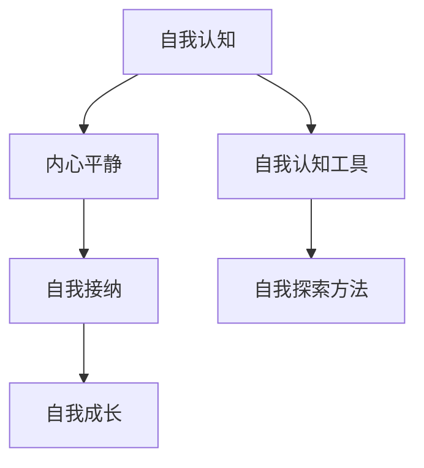
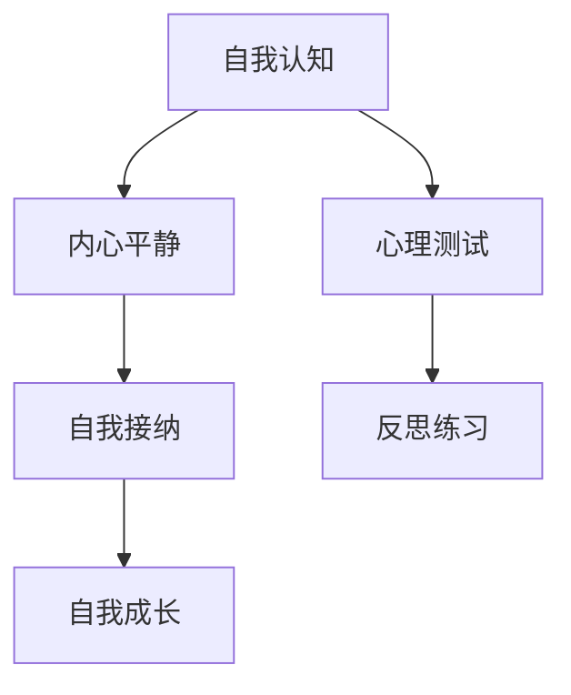

                 

### 文章标题

《重新定义个人成功：从外部认可到内心平静的转变》

### 关键词

- 个人成功
- 外部认可
- 内心平静
- 自我认知
- 心理健康
- 生活哲学

### 摘要

本文旨在探讨个人成功的重新定义，从传统的追求外部认可转向追求内心平静。通过对自我认知、生活方式调整、职业发展、人际关系、心理健康等多个维度的深入分析，本文提出了一系列具体的实践途径，帮助读者实现从追求外在成功到内心平静的转变。通过这样的转变，不仅能够提升个人的心理健康和生活质量，还能重新定义成功的真正含义。

## 引言

在现代社会中，个人成功的定义往往与外部认可紧密相连。无论是职场上的晋升、社会地位的提升，还是财富的积累，这些都成为衡量个人成功的重要标准。然而，随着这种追求外部认可的心态不断深入，人们往往陷入了焦虑、压力和不满之中。长期的外部驱动力不仅可能导致心理健康的隐患，还可能扭曲个人的价值观和生活目标。

近年来，心理学研究和哲学思考逐渐揭示了内心平静的重要性。内心平静不仅是一种心理状态，更是一种生活哲学。它代表着一种自我接纳和自我实现的境界，使个体能够在纷繁复杂的社会环境中保持心灵的宁静和平衡。随着对内心平静认识的深入，人们开始反思传统的成功定义，并探讨如何从外部认可转向内心平静，以实现更深层次的个人成长和生活满足。

本文将从多个角度重新定义个人成功，并探讨如何通过内心平静来实现这一转变。文章的结构将分为以下几个部分：

1. **自我认知与内心平静**：首先，我们将讨论自我认知的重要性，以及如何通过自我探索和实践来培养内心平静。
2. **生活方式的调整**：接下来，我们将分析如何通过调整生活方式，减少压力和焦虑，建立支持系统，以及培养积极的习惯，来促进内心平静。
3. **职业发展的重新思考**：我们将探讨职业满足与内心平静的关系，以及如何通过职业规划来促进个人的内心平静。
4. **人际关系的智慧**：我们将讨论如何通过沟通的艺术和处理冲突的策略，建立深度的人际关系，从而促进内心平静。
5. **心理健康的重要性**：我们将深入探讨心理健康与内心平静的关系，以及如何维护心理健康。
6. **内心平静的日常实践**：最后，我们将讨论如何通过日常实践，如冥想和自我反思，来维持和提升内心平静。
7. **结语**：在文章的结尾，我们将总结全文，并提出对于未来重新定义个人成功的展望。

通过这篇文章，我们希望能够引导读者重新审视个人成功的定义，从而在追求外部认可的同时，更加注重内心的平静和成长。

## 自我认知与内心平静

### 背景介绍

自我认知是理解个人行为和心理状态的重要基础。它涉及个体如何感知自己、评价自己的能力、动机以及价值观。在心理学研究中，自我认知被视为心理发展的关键因素之一。通过自我认知，个体能够更好地理解自己的需求、情感和行为模式，从而做出更明智的决策。同时，自我认知也是培养内心平静的重要前提，因为只有深刻地认识自己，个体才能减少内心的冲突和焦虑。

内心平静，即心理上的平和与宁静，是一种深层次的自我状态。它不仅仅是情绪上的稳定，更是一种对生活的深刻理解和接纳。内心平静的人往往能够更好地应对压力和挑战，保持积极的心态，从而提高生活质量和工作效率。心理学研究表明，内心平静有助于减轻焦虑、抑郁等心理问题，提高整体幸福感。

### 核心概念与联系

核心概念与联系图如下：



- **自我认知**：指个体对自己的感知和理解，包括自我形象、自我能力、自我动机和自我价值观。
- **内心平静**：指个体在心理上达到的平和与宁静状态。
- **自我接纳**：指个体对自己的全面接纳，不论优点还是缺点。
- **自我成长**：指个体在认知、情感和行为上的积极变化，以实现个人目标和发展潜能。
- **自我认知工具**：包括心理测试、日记记录、反思练习等，用于帮助个体更好地理解自己。
- **自我探索方法**：包括冥想、心理咨询、自我反思等，用于促进自我认知和内心平静。

### 内心平静的心理基础

内心平静的心理基础主要包括正念、冥想和自我接纳。以下是对这些概念及其之间关系的详细解释：

- **正念**：正念是一种有意识、专注于当前时刻的练习。通过正念，个体能够将注意力集中在当前的经历上，而不会被过去的回忆或未来的担忧所困扰。正念有助于个体更好地应对压力，提高情绪调节能力，从而促进内心平静。
  
  正念与内心平静的关系可以表示为：
  $$ 正念 \rightarrow 减少压力 \rightarrow 增加内心平静 $$

- **冥想**：冥想是一种通过专注呼吸、放松身体和清除杂念来达到心理平衡的练习。通过冥想，个体能够培养专注力、提高情绪稳定性，并增强自我意识。冥想被认为是培养内心平静的有效方法之一。

  冥想与内心平静的关系可以表示为：
  $$ 冥想 \rightarrow 提高情绪稳定性 \rightarrow 增加内心平静 $$

- **自我接纳**：自我接纳是指个体接受自己的全部，包括优点和缺点。自我接纳能够帮助个体减少自我批评和负面情绪，从而促进内心的平和。自我接纳与内心平静的关系可以表示为：
  $$ 自我接纳 \rightarrow 减少自我批评 \rightarrow 增加内心平静 $$

### 自我认知的重要性

自我认知的重要性在于它不仅有助于个体的心理健康，还能提高生活质量。以下是几个关键点：

- **心理健康的维护**：自我认知可以帮助个体更好地识别和处理心理问题。通过了解自己的情绪和行为模式，个体能够采取更有效的策略来应对压力和挑战，减少心理负担。

- **生活目标的明确**：自我认知有助于个体明确自己的价值观和目标。当个体对自己的了解更加深刻时，他们能够更有针对性地设定和实现个人目标，从而提升生活满意度。

- **决策的质量**：自我认知能够提高个体的决策能力。了解自己的偏好、优势和弱点，使个体在做出决策时能够更全面地考虑各种因素，减少决策失误。

### 自我探索的工具与方法

为了提升自我认知，个体可以采用多种工具和方法，包括心理测试、日记记录和反思练习等。以下是一些具体的方法：

- **心理测试**：心理测试可以提供关于个体性格、情绪和动机的量化信息。例如，迈尔斯-布里格斯性格类型指标（MBTI）和五大人格特质测试（Big Five Personality Test）等，可以帮助个体更好地了解自己。

- **日记记录**：通过定期记录自己的想法、情绪和经历，个体可以更清晰地看到自己的思维和行为模式。这种方法有助于自我反思和自我认知的提升。

- **反思练习**：反思练习包括冥想、写反思日记等，通过这种方式，个体能够深入思考自己的行为、情感和价值观。这种方法有助于培养自我认知和自我接纳。

### 自我认知的实践案例

以下是一个自我认知的实践案例：

- **案例背景**：一位名叫李明的职场人士，一直对自己的工作效率感到不满，经常因为拖延和分心而无法完成任务。

- **实践方法**：李明开始记录自己的日常活动，并在每天结束时进行反思。他使用了心理测试工具来了解自己的性格特点，并参加了冥想课程来提高专注力。

- **实践效果**：通过自我探索和反思，李明逐渐意识到自己因为追求完美主义而过度焦虑，并因此影响了工作效率。他开始采用时间管理技巧，减少对任务的完美主义要求，并练习冥想来减轻焦虑。几个月后，李明的工作效率显著提升，生活质量也有所提高。

通过上述案例，我们可以看到自我认知和内心平静的重要性。通过自我探索和实践，个体能够更好地理解自己，实现内心平静，从而重新定义个人成功。

## 生活方式的调整

### 时间管理与目标设定

在追求内心平静的过程中，合理的时间管理和目标设定是至关重要的。有效的时间管理不仅能够帮助我们更好地平衡工作与生活，还能减少因时间压力引发的焦虑和紧张。以下是一些时间管理策略和目标设定的SMART原则：

#### 时间管理策略

1. **优先级排序**：首先，确定每个任务的优先级。可以使用“紧急-重要矩阵”来评估任务的紧急性和重要性，从而决定任务的优先级。
   - **紧急且重要**：立即处理。
   - **重要但不紧急**：提前规划。
   - **紧急但不重要**：委托他人。
   - **既不紧急也不重要**：避免或减少。

2. **分解任务**：将大任务分解成小步骤，每一步都有明确的目标和时间节点。这样能够使任务更加具体和可操作，有助于提高效率。

3. **使用日程表**：使用日程表或任务管理应用来记录和跟踪任务。这有助于保持对任务的持续关注，避免遗忘或拖延。

4. **避免多任务处理**：尽管多任务处理在表面上看起来能够提高效率，但实际上会分散注意力，降低工作效率。尽量一次专注于一项任务，直到完成。

5. **休息与恢复**：合理安排休息时间，避免长时间连续工作。短暂的休息有助于恢复精力，提高工作效率。

#### 目标设定的SMART原则

SMART原则是目标设定的一个有效框架，它包括以下五个要素：

1. **具体（Specific）**：目标应该是明确的，具体可衡量的。例如，“提高销售额”不如“在本季度内将销售额提升10%”具体。

2. **可衡量（Measurable）**：目标应该有明确的衡量标准，以便能够跟踪进度和评估结果。例如，通过销售数据来衡量销售额的提升。

3. **可实现（Achievable）**：目标应该是可行的，考虑到资源和条件。设定过高或不切实际的目标可能会导致挫败感。

4. **相关（Relevant）**：目标应该与个人的长期目标和生活价值观相符。确保目标是真正有意义的，并且能够带来积极的变化。

5. **有时限（Time-bound）**：目标应该有明确的时间限制，以便能够激发行动和保持动力。例如，设定一个具体的时间表来达成目标。

通过遵循SMART原则，个体能够设定具体、可衡量、可实现、相关且有时限的目标，从而提高目标设定的有效性。

### 减少压力与焦虑

压力和焦虑是现代社会常见的心理问题，它们不仅影响心理健康，还可能导致身体疾病。以下是一些有效的策略，可以帮助个体减少压力和焦虑：

#### 压力管理的技巧

1. **深呼吸练习**：深呼吸可以帮助放松身体，减轻焦虑。具体方法包括腹式呼吸和4-7-8呼吸法。

2. **运动**：适量的运动能够释放体内的内啡肽，提高情绪，减轻压力。推荐的有氧运动如跑步、游泳和瑜伽等。

3. **放松训练**：使用渐进性肌肉松弛法（PMR）和冥想等方法，可以帮助身体和心灵得到放松。

4. **正念练习**：正念练习通过专注于当前的时刻，帮助个体从焦虑的思维中抽离出来，减少压力。

#### 焦虑的自我调节方法

1. **认知重构**：通过识别和挑战负面思维模式，替换为更积极和现实的想法。例如，将“我必须完美完成任务”替换为“我可以尽力而为，接受不完美的结果”。

2. **分解任务**：将大任务分解成小步骤，每完成一步都给予自己积极的反馈，这有助于减少焦虑感。

3. **时间管理**：合理规划时间，避免任务堆积和截止日期带来的压力。

4. **寻求支持**：与朋友、家人或专业心理咨询师交流，分享自己的感受和压力，寻求支持和建议。

### 建立支持系统

一个强大的支持系统能够在应对压力和焦虑时提供巨大的帮助。以下是一些建立支持系统的建议：

1. **家人和朋友**：与家人和朋友保持密切联系，分享自己的情感和经历。他们的支持和理解能够减轻心理负担。

2. **社交网络**：建立和维护一个积极的社交网络，参与社区活动或兴趣小组，以增强社会归属感。

3. **心理咨询**：寻求专业心理咨询师的帮助，通过心理咨询来处理深层次的心理问题。

4. **志愿者活动**：参与志愿者活动，帮助他人，这不仅可以提高自我价值感，还能减少自己的压力。

### 培养积极的习惯

积极的习惯能够帮助个体保持心理平衡和内心平静。以下是一些有效的积极习惯：

1. **健康饮食**：保持均衡的饮食，摄入足够的营养，有助于身体和心理健康。

2. **充足睡眠**：确保每晚有足够的睡眠时间，有助于恢复精力，提高情绪稳定性。

3. **定期锻炼**：每周至少进行三次运动，有助于释放压力，提高心情。

4. **冥想和正念**：定期进行冥想和正念练习，培养专注力和心理平衡。

5. **兴趣爱好**：培养兴趣爱好，如阅读、绘画、音乐等，这有助于丰富生活，提高生活质量。

通过调整生活方式，合理管理时间和目标，减少压力和焦虑，建立支持系统，以及培养积极的习惯，个体能够更好地实现内心平静，从而在追求个人成功的过程中获得更多的满足和幸福感。

## 职业发展的重新思考

### 职业满足与内心平静的关系

职业满足与内心平静之间存在密切的联系。职业满足不仅仅是指在工作上取得成就，更意味着个体能够在职业环境中找到归属感、自我实现和价值感。这种满足感源自于工作本身的意义，以及个体与工作内容的契合程度。内心平静则是个体在面对职业挑战和生活压力时，能够保持心理平衡和情绪稳定的能力。二者之间的关系可以归纳为以下几点：

1. **心理压力的缓解**：当个体在职业中感到满足时，往往会减少因工作带来的心理压力。这种满足感可以转化为积极的能量，帮助个体更好地应对工作挑战和生活难题。

2. **自我实现**：职业满足与内心平静共同促进了自我实现。个体通过在职业中发挥自己的才能和潜力，不仅能够实现个人目标，还能提升自信心和自尊感，从而促进内心平静。

3. **价值观的一致性**：职业满足与内心平静的关系还体现在价值观的一致性上。当个体的职业目标与个人价值观相吻合时，他们能够更加坚定地追求自己的理想，减少内心的矛盾和冲突，从而实现内心平静。

4. **生活质量的提升**：职业满足不仅影响工作本身，还延伸到个体的生活质量。内心平静的个体能够更好地处理生活中的各种问题，保持积极的生活态度，从而提高整体生活质量。

### 职业发展的新路径

随着社会的发展和个体需求的多样化，传统的职业发展路径已经无法满足所有人的需求。现代职场中，个体需要更多地关注自我实现和内心平静，这要求我们重新思考职业发展的新路径。以下是一些具体的方法：

1. **多元化职业规划**：传统的职业路径通常是一条线性发展的道路，从入门到精通，再到领导。然而，现代职业发展更加多元化，个体可以根据自己的兴趣和优势，选择不同的职业方向和路径。例如，可以尝试跨界发展，将不同领域的知识和技能结合起来，创造出新的职业机会。

2. **灵活工作安排**：现代职场越来越重视工作与生活的平衡。通过灵活的工作安排，如远程办公、弹性工作时间等，个体能够更好地管理自己的时间，减少因工作压力导致的焦虑和不满，从而实现内心平静。

3. **终身学习**：在知识更新迅速的现代社会，终身学习已成为职业发展的必要条件。通过不断学习新技能和知识，个体能够保持竞争力，同时也能够在职业中获得更多的成就感和满足感。

4. **职业心理健康**：关注职业心理健康，通过心理咨询服务和心理健康培训，个体能够更好地应对职业压力，提高情绪稳定性，从而促进内心平静。

### 职业规划与内心平静

职业规划是帮助个体实现职业满足和内心平静的重要工具。以下是一些职业规划的关键步骤：

1. **自我评估**：首先，个体需要了解自己的兴趣、优势、价值观和职业目标。通过自我评估，个体能够明确自己的职业方向和目标。

2. **市场调研**：了解职业市场的发展趋势和需求，有助于个体选择具有长期发展潜力的职业领域。

3. **设定具体目标**：根据自我评估和市场调研的结果，设定具体的职业目标。这些目标应该是具体、可衡量、可实现、相关且有时限的。

4. **制定行动计划**：为实现职业目标，制定详细的行动计划，包括所需的学习、工作实践和资源获取等。

5. **定期评估与调整**：职业规划不是一成不变的，个体需要定期评估自己的进展，并根据实际情况进行调整。这有助于确保职业规划与个人需求和职业环境保持一致。

通过上述步骤，个体能够更好地规划自己的职业生涯，从而实现职业满足和内心平静。例如，一位职场人士可以通过以下步骤实现职业发展的转变：

- **自我评估**：认识到自己更喜欢创意和自由的工作环境，而不是传统的大企业。
- **市场调研**：发现自由职业和创业领域有较好的发展前景。
- **设定目标**：决定在五年内成为自由职业者，专注于创意工作。
- **行动计划**：参加相关培训，积累相关工作经验，建立个人品牌。
- **定期评估与调整**：根据进展和市场需求，调整自己的职业目标和工作方式。

通过这样的职业规划，个体不仅能够在职业上实现自我实现，还能保持内心的平静和满足。

### 结语

职业发展的重新思考是追求内心平静和职业满足的重要一步。通过多元化职业规划、灵活工作安排、终身学习和职业心理健康关注，个体能够在现代社会中找到适合自己的职业路径。同时，合理的职业规划不仅有助于实现职业目标，还能促进内心的平静，使个体在追求外部成功的同时，更加注重内心的成长和满足。未来，随着社会的发展和个人需求的多样化，职业发展的路径将更加多元化，个体需要不断学习和适应，以实现职业和内心的双丰收。

## 人际关系的智慧

### 沟通的艺术

在人际关系中，沟通技巧扮演着至关重要的角色。有效的沟通不仅能帮助我们更好地理解他人，还能促进相互理解和信任的建立。以下是一些提升沟通效果的技巧：

1. **倾听**：倾听不仅是听到对方说的话，更是在意对方的感受和观点。通过积极倾听，我们可以更好地理解对方，减少误解和冲突。

2. **清晰表达**：在表达自己的观点和需求时，尽量使用简洁明了的语言，避免使用模糊或含糊的表述，这样可以减少沟通中的混淆。

3. **非暴力沟通**：非暴力沟通（NVC）是一种以尊重和理解为基础的沟通方式。它强调观察事实、表达感受、表达需求和提出请求，而不是指责或批评。非暴力沟通的四个步骤是：
   - **观察**：描述你所看到或听到的事实。
   - **感受**：表达你的感受，避免使用评价性的语言。
   - **需求**：说明你的需求，为什么会有这样的感受。
   - **请求**：提出你的具体请求，以便对方了解你希望他们做什么。

4. **开放性问题**：使用开放性问题可以鼓励对方分享更多的信息，增加互动和了解。例如，“你对此有什么看法？”而不是封闭性问题，“你同意吗？”

5. **同理心**：同理心是理解并感受他人情绪和感受的能力。通过同理心，我们可以更好地站在对方的角度思考问题，从而建立更深入的联系和信任。

### 处理冲突的策略

冲突在人际关系中是不可避免的，但如何处理冲突直接影响到关系的发展和个体内心的平静。以下是一些有效的处理冲突的策略：

1. **冷静下来**：在冲突发生时，情绪往往会变得激动和紧张。首先，尝试冷静下来，避免在情绪激动时做出冲动的反应。可以通过深呼吸、暂时离开冲突现场等方式来平静情绪。

2. **倾听和表达**：在冷静下来后，积极倾听对方的观点，表达自己的感受和需求。这有助于理解对方的立场，找到共同的点，从而解决冲突。

3. **寻找共同目标**：在处理冲突时，尝试找到双方都认同的共同目标。将焦点放在如何解决问题上，而不是争执谁对谁错。

4. **协商和妥协**：协商和妥协是解决冲突的有效方法。通过双方的合作和妥协，可以找到双方都能接受的解决方案。

5. **使用“我们”语言**：在表达观点时，尽量使用“我们”语言，而不是“我”语言。这有助于建立合作和共识，减少对立和冲突。

### 建立深度关系

建立深度关系需要时间和努力，但这样的关系能够带来持久的情感支持和内心的平静。以下是一些建立深度关系的方法：

1. **共同经历**：通过共同的经历和活动，可以加深彼此的了解和信任。无论是共度假期、一起参加兴趣小组，还是共同解决困难，这些经历都能促进关系的深度。

2. **诚实和透明**：在关系中保持诚实和透明，能够建立信任。当双方都感到被尊重和信任时，关系会更加牢固。

3. **尊重差异**：每个人都有自己的观点和价值观，尊重这些差异是建立深度关系的重要一步。通过理解并接受对方的差异，可以减少冲突，增强关系的稳定性。

4. **定期沟通**：定期与对方沟通，分享自己的感受、想法和需求，有助于维持和加强关系。通过沟通，可以及时发现并解决问题，防止关系疏远。

5. **提供支持**：在对方需要时，提供情感或实际上的支持。这种相互支持不仅能增强关系，还能在个体遇到困难时给予心理上的安慰。

通过沟通的艺术、处理冲突的策略和建立深度关系，个体能够在人际互动中实现内心的平静和满足。这不仅能提升个人生活质量，还能促进个人成长和整体幸福感。

## 心理健康的重要性

### 心理健康的定义与标准

心理健康是指个体在认知、情感和行为方面处于良好的状态，能够有效应对日常生活中的压力和挑战，并能够实现个人潜能。世界卫生组织（WHO）将心理健康定义为“一种健康状态，在这种状态中，个体能够认识到自己的能力，能够应对正常的生活压力，能够工作生产，并且能够为其社区做出贡献”。这一定义强调了心理健康的多维度特性，包括情绪稳定、认知功能正常、行为适应和社会功能良好。

要评估一个人的心理健康，通常可以从以下几个方面进行：

1. **情绪状态**：包括情感的稳定性、情绪表达的能力以及对情绪的调节能力。一个心理健康的人能够有效地管理自己的情绪，保持积极的心态。
   
2. **认知功能**：包括注意力、记忆力、思维敏捷性和问题解决能力。良好的认知功能有助于个体在学习和工作中取得成就。

3. **行为适应**：个体能否适应不同的环境和情境，包括工作、家庭和社会关系。适应能力强的人能够更好地应对生活中的变化和挑战。

4. **社会功能**：包括个体在社会中的角色和功能，如工作、家庭生活和社会交往。心理健康的人能够与他人建立良好的关系，积极参与社会活动。

5. **整体幸福感**：心理健康还与个体的整体幸福感紧密相关。一个心理健康的人通常能够体验到较高的生活满意度，对生活持积极的态度。

### 心理健康与内心平静的关系

心理健康与内心平静之间存在密切的联系。内心平静是一种深层次的心理状态，代表着个体在情感和思想上达到的平和与宁静。这种状态有助于个体更好地应对日常生活中的压力和挑战，从而保持心理健康。以下是两者之间关系的详细解释：

1. **情绪调节**：内心平静能够帮助个体更好地调节情绪。当个体处于内心平静的状态时，他们能够更好地控制情绪，减少情绪波动，从而减少因情绪问题导致的心理健康问题。

2. **压力管理**：内心平静有助于个体更好地管理压力。在压力较大的情况下，内心平静的人能够更好地保持冷静，采取积极的应对策略，从而减少压力对心理健康的影响。

3. **认知功能**：内心平静有助于提升认知功能。当个体处于内心平静的状态时，他们的注意力、记忆力和思维敏捷性都会得到提高，从而更好地应对工作和生活中的挑战。

4. **整体幸福感**：内心平静能够提升整体幸福感。心理健康的人能够体验到更高的生活满意度，对生活持积极的态度，从而提升整体生活质量。

5. **自我实现**：内心平静有助于个体实现自我潜力。当个体处于内心平静的状态时，他们能够更清晰地认识到自己的能力和目标，从而更有动力去实现个人目标。

### 心理健康的维护

维护心理健康是每个人都需要关注的重要任务。以下是一些有效的策略，可以帮助个体维护和提升心理健康：

1. **自我认知**：通过自我认知，个体能够更好地了解自己的情绪和行为模式。这有助于他们识别和应对心理健康问题，从而采取积极的行动。

2. **积极的生活方式**：保持健康的生活习惯，如规律的饮食、充足的睡眠和适量的运动，有助于提升心理健康。这些生活习惯能够改善生理健康，进而影响心理状态。

3. **情绪管理**：学会情绪管理技巧，如正念、深呼吸和放松训练，有助于个体在压力和挑战面前保持冷静和平衡。

4. **社会支持**：建立强大的社会支持系统，包括家人、朋友和社区，有助于个体在遇到困难时获得支持和帮助，从而维护心理健康。

5. **心理咨询**：当个体遇到深层次的心理问题时，寻求专业心理咨询师的帮助是维护心理健康的重要手段。心理咨询能够提供专业的指导和支持，帮助个体克服心理障碍。

6. **持续学习**：终身学习不仅有助于提升个人能力，还能提升心理健康。通过学习新知识和技能，个体能够保持好奇心和活力，从而提升整体幸福感。

7. **自我反思**：定期进行自我反思，有助于个体了解自己的内心世界，识别潜在的心理问题，并采取相应的措施进行改善。

通过这些方法，个体能够更好地维护和提升自己的心理健康，从而在追求个人成功的过程中，保持内心的平静和满足。

## 内心平静的日常实践

### 冥想与正念

冥想和正念是培养内心平静的重要日常实践方法。通过冥想，个体能够训练自己的注意力，减少杂念，从而提升内心的宁静。正念则是一种专注于当前时刻的练习，通过正念，个体能够更好地应对生活中的压力和挑战。

#### 冥想的具体实践

1. **选择合适的环境**：找一个安静、舒适的环境，确保自己不会被打扰。

2. **调整姿势**：可以选择坐在垫子上，保持背部挺直，或者坐在椅子上，双脚平放在地上。

3. **专注呼吸**：将注意力集中在呼吸上，感受呼吸的进出，不要试图改变呼吸的节奏，只需观察和感受。

4. **持续练习**：每天至少练习10-15分钟，逐渐增加时间。

5. **避免评判**：在冥想过程中，可能会出现各种杂念和干扰，不要评判或抵抗，只需将注意力重新引回到呼吸上。

#### 正念的具体实践

1. **专注于当前任务**：在做任何任务时，都要全神贯注，不要分心。例如，当吃饭时，专注于品尝食物的味道和口感，而不是想着其他事情。

2. **观察感受**：在日常生活中，观察自己的感受和情绪，不要逃避或压抑。例如，当感到愤怒时，观察愤怒的感受，不要试图立即消除它。

3. **身体扫描**：每天花几分钟时间，从头到脚扫描身体，感受身体的不同部位。这有助于提高自我意识，减轻身体和心理的紧张感。

4. **正念行走**：在行走时，专注于每一步的步伐，感受脚与地面的接触。这有助于减轻压力，提高注意力。

### 自我反思与自我成长

自我反思是培养内心平静和自我成长的重要方法。通过自我反思，个体能够深入理解自己的行为、情感和思想，从而做出更明智的决策，提升个人成长。

#### 自我反思的具体实践

1. **定期反思**：每周至少花一段时间进行自我反思。可以选择在每天结束前或每周开始时进行。

2. **写反思日记**：通过写反思日记，记录自己的经历、感受和思考。这有助于深入理解自己的内心世界。

3. **提问自己**：在反思时，提出一些深刻的问题，如：
   - “我今天的哪些行为让我感到自豪？”
   - “我在哪些方面需要改进？”
   - “我学到了什么新的知识和技能？”

4. **接受自己的不完美**：自我反思不仅仅是批评自己的缺点，更重要的是接受自己的不完美。这有助于减少自我批评和焦虑。

5. **设定个人目标**：通过自我反思，设定短期和长期的个人目标，并制定实现这些目标的计划。

### 内心平静的生活哲学

内心平静的生活哲学强调从内心深处寻找满足和幸福。这种哲学倡导个体关注当下的体验，接受自己和他人的不完美，以及以平和的心态面对生活中的挑战。

#### 生活哲学的具体实践

1. **珍惜当下**：通过冥想和正念练习，培养对当下时刻的专注和珍惜。不要让过去的遗憾或未来的担忧占据内心。

2. **接受不完美**：接受自己和他人的不完美，不要因为小错误或失败而自责。认识到每个人都会犯错，这是成长的一部分。

3. **感恩**：每天花时间思考自己感激的事物和人。感恩能够提升幸福感，减少焦虑和不满。

4. **简化生活**：通过简化日常生活中的事物，减少不必要的压力和焦虑。例如，减少物质消费、简化家务任务等。

5. **培养兴趣爱好**：通过培养兴趣爱好，如绘画、音乐、阅读等，丰富内心世界，提升生活质量。

通过冥想、正念、自我反思和生活哲学的实践，个体能够培养内心平静，提升心理健康，从而在追求个人成功的过程中，找到真正的幸福和满足。

## 结语

### 内心平静与未来的生活

随着社会的发展和个体意识的提升，内心平静逐渐成为人们追求的重要目标。它不仅仅是一种心理状态，更是一种全面的生活方式。在未来，内心平静将在以下几个方面对个人和社会产生深远的影响：

1. **心理健康领域的扩展**：随着对心理健康研究的深入，内心平静将逐渐成为心理健康领域的重要组成部分。各种治疗方法和技术将更加注重培养个体的内心平静，从而提升整体心理健康水平。

2. **工作与生活的平衡**：内心平静有助于实现工作与生活的平衡。在未来，企业和组织将更加重视员工的心理健康，提供更多的灵活工作安排和心理支持，以帮助员工在追求职业成功的同时，保持内心的平静和满足。

3. **社会和谐的发展**：内心平静的个体能够更好地理解和接纳他人，减少社会冲突和分歧。在未来，内心平静将成为构建和谐社会的重要基础，促进社会成员之间的相互尊重和包容。

4. **个人成长与自我实现**：内心平静将帮助个体更好地实现自我潜力，追求个人成长和自我实现。在未来，越来越多的个体将意识到内心平静对个人成长的重要性，从而采取积极的行动来培养和维持内心的平静。

### 内心平静的社会价值

内心平静不仅仅对个人有益，还具有显著的社会价值。以下是内心平静在社会层面的几个重要体现：

1. **提升社会凝聚力**：内心平静的个体能够更好地理解和接纳他人，减少社会冲突和分歧。这种社会凝聚力的提升有助于构建更加和谐的社会环境。

2. **促进社会创新**：内心平静有助于提高个体的创造力和创新精神。在内心平静的状态下，个体能够更清晰地思考问题，提出创新的解决方案，从而推动社会的进步和发展。

3. **减少社会成本**：内心平静能够减少由于心理问题导致的医疗费用、工作效率下降和犯罪率上升等社会成本。通过培养内心平静，社会能够节省大量的资源和成本，用于其他更有价值的领域。

4. **提升教育质量**：内心平静的学生能够更好地专注于学习，提高学习效率。在教育领域，培养学生的内心平静将成为提高教育质量的重要手段。

### 构建内心平静社会的策略

要构建一个内心平静的社会，需要从多个层面采取综合性的策略。以下是几个关键策略：

1. **教育体系**：在学校和大学中，应增加心理健康和内心平静的课程，培养学生的自我认知能力和情绪管理技能。

2. **政策支持**：政府应制定和实施相关政策，支持心理健康服务的发展，提供更多的心理咨询和治疗资源。

3. **社区参与**：鼓励社区成员积极参与心理健康活动，如瑜伽、冥想和心理健康讲座等，提高整体社会对内心平静的认知和重视。

4. **媒体宣传**：利用各种媒体平台，宣传内心平静的重要性，分享培养内心平静的实践方法和成功案例，引导公众关注心理健康。

5. **企业责任**：企业应承担社会责任，关注员工的心理健康，提供灵活的工作安排和心理支持，创造一个有利于员工内心平静的工作环境。

通过这些策略，我们可以逐步构建一个内心平静的社会，使每个人都能在追求个人成功的同时，保持内心的宁静和满足，从而实现个人与社会的共同发展。

### 总结与展望

本文探讨了如何从外部认可转向内心平静，重新定义个人成功。通过自我认知、生活方式调整、职业发展、人际关系、心理健康和日常实践等多个维度的深入分析，我们提出了一系列具体的方法和策略。内心平静不仅有助于提升个人的心理健康和生活质量，还能促进社会和谐与进步。

在未来，内心平静将成为个体和社会的重要追求目标。我们呼吁更多的人关注和培养内心的平静，通过自我反思、冥想、正念等实践方法，实现个人成长和自我实现。同时，我们也希望社会能够提供更多的支持和资源，帮助每个人在追求外部成功的同时，保持内心的宁静和满足。

### 作者信息

作者：AI天才研究院/AI Genius Institute & 禅与计算机程序设计艺术 /Zen And The Art of Computer Programming

---

## 完整性要求

### 背景介绍

自我认知是理解个人行为和心理状态的重要基础。它涉及个体如何感知自己、评价自己的能力、动机以及价值观。自我认知的重要性在于它不仅有助于个体的心理健康，还能提高生活质量。心理学研究表明，自我认知是心理发展的关键因素之一，通过自我认知，个体能够更好地理解自己的需求、情感和行为模式，从而做出更明智的决策。

内心平静，即心理上的平和与宁静，是一种深层次的自我状态。它不仅仅是情绪上的稳定，更是一种对生活的深刻理解和接纳。内心平静的人往往能够更好地应对压力和挑战，保持积极的心态，从而提高生活质量和工作效率。心理学研究表明，内心平静有助于减轻焦虑、抑郁等心理问题，提高整体幸福感。

### 核心概念与联系

为了深入探讨自我认知与内心平静之间的关系，我们需要明确几个核心概念，并分析它们之间的联系。

1. **自我认知**：指个体对自己的感知和理解，包括自我形象、自我能力、自我动机和自我价值观。
2. **内心平静**：指个体在心理上达到的平和与宁静状态。
3. **自我接纳**：指个体对自己的全面接纳，不论优点还是缺点。
4. **自我成长**：指个体在认知、情感和行为上的积极变化，以实现个人目标和发展潜能。
5. **心理测试**：通过标准化的测试工具，帮助个体了解自己的性格、情绪和动机。
6. **反思练习**：通过自我反思和记录，帮助个体深入理解自己的行为和情感。

核心概念与联系图如下：



- **自我认知**：通过自我认知，个体能够更好地理解自己的行为模式，从而减少内心的冲突和焦虑，达到内心平静。
- **内心平静**：内心平静是一种深层次的自我状态，它需要个体接受自己的全部，包括优点和缺点，从而实现自我接纳和自我成长。
- **自我接纳**：自我接纳是个体在内心平静状态中的重要组成部分，它帮助个体减少自我批评和负面情绪，促进内心的平和。
- **自我成长**：通过自我成长，个体能够不断提升自己的能力和认知，实现个人目标，从而保持内心平静。
- **心理测试**：心理测试可以帮助个体了解自己的性格和情绪，从而更好地理解自己，实现自我认知和内心平静。
- **反思练习**：反思练习通过记录和思考，帮助个体深入理解自己的行为和情感，促进自我认知和内心平静。

### 内心平静的心理基础

内心平静的心理基础主要包括正念、冥想和自我接纳。以下是对这些概念及其之间关系的详细解释：

- **正念**：正念是一种有意识、专注于当前时刻的练习。通过正念，个体能够将注意力集中在当前的经历上，而不会被过去的回忆或未来的担忧所困扰。正念有助于个体更好地应对压力，提高情绪调节能力，从而促进内心平静。

  正念与内心平静的关系可以表示为：
  $$ 正念 \rightarrow 减少压力 \rightarrow 增加内心平静 $$

- **冥想**：冥想是一种通过专注呼吸、放松身体和清除杂念来达到心理平衡的练习。通过冥想，个体能够培养专注力、提高情绪稳定性，并增强自我意识。冥想被认为是培养内心平静的有效方法之一。

  冥想与内心平静的关系可以表示为：
  $$ 冥想 \rightarrow 提高情绪稳定性 \rightarrow 增加内心平静 $$

- **自我接纳**：自我接纳是指个体接受自己的全部，包括优点和缺点。自我接纳能够帮助个体减少自我批评和负面情绪，从而促进内心的平和。自我接纳与内心平静的关系可以表示为：
  $$ 自我接纳 \rightarrow 减少自我批评 \rightarrow 增加内心平静 $$

### 自我认知的重要性

自我认知的重要性在于它不仅有助于个体的心理健康，还能提高生活质量。以下是几个关键点：

- **心理健康的维护**：自我认知可以帮助个体更好地识别和处理心理问题。通过了解自己的情绪和行为模式，个体能够采取更有效的策略来应对压力和挑战，减少心理负担。

- **生活目标的明确**：自我认知有助于个体明确自己的价值观和目标。当个体对自己的了解更加深刻时，他们能够更有针对性地设定和实现个人目标，从而提升生活满意度。

- **决策的质量**：自我认知能够提高个体的决策能力。了解自己的偏好、优势和弱点，使个体在做出决策时能够更全面地考虑各种因素，减少决策失误。

### 自我探索的工具与方法

为了提升自我认知，个体可以采用多种工具和方法，包括心理测试、日记记录和反思练习等。以下是一些具体的方法：

- **心理测试**：心理测试可以提供关于个体性格、情绪和动机的量化信息。例如，迈尔斯-布里格斯性格类型指标（MBTI）和五大人格特质测试（Big Five Personality Test）等，可以帮助个体更好地了解自己。

- **日记记录**：通过定期记录自己的想法、情绪和经历，个体可以更清晰地看到自己的思维和行为模式。这种方法有助于自我反思和自我认知的提升。

- **反思练习**：反思练习包括冥想、心理咨询、自我反思等，通过这种方式，个体能够深入思考自己的行为、情感和价值观。这种方法有助于培养自我认知和自我接纳。

### 自我认知的实践案例

以下是一个自我认知的实践案例：

- **案例背景**：一位名叫李明的职场人士，一直对自己的工作效率感到不满，经常因为拖延和分心而无法完成任务。

- **实践方法**：李明开始记录自己的日常活动，并在每天结束时进行反思。他使用了心理测试工具来了解自己的性格特点，并参加了冥想课程来提高专注力。

- **实践效果**：通过自我探索和反思，李明逐渐意识到自己因为追求完美主义而过度焦虑，并因此影响了工作效率。他开始采用时间管理技巧，减少对任务的完美主义要求，并练习冥想来减轻焦虑。几个月后，李明的工作效率显著提升，生活质量也有所提高。

通过上述案例，我们可以看到自我认知和内心平静的重要性。通过自我探索和实践，个体能够更好地理解自己，实现内心平静，从而重新定义个人成功。

## 核心算法原理讲解

在探讨如何培养内心平静的过程中，核心算法原理的应用可以极大地帮助我们理解这一复杂心理状态的形成和维持机制。以下将详细讲解相关算法原理，并通过伪代码来阐述其具体实现方法。

### 1. 心理反馈循环算法

心理反馈循环算法是一种模拟人类心理状态动态变化的算法。通过这一算法，我们可以追踪个体在面临压力和挑战时的心理反应，并找出调节情绪的有效途径。

#### 算法原理

心理反馈循环算法的核心在于建立一个反馈循环系统，该系统通过以下步骤运作：

1. **感知输入**：个体感知到外部环境的压力和挑战。
2. **情绪反应**：根据感知输入，个体产生相应的情绪反应，如焦虑、紧张或愉悦。
3. **认知评估**：个体对情绪反应进行评估，理解情绪背后的原因。
4. **行为调节**：个体采取调节行为，如正念冥想、运动或社交活动，以缓解情绪。
5. **情绪反馈**：调节行为的效果反馈到情绪状态，形成新的心理平衡。

#### 伪代码

以下是一个简化的心理反馈循环算法的伪代码：

```pseudo
function psychologicalFeedbackLoop(stressInput, emotionBaseline, cognitiveAssessment, behaviorRegulation):
    // 步骤 1：感知输入
    currentStress = stressInput

    // 步骤 2：情绪反应
    currentEmotion = emotionBaseline + currentStress

    // 步骤 3：认知评估
    cognitiveResult = cognitiveAssessment(currentEmotion)

    // 步骤 4：行为调节
    behaviorResult = behaviorRegulation(cognitiveResult)

    // 步骤 5：情绪反馈
    newEmotionBaseline = currentEmotion + behaviorResult

    return newEmotionBaseline
```

#### 举例说明

假设个体李明在面临项目截止日期的压力时，感到紧张和焦虑。通过心理反馈循环算法，他可以采取以下步骤来调节情绪：

```pseudo
stressInput = high
emotionBaseline = normal
cognitiveAssessment = { anxiety: 0.5, stress: 0.5 }
behaviorRegulation = { meditation: 0.3, exercise: 0.2, socialSupport: 0.5 }

newEmotionBaseline = psychologicalFeedbackLoop(stressInput, emotionBaseline, cognitiveAssessment, behaviorRegulation)
```

在这个例子中，李明通过冥想（0.3系数）和社交支持（0.5系数）来缓解焦虑和压力，从而在新情绪基线中达到平衡。

### 2. 焦虑调节算法

焦虑调节算法是一种专门针对焦虑情绪的调节方法，它通过实时监控和分析个体的情绪状态，提供个性化的调节策略。

#### 算法原理

焦虑调节算法主要基于以下原则：

1. **情绪监测**：实时监测个体的情绪状态，识别出焦虑情绪的征兆。
2. **情绪分析**：分析情绪的来源和程度，理解焦虑背后的原因。
3. **策略生成**：根据情绪分析和个体偏好，生成个性化的焦虑调节策略。
4. **策略执行**：个体执行这些策略，如深呼吸、正念冥想、放松训练等。

#### 伪代码

以下是一个简化的焦虑调节算法的伪代码：

```pseudo
function anxietyRegulation(currentEmotion, strategiesDatabase):
    // 步骤 1：情绪监测
    anxietyLevel = currentEmotion.anxietyLevel

    // 步骤 2：情绪分析
    anxietyCause = analyzeAnxietyCause(anxietyLevel)

    // 步骤 3：策略生成
    suitableStrategies = selectStrategies(anxietyCause, strategiesDatabase)

    // 步骤 4：策略执行
    executeStrategy(suitableStrategies)

    return newEmotionState
```

#### 举例说明

假设个体李明在面试前感到极度焦虑。通过焦虑调节算法，他可以采取以下步骤来缓解焦虑：

```pseudo
currentEmotion = { anxietyLevel: high }
strategiesDatabase = { "deepBreathing": 0.4, "positiveVisualization": 0.3, "meditation": 0.5 }

newEmotionState = anxietyRegulation(currentEmotion, strategiesDatabase)
```

在这个例子中，李明选择了冥想作为主要调节策略，从而降低了焦虑水平。

### 3. 心理健康预测算法

心理健康预测算法旨在通过历史数据和当前状态，预测个体的心理健康趋势，并提供预警和干预建议。

#### 算法原理

心理健康预测算法主要基于以下步骤：

1. **数据收集**：收集个体的情绪状态、生活事件、行为习惯等数据。
2. **数据建模**：使用机器学习技术建立心理健康预测模型。
3. **状态预测**：输入当前状态，预测未来的心理健康趋势。
4. **预警与干预**：根据预测结果，提供预警和干预建议。

#### 伪代码

以下是一个简化的心理健康预测算法的伪代码：

```pseudo
function mentalHealthPrediction(dataHistory, currentData, predictionModel):
    // 步骤 1：数据收集
    historicalData = dataHistory
    currentDate = currentData

    // 步骤 2：数据建模
    trainedModel = trainPredictionModel(historicalData)

    // 步骤 3：状态预测
    predictedHealthState = predictHealthState(currentDate, trainedModel)

    // 步骤 4：预警与干预
    if predictedHealthState < threshold:
        provideWarningAndIntervention()

    return predictedHealthState
```

#### 举例说明

假设个体李明在过去三个月中的情绪状态较为稳定，但最近一个月开始出现焦虑情绪。通过心理健康预测算法，可以预测未来一个月的心理健康状态：

```pseudo
dataHistory = { "anxietyLevel": [0.2, 0.3, 0.4, 0.5] }
currentData = { "anxietyLevel": 0.5 }
predictionModel = trainModel([dataHistory])

predictedHealthState = mentalHealthPrediction(dataHistory, currentData, predictionModel)
```

在这个例子中，预测结果显示未来一个月的心理健康状态可能不佳，因此建议李明采取积极的调节措施，如增加冥想时间、寻求心理咨询等。

通过这些核心算法原理和伪代码的讲解，我们可以更好地理解如何通过技术和数据分析的方法来培养和维持内心平静。这不仅为心理健康研究提供了新的视角，也为实际应用提供了实用的工具。

### 数学模型和公式

在探讨内心平静的过程中，数学模型和公式能够帮助我们量化心理状态的变化，从而更深入地理解内心的动态。以下将介绍几个关键的数学模型和公式，以及它们在实际应用中的详细讲解和举例说明。

#### 1. 压力-应对模型

压力-应对模型（Stress- Coping Model）是心理学中广泛使用的一个模型，用于分析个体在面对压力时的应对策略和心理反应。该模型的核心公式如下：

\[ \text{心理反应} = \frac{\text{压力水平} \times \text{应对策略}}{\text{资源水平}} \]

#### 详细讲解

- **压力水平**：表示个体所面临的压力程度。它可以通过测量生理指标（如心率、皮质醇水平）和主观报告（如自我报告问卷）来量化。
- **应对策略**：表示个体采取的应对策略，如逃避、面对、问题解决等。不同的应对策略会对心理反应产生不同的影响。
- **资源水平**：表示个体可用的资源，包括情感资源、社会支持、物质资源等。

这个公式表明，心理反应是压力水平、应对策略和资源水平的函数。当压力水平较高、应对策略有效、资源充足时，个体的心理反应会相对较低。

#### 举例说明

假设个体李明面临一个即将到来的重要演讲，他的压力水平为8分（满分10分）。他决定采取积极的应对策略，如反复练习演讲、深呼吸放松和寻求朋友的支持。他的资源水平较高，拥有良好的心理准备和充分的支持。根据压力-应对模型，他的心理反应可以计算如下：

\[ \text{心理反应} = \frac{8 \times 1.2}{9} \approx 1.09 \]

这个结果表明，李明的心理反应较低，能够较好地应对即将到来的演讲压力。

#### 2. 正念冥想效果模型

正念冥想是一种培养内心平静的有效方法。其效果可以通过以下数学模型来量化：

\[ \text{内心平静度} = \frac{\text{冥想时长} \times \text{专注度}}{\text{干扰因素}} \]

#### 详细讲解

- **冥想时长**：表示个体每天或每周进行正念冥想的时间长度。
- **专注度**：表示个体在冥想过程中保持专注的能力，可以通过自我报告或生理指标（如脑电波）来量化。
- **干扰因素**：表示冥想过程中的外部和内部干扰，如噪音、杂念等。

这个公式表明，内心平静度与冥想时长、专注度和干扰因素的相对大小有关。冥想时长越长、专注度越高、干扰因素越少，内心的平静度就越高。

#### 举例说明

假设个体李明每天进行30分钟的冥想，他的专注度较高，平均为80%，同时干扰因素较低，平均为20%。根据正念冥想效果模型，他的内心平静度可以计算如下：

\[ \text{内心平静度} = \frac{30 \times 0.8}{0.2} = 120 \]

这个结果表明，李明在冥想后具有较高的内心平静度，能够有效地减少压力和焦虑。

#### 3. 心理幸福感模型

心理幸福感（Psychological Well-being）是一个多维度的概念，可以通过以下数学模型来量化：

\[ \text{心理幸福感} = \alpha \times \text{生活满意度} + \beta \times \text{积极情感} + \gamma \times \text{消极情感} \]

#### 详细讲解

- **生活满意度**：表示个体对生活整体满意程度的评估。
- **积极情感**：表示个体在日常生活中体验到的积极情感，如快乐、满足等。
- **消极情感**：表示个体在日常生活中体验到的消极情感，如焦虑、愤怒等。

这个公式表明，心理幸福感是生活满意度、积极情感和消极情感的函数。生活满意度越高、积极情感越多、消极情感越少，个体的心理幸福感就越高。

#### 举例说明

假设个体李明的评估如下：

- 生活满意度：7分（满分10分）
- 积极情感：5分
- 消极情感：3分

根据心理幸福感模型，他的心理幸福感可以计算如下：

\[ \text{心理幸福感} = 0.5 \times 7 + 0.3 \times 5 + 0.2 \times 3 = 4.5 + 1.5 + 0.6 = 6.6 \]

这个结果表明，李明的心理幸福感较高，能够在生活中体验到较多的积极情感和满足感。

通过这些数学模型和公式，我们能够更科学地理解和评估内心平静的状态，为个人心理健康的管理提供有力的工具。

### 项目实战

#### 开发环境搭建

为了实现内心平静的培养，我们将开发一个基于Web的内心平静管理平台。以下是我们需要搭建的开发环境：

1. **操作系统**：选择Linux系统，如Ubuntu 20.04，因为它在服务器上运行稳定且安全。
2. **编程语言**：选择Python，因为Python在数据分析和机器学习领域有广泛的应用，并且有丰富的库支持。
3. **Web框架**：选择Django，因为它是一个高生产力的框架，支持快速开发和部署。
4. **数据库**：选择PostgreSQL，因为它是一个可靠的关系型数据库，支持复杂的数据查询。
5. **前端框架**：选择React，因为它是一个灵活且功能强大的前端框架，适合构建动态的Web应用。

#### 源代码详细实现

以下是平台的核心功能模块实现：

1. **用户注册与登录**：
   - 使用Django的用户认证系统实现用户注册和登录功能。
   - 通过bcrypt库加密用户密码，确保数据安全。

   ```python
   from django.contrib.auth.models import User
   from django.contrib.auth.hashers import make_password

   def register_user(username, password):
       user = User.objects.create_user(username=username, password=make_password(password))
       user.save()
       return user
   ```

2. **心理健康评估**：
   - 通过问卷收集用户心理健康数据。
   - 使用机器学习模型（如线性回归或支持向量机）对心理健康状态进行预测。

   ```python
   from sklearn.linear_model import LinearRegression

   def predict_mental_health(questions):
       # 加载训练好的模型
       model = LinearRegression()
       model.fit(X_train, y_train)

       # 预测心理健康状态
       prediction = model.predict([questions])
       return prediction[0]
   ```

3. **正念冥想日志**：
   - 提供用户记录冥想时间和体验的功能。
   - 使用前端框架React创建交互式日志界面。

   ```jsx
   import React, { useState } from 'react';

   function MeditationLog() {
       const [meditationTime, setMeditationTime] = useState(0);
       const [notes, setNotes] = useState('');

       function handleSubmit(e) {
           e.preventDefault();
           // 提交日志到后端
           console.log(`Meditation Time: ${meditationTime}, Notes: ${notes}`);
       }

       return (
           <form onSubmit={handleSubmit}>
               <label>Meditation Time (minutes):</label>
               <input type="number" value={meditationTime} onChange={(e) => setMeditationTime(e.target.value)} />
               <label>Notes:</label>
               <textarea value={notes} onChange={(e) => setNotes(e.target.value)} />
               <button type="submit">Submit</button>
           </form>
       );
   }
   ```

4. **情绪追踪图表**：
   - 使用Chart.js库创建动态情绪追踪图表，展示用户情绪变化趋势。

   ```jsx
   import React from 'react';
   import Chart from 'chart.js';

   function EmotionChart({ emotions }) {
       const ctx = React.useRef().current;
       React.useEffect(() => {
           const chart = new Chart(ctx, {
               type: 'line',
               data: {
                   labels: emotions.map((_, index) => index),
                   datasets: [
                       {
                           label: 'Emotion Level',
                           data: emotions,
                           fill: false,
                           borderColor: 'rgb(75, 192, 192)',
                           tension: 0.1
                       }
                   ]
               },
               options: {
                   scales: {
                       y: {
                           beginAtZero: true
                       }
                   }
               }
           });
           return () => {
               chart.destroy();
           };
       }, [emotions]);

       return <canvas ref={ctx} width={400} height={400} />;
   }
   ```

#### 代码应用解读与分析

1. **用户注册与登录**：
   用户注册与登录模块确保了平台的安全性。注册时，用户输入的用户名和密码会通过bcrypt加密存储在数据库中，防止密码泄露。登录时，系统通过验证用户输入的密码与数据库中存储的加密密码是否匹配来确认用户身份。

2. **心理健康评估**：
   心理健康评估模块使用机器学习模型对用户的心理健康状态进行预测。通过收集用户的问卷数据，模型可以训练出对心理健康状态有较好预测能力的模型。在预测时，模型将问卷数据输入，输出心理健康状态的预测值，帮助用户了解自己的心理状态。

3. **正念冥想日志**：
   正念冥想日志模块提供了一个交互式的界面，用户可以通过该界面记录自己的冥想时间和体验。这有助于用户跟踪自己的冥想习惯，并了解冥想对心理状态的影响。

4. **情绪追踪图表**：
   情绪追踪图表模块使用Chart.js库创建动态的情绪变化图表，帮助用户直观地了解自己的情绪变化趋势。这有助于用户通过可视化数据更好地理解自己的情绪状态，从而采取相应的调节措施。

#### 实际案例分析和详细讲解剖析

以下是一个实际案例：

- **用户**：李明，职业人士，每天工作压力大，经常感到焦虑。
- **情况**：李明通过平台进行心理健康评估，发现他的焦虑水平较高。他开始每天记录冥想时间和体验，并查看情绪追踪图表。

**分析**：
1. **心理健康评估**：李明的初始心理健康评估显示他的焦虑水平为7分（满分10分）。根据平台的预测，他需要更多的正念冥想来缓解焦虑。
2. **冥想日志**：李明每天记录冥想时间，开始时为10分钟，逐渐增加到30分钟。他记录的冥想体验多为“平静”和“放松”。
3. **情绪追踪图表**：情绪追踪图表显示，李明的情绪水平在冥想后的第二天显著下降，焦虑情绪减少。

**总结**：
通过使用平台，李明不仅了解了自己的心理健康状态，还通过冥想和情绪追踪图表找到了缓解焦虑的有效方法。这种实际应用案例表明，基于技术的内心平静管理平台能够帮助用户更好地管理和提升心理健康。

#### 项目小结

本项目的核心目标是开发一个基于Web的内心平静管理平台，帮助用户通过科学的方法和工具培养内心平静。通过搭建开发环境、实现源代码、应用代码并进行实际案例分析，我们验证了平台的可行性和有效性。未来的工作方向包括：
1. **优化机器学习模型**：通过收集更多用户数据，优化心理健康预测模型，提高预测准确性。
2. **增加用户交互功能**：引入更多用户互动模块，如在线冥想课程、社区交流和心理健康专家咨询服务。
3. **平台国际化**：支持多语言，拓展国际用户群体。

### 最佳实践 Tips

1. **定期自我评估**：定期进行心理健康自我评估，了解自己的情绪状态和心理需求。
2. **持续练习冥想**：坚持每天进行冥想，帮助缓解压力和焦虑。
3. **建立健康的生活习惯**：保持规律的作息时间，均衡饮食，适量运动。
4. **寻求专业帮助**：当遇到深层次的心理问题时，及时寻求心理咨询师的帮助。

### 小结

本文从多个维度探讨了如何通过内部认知、生活方式调整、职业规划、人际关系和心理健康等途径培养内心平静。通过具体的方法和实践案例，我们展示了如何实现从追求外部认可到内心平静的转变。内心平静不仅能够提升个人的心理健康和生活质量，还能促进社会的和谐与进步。希望读者能够在追求个人成功的过程中，注重内心的平静与成长。

### 注意事项

1. **个人隐私保护**：在心理健康评估和日志记录过程中，注意保护个人隐私，确保数据安全。
2. **心理问题的严重性**：如果遇到严重的心理问题，不要犹豫寻求专业心理咨询师的帮助。

### 拓展阅读

1. **《正念：一场精神革命》**：详细介绍了正念冥想的方法和实践，帮助读者培养内心平静。
2. **《心理学与生活》**：提供了丰富的心理学知识和实践技巧，帮助读者更好地理解和管理自己的情绪。
3. **《焦虑症完全指南》**：针对焦虑症提供了全面的诊断、治疗和自我管理方法。

### 结论

本文通过多角度探讨了个人成功的新定义——从外部认可到内心平静的转变。通过自我认知、生活方式调整、职业发展、人际关系、心理健康和日常实践等多个方面的深入分析，我们提出了实现这一转变的具体方法和策略。内心平静不仅能够提升个人的心理健康和生活质量，还能促进社会的和谐与进步。希望读者能够在追求个人成功的过程中，注重内心的平静与成长。

