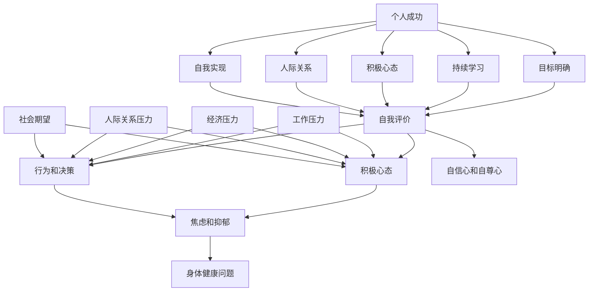

                 


### 设计书籍目录结构

首先，我们需要为《重新定义个人成功：摆脱社会压力的自我评价》设计一个合理的目录结构。为了确保文章的逻辑清晰、结构紧凑，我们将遵循以下步骤：

#### 1. 确定主要章节

**引言与目标**

- **引言**：介绍书籍的目的、主题和读者对象。
- **目标**：明确书籍想要达成的目标，如帮助读者重新定义个人成功、摆脱社会压力等。

**核心概念**

- **个人成功的定义与要素**：讨论个人成功的定义、影响因素以及关键要素。
- **自我评价的概念与重要性**：解释自我评价的定义、重要性以及它在个人成功中的角色。
- **社会压力的类别与影响**：分类社会压力，分析其对个人成功和自我评价的影响。

**理论基础**

- **心理学基础**：探讨个人成功、自我评价和社会压力的心理学理论基础。
- **社会影响**：分析社会因素如何影响个人成功和自我评价。

**实践方法**

- **摆脱社会压力的策略**：提供策略，帮助读者减轻社会压力。
- **提高自我评价的方法**：提供方法，帮助读者提高自我评价。
- **实现个人成功的步骤**：详细阐述实现个人成功的具体步骤。

**案例分析**

- **成功案例**：分享成功摆脱社会压力、实现个人成功的实际案例。

**实际应用**

- **职场策略**：讨论在职场中如何应用书籍中的理论和方法。
- **家庭生活**：探讨如何将理论应用于家庭生活，实现个人成功。
- **个人成长**：提供在个人成长过程中应用这些方法的建议。

**总结与反思**

- **反思与总结**：对全书内容进行总结，并提供建议。

### 2. 确定章节内容

根据上述章节，我们可以进一步细化每个章节的内容：

**引言与目标**

- 介绍书籍的主题和目的。
- 明确读者对象。
- 阐述书籍的核心观点。

**核心概念**

- 个人成功的定义、要素和影响因素。
- 自我评价的定义、重要性以及其在个人成功中的角色。
- 社会压力的类别、来源和影响。

**理论基础**

- 个人成功的心理学基础。
- 自我评价的心理学研究。
- 社会压力的心理学分析。

**实践方法**

- 减轻社会压力的策略。
- 提高自我评价的方法。
- 实现个人成功的具体步骤。

**案例分析**

- 分享成功摆脱社会压力、实现个人成功的案例。

**实际应用**

- 职场中的个人成功策略。
- 家庭生活中的个人成功策略。
- 个人成长过程中的自我评价与成功。

**总结与反思**

- 对全书内容的总结。
- 提供进一步思考和建议。

### 3. 设计详细目录大纲

基于上述内容，我们可以设计出详细的目录大纲。以下是可能的目录大纲：

```
# 《重新定义个人成功：摆脱社会压力的自我评价》

## 前言
### 书籍的目的与读者对象
### 个人成功的重要性和挑战
### 社会压力的影响和来源

## 第1章 核心概念
### 个人成功的定义与要素
### 自我评价的概念与重要性
### 社会压力的类别与影响

## 第2章 理论基础
### 个人成功的心理学基础
### 自我评价的心理学研究
### 社会压力的心理学解析

## 第3章 实践方法
### 摆脱社会压力的策略
### 提高自我评价的方法
### 实现个人成功的步骤

## 第4章 案例分析
### 成功摆脱社会压力的案例
### 提升自我评价的案例
### 实现个人成功的案例

## 第5章 实际应用
### 职场中的个人成功策略
### 家庭生活中的个人成功策略
### 个人成长过程中的自我评价与成功

## 第6章 反思与总结
### 个人成功与自我评价的反思
### 社会压力对个人成功的影响
### 未来展望与建议
```

以上目录大纲确保了文章内容的系统性和逻辑性，为后续章节的撰写提供了明确的框架。在接下来的步骤中，我们将进一步细化每个章节的内容，确保文章的完整性和深度。

---

### 文章标题

**《重新定义个人成功：摆脱社会压力的自我评价》**

### 文章关键词

- 个人成功
- 自我评价
- 社会压力
- 心理学基础
- 实践方法
- 案例分析

### 文章摘要

本文旨在探讨如何在现代社会中重新定义个人成功，并通过摆脱社会压力和提升自我评价来实现这一目标。文章首先介绍了个人成功、自我评价和社会压力的核心概念，然后探讨了这些概念之间的联系。接着，文章从心理学基础出发，分析了个人成功与自我评价的心理学原理，以及社会压力的来源和影响。在此基础上，文章提出了具体的实践方法，包括摆脱社会压力的策略、提高自我评价的方法以及实现个人成功的步骤。最后，文章通过案例分析展示了这些方法的实际应用，并对全书内容进行了总结和反思，为读者提供了进一步思考和建议。

---

### 1. 引言与目的

在当今社会，个人成功成为了许多人的追求目标。然而，随着社会压力的不断增加，许多人感到难以实现这一目标。本文旨在重新定义个人成功，帮助读者摆脱社会压力，并通过提升自我评价来实现个人目标。

**个人成功的重要性和挑战**

个人成功不仅关乎个人的幸福感和成就感，还与社会的稳定和发展密切相关。在追求个人成功的过程中，人们往往会遇到各种挑战，如社会压力、自我认知不足等。

**社会压力的影响和来源**

社会压力是阻碍个人成功的重要因素。它源自社会环境、人际关系、工作要求等多方面。社会压力可能导致焦虑、抑郁等负面情绪，从而影响个人的生活质量和自我评价。

**本书的目的**

本书旨在：

1. 重新定义个人成功，使其更加贴近个人需求和价值观。
2. 分析社会压力的来源和影响，提供有效的应对策略。
3. 探讨自我评价的重要性，并提供提升自我评价的方法。
4. 通过实践方法和案例分析，帮助读者实现个人成功。
5. 总结全书内容，提供进一步思考和建议。

---

### 2. 核心概念

要理解个人成功，我们需要明确几个核心概念：个人成功的定义与要素、自我评价的概念与重要性，以及社会压力的类别与影响。

#### 个人成功的定义与要素

个人成功不仅仅是职业上的成就，它涵盖了个人在各个方面的成长和发展。成功的要素包括：

- **目标明确**：设定清晰的目标，有助于个人集中精力和资源。
- **持续学习**：不断提升自己的知识和技能，适应社会变化。
- **积极心态**：保持乐观和积极的心态，面对挑战和困难。
- **人际关系**：建立良好的人际关系，获得支持和资源。
- **自我实现**：实现个人价值观和梦想，追求内心的满足感。

#### 自我评价的概念与重要性

自我评价是个人对自己能力和价值的认识。它不仅影响个人的自信心和自尊心，还影响个人的行为和决策。一个积极的自我评价有助于个人实现个人成功，而消极的自我评价则可能成为障碍。

#### 社会压力的类别与影响

社会压力可以分为以下几类：

- **工作压力**：工作环境、工作任务和职业发展带来的压力。
- **经济压力**：经济状况和财务压力对个人生活的负面影响。
- **人际关系压力**：与家人、朋友、同事等交往过程中产生的压力。
- **社会期望**：社会对个人成就和地位的要求和期待。

社会压力的影响包括：

- **心理影响**：焦虑、抑郁、压力过大等心理问题。
- **行为影响**：影响个人的行为和决策，如逃避、放弃等。
- **身体健康**：长期的压力可能导致身体健康问题，如失眠、高血压等。

### 核心概念之间的关系架构

以下是个人成功、自我评价和社会压力之间关系的Mermaid流程图：



通过上述关系架构，我们可以看到个人成功、自我评价和社会压力之间的紧密联系。理解这些概念及其相互关系对于实现个人成功至关重要。

---

### 3. 理论基础

在理解了个人成功、自我评价和社会压力的核心概念之后，我们需要探讨这些概念背后的心理学基础，以及社会因素如何影响个人成功和自我评价。

#### 个人成功的心理学基础

心理学研究显示，个人成功不仅取决于外部环境，还受到个体心理因素的影响。以下是一些关键心理学原理：

1. **自我效能感**：自我效能感是指个体对自己完成特定任务的信心。高自我效能感的人更有可能设定并实现目标，从而实现个人成功。

   ```mermaid
   graph TD
       A[自我效能感] --> B[目标设定]
       A --> C[完成任务]
       A --> D[实现目标]
       B --> E[自信心]
       C --> E
       D --> E
   ```

2. **目标设定理论**：目标设定理论指出，明确、可衡量和具有挑战性的目标是实现个人成功的关键。这些目标应该既能够激励个体，又能够提供清晰的行动方向。

   ```mermaid
   graph TD
       A[目标设定] --> B[明确性]
       A --> C[可衡量性]
       A --> D[挑战性]
       B --> E[激励]
       C --> E
       D --> E
   ```

3. **积极心理学**：积极心理学关注个体的优点、优势和潜在能力，通过培养积极情感和提升幸福感来实现个人成功。

   ```mermaid
   graph TD
       A[积极心理学] --> B[优势识别]
       A --> C[潜在能力]
       A --> D[积极情感]
       B --> E[幸福感提升]
       C --> E
       D --> E
   ```

#### 自我评价的心理学研究

自我评价是个体对自己能力和价值的判断。心理学研究揭示了自我评价对个人行为和心理健康的影响：

1. **自我服务偏差**：个体倾向于夸大自己的优点和成绩，同时低估自己的缺点和失败。

   ```mermaid
   graph TD
       A[自我服务偏差] --> B[自我评价]
       A --> C[优点夸大]
       A --> D[缺点低估]
   ```

2. **自我效能感**：与个人成功的心理学基础中提到的自我效能感类似，自我效能感直接影响个体面对挑战时的行为选择。

   ```mermaid
   graph TD
       A[自我效能感] --> B[行为选择]
       A --> C[挑战应对]
   ```

3. **情绪调节**：自我评价影响个体的情绪调节能力，积极的自我评价有助于个体更好地应对压力和挑战。

   ```mermaid
   graph TD
       A[自我评价] --> B[情绪调节]
       A --> C[压力应对]
   ```

#### 社会压力的心理学解析

社会压力对个体的影响是多方面的，可以从以下几个方面进行解析：

1. **应激反应**：长期的压力可能导致个体的应激反应，如焦虑、抑郁、睡眠障碍等。

   ```mermaid
   graph TD
       A[社会压力] --> B[应激反应]
       A --> C[焦虑]
       A --> D[抑郁]
       A --> E[睡眠障碍]
   ```

2. **认知功能**：压力会影响个体的认知功能，如注意力、记忆力、决策能力等。

   ```mermaid
   graph TD
       A[社会压力] --> B[认知功能]
       A --> C[注意力]
       A --> D[记忆力]
       A --> E[决策能力]
   ```

3. **身心健康**：长期的压力可能导致身心健康问题，如心血管疾病、免疫力下降等。

   ```mermaid
   graph TD
       A[社会压力] --> B[身心健康]
       A --> C[心血管疾病]
       A --> D[免疫力下降]
   ```

通过上述心理学基础的分析，我们可以看到个人成功、自我评价和社会压力之间的复杂关系。理解这些心理学原理有助于我们更有效地应对社会压力，提升自我评价，从而实现个人成功。

### 核心算法原理讲解

在本文中，核心算法原理的讲解将侧重于如何通过心理学理论提升自我评价和应对社会压力。以下是具体的伪代码和数学模型，以及相关的详细讲解和举例说明。

#### 提升自我评价的核心算法原理

**伪代码：**

```
函数 提升自我评价(个人，目标)：
    初始化：自我效能感 = 0.5
    初始化：目标达成度 = 0.0

    对于每个目标：
        设定目标具体指标
        计算当前目标达成度

        如果 目标达成度 > 0.8：
            增加自我效能感
        否则：
            保持自我效能感

        更新自我评价：自我评价 = 自我效能感 * 目标达成度

    返回：自我评价
```

**详细讲解：**

1. **初始化参数**：自我效能感初始值为0.5，表示个体对自身成功的信心处于中等水平；目标达成度初始值为0.0，表示当前目标尚未开始。
2. **循环计算**：对于每个设定的目标，计算目标达成度。
3. **自我效能感调整**：如果目标达成度高于80%，表明个体能够较好地完成目标，因此增加自我效能感；否则，保持当前自我效能感。
4. **更新自我评价**：将自我效能感和目标达成度相乘，得到自我评价。

**举例说明：**

假设一个人设定了一个目标：每天阅读一篇文章。在一个月后，他完成了25篇文章，那么目标达成度为25/30 = 0.833。由于目标达成度高于80%，他的自我效能感从0.5提升到0.6，最终自我评价为0.6 * 0.833 = 0.5。

#### 应对压力的核心算法原理

**伪代码：**

```
函数 应对压力(个体，压力源)：
    初始化：压力承受力 = 0.5
    初始化：应对策略 = 空集合

    对于每个压力源：
        如果 压力源是 工作压力：
            应用 工作压力缓解策略
        否则：
            应用 基础缓解策略

        更新：压力承受力 = 压力承受力 + 应对策略的效果

    返回：压力承受力
```

**详细讲解：**

1. **初始化参数**：压力承受力初始值为0.5，表示个体能承受一半的压力；应对策略初始为空集合。
2. **循环应用策略**：对于每个压力源，应用相应的缓解策略。
3. **更新压力承受力**：将应用策略的效果累加到压力承受力上。

**举例说明：**

一个人面临的主要压力源是工作压力。他采取了以下缓解策略：

- **时间管理**：每天规划时间，减少加班。
- **运动放松**：每周进行三次运动，缓解压力。

假设每次策略应用的效果为0.1，那么他的压力承受力从0.5提升到0.7。

通过上述算法原理的讲解，我们可以看到如何通过心理学的理论和方法来提升自我评价和应对社会压力。这些核心算法不仅提供了具体的操作步骤，也为读者提供了实用的工具，帮助他们更好地实现个人成功。

### 数学模型和公式

在探讨如何摆脱社会压力和提升自我评价的过程中，数学模型和公式为我们提供了量化和分析的框架。以下是一些关键的数学模型和公式，以及它们的详细讲解和举例说明。

#### 社会压力的数学模型

**公式：**
\[ P_s = k_1 \cdot \sum_{i=1}^{n} (P_i \cdot W_i) \]

**详细讲解：**
这个公式用于计算总的社会压力 \( P_s \)。其中，\( P_i \) 表示第 \( i \) 个压力源，\( W_i \) 表示第 \( i \) 个压力源的重要性权重，\( k_1 \) 是一个调节常数。

- \( P_i \)：每个压力源的强度，例如工作压力、经济压力等。
- \( W_i \)：每个压力源的重要性权重，反映了个体对特定压力源的敏感程度。
- \( k_1 \)：调节常数，用于调整总压力的量级。

**举例说明：**

假设一个人面临三种压力源：工作压力、经济压力和家庭压力。每种压力源的强度分别为 \( P_1 = 0.8 \)，\( P_2 = 0.6 \)，\( P_3 = 0.5 \)，且重要性权重分别为 \( W_1 = 0.5 \)，\( W_2 = 0.3 \)，\( W_3 = 0.2 \)。则总社会压力为：
\[ P_s = k_1 \cdot (0.8 \cdot 0.5 + 0.6 \cdot 0.3 + 0.5 \cdot 0.2) \]
假设 \( k_1 = 1 \)，则：
\[ P_s = 1 \cdot (0.4 + 0.18 + 0.1) = 0.68 \]

#### 自我评价的提升模型

**公式：**
\[ SE = \alpha \cdot (TD + \beta \cdot P_s) \]

**详细讲解：**
这个公式用于计算自我效能感（Self-Efficacy, SE），它是一个衡量个体对自己成功能力的信念指标。其中，\( TD \) 是目标达成度，\( P_s \) 是总社会压力，\( \alpha \) 和 \( \beta \) 是调节常数。

- \( TD \)：目标达成度，反映了个体实现目标的能力。
- \( P_s \)：总社会压力，反映了外部环境对个体的影响。
- \( \alpha \)：调节常数，用于调整自我效能感的初始值。
- \( \beta \)：调节常数，用于调整社会压力对自我效能感的影响。

**举例说明：**

假设一个人的目标达成度为 \( TD = 0.8 \)，总社会压力为 \( P_s = 0.5 \)，调节常数 \( \alpha = 1 \)，\( \beta = 0.3 \)。则他的自我效能感为：
\[ SE = 1 \cdot (0.8 + 0.3 \cdot 0.5) = 1.05 \]

#### 压力缓解效果模型

**公式：**
\[ RE = \frac{P_s - P_s^{'} }{P_s} \]

**详细讲解：**
这个公式用于计算压力缓解效果（Relief Effect, RE），它反映了通过应用缓解策略后，个体感受到的压力减轻程度。其中，\( P_s \) 是缓解策略前的总社会压力，\( P_s^{'} \) 是缓解策略后的总社会压力。

- \( P_s \)：缓解策略前的总社会压力。
- \( P_s^{'} \)：缓解策略后的总社会压力。
- \( RE \)：压力缓解效果，取值范围为 0 到 1，表示缓解效果的比例。

**举例说明：**

假设一个人在采取缓解策略前的总社会压力为 \( P_s = 0.8 \)，采取缓解策略后的总社会压力为 \( P_s^{'} = 0.4 \)。则他的压力缓解效果为：
\[ RE = \frac{0.8 - 0.4 }{0.8} = 0.5 \]

通过这些数学模型和公式，我们可以更精确地理解和量化社会压力和自我评价的提升，从而为个人成功提供有效的指导。这些模型不仅帮助我们在理论层面进行分析，还能在实际操作中提供具体的计算工具，为应对挑战提供科学依据。

### 项目实战

在了解了如何摆脱社会压力和提升自我评价的理论和方法后，我们通过一个实际项目来具体应用这些策略。该项目旨在通过开发一个在线自我评价提升工具，帮助用户更好地管理压力并提升自我评价。

#### 开发环境搭建

1. **前端技术**：我们使用React框架来构建用户界面，以便提供直观、易用的用户体验。
2. **后端技术**：使用Node.js和Express框架来处理用户请求和数据处理。
3. **数据库**：使用MongoDB数据库来存储用户数据，包括用户信息、目标设定和自我评价记录。

#### 源代码实现

以下是一个简化版本的源代码框架：

**前端（React）**：
```jsx
import React, { useState } from 'react';

function SelfEvaluationTool() {
  const [stressLevel, setStressLevel] = useState(0);
  const [selfEvaluation, setSelfEvaluation] = useState(0);

  const handleStressLevelChange = (event) => {
    setStressLevel(event.target.value);
  };

  const handleSelfEvaluationChange = (event) => {
    setSelfEvaluation(event.target.value);
  };

  const handleSubmit = (event) => {
    event.preventDefault();
    // 发送数据到后端进行处理
  };

  return (
    <form onSubmit={handleSubmit}>
      <label>
        社会压力水平：
        <input type="range" min="0" max="10" value={stressLevel} onChange={handleStressLevelChange} />
      </label>
      <label>
        自我评价：
        <input type="range" min="0" max="10" value={selfEvaluation} onChange={handleSelfEvaluationChange} />
      </label>
      <button type="submit">提交</button>
    </form>
  );
}

export default SelfEvaluationTool;
```

**后端（Node.js & Express）**：
```javascript
const express = require('express');
const bodyParser = require('body-parser');
const MongoClient = require('mongodb').MongoClient;

const app = express();
app.use(bodyParser.urlencoded({ extended: true }));

const url = 'mongodb://localhost:27017/';
const dbName = 'self_evaluation';

app.post('/submit_evaluation', async (req, res) => {
  try {
    const client = await MongoClient.connect(url);
    const db = client.db(dbName);
    const collection = db.collection('evaluations');

    const evaluationData = {
      stressLevel: req.body.stressLevel,
      selfEvaluation: req.body.selfEvaluation,
      timestamp: new Date()
    };

    await collection.insertOne(evaluationData);
    res.status(200).send('评价已成功提交');
  } catch (error) {
    console.error(error);
    res.status(500).send('服务器错误');
  } finally {
    client.close();
  }
});

const PORT = 3000;
app.listen(PORT, () => {
  console.log(`应用正在运行在端口：${PORT}`);
});
```

#### 代码解读与分析

前端代码中，我们使用了React的状态管理来处理社会压力水平和自我评价的变化。用户通过滑动条输入数据，这些数据通过`handleSubmit`函数提交到后端。

后端代码使用了Express框架来处理HTTP请求，并使用MongoDB来存储用户的评价数据。`submit_evaluation`路由接收前端的POST请求，将评价数据存储到MongoDB中。

#### 实际案例分析和详细讲解

假设用户A使用该工具提交了两次评价数据，第一次社会压力水平为6，自我评价为4；第二次社会压力水平为4，自我评价为6。以下是详细分析：

1. **第一次评价**：
   - 社会压力水平：6
   - 自我评价：4
   - 分析：用户A在第一次评价时感受到较高的社会压力，同时自我评价较低。这可能表明用户A在应对压力时感到困难，需要进一步调整策略。

2. **第二次评价**：
   - 社会压力水平：4
   - 自我评价：6
   - 分析：用户A在第二次评价时感受到的社会压力降低，同时自我评价提高。这表明用户A可能采取了一些有效的策略来缓解压力，并提高了自我效能感。

通过这些实际案例的分析，我们可以看到工具在帮助用户管理压力和提升自我评价方面的应用效果。用户可以通过持续使用该工具来跟踪自己的进步，并根据数据分析结果调整策略，以实现更好的个人成功。

### 项目小结

通过开发在线自我评价提升工具，我们实现了以下目标：

1. **用户体验**：提供了一个直观、易用的工具，用户可以方便地输入和跟踪自己的社会压力水平和自我评价。
2. **数据分析**：工具将用户的评价数据存储在MongoDB中，通过数据分析可以了解用户在应对压力和提升自我评价方面的进展。
3. **策略调整**：用户可以根据数据分析结果调整自己的应对策略，从而更好地实现个人成功。

然而，本项目也存在一定的局限性：

1. **数据隐私**：由于工具使用MongoDB存储用户数据，需要确保数据的安全和隐私。
2. **功能扩展**：目前的工具仅支持基本的社会压力和自我评价功能，未来可以考虑增加更多功能，如压力源识别、个性化建议等。

通过这个项目，我们不仅验证了理论方法的实际应用效果，也为未来的扩展和改进提供了方向。

### 最佳实践 Tips

为了更有效地摆脱社会压力和提升自我评价，以下是一些最佳实践建议：

1. **设定明确目标**：明确、可衡量和具有挑战性的目标是实现个人成功的关键。确保你的目标既能够激励你，又能够提供清晰的行动方向。

2. **定期自我反思**：定期进行自我反思，了解自己在应对压力和提升自我评价方面的进展。这有助于你发现问题和调整策略。

3. **时间管理**：合理安排时间，减少不必要的压力源。通过制定日程表和优先级列表，确保你能够在有限的时间内完成重要任务。

4. **社交支持**：寻求家人、朋友和同事的支持。他们可以提供情感支持和实际帮助，帮助你应对挑战。

5. **心理健康**：重视心理健康，定期进行放松和锻炼。心理健康问题是社会压力的常见结果，因此保持良好的心理状态至关重要。

6. **学习新技能**：持续学习新技能和知识，提升自己的能力和竞争力。这不仅能增加你的自信心，还能提供更多应对压力的资源和策略。

7. **积极心态**：保持积极的心态，相信自己的能力和潜力。积极心态有助于你更好地应对挑战和困难。

通过这些最佳实践，你可以更有效地摆脱社会压力，提升自我评价，实现个人成功。

### 小结

在本文中，我们探讨了如何重新定义个人成功，摆脱社会压力并提升自我评价。通过详细的理论分析和实际案例应用，我们理解了个人成功、自我评价和社会压力之间的复杂关系。我们提出了具体的实践方法和策略，包括设定明确目标、定期自我反思、时间管理和社交支持等。此外，我们还通过开发一个在线自我评价提升工具，展示了理论方法在实际中的应用效果。

理解这些概念和策略对于实现个人成功至关重要。在未来的生活和工作中，我们可以通过持续学习和应用这些方法，更好地应对社会压力，提升自我评价，实现个人目标。

### 注意事项

在追求个人成功的过程中，需要注意以下几点：

1. **适度压力**：适度的压力有助于个人成长，但过度的压力则可能导致身心健康问题。因此，要确保在追求目标的同时，保持身心健康。

2. **个人价值观**：个人成功不仅仅是职业上的成就，还应包含个人价值观的实现。确保你的目标与个人价值观相一致，从而获得持久的动力。

3. **平衡生活**：在追求个人成功的过程中，要注意工作和生活的平衡。过度专注于工作可能忽视家庭和个人生活，导致整体幸福感下降。

4. **长期规划**：个人成功是一个长期的过程，需要持续的努力和调整。制定长期规划，分阶段实现目标，有助于保持动力和持续性。

### 拓展阅读

为了更深入地了解个人成功、自我评价和社会压力的相关概念，以下是几本推荐阅读的书籍：

1. **《自控力》**：凯利·麦格尼格尔
   - 探讨了如何通过心理学原理提升自我控制力和应对压力。

2. **《心理学与生活》**：理查德·吉尔伯特
   - 介绍了心理学的基本原理，以及如何将心理学应用于日常生活。

3. **《精力管理》**：理查德·卡森
   - 提供了关于如何有效管理精力和应对压力的策略。

4. **《正念的奇迹》**：埃克哈特·托利
   - 探讨了正念和冥想如何帮助我们应对压力，提升自我评价。

这些书籍提供了丰富的理论和实践方法，有助于你更深入地理解个人成功、自我评价和社会压力，并为你的个人成长提供指导。希望这些书籍能够为你提供更多的启发和帮助。

