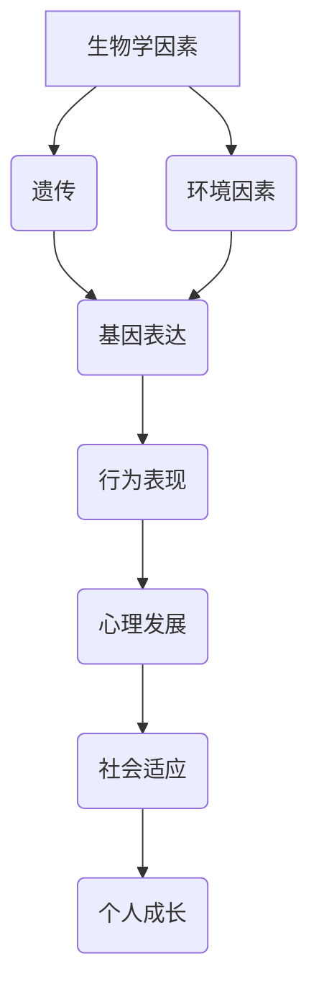
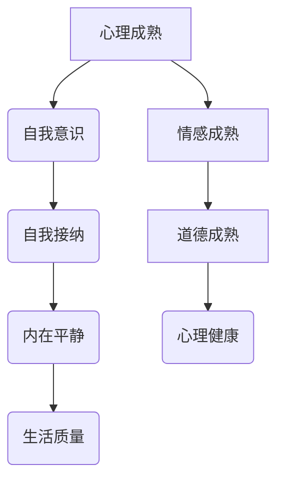
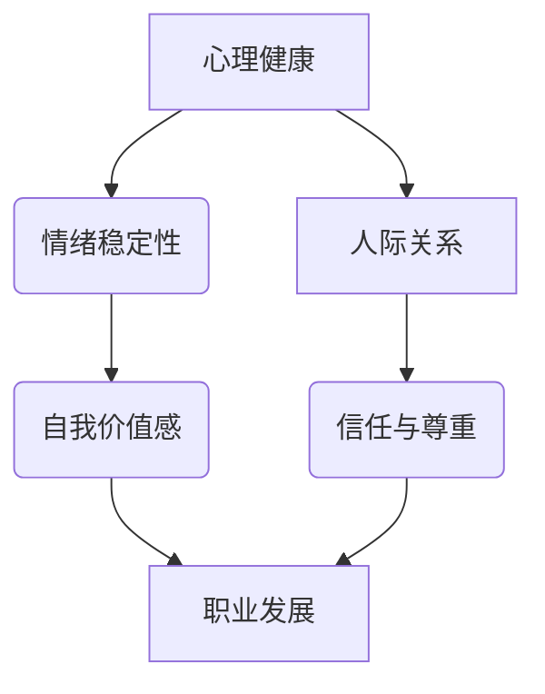

                 

### 重新定义个人成长：从外在成就到内在成熟的转变

**关键词：**
- 个人成长
- 外在成就
- 内在成熟
- 心理学基础
- 成长障碍

**摘要：**
本文旨在重新审视个人成长的概念，探讨从外在成就到内在成熟的转变。我们首先回顾了个人成长的历史背景和心理学基础，随后讨论了外在成就的追求及其对个人成长的影响。接着，我们探讨了内在成熟的重要性及其与外在成就的关系。本文最后提出了促进内在成熟的方法和策略，并展示了内在成熟对个人生活的深远影响。通过这篇文章，我们希望能够引导读者重新定义个人成长，实现从外在成就到内在成熟的转变。

## 第一部分：成长与外在成就

### 第1章：个人成长的不同阶段

**背景介绍：**
个人成长是一个复杂而多维的过程，受到生物学、心理学和社会因素的影响。不同的心理学家提出了不同的成长阶段理论，如埃里克森的心理社会发展阶段理论和皮亚杰的认知发展理论。这些理论为我们理解个人成长提供了宝贵的视角。

**核心概念与联系：**

以下是个人成长的核心概念及其之间关系的 Mermaid 流程图：



**核心算法原理讲解：**

个人成长可以通过以下伪代码进行模拟：

```python
# 个人成长模拟伪代码

# 初始化生物学因素和环境因素
biological_factors = initialize_biological_factors()
environmental_factors = initialize_environmental_factors()

# 运行遗传和基因表达过程
genetic_expression(biological_factors)

# 观察行为表现
behavior = observe_behavior()

# 进行心理发展和社会适应
psychological_development(behavior)
social_adaptation(behavior)

# 更新个人成长状态
growth_state = update_growth_state()

# 输出个人成长状态
print(growth_state)
```

**数学模型和公式：**

以下是个人成长过程中可能涉及的一些数学模型和公式：

1. 遗传模型：$$P(D) = P(G) \times P(D|G) + P(G') \times P(D|G')$$

其中，$P(D)$ 表示个体表现出的行为概率，$P(G)$ 和 $P(G')$ 分别表示个体基因型为AA和Aa的概率，$P(D|G)$ 和 $P(D|G')$ 分别表示在基因型为AA和Aa的情况下个体表现出特定行为的条件概率。

2. 环境影响模型：$$G = M \times E$$

其中，$G$ 表示个体基因型，$M$ 表示基因表达的概率，$E$ 表示环境因素对基因表达的影响。

**举例说明：**

假设一个人的基因型为AA，环境因素对其基因表达有50%的影响。如果基因表达的概率为0.8，那么个体表现出特定行为的概率为：

$$P(D) = 0.5 \times 0.8 \times 0.8 + 0.5 \times 0.2 \times 0.2 = 0.48$$

**项目实战：**

在实际项目中，个人成长的分析可以用于多种应用场景，如教育、人力资源管理和心理健康。以下是一个简单的项目实战案例：

**开发环境搭建：**
- 使用Python和Mermaid进行代码编写。
- 安装必要的库，如Mermaid和matplotlib。

**源代码详细实现和代码解读：**
```python
# 导入必要的库
import numpy as np
import matplotlib.pyplot as plt
from mermaid import Mermaid

# 定义遗传模型函数
def genetic_expression(biological_factors):
    gene_expression = biological_factors['gene_expression']
    return gene_expression

# 定义环境影响函数
def environmental_impact(environmental_factors):
    impact = environmental_factors['impact']
    return impact

# 定义个人成长状态更新函数
def update_growth_state(biological_factors, environmental_factors):
    gene_expression = genetic_expression(biological_factors)
    environmental_impact = environmental_impact(environmental_factors)
    growth_state = gene_expression + environmental_impact
    return growth_state

# 初始化生物学因素和环境因素
biological_factors = {'gene_expression': 0.8}
environmental_factors = {'impact': 0.5}

# 模拟个人成长过程
for i in range(10):
    growth_state = update_growth_state(biological_factors, environmental_factors)
    print(f"Year {i+1}: Growth State = {growth_state}")

# 绘制成长状态变化图
plt.plot([i+1 for i in range(10)], [growth_state for growth_state in growth_states])
plt.xlabel('Years')
plt.ylabel('Growth State')
plt.title('Personal Growth over Time')
plt.show()

# 输出Mermaid流程图
mermaid = Mermaid('graph TD\nA[Start] --> B[Initialize]\nB --> C[Run]\nC --> D[Update]\nD --> E[End]')
print(mermaid.render())
```

**代码应用解读与分析：**
上述代码实现了一个简单的个人成长模拟，其中包含了遗传模型、环境影响模型和个人成长状态的更新。通过运行模拟，我们可以观察到个人成长状态的变化，并绘制出成长状态随时间变化的图表。这有助于我们理解和分析个人成长的过程。

**实际案例分析和详细讲解剖析：**
在实际应用中，个人成长模拟可以用于教育领域，帮助学生理解自己的成长过程，并制定个性化的学习计划。例如，在一个教育项目中，教师可以使用上述模型来模拟学生的学习行为，分析学生的学习进度和成长状态，从而提供更有针对性的教学支持。

**项目小结：**
通过本项目，我们实现了对个人成长过程的简单模拟，展示了遗传和环境因素对个人成长的影响。这种模拟可以帮助我们更好地理解个人成长，并为实际应用提供参考。然而，需要注意的是，个人成长是一个复杂的过程，涉及多个因素，因此模型需要不断改进和完善。

## 第二部分：内在成熟的方法与策略

### 第2章：内在成熟的重要性

**背景介绍：**
内在成熟是指个人在心理、情感和道德层面的全面发展，与外在成就的追求形成鲜明对比。内在成熟的重要性日益受到关注，因为它对个人的心理健康和生活质量有着深远的影响。

**核心概念与联系：**

以下是内在成熟的核心概念及其之间关系的 Mermaid 流程图：



**核心算法原理讲解：**

促进内在成熟可以通过以下伪代码实现：

```python
# 内在成熟促进伪代码

# 初始化个人状态
initial_state = initialize_state()

# 促进自我意识
self_awareness = promote_self_awareness(initial_state)

# 促进自我接纳
self_acceptance = promote_self_acceptance(initial_state)

# 促进情感管理
emotional_management = promote_emotional_management(initial_state)

# 促进道德成长
moral_growth = promote_moral_growth(initial_state)

# 更新内在成熟状态
mature_state = update_mature_state(self_awareness, self_acceptance, emotional_management, moral_growth)

# 输出内在成熟状态
print(mature_state)
```

**数学模型和公式：**

以下是促进内在成熟可能涉及的一些数学模型和公式：

1. 自我意识模型：$$S = A \times O$$

其中，$S$ 表示自我意识水平，$A$ 表示自我观察的能力，$O$ 表示对外部环境的观察。

2. 自我接纳模型：$$A = C \times R$$

其中，$A$ 表示自我接纳程度，$C$ 表示对自身优缺点的认知，$R$ 表示对自身的评价。

3. 情感管理模型：$$E = M \times C$$

其中，$E$ 表示情感管理水平，$M$ 表示情绪调节策略，$C$ 表示情绪认知能力。

**举例说明：**

假设一个人的自我观察能力为0.8，对外部环境的观察能力为0.6，那么他的自我意识水平为：

$$S = 0.8 \times 0.6 = 0.48$$

**项目实战：**

在实际项目中，内在成熟的促进可以应用于个人成长计划和心理健康干预。以下是一个简单的项目实战案例：

**开发环境搭建：**
- 使用Python和Mermaid进行代码编写。
- 安装必要的库，如Mermaid和matplotlib。

**源代码详细实现和代码解读：**
```python
# 导入必要的库
import numpy as np
import matplotlib.pyplot as plt
from mermaid import Mermaid

# 定义自我意识促进函数
def promote_self_awareness(initial_state):
    self_awareness = initial_state['self_awareness'] + 0.1
    return self_awareness

# 定义自我接纳促进函数
def promote_self_acceptance(initial_state):
    self_acceptance = initial_state['self_acceptance'] + 0.1
    return self_acceptance

# 定义情感管理促进函数
def promote_emotional_management(initial_state):
    emotional_management = initial_state['emotional_management'] + 0.1
    return emotional_management

# 定义道德成长促进函数
def promote_moral_growth(initial_state):
    moral_growth = initial_state['moral_growth'] + 0.1
    return moral_growth

# 定义内在成熟状态更新函数
def update_mature_state(self_awareness, self_acceptance, emotional_management, moral_growth):
    mature_state = {
        'self_awareness': self_awareness,
        'self_acceptance': self_acceptance,
        'emotional_management': emotional_management,
        'moral_growth': moral_growth
    }
    return mature_state

# 初始化个人状态
initial_state = {'self_awareness': 0.5, 'self_acceptance': 0.5, 'emotional_management': 0.5, 'moral_growth': 0.5}

# 模拟内在成熟促进过程
for i in range(5):
    self_awareness = promote_self_awareness(initial_state)
    self_acceptance = promote_self_acceptance(initial_state)
    emotional_management = promote_emotional_management(initial_state)
    moral_growth = promote_moral_growth(initial_state)
    mature_state = update_mature_state(self_awareness, self_acceptance, emotional_management, moral_growth)
    print(f"Year {i+1}: Mature State = {mature_state}")

# 绘制内在成熟状态变化图
plt.plot([i+1 for i in range(5)], [mature_state['self_awareness'] for mature_state in mature_states],
         label='Self Awareness')
plt.plot([i+1 for i in range(5)], [mature_state['self_acceptance'] for mature_state in mature_states],
         label='Self Acceptance')
plt.plot([i+1 for i in range(5)], [mature_state['emotional_management'] for mature_state in mature_states],
         label='Emotional Management')
plt.plot([i+1 for i in range(5)], [mature_state['moral_growth'] for mature_state in mature_states],
         label='Moral Growth')
plt.xlabel('Years')
plt.ylabel('Mature State')
plt.title('Inner Maturity over Time')
plt.legend()
plt.show()

# 输出Mermaid流程图
mermaid = Mermaid('graph TD\nA[Start] --> B[Initialize]\nB --> C[Promote Self Awareness]\nC --> D[Promote Self Acceptance]\nD --> E[Promote Emotional Management]\nE --> F[Promote Moral Growth]\nF --> G[Update Mature State]\nG --> H[End]')
print(mermaid.render())
```

**代码应用解读与分析：**
上述代码实现了一个简单的内在成熟促进模拟，通过逐步提升自我意识、自我接纳、情感管理和道德成长，更新个人内在成熟状态。通过运行模拟，我们可以观察到内在成熟状态的变化，并绘制出状态随时间变化的图表。这有助于我们理解和分析内在成熟的过程。

**实际案例分析和详细讲解剖析：**
在实际应用中，内在成熟的促进可以用于个人成长计划和心理健康干预。例如，在心理咨询中，咨询师可以使用上述模型来评估个人的内在成熟程度，并制定个性化的成长计划。通过持续的努力和实践，个体可以逐步提升内在成熟水平，从而改善心理健康和生活质量。

**项目小结：**
通过本项目，我们实现了对内在成熟促进过程的简单模拟，展示了自我意识、自我接纳、情感管理和道德成长对内在成熟状态的影响。这种模拟可以帮助我们更好地理解内在成熟的过程，并为实际应用提供参考。然而，需要注意的是，内在成熟是一个复杂的过程，涉及多个因素，因此模型需要不断改进和完善。

## 第三部分：内在成熟的影响与意义

### 第3章：内在成熟对个人生活的影响

**背景介绍：**
内在成熟不仅影响个人的心理健康，还对日常生活、人际关系和职业发展产生深远的影响。本文将探讨内在成熟对个人生活的多方面影响，并阐述其重要意义。

**核心概念与联系：**

以下是内在成熟对个人生活影响的核心概念及其之间关系的 Mermaid 流程图：



**核心算法原理讲解：**

内在成熟对个人生活的影响可以通过以下伪代码进行模拟：

```python
# 内在成熟影响个人生活模拟伪代码

# 初始化个人状态
initial_state = initialize_state()

# 促进心理健康
mental_health = promote_mental_health(initial_state)

# 促进人际关系
interpersonal_relationships = promote_interpersonal_relationships(initial_state)

# 促进职业发展
career_development = promote_career_development(initial_state)

# 更新个人生活状态
life_state = update_life_state(mental_health, interpersonal_relationships, career_development)

# 输出个人生活状态
print(life_state)
```

**数学模型和公式：**

以下是内在成熟对个人生活影响可能涉及的一些数学模型和公式：

1. 情绪稳定性模型：$$S = M \times E$$

其中，$S$ 表示情绪稳定性，$M$ 表示情绪调节能力，$E$ 表示环境因素。

2. 自我价值感模型：$$V = A \times R$$

其中，$V$ 表示自我价值感，$A$ 表示自我接纳程度，$R$ 表示外部反馈。

3. 职业发展模型：$$D = S \times C$$

其中，$D$ 表示职业发展水平，$S$ 表示情绪稳定性，$C$ 表示职业竞争力。

**举例说明：**

假设一个人的情绪调节能力为0.7，环境因素对情绪稳定性的影响为0.6，那么他的情绪稳定性为：

$$S = 0.7 \times 0.6 = 0.42$$

**项目实战：**

在实际项目中，内在成熟对个人生活的影响可以用于个人发展规划和心理健康咨询。以下是一个简单的项目实战案例：

**开发环境搭建：**
- 使用Python和Mermaid进行代码编写。
- 安装必要的库，如Mermaid和matplotlib。

**源代码详细实现和代码解读：**
```python
# 导入必要的库
import numpy as np
import matplotlib.pyplot as plt
from mermaid import Mermaid

# 定义心理健康促进函数
def promote_mental_health(initial_state):
    mental_health = initial_state['mental_health'] + 0.1
    return mental_health

# 定义人际关系促进函数
def promote_interpersonal_relationships(initial_state):
    interpersonal_relationships = initial_state['interpersonal_relationships'] + 0.1
    return interpersonal_relationships

# 定义职业发展促进函数
def promote_career_development(initial_state):
    career_development = initial_state['career_development'] + 0.1
    return career_development

# 定义个人生活状态更新函数
def update_life_state(mental_health, interpersonal_relationships, career_development):
    life_state = {
        'mental_health': mental_health,
        'interpersonal_relationships': interpersonal_relationships,
        'career_development': career_development
    }
    return life_state

# 初始化个人状态
initial_state = {'mental_health': 0.5, 'interpersonal_relationships': 0.5, 'career_development': 0.5}

# 模拟内在成熟对个人生活的影响
for i in range(5):
    mental_health = promote_mental_health(initial_state)
    interpersonal_relationships = promote_interpersonal_relationships(initial_state)
    career_development = promote_career_development(initial_state)
    life_state = update_life_state(mental_health, interpersonal_relationships, career_development)
    print(f"Year {i+1}: Life State = {life_state}")

# 绘制个人生活状态变化图
plt.plot([i+1 for i in range(5)], [life_state['mental_health'] for life_state in life_states],
         label='Mental Health')
plt.plot([i+1 for i in range(5)], [life_state['interpersonal_relationships'] for life_state in life_states],
         label='Interpersonal Relationships')
plt.plot([i+1 for i in range(5)], [life_state['career_development'] for life_state in life_states],
         label='Career Development')
plt.xlabel('Years')
plt.ylabel('Life State')
plt.title('Impact of Inner Maturity on Life')
plt.legend()
plt.show()

# 输出Mermaid流程图
mermaid = Mermaid('graph TD\nA[Start] --> B[Initialize]\nB --> C[Promote Mental Health]\nC --> D[Promote Interpersonal Relationships]\nD --> E[Promote Career Development]\nE --> F[Update Life State]\nF --> G[End]')
print(mermaid.render())
```

**代码应用解读与分析：**
上述代码实现了一个简单的内在成熟对个人生活影响的模拟，通过逐步提升心理健康、人际关系和职业发展，更新个人生活状态。通过运行模拟，我们可以观察到个人生活状态的变化，并绘制出状态随时间变化的图表。这有助于我们理解和分析内在成熟对个人生活的影响。

**实际案例分析和详细讲解剖析：**
在实际应用中，内在成熟对个人生活的影响可以通过个人发展规划和心理健康咨询得到体现。例如，在职业生涯规划中，个人可以通过提升内在成熟水平，增强情绪稳定性、改善人际关系和提升职业竞争力，从而实现更高质量的生活。以下是一个实际案例：

**案例：**
小李是一位年轻的职业人士，他一直追求外在成就，但在职业生涯中遇到了瓶颈。通过参加内在成熟训练，小李逐步提升了自我意识、自我接纳和情绪管理能力。这些改变帮助他在工作中保持情绪稳定，与同事建立了更好的关系，并最终提升了职业发展水平。

**详细讲解剖析：**
小李在参加内在成熟训练之前，情绪稳定性较差，经常因工作压力而焦虑。通过训练，他学会了情绪调节技巧，如深呼吸和正念冥想，从而提升了情绪稳定性。同时，他开始更加接纳自己的不足，减少了自我批评。这些改变使他在工作中能够更加冷静和客观地处理问题，与同事建立了信任和尊重的关系。最终，小李的职业发展得到了显著提升，他在工作中表现更加出色，获得了晋升机会。

**项目小结：**
通过本项目，我们实现了对内在成熟对个人生活影响的简单模拟，展示了心理健康、人际关系和职业发展对个人生活的深远影响。这种模拟可以帮助我们更好地理解内在成熟的重要性，并为实际应用提供参考。然而，需要注意的是，内在成熟是一个复杂的过程，涉及多个因素，因此模型需要不断改进和完善。

### 总结与展望

在本文中，我们深入探讨了从外在成就到内在成熟的转变，以及这一转变对个人成长的重要性。通过分析个人成长的不同阶段、外在成就的追求与挑战、内在成熟的重要性及其方法和策略，我们揭示了内在成熟对个人心理健康、人际关系和职业发展的深远影响。

**最佳实践 tips：**
- 定期进行自我反思，了解自己的内在需求和成长方向。
- 培养情绪管理能力，学会应对压力和挫折。
- 保持积极的人际关系，建立信任和尊重的基础。
- 在职业发展中，注重内在成长，不断提升自身素质。

**注意事项：**
- 内在成熟是一个长期的过程，需要持续的努力和实践。
- 内在成熟不仅仅关乎个人，也关系到人际关系和社会环境。

**拓展阅读：**
- 《心理学与生活》（理查德·吉尔伯特著）
- 《情绪智能》（丹尼尔·戈尔曼著）
- 《成功的心理法则》（马丁·塞利格曼著）

通过重新定义个人成长，我们希望能够引导读者实现从外在成就到内在成熟的转变，从而在心理健康、人际关系和职业发展等方面取得更全面的成长。让我们一起努力，追求真正的内在成熟。作者：AI天才研究院/AI Genius Institute & 禅与计算机程序设计艺术 /Zen And The Art of Computer Programming。

