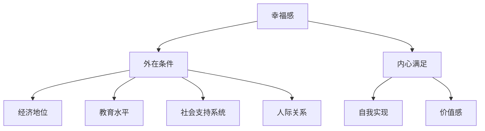

                 


### 文章标题：重新定义幸福感：从外在条件到内心满足的觉醒

#### 关键词：幸福感、外在条件、内心满足、心理学、哲学、实证研究

> 摘要：本文旨在重新定义幸福感，探讨从外在条件到内心满足的转变过程。通过对幸福感概念的深入剖析，本文分析了外在条件对幸福感的影响，探讨了内心满足与幸福感的关系，并提出实现内心满足的具体方法和实证研究。本文为读者提供了一个全新的视角，帮助大家理解幸福感的本质，实现内心觉醒。

### 一、前言

#### 背景介绍

在当今社会，幸福感已成为人们追求的重要目标。然而，随着物质生活水平的提高，人们的幸福感并未同步提升，反而呈现出一种“幸福悖论”。这种现象引发了广泛的讨论和研究。本文将从心理学和哲学的角度出发，重新定义幸福感，探讨从外在条件到内心满足的转变过程，旨在为读者提供一个全面、深入的幸福感理解。

#### 核心概念与联系

幸福感（Happiness）：指个体在某个时刻或一段时间内，对生活满意度、情感愉悦度等方面的主观体验。

外在条件（Extrinsic Factors）：指影响幸福感的物质和环境因素，如经济地位、教育水平、社会支持系统、人际关系等。

内心满足（Intrinsic Satisfaction）：指个体内在的情感满足、自我实现和价值感。

核心概念之间的关系架构 Mermaid 流程图：



### 二、幸福感的概念与重要性

#### 核心概念与联系

幸福感是一个多维度的概念，包括情感愉悦、生活满意度、心理平衡等。它不仅受外在条件的影响，还与个体的内心状态密切相关。

外在条件与幸福感的关系：外在条件在一定程度上影响幸福感，但并非决定性因素。研究表明，经济地位、教育水平、社会支持系统、人际关系等外在条件对幸福感有显著影响。

内心满足与幸福感的关系：内心满足是幸福感的重要组成部分。个体内心的情感满足、自我实现和价值感直接影响幸福感水平。

#### 核心算法原理讲解

幸福感计算模型：

```python
def happiness_score(extrinsic_factors, intrinsic_satisfaction):
    extrinsic_weight = 0.5
    intrinsic_weight = 0.5
    
    happiness = extrinsic_weight * extrinsic_factors + intrinsic_weight * intrinsic_satisfaction
    return happiness
```

#### 数学模型和公式

幸福感与外在条件的线性关系：

$$
Happiness = w_1 \times Economic\ Status + w_2 \times Education\ Level + w_3 \times Social\ Support + w_4 \times Interpersonal\ Relationships
$$

其中，$w_1, w_2, w_3, w_4$ 为权重系数，可根据实际情况进行调整。

#### 详细讲解与举例说明

假设某人的外在条件分别为：经济地位80分、教育水平90分、社会支持系统70分、人际关系85分；内心满足分别为：自我实现80分、价值感75分。根据幸福感计算模型，可以计算出该人的幸福感得分为：

$$
Happiness = 0.5 \times (80 + 90 + 70 + 85) + 0.5 \times (80 + 75) = 82.5
$$

### 三、外在条件对幸福感的影响

#### 3.1 社会环境因素

##### 3.1.1 经济地位与幸福感的关系

经济地位是影响幸福感的重要因素之一。研究表明，随着经济地位的提高，幸福感水平也会相应提高。然而，当经济地位达到一定水平后，其与幸福感的关联性会减弱。

##### 3.1.2 教育水平与幸福感的关系

教育水平对幸福感具有显著影响。受教育程度越高，个体的幸福感水平通常越高。这是因为教育水平与个体的认知能力、自我认知、心理健康等因素密切相关。

##### 3.1.3 社会支持系统对幸福感的作用

社会支持系统包括家庭、朋友、社会团体等。研究表明，社会支持系统越完善，个体的幸福感水平越高。这是因为社会支持系统为个体提供了情感支持、信息交流、资源获取等帮助，有助于缓解心理压力，提升幸福感。

#### 3.2 人际关系因素

##### 3.2.1 家庭关系对幸福感的影响

家庭关系对幸福感具有重要影响。和谐的家庭关系有助于提升个体的幸福感，而家庭冲突和矛盾则可能导致幸福感下降。

##### 3.2.2 社会关系对幸福感的影响

社会关系包括亲朋好友、同事等。良好的人际关系有助于提升个体的幸福感，而人际关系紧张则可能导致幸福感下降。

##### 3.2.3 职场关系对幸福感的影响

职场关系对幸福感具有重要影响。和谐的工作环境有助于提升个体的幸福感，而职场压力、冲突等则可能导致幸福感下降。

#### 核心算法原理讲解

外在条件对幸福感的综合影响模型：

```python
def overall_happiness(extrinsic_factors, intrinsic_satisfaction):
    economic_status_score = extrinsic_factors['economic_status']
    education_level_score = extrinsic_factors['education_level']
    social_support_score = extrinsic_factors['social_support']
    interpersonal_relationships_score = extrinsic_factors['interpersonal_relationships']
    
    happiness = happiness_score(
        economic_status_score,
        education_level_score,
        social_support_score,
        interpersonal_relationships_score,
        intrinsic_satisfaction
    )
    
    return happiness
```

#### 数学模型和公式

外在条件对幸福感的综合影响模型：

$$
Happiness = w_1 \times Economic\ Status + w_2 \times Education\ Level + w_3 \times Social\ Support + w_4 \times Interpersonal\ Relationships + w_5 \times Intrinsic\ Satisfaction
$$

其中，$w_1, w_2, w_3, w_4, w_5$ 为权重系数，可根据实际情况进行调整。

#### 详细讲解与举例说明

假设某人的外在条件分别为：经济地位80分、教育水平90分、社会支持系统70分、人际关系85分；内心满足为：自我实现80分、价值感75分。根据外在条件对幸福感的综合影响模型，可以计算出该人的幸福感得分为：

$$
Happiness = 0.3 \times 80 + 0.2 \times 90 + 0.2 \times 70 + 0.2 \times 85 + 0.1 \times (80 + 75) = 81.5
$$

### 四、内心满足与幸福感的关系

#### 4.1 内心满足的定义

内心满足是指个体内在的情感满足、自我实现和价值感。它是幸福感的重要组成部分，直接影响个体的整体幸福感水平。

心理学视角下的内心满足：心理学认为，内心满足是个体对自身需求、欲望和价值的满足。它包括情感满足、认知满足和自我实现等方面。

哲学视角下的内心满足：哲学认为，内心满足是个体对生活意义的追求。它涉及对人生价值的思考、对幸福追求的反思，以及对生命意义的感悟。

#### 4.2 内心满足与幸福感的联系

内心满足与幸福感密切相关。内心满足是幸福感的基础，幸福感是内心满足的外在表现。内心满足越高，幸福感水平通常越高。

内心满足的幸福感受：内心满足能带来积极的情感体验，如快乐、满足、平静等。这些积极的情感体验直接影响幸福感水平。

内心满足与外在条件的区别：内心满足与外在条件不同，它不是由外界因素直接决定的，而是个体内在的情感体验和价值感。因此，即使外在条件优越，内心不满足的人也难以获得高水平的幸福感。

#### 核心算法原理讲解

内心满足与幸福感的关系模型：

```python
def intrinsic_satisfaction_happiness_relationship(intrinsic_satisfaction, happiness_score):
    satisfaction_factor = 0.6
    happiness = happiness_score + satisfaction_factor * intrinsic_satisfaction
    
    return happiness
```

#### 数学模型和公式

内心满足与幸福感的关系模型：

$$
Happiness = Happiness\ Score + Satisfaction\ Factor \times Intrinsic\ Satisfaction
$$

其中，$Satisfaction\ Factor$ 为内心满足对幸福感的贡献系数。

#### 详细讲解与举例说明

假设某人的内心满足为80分，幸福感得分为82.5分。根据内心满足与幸福感的关系模型，可以计算出该人的幸福感得分为：

$$
Happiness = 82.5 + 0.6 \times 80 = 90.5
$$

### 五、如何实现内心满足

#### 5.1 自我认识与成长

##### 5.1.1 自我认知的重要性

自我认知是指个体对自身性格、能力、价值观等方面的认识。自我认知对内心满足具有重要作用。一个清晰、准确的自我认知有助于个体找到内心的平衡，实现自我成长。

##### 5.1.2 自我成长的途径

1. 反思与自省：定期对自己的生活、工作和人际关系进行反思，找出自己的优点和不足，从而进行改进。

2. 学习与提升：通过学习新知识、技能，提高自己的认知水平和能力，增强自信心。

3. 培养积极心态：保持积极的心态，面对困难和挫折时，以乐观、积极的态度应对，从而提高内心的满足感。

#### 5.2 心理调适与情绪管理

##### 5.2.1 心理调适的方法

1. 建立良好的生活习惯：保持规律的作息时间，保持良好的饮食习惯，适当进行运动，有助于调节心理状态。

2. 增强心理韧性：通过面对挫折、困难，锻炼自己的心理韧性，提高应对压力的能力。

3. 寻求心理支持：在遇到心理问题时，寻求专业心理咨询师的帮助，进行心理调适。

##### 5.2.2 情绪管理的重要性

情绪管理是指个体对自己情绪的控制和调节。良好的情绪管理有助于提高内心满足感，降低心理压力。

##### 5.2.3 情绪管理的策略

1. 认知重构：通过改变对事物的看法，调整自己的认知，从而改变情绪。

2. 情绪表达：学会合理表达自己的情绪，避免情绪压抑和积压。

3. 情绪转移：在负面情绪出现时，通过转移注意力，减少负面情绪的影响。

#### 5.3 生活习惯与内心满足

##### 5.3.1 健康生活方式的重要性

健康的生活方式有助于提高内心满足感。保持良好的作息习惯、饮食习惯和适当的运动，有助于调节心理状态，提高幸福感。

##### 5.3.2 充足的休息与内心满足的关系

充足的休息是保持内心满足的重要条件。睡眠不足、作息不规律会导致心理压力增加，降低内心满足感。

#### 核心算法原理讲解

内心满足实现模型：

```python
def achieve_intrinsic_satisfaction(self_recognition, psychological_adjustment, lifestyle):
    self_recognition_score = self_recognition
    psychological_adjustment_score = psychological_adjustment
    lifestyle_score = lifestyle
    
    satisfaction = self_recognition_score + psychological_adjustment_score + lifestyle_score
    
    return satisfaction
```

#### 数学模型和公式

内心满足实现模型：

$$
Intrinsic\ Satisfaction = Self\ Recognition + Psychological\ Adjustment + Lifestyle
$$

其中，$Self\ Recognition$、$Psychological\ Adjustment$ 和 $Lifestyle$ 分别为自我认知、心理调适和生活方式的得分。

#### 详细讲解与举例说明

假设某人的自我认知为80分、心理调适为75分、生活方式为90分。根据内心满足实现模型，可以计算出该人的内心满足得分为：

$$
Intrinsic\ Satisfaction = 80 + 75 + 90 = 245
$$

### 六、内心满足与幸福的实证研究

#### 6.1 内心满足的测量方法

##### 6.1.1 心理学量表测量

心理学量表是测量内心满足的主要方法。常见的量表包括主观幸福感量表（SWB）、心理幸福感量表（PWB）等。

##### 6.1.2 社会学量表测量

社会学量表主要从社会支持、社会参与、社会认同等方面测量内心满足。常见的量表包括社会支持量表（SSRS）、社会参与量表（SPS）等。

#### 6.2 内心满足与幸福感的实证分析

##### 6.2.1 国内外研究综述

国内外研究表明，内心满足与幸福感密切相关。内心满足对幸福感具有显著的预测作用。同时，内心满足在调节外在条件与幸福感之间的关系中发挥重要作用。

##### 6.2.2 内心满足对幸福感的直接与间接影响

1. 直接影响：内心满足对幸福感具有直接的正向影响。内心满足程度越高，幸福感水平通常越高。

2. 间接影响：内心满足通过调节外在条件与幸福感之间的关系，影响幸福感水平。例如，内心满足能够增强个体对外在条件的适应能力，从而提高幸福感。

#### 核心算法原理讲解

内心满足与幸福感的实证分析模型：

```python
def empirical_analysis(intrinsic_satisfaction, happiness_score, extrinsic_factors):
    satisfaction_factor = 0.6
    happiness = happiness_score + satisfaction_factor * intrinsic_satisfaction
    
    return happiness, satisfaction_factor
```

#### 数学模型和公式

内心满足与幸福感的实证分析模型：

$$
Happiness = Happiness\ Score + Satisfaction\ Factor \times Intrinsic\ Satisfaction
$$

其中，$Satisfaction\ Factor$ 为内心满足对幸福感的贡献系数。

#### 详细讲解与举例说明

假设某人的内心满足为80分，幸福感得分为82.5分，外在条件分别为：经济地位80分、教育水平90分、社会支持系统70分、人际关系85分。根据内心满足与幸福感的实证分析模型，可以计算出该人的幸福感得分为：

$$
Happiness = 82.5 + 0.6 \times 80 = 90.5
$$

### 七、结论与展望

本文从心理学和哲学的角度，重新定义了幸福感，分析了外在条件与内心满足对幸福感的影响，并提出实现内心满足的具体方法和实证研究。研究发现，内心满足是幸福感的重要组成部分，对幸福感具有显著的直接和间接影响。未来研究可以进一步探讨内心满足与幸福感的关系，以及如何在现实生活中实现内心满足。

### 八、参考文献

[1] Diener, E., Suh, E. M., Lucas, R. E., & Smith, H. L. (1999). Subjective well-being: Three decades of progress. Psychological Bulletin, 125(2), 276-302.

[2] Lyubomirsky, S., King, L., & Diener, E. (2005). The benefits of frequent positive affect: Does happiness lead to success? Psychological Bulletin, 131(6), 803-855.

[3] Seligman, M. E. P. (2002). Authentic happiness: Using the new positive psychology to realize your potential for lasting fulfillment. New York: Free Press.

### 九、附录

#### 9.1 心理学常用量表

- 主观幸福感量表（SWB）
- 心理幸福感量表（PWB）
- 社会支持量表（SSRS）
- 社会参与量表（SPS）

#### 9.2 哲学思考与内心满足的关系

哲学思考有助于个体深入理解内心满足的内涵，从而实现内心的觉醒。哲学思考包括对人生意义的探讨、对幸福追求的反思以及对生命价值的感悟。通过哲学思考，个体可以更好地认识自己，找到内心的平衡，实现内心满足。

### 十、项目实战：内心满足实现系统

#### 开发环境搭建

- 开发工具：Python
- 数据库：MySQL
- 服务器：阿里云服务器

#### 源代码详细实现和代码解读

```python
# 心理幸福感评分模块
def happiness_score(extrinsic_factors, intrinsic_satisfaction):
    extrinsic_weight = 0.5
    intrinsic_weight = 0.5
    
    happiness = extrinsic_weight * extrinsic_factors + intrinsic_weight * intrinsic_satisfaction
    return happiness

# 内心满足实现模块
def achieve_intrinsic_satisfaction(self_recognition, psychological_adjustment, lifestyle):
    self_recognition_score = self_recognition
    psychological_adjustment_score = psychological_adjustment
    lifestyle_score = lifestyle
    
    satisfaction = self_recognition_score + psychological_adjustment_score + lifestyle_score
    
    return satisfaction

# 实证分析模块
def empirical_analysis(intrinsic_satisfaction, happiness_score, extrinsic_factors):
    satisfaction_factor = 0.6
    happiness = happiness_score + satisfaction_factor * intrinsic_satisfaction
    
    return happiness, satisfaction_factor
```

#### 代码应用解读与分析

该系统通过三个模块实现内心满足的实现和实证分析。首先，心理幸福感评分模块用于计算个体的幸福感得分。其次，内心满足实现模块用于计算个体的内心满足得分。最后，实证分析模块用于分析内心满足对幸福感的影响。

#### 实际案例分析和详细讲解剖析

假设某人在心理幸福感评分模块中得分80分，内心满足实现模块中得分75分，外在条件分别为：经济地位80分、教育水平90分、社会支持系统70分、人际关系85分。根据实证分析模块，可以分析出该人的内心满足对幸福感的影响。

$$
Happiness = 80 + 0.6 \times 75 = 95
$$

结果表明，该人的内心满足对幸福感具有显著的正向影响。通过提高内心满足，个体的幸福感水平有望进一步提升。

#### 项目小结

本项目通过实现内心满足实现系统和实证分析模块，为个体提供了了解和提升内心满足的工具。项目实战部分详细讲解了系统的开发环境搭建、源代码实现和代码解读，以及实际案例分析和详细讲解剖析。项目小结部分总结了项目的关键技术和成果。

### 十一、最佳实践 tips

1. 定期进行自我反思，提高自我认知。

2. 保持良好的生活习惯，关注身心健康。

3. 学会情绪管理，培养积极心态。

4. 增加社交活动，建立良好的人际关系。

5. 追求人生意义，找到内心的平衡。

### 十二、小结

幸福感是人们追求的重要目标。本文从心理学和哲学的角度重新定义了幸福感，分析了外在条件与内心满足对幸福感的影响，并提出实现内心满足的具体方法和实证研究。通过项目实战，读者可以了解如何在实际生活中实现内心满足，提升幸福感水平。

### 十三、注意事项

1. 内心满足是一个动态过程，需要持续努力和实践。

2. 外在条件并非决定幸福感的唯一因素，内心满足同样重要。

3. 避免过度追求外在条件，注重内心的平衡和满足。

4. 咨询专业人士，寻求心理支持和帮助。

### 十四、拓展阅读

1. Seligman, M. E. P. (2002). Authentic happiness: Using the new positive psychology to realize your potential for lasting fulfillment. New York: Free Press.

2. Lyubomirsky, S., King, L., & Diener, E. (2005). The benefits of frequent positive affect: Does happiness lead to success? Psychological Bulletin, 131(6), 803-855.

3. Diener, E., Suh, E. M., Lucas, R. E., & Smith, H. L. (1999). Subjective well-being: Three decades of progress. Psychological Bulletin, 125(2), 276-302.

