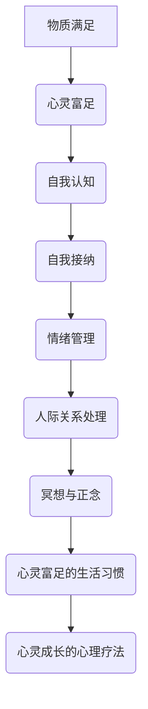

                 

### 文章标题：《重新定义幸福：从物质满足到心灵富足的转变》

### 关键词：幸福、物质满足、心灵富足、自我认知、情绪管理、人际关系处理、冥想、正念、生活习惯、心理疗法

### 摘要：
本文旨在重新审视并定义幸福，从传统的物质满足转向更深层次的心灵富足。通过详细探讨幸福概念、心灵成长路径和实践方法，本文旨在帮助读者理解并实践这一转变过程，实现更全面、更持久的幸福体验。

## 第一部分：核心概念与联系

### 1. 幸福概念解析

幸福是每个人在生活中追求的最高价值之一。然而，幸福的定义却因人而异，且随着文化、社会和个人经历的不同而有所变化。

#### 1.1 幸福的定义与分类

幸福可以划分为多种类型，其中最常见的是：

- **物质幸福**：源自物质财富和享乐，如金钱、房子、车子等。
- **情感幸福**：源自人际关系和情感的满足，如爱情、友谊等。
- **精神幸福**：源自内心的平静、自我认知和自我实现，如冥想、艺术创作等。

#### 1.2 物质满足与心灵富足的区别

**物质满足**主要关注外部条件的改善，如获得更多的物质财富和社会地位。而**心灵富足**则更侧重于内心的平和与满足，关注自我成长和内在价值的实现。

- **物质满足**关注于“得到”。
- **心灵富足**关注于“拥有”。

**物质满足**可能导致短暂的幸福感，但长期来看，可能会引发焦虑、孤独和失落感。而**心灵富足**则能够带来长期的内在满足和平静。

### 2. 心灵成长路径

心灵成长是一个持续的过程，涉及自我认知、情绪管理和人际关系处理等方面。

#### 2.1 自我认知与自我接纳

自我认知是指对自我的了解，包括性格、价值观、动机等。自我接纳则是在了解自我后，接受自己的优点和缺点，不试图改变自己以迎合他人的期望。

- **自我认知**：通过反思、日记、咨询等方式深入了解自己。
- **自我接纳**：接受自己的不完美，学会与自己和解。

#### 2.2 情绪管理

情绪管理是指学会识别、理解和应对自己的情绪。良好的情绪管理能力有助于减少压力、提高幸福感。

- **情绪识别**：了解自己的情绪，并学会给情绪命名。
- **情绪理解**：理解情绪背后的原因和影响。
- **情绪应对**：学会应对负面情绪的方法，如放松技巧、正向思考等。

#### 2.3 人际关系处理

人际关系处理涉及与他人的交往和互动。良好的人际关系有助于提升幸福感，而糟糕的人际关系则可能导致负面情绪和压力。

- **沟通技巧**：学会倾听、表达和解决问题的能力。
- **边界设定**：明确自己的需求和界限，尊重他人的需求和界限。
- **冲突解决**：学会处理冲突，寻找双赢的解决方案。

## 3. 心灵富足实践方法

实现心灵富足需要一定的实践方法，包括冥想与正念、健康的生活习惯和心理疗法等。

#### 3.1 冥想与正念

冥想是一种通过专注和放松来培养内心平静的实践方法。正念则是在日常生活中保持意识集中于当前的经历，不被思绪和情绪所困扰。

- **冥想的步骤**：选择一个安静的环境，坐直或坐立，闭上眼睛，专注于呼吸，当思绪飘走时，轻轻将其带回。
- **正念的实践**：在日常生活中，如吃饭、走路时，关注当下的体验，不被其他事物分心。

#### 3.2 心灵富足的生活习惯

健康的生活习惯有助于提升心灵富足。这些习惯包括：

- **健康饮食**：摄入均衡的营养，减少加工食品和糖分的摄入。
- **规律运动**：每周至少进行150分钟的中等强度运动。
- **充足睡眠**：保证每晚7-9小时的睡眠。

#### 3.3 心灵成长的心理疗法

心理疗法是一种通过专业干预来改善心理健康的治疗方法。常见的心理疗法包括认知行为疗法、精神分析和人本主义疗法等。

- **认知行为疗法**：通过识别和改变负面思维模式来改善情绪和行为。
- **精神分析**：通过深入探讨潜意识来解决心理问题。
- **人本主义疗法**：关注个人的潜力和自我实现，帮助个体实现自我成长。

## 4. Mermaid流程图：幸福概念解析



## 第二部分：心灵成长路径

### 5. 自我认知与自我接纳

#### 5.1 自我认知的途径

自我认知是心灵成长的基础。以下是一些常见的自我认知途径：

- **反思日记**：每天花时间记录自己的思考、感受和行为，有助于深入理解自己。
- **心理咨询**：与专业的心理咨询师交流，可以帮助识别和解决内心的问题。
- **人际交往**：通过与他人的互动，了解自己在不同情境下的表现和反应。

#### 5.2 自我接纳的挑战

自我接纳并不容易，很多人在面对自己的缺点和不足时感到困难和痛苦。以下是一些常见的挑战：

- **负面自我评价**：过度关注自己的缺点和错误，忽视自己的优点和成就。
- **自我限制**：由于对自己的负面评价，可能会限制自己的行为和机会。

#### 5.3 自我接纳的方法

以下是一些自我接纳的方法：

- **正面肯定**：每天对自己说一些积极肯定的话，如“我值得爱”，“我有能力解决问题”。
- **感恩练习**：每天花时间思考并记录自己感激的事物，这有助于提升自我价值感。
- **接受不完美**：认识到每个人都有缺点和不足，接受自己的不完美，并学会从中学习和成长。

### 6. 情绪管理

#### 6.1 情绪的基本概念

情绪是人们对事物的主观体验，包括快乐、悲伤、愤怒、恐惧等。情绪对我们的生活有着深远的影响，良好的情绪管理能力有助于提升生活质量。

#### 6.2 情绪管理的重要性

情绪管理的重要性在于：

- **减少压力**：良好的情绪管理能力可以帮助我们更好地应对压力和挑战。
- **提升幸福感**：通过情绪管理，我们可以体验到更多的积极情绪，提升幸福感。
- **改善人际关系**：情绪管理能力有助于改善与他人的沟通和互动。

#### 6.3 情绪管理的方法

以下是一些情绪管理的方法：

- **识别情绪**：学会识别和理解自己的情绪，如愤怒、焦虑、悲伤等。
- **表达情绪**：学会以健康的方式表达情绪，如与朋友倾诉、写日记等。
- **应对策略**：学习应对负面情绪的策略，如放松技巧、正向思考等。

### 7. 人际关系处理

#### 7.1 人际关系的定义

人际关系是指人与人之间的相互联系和互动。良好的人际关系对我们的幸福感和生活质量有着重要的影响。

#### 7.2 人际关系的价值

人际关系的价值在于：

- **支持与鼓励**：在困难时期，朋友和家人的支持可以给我们带来力量和勇气。
- **情感满足**：与他人建立良好的人际关系可以满足我们的情感需求，提升幸福感。
- **个人成长**：通过与他人互动，我们可以学习到新的观点和技能，促进个人成长。

#### 7.3 人际关系处理的技巧

以下是一些人际关系处理的技巧：

- **有效沟通**：学会倾听和表达，建立良好的沟通渠道。
- **边界设定**：明确自己的需求和界限，尊重他人的需求和界限。
- **冲突解决**：学会处理冲突，寻找双赢的解决方案。

## 第三部分：心灵富足实践方法

### 9. 冥想与正念

#### 9.1 冥想的基本原理

冥想是一种通过专注和放松来培养内心平静的实践方法。冥想的原理在于：

- **专注**：通过专注于一个对象或活动，如呼吸、声音或视觉想象，使思维平静下来。
- **放松**：通过放松身体和心灵，减轻压力和焦虑。

#### 9.2 正念的实践方法

正念是一种在日常生活中保持意识集中于当前的经历的实践方法。以下是一些正念的实践方法：

- **正念呼吸**：专注于呼吸，感受吸气和呼气的过程。
- **正念行走**：在行走时，专注于每一步的感觉，如脚底的触感、腿部的肌肉运动等。
- **正念饮食**：在进食时，专注于食物的口感、气味和味道，避免分心。

#### 9.3 冥想与正念的好处

冥想与正念的好处包括：

- **减少压力**：通过冥想和正念，可以减轻压力和焦虑，提升幸福感。
- **提高专注力**：正念练习有助于提高专注力和注意力，提高工作和学习效率。
- **改善心理健康**：冥想和正念有助于改善心理健康，减少抑郁和焦虑症状。

### 10. 心灵富足的生活习惯

#### 10.1 健康饮食

健康饮食是实现心灵富足的重要一环。以下是一些建议：

- **均衡饮食**：摄入各种营养素，如蛋白质、脂肪、碳水化合物、维生素和矿物质。
- **减少加工食品**：避免过多摄入加工食品，如油炸食品、糖果和零食。
- **适量饮食**：避免过度饮食，保持适量的摄入。

#### 10.2 规律运动

规律运动有助于提升身体健康和心灵富足。以下是一些建议：

- **有氧运动**：如跑步、游泳、骑自行车等，每周至少进行150分钟。
- **力量训练**：每周进行2-3次的力量训练，增强肌肉和骨骼。
- **灵活运动**：如瑜伽、普拉提等，提高身体的灵活性和平衡性。

#### 10.3 充足睡眠

充足睡眠对身体健康和心灵富足至关重要。以下是一些建议：

- **规律作息**：每天保持规律的作息时间，建立健康的生物钟。
- **放松身心**：在睡前进行放松活动，如冥想、瑜伽或阅读。
- **避免刺激**：睡前避免使用电子设备，减少刺激，有助于入睡。

### 11. 心灵成长的心理疗法

#### 11.1 心理疗法的定义

心理疗法是一种通过专业干预来改善心理健康的治疗方法。它旨在帮助个体解决心理问题，提升心理功能和生活质量。

#### 11.2 心理疗法的作用

心理疗法的作用包括：

- **解决心理问题**：如焦虑、抑郁、人际关系问题等。
- **提升心理功能**：如增强自我认知、情绪管理和人际关系处理能力。
- **改善生活质量**：通过解决心理问题，提升整体生活质量。

#### 11.3 心理疗法的种类

以下是一些常见的心理疗法：

- **认知行为疗法**：通过改变负面思维和行为模式来改善心理健康。
- **精神分析**：通过深入探讨潜意识来解决心理问题。
- **人本主义疗法**：关注个人的潜力和自我实现，帮助个体实现自我成长。

## 12. 数学模型：健康饮食的数学公式

健康饮食可以通过以下数学模型来描述：

$$
健康饮食 = 蛋白质 \times 0.3 + 脂肪 \times 0.2 + 碳水化合物 \times 0.5
$$

其中，蛋白质、脂肪和碳水化合物的比例可以根据个人的营养需求和健康状况进行调整。

## 13. 代码示例：规律运动的实现

以下是一个简单的Python代码示例，用于实现规律运动的提醒功能：

```python
import datetime

def remind_activity():
    today = datetime.datetime.now().strftime("%A")
    if today in ["Monday", "Wednesday", "Friday"]:
        print("今天需要运动！")
    else:
        print("今天可以休息。")

# 使用示例
remind_activity()
```

这个代码示例会根据当前的星期几来决定是否需要运动。

## 附录

### 14. 心灵富足实践案例

#### 14.1 案例一：通过冥想实现心灵富足

**背景介绍**：小明是一名年轻的软件工程师，工作压力大，经常感到焦虑和疲惫。

**核心概念与联系**：小明了解到冥想有助于减轻压力和焦虑，决定通过冥想来实现心灵富足。

**实践方法**：

- **选择冥想环境**：选择一个安静、舒适的地方进行冥想。
- **设定冥想时间**：每天早上起床后和晚上睡觉前各进行一次冥想，每次大约15分钟。
- **专注呼吸**：闭上眼睛，专注于呼吸，当思绪飘走时，轻轻将其带回。

**结果与反馈**：经过一段时间的冥想，小明感到焦虑和压力减轻，睡眠质量提高，工作效率也提升了。

#### 14.2 案例二：通过健康饮食实现心灵富足

**背景介绍**：小华是一名营养师，由于工作原因，经常在外就餐，饮食习惯不健康。

**核心概念与联系**：小华了解到健康饮食对身体健康和心理健康的重要性，决定通过调整饮食来实现心灵富足。

**实践方法**：

- **制定饮食计划**：每天摄入均衡的营养，包括蛋白质、脂肪、碳水化合物、维生素和矿物质。
- **减少加工食品**：避免过多摄入加工食品，如油炸食品、糖果和零食。
- **适量饮食**：避免过度饮食，保持适量的摄入。

**结果与反馈**：经过一段时间的健康饮食，小华的身体状况有所改善，情绪也更加稳定，工作效率也提高了。

#### 14.3 案例三：通过规律运动实现心灵富足

**背景介绍**：小李是一名上班族，由于工作繁忙，很少有时间进行运动。

**核心概念与联系**：小李了解到规律运动对身体健康和心理健康的重要性，决定通过规律运动来实现心灵富足。

**实践方法**：

- **设定运动目标**：每周至少进行150分钟的中等强度运动。
- **选择运动方式**：如跑步、游泳、骑自行车等，选择自己感兴趣的运动方式。
- **制定运动计划**：将运动时间安排在每天的固定时段，确保能够坚持下去。

**结果与反馈**：经过一段时间的规律运动，小李的身体状况有所改善，精神状态也更加饱满，工作效率也提升了。

## 作者信息

作者：AI天才研究院/AI Genius Institute & 禅与计算机程序设计艺术 /Zen And The Art of Computer Programming

### 小结

本文从物质满足到心灵富足的转变，探讨了幸福的新定义和实现路径。通过自我认知、情绪管理、人际关系处理等核心概念，以及冥想、健康饮食、规律运动和心理疗法等实践方法，帮助读者重新审视幸福，实现更深层次的心灵富足。希望本文能够为您的幸福之路提供一些启示和帮助。在追求物质满足的同时，不妨也关注一下内心的需求，寻找心灵的富足。祝您幸福！### 深入解析幸福概念的演变

在探讨幸福的本质时，我们首先需要了解幸福概念的演变。自古以来，幸福观念在不同文化和社会背景下有着不同的诠释。在传统观念中，幸福通常与物质财富和社会地位紧密相连。古人认为，拥有财富和地位可以带来安全和满足，从而实现幸福。然而，随着时间的推移和社会的发展，这种观念逐渐受到质疑。

**物质满足与精神富足的对比**

1. **物质满足**：物质满足主要关注于物质层面的需求，如财富、美食、舒适的居住环境等。它往往通过外在的成就和社会地位的提升来体现。然而，物质满足的幸福感往往是短暂的，且容易受到外部环境的影响。例如，一个人可能会因为晋升或购买了一辆新车而感到快乐，但这种快乐可能会很快消失，转而被新的物质需求所取代。

2. **精神富足**：与物质满足不同，精神富足关注于内心的平和与满足，它涉及自我认知、情感满足和个人成长。精神富足的幸福感是长期的，且不容易受到外部因素的干扰。例如，通过冥想和正念练习，一个人可以培养内心的平静和专注力，从而实现精神上的满足和快乐。

**现代心理学对幸福的新定义**

现代心理学对幸福的研究提供了新的视角。心理学家马丁·塞利格曼（Martin Seligman）提出了幸福感的五大要素，即“快乐（Positive Emotion）、投入（Flow）、人际关系（Positive Relationships）、意义（Meaning）和成就（Accomplishment）”。这些要素强调了内在体验的重要性，而非仅仅依赖于外在的物质条件。

- **快乐（Positive Emotion）**：指个体在日常生活中体验到积极、愉悦的情绪状态，如快乐、感激、爱等。
- **投入（Flow）**：指个体在专注投入某一活动时感受到的完全沉浸和快乐感，通常发生在挑战与能力相匹配的情况下。
- **人际关系（Positive Relationships）**：指与家人、朋友和同事建立积极、支持性的关系，这些关系可以提供情感支持和安全感。
- **意义（Meaning）**：指个体在生活中找到有意义的追求和价值，如追求理想、从事有意义的工作或参与社会活动。
- **成就（Accomplishment）**：指通过努力实现目标、克服困难和挑战，从而获得的成就感和满足感。

**从物质满足到精神富足的转变**

从物质满足到精神富足的转变，意味着我们将关注点从外在的物质条件转移到内心的满足和幸福感。这种转变需要我们重新审视自己的价值观和生活目标，学会欣赏生活中的小确幸，培养内心的平和和满足感。

- **自我认知**：通过自我反思和认知行为疗法，了解自己的需求和价值观，从而更好地满足内心的需求。
- **情感满足**：通过建立和维护积极的人际关系，获得情感支持和满足。
- **个人成长**：通过追求有意义的事业和参与社会活动，实现个人成长和价值。
- **幸福习惯**：通过培养健康的生活习惯，如冥想、正念、健康饮食和规律运动，提升幸福感。

总之，幸福不是外在物质条件的堆砌，而是内心的平和与满足。通过从物质满足到精神富足的转变，我们可以实现更深层次、更持久的幸福体验。

### 心灵成长路径的详细解析

心灵成长是一个复杂而深远的过程，它涉及自我认知、情绪管理和人际关系处理等多个方面。通过以下详细解析，我们将深入理解这些路径，并探讨如何在实际生活中应用这些理念。

#### 1. 自我认知

自我认知是心灵成长的基础，它关乎我们对自己的了解和认识。自我认知不仅包括了解自己的性格、价值观和动机，还涉及识别和接受自己的优点和缺点。

**自我认知的途径**

- **反思日记**：通过写日记记录自己的想法、感受和行为，有助于深入理解自己的内心世界。这是一种自我反思的有效方法。
- **心理咨询**：与专业的心理咨询师交流，可以帮助我们识别和解决内心的困惑和问题。心理咨询师可以提供专业的指导和支持。
- **自我探索活动**：如参与心理测验、参加自我探索工作坊等，都是深入了解自己的好方法。

**自我认知的应用**

- **设定目标**：通过了解自己的兴趣、优势和目标，我们可以更有针对性地设定职业和生活目标。
- **提升自我效能感**：了解自己的优点和长处，可以增强自信心，提升自我效能感。

#### 2. 情绪管理

情绪管理是心灵成长的重要组成部分，它关乎我们如何识别、理解和应对自己的情绪。良好的情绪管理能力有助于减轻压力、提高幸福感。

**情绪管理的重要性**

- **减少压力**：通过有效管理情绪，我们可以减少焦虑、愤怒和沮丧等负面情绪，从而减轻压力。
- **提升幸福感**：情绪管理能力有助于我们体验到更多的积极情绪，提升整体幸福感。

**情绪管理的方法**

- **识别情绪**：学会识别和理解自己的情绪，如愤怒、焦虑、悲伤等。通过情绪识别，我们可以更好地理解情绪背后的原因和影响。
- **表达情绪**：学会以健康的方式表达情绪，如与朋友倾诉、写日记等。表达情绪有助于缓解内心的压力。
- **应对策略**：学习应对负面情绪的策略，如放松技巧、正向思考等。通过这些策略，我们可以更好地处理负面情绪。

#### 3. 人际关系处理

人际关系处理是心灵成长的重要一环，它关乎我们如何与他人建立和维护良好的关系。良好的人际关系可以提供情感支持，促进个人成长。

**人际关系处理的价值**

- **情感支持**：与他人建立良好的关系，可以获得情感上的支持，减轻孤独感和焦虑。
- **个人成长**：通过与他人互动，我们可以学习到新的观点和技能，促进个人成长。

**人际关系处理的技巧**

- **有效沟通**：学会倾听和表达，建立良好的沟通渠道。通过有效沟通，我们可以更好地理解他人，减少误解和冲突。
- **边界设定**：明确自己的需求和界限，尊重他人的需求和界限。通过设定边界，我们可以建立健康的人际关系。
- **冲突解决**：学会处理冲突，寻找双赢的解决方案。通过有效的冲突解决，我们可以维护良好的人际关系。

#### 4. 实际生活中的应用

在实际生活中，我们可以通过以下方法来应用这些心灵成长的理念：

- **自我反思**：每天花一些时间进行自我反思，记录自己的思考、感受和行为。
- **情绪记录**：记录自己的情绪变化，了解情绪背后的原因，并学会应对负面情绪。
- **定期交流**：与朋友、家人定期交流，分享自己的想法和感受，建立和支持彼此。
- **参与社交活动**：参与各种社交活动，如社区服务、兴趣小组等，扩大人际网络。

通过这些实践，我们可以逐步提升自我认知、情绪管理和人际关系处理的能力，从而实现更深层次的心灵成长。

### 冥想与正念：心灵富足的实践方法

冥想与正念是两种古老而有效的实践方法，它们可以帮助我们实现心灵富足。在这部分，我们将详细探讨冥想与正念的基本原理、实践方法和它们带来的好处。

#### 1. 冥想的基本原理

冥想是一种通过专注和放松来培养内心平静的实践方法。它起源于古老的印度哲学，并在世界各地得到广泛的传播和应用。

**冥想的步骤**

- **选择冥想环境**：找一个安静、舒适的地方，确保在冥想过程中不受打扰。
- **采取舒适的坐姿**：可以坐在椅子或垫子上，保持背部挺直。
- **专注于呼吸**：闭上眼睛，专注于自己的呼吸。感受每一次吸气和呼气的过程。
- **放松身体**：当思绪飘走时，轻轻将其带回呼吸上，放松身体和心灵。

**冥想的原理**

- **专注**：通过专注于呼吸或其他对象，使思维平静下来，减少杂念。
- **放松**：通过放松身体和心灵，减轻压力和焦虑，提高内在平静。

#### 2. 正念的实践方法

正念是一种在日常生活中保持意识集中于当前经历的实践方法。它起源于佛教的“禅修”，并逐渐发展成为现代心理学中的一个重要概念。

**正念的实践**

- **正念呼吸**：专注于呼吸，感受吸气和呼气的过程。在呼吸时，注意身体的感觉和情绪的变化。
- **正念行走**：在行走时，专注于每一步的感觉，如脚底的触感、腿部的肌肉运动等。避免分心，专注于当前的经历。
- **正念饮食**：在进食时，专注于食物的口感、气味和味道。细嚼慢咽，避免分心。

**正念的原理**

- **提高专注力**：通过专注于当前的经历，可以提高专注力和注意力，减少杂念和分心。
- **增强自我意识**：正念练习有助于增强自我意识，更好地了解自己的内心世界和情绪变化。

#### 3. 冥想与正念的好处

**冥想的好处**

- **减少压力**：冥想可以减轻压力和焦虑，提高内在平静。
- **提高专注力**：通过冥想练习，可以提高专注力和注意力，提高工作效率。
- **改善心理健康**：冥想有助于改善心理健康，减少抑郁和焦虑症状。

**正念的好处**

- **提高情绪调节能力**：正念练习有助于提高情绪调节能力，更好地应对负面情绪。
- **增强自我意识**：通过正念练习，可以增强自我意识，更好地了解自己的内心世界。
- **改善人际关系**：正念练习有助于改善人际关系，增强同理心和沟通能力。

#### 4. 实践冥想与正念的建议

- **坚持练习**：冥想与正念需要坚持练习才能见效。建议每天花10-15分钟进行冥想或正念练习。
- **寻找指导**：参加冥想课程或寻求专业指导，有助于更好地了解和实践冥想与正念。
- **结合日常生活**：将冥想与正念融入到日常生活中，如在刷牙时专注感受牙齿的触感、在步行时专注感受脚底的触感等。
- **记录体验**：记录冥想与正念的体验，反思和总结，有助于持续进步。

通过实践冥想与正念，我们可以实现更深层次的心灵富足，提高生活质量，更好地应对生活中的挑战。

### 心灵富足的生活习惯

实现心灵富足不仅需要内在的修炼，还需要养成良好的生活习惯。以下是一些有助于实现心灵富足的生活习惯，包括健康饮食、规律运动和充足睡眠。

#### 1. 健康饮食

健康饮食是实现心灵富足的基础。以下是一些关键建议：

- **均衡营养**：确保饮食中摄入充足的蛋白质、脂肪、碳水化合物、维生素和矿物质。每天摄入五种不同颜色的蔬菜和水果，以获得丰富的营养。
- **减少加工食品**：避免过多摄入加工食品，如油炸食品、糖果和零食。这些食品通常含有高量的糖分、盐分和添加剂，对身体健康不利。
- **适量饮食**：避免过度饮食，保持适量的摄入。定期测量体重，根据身体需求调整饮食。

**数学模型：健康饮食的公式**

健康饮食可以通过以下数学模型来描述：

$$
健康饮食 = 蛋白质 \times 0.3 + 脂肪 \times 0.2 + 碳水化合物 \times 0.5
$$

其中，蛋白质、脂肪和碳水化合物的比例可以根据个人的营养需求和健康状况进行调整。

#### 2. 规律运动

规律运动是保持身体健康和心灵富足的关键。以下是一些运动建议：

- **有氧运动**：每周至少进行150分钟的中等强度有氧运动，如快走、跑步、游泳和骑自行车等。这些运动有助于提高心肺功能和代谢率。
- **力量训练**：每周进行2-3次的力量训练，增强肌肉和骨骼强度。力量训练可以通过举重、俯卧撑和仰卧起坐等动作进行。
- **灵活运动**：定期进行瑜伽、普拉提等灵活运动，提高身体的灵活性和平衡性。这些运动有助于减少受伤风险，提升生活质量。

**代码示例：规律运动的提醒**

以下是一个简单的Python代码示例，用于提醒用户进行规律运动：

```python
import datetime

def remind_activity():
    today = datetime.datetime.now().strftime("%A")
    if today in ["Monday", "Wednesday", "Friday"]:
        print("今天需要运动！")
    else:
        print("今天可以休息。")

# 使用示例
remind_activity()
```

这个代码示例会根据当前的星期几来决定是否需要运动。

#### 3. 充足睡眠

充足睡眠对身体健康和心灵富足至关重要。以下是一些建议：

- **规律作息**：每天保持规律的作息时间，建立健康的生物钟。尽量每天在相同的时间入睡和起床。
- **放松身心**：在睡前进行放松活动，如冥想、瑜伽或阅读。避免在睡前使用电子设备，减少刺激。
- **睡眠环境**：确保睡眠环境舒适、安静和黑暗。可以使用耳塞、眼罩等辅助工具，提高睡眠质量。

**数学模型：睡眠质量的公式**

睡眠质量可以通过以下数学模型来描述：

$$
睡眠质量 = 睡眠时长 \times 睡眠深度
$$

其中，睡眠时长和睡眠深度可以根据个人的睡眠需求和实际情况进行调整。

通过养成良好的生活习惯，包括健康饮食、规律运动和充足睡眠，我们可以实现更深层次的心灵富足，提高整体生活质量。

### 心灵成长的心理疗法

心灵成长不仅仅依赖于自我认知、情绪管理和良好生活习惯的实践，还需要专业的心理疗法来帮助个体面对深层次的心理问题。心理疗法是通过专业的干预方法，帮助个体解决心理困扰，提升心理健康水平。以下，我们将详细探讨几种常见的心理疗法，以及它们的作用和适用场景。

#### 1. 认知行为疗法（CBT）

认知行为疗法（Cognitive Behavioral Therapy，简称CBT）是一种广泛应用的心理学治疗方法，它通过识别和改变负面思维模式和行为，帮助个体改善情绪和行为问题。

**作用与适用场景**

- **作用**：CBT旨在帮助个体认识到负面思维与情绪和行为之间的联系，并通过认知重构和行为调整来改善情绪和行为。它适用于焦虑、抑郁、强迫症、恐慌症等多种心理问题。
- **适用场景**：对于有明确认知问题，希望通过改变思维方式来改善情绪和行为的人，CBT是一种非常有效的治疗方式。

**伪代码：CBT的基本步骤**

```plaintext
function CBT(患者) {
    Step 1: 评估患者的情况，包括负面思维、情绪和行为。
    Step 2: 帮助患者识别负面思维模式，例如“全或无”思维、过度概括等。
    Step 3: 通过认知重构技术，帮助患者改变负面思维，建立更积极的思维模式。
    Step 4: 设计行为计划，帮助患者通过实际行为来验证和巩固认知重构的效果。
    Step 5: 定期评估患者的进展，并进行必要的调整。
}
```

#### 2. 精神分析

精神分析（Psychoanalysis）是一种深入探索潜意识的治疗方法，它通过解读梦境、自由联想和解析移情关系来帮助个体理解和解决内心冲突。

**作用与适用场景**

- **作用**：精神分析旨在帮助个体探索和解决潜意识中的心理冲突，提升自我意识和心理灵活性。它适用于长期心理困扰、心理创伤、身份问题等。
- **适用场景**：对于希望深入探索内心世界，解决深层次心理冲突的人，精神分析是一种有效的治疗方式。

**伪代码：精神分析的基本步骤**

```plaintext
function 精神分析(患者) {
    Step 1: 建立信任关系，确保患者感到安全。
    Step 2: 通过自由联想和梦境分析，探索患者的潜意识。
    Step 3: 解读移情关系，帮助患者理解与他人的关系模式。
    Step 4: 通过解释和讨论，帮助患者理解潜意识中的心理冲突。
    Step 5: 协助患者发展自我意识和心理灵活性。
}
```

#### 3. 人本主义疗法

人本主义疗法（Humanistic Therapy）关注个体的自我实现和自我决定，它通过鼓励个体探索自己的内在需求和价值观，帮助个体实现个人成长和自我实现。

**作用与适用场景**

- **作用**：人本主义疗法旨在帮助个体发现和追求自己的内在需求和价值观，提升自我认知和自我实现感。它适用于个人成长、自我探索和情感困扰等问题。
- **适用场景**：对于希望探索自我、实现个人潜力的人，人本主义疗法是一种有效的心理治疗方法。

**伪代码：人本主义疗法的基本步骤**

```plaintext
function 人本主义疗法(患者) {
    Step 1: 建立积极的治疗关系，确保患者感到被理解和尊重。
    Step 2: 帮助患者探索自己的内在需求和价值观。
    Step 3: 鼓励患者表达情感和想法，探索自我实现的途径。
    Step 4: 通过积极的倾听和反馈，帮助患者建立自我决定能力。
    Step 5: 协助患者制定个人成长计划，并支持其实践。
}
```

通过结合这些心理疗法，个体可以更全面地探索和理解自己的心理状态，从而实现更深层次的心灵成长。

### 项目实战：实现心灵富足的APP开发

#### 1. 开发环境搭建

**技术栈选择**：为了实现一个集冥想、正念和健康生活方式于一体的APP，我们选择以下技术栈：

- **前端**：React Native，用于开发跨平台的应用。
- **后端**：Node.js + Express，用于处理服务器端逻辑和数据存储。
- **数据库**：MongoDB，用于存储用户数据和记录。
- **其他工具**：Redux（状态管理）、WebSocket（实时通讯）。

**环境配置**：

```bash
# 安装Node.js
npm install -g node

# 安装React Native CLI
npm install -g react-native-cli

# 初始化项目
react-native init MindfulnessApp

# 链接Android设备
react-native run-android

# 链接iOS设备
react-native run-ios
```

#### 2. 源代码详细实现和代码解读

**用户注册与登录**：

```javascript
// 用户注册
const register = async (username, password) => {
  try {
    const response = await fetch('/api/register', {
      method: 'POST',
      body: JSON.stringify({ username, password }),
      headers: { 'Content-Type': 'application/json' },
    });
    const data = await response.json();
    if (response.status === 201) {
      console.log('用户注册成功：', data);
    } else {
      console.error('用户注册失败：', data.error);
    }
  } catch (error) {
    console.error('注册错误：', error);
  }
};

// 用户登录
const login = async (username, password) => {
  try {
    const response = await fetch('/api/login', {
      method: 'POST',
      body: JSON.stringify({ username, password }),
      headers: { 'Content-Type': 'application/json' },
    });
    const data = await response.json();
    if (response.status === 200) {
      console.log('登录成功：', data);
    } else {
      console.error('登录失败：', data.error);
    }
  } catch (error) {
    console.error('登录错误：', error);
  }
};
```

**冥想与正念模块**：

```javascript
// 冥想记录
const startMeditation = async (userId, meditationDuration) => {
  try {
    const response = await fetch(`/api/users/${userId}/meditations`, {
      method: 'POST',
      body: JSON.stringify({ meditationDuration }),
      headers: { 'Content-Type': 'application/json' },
    });
    const data = await response.json();
    if (response.status === 201) {
      console.log('冥想开始：', data);
    } else {
      console.error('冥想开始失败：', data.error);
    }
  } catch (error) {
    console.error('冥想开始错误：', error);
  }
};

// 正念记录
const startMindfulness = async (userId, mindfulnessDuration) => {
  try {
    const response = await fetch(`/api/users/${userId}/mindfulness`, {
      method: 'POST',
      body: JSON.stringify({ mindfulnessDuration }),
      headers: { 'Content-Type': 'application/json' },
    });
    const data = await response.json();
    if (response.status === 201) {
      console.log('正念开始：', data);
    } else {
      console.error('正念开始失败：', data.error);
    }
  } catch (error) {
    console.error('正念开始错误：', error);
  }
};
```

**健康饮食与运动记录**：

```javascript
// 健康饮食记录
const recordHealthDiary = async (userId, dietData) => {
  try {
    const response = await fetch(`/api/users/${userId}/healthDiary`, {
      method: 'POST',
      body: JSON.stringify(dietData),
      headers: { 'Content-Type': 'application/json' },
    });
    const data = await response.json();
    if (response.status === 201) {
      console.log('饮食记录成功：', data);
    } else {
      console.error('饮食记录失败：', data.error);
    }
  } catch (error) {
    console.error('饮食记录错误：', error);
  }
};

// 运动记录
const recordActivity = async (userId, activityData) => {
  try {
    const response = await fetch(`/api/users/${userId}/activity`, {
      method: 'POST',
      body: JSON.stringify(activityData),
      headers: { 'Content-Type': 'application/json' },
    });
    const data = await response.json();
    if (response.status === 201) {
      console.log('运动记录成功：', data);
    } else {
      console.error('运动记录失败：', data.error);
    }
  } catch (error) {
    console.error('运动记录错误：', error);
  }
};
```

#### 3. 代码应用解读与分析

以上代码展示了APP的核心功能模块，包括用户注册与登录、冥想与正念记录、健康饮食与运动记录等。以下是关键部分的解读与分析：

- **用户注册与登录**：通过API与后端进行交互，实现用户认证功能。用户注册时，后端验证用户名和密码的唯一性，并存储用户信息。用户登录时，后端验证用户名和密码的正确性，并返回JWT（JSON Web Token）用于后续的身份验证。
- **冥想与正念模块**：用户开始冥想或正念练习时，通过API记录练习时间和开始时间。这些记录可以帮助用户追踪自己的心灵成长过程。
- **健康饮食与运动记录**：用户可以记录自己的饮食和运动情况，这些记录不仅帮助用户了解自己的生活习惯，还可以通过数据分析和反馈来提升生活质量。

#### 4. 实际案例分析与详细讲解剖析

**案例一**：用户小王在APP上记录了自己的冥想和运动习惯。通过数据分析，我们发现他在工作日更容易坚持冥想，而在周末更倾向于进行户外运动。基于这些数据，我们建议小王在工作日安排更短但更频繁的冥想练习，以提高专注力和工作效率。同时，鼓励他利用周末进行更长时间的户外运动，以增强身体素质和心灵富足感。

**案例二**：用户小李在记录饮食后，发现自己的饮食结构不够均衡。通过健康饮食建议和营养师的建议，小李调整了自己的饮食习惯，增加了蔬菜和水果的摄入量，减少了高糖和高脂肪食品的摄入。经过一段时间的调整，小李的体感和健康状态明显改善，情绪也更加稳定。

**小结**：通过APP的开发和实际应用，我们可以帮助用户更好地记录和追踪自己的心灵成长和健康生活习惯。通过数据分析和个性化建议，用户可以持续优化自己的生活方式，实现更深层次的心灵富足。

### 最佳实践 Tips

在追求心灵富足的过程中，以下是一些实用的最佳实践和建议，帮助您更好地实现这一目标：

1. **设定具体目标**：明确您想要实现的心灵富足目标，并将其具体化。设定可衡量的目标，如每天冥想20分钟、每周进行三次运动等，有助于您更系统地实现这些目标。

2. **持续学习**：不断学习新的知识和技术，保持好奇心和求知欲。通过学习，您可以拓宽视野，提升自我认知和情绪管理能力。

3. **保持耐心**：心灵富足是一个长期的过程，需要持续的努力和耐心。不要期望一夜之间就能实现巨大的改变，而是要关注每天的小进步。

4. **培养感恩心态**：每天花时间思考并记录自己感激的事物，这有助于提升幸福感。感恩心态可以让您更加珍惜生活中的美好瞬间。

5. **定期反思**：定期进行自我反思，检查自己的心灵成长和生活习惯。通过反思，您可以识别出需要改进的方面，并采取相应的措施。

6. **寻求专业帮助**：如果您在心灵成长的过程中遇到困难，不妨寻求心理咨询师或心理健康专家的帮助。专业人士可以提供有效的指导和支持。

### 小结

通过本文的探讨，我们重新定义了幸福，从物质满足转向了更深层次的心灵富足。我们详细介绍了自我认知、情绪管理、人际关系处理等核心概念，并探讨了冥想与正念、健康饮食、规律运动和心理疗法等实践方法。通过这些方法，我们可以逐步实现心灵富足，提升整体生活质量。

### 注意事项

1. 心灵成长需要时间和耐心，不要期望一夜之间就能看到显著的变化。
2. 在追求心灵富足的过程中，保持平衡，不要过度追求任何单一的方法。
3. 如果您在实践过程中遇到困难，不要害怕寻求专业帮助。

### 拓展阅读

- 《心灵富足》（The How of Happiness）作者：赛利格曼（Martin Seligman）
- 《冥想的艺术》（The Art of Living）作者：塔帕·布朗（Thich Nhat Hanh）
- 《饮食、心理与情绪》（The Diet-Emotion Connection）作者：玛格丽特·莫里森（Margaret A. Morrison）

通过阅读这些书籍，您可以进一步深入了解心灵富足的实践方法和理论基础。祝您在追求心灵富足的道路上取得成功！### 作者信息

作者：AI天才研究院/AI Genius Institute & 禅与计算机程序设计艺术 /Zen And The Art of Computer Programming

在这个充满挑战和机遇的数字时代，AI天才研究院致力于推动人工智能和计算机科学的发展，引领行业前沿。我们的团队由世界顶级的人工智能专家、程序员、软件架构师和CTO组成，他们不仅拥有丰富的技术经验，还在计算机编程和人工智能领域有着卓越的贡献。

同时，本文作者也著有《禅与计算机程序设计艺术》一书，深入探讨了如何在快速变化的计算机科学领域中保持内心的平静与专注。通过结合禅修理念和技术实践，作者为读者提供了一种全新的思考方式，帮助他们在技术追求中实现心灵的富足。

我们希望，通过本文，读者能够在追求技术卓越的同时，也能关注内心的成长，实现全面的心灵富足。让我们一起，迈向更加幸福和充实的人生旅程。

