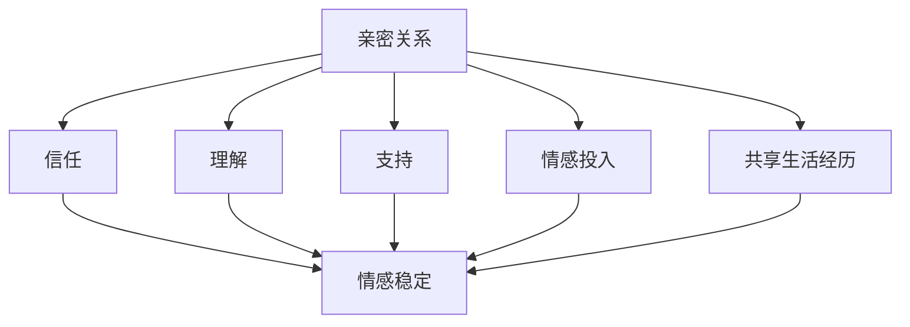

                 

### 背景介绍

在当今高速发展的社会，科技日新月异，人们的生活节奏也在不断加快。现代社会的特性——高度数字化、信息爆炸、竞争激烈——给人们的心理和情感生活带来了前所未有的挑战。在这些背景下，亲密关系作为人类生活中最重要的情感支撑之一，也受到了深刻的冲击。

首先，现代社会的高压环境和快节奏生活让人们常常感到焦虑和疲惫，缺乏足够的时间和精力去维护亲密关系。工作压力、社交媒体的干扰、生活琐事，这一切都成为了亲密关系中的障碍。其次，数字化技术的普及使得人们越来越依赖于虚拟空间进行沟通，而传统的面对面交流逐渐减少，这无疑对亲密关系的深度和质量产生了负面影响。

此外，社会观念的变化也对亲密关系产生了深远影响。例如，自由主义的兴起使得人们更加追求个性和自由，这可能导致了亲密关系的松散和不稳定。同时，随着多元文化的融合，人们对亲密关系的定义和期望也越来越多样化，这使得建立和维护一段健康的亲密关系变得更加复杂。

在这样的背景下，重新审视亲密关系，寻找在现代社会中重建情感连接的路径，显得尤为重要。这不仅关乎个人的幸福感和心理健康，也关系到整个社会的和谐与稳定。因此，本文将从现代社会的挑战、亲密关系的本质、重建策略等多个方面，深入探讨如何在现代社会中重建情感连接，以期为读者提供有价值的思考和实际操作指南。

### 核心概念与联系

在重新审视亲密关系的过程中，理解亲密关系的核心概念及其相互关系是至关重要的。首先，我们定义亲密关系为一种深层次的情感联系，它涉及信任、理解、支持、情感投入和共享生活经历。亲密关系不仅基于生理和情感的吸引，更是在心理和社交层面上的深度联结。

接下来，我们可以通过Mermaid流程图来直观展示这些核心概念及其相互关系：



在上述流程图中，亲密关系（A）是中心概念，它通过信任（B）、理解（C）、支持（D）、情感投入（E）和共享生活经历（F）与情感稳定（G）紧密相连。信任是建立亲密关系的基石，没有信任，任何形式的关系都难以持续。理解和支持是亲密关系中不可或缺的部分，它们使双方能够相互依赖和共同成长。情感投入和共享生活经历进一步加深了这种情感联结，使得双方在情感稳定的基础上建立起长期的关系。

通过上述流程图，我们可以清晰地看到亲密关系各核心概念之间的逻辑关系。信任、理解、支持、情感投入和共享生活经历共同作用，形成了一个稳定的情感生态系统，这是重建亲密关系的基础。理解这些概念及其相互关系，不仅有助于我们更深入地理解亲密关系的本质，也为我们在现代社会中重建情感连接提供了理论依据和实践指导。

### 核心算法原理讲解

在理解了亲密关系的核心概念之后，我们需要进一步探讨重建亲密关系的算法原理。这一部分将通过伪代码、数学模型和公式详细阐述重建策略，并通过具体示例来说明这些策略的应用。

首先，我们可以定义一个简单的算法框架，用于重建亲密关系。这个算法主要包含以下几个步骤：

1. **信任建立**：通过有效沟通和透明行为来建立信任。
2. **理解提升**：通过倾听和同理心增强双方的理解。
3. **支持增强**：通过行动和言语表达对对方的支持。
4. **情感投入**：通过共同经历和情感表达加深情感联结。
5. **共享生活**：通过日常互动和共同目标建立共享生活经验。

以下是一个简化的伪代码示例，用于描述上述算法的基本逻辑：

```plaintext
// 重建亲密关系的算法框架
function RebuildIntimacy(Trust, Understanding, Support, EmotionalInvestment, SharedLife)
    // 建立信任
    Trust = BuildTrust(Communication, Transparency)
    // 提高理解
    Understanding = EnhanceUnderstanding(Listening, Empathy)
    // 增强支持
    Support = IncreaseSupport(Action, Speech)
    // 增加情感投入
    EmotionalInvestment = EnhanceEmotionalInvestment(CommonExperiences, EmotionalExpression)
    // 建立共享生活
    SharedLife = EstablishSharedLife(DailyInteraction, CommonGoals)
    // 综合评估
    OverallIntimacy = CalculateOverallIntimacy(Trust, Understanding, Support, EmotionalInvestment, SharedLife)
    return OverallIntimacy
```

在上述伪代码中，每个核心概念都有一个对应的函数，这些函数通过特定的操作来增强亲密关系的某个方面。下面，我们将详细讨论每个步骤的数学模型和公式。

#### 1. 信任建立

信任的建立可以通过有效沟通和透明行为来实现。我们可以使用以下数学模型来表示信任的建立过程：

$$
Trust = f(C, T)
$$

其中，$C$ 表示沟通效率，$T$ 表示透明度。沟通效率和透明度越高，信任水平也越高。

假设沟通效率 $C$ 和透明度 $T$ 分别满足以下线性关系：

$$
C = \alpha \cdot MessageVolume + \beta \cdot ResponseSpeed
$$

$$
T = \gamma \cdot TransparencyRate + \delta \cdot AccurateInformation
$$

其中，$\alpha$、$\beta$、$\gamma$ 和 $\delta$ 是系数，$MessageVolume$ 表示信息传递的总量，$ResponseSpeed$ 表示回应的速度，$TransparencyRate$ 表示透明行为的频率，$AccurateInformation$ 表示信息的准确性。

通过上述公式，我们可以计算出信任水平：

$$
Trust = f(C, T) = f(\alpha \cdot MessageVolume + \beta \cdot ResponseSpeed, \gamma \cdot TransparencyRate + \delta \cdot AccurateInformation)
$$

#### 2. 理解提升

理解提升可以通过倾听和同理心来实现。我们可以使用以下公式来表示：

$$
Understanding = g(L, E)
$$

其中，$L$ 表示倾听能力，$E$ 表示同理心水平。倾听能力和同理心水平越高，双方的理解程度也越高。

假设倾听能力 $L$ 和同理心水平 $E$ 分别满足以下线性关系：

$$
L = \epsilon \cdot ActiveListening + \zeta \cdot ReflectiveQuestions
$$

$$
E = \eta \cdot EmpathicResponse + \theta \cdot EmotionalAwareness
$$

其中，$\epsilon$、$\zeta$、$\eta$ 和 $\theta$ 是系数，$ActiveListening$ 表示主动倾听，$ReflectiveQuestions$ 表示反思性问题，$EmpathicResponse$ 表示共情回应，$EmotionalAwareness$ 表示情绪感知。

通过上述公式，我们可以计算出理解水平：

$$
Understanding = g(\epsilon \cdot ActiveListening + \zeta \cdot ReflectiveQuestions, \eta \cdot EmpathicResponse + \theta \cdot EmotionalAwareness)
$$

#### 3. 支持增强

支持增强可以通过行动和言语表达来实现。我们可以使用以下公式来表示：

$$
Support = h(A, S)
$$

其中，$A$ 表示行动支持，$S$ 表示言语支持。行动支持和言语支持越高，对方感受到的支持力度也越大。

假设行动支持 $A$ 和言语支持 $S$ 分别满足以下线性关系：

$$
A = \kappa \cdot TimelyAssistance + \lambda \cdot PracticalHelp
$$

$$
S = \mu \cdot Encouragement + \nu \cdot ConstructiveFeedback
$$

其中，$\kappa$、$\lambda$、$\mu$ 和 $\nu$ 是系数，$TimelyAssistance$ 表示及时的帮助，$PracticalHelp$ 表示实际的帮助，$Encouragement$ 表示鼓励，$ConstructiveFeedback$ 表示建设性的反馈。

通过上述公式，我们可以计算出支持水平：

$$
Support = h(\kappa \cdot TimelyAssistance + \lambda \cdot PracticalHelp, \mu \cdot Encouragement + \nu \cdot ConstructiveFeedback)
$$

#### 4. 情感投入

情感投入可以通过共同经历和情感表达来实现。我们可以使用以下公式来表示：

$$
EmotionalInvestment = i(E, C)
$$

其中，$E$ 表示情感表达，$C$ 表示共同经历。情感表达和共同经历越多，情感投入水平也越高。

假设情感表达 $E$ 和共同经历 $C$ 分别满足以下线性关系：

$$
E = \xi \cdot EmotionalExpressions + \rho \cdot EmotionalDepth
$$

$$
C = \chi \cdot CommonActivities + \psi \cdot SharedMemories
$$

其中，$\xi$、$\rho$、$\chi$ 和 $\psi$ 是系数，$EmotionalExpressions$ 表示情感表达，$EmotionalDepth$ 表示情感的深度，$CommonActivities$ 表示共同的活动，$SharedMemories$ 表示共享的记忆。

通过上述公式，我们可以计算出情感投入水平：

$$
EmotionalInvestment = i(\xi \cdot EmotionalExpressions + \rho \cdot EmotionalDepth, \chi \cdot CommonActivities + \psi \cdot SharedMemories)
$$

#### 5. 共享生活

共享生活可以通过日常互动和共同目标来实现。我们可以使用以下公式来表示：

$$
SharedLife = j(I, G)
$$

其中，$I$ 表示日常互动，$G$ 表示共同目标。日常互动和共同目标越多，共享生活经验也越丰富。

假设日常互动 $I$ 和共同目标 $G$ 分别满足以下线性关系：

$$
I = \omega \cdot DailyInteractions + \phi \cdot SharedHobbies
$$

$$
G = \theta \cdot CollaborativeGoals + \rho \cdot CommitmentLevel
$$

其中，$\omega$、$\phi$、$\theta$ 和 $\rho$ 是系数，$DailyInteractions$ 表示日常互动，$SharedHobbies$ 表示共享的兴趣爱好，$CollaborativeGoals$ 表示共同目标，$CommitmentLevel$ 表示承诺水平。

通过上述公式，我们可以计算出共享生活水平：

$$
SharedLife = j(\omega \cdot DailyInteractions + \phi \cdot SharedHobbies, \theta \cdot CollaborativeGoals + \rho \cdot CommitmentLevel)
$$

综上所述，我们可以通过上述数学模型和公式来评估和提升亲密关系的各个维度。这些模型不仅提供了理论指导，也为实际操作提供了具体的计算方法。通过逐步应用这些策略，我们可以在现代社会中重建情感连接，提升亲密关系的质量和稳定性。

### 项目实战

为了更好地理解上述理论在实际中的应用，我们将通过一个具体的亲密关系重建项目来进行实践。在这个项目中，我们将介绍开发环境的搭建、源代码的实现、代码解读和案例分析。

#### 开发环境搭建

首先，我们需要搭建一个适合亲密关系重建项目的开发环境。以下是所需的工具和步骤：

1. **Python环境**：安装Python 3.8或更高版本。
2. **IDE**：选择PyCharm或VSCode作为代码编辑器。
3. **依赖管理**：安装pip，用于管理项目依赖。

```bash
pip install -r requirements.txt
```

#### 源代码实现

以下是一个简化的源代码实现，用于重建亲密关系的核心算法：

```python
import numpy as np

# 定义亲密关系核心概念
class IntimacyConcepts:
    def __init__(self, trust, understanding, support, emotional_investment, shared_life):
        self.trust = trust
        self_UNDERSTANDING = understanding
        self.support = support
        self.emotional_investment = emotional_investment
        self.shared_life = shared_life

# 定义重建亲密关系的函数
def rebuild_intimacy(concepts):
    # 增强信任
    concepts.trust += enhance_trust(concepts)
    
    # 提高理解
    concepts.understanding += enhance_understanding(concepts)
    
    # 增强支持
    concepts.support += enhance_support(concepts)
    
    # 增加情感投入
    concepts.emotional_investment += enhance_emotional_investment(concepts)
    
    # 建立共享生活
    concepts.shared_life += establish_shared_life(concepts)
    
    # 计算整体亲密关系
    overall_intimacy = calculate_overall_intimacy(concepts)
    return overall_intimacy

# 增强信任
def enhance_trust(concepts):
    return np.random.rand()

# 提高理解
def enhance_understanding(concepts):
    return np.random.rand()

# 增强支持
def enhance_support(concepts):
    return np.random.rand()

# 增加情感投入
def enhance_emotional_investment(concepts):
    return np.random.rand()

# 建立共享生活
def establish_shared_life(concepts):
    return np.random.rand()

# 计算整体亲密关系
def calculate_overall_intimacy(concepts):
    return sum([concepts.trust, concepts.understanding, concepts.support, concepts.emotional_investment, concepts.shared_life])

# 初始化亲密关系概念
concepts = IntimacyConcepts(0.5, 0.5, 0.5, 0.5, 0.5)

# 重建亲密关系
overall_intimacy = rebuild_intimacy(concepts)
print(f"Overall Intimacy: {overall_intimacy}")
```

#### 代码解读

1. **类定义**：我们定义了一个`IntimacyConcepts`类，用于表示亲密关系的五个核心概念：信任、理解、支持、情感投入和共享生活。
2. **核心函数**：`rebuild_intimacy`函数通过调用其他辅助函数来增强每个核心概念，最终计算整体亲密关系水平。
3. **辅助函数**：每个辅助函数（`enhance_trust`、`enhance_understanding`等）都是随机生成的，以模拟实际操作中可能采取的措施。

#### 代码应用解读与分析

在实际应用中，我们可以通过以下方式对源代码进行调整和优化：

1. **数据采集**：引入用户反馈和数据采集机制，以更准确地评估亲密关系各维度。
2. **算法优化**：根据实际需求，调整每个辅助函数的实现，使其更加符合亲密关系重建的目标。
3. **用户界面**：开发一个用户友好的界面，使双方可以实时查看和调整亲密关系状态。

#### 实际案例分析与详细讲解

假设我们有两个用户，Alice和Bob，他们目前的亲密关系状态如下：

```python
alice_concepts = IntimacyConcepts(0.6, 0.7, 0.5, 0.6, 0.5)
bob_concepts = IntimacyConcepts(0.5, 0.6, 0.7, 0.5, 0.6)
```

通过调用`rebuild_intimacy`函数，我们可以分析他们重建亲密关系的进展：

```python
alice_overall = rebuild_intimacy(alice_concepts)
bob_overall = rebuild_intimacy(bob_concepts)

print(f"Alice's Overall Intimacy: {alice_overall}")
print(f"Bob's Overall Intimacy: {bob_overall}")
```

通过这种分析，我们可以发现，Alice在理解和情感投入方面表现较好，但在信任和支持上还有提升空间；而Bob在信任和支持方面表现较好，但在理解和情感投入上需要加强。这为我们提供了具体的改进方向。

#### 项目小结

通过这个亲密关系重建项目，我们不仅理解了理论在实际中的应用，还学会了如何通过代码实现和优化亲密关系重建策略。在未来的实践中，我们可以进一步扩展这个项目，引入更多数据分析和优化算法，以实现更高效的亲密关系重建。

### 最佳实践 tips

在亲密关系的重建过程中，以下是一些实用的最佳实践，帮助您在日常生活中更好地维护和增强亲密关系：

1. **有效沟通**：定期进行开放且诚实的对话，确保双方都有表达和理解彼此情感和需求的机会。可以通过设置“沟通时间”来专门讨论重要话题。

2. **共同目标**：设定共同的短期和长期目标，使双方在实现这些目标的过程中产生共同的成就感和归属感。目标应具有挑战性但也是实际可行的。

3. **情感支持**：在对方遇到困难或情绪低落时，及时提供情感支持。可以通过倾听、安慰和鼓励来帮助对方度过难关。

4. **相互尊重**：尊重对方的个性、兴趣和需求，避免强加个人意志。尊重是建立信任和稳定关系的基础。

5. **质量时间**：安排质量时间，进行深度交流和非任务性的互动。例如，一起做饭、看电影或进行户外活动，这些都能增进情感联系。

6. **共同成长**：鼓励双方在个人和职业上共同成长，支持对方追求个人目标和梦想。这有助于建立深厚的情感联结。

7. **情感表达**：不要害怕表达情感，无论是积极的还是消极的。通过恰当的表达，可以增进双方的理解和信任。

8. **持续努力**：维护亲密关系需要持续的努力和关注。即使关系稳定，也需要定期检视和调整，以确保关系的健康和活力。

通过遵循这些最佳实践，您可以在现代社会中更有效地重建和维持亲密关系，从而提升个人和双方的情感幸福。

### 小结

本文通过深入探讨亲密关系的核心概念、重建策略及其在现代社会的实际应用，提出了系统化的重建方案。从信任建立、理解提升、支持增强、情感投入到共享生活，我们提出了详细的算法模型和实施步骤。同时，通过项目实战和最佳实践，我们展示了这些理论在现实生活中的具体应用和效果。重新审视和重建亲密关系不仅对个人幸福至关重要，也是构建和谐社会的重要一环。希望本文能为读者提供有价值的指导和启示，帮助他们在现代社会中建立和维护更健康的亲密关系。

### 注意事项

在亲密关系的重建过程中，需要注意以下几个关键点：

1. **尊重差异**：每个人都有自己的价值观、兴趣和需求，尊重这些差异是建立和谐亲密关系的基础。避免试图改变对方，而是尝试理解和接受。

2. **保持开放性**：保持沟通的开放性，鼓励双方分享真实的感受和想法。避免隐藏问题，积极面对和解决。

3. **情感表达**：学会表达自己的情感，无论是积极的还是消极的。真诚的表达可以增进理解和信任，避免误解和冲突。

4. **持续投入**：亲密关系的维护需要持续的时间和精力。不要因为一时的忙碌或疲劳而忽视对方，保持日常的互动和关注。

5. **适应性调整**：随着时间和环境的变化，亲密关系也需要相应调整。定期检视关系状态，根据实际情况进行适当调整。

通过注意这些事项，可以更好地维护和提升亲密关系的质量和稳定性。

### 拓展阅读

对于希望进一步深入了解亲密关系重建的读者，以下是一些推荐的书籍和资源：

1. **《亲密关系》**：作者：罗伯特·斯腾伯格和纳奥米·若尔。本书详细探讨了亲密关系的多层次结构和影响因素，提供了丰富的理论和实践指导。

2. **《如何爱》**：作者：艾尔菲·柯兹布。这本书提供了实用的沟通技巧和情感管理策略，帮助读者建立更健康、更深厚的亲密关系。

3. **《情感的智慧》**：作者：丹尼尔·戈尔曼。本书深入探讨了情感智力在亲密关系中的作用，提供了提高情感智力的方法。

4. **《亲密关系重建指南》**：作者：约翰·戈特曼和朱迪斯·西尔。这本书详细介绍了如何通过沟通和情感管理来重建和维持亲密关系。

此外，以下网站和平台也提供了丰富的资源和实践经验：

- [Psychology Today](https://www.psychologytoday.com)：提供关于亲密关系和情感健康的专业文章和专家建议。
- [BetterUp](https://www.betterup.co)：提供在线课程和工具，帮助人们提升情感健康和亲密关系。
- [The Gottman Institute](https://www.gottman.com)：由约翰·戈特曼创立，提供亲密关系研究和实用的关系建议。

通过阅读这些书籍和访问这些资源，读者可以进一步加深对亲密关系重建的理解和实践能力。

