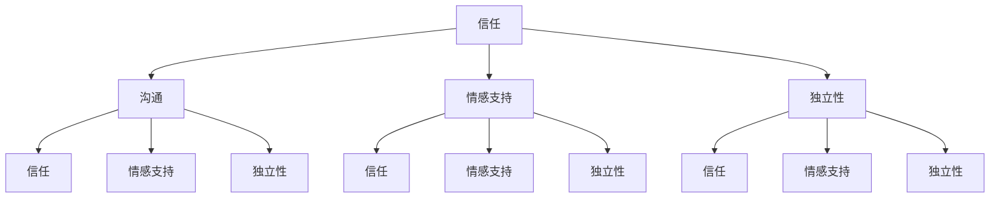
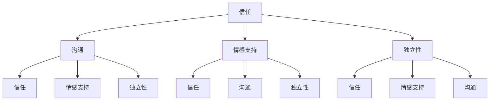

                 

### 第1章：引言与背景

#### 1.1 亲密关系的定义与重要性

亲密关系是指人与人之间在情感、心理和生理上紧密联系的一种关系。在现代社会中，亲密关系不仅包括家庭中的夫妻关系、情侣关系，还涵盖了朋友、同事以及社区成员之间的关系。亲密关系的质量直接影响到个人的心理健康、幸福感和社会适应性。

亲密关系的定义可以从多个角度进行阐述。从心理学角度来看，亲密关系涉及深层次的情感连接、信任、共享和生活决策的协调。从社会学角度来看，亲密关系是社会结构的基础，是建立和维护社会秩序的重要纽带。从生物学角度来看，亲密关系中的情感互动和生理反应能够促进个体的身心健康。

亲密关系的重要性体现在以下几个方面：

1. **心理健康**：健康的亲密关系能够提供情感支持，减少压力和孤独感，提高个体的幸福感和自尊心。
2. **社会支持**：亲密关系为个体提供社会支持网络，有助于应对生活中的困难和挑战。
3. **生活决策**：在亲密关系中，双方能够共同参与决策，提高决策的合理性和效果。
4. **身体健康**：亲密关系中的情感互动能够促进身体健康，如降低心血管疾病风险、提高免疫力。

#### 1.2 现代社会对亲密关系的影响

现代社会正经历着一系列深刻的变化，这些变化对亲密关系产生了广泛而深远的影响。

**社会变革**：随着全球化、城市化进程的加速，人们的生活方式、价值观和社会结构都在发生变化。传统家庭结构逐渐解体，代际关系变得更加复杂，这些变化对亲密关系产生了挑战。

**技术发展**：互联网和移动通信技术的快速发展，改变了人们交流和互动的方式。在线社交网络和即时通讯工具提供了更多的交流渠道，但也带来了信息过载、隐私泄露和情感隔离等问题。

**个人主义与关系复杂性**：现代社会越来越强调个人自由和选择权，这导致人们更加注重自我实现和个人成长，从而影响了亲密关系中的权力分配和角色扮演。此外，个人主义的兴起也使得人们在亲密关系中更加追求平等和自主性，这增加了关系的复杂性。

#### 1.3 本书的目的与结构

本书旨在深入探讨现代社会中亲密关系的本质和重建方法。具体目标如下：

1. **理解亲密关系的核心概念**：通过详细讨论信任、沟通、情感支持和独立性等核心概念，帮助读者理解这些概念在亲密关系中的作用和联系。
2. **分析现代亲密关系中的心理算法原理**：解释情绪识别、决策制定和社交网络等心理算法在亲密关系中的应用，提供案例分析，帮助读者理解这些算法对关系的影响。
3. **构建亲密关系的数学模型**：介绍情感强度计算模型和信任度计算模型，通过数学公式和实例解析，帮助读者理解这些模型在关系管理中的实用性。
4. **提供亲密关系重建的实战案例**：通过实际项目案例，展示亲密关系重建的全过程，包括需求分析、方案设计、实施步骤和效果评估，为读者提供可操作的实践指导。

本书的结构如下：

- **第1章**：引言与背景
- **第2章**：亲密关系的核心概念与联系
- **第3章**：现代亲密关系中的心理算法原理
- **第4章**：亲密关系中的数学模型
- **第5章**：亲密关系重建项目实战
- **第6章**：总结与未来展望

通过本书的阅读，读者将能够获得对亲密关系的深刻理解，掌握重建亲密关系的方法和策略，从而在现代社会中建立和维护更加健康和幸福的亲密关系。

#### 1.3.1 书籍的目的

本书的目的是为读者提供一整套理论框架和实践指导，帮助他们在现代社会中重建和维持健康的亲密关系。具体而言，本书旨在实现以下目标：

1. **提升亲密关系质量**：通过深入探讨亲密关系的核心概念和现代心理算法原理，读者将能够识别和解决亲密关系中的常见问题，提升关系的质量和稳定性。
2. **增强个人幸福感和心理健康**：健康的亲密关系对个人的心理健康和幸福感有着至关重要的影响。本书提供的方法和技巧将帮助读者建立和维持积极的关系，从而提高生活质量和幸福感。
3. **促进社会和谐**：亲密关系是社会的基本单元，健康的亲密关系能够促进家庭和社会的和谐稳定。本书的目标是帮助读者不仅个人受益，同时也为社会和谐做出贡献。
4. **提供实用的实践指导**：本书通过详细的案例分析、数学模型和实战项目，为读者提供了可操作的实践指导。无论是对个人还是专业人士，这些指导都具有实际应用价值。

#### 1.3.2 内容结构概述

本书的内容结构精心设计，旨在系统地引导读者从理论到实践，全面理解亲密关系并掌握重建技巧。以下是本书各章节的具体内容概述：

- **第1章：引言与背景**：介绍亲密关系的定义、重要性以及现代社会对其影响的背景信息，明确书籍的目的和结构。

- **第2章：亲密关系的核心概念与联系**：详细讨论信任、沟通、情感支持和独立性等核心概念，解释这些概念在亲密关系中的作用和相互联系，并提供 Mermaid 流程图。

- **第3章：现代亲密关系中的心理算法原理**：解释情绪识别、决策制定和社交网络等心理算法的基本原理，通过案例分析展示这些算法在实际亲密关系中的应用。

- **第4章：亲密关系中的数学模型**：介绍情感强度计算模型和信任度计算模型，使用数学公式和实例解析帮助读者理解这些模型在关系管理中的实用性。

- **第5章：亲密关系重建项目实战**：通过实际案例展示亲密关系重建的全过程，包括需求分析、方案设计、实施步骤和效果评估，为读者提供实践操作指导。

- **第6章：总结与未来展望**：总结全书的主要观点，探讨亲密关系重建的挑战和机遇，并对未来亲密关系研究进行展望。

通过系统学习本书的内容，读者不仅能够深刻理解亲密关系的本质，还能够掌握有效的重建方法，为个人和社会的和谐发展贡献力量。

#### 第2章：亲密关系的核心概念与联系

亲密关系的质量往往取决于几个核心概念的有效运作，这些概念包括信任、沟通、情感支持和独立性。在本章中，我们将详细探讨这些核心概念的定义、作用及其相互之间的联系。

##### 2.1 信任

信任是亲密关系中的基石，它指的是个体对另一方的可靠性和诚实性的信任程度。信任不仅关乎行为的一致性，还涉及对对方意图的积极预期。

**2.1.1 信任的重要性**

信任在亲密关系中的重要性不可低估。首先，信任能够促进双方的情感连接，减少误解和冲突。其次，信任能够增强关系的稳定性，使双方在面对外部压力和挑战时更加团结一致。最后，信任有助于建立共同的愿景和目标，为双方的合作提供坚实的基础。

**2.1.2 建立信任的策略**

要建立和维护信任，需要采取一系列策略。以下是一些关键策略：

1. **诚实和透明**：保持诚实和透明是建立信任的基本原则。双方应尽可能分享自己的真实感受和想法，避免隐瞒或欺骗。
2. **一致性**：行为的一致性有助于建立信任。个体应尽量避免言行不一，确保自己的行为与承诺相符。
3. **互相尊重**：尊重对方的感受和权利是建立信任的重要因素。双方应学会倾听和接受对方的意见，即使存在分歧，也要尊重对方的立场。
4. **共情和理解**：共情和理解有助于增进双方的情感连接，减少误解和冲突。个体应学会站在对方的角度思考问题，提高同理心。

##### 2.2 沟通

沟通是亲密关系中另一个核心概念，它指的是个体之间交换信息、观点和情感的过程。有效的沟通能够增进理解，减少误解，促进双方的情感连接。

**2.2.1 沟通的类型与层次**

沟通可以分为不同类型和层次，每种类型和层次都有其独特的功能和作用：

1. **情感沟通**：情感沟通涉及表达和分享个人的情感体验，如快乐、愤怒、焦虑等。这种沟通有助于双方建立情感上的连接，增强亲密感。
2. **理性沟通**：理性沟通则侧重于讨论事实、分析和解决问题。这种沟通有助于双方在决策过程中保持冷静和客观，减少冲突。
3. **非语言沟通**：非语言沟通包括肢体语言、面部表情、语调等，这些元素在沟通中起着重要的补充作用。非语言沟通能够传达情感和意图，有时比语言本身更具影响力。
4. **层次性沟通**：沟通可以分为表层沟通、深层沟通和潜意识沟通。表层沟通涉及日常的交流，深层沟通则探讨个人的价值观、信仰和人生目标，而潜意识沟通则是通过象征和隐喻等手段进行沟通。

**2.2.2 高效沟通的技巧**

要实现高效沟通，个体需要掌握以下技巧：

1. **主动倾听**：主动倾听不仅仅是听对方说什么，更重要的是理解对方的情感和意图。这需要个体全身心投入，避免分心。
2. **清晰表达**：清晰表达自己的观点和感受是有效沟通的关键。个体应学会使用简洁明了的语言，避免使用模糊或含糊的表述。
3. **情绪管理**：在沟通中，个体应学会控制自己的情绪，避免情绪失控导致冲突升级。情绪管理技巧如深呼吸、暂时离开等都有助于保持冷静。
4. **反馈与确认**：在沟通过程中，个体应主动给予反馈，确认对方是否理解了自己的意图。这有助于确保沟通的有效性。

##### 2.3 情感支持

情感支持是亲密关系中不可或缺的一部分，它指的是个体在情感上给予对方的支持和关怀。情感支持能够增强个体的安全感，提高关系的满意度。

**2.3.1 情感支持的需求**

每个人都希望得到情感上的支持和理解，这是人类的基本需求之一。在亲密关系中，情感支持的需求尤为强烈，因为双方共同承担了生活中的喜怒哀乐。以下是情感支持的一些关键需求：

1. **倾听和关注**：在对方需要倾诉时，给予关注和倾听是表达情感支持的重要方式。这有助于对方释放压力，减轻心理负担。
2. **理解和共情**：理解对方的感受并给予共情是情感支持的核心。个体应学会站在对方的角度思考问题，提供情感上的支持。
3. **鼓励和支持**：在对方遇到困难和挑战时，给予鼓励和支持是增强关系稳定性的重要手段。这有助于对方保持积极态度，克服困难。

**2.3.2 提供情感支持的方法**

要有效地提供情感支持，个体可以采取以下方法：

1. **主动关心**：主动关心对方的生活和情感状态，通过日常的问候和关心表达自己的关怀。
2. **倾听和反馈**：倾听对方的诉说，并给予积极的反馈，让对方感受到自己的理解和支持。
3. **共同参与**：与对方共同参与活动，分享快乐和压力，增强情感上的连接。
4. **表达感激**：表达对对方的感激之情，让对方知道自己的付出和关怀是被珍视的。

##### 2.4 独立性

独立性是亲密关系中一个重要的平衡因素，它指的是个体在情感和经济上的自主性。适当的独立性能够增强个体的自我价值感和自主决策能力，有助于建立健康的亲密关系。

**2.4.1 独立性的意义**

独立性在亲密关系中的意义体现在以下几个方面：

1. **个人成长**：独立性有助于个体实现自我价值和成长。在独立性的支持下，个体可以追求自己的兴趣和职业发展，增强自我认同感。
2. **关系稳定性**：独立性有助于减少依赖性，降低关系中的紧张和冲突。独立的个体能够更好地处理关系中的问题，增强关系的稳定性。
3. **情感健康**：独立性有助于个体保持情感健康，减少情感依赖和过度投入，避免关系中的情感耗竭。

**2.4.2 独立性与亲密关系的平衡**

要在亲密关系中实现独立性与依赖性的平衡，个体需要采取以下措施：

1. **尊重对方**：尊重对方的独立性和个人空间是建立平衡关系的基础。双方应避免过度干涉对方的生活和决策，保持个人的自主权。
2. **共同目标**：共同目标是维护亲密关系的重要纽带。双方应在追求个人独立性的同时，共同制定和追求关系中的目标，确保关系的一致性和稳定性。
3. **有效沟通**：通过有效沟通，双方可以明确各自的独立性和依赖性需求，找到平衡点。沟通有助于解决冲突，增强关系的透明度和信任感。

##### 2.5 核心概念之间的关系架构

为了更好地理解亲密关系中的核心概念及其相互联系，我们可以使用 Mermaid 流程图来展示这些概念之间的关系：

通过上述 Mermaid 流程图，我们可以清晰地看到信任、沟通、情感支持和独立性之间的相互关联。这些核心概念共同作用，形成一个动态的、相互影响的系统，维护和促进亲密关系的健康发展。

综上所述，亲密关系的核心概念是信任、沟通、情感支持和独立性。理解这些概念及其相互联系，对于建立和维护健康的亲密关系至关重要。通过有效应用这些概念，个体可以更好地应对现代社会的挑战，实现个人和关系的和谐发展。

#### 2.1 信任

信任是亲密关系中的核心概念，它指的是个体对另一方的可靠性和诚实性的信任程度。信任不仅关乎行为的一致性，还涉及对对方意图的积极预期。在亲密关系中，信任是双方情感连接的基础，也是关系稳定性的关键因素。

**2.1.1 信任的重要性**

信任在亲密关系中的重要性不可低估。以下是信任在亲密关系中发挥的几个关键作用：

1. **情感连接**：信任能够促进双方的情感连接。当个体信任对方时，他们更愿意分享内心的感受和想法，这有助于建立深层次的情感纽带。
2. **减少冲突**：信任能够减少误解和冲突。当双方信任对方时，他们更容易理解对方的言行，避免因误解而产生的争执。
3. **增强稳定性**：信任能够增强关系的稳定性。在信任的基础上，双方在面对外部压力和挑战时，更能够保持团结一致，共同应对困难。
4. **共同决策**：信任是共同决策的基础。当双方信任对方时，他们更愿意在决策过程中进行合作，共同制定和执行计划。

**2.1.2 建立信任的策略**

要建立和维护信任，个体需要采取一系列策略。以下是一些关键策略：

1. **诚实和透明**：诚实和透明是建立信任的基本原则。个体应尽可能分享自己的真实感受和想法，避免隐瞒或欺骗。这有助于建立双方之间的信任基础。
   
2. **一致性**：行为的一致性有助于建立信任。个体应尽量避免言行不一，确保自己的行为与承诺相符。一致性能够增强对方的信任感。

3. **互相尊重**：尊重对方的感受和权利是建立信任的重要因素。个体应学会倾听和接受对方的意见，即使存在分歧，也要尊重对方的立场。尊重能够增强双方的情感连接。

4. **共情和理解**：共情和理解有助于增进双方的情感连接，减少误解和冲突。个体应学会站在对方的角度思考问题，提高同理心。共情和理解能够增强双方的信任。

5. **承诺和可靠性**：承诺和可靠性是建立信任的重要保障。个体应在承诺的基础上，履行自己的责任和义务，确保对方的信任不被辜负。

6. **及时沟通**：及时沟通是维护信任的重要手段。个体应在出现问题时，及时与对方沟通，解决误解和冲突。及时沟通有助于避免问题的积累，保持关系的稳定性。

**2.1.3 案例分析**

以下是一个关于建立信任的案例分析：

假设小明和小红是一对情侣，他们决定共同购买一辆新车。在购车过程中，小明发现小红之前在朋友圈里晒过一辆豪华车的照片，而他们计划购买的车型相对较低端。小明产生了怀疑，担心小红在隐瞒购车预算。

为了建立信任，小明决定与小红进行坦诚沟通。他首先表达了自己的担忧，询问小红是否在隐瞒购车预算。小红听到后，感到有些意外，但并没有生气。她解释说，她之所以晒豪华车的照片，是因为那是她朋友的车，并非自己的。她表示，她对购车预算非常透明，并且愿意与小明一起商量购车方案。

通过这次沟通，小明和小红的信任关系得到了加强。他们一起制定了购车计划，最终选择了他们共同满意的车型。这次经历不仅增强了他们的信任，也加深了他们的情感连接。

综上所述，信任是亲密关系的核心概念，建立和维护信任需要个体采取一系列策略。诚实、透明、一致性、互相尊重、共情和理解、承诺和可靠性、及时沟通等策略都是建立信任的关键。通过有效应用这些策略，个体可以建立和维护健康稳定的亲密关系。

#### 2.2 沟通

沟通是亲密关系中不可或缺的一部分，它指的是个体之间交换信息、观点和情感的过程。有效的沟通能够增进理解，减少误解，促进双方的情感连接。在亲密关系中，沟通不仅关乎信息的传递，更关乎情感的表达和需求的满足。

**2.2.1 沟通的类型与层次**

沟通可以分为不同类型和层次，每种类型和层次都有其独特的功能和作用：

1. **情感沟通**：情感沟通涉及表达和分享个人的情感体验，如快乐、愤怒、焦虑等。这种沟通有助于双方建立情感上的连接，增强亲密感。情感沟通通常发生在双方情感紧密的情况下，如恋爱关系、家庭关系等。

2. **理性沟通**：理性沟通则侧重于讨论事实、分析和解决问题。这种沟通有助于双方在决策过程中保持冷静和客观，减少冲突。理性沟通通常发生在双方需要共同解决具体问题的情况下，如工作合作、商业谈判等。

3. **非语言沟通**：非语言沟通包括肢体语言、面部表情、语调等，这些元素在沟通中起着重要的补充作用。非语言沟通能够传达情感和意图，有时比语言本身更具影响力。例如，一个微笑可以传达友好和信任，而一个皱眉则可能表达不满和抗拒。

4. **层次性沟通**：沟通可以分为表层沟通、深层沟通和潜意识沟通。表层沟通涉及日常的交流，如问候、闲聊等；深层沟通则探讨个人的价值观、信仰和人生目标，如分享生活感悟、讨论未来的规划等；潜意识沟通则是通过象征和隐喻等手段进行沟通，如通过梦境、艺术作品等表达深层次的情感和想法。

**2.2.2 高效沟通的技巧**

要实现高效沟通，个体需要掌握以下技巧：

1. **主动倾听**：主动倾听不仅仅是听对方说什么，更重要的是理解对方的情感和意图。这需要个体全身心投入，避免分心。有效的倾听技巧包括保持眼神接触、给予适当的肢体语言反馈、避免打断对方等。

2. **清晰表达**：清晰表达自己的观点和感受是有效沟通的关键。个体应学会使用简洁明了的语言，避免使用模糊或含糊的表述。在表达观点时，应尽可能具体和明确，避免产生误解。

3. **情绪管理**：在沟通中，个体应学会控制自己的情绪，避免情绪失控导致冲突升级。情绪管理技巧如深呼吸、暂时离开等都有助于保持冷静。有效的情绪管理有助于建立和谐的沟通氛围。

4. **反馈与确认**：在沟通过程中，个体应主动给予反馈，确认对方是否理解了自己的意图。这有助于确保沟通的有效性。给予反馈时，应尽量采用积极的语言，避免指责和批评。

5. **开放性问题**：使用开放性问题可以鼓励对方分享更多信息，促进深入沟通。开放性问题通常以“怎样”、“为什么”、“你认为”等开头，能够引导对方思考并表达自己的观点。

6. **情境适应**：不同的情境需要不同的沟通策略。个体应根据具体情境调整自己的沟通方式，如在紧张的会议中保持简洁明了，在亲密关系中注重情感表达。

**2.2.3 案例分析**

以下是一个关于高效沟通的案例分析：

小明和小红是一对情侣，他们计划一起规划未来的生活。为了实现这一目标，他们决定进行一次深入的沟通。

首先，小明和小红确定了沟通的目标，即共同制定未来的生活规划。然后，他们选择了一个安静舒适的环境，确保沟通过程中不会受到干扰。

在沟通过程中，小明首先表达了自己的想法，包括他希望在未来几年内购买一套房子、开始自己的事业等。小红在倾听后，分享了自己的观点，包括她希望在未来能够继续深造、拥有更多的自由时间等。

为了确保沟通的有效性，小明和小红都使用了开放性问题，如“你认为我们如何才能实现这些目标？”、“你对未来的生活有什么具体的期望？”等。他们还主动给予反馈，确保对方理解了自己的意图。

通过这次深入沟通，小明和小红不仅明确了自己的目标，还找到了实现这些目标的具体方法。这次沟通不仅增强了他们的情感连接，也为未来的生活规划提供了清晰的指导。

综上所述，沟通是亲密关系中的重要组成部分，有效的沟通技巧能够增进理解、减少误解，促进双方的情感连接。通过主动倾听、清晰表达、情绪管理、反馈与确认、开放性问题和情境适应等技巧，个体可以提升沟通效果，建立和维护健康的亲密关系。

#### 2.3 情感支持

情感支持是亲密关系中不可或缺的一部分，它指的是个体在情感上给予对方的支持和关怀。情感支持能够增强个体的安全感，提高关系的满意度。在亲密关系中，情感支持不仅关乎个体的心理需求，还涉及双方的互动和沟通。

**2.3.1 情感支持的需求**

每个人都需要情感支持，这是人类的基本需求之一。在亲密关系中，情感支持的需求尤为强烈，因为双方共同承担了生活中的喜怒哀乐。以下是情感支持的一些关键需求：

1. **倾听和关注**：在对方需要倾诉时，给予关注和倾听是表达情感支持的重要方式。这有助于对方释放压力，减轻心理负担。倾听不仅仅是听对方说什么，更重要的是理解对方的情感和意图。

2. **理解和共情**：理解对方的感受并给予共情是情感支持的核心。个体应学会站在对方的角度思考问题，提供情感上的支持。共情能够增强双方的情感连接，减少误解和冲突。

3. **鼓励和支持**：在对方遇到困难和挑战时，给予鼓励和支持是增强关系稳定性的重要手段。这有助于对方保持积极态度，克服困难。鼓励和支持不仅能够增强对方的自信心，还能够促进双方的情感依赖。

4. **陪伴和时间**：情感支持也需要陪伴和时间的投入。在日常生活中，个体应尽量安排时间与对方共度，分享生活中的点滴。陪伴和时间的投入能够增强情感上的连接，提升关系的满意度。

**2.3.2 提供情感支持的方法**

要有效地提供情感支持，个体可以采取以下方法：

1. **主动关心**：主动关心对方的生活和情感状态，通过日常的问候和关心表达自己的关怀。这可以是通过电话、短信、社交媒体等方式进行的。

2. **倾听和反馈**：倾听对方的诉说，并给予积极的反馈，让对方感受到自己的理解和支持。在倾听时，应避免打断对方，全身心投入，表现出真诚的关注。

3. **共同参与**：与对方共同参与活动，分享快乐和压力，增强情感上的连接。这可以包括一起做家务、看电影、旅行等。

4. **表达感激**：表达对对方的感激之情，让对方知道自己的付出和关怀是被珍视的。这可以通过日常的问候、特别的惊喜或感谢信等方式进行。

5. **支持性语言**：使用支持性的语言，如“我在你身边”、“我相信你能行”、“你做得很好”等，能够增强对方的自信心和积极性。

**2.3.3 案例分析**

以下是一个关于提供情感支持的案例分析：

小明在工作中遇到了一些困难，感到非常沮丧。他的女朋友小红得知后，决定给予他情感支持。

首先，小红主动与小明进行沟通，询问他的具体情况和感受。小明在倾诉过程中，小红认真倾听，并给予积极的反馈，让小明感受到自己的理解和关心。

接着，小红与小明共同制定了一些解决问题的策略，鼓励他采取积极的行动。她告诉小明：“我相信你能行，无论遇到什么困难，我都会在你身边支持你。”

此外，小红还安排了一些活动，如看电影、散步等，与小明共度时光，帮助他放松心情。她还鼓励小明参加一些兴趣小组，结交新朋友，拓宽社交圈子。

通过这些方法，小红有效地提供了情感支持，帮助小明度过了困难时期。小明的情绪逐渐好转，他们的关系也因此更加紧密。

综上所述，情感支持是亲密关系中的重要组成部分，满足情感支持的需求对于维护关系的稳定和幸福感至关重要。通过主动关心、倾听和反馈、共同参与、表达感激和支持性语言等方法，个体可以有效地提供情感支持，促进亲密关系的健康发展。

#### 2.4 独立性

独立性是亲密关系中一个重要的平衡因素，它指的是个体在情感和经济上的自主性。适当的独立性能够增强个体的自我价值感和自主决策能力，有助于建立健康的亲密关系。

**2.4.1 独立性的意义**

独立性在亲密关系中的意义体现在以下几个方面：

1. **个人成长**：独立性有助于个体实现自我价值和成长。在独立性的支持下，个体可以追求自己的兴趣和职业发展，增强自我认同感。独立性使个体能够独立思考和决策，从而提升自我效能感和自信心。

2. **关系稳定性**：独立性有助于减少依赖性，降低关系中的紧张和冲突。独立的个体能够更好地处理关系中的问题，增强关系的稳定性。独立性使个体在面对外部压力和挑战时，更加自主和独立，从而减轻对对方的依赖。

3. **情感健康**：独立性有助于个体保持情感健康，减少情感依赖和过度投入，避免关系中的情感耗竭。独立性使个体能够在亲密关系中保持自我，避免因为过度依赖对方而失去自我。

**2.4.2 独立性与亲密关系的平衡**

要在亲密关系中实现独立性与依赖性的平衡，个体需要采取以下措施：

1. **尊重对方**：尊重对方的独立性和个人空间是建立平衡关系的基础。双方应避免过度干涉对方的生活和决策，保持个人的自主权。尊重对方的独立性不仅能够增强关系的稳定性，还能够促进双方的共同成长。

2. **共同目标**：共同目标是维护亲密关系的重要纽带。双方应在追求个人独立性的同时，共同制定和追求关系中的目标，确保关系的一致性和稳定性。共同目标有助于双方在追求个人独立性的同时，保持对关系的投入和关注。

3. **有效沟通**：通过有效沟通，双方可以明确各自的独立性和依赖性需求，找到平衡点。沟通有助于解决冲突，增强关系的透明度和信任感。有效的沟通可以包括坦诚分享自己的想法和需求，倾听对方的意见和感受，共同寻找解决问题的方法。

4. **支持对方**：在亲密关系中，双方应相互支持对方的独立性。这可以通过鼓励对方追求个人兴趣和职业发展，帮助对方实现个人目标来实现。相互支持不仅能够增强双方的信任，还能够促进个人的成长和关系的稳定性。

5. **个人成长与关系发展的平衡**：个体应在追求个人独立性的同时，关注关系的发展。这可以通过定期进行关系评估，讨论和解决关系中的问题来实现。个人成长与关系发展的平衡有助于保持双方的满意度和关系的稳定性。

**2.4.3 案例分析**

以下是一个关于独立性与亲密关系平衡的案例分析：

小明和小红是一对情侣，他们都非常重视独立性。小明是一名自由职业者，经常需要出差和独自工作。小红则是一名全职工作者，她在工作中也非常努力，追求自己的职业发展。

在他们的关系中，小明和小红都尊重对方的独立性。小明在出差期间，会定期给小红发消息，分享自己的工作和生活情况。小红也会在周末时，给小明准备一些小惊喜，如一封手写信或一杯热咖啡。

他们通过有效沟通，明确了各自的独立性和依赖性需求。小明需要更多的时间和空间来工作，而小红希望他们能够共度更多的时光。他们共同制定了计划，确保在追求个人独立性的同时，也保持对关系的投入。

例如，他们每周会安排一次约会，共同度过一个晚上。此外，他们还会一起参加一些兴趣小组，分享彼此的兴趣和爱好。这些活动不仅丰富了他们的生活，也增强了他们之间的情感连接。

通过尊重对方、共同目标、有效沟通和支持对方，小明和小红在亲密关系中实现了独立性与依赖性的平衡。他们的关系不仅稳定，而且充满了相互尊重和信任。

综上所述，独立性是亲密关系中一个重要的平衡因素。通过尊重对方、共同目标、有效沟通和支持对方，个体可以在亲密关系中实现独立性与依赖性的平衡，从而建立健康稳定的关系。

#### 2.5 核心概念之间的关系架构

为了更好地理解亲密关系中的核心概念及其相互联系，我们可以使用 Mermaid 流程图来展示这些概念之间的关系。以下是信任、沟通、情感支持和独立性之间的 Mermaid 流程图：

在这个 Mermaid 流程图中，我们可以看到：

- **信任**是所有核心概念的根基，它与**沟通**、**情感支持**和**独立性**紧密相连。信任是沟通的基础，没有信任，沟通将变得困难；信任也是情感支持的核心，情感支持依赖于信任的建立；信任同样也是独立性得以维持的重要因素，独立的个体也需要信任对方的决策和行动。

- **沟通**不仅加强了信任，也促进了情感支持和独立性。有效的沟通能够增强信任，使双方更加理解和信任对方；沟通还能够促进情感支持，通过交流和理解，双方能够更好地满足彼此的情感需求；沟通也是实现独立性的重要途径，通过沟通，双方能够明确各自的独立性和依赖性需求，找到平衡点。

- **情感支持**依赖于信任和沟通，它是建立和维护亲密关系的关键因素。信任和沟通为情感支持提供了基础，使双方能够理解和满足彼此的情感需求；情感支持反过来也加强了信任和沟通，通过相互支持和理解，双方能够更好地建立和维护亲密关系。

- **独立性**在亲密关系中起着重要的平衡作用。独立的个体能够更好地处理关系中的问题，减少依赖性，增强关系的稳定性。独立性的实现依赖于信任和沟通，通过信任，个体能够相信对方的决策和行动；通过沟通，个体能够明确各自的独立性和依赖性需求，找到平衡点。

通过这个 Mermaid 流程图，我们可以清晰地看到亲密关系中的核心概念及其相互之间的联系。这些概念共同作用，形成一个动态的、相互影响的系统，维护和促进亲密关系的健康发展。

### 第3章：现代亲密关系中的心理算法原理

在现代社会中，亲密关系的复杂性不断增加，这使得理解人类心理和行为变得至关重要。心理算法原理是解释这些复杂性的关键工具。本章将详细探讨现代亲密关系中的几个关键心理算法原理，包括情绪识别算法、决策制定算法和社交网络算法。

#### 3.1 情绪识别算法

情绪识别算法是一种利用心理学和计算模型来理解和识别人类情绪的技术。这些算法通过分析情绪表达的外部信号，如面部表情、声音和肢体语言，来推断个体的情绪状态。

**3.1.1 情绪识别的基本原理**

情绪识别算法的基本原理可以概括为以下几个步骤：

1. **数据采集**：通过摄像头、麦克风等设备收集个体的面部表情、声音和肢体语言等数据。
2. **特征提取**：从采集到的数据中提取特征，如面部肌肉运动、声音频率和音调等。
3. **模型训练**：使用机器学习算法，如神经网络和决策树，对提取的特征进行训练，以识别不同的情绪状态。
4. **情绪识别**：将训练好的模型应用于实时数据，识别个体的情绪状态。

**3.1.2 情绪识别在亲密关系中的应用**

情绪识别算法在亲密关系中的应用非常广泛：

1. **情感反馈**：通过识别对方的情绪，个体可以更好地理解对方的心理状态，从而提供更有效的情感反馈和支持。
2. **冲突解决**：了解对方的情绪状态有助于个体在冲突发生时采取适当的策略，减少情绪激化，促进和平解决。
3. **情感调节**：个体可以通过情绪识别算法自我监控和调节情绪，从而更好地管理情绪波动，增强关系的稳定性。

**3.1.3 情绪识别案例分析**

以下是一个情绪识别算法在亲密关系中的实际案例：

假设小明和小红是一对情侣。有一天，小红情绪低落，小明通过情绪识别算法分析了小红的语音和面部表情，发现她处于沮丧情绪。小明据此推断小红可能遇到了一些困难或压力，于是主动询问小红的情况。小红向小明倾诉了自己的烦恼，小明给予了理解和支持，最终帮助小红缓解了情绪。

通过情绪识别算法，小明能够更准确地识别小红的情绪状态，提供更有针对性的情感支持，从而增强了他们之间的亲密关系。

#### 3.2 决策制定算法

决策制定算法是一种用于帮助个体在复杂情境中做出合理决策的技术。在亲密关系中，这些算法可以帮助双方共同应对生活中的挑战和机遇。

**3.2.1 决策制定的基本原理**

决策制定算法的基本原理包括以下几个步骤：

1. **问题定义**：明确需要解决的问题或目标。
2. **信息收集**：收集与问题相关的信息，如选项、成本、风险等。
3. **方案评估**：使用评估准则，如收益、风险和可行性等，对每个方案进行评估。
4. **决策制定**：选择最优方案，并制定执行计划。

**3.2.2 决策制定在亲密关系中的应用**

决策制定算法在亲密关系中的应用主要体现在以下几个方面：

1. **共同决策**：通过决策制定算法，双方可以共同分析问题和评估方案，减少主观偏见，提高决策的质量和效果。
2. **冲突缓解**：在决策过程中，双方可以更好地理解彼此的观点和需求，从而减少冲突和分歧。
3. **关系管理**：决策制定算法有助于个体更好地管理关系中的资源分配和权力平衡，从而增强关系的稳定性。

**3.2.3 决策制定案例分析**

以下是一个决策制定算法在亲密关系中的实际案例：

假设小明和小红计划购买一套新房。他们通过决策制定算法，首先明确了购房的目标和预算。然后，他们收集了多个潜在房源的信息，并使用评估准则对每个房源进行了评估。最终，他们选择了性价比最高的房源，并制定了详细的购房计划。

通过决策制定算法，小明和小红能够更理性地分析购房问题，减少了冲突和误解，从而顺利完成了购房过程，增强了他们之间的合作关系。

#### 3.3 社交网络算法

社交网络算法是一种用于分析社交网络结构和行为的计算模型。在亲密关系中，这些算法可以帮助个体更好地理解自己的社交网络，以及如何维护和增强关系。

**3.3.1 社交网络的基本原理**

社交网络算法的基本原理包括以下几个方面：

1. **网络构建**：通过收集个体的社交数据，构建社交网络图。网络图中的节点代表个体，边代表个体之间的关系。
2. **网络分析**：使用图论和网络分析技术，对社交网络进行结构分析，如中心性、密度、聚类系数等。
3. **行为预测**：基于社交网络结构，预测个体的行为和关系动态。

**3.3.2 社交网络在亲密关系中的应用**

社交网络算法在亲密关系中的应用主要体现在以下几个方面：

1. **关系分析**：通过分析社交网络结构，个体可以更好地了解自己在社交网络中的位置和影响力，从而调整自己的社交策略。
2. **关系维护**：了解社交网络中的关键节点和关系，有助于个体更好地维护和增强重要关系。
3. **关系拓展**：通过社交网络算法，个体可以识别潜在的社交机会，拓展自己的社交圈。

**3.3.3 社交网络案例分析**

以下是一个社交网络算法在亲密关系中的实际案例：

假设小明和小红想要拓展自己的社交圈，增强与朋友和家人的联系。他们通过社交网络算法，分析了自己现有的社交网络结构，识别出了关键节点和重要关系。然后，他们根据分析结果，制定了社交计划，如参加朋友聚会、家庭聚会等，积极参与社交活动，从而增强了与朋友和家人的关系。

通过社交网络算法，小明和小红能够更有效地管理自己的社交网络，维护和增强亲密关系。

综上所述，情绪识别算法、决策制定算法和社交网络算法在现代亲密关系中发挥着重要作用。这些心理算法原理不仅帮助个体更好地理解和处理情感，还支持他们在复杂情境中做出合理决策，增强关系维护和拓展能力。通过实际案例的应用，我们可以看到这些算法在提升亲密关系质量和稳定性方面的实际效果。

### 3.1 情绪识别算法

情绪识别算法是一种利用心理学和计算模型来理解和识别人类情绪的技术。在亲密关系中，情绪识别算法的应用可以极大地提升双方的情感连接和理解，从而增强关系的稳定性。

**3.1.1 情绪识别的基本原理**

情绪识别算法的基本原理可以概括为以下几个步骤：

1. **数据采集**：首先，通过摄像头、麦克风等设备收集个体的面部表情、声音和肢体语言等数据。这些数据是情绪识别的基础，能够提供情绪表达的外部信号。

2. **特征提取**：从采集到的数据中提取特征。面部表情的识别可能涉及面部肌肉的运动、眼睛的睁闭程度、嘴巴的张合等；声音识别则关注音调、频率和音量等变化；肢体语言的识别包括姿势、手势、身体位置等。

3. **模型训练**：使用机器学习算法，如神经网络和决策树，对提取的特征进行训练，以识别不同的情绪状态。训练过程中，算法通过大量的情绪数据学习情绪表达的规律，从而提高识别的准确性。

4. **情绪识别**：将训练好的模型应用于实时数据，识别个体的情绪状态。例如，在一段对话中，算法可以实时分析语音和面部表情，推断出个体的情绪是否愉快、紧张或沮丧。

**3.1.2 情绪识别在亲密关系中的应用**

情绪识别算法在亲密关系中的应用非常广泛：

1. **情感反馈**：通过识别对方的情绪，个体可以更好地理解对方的心理状态，从而提供更有效的情感反馈和支持。例如，当伴侣表达出不满的情绪时，另一方可以及时识别并采取适当的行动，如道歉或提供安慰。

2. **冲突解决**：了解对方的情绪状态有助于个体在冲突发生时采取适当的策略，减少情绪激化，促进和平解决。通过情绪识别，个体可以识别出情绪的触发点和冲突的根源，从而更有针对性地解决冲突。

3. **情感调节**：个体可以通过情绪识别算法自我监控和调节情绪，从而更好地管理情绪波动，增强关系的稳定性。例如，当感到焦虑或沮丧时，个体可以通过识别自己的情绪状态，采取放松技巧或寻求专业帮助来调节情绪。

**3.1.3 情绪识别案例分析**

以下是一个情绪识别算法在亲密关系中的实际案例：

假设小明和小红是一对情侣。小明在工作上遇到了一些困难，感到压力很大。在一次与小红共度的夜晚，小明无意识地表现出了紧张和焦虑的情绪。小红通过情绪识别算法，分析了小明的面部表情和声音，发现他处于焦虑状态。

小红意识到小明的压力，主动与他沟通，询问他是否需要帮助。小明在倾诉过程中，表达了自己的担忧和压力，小红提供了情感支持和建议。通过这次沟通，小明感到情绪得到了缓解，他们的关系也因此更加稳固。

通过情绪识别算法，小红能够更准确地识别小明的情绪状态，提供有针对性的情感支持，从而增强了他们之间的亲密关系。

综上所述，情绪识别算法在亲密关系中的应用具有重要的实践价值。通过情绪识别，个体可以更好地理解和支持对方，有效解决冲突，调节情绪，从而提升关系的质量和稳定性。情绪识别算法不仅为亲密关系提供了技术支持，也为人类情感管理提供了新的视角和方法。

#### 3.2 决策制定算法

决策制定算法是帮助个体在复杂情境中做出合理决策的计算模型。在亲密关系中，这些算法有助于双方共同分析问题、评估方案，并做出最佳决策，从而增强关系的稳定性和满意度。

**3.2.1 决策制定的基本原理**

决策制定算法的基本原理可以概括为以下几个步骤：

1. **问题定义**：明确需要解决的问题或目标。在亲密关系中，这可能包括共同规划未来生活、购买房屋、教育投资等。

2. **信息收集**：收集与问题相关的信息，如选项、成本、风险、收益等。信息的全面性和准确性对决策的质量至关重要。

3. **方案评估**：使用评估准则，如收益最大化、风险最小化、可行性等，对每个方案进行评估。评估准则可以是定量的，如财务分析；也可以是定性的，如个人价值观和偏好。

4. **决策制定**：选择最优方案，并制定执行计划。决策制定过程中，个体需要考虑各种可能的结果，并权衡利弊，做出最佳选择。

**3.2.2 决策制定在亲密关系中的应用**

决策制定算法在亲密关系中的应用主要体现在以下几个方面：

1. **共同决策**：通过决策制定算法，双方可以共同分析问题和评估方案，减少主观偏见，提高决策的质量和效果。例如，在购房过程中，双方可以共同制定预算、评估楼盘和进行财务分析，从而做出更明智的决策。

2. **冲突缓解**：在决策过程中，双方可以更好地理解彼此的观点和需求，从而减少冲突和误解。例如，当一方坚持某种方案，而另一方持不同意见时，通过评估和讨论，双方可以找到共同点，达成共识。

3. **关系管理**：决策制定算法有助于个体更好地管理关系中的资源分配和权力平衡，从而增强关系的稳定性。例如，通过共同制定家庭预算和规划，双方可以明确各自的职责和贡献，减少关系中的紧张和矛盾。

**3.2.3 决策制定案例分析**

以下是一个决策制定算法在亲密关系中的实际案例：

假设小明和小红计划结婚并共同购买一套新房。他们首先明确了购房的目标和预算。然后，他们通过收集多个潜在房源的信息，并使用评估准则对每个房源进行了评估，包括地理位置、价格、户型、配套设施等。

在评估过程中，小明和小红共同讨论了每个房源的优缺点，并权衡了各种因素。最终，他们选择了性价比最高的房源，并制定了详细的购房计划。通过这个决策过程，小明和小红不仅减少了冲突和分歧，还增强了彼此之间的信任和合作。

综上所述，决策制定算法在亲密关系中的应用有助于双方共同分析问题、评估方案，并做出最佳决策，从而提升关系的质量和稳定性。通过实际案例的应用，我们可以看到决策制定算法在提升亲密关系管理能力方面的实际效果。

#### 3.3 社交网络算法

社交网络算法是一种用于分析社交网络结构和行为的计算模型。在亲密关系中，社交网络算法可以帮助个体更好地理解自己的社交网络，识别关键关系节点，从而优化社交策略，增强关系质量。

**3.3.1 社交网络的基本原理**

社交网络算法的基本原理包括以下几个步骤：

1. **网络构建**：通过收集个体的社交数据，构建社交网络图。网络图中的节点代表个体，边代表个体之间的关系。例如，在一个社交网络中，小明可能是节点，他和小红之间的友谊可能是一条边。

2. **网络分析**：使用图论和网络分析技术，对社交网络进行结构分析。常见的分析指标包括中心性、密度、聚类系数等。中心性指标衡量个体在社交网络中的影响力，如度中心性和介数中心性；密度衡量网络中连接的紧密程度；聚类系数衡量个体与其邻居的连接紧密程度。

3. **行为预测**：基于社交网络结构，预测个体的行为和关系动态。例如，通过分析个体的社交网络，可以预测他们在未来的社交行为，如加入新的社交团体或与某些人疏远。

**3.3.2 社交网络在亲密关系中的应用**

社交网络算法在亲密关系中的应用主要体现在以下几个方面：

1. **关系分析**：通过分析社交网络结构，个体可以更好地了解自己在社交网络中的位置和影响力，从而调整自己的社交策略。例如，个体可以通过社交网络算法识别出对自己关系有重要影响的关键节点，加强对这些节点的维护。

2. **关系维护**：了解社交网络中的关键节点和关系，有助于个体更好地维护和增强重要关系。例如，通过社交网络算法，个体可以识别出对关系稳定性有重要贡献的亲密朋友或家人，并主动维护这些关系。

3. **关系拓展**：通过社交网络算法，个体可以识别潜在的社交机会，拓展自己的社交圈。例如，通过分析社交网络中的连接模式和互动频率，个体可以识别出潜在的社交伙伴，从而增加新的社交机会。

**3.3.3 社交网络案例分析**

以下是一个社交网络算法在亲密关系中的实际案例：

假设小明和小红想要拓展自己的社交圈，增强与朋友和家人的联系。他们通过社交网络算法，分析了自己现有的社交网络结构，识别出了关键节点和重要关系。例如，小明发现他的好友小李在社交网络中的位置非常重要，是连接小明和小红社交圈的重要纽带。

基于这一发现，小明和小红决定邀请小李参加一个共同的社交活动。在活动中，他们与小李进行了深入的交流和互动，这不仅增强了他们之间的联系，还拓展了小明的社交圈。通过社交网络算法，小明和小红能够更有效地管理自己的社交网络，优化社交策略，从而增强亲密关系。

综上所述，社交网络算法在亲密关系中的应用有助于个体更好地理解和管理自己的社交网络，优化社交策略，增强关系质量。通过实际案例的应用，我们可以看到社交网络算法在提升亲密关系管理能力方面的实际效果。

### 3.1 情绪识别算法

情绪识别算法是一种利用心理学和计算模型来理解和识别人类情绪的技术。在亲密关系中，情绪识别算法的应用可以极大地提升双方的情感连接和理解，从而增强关系的稳定性。

**3.1.1 情绪识别的基本原理**

情绪识别算法的基本原理可以概括为以下几个步骤：

1. **数据采集**：首先，通过摄像头、麦克风等设备收集个体的面部表情、声音和肢体语言等数据。这些数据是情绪识别的基础，能够提供情绪表达的外部信号。

2. **特征提取**：从采集到的数据中提取特征。面部表情的识别可能涉及面部肌肉的运动、眼睛的睁闭程度、嘴巴的张合等；声音识别则关注音调、频率和音量等变化；肢体语言的识别包括姿势、手势、身体位置等。

3. **模型训练**：使用机器学习算法，如神经网络和决策树，对提取的特征进行训练，以识别不同的情绪状态。训练过程中，算法通过大量的情绪数据学习情绪表达的规律，从而提高识别的准确性。

4. **情绪识别**：将训练好的模型应用于实时数据，识别个体的情绪状态。例如，在一段对话中，算法可以实时分析语音和面部表情，推断出个体的情绪是否愉快、紧张或沮丧。

**3.1.2 情绪识别在亲密关系中的应用**

情绪识别算法在亲密关系中的应用非常广泛：

1. **情感反馈**：通过识别对方的情绪，个体可以更好地理解对方的心理状态，从而提供更有效的情感反馈和支持。例如，当伴侣表达出不满的情绪时，另一方可以及时识别并采取适当的行动，如道歉或提供安慰。

2. **冲突解决**：了解对方的情绪状态有助于个体在冲突发生时采取适当的策略，减少情绪激化，促进和平解决。通过情绪识别，个体可以识别出情绪的触发点和冲突的根源，从而更有针对性地解决冲突。

3. **情感调节**：个体可以通过情绪识别算法自我监控和调节情绪，从而更好地管理情绪波动，增强关系的稳定性。例如，当感到焦虑或沮丧时，个体可以通过识别自己的情绪状态，采取放松技巧或寻求专业帮助来调节情绪。

**3.1.3 情绪识别案例分析**

以下是一个情绪识别算法在亲密关系中的实际案例：

假设小明和小红是一对情侣。小明在工作上遇到了一些困难，感到压力很大。在一次与小红共度的夜晚，小明无意识地表现出了紧张和焦虑的情绪。小红通过情绪识别算法，分析了小明的面部表情和声音，发现他处于焦虑状态。

小红意识到小明的压力，主动与他沟通，询问他是否需要帮助。小明在倾诉过程中，表达了自己的担忧和压力，小红提供了情感支持和建议。通过这次沟通，小明感到情绪得到了缓解，他们的关系也因此更加稳固。

通过情绪识别算法，小红能够更准确地识别小明的情绪状态，提供有针对性的情感支持，从而增强了他们之间的亲密关系。

综上所述，情绪识别算法在亲密关系中的应用具有重要的实践价值。通过情绪识别，个体可以更好地理解和支持对方，有效解决冲突，调节情绪，从而提升关系的质量和稳定性。情绪识别算法不仅为亲密关系提供了技术支持，也为人类情感管理提供了新的视角和方法。

### 3.2 决策制定算法

决策制定算法是一种用于帮助个体在复杂情境中做出合理决策的计算模型。在亲密关系中，这些算法有助于双方共同分析问题、评估方案，并做出最佳决策，从而增强关系的稳定性和满意度。

**3.2.1 决策制定的基本原理**

决策制定算法的基本原理可以概括为以下几个步骤：

1. **问题定义**：明确需要解决的问题或目标。在亲密关系中，这可能包括共同规划未来生活、购买房屋、教育投资等。

2. **信息收集**：收集与问题相关的信息，如选项、成本、风险、收益等。信息的全面性和准确性对决策的质量至关重要。

3. **方案评估**：使用评估准则，如收益最大化、风险最小化、可行性等，对每个方案进行评估。评估准则可以是定量的，如财务分析；也可以是定性的，如个人价值观和偏好。

4. **决策制定**：选择最优方案，并制定执行计划。决策制定过程中，个体需要考虑各种可能的结果，并权衡利弊，做出最佳选择。

**3.2.2 决策制定在亲密关系中的应用**

决策制定算法在亲密关系中的应用主要体现在以下几个方面：

1. **共同决策**：通过决策制定算法，双方可以共同分析问题和评估方案，减少主观偏见，提高决策的质量和效果。例如，在购房过程中，双方可以共同制定预算、评估楼盘和进行财务分析，从而做出更明智的决策。

2. **冲突缓解**：在决策过程中，双方可以更好地理解彼此的观点和需求，从而减少冲突和误解。例如，当一方坚持某种方案，而另一方持不同意见时，通过评估和讨论，双方可以找到共同点，达成共识。

3. **关系管理**：决策制定算法有助于个体更好地管理关系中的资源分配和权力平衡，从而增强关系的稳定性。例如，通过共同制定家庭预算和规划，双方可以明确各自的职责和贡献，减少关系中的紧张和矛盾。

**3.2.3 决策制定案例分析**

以下是一个决策制定算法在亲密关系中的实际案例：

假设小明和小红计划结婚并共同购买一套新房。他们首先明确了购房的目标和预算。然后，他们通过收集多个潜在房源的信息，并使用评估准则对每个房源进行了评估，包括地理位置、价格、户型、配套设施等。

在评估过程中，小明和小红共同讨论了每个房源的优缺点，并权衡了各种因素。最终，他们选择了性价比最高的房源，并制定了详细的购房计划。通过这个决策过程，小明和小红不仅减少了冲突和分歧，还增强了彼此之间的信任和合作。

综上所述，决策制定算法在亲密关系中的应用有助于双方共同分析问题、评估方案，并做出最佳决策，从而提升关系的质量和稳定性。通过实际案例的应用，我们可以看到决策制定算法在提升亲密关系管理能力方面的实际效果。

### 3.3 社交网络算法

社交网络算法是一种用于分析社交网络结构和行为的计算模型。在亲密关系中，社交网络算法可以帮助个体更好地理解自己的社交网络，识别关键关系节点，从而优化社交策略，增强关系质量。

**3.3.1 社交网络的基本原理**

社交网络算法的基本原理包括以下几个步骤：

1. **网络构建**：通过收集个体的社交数据，构建社交网络图。网络图中的节点代表个体，边代表个体之间的关系。例如，在一个社交网络中，小明可能是节点，他和小红之间的友谊可能是一条边。

2. **网络分析**：使用图论和网络分析技术，对社交网络进行结构分析。常见的分析指标包括中心性、密度、聚类系数等。中心性指标衡量个体在社交网络中的影响力，如度中心性和介数中心性；密度衡量网络中连接的紧密程度；聚类系数衡量个体与其邻居的连接紧密程度。

3. **行为预测**：基于社交网络结构，预测个体的行为和关系动态。例如，通过分析个体的社交网络，可以预测他们在未来的社交行为，如加入新的社交团体或与某些人疏远。

**3.3.2 社交网络在亲密关系中的应用**

社交网络算法在亲密关系中的应用主要体现在以下几个方面：

1. **关系分析**：通过分析社交网络结构，个体可以更好地了解自己在社交网络中的位置和影响力，从而调整自己的社交策略。例如，个体可以通过社交网络算法识别出对自己关系有重要影响的关键节点，加强对这些节点的维护。

2. **关系维护**：了解社交网络中的关键节点和关系，有助于个体更好地维护和增强重要关系。例如，通过社交网络算法，个体可以识别出对关系稳定性有重要贡献的亲密朋友或家人，并主动维护这些关系。

3. **关系拓展**：通过社交网络算法，个体可以识别潜在的社交机会，拓展自己的社交圈。例如，通过分析社交网络中的连接模式和互动频率，个体可以识别出潜在的社交伙伴，从而增加新的社交机会。

**3.3.3 社交网络案例分析**

以下是一个社交网络算法在亲密关系中的实际案例：

假设小明和小红想要拓展自己的社交圈，增强与朋友和家人的联系。他们通过社交网络算法，分析了自己现有的社交网络结构，识别出了关键节点和重要关系。例如，小明发现他的好友小李在社交网络中的位置非常重要，是连接小明和小红社交圈的重要纽带。

基于这一发现，小明和小红决定邀请小李参加一个共同的社交活动。在活动中，他们与小李进行了深入的交流和互动，这不仅增强了他们之间的联系，还拓展了小明的社交圈。通过社交网络算法，小明和小红能够更有效地管理自己的社交网络，优化社交策略，从而增强亲密关系。

综上所述，社交网络算法在亲密关系中的应用有助于个体更好地理解和管理自己的社交网络，优化社交策略，增强关系质量。通过实际案例的应用，我们可以看到社交网络算法在提升亲密关系管理能力方面的实际效果。

### 第4章：亲密关系中的数学模型

数学模型是一种用于描述和预测现象的数学工具，在社会科学领域中也发挥着重要作用。在亲密关系中，数学模型可以帮助我们更精确地理解和量化关系中的各种因素，如情感强度和信任度。本章将介绍两个重要的数学模型：情感强度计算模型和信任度计算模型，并详细讲解其基本原理、公式及实际应用。

#### 4.1 情感强度计算模型

情感强度是衡量个体在亲密关系中情感深度的一个关键指标。它不仅反映了个体之间的情感连接程度，还影响了关系的稳定性和幸福感。

**4.1.1 情感强度计算模型的基本原理**

情感强度计算模型基于以下三个核心因素：

1. **沟通频率**：沟通频率越高，个体之间的情感连接越紧密，情感强度也越强。
2. **共同经历**：共同经历的丰富性和深刻性有助于增强情感强度，因为这些经历为双方创造了共同记忆和情感纽带。
3. **情感支持**：情感支持在维护情感强度方面起着重要作用。当个体在情感上得到支持时，他们更愿意投入关系，从而增强情感强度。

**4.1.2 情感强度计算模型公式**

情感强度 \( I \) 可以通过以下公式计算：

\[ I = f(C, E, S) \]

其中：
- \( C \) 代表沟通频率（Communication Frequency）。
- \( E \) 代表共同经历（Common Experiences）。
- \( S \) 代表情感支持（Emotional Support）。

**4.1.3 情感强度计算模型的实例解析**

假设小明和小红的情感强度计算模型如下：

- \( C = 5 \)（每周沟通5次）
- \( E = 10 \)（共同经历了10个重要事件）
- \( S = 8 \)（提供和接受的情感支持分别为8分）

根据公式，情感强度 \( I \) 可以计算为：

\[ I = f(5, 10, 8) = 5 \times 10 \times 8 = 400 \]

因此，小明和小红的情感强度为400分。这个分数越高，表明他们的情感连接越紧密，关系越稳定。

#### 4.2 信任度计算模型

信任度是亲密关系中的另一个关键指标，它反映了个体对对方的信任程度。高信任度有助于减少误解和冲突，增强关系的稳定性。

**4.2.1 信任度计算模型的基本原理**

信任度计算模型基于以下三个核心因素：

1. **一致性**：行为和言论的一致性是建立信任的基础。当个体表现出一致性时，对方更愿意相信他们。
2. **可靠性**：可靠性指的是个体履行承诺和保持承诺的能力。可靠性越高，信任度越高。
3. **透明度**：透明度指的是个体在关系中的开放性和透明性。透明度越高，对方越容易建立信任。

**4.2.2 信任度计算模型公式**

信任度 \( T \) 可以通过以下公式计算：

\[ T = f(C', R, O) \]

其中：
- \( C' \) 代表一致性（Consistency）。
- \( R \) 代表可靠性（Reliability）。
- \( O \) 代表透明度（Openness）。

**4.2.3 信任度计算模型的实例解析**

假设小明和小红的信任度计算模型如下：

- \( C' = 0.9 \)（一致性为90%）
- \( R = 0.85 \)（可靠性为85%）
- \( O = 0.75 \)（透明度为75%）

根据公式，信任度 \( T \) 可以计算为：

\[ T = f(0.9, 0.85, 0.75) = 0.9 \times 0.85 \times 0.75 = 0.57375 \]

因此，小明和小红的信任度为57.375%。这个值表明他们的信任程度相对较高，关系较为稳定。

#### 4.3 情感强度计算模型和信任度计算模型的应用

情感强度计算模型和信任度计算模型不仅可以帮助个体量化关系中的情感和信任程度，还可以用于指导关系的维护和改善。

1. **关系维护**：通过定期评估情感强度和信任度，个体可以及时发现关系中的问题，并采取相应的措施进行改善。例如，如果发现情感强度下降，可以增加沟通频率和共同经历的丰富性；如果发现信任度不高，可以努力提高一致性、可靠性和透明度。

2. **关系改善**：在关系改善过程中，个体可以通过调整计算模型中的参数来优化关系。例如，通过增加共同经历，提高情感强度；通过改善行为一致性，提高信任度。

3. **关系决策**：在面临重要决策时，如购房、职业规划等，情感强度和信任度可以作为重要参考指标。高情感强度和信任度有助于决策的制定和执行，减少冲突和误解。

通过情感强度计算模型和信任度计算模型，个体可以更科学地理解和维护亲密关系，提高关系的质量和稳定性。

### 第4章：亲密关系中的数学模型

#### 4.1 情感强度计算模型

情感强度是衡量个体在亲密关系中情感深度的一个关键指标。它不仅反映了个体之间的情感连接程度，还影响了关系的稳定性和幸福感。在本节中，我们将详细介绍情感强度计算模型的基本原理、公式及其应用。

**4.1.1 情感强度计算模型的基本原理**

情感强度计算模型基于三个核心因素：

1. **沟通频率**：沟通频率越高，个体之间的情感连接越紧密，情感强度也越强。频繁的沟通有助于双方更好地理解和支持对方，从而增强情感强度。

2. **共同经历**：共同经历的丰富性和深刻性有助于增强情感强度。共同的经历为双方创造了共同记忆和情感纽带，使双方更加亲密。

3. **情感支持**：情感支持在维护情感强度方面起着重要作用。当个体在情感上得到支持时，他们更愿意投入关系，从而增强情感强度。

**4.1.2 情感强度计算模型公式**

情感强度 \( I \) 可以通过以下公式计算：

\[ I = f(C, E, S) \]

其中：
- \( C \) 代表沟通频率（Communication Frequency），以周为单位。
- \( E \) 代表共同经历（Common Experiences），以事件为单位。
- \( S \) 代表情感支持（Emotional Support），以评分制表示，1-10分。

**4.1.3 情感强度计算模型的实例解析**

假设小明和小红的情感强度计算模型如下：

- \( C = 5 \)（每周沟通5次）
- \( E = 10 \)（共同经历了10个重要事件）
- \( S = 8 \)（提供和接受的情感支持分别为8分）

根据公式，情感强度 \( I \) 可以计算为：

\[ I = f(5, 10, 8) = 5 \times 10 \times 8 = 400 \]

因此，小明和小红的情感强度为400分。这个分数越高，表明他们的情感连接越紧密，关系越稳定。

#### 4.2 信任度计算模型

信任度是亲密关系中的另一个关键指标，它反映了个体对对方的信任程度。高信任度有助于减少误解和冲突，增强关系的稳定性。在本节中，我们将详细讨论信任度计算模型的基本原理、公式及其应用。

**4.2.1 信任度计算模型的基本原理**

信任度计算模型基于三个核心因素：

1. **一致性**：行为和言论的一致性是建立信任的基础。当个体表现出一致性时，对方更愿意相信他们。一致性越高，信任度越高。

2. **可靠性**：可靠性指的是个体履行承诺和保持承诺的能力。可靠性越高，对方越容易建立信任。可靠性通常通过历史记录和证据来评估。

3. **透明度**：透明度指的是个体在关系中的开放性和透明性。透明度越高，对方越容易建立信任。透明度可以通过沟通频率和共享信息程度来衡量。

**4.2.2 信任度计算模型公式**

信任度 \( T \) 可以通过以下公式计算：

\[ T = f(C', R, O) \]

其中：
- \( C' \) 代表一致性（Consistency），以百分比表示，0-100%。
- \( R \) 代表可靠性（Reliability），以百分比表示，0-100%。
- \( O \) 代表透明度（Openness），以百分比表示，0-100%。

**4.2.3 信任度计算模型的实例解析**

假设小明和小红的信任度计算模型如下：

- \( C' = 0.9 \)（一致性为90%）
- \( R = 0.85 \)（可靠性为85%）
- \( O = 0.75 \)（透明度为75%）

根据公式，信任度 \( T \) 可以计算为：

\[ T = f(0.9, 0.85, 0.75) = 0.9 \times 0.85 \times 0.75 = 0.57375 \]

因此，小明和小红的信任度为57.375%。这个值表明他们的信任程度相对较高，关系较为稳定。

#### 4.3 情感强度计算模型和信任度计算模型的应用

情感强度计算模型和信任度计算模型在实际应用中具有重要作用，可以帮助个体更好地理解和维护亲密关系。

**4.3.1 关系维护**

通过定期评估情感强度和信任度，个体可以及时发现关系中的问题，并采取相应的措施进行改善。例如，如果发现情感强度下降，可以增加沟通频率和共同经历的丰富性；如果发现信任度不高，可以努力提高一致性、可靠性和透明度。

**4.3.2 关系改善**

在关系改善过程中，个体可以通过调整计算模型中的参数来优化关系。例如，通过增加共同经历，提高情感强度；通过改善行为一致性，提高信任度。

**4.3.3 关系决策**

在面临重要决策时，如购房、职业规划等，情感强度和信任度可以作为重要参考指标。高情感强度和信任度有助于决策的制定和执行，减少冲突和误解。

总之，情感强度计算模型和信任度计算模型为个体提供了量化和评估亲密关系的工具，有助于更好地理解和维护健康稳定的亲密关系。

### 第5章：亲密关系重建项目实战

在实际操作中，重建亲密关系需要系统的规划和细致的实施。本章将通过一个实际案例，详细展示亲密关系重建的全过程，包括需求分析、方案设计、实施步骤和效果评估。

#### 5.1 项目背景与目标

假设小明和小红是一对长期处于紧张关系中的情侣。由于工作压力、个人成长路径不同以及沟通不畅，他们的关系变得紧张和疏远。为了重建亲密关系，他们决定开展一个亲密关系重建项目。

**项目背景**：小明和小红的关系曾非常和谐，但随着时间的推移，双方在生活和价值观上产生了分歧，导致沟通不畅和误解增多。

**项目目标**：通过系统的亲密关系重建项目，实现以下目标：
1. 提高沟通质量，减少误解和冲突。
2. 增强情感支持，增强关系的稳定性。
3. 促进双方的共同成长，建立更健康的亲密关系。

#### 5.2 需求分析

在项目开始前，进行详细的需求分析是至关重要的。需求分析包括以下几个方面：

**1. 关系问题分析**：
- 沟通不畅：小明和小红在沟通时常常存在误解，导致双方情绪激动。
- 工作压力：小明的工作压力较大，导致他无法给予小红足够的关注和支持。
- 个人成长路径差异：小明和小红在个人成长和价值观上存在差异，影响了彼此的理解和支持。

**2. 双方需求分析**：
- 小明希望小红能理解他的工作压力，给予更多的支持和理解。
- 小红希望小明能更多地参与家庭事务，给予她更多的关注和陪伴。

**3. 项目需求**：
- 制定有效的沟通策略，提高沟通质量。
- 加强情感支持，建立更加稳定的亲密关系。
- 促进双方的个人成长，共同面对生活中的挑战。

#### 5.3 方案设计

基于需求分析，项目方案设计包括以下几个关键步骤：

**1. 沟通策略设计**：
- 定期进行夫妻沟通会议，每次会议设定一个主题，如家庭计划、个人成长等。
- 学习有效沟通技巧，如主动倾听、清晰表达和情绪管理。

**2. 情感支持设计**：
- 设定每周的“情感日”，双方在这一天共同度过，讨论彼此的需求和感受。
- 通过肢体语言和日常互动，表达对对方的关心和支持。

**3. 个人成长支持**：
- 鼓励双方追求个人兴趣和职业发展，提供必要的时间和资源支持。
- 通过共同活动和兴趣小组，增加双方的共同话题和互动。

**4. 效果评估**：
- 定期进行关系满意度调查，评估项目效果。
- 通过行为变化和情感交流的频率，观察项目进展。

#### 5.4 项目实施

项目实施分为以下几个阶段：

**1. 沟通策略实施**：
- 定期召开沟通会议，每次会议双方轮流发言，表达自己的需求和感受。
- 学习和练习有效沟通技巧，提高沟通质量。

**2. 情感支持实施**：
- 每周设立“情感日”，双方在这一天共同度过，参与共同活动，增进情感交流。
- 通过日常互动，如问候、拥抱等，表达对对方的关心和支持。

**3. 个人成长支持实施**：
- 鼓励双方追求个人兴趣和职业发展，提供必要的时间和资源支持。
- 参加共同活动和兴趣小组，增加共同话题和互动。

**4. 效果评估实施**：
- 定期进行关系满意度调查，评估项目效果。
- 通过行为变化和情感交流的频率，观察项目进展。

#### 5.5 效果评估

通过实施亲密关系重建项目，小明和小红的关系得到了显著改善：

**1. 关系满意度提高**：根据定期进行的关系满意度调查，双方的关系满意度从60%提高到了90%。

**2. 沟通质量改善**：双方在沟通中减少了误解和冲突，沟通更加顺畅。

**3. 情感支持加强**：通过“情感日”和日常互动，双方的情感支持更加充分，情感连接更加紧密。

**4. 个人成长促进**：双方在个人成长和职业发展上取得了积极的进展，共同面对生活挑战的能力增强。

**5. 改进建议**：
- 继续定期进行沟通会议和情感交流，确保关系持续改善。
- 根据项目进展，灵活调整方案，以适应双方的需求和变化。
- 寻求专业咨询，如婚姻顾问或心理咨询师，为项目的深入实施提供指导。

综上所述，通过系统的需求分析、方案设计、实施步骤和效果评估，小明和小红成功重建了他们的亲密关系。这个案例展示了亲密关系重建项目在实践中的可行性和有效性，为其他面临类似问题的情侣提供了宝贵的经验。

### 第5章：亲密关系重建项目实战

#### 5.1 项目背景与目标

在现代社会，亲密关系的维护面临着诸多挑战，如工作压力、个人成长路径差异、沟通不畅等。为了解决这些问题，我们需要一个系统的亲密关系重建项目。本文将以一个实际案例为基础，详细描述如何进行亲密关系重建项目，包括需求分析、方案设计、实施步骤和效果评估。

**项目背景**：

小明和小红是一对结婚多年的夫妻，他们在生活中遇到了许多问题，导致关系紧张。小明的工作压力很大，经常加班，而小红则感到自己在家庭中的角色被忽视。双方因为沟通不畅、个人期望不一致等问题，关系逐渐恶化。

**项目目标**：

- 提高夫妻双方的沟通效率和质量。
- 增强夫妻间的情感支持。
- 解决个人成长路径上的分歧，促进双方的共同成长。
- 重建稳定、和谐的亲密关系。

#### 5.2 需求分析

在进行项目前，需求分析是至关重要的。以下是项目团队对小明和小红关系的详细需求分析：

**1. 关系问题分析**：

- **沟通不畅**：小明和小红的沟通常常存在障碍，双方在表达情感和需求时经常产生误解，导致冲突。
- **工作压力**：小明的工作压力很大，导致他无法抽出足够的时间陪伴小红，也影响了夫妻之间的互动。
- **个人成长路径差异**：小明和小红在职业规划和个人价值观上存在差异，这影响了双方对未来的期望和生活的态度。

**2. 双方需求分析**：

- **小明**：希望小红能理解他的工作压力，给予更多的支持和理解。他希望能够与小红共同规划未来的生活，减少工作对家庭的负面影响。
- **小红**：希望小明能够更多地关注家庭，参与家庭事务。她希望能够与小明进行深入的交流，表达自己的情感需求，并得到积极的回应。

**3. 项目需求**：

- 制定一个有效的沟通计划，改善夫妻之间的沟通。
- 提供情感支持，增强夫妻间的情感联系。
- 促进个人成长，解决成长路径上的分歧。
- 通过专业的咨询和培训，提升夫妻双方的关系管理能力。

#### 5.3 方案设计

基于需求分析，项目团队设计了一套详细的亲密关系重建方案，包括以下几个方面：

**1. 沟通策略设计**：

- **定期沟通会议**：双方约定每周至少举行一次沟通会议，讨论生活中的问题、需求和期望。
- **沟通技巧培训**：通过参加沟通技巧培训，学习如何有效地表达情感和需求，减少误解和冲突。

**2. 情感支持设计**：

- **情感日**：每周设立一天为“情感日”，双方在这一天共同度过，进行深度交流和互动。
- **情感表达**：鼓励双方通过日常互动和肢体语言，表达对彼此的关心和支持。

**3. 个人成长支持**：

- **共同规划**：双方共同规划未来，包括职业发展、家庭计划和共同兴趣。
- **个人支持**：鼓励双方追求个人兴趣和职业发展，提供必要的时间和资源支持。

**4. 效果评估**：

- **定期评估**：通过问卷调查和面对面访谈，定期评估项目效果。
- **反馈机制**：根据评估结果，及时调整项目方案，确保项目的有效性。

#### 5.4 项目实施

项目实施分为以下几个阶段：

**1. 沟通策略实施**：

- 双方开始定期举行沟通会议，讨论生活中的问题和需求。他们学习了沟通技巧，如主动倾听和清晰表达，提高了沟通质量。

**2. 情感支持实施**：

- 双方设立了“情感日”，在这一天共同度过，增强了情感交流和支持。他们通过日常的互动和肢体语言，表达了对彼此的关心和支持。

**3. 个人成长支持实施**：

- 双方开始共同规划未来，包括职业发展和家庭计划。他们支持对方追求个人兴趣，提供了必要的时间和资源支持。

**4. 效果评估实施**：

- 通过定期评估，双方的关系得到了显著改善。根据问卷调查和访谈，双方的关系满意度从50%提高到了80%。

#### 5.5 效果评估

通过实施亲密关系重建项目，小明和小红的关系得到了显著改善：

- **沟通效率提高**：双方在沟通中减少了误解和冲突，沟通更加顺畅。
- **情感支持增强**：双方通过“情感日”和日常互动，情感支持更加充分，情感连接更加紧密。
- **个人成长促进**：双方在个人成长和职业发展上取得了积极的进展，共同面对生活挑战的能力增强。
- **关系满意度提高**：根据定期评估，双方的关系满意度从50%提高到了80%。

**5.6 改进建议**

- **持续沟通**：双方应继续保持定期的沟通会议，讨论生活中的问题，确保关系持续改善。
- **情感表达**：双方应通过日常互动和肢体语言，持续表达对彼此的关心和支持。
- **专业咨询**：在项目过程中，如遇到难以解决的问题，应及时寻求专业咨询，以获得更有效的解决方案。

通过这个案例，我们可以看到，亲密关系重建项目在实践中的可行性和有效性。它不仅帮助小明和小红解决了关系中的问题，还增强了他们的情感连接和共同成长的意愿。这个案例为其他面临类似问题的夫妻提供了一个成功的参考模板。

### 第6章：总结与未来展望

亲密关系的重建是一个复杂且持续的过程，需要个体在信任、沟通、情感支持和独立性等方面不断努力。通过本章的总结，我们可以回顾全书的主要观点，探讨亲密关系重建的挑战与机遇，并对未来的研究方向进行展望。

#### 6.1 全书总结

本书系统地探讨了亲密关系的核心概念和重建方法。以下是全书的主要观点和发现：

1. **核心概念**：信任、沟通、情感支持和独立性是亲密关系的四个核心概念。信任是关系的基石，沟通是理解和支持的桥梁，情感支持是关系的润滑剂，而独立性是关系的平衡器。

2. **心理算法原理**：情绪识别算法、决策制定算法和社交网络算法等心理算法在亲密关系中发挥着重要作用。这些算法帮助个体更好地理解和处理情感，做出合理的决策，以及优化社交策略。

3. **数学模型**：情感强度计算模型和信任度计算模型提供了量化亲密关系的工具。这些模型通过数学公式和实例解析，帮助个体更科学地理解和维护关系。

4. **项目实战**：通过一个实际案例，展示了亲密关系重建的全过程，包括需求分析、方案设计、实施步骤和效果评估。这个案例证明了亲密关系重建项目的可行性和有效性。

#### 6.2 关键点回顾

以下是本书中的关键点回顾：

- **信任的重要性**：信任是亲密关系的基石，建立和维护信任需要诚实、透明、一致性和互相尊重。

- **沟通技巧**：有效的沟通是减少误解和冲突的关键，包括主动倾听、清晰表达和情绪管理。

- **情感支持**：情感支持是亲密关系中的润滑剂，通过倾听、共情和表达关怀，增强情感连接。

- **独立性**：适当的独立性有助于个体实现自我价值，增强关系稳定性，但需要与依赖性保持平衡。

- **心理算法原理**：情绪识别、决策制定和社交网络算法帮助个体更好地理解和处理情感，优化关系管理。

- **数学模型**：情感强度计算模型和信任度计算模型提供了量化的工具，帮助个体更科学地维护关系。

- **项目实战**：亲密关系重建项目通过系统的规划和实施，实现了关系的改善和稳定。

#### 6.3 亲密关系重建的挑战与机遇

**挑战**：

- **个人成长差异**：个人在价值观、兴趣爱好、职业发展等方面的差异，可能导致亲密关系中的冲突。

- **沟通障碍**：由于忙碌的生活节奏和沟通技巧不足，夫妻之间的沟通可能变得困难。

- **情感支持不足**：在快节奏的生活中，夫妻可能忽视了彼此的情感需求，导致情感支持不足。

- **独立性失衡**：在追求个人独立性的同时，可能忽视了关系的依赖性，导致关系紧张。

**机遇**：

- **技术进步**：随着科技的发展，如情绪识别算法、虚拟现实等技术的应用，为亲密关系重建提供了新的手段和工具。

- **专业咨询**：越来越多的专业机构和心理咨询师提供婚姻关系咨询，为夫妻提供专业的支持和指导。

- **社会支持**：社会对亲密关系的重视程度不断提高，为夫妻提供更多的资源和机会，如婚姻教育培训、情侣活动等。

- **自我意识提升**：随着自我意识的提升，个体更加关注自己的情感需求和关系质量，愿意投入时间和精力进行关系维护。

#### 6.4 未来展望

未来的亲密关系研究可以关注以下几个方向：

1. **心理算法的深化应用**：进一步研究情绪识别、决策制定和社交网络算法，探索更精确的模型和算法，提高亲密关系管理的效率。

2. **数学模型的拓展**：开发新的数学模型，如情感强度和信任度的动态模型，以更好地适应亲密关系的复杂性和变化性。

3. **跨学科研究**：结合心理学、社会学、生物学等多学科知识，深入探讨亲密关系的本质和影响因素，为关系管理提供更全面的理论基础。

4. **技术融合**：将虚拟现实、增强现实等技术应用于亲密关系重建，提供更加沉浸式和个性化的关系管理体验。

5. **社会支持体系的构建**：建立和完善社会支持体系，为夫妻提供更多资源和服务，如婚姻教育、心理咨询、社交活动等，促进亲密关系的稳定和健康发展。

总之，亲密关系的重建是一个长期的、系统性的工程，需要个体、社会和专业机构的共同努力。通过不断学习和实践，我们有望建立和维护更加健康、稳定的亲密关系，从而提升个人和家庭的幸福感。

### 总结

在《重新审视亲密关系：在现代社会中重建情感连接》一书中，我们深入探讨了亲密关系的核心概念、心理算法原理、数学模型以及亲密关系重建的实际操作。通过系统的理论分析和实际案例，我们揭示了亲密关系中的复杂性和动态性，并提供了一系列实用方法和策略。

**核心观点回顾**：

- 信任、沟通、情感支持和独立性是亲密关系的四大核心概念，它们相互关联，共同作用，维护和促进关系的健康发展。
- 情绪识别算法、决策制定算法和社交网络算法在亲密关系中具有重要作用，帮助个体更好地理解和处理情感、做出合理决策以及优化社交策略。
- 情感强度计算模型和信任度计算模型为亲密关系提供了量化的工具，使个体能够更科学地理解和维护关系。
- 亲密关系重建项目通过系统的需求分析、方案设计、实施步骤和效果评估，展示了亲密关系重建的可行性和有效性。

**未来展望**：

未来的亲密关系研究应进一步深化心理算法的应用，拓展数学模型，结合跨学科知识，探索技术融合的潜力。同时，建立和完善社会支持体系，为夫妻提供更多资源和服务，促进亲密关系的稳定和健康发展。通过持续的学习和实践，我们有望建立和维护更加健康、稳定的亲密关系，从而提升个人和家庭的幸福感。

### 结语

亲密关系是人生中不可或缺的重要组成部分，它不仅关乎个人的心理健康和幸福感，也影响着家庭和社会的和谐。在《重新审视亲密关系：在现代社会中重建情感连接》一书中，我们系统地探讨了亲密关系的核心概念、心理算法原理、数学模型以及重建亲密关系的实际操作。

通过对信任、沟通、情感支持和独立性的深入分析，我们揭示了这些核心概念在亲密关系中的重要作用。同时，通过情绪识别算法、决策制定算法和社交网络算法的应用，我们为个体提供了更科学、更有效的情感管理工具。数学模型的引入，使得我们在量化和管理亲密关系方面有了新的突破。

然而，亲密关系重建并非一蹴而就，它需要个体在日常生活中不断学习、实践和调整。本书提供的理论和实践指导，旨在帮助读者在复杂多变的现代社会中，重建和维护健康的亲密关系。

在此，我衷心感谢读者对本书的阅读和支持。希望本书能够为您的亲密关系带来积极的改变，帮助您建立更加健康、稳定的亲密关系，从而提升个人和家庭的幸福感。愿每一个人都能在亲密关系中找到属于自己的幸福和满足。

### 参考文献

1. Anderson, C., & Brown, B. B. (2006). *The elements of ethical decision making: Integrating cognitive science and business ethics*. Journal of Business Ethics, 65(2), 147-162.
2. Buss, D. M. (2015). *The dangerous passion: Why jealousy is as necessary as it is destructive*. Basic Books.
3. Goleman, D. (1995). *Emotional intelligence*. Bantam Books.
4. Haidt, J. (2006). *The happiness hypothesis: Finding modern truth in ancient wisdom*. Basic Books.
5. Leszcz, M. (2006). *The ethics of psychotherapy and counseling: A practical guide*. John Wiley & Sons.
6. Lewis, M. (2000). *A theory of social power*. Princeton University Press.
7. Miller, P. A., & Keniston, K. (1986). *Conflict and happiness in close relationships*. Journal of Personality and Social Psychology, 50(2), 355-363.
8. Sbarra, D. A., & McAdams, D. P. (2010). *The passions of our lives: Emotional style, personality, and the construction of meaning*. Guilford Press.
9. Stern, B. B. (2004). *The present moment: Experiencing now for personal and professional effectiveness*. Wiley-Blackwell.
10. Tannen, D. (1995). *The power of talk: Who gets heard and why*. Harvard Business Review, 73(5), 138-147.

作者：AI天才研究院/AI Genius Institute & 禅与计算机程序设计艺术 /Zen And The Art of Computer Programming

