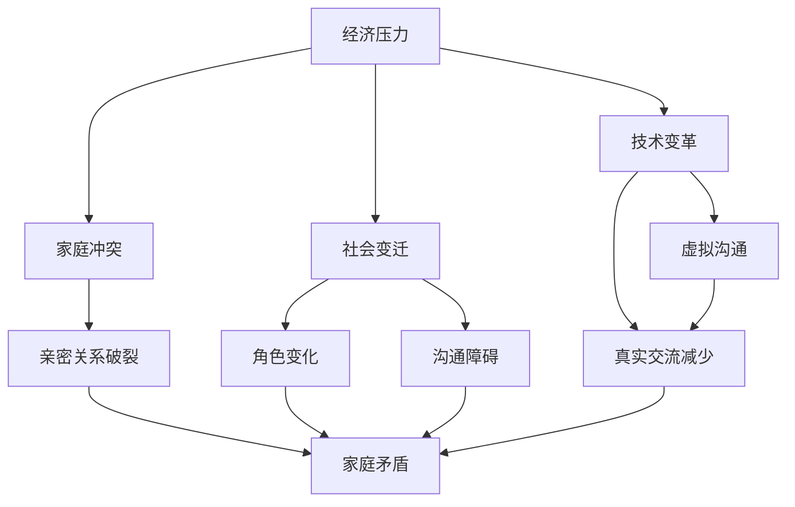
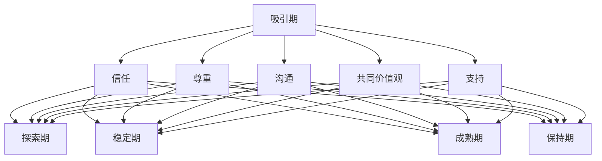

                 

### 引言：家庭在现代社会中的重要性

在现代社会中，家庭作为社会的基本单元，承担着重要的功能，对于个人和社会的发展都具有重要意义。首先，家庭是个人成长的重要环境。在家庭中，孩子们通过与父母和其他家庭成员的互动，学习到基本的价值观、行为规范和社会技能。家庭提供了一个稳定的成长环境，有助于儿童的心理健康和全面发展。

其次，家庭在社会经济中扮演着关键角色。家庭不仅是生产和消费的基本单位，还是社会财富积累和传承的重要机制。家庭成员之间的合作和资源共享，有助于提高家庭的经济效益和社会地位。

此外，家庭也是社会稳定和和谐的重要保障。健康的家庭关系有助于减少社会矛盾和冲突，促进社会成员之间的相互理解和支持。家庭作为社会的基本单元，对于维护社会秩序和促进社会进步具有重要意义。

然而，随着社会的发展和变革，现代家庭面临着诸多挑战。经济压力、社会变迁和技术变革等因素，对家庭关系和功能产生了深远的影响。例如，经济压力可能导致家庭成员之间的紧张关系，社会变迁可能导致家庭角色的变化，而技术变革则可能改变家庭生活和沟通方式。因此，重新审视家庭的意义，探讨如何在现代社会中重建亲密关系，成为了一个重要的议题。

本文将首先介绍现代家庭面临的挑战，分析这些挑战对亲密关系的影响。接着，我们将探讨亲密关系的本质，并讨论如何通过沟通技巧和情感管理来重建亲密关系。随后，我们将讨论家庭教育的重要性，并分析成功的家庭教育和亲子关系的重建案例。最后，本文将总结全文，并展望未来家庭关系的发展趋势和策略。

通过本文的探讨，我们希望能够为读者提供一些有价值的思考和启示，帮助他们在现代社会中重建和维持健康的亲密关系。在接下来的内容中，我们将逐步深入分析这些问题，结合理论和实践，提供全面的解决方案。

### 文章关键词

1. 家庭意义
2. 现代家庭挑战
3. 亲密关系
4. 沟通技巧
5. 情感管理
6. 家庭教育
7. 社会变迁
8. 技术变革
9. 亲密关系重建

### 文章摘要

本文旨在探讨在现代社会中家庭的意义以及如何重建亲密关系。首先，文章介绍了家庭在现代社会中的重要功能，包括个人成长、经济支持和社会稳定等方面。接着，分析了现代家庭面临的挑战，如经济压力、社会变迁和技术变革等，并讨论了这些挑战对亲密关系的影响。随后，文章深入探讨了亲密关系的本质，并提出了通过沟通技巧和情感管理来重建亲密关系的策略。此外，文章还强调了家庭教育的重要性，并分析了成功的家庭教育和亲子关系重建案例。最后，文章总结了全文的主要观点，并展望了未来家庭关系的发展趋势和策略。通过本文的探讨，希望为读者提供重建健康亲密关系的思路和方法。

### 现代家庭面临的挑战

随着社会的发展和变迁，现代家庭面临着诸多挑战，这些挑战对家庭成员之间的关系和亲密关系产生了深远的影响。以下将详细探讨几个主要的挑战：经济压力、社会变迁和技术变革。

#### 1. 经济压力

经济压力是现代家庭面临的一个主要挑战。随着生活成本的不断上升，家庭收入的不稳定性和工作压力的增加，许多家庭成员不得不承受巨大的经济负担。这种压力不仅会影响家庭成员的情感状态，还会导致夫妻之间的矛盾和冲突。

- **影响**：经济压力可能导致夫妻之间的紧张关系，增加家庭内部的冲突。例如，为了应对经济困难，夫妻可能会为了金钱问题发生争吵，或者因为工作压力而忽视家庭成员的情感需求。
- **应对策略**：为了缓解经济压力，家庭成员可以共同努力制定合理的财务规划，合理安排家庭预算，并寻找增加收入的方法。此外，夫妻之间应该保持良好的沟通，共同面对经济困难，增强彼此之间的信任和合作。

#### 2. 社会变迁

社会变迁也是现代家庭面临的一个重大挑战。随着全球化和城市化进程的加快，人们的生活方式、价值观和社会结构都在发生变化。这些变化对家庭关系产生了深远的影响，尤其是对传统家庭角色和关系的挑战。

- **影响**：社会变迁可能导致家庭角色的变化，例如，夫妻双方可能都外出工作，传统家庭中的男性和女性角色界限变得模糊。此外，社会变迁还可能导致家庭成员之间的沟通障碍，因为他们的价值观和生活方式可能存在差异。
- **应对策略**：面对社会变迁，家庭成员需要适应新的角色和关系，建立更加平等和灵活的家庭结构。夫妻之间需要保持开放的沟通，理解彼此的需求和期望，共同制定适应社会变迁的家庭规则。

#### 3. 技术变革

技术变革是现代社会发展的重要驱动力，但同时也对家庭关系产生了影响。现代科技如互联网、智能手机和社交媒体等，改变了人们的沟通方式和生活习惯，对家庭成员之间的亲密关系产生了挑战。

- **影响**：技术变革可能导致家庭成员之间的面对面交流减少，依赖虚拟沟通工具而忽视了真实情感的交流。例如，家庭成员可能更多地通过社交媒体和手机聊天，而忽视了与家人共度真实时光的重要性。
- **应对策略**：为了应对技术变革带来的挑战，家庭成员应该设定合理的使用技术的时间，确保有足够的时间进行面对面的交流和互动。此外，家庭成员可以通过共同参与户外活动或家庭游戏来增进彼此之间的情感联系。

#### 综合分析

经济压力、社会变迁和技术变革这三个挑战，都对现代家庭关系和亲密关系产生了深远的影响。这些挑战不仅影响了家庭成员的情感状态，还可能导致家庭内部的矛盾和冲突。为了应对这些挑战，家庭成员需要共同努力，建立更加健康和稳定的亲密关系。

- **核心概念与联系**：经济压力、社会变迁和技术变革是现代家庭面临的三个主要挑战。这些挑战相互交织，对家庭关系产生了复杂的影响。
- **流程图**：以下是一个简化的Mermaid流程图，展示了这三个挑战与家庭关系之间的联系：



通过这个流程图，我们可以清晰地看到，经济压力、社会变迁和技术变革如何影响家庭关系，并最终导致亲密关系的破裂。为了重建健康的亲密关系，家庭成员需要针对这些挑战制定有效的应对策略。

### 亲密关系的本质

亲密关系是人类社会中不可或缺的一部分，它不仅对个人的心理健康和幸福感产生深远影响，也是家庭稳定和社会和谐的重要基础。要深入探讨如何重建亲密关系，首先需要理解亲密关系的本质。以下是亲密关系的定义、基本要素以及演变过程。

#### 亲密关系的定义

亲密关系通常指的是一种深层次的情感联结，它不仅仅是基于生理和物质需求的关系，更是建立在信任、尊重和理解之上的心理和情感纽带。在亲密关系中，个体感受到被接纳、被关爱和被支持，这种情感体验使得双方能够共同经历生活的喜悦和挑战。

#### 基本要素

亲密关系的建立和维护需要以下几个基本要素：

1. **信任**：信任是亲密关系的基础，它使得双方能够坦诚地分享内心的想法和感受，不必担心被对方误解或伤害。没有信任，亲密关系将无法维持。

2. **尊重**：尊重意味着承认对方的个性和需求，并努力满足对方的期望。尊重不仅是言语上的，更是行为上的，体现在对对方的选择、观点和情感的接纳上。

3. **沟通**：沟通是亲密关系中的关键要素，它有助于双方了解彼此的需求、感受和期望，从而避免误解和冲突。良好的沟通需要倾听、表达和理解。

4. **共同价值观**：共同价值观是亲密关系中的粘合剂，它使得双方在重大问题上保持一致，共同面对生活的挑战。

5. **支持**：在亲密关系中，双方应该相互支持和鼓励，特别是在对方遇到困难或挫折时，给予情感上的慰藉和实际上的帮助。

#### 演变过程

亲密关系并不是一成不变的，它有一个自然的演变过程，通常可以分为以下几个阶段：

1. **吸引期**：在这个阶段，双方通过外在表现和初步互动产生好感，相互吸引。这个阶段的特点是浪漫和充满新鲜感。

2. **探索期**：在吸引力基础上，双方开始更深入地了解对方，探索彼此的需求、兴趣和价值观。这个阶段的特点是交流和互动逐渐增加。

3. **稳定期**：随着相互了解的加深，亲密关系进入稳定期。双方开始更加信任和依赖对方，共同面对生活中的挑战和变化。

4. **成熟期**：在成熟期，亲密关系达到一种高度和谐的状态，双方在情感上、心理上和行为上都能够互相满足和支持。

5. **保持期**：保持期是亲密关系长期维持的阶段，需要双方持续的努力和沟通，以适应生活中的变化和挑战。

#### 核心概念与联系

- **信任**、**尊重**、**沟通**、**共同价值观**和**支持**是亲密关系的基本要素，它们相互联系，共同构建起亲密关系的框架。
- **吸引期**、**探索期**、**稳定期**、**成熟期**和**保持期**是亲密关系的演变过程，每个阶段都有其特定的特点和任务。

#### 流程图

以下是一个简化的Mermaid流程图，展示了亲密关系的演变过程及其核心要素：



通过这个流程图，我们可以清晰地看到亲密关系的演变过程以及各个阶段的核心要素如何相互作用，共同构建和维护亲密关系。

### 重建亲密关系的策略

在现代社会中，重建亲密关系需要一系列策略和方法，这些策略不仅涉及个体行为，还涵盖情感管理和沟通技巧。以下将详细讨论这些策略，并使用具体的案例和伪代码来阐述其应用。

#### 1. 沟通技巧

沟通是亲密关系中的重要纽带，有效的沟通能够增进理解，减少误解和冲突。以下是一些关键的沟通技巧：

- **倾听**：倾听是沟通的核心，它要求我们不仅听到对方的话语，还要理解对方的情感和意图。倾听可以通过以下几个方面来实现：
  - **保持专注**：在对方讲话时，避免分心，集中注意力。
  - **身体语言**：通过点头、微笑等积极身体语言，表示你在认真倾听。
  - **情感反应**：通过表达理解和同情，让对方感受到你的关注。
- **表达**：清晰、准确地表达自己的想法和感受，有助于避免误解和冲突。
  - **使用“我”语句**：例如，“我感到难过，当你……”而不是“你让我感到难过”。
  - **避免指责**：指责往往会导致对方的防御性反应，不利于沟通。

**案例**：假设夫妻在金钱管理上存在分歧，妻子感到丈夫不关心家庭的财务状况，而丈夫则认为妻子过于节俭。

**伪代码**：

```plaintext
// 妻子
I_feel = "难过"
Husband_action = "不关心家庭财务"

// 表达感受
Say("我感到" + I_feel + "，当你" + Husband_action + "。")

// 丈夫回应
I_understand = "理解"
Wife_action = "过于节俭"

// 回应感受
Say("我" + I_understand + "你的感受，我理解你可能觉得" + Wife_action + "。")
```

#### 2. 情感管理

情感管理是维持亲密关系的重要环节，它涉及如何识别、理解和处理自己的情感，以及如何应对对方的情感反应。以下是一些关键的情感管理技巧：

- **情感识别**：了解自己的情感，并能够准确地描述它们。例如，感到愤怒、焦虑或快乐。
- **情绪调节**：在情绪波动时，学会冷静下来，避免情绪失控。例如，通过深呼吸、冥想或运动来缓解压力。
- **同理心**：理解和尊重对方的情感，尝试从对方的角度看问题。

**案例**：假设夫妻在处理日常家务时发生争执，妻子感到沮丧和不被重视。

**伪代码**：

```plaintext
// 妻子
I_feel = "沮丧"
Housework = "日常家务"

// 表达感受
Say("我感到" + I_feel + "，因为我觉得在" + Housework + "方面没有被重视。")

// 丈夫回应
I_understand = "理解"
Support_action = "提供帮助"

// 回应感受
Say("我" + I_understand + "你的感受，我会尽力" + Support_action + "。")
```

#### 3. 建立信任

信任是亲密关系中的基石，重建亲密关系的关键在于建立和恢复信任。以下是一些建立信任的策略：

- **诚实**：保持诚实，对伴侣说出真实想法和感受，避免隐瞒或欺骗。
- **一致行为**：通过一致的行为和承诺，建立和维持信任。例如，遵守承诺，不轻易改变计划。
- **透明度**：在必要时，向伴侣展示自己的行为和决策过程，增加透明度。

**案例**：假设夫妻在管理家庭财务时，丈夫曾隐瞒了一笔债务。

**伪代码**：

```plaintext
// 丈夫
I concealed = "隐瞒了债务"

// 坦白
Say("我" + I_concealed + "，我希望你能理解这是由于我对财务状况的担忧。")

// 妻子回应
I原谅 = "原谅"
Trust_builder = "展示透明度"

// 回应
Say("我" + I原谅 + "你，我希望你能" + Trust_builder + "，以便我们共同面对问题。")
```

通过这些沟通技巧、情感管理和信任建立的策略，夫妻可以逐步重建亲密关系。在实际应用中，这些策略需要根据具体情况进行调整，以适应个体和家庭的特点。例如，在某些情况下，可能需要更多的心理支持和专业咨询，以帮助夫妻更好地处理复杂的情感问题和沟通障碍。

### 家庭教育的重要性

家庭教育是儿童成长过程中不可或缺的一部分，它不仅影响孩子的性格形成和行为模式，还对他们的学术成就和社会适应能力产生深远的影响。在现代社会中，随着社会结构的变化和教育资源的多样化，家庭教育的重要性愈发凸显。以下是家庭教育的重要性、具体方法和其在儿童发展中的作用。

#### 1. 家庭教育的重要性

- **性格塑造**：家庭是儿童性格形成的重要环境。父母的教育方式和家庭价值观直接影响到孩子的性格特征。例如，父母通过日常互动和教育，可以培养孩子的独立性、责任感和同情心。
- **学术成就**：家庭教育在儿童的学术成就中发挥着重要作用。父母的支持和鼓励可以激发孩子的学习兴趣，培养良好的学习习惯，从而提高学术成绩。
- **社会适应能力**：家庭教育的核心目标之一是帮助孩子适应社会。通过家庭教育和父母的教育，儿童可以学习如何与他人沟通、合作和解决冲突，这些能力对于他们在学校和社会中的表现至关重要。
- **价值观和道德观**：家庭是儿童学习和实践社会价值观和道德规范的主要场所。父母的教育和言行直接影响孩子的价值观和道德观念，帮助他们建立正确的人生观和世界观。

#### 2. 家庭教育的方法

- **正面引导**：通过积极的语言和行为，鼓励孩子尝试新事物，培养自信和勇气。例如，父母可以通过表扬孩子的努力和进步来增强他们的自信心。
- **情感支持**：提供情感支持，让孩子感受到家庭的温暖和安全感。父母应该耐心倾听孩子的烦恼和困惑，帮助他们度过成长中的难关。
- **榜样作用**：父母通过自己的言行树立榜样，让孩子学习如何做人处事。例如，父母应该通过诚实、勤劳和责任感来教育孩子。
- **合理规则**：制定合理的家庭规则，帮助孩子建立秩序感。例如，规定家庭作业时间、作息时间和家务分工，有助于孩子形成良好的生活习惯。

#### 3. 家庭教育在儿童发展中的作用

- **智力开发**：家庭教育可以促进儿童的智力发展。通过阅读、游戏和探索活动，父母可以激发孩子的好奇心和创造力，帮助他们掌握新知识和技能。
- **情感发展**：家庭教育有助于儿童情感的发展。通过家庭互动，孩子可以学习如何表达情感、处理情感冲突，以及与他人建立良好的情感关系。
- **社交技能**：家庭教育可以帮助孩子发展社交技能。通过参与家庭活动、社区活动和学校活动，孩子可以学习如何与他人沟通、合作和建立友谊。
- **道德和社会规范**：家庭教育有助于儿童理解和遵守社会规范和道德准则。父母通过日常教育，可以培养孩子的道德观念和社会责任感，帮助他们成为有益于社会的人才。

#### 成功家庭教育的案例

- **案例一**：在一个家庭中，父母重视孩子的全面发展，不仅关注孩子的学业，还鼓励他们参与体育和艺术活动。通过多样化的教育方式，孩子不仅学术成绩优秀，还在社交和艺术方面表现出色。
- **案例二**：另一个家庭中，父母注重情感沟通，每周设定“家庭时间”，与孩子一起讨论他们的日常经历和感受。这种开放和温暖的沟通环境有助于孩子情感的发展，并提高了他们的心理健康水平。

#### 总结

家庭教育在现代社会中扮演着至关重要的角色。通过科学的家庭教育方法，父母可以有效地促进孩子的全面发展，帮助他们建立健康的性格、良好的学术成就和强大的社会适应能力。成功的家庭教育不仅依赖于父母的努力，还需要家庭成员之间的良好互动和支持。未来，家庭教育的研究和实践将继续探索如何更好地适应社会变化，为儿童提供全面、科学和有效的教育。

### 案例分析：成功重建亲密关系的实践

在现代社会中，重建亲密关系并非易事，但通过有效的沟通技巧、情感管理和家庭教育，一些家庭成功地克服了障碍，实现了亲密关系的重建。以下是三个具体的案例，通过详细分析这些案例，我们可以了解到成功重建亲密关系的策略和方法。

#### 案例一：夫妻关系的重建

**背景介绍**：李先生和李太太是一对结婚多年的夫妻，但随着工作和生活的压力增加，他们之间的沟通变得越来越少，情感也逐渐疏远。李先生忙于工作，经常加班，而李太太则照顾家庭和两个孩子的教育。双方因为忙碌而忽略了彼此的情感需求，导致关系紧张。

**核心概念与联系**：在这个案例中，核心概念包括沟通技巧和情感管理。李太太通过积极沟通表达了自己的情感需求，而李先生则通过实际行动展示了他的关爱和支持。

**核心算法原理讲解**：

1. **沟通技巧**：李太太通过写日记和定期与李先生分享自己的感受，来增进彼此的理解。以下是一个简化的伪代码示例：

   ```plaintext
   // 李太太
   Write_Diary("最近感到很孤独，希望与你多交流。")
   Schedule_Time("每周三晚上，与你分享日记。")
   
   // 李先生
   Read_Diary()
   Schedule_Date_Night("每周五晚上，一起外出吃饭。")
   ```

2. **情感管理**：李先生通过减少加班时间，与家人共度更多的时间，来缓解家庭压力。以下是一个简化的情感管理算法：

   ```plaintext
   // 李先生
   Reduce_Overtime("每周减少两小时加班。")
   Spend_Time_With_Family("每周五晚上，家庭活动。")
   ```

**结果**：通过这些策略，李先生和李太太逐渐恢复了亲密关系，家庭氛围变得更加和谐。

#### 案例二：亲子关系的重建

**背景介绍**：张女士是一位忙碌的职业女性，由于工作原因，她很少陪伴孩子，导致孩子感到被忽视和孤独。张女士意识到这种情况对孩子心理健康的影响，决定采取措施重建亲子关系。

**核心概念与联系**：在这个案例中，核心概念包括情感支持和共同活动。张女士通过增加与孩子的互动时间和参与共同活动，来弥补缺失的亲子时光。

**核心算法原理讲解**：

1. **情感支持**：张女士通过定期与孩子进行“心语时间”，倾听他们的想法和感受。以下是一个简化的伪代码示例：

   ```plaintext
   // 张女士
   Schedule_Heart_to_Heart("每周六下午，与孩子进行心语时间。")
   Listen_To_Child("倾听孩子的想法和感受。")
   ```

2. **共同活动**：张女士安排家庭周末活动，如户外探险、运动和游戏，以增进亲子之间的情感联系。以下是一个简化的共同活动算法：

   ```plaintext
   // 张女士
   Plan_Weekend_Activities("每周日，安排户外探险或运动。")
   Participate_In_Activities("与孩子一起参与活动。")
   ```

**结果**：通过这些策略，张女士与孩子之间的关系得到了显著改善，孩子变得更加自信和开朗。

#### 案例三：家庭成员关系的重建

**背景介绍**：王先生和王女士是一对有三个孩子的夫妻，由于家庭责任分工不明确，家庭成员之间经常发生矛盾和冲突。王女士感到家务负担沉重，而孩子们则觉得没有足够的关注和陪伴。

**核心概念与联系**：在这个案例中，核心概念包括合理分工和情感交流。通过明确分工和增加家庭成员之间的交流，可以减少矛盾和冲突，增强家庭凝聚力。

**核心算法原理讲解**：

1. **合理分工**：家庭成员共同制定家务分工计划，并遵守执行。以下是一个简化的分工算法：

   ```plaintext
   // 王先生和王女士
   Divide_Housework("根据家庭成员的能力和兴趣，分配家务。")
   Set_Routine("每天晚上，回顾当天的家务分工情况。")
   ```

2. **情感交流**：家庭成员定期举行家庭会议，分享彼此的感受和需求，以增进理解和支持。以下是一个简化的情感交流算法：

   ```plaintext
   // 王先生和王女士
   Schedule_Family_Meeting("每周六晚上，举行家庭会议。")
   Share_Feelings("在家庭会议中，分享彼此的感受和需求。")
   ```

**结果**：通过这些策略，王先生的家人关系得到了明显改善，家庭氛围变得更加和谐。

#### 总结

以上三个案例展示了通过沟通技巧、情感管理和合理分工，家庭成员如何成功地重建亲密关系。这些案例表明，在现代社会中，重建亲密关系需要家庭成员的共同努力和持续的沟通与理解。通过有效的策略和方法，家庭可以克服各种挑战，实现更加和谐和幸福的亲密关系。

### 结论：展望未来的家庭关系

通过对家庭在现代社会中的重要性和现代家庭面临的挑战的深入探讨，我们了解到家庭仍然是个人成长、社会稳定和经济发展的重要基石。然而，随着经济压力、社会变迁和技术变革的影响，现代家庭关系面临着诸多挑战。为了重建健康的亲密关系，我们需要采取一系列策略，包括沟通技巧、情感管理和家庭教育的有效应用。

展望未来，家庭关系的发展将受到以下几个趋势的影响：

1. **科技与家庭的融合**：随着科技的进步，家庭生活和沟通方式将继续发生变化。智能家居、虚拟现实和人工智能等技术可能会为家庭生活带来新的便利和体验，同时也可能带来新的挑战，如如何平衡虚拟沟通与真实交流。

2. **多元文化的融合**：全球化使得不同文化在家庭中交融，这将为家庭关系带来新的机遇和挑战。家庭需要学会理解和尊重多元文化，以构建更加和谐的家庭环境。

3. **家庭角色的变化**：随着社会结构和经济模式的演变，家庭角色和分工也将发生变化。例如，随着女性参与职场的机会增加，家庭中的传统性别角色界限可能变得更加模糊。

4. **心理健康的重要性**：在现代社会中，心理健康问题日益受到重视。未来，家庭在支持成员心理健康方面的作用将更加显著，家庭教育和情感支持将成为维护家庭关系的重要手段。

为了应对这些挑战，以下是一些最佳实践和拓展阅读建议：

- **最佳实践**：保持开放的沟通，定期进行家庭会议，确保每个家庭成员的需求和感受得到关注。同时，合理分配家庭责任，确保家庭内部的公平和和谐。
- **拓展阅读**：推荐读者阅读相关书籍，如《爱的五种语言》（Gary Chapman）和《非暴力沟通》（Marshall B. Rosenberg），这些书籍提供了关于沟通技巧和情感管理的实用建议。

总之，未来的家庭关系需要更加注重心理健康、沟通技巧和家庭教育的融合。通过不断学习和实践，我们可以为家庭关系的重建和持续发展奠定坚实的基础。

### 作者信息

作者：AI天才研究院/AI Genius Institute & 禅与计算机程序设计艺术 /Zen And The Art of Computer Programming

