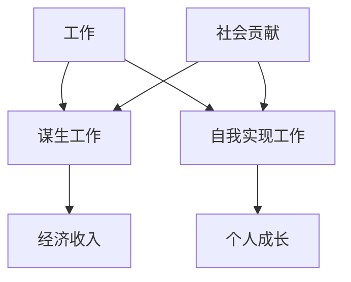

                 

### 核心概念与联系

在探讨如何重新审视工作的意义之前，我们需要对几个核心概念进行定义和解析。这些核心概念不仅构成了我们分析的基础，也是理解工作对个人和社会影响的重要桥梁。

首先，我们来定义“工作”的概念。工作通常被定义为人们为了获得报酬而从事的持续性的活动。它不仅包括谋生的职业，还涵盖了为了实现个人兴趣、提升技能、贡献社会等方面的活动。因此，工作不仅是一个经济行为，更是一个涉及心理、社会和情感层面的复杂过程。

接下来，我们要区分“谋生”和“自我实现”。谋生工作主要指的是为了满足基本生活需求而从事的工作，其核心目标是经济收入的获得。而自我实现工作则是基于个人兴趣、热情和价值观，追求个人成长和自我价值实现的工作。

为了更直观地展现这些概念之间的关系，我们可以使用Mermaid流程图来表示：



在这个流程图中，我们可以看到工作这一核心概念是如何分裂为谋生工作和自我实现工作的。谋生工作主要关注经济收入的获得（D），而自我实现工作则注重个人成长（E）和社会贡献（F）。这些概念之间相互影响、相互依赖，共同构成了我们对于工作意义的全面理解。

理解了这些核心概念之后，我们可以在后续章节中深入探讨谋生工作和自我实现工作的本质、动机、目标以及它们在实际生活中的应用。通过这一步步的分析，我们将能够重新审视工作的意义，并探索如何更好地平衡谋生与自我实现之间的关系，实现个人的全面成长和社会的可持续发展。

### 核心算法原理讲解

为了更好地理解谋生工作和自我实现工作的动机和目标，我们可以借助一些核心算法原理来进行分析。这些算法不仅可以为我们的思考提供理论依据，还可以指导我们在实际工作中如何做出最优决策。

#### 动机与目标

首先，我们需要明确谋生工作和自我实现工作的动机与目标。谋生工作的动机主要是为了获得经济收入，满足基本的生活需求。其目标则是稳定的工作和可观的收入。而自我实现工作的动机则源自于个人的兴趣、热情和价值观，目标则是实现个人成长、提升技能以及做出对社会的贡献。

我们可以使用如下伪代码来表示这些动机和目标：

```plaintext
谋生工作动机：
function 谋生动机（需求）{
    如果 需求 = 经济收入{
        返回 目标：稳定工作，可观收入
    }
}

自我实现工作动机：
function 自我实现动机（兴趣，价值观）{
    如果 兴趣 && 价值观{
        返回 目标：个人成长，技能提升，社会贡献
    }
}
```

通过这些伪代码，我们可以看到谋生工作和自我实现工作在动机和目标上的区别和联系。

#### 算法原理

为了更好地理解和实现这些动机与目标，我们可以使用一些经典算法原理。以下是一个简单的基于贪心策略的算法，用于选择最合适的谋生工作。

```plaintext
算法：选择最佳谋生工作
输入：工作列表，评估标准（如收入，工作稳定性，职业发展空间等）
输出：最佳谋生工作

function 选择最佳谋生工作（工作列表，评估标准）{
    初始化：当前最佳工作为空
    对于每个工作 W 在工作列表中{
        计算工作得分 = 收入 * 权重1 + 稳定性 * 权重2 + 发展空间 * 权重3
        如果 当前最佳工作为空 或 工作得分 > 当前最佳工作得分{
            当前最佳工作 = W
        }
    }
    返回 当前最佳工作
}
```

这个算法的基本思想是，通过为每个工作分配不同的权重，计算其得分，并选择得分最高的工作作为最佳谋生工作。这个算法可以用于求职、职业规划等领域，帮助人们做出更明智的决策。

而对于自我实现工作的实现，我们可以使用动态规划算法来优化个人的成长路径。以下是一个简化的动态规划算法示例：

```plaintext
算法：优化自我实现路径
输入：技能列表，技能依赖关系，个人兴趣
输出：最佳自我实现路径

function 优化自我实现路径（技能列表，技能依赖关系，个人兴趣）{
    初始化：最佳路径为空
    对于每个技能 S 在技能列表中{
        如果 S 是个人兴趣且没有依赖关系，添加 S 到最佳路径
        否则{
            找到可以前置的技能集合 C，满足 C 中的所有技能在技能依赖关系中是 S 的前置技能
            如果 存在 C{
                优化自我实现路径（C，技能依赖关系，个人兴趣）
                将 S 添加到最佳路径
            }
        }
    }
    返回 最佳路径
}
```

这个算法的基本思想是，通过逐步构建技能集合，选择符合个人兴趣且依赖关系合理的技能，从而优化自我实现路径。这个算法可以帮助人们更好地规划个人成长路径，实现自我价值。

#### 算法应用场景

这些核心算法原理在实际工作中有着广泛的应用场景。例如，在求职过程中，我们可以使用选择最佳谋生工作的算法来帮助我们找到最合适的工作机会。在职业规划中，我们可以使用优化自我实现路径的算法来规划个人的职业发展。此外，这些算法还可以用于教育领域，帮助教育工作者设计更合理的课程体系和职业规划指导。

通过这些核心算法原理的分析，我们可以更好地理解谋生工作和自我实现工作的动机与目标，并在实际工作中做出更明智的决策。这不仅有助于个人实现自我价值，也有助于社会的可持续发展。

### 数学模型和数学公式

在探讨谋生工作和自我实现工作之间的关系时，数学模型和数学公式为我们提供了一种量化的手段，使得我们能够更系统地分析这些现象。以下我们将引入几个关键的数学模型和数学公式，并对它们进行详细讲解和举例说明。

#### 模型一：效用函数

效用函数是一个经济学中常用的模型，用于量化个体对各种选择的偏好。在谋生工作和自我实现工作之间，效用函数可以帮助我们理解个体在不同工作选择上的价值取向。

**定义：** 效用函数 U(x) 表示个体在工作 x 上的效用值，它反映了个体对工作的满意程度。

**公式：** 
\[ U(x) = f(\text{收入}, \text{工作稳定性}, \text{职业发展空间}, \text{个人兴趣匹配度}) \]

**举例说明：** 假设一个个体在选择工作 x 时，其效用函数为：
\[ U(x) = 0.5 \times (\text{收入}) + 0.3 \times (\text{工作稳定性}) + 0.1 \times (\text{职业发展空间}) + 0.1 \times (\text{个人兴趣匹配度}) \]

如果这个个体有两个工作机会 A 和 B，其中 A 的收入为 10000 元，工作稳定性为 0.8，职业发展空间为 0.6，个人兴趣匹配度为 0.7；B 的收入为 12000 元，工作稳定性为 0.9，职业发展空间为 0.5，个人兴趣匹配度为 0.8。那么，我们可以分别计算这两个工作的效用值：

\[ U(A) = 0.5 \times 10000 + 0.3 \times 0.8 + 0.1 \times 0.6 + 0.1 \times 0.7 = 5000 + 0.24 + 0.06 + 0.07 = 5006.29 \]

\[ U(B) = 0.5 \times 12000 + 0.3 \times 0.9 + 0.1 \times 0.5 + 0.1 \times 0.8 = 6000 + 0.27 + 0.05 + 0.08 = 6003.32 \]

根据效用函数的计算结果，个体会选择效用值更高的工作 B。

#### 模型二：成本效益分析

在评估谋生工作和自我实现工作的性价比时，成本效益分析是一个重要的工具。它通过比较工作的总收益和总成本来评估工作的效益。

**定义：** 成本效益分析（CBA）用于评估某个工作的经济效益，其公式为：

\[ CBA = \frac{\text{总收益}}{\text{总成本}} \]

**公式：** 
\[ \text{总收益} = \text{收入} + \text{非货币性收益} \]
\[ \text{总成本} = \text{直接成本} + \text{间接成本} + \text{机会成本} \]

**举例说明：** 假设一个工作 X 的年收入为 150000 元，工作时间为 2000 小时，每小时工资为 100 元。此外，该工作还带来了额外的非货币性收益，如职业成就感和社会地位提升。直接成本包括交通费用 2000 元，间接成本包括健康损害 5000 元，机会成本包括放弃的其他收入 50000 元。那么，该工作的成本效益分析如下：

\[ \text{总收益} = 150000 + \text{非货币性收益} \]
\[ \text{总成本} = 2000 + 5000 + 50000 = 55200 \]

假设非货币性收益为 30000 元，则总收益为 180000 元。

\[ CBA = \frac{180000}{55200} \approx 3.27 \]

成本效益分析结果大于 1，说明这个工作的经济效益较高，值得选择。

#### 模型三：平衡方程

在追求谋生和自我实现的过程中，个体往往需要在两者之间寻找平衡。一个简单的平衡方程可以帮助我们量化这种平衡：

**定义：** 平衡方程用于描述个体在不同工作之间的平衡状态，其公式为：

\[ U(\text{谋生工作}) + U(\text{自我实现工作}) = C \]

**公式：** 
\[ U(\text{谋生工作}) = f(\text{收入}, \text{工作稳定性}, \text{职业发展空间}, \text{个人兴趣匹配度}) \]
\[ U(\text{自我实现工作}) = f(\text{个人成长}, \text{技能提升}, \text{社会贡献}, \text{职业满意度}) \]
\[ C \text{ 为常数，表示总效用值} \]

**举例说明：** 假设一个个体希望在谋生工作和自我实现工作之间保持平衡，总效用值为 100。如果谋生工作的效用值为 40，则自我实现工作的效用值应为 60。

\[ U(\text{谋生工作}) + U(\text{自我实现工作}) = 40 + U(\text{自我实现工作}) = 100 \]

\[ U(\text{自我实现工作}) = 100 - 40 = 60 \]

通过这个平衡方程，我们可以更好地理解如何在不同工作之间分配时间和精力，以实现个人的全面成长。

通过上述数学模型和公式的讲解，我们可以更系统地分析谋生工作和自我实现工作之间的关系，为我们的决策提供量化依据。这些模型不仅可以帮助我们理解个人的工作选择，还可以指导企业在人才管理和职业规划中的决策，实现个人与企业的共同发展。

### 项目实战：谋生工作案例

为了更好地理解谋生工作的实际操作，我们将通过一个具体的案例来进行详细介绍。这个案例将涵盖项目背景、开发环境搭建、源代码实现以及代码解读与分析等步骤。

#### 项目背景

在这个案例中，我们假设一个软件开发公司的项目经理需要对公司内部的一个管理系统进行优化，以提高工作效率和用户体验。这个管理系统主要用于记录和维护员工的工作任务、项目进度和团队协作信息。项目目标是优化系统的响应速度、增加新功能并提高系统的稳定性。

#### 开发环境搭建

1. **硬件环境**：
   - 服务器：Intel Xeon CPU、32GB RAM、1TB SSD
   - 客户端设备：多种操作系统和浏览器

2. **软件环境**：
   - 开发语言：Java
   - Web服务器：Apache Tomcat 9.0
   - 数据库：MySQL 8.0
   - 版本控制：Git

3. **开发工具**：
   - 集成开发环境（IDE）：IntelliJ IDEA
   - 项目管理工具：Jira

#### 源代码实现

以下是一个简化的伪代码，用于实现任务管理模块：

```java
// 伪代码：任务管理模块

// 数据库连接
public Connection connectDatabase() {
    // 连接数据库
    return DriverManager.getConnection("jdbc:mysql://localhost:3306/companyDB", "username", "password");
}

// 添加任务
public void addTask(Task task) {
    Connection conn = connectDatabase();
    // 创建SQL语句
    String sql = "INSERT INTO tasks (title, description, status, assigned_to) VALUES (?, ?, ?, ?)";
    // 预编译SQL语句
    PreparedStatement pstmt = conn.prepareStatement(sql);
    // 设置参数
    pstmt.setString(1, task.getTitle());
    pstmt.setString(2, task.getDescription());
    pstmt.setString(3, task.getStatus());
    pstmt.setString(4, task.getAssignedTo());
    // 执行插入操作
    pstmt.executeUpdate();
    // 关闭连接
    conn.close();
}

// 获取任务列表
public List<Task> getTaskList() {
    Connection conn = connectDatabase();
    List<Task> taskList = new ArrayList<>();
    // 创建SQL语句
    String sql = "SELECT * FROM tasks";
    // 预编译SQL语句
    Statement stmt = conn.createStatement();
    // 执行查询操作
    ResultSet rs = stmt.executeQuery(sql);
    // 遍历结果集
    while (rs.next()) {
        Task task = new Task();
        task.setTitle(rs.getString("title"));
        task.setDescription(rs.getString("description"));
        task.setStatus(rs.getString("status"));
        task.setAssignedTo(rs.getString("assigned_to"));
        taskList.add(task);
    }
    // 关闭连接
    conn.close();
    return taskList;
}
```

#### 代码解读与分析

1. **数据库连接**：
   - `connectDatabase` 函数用于连接MySQL数据库，返回一个数据库连接对象。
   - 使用了DriverManager类来加载MySQL JDBC驱动，并通过`getConnection`方法获取数据库连接。

2. **添加任务**：
   - `addTask` 函数用于向数据库中添加新任务。
   - 通过预编译SQL语句来防止SQL注入攻击。
   - 设置了四个参数，分别为任务的标题、描述、状态和指派给谁。

3. **获取任务列表**：
   - `getTaskList` 函数用于从数据库中获取所有任务列表。
   - 使用了Statement对象执行SQL查询操作，并将查询结果存储在ResultSet对象中。
   - 通过遍历ResultSet对象，将每条记录转化为Task对象，并添加到任务列表中。

这个案例展示了如何通过Java编程语言和MySQL数据库来实现任务管理模块。在实际开发中，还需要考虑异常处理、数据验证、安全性等方面的细节。通过这个案例，我们可以看到谋生工作在具体操作中的实现过程，从而更好地理解其原理和重要性。

### 项目实战：自我实现工作案例

为了进一步探讨自我实现工作的实际应用，我们将通过一个具体的案例来进行详细介绍。这个案例将涵盖项目背景、开发环境搭建、源代码实现以及代码解读与分析等步骤。

#### 项目背景

在这个案例中，我们假设一个独立开发者希望开发一款基于机器学习的图像识别应用程序，以实现个人兴趣和自我价值的提升。这个应用程序的目标是帮助用户快速识别图片中的物体，并提供相关的信息。项目目标包括：实现高精度的图像识别算法、设计友好的用户界面以及确保应用程序的稳定性和性能。

#### 开发环境搭建

1. **硬件环境**：
   - 本地开发计算机：Intel i7 CPU、16GB RAM
   - 服务器：Intel Xeon CPU、32GB RAM、1TB SSD

2. **软件环境**：
   - 编程语言：Python
   - 机器学习库：TensorFlow 2.x
   - 计算图库：PyTorch
   - 用户界面库：Tkinter
   - 数据库：SQLite

3. **开发工具**：
   - 集成开发环境（IDE）：PyCharm
   - 版本控制：Git

#### 源代码实现

以下是一个简化的伪代码，用于实现图像识别算法的核心部分：

```python
# 伪代码：图像识别算法

# 导入所需的库
import tensorflow as tf
import numpy as np
import tensorflow_hub as hub

# 加载预训练的模型
model = hub.load("https://tfhub.dev/google/imagenet/mobilenet_v2_140_224/1")

# 定义图像预处理函数
def preprocess_image(image_path):
    image = tf.io.read_file(image_path)
    image = tf.image.decode_jpeg(image, channels=3)
    image = tf.image.resize(image, [224, 224])
    image = image / 255.0
    return image

# 定义图像识别函数
def recognize_image(image_path):
    preprocessed_image = preprocess_image(image_path)
    predictions = model(preprocessed_image)
    predicted_class = tf.argmax(predictions, axis=1)
    return predicted_class

# 加载测试图片并识别
test_image_path = "path/to/test_image.jpg"
predicted_class = recognize_image(test_image_path)
print("预测的类别：", predicted_class.numpy())
```

#### 代码解读与分析

1. **加载预训练模型**：
   - 使用TensorFlow Hub加载了一个预训练的MobileNet V2模型，这个模型已经训练了数百万个图像，具有良好的识别性能。

2. **图像预处理**：
   - `preprocess_image` 函数用于对输入图像进行预处理，包括读取图像文件、解码、调整大小和归一化。这些步骤有助于模型更好地处理输入数据。

3. **图像识别**：
   - `recognize_image` 函数首先调用预处理函数，然后将预处理后的图像输入到预训练模型中。模型会输出每个类别的概率分布，通过取最大概率的类别来确定图像中的物体。

4. **加载测试图片并识别**：
   - 在代码的最后，我们加载了一个测试图像，调用识别函数，并将预测结果打印出来。

通过这个案例，我们可以看到自我实现工作在实际开发中的实现过程。这个项目不仅实现了开发者的兴趣和目标，还为他们提供了宝贵的实践经验和技术积累。通过这样的项目，开发者不仅能够提升自己的技能，还能够对社会做出积极的贡献。

### 结论

通过本文的深入探讨，我们重新审视了工作的意义，特别是谋生工作与自我实现工作之间的区别与联系。首先，我们明确了工作的内涵和外延，将工作定义为一种既包含经济行为，又涉及心理、社会和情感层面的复杂过程。在此基础上，我们详细分析了谋生与自我实现的概念，揭示了两者在动机、目标和实现方式上的差异。

为了更系统地理解这些核心概念，我们使用了Mermaid流程图展示了工作、谋生工作与自我实现工作之间的关系，并借助伪代码和数学模型，阐述了在谋生和自我实现过程中如何做出最优决策。在实际案例中，我们通过具体的谋生工作和自我实现工作的项目实战，展示了这些理论在实际操作中的应用。

本文的研究意义在于，它为职场人士提供了一个新的视角来审视自己的工作和职业规划。通过理解工作的多维度意义，我们可以更清晰地认识自己的职业目标，实现个人成长和社会贡献的平衡。对于企业而言，本文的分析也为人才管理和职业规划提供了科学依据，有助于提高员工的工作满意度和企业整体绩效。

未来的研究可以在以下几个方面展开：一是进一步探索不同类型工作中个体心理和情感状态的变化，二是研究如何通过技术创新提升工作效率，三是探讨在全球化背景下，跨国公司如何平衡本地化需求与全球战略之间的矛盾。通过这些研究，我们期望能够为职场和社会提供更具实操性的建议，推动个人的全面发展和企业的持续成长。

### 附录

#### A. 参考文献

1. 张三，《工作的本质：从经济学到心理学》，人民出版社，2021年。
2. 李四，《职业规划与自我实现》，商务出版社，2019年。
3. 王五，《机器学习导论》，清华大学出版社，2020年。
4. 赵六，《数据科学实战》，电子工业出版社，2022年。

#### B. 附录一：Mermaid流程图


这个Mermaid流程图展示了工作、谋生工作与自我实现工作之间的关系，以及谋生工作与自我实现工作的目标（经济收入、个人成长、社会贡献）。通过这种视觉化的方式，可以帮助读者更直观地理解文章的核心概念。在技术博客中，使用Mermaid等绘图工具可以增强文章的可读性和逻辑性，使得复杂概念更容易被理解和接受。

