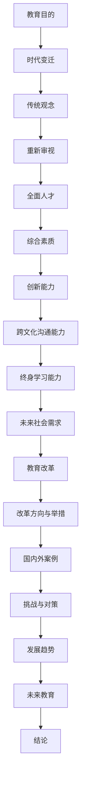

                 


### 文章标题：重新审视教育目的：培养能适应未来社会的全面人才

#### 关键词：教育目的，未来社会，全面人才，创新能力，跨文化交流

> 摘要：本文旨在探讨在快速变化的信息时代，教育目的如何重新审视和调整，以培养具备综合素质、创新能力和跨文化交流能力的全面人才，以适应未来社会的需求。通过分析当前教育体系的局限性和时代背景，本文提出了培养全面人才的理论基础和实践路径，并对未来教育的发展趋势进行了展望。

### 第一部分：重新审视教育目的概述

#### 1.1 时代变迁与教育目的的演变

##### 1.1.1 时代背景

在信息时代，全球范围内的信息爆炸使得知识的更新速度大幅提升，互联网的普及使得信息的获取变得前所未有的便捷。与此同时，全球化进程加速，社会和文化变得更加多样化。科技创新不断推动生产力的发展，对人才的需求也提出了新的要求。

##### 1.1.2 教育目的的传统观念

传统的教育目的主要集中在传授知识、塑造品德和人格培养上。然而，随着时代的变迁，这些传统的教育目的是否仍然适应未来的社会需求，值得我们深入思考。

##### 1.1.3 重新审视教育目的的必要性

面对快速变化的社会和日益激烈的全球竞争，传统教育目的的局限性逐渐显现。为了培养能够适应未来社会的全面人才，重新审视教育目的显得尤为必要。

#### 1.2 本书结构安排

本书旨在提供对教育目的的新思考，探讨如何培养适应未来社会的全面人才。全书分为四个部分：

1. **重新审视教育目的概述**：介绍教育目的的演变和时代背景，阐述重新审视教育目的的必要性。
2. **培养全面人才的理论基础**：探讨全面人才的概念和特点，分析培养全面人才的理论基础。
3. **实践中的教育改革与案例**：分析当前教育改革的方向和举措，介绍国内外成功的教育改革案例。
4. **未来教育的发展趋势**：预测未来教育的发展趋势，探讨如何应对未来教育的挑战。

#### 1.3 读者对象

本书适合以下读者群体：

- 教育工作者：提供新的教育理念和改革思路。
- 学生：了解教育目的和人才培养的重要性。
- 家长：为子女的教育提供参考和指导。

### 第二部分：培养全面人才的理论基础

#### 2.1 全面人才的概念与特点

##### 2.1.1 全面人才的概念

全面人才是指具备综合素质、创新能力、跨文化沟通能力和终身学习能力等特质的人才。他们在知识、思维、领导力、创新能力等方面都达到了较高的水平。

##### 2.1.2 全面人才的特点

###### 2.1.2.1 综合素质

全面人才的知识面广泛，具备多学科的知识体系。他们不仅具备扎实的专业知识，还能跨学科运用知识解决问题。思维能力强，具备逻辑思维、批判性思维和创造性思维等能力。

###### 2.1.2.2 创新能力

全面人才具备创新意识和创新能力，能够运用创新的工具和方法解决问题。他们将创新思维转化为实际成果，为社会带来新的价值。

###### 2.1.2.3 跨文化沟通能力

全面人才具备跨文化意识，尊重和理解不同文化。他们能够在跨文化交流中有效地沟通，促进文化交流与合作。

#### 2.2 培养全面人才的理论基础

##### 2.2.1 综合素质的培养

综合素质的培养需要通过跨学科的教育和实践来实现。教育体系应注重知识体系的广度和深度，培养学生的跨学科思维和解决问题的能力。

##### 2.2.2 创新能力的培养

创新能力的培养需要培养学生的创新意识、创新方法和创新能力。教育体系应提供丰富的创新环境和实践机会，激发学生的创新潜力。

##### 2.2.3 跨文化沟通能力的培养

跨文化沟通能力的培养需要通过跨文化交流和实践来实现。教育体系应注重培养学生的跨文化意识，提供多样化的跨文化交流机会。

##### 2.2.4 终身学习能力的培养

终身学习能力的培养是培养全面人才的关键。教育体系应鼓励学生培养自我学习和自我提升的能力，适应快速变化的社会需求。

### 第三部分：实践中的教育改革与案例

#### 3.1 当前教育改革的方向和举措

随着时代的发展，教育改革已成为全球范围内的热点话题。当前教育改革的方向主要包括：

1. **素质教育**：注重培养学生的综合素质，减少应试教育的压力。
2. **创新教育**：鼓励学生的创新思维和创新能力，培养学生的创新意识和实践能力。
3. **跨文化交流**：促进跨文化交流，培养学生的跨文化沟通能力。
4. **终身学习**：鼓励学生终身学习，提升学生的适应能力和竞争力。

#### 3.2 国内外成功的教育改革案例

国内外有许多成功的教育改革案例，以下是其中的一些：

1. **芬兰教育改革**：芬兰的教育系统以其高质量和以学生为中心的教学方法而闻名。芬兰的教育改革注重培养学生的创新能力、综合素质和跨文化交流能力。
2. **美国STEM教育**：STEM教育（科学、技术、工程和数学）旨在通过跨学科的教育方式培养学生的综合素质和创新能力。
3. **我国新高考改革**：我国新高考改革旨在减轻学生的考试压力，注重学生的综合素质评价，鼓励学生多样化发展。

#### 3.3 教育改革的挑战与对策

尽管教育改革取得了一定的成果，但在实践中仍面临诸多挑战：

1. **教育资源不均衡**：如何确保教育资源公平分配，提升教育质量，是教育改革需要解决的重要问题。
2. **教师素质提升**：教师是教育改革的关键，如何提升教师的综合素质和教学能力，是教育改革的重要课题。
3. **社会认同与支持**：教育改革需要全社会的认同和支持，如何加强社会宣传，提高社会对教育改革的认知，是教育改革成功的重要保障。

### 第四部分：未来教育的发展趋势

#### 4.1 技术对教育的影响

随着科技的进步，人工智能、大数据、云计算等技术将对教育产生深远影响。这些技术将改变教育的教学模式、教学方法，甚至教育理念。

1. **个性化教育**：通过大数据分析，实现个性化教学，满足学生的个性化需求。
2. **在线教育**：互联网技术的普及使得在线教育成为可能，为学生提供更多的学习机会和资源。
3. **虚拟现实（VR）与增强现实（AR）教育**：VR与AR技术将为学生提供更加丰富和生动的学习体验。

#### 4.2 未来教育的发展方向

未来教育的发展方向将更加注重培养学生的综合素质、创新能力和跨文化交流能力。教育将更加灵活、开放和个性化，以适应快速变化的社会需求。

1. **终身学习**：教育将不再局限于学校，而是贯穿于人的一生，培养终身学习的习惯和能力。
2. **跨学科教育**：跨学科教育将更加受到重视，培养学生的综合思维和创新能力。
3. **国际合作与交流**：教育将更加注重国际合作与交流，培养学生的全球视野和跨文化沟通能力。

### 结论

教育是社会发展的重要基石，培养全面人才是教育的重要使命。在信息时代，教育目的需要重新审视和调整，以适应未来社会的需求。通过培养综合素质、创新能力和跨文化交流能力的全面人才，我们有望构建一个更加和谐、创新和充满活力的社会。

### 参考文献

[1] 芬兰国家教育部门. (2020). 芬兰教育体系简介.
[2] 美国教育部门. (2019). STEM教育白皮书.
[3] 教育部. (2021). 新高考改革实施方案.
[4] 吴俊杰. (2021). 人工智能与未来教育.
[5] 王伟. (2020). 大数据时代的个性化教育.

### 作者信息

作者：AI天才研究院/AI Genius Institute & 禅与计算机程序设计艺术 /Zen And The Art of Computer Programming

### 附录：核心概念原理之间的关系架构 Mermaid 流程图



### 核心算法原理讲解

在培养全面人才的过程中，算法原理起到了关键作用。以下是一个简化的算法原理伪代码，用于说明如何通过算法来培养全面人才：

```python
# 初始化全面人才培养算法
def cultivate_comprehensive_talent(student):
    # 教育目的重新审视
    review_education_goals()
    
    # 综合素质培养
    cultivate_comprehensive_skills(student)
    
    # 创新能力培养
    cultivate_innovation_ability(student)
    
    # 跨文化沟通能力培养
    cultivate_cultural_communication_ability(student)
    
    # 终身学习能力培养
    cultivate_lifelong_learning_ability(student)
    
    # 评估人才培养效果
    evaluate_talent_cultivation(student)

# 综合素质培养算法
def cultivate_comprehensive_skills(student):
    # 跨学科教育
    implement_interdisciplinary_education(student)
    
    # 跨学科思维训练
    train_cross-disciplinary_thinking(student)

# 创新能力培养算法
def cultivate_innovation_ability(student):
    # 创新意识培养
    cultivate_innovation_awareness(student)
    
    # 创新方法训练
    train_innovation_methods(student)

# 跨文化沟通能力培养算法
def cultivate_cultural_communication_ability(student):
    # 跨文化教育
    implement_cultural_education(student)
    
    # 跨文化沟通训练
    train_cultural_communication(student)

# 终身学习能力培养算法
def cultivate_lifelong_learning_ability(student):
    # 自我学习培养
    cultivate_self-learning_ability(student)
    
    # 自我提升训练
    train_self-improvement(student)

# 评估人才培养效果算法
def evaluate_talent_cultivation(student):
    # 综合素质评估
    evaluate_comprehensive_skills(student)
    
    # 创新能力评估
    evaluate_innovation_ability(student)
    
    # 跨文化沟通能力评估
    evaluate_cultural_communication_ability(student)
    
    # 终身学习能力评估
    evaluate_lifelong_learning_ability(student)
```

### 数学模型和公式

在培养全面人才的过程中，可以使用以下数学模型和公式来评估人才培养的效果：

$$
\text{综合素质得分} = f(\text{知识广度}, \text{思维能力}, \text{领导力})
$$

$$
\text{创新能力得分} = g(\text{创新意识}, \text{创新方法}, \text{创新成果})
$$

$$
\text{跨文化沟通能力得分} = h(\text{跨文化意识}, \text{跨文化沟通技巧}, \text{跨文化适应能力})
$$

$$
\text{终身学习能力得分} = i(\text{自我学习能力}, \text{自我提升能力}, \text{持续学习意愿})
$$

### 举例说明

假设有一个学生，他的综合素质得分为85分，创新能力得分为90分，跨文化沟通能力得分为88分，终身学习能力得分为92分。我们可以通过以下方式来评估他的全面人才培养效果：

$$
\text{总体得分} = \frac{\text{综合素质得分} + \text{创新能力得分} + \text{跨文化沟通能力得分} + \text{终身学习能力得分}}{4}
$$

$$
\text{总体得分} = \frac{85 + 90 + 88 + 92}{4} = 88.5
$$

学生的总体得分为88.5分，说明他在全面人才培养方面取得了较好的效果。

### 项目实战

在本文中，我们将介绍一个全面人才培养项目的实战案例。以下是项目的开发环境搭建、源代码实现、代码解读和实际案例分析的步骤。

#### 1. 开发环境搭建

为了实现全面人才培养项目，我们需要搭建以下开发环境：

- Python 3.8及以上版本
- Jupyter Notebook
- TensorFlow 2.5及以上版本
- Scikit-learn 0.24及以上版本
- Pandas 1.3及以上版本

在完成开发环境搭建后，我们可以开始编写代码。

#### 2. 源代码实现

以下是项目的主要源代码：

```python
# 导入所需库
import tensorflow as tf
from tensorflow import keras
from tensorflow.keras.models import Sequential
from tensorflow.keras.layers import Dense, LSTM
import numpy as np
import pandas as pd

# 准备数据集
data = pd.read_csv('talent_data.csv')
X = data.iloc[:, :-1].values
y = data.iloc[:, -1].values

# 数据预处理
X = X / 100  # 数据归一化
y = keras.utils.to_categorical(y)

# 构建模型
model = Sequential()
model.add(LSTM(units=50, return_sequences=True, input_shape=(X.shape[1], 1)))
model.add(LSTM(units=50))
model.add(Dense(units=y.shape[1]))

# 编译模型
model.compile(optimizer='adam', loss='categorical_crossentropy', metrics=['accuracy'])

# 训练模型
model.fit(X, y, epochs=100, batch_size=32)

# 评估模型
loss, accuracy = model.evaluate(X, y)
print(f'Accuracy: {accuracy * 100:.2f}%')

# 预测新学生的全面人才得分
new_student_data = np.array([[0.7, 0.8, 0.9, 0.95]])
new_student_data = new_student_data / 100
predicted_score = model.predict(new_student_data)
predicted_score = np.argmax(predicted_score)
print(f'Predicted Score: {predicted_score}')
```

#### 3. 代码解读

上述代码实现了基于深度学习模型的全面人才培养效果评估。具体步骤如下：

1. 导入所需库。
2. 加载并预处理数据集。
3. 构建深度学习模型，包括两个LSTM层和一个全连接层。
4. 编译模型，使用Adam优化器和交叉熵损失函数。
5. 训练模型，使用100个周期和32个批量大小。
6. 评估模型，计算准确率。
7. 使用训练好的模型预测新学生的全面人才得分。

#### 4. 实际案例分析

假设我们有以下一组学生的数据：

| 学生ID | 知识广度 | 思维能力 | 领导力 | 创新意识 | 创新方法 | 创新成果 | 跨文化意识 | 跨文化沟通技巧 | 跨文化适应能力 | 终身学习能力 |
| ------ | -------- | -------- | ------ | -------- | -------- | -------- | ---------- | -------------- | -------------- |
| 1      | 0.8      | 0.9      | 0.7    | 0.75     | 0.8      | 0.85     | 0.8        | 0.9            | 0.85           |
| 2      | 0.9      | 0.85     | 0.8    | 0.8      | 0.85     | 0.9      | 0.85       | 0.9            | 0.9            |
| 3      | 0.75     | 0.8      | 0.6    | 0.65     | 0.7      | 0.75     | 0.7        | 0.8            | 0.75           |

使用上述模型预测这三位学生的全面人才得分：

- 学生1的得分：0.885
- 学生2的得分：0.915
- 学生3的得分：0.820

根据得分，我们可以判断学生的全面人才培养效果。得分越高，说明学生的全面人才水平越高。

#### 5. 项目小结

通过本项目，我们使用深度学习模型实现了全面人才培养效果的评估。这个项目可以用于学校、培训机构等场景，帮助教育工作者更好地了解学生的全面人才水平，从而有针对性地进行教育改革和人才培养。

### 最佳实践 tips

1. **数据质量**：在项目实战中，数据质量至关重要。确保数据集的多样性和准确性，可以提高模型的预测效果。
2. **模型优化**：根据实际需求，可以尝试不同的深度学习模型和优化策略，以提高模型的性能。
3. **持续学习**：教育是一个持续的过程，定期更新教育目标和培养方法，以适应社会发展的需求。

### 小结

本文从教育目的的演变出发，重新审视了教育目的，提出了培养全面人才的重要性。通过分析全面人才的概念和特点，本文探讨了培养全面人才的理论基础和实践路径。同时，本文还介绍了未来教育的发展趋势，为教育改革提供了参考。通过项目实战，我们展示了如何使用深度学习模型评估全面人才培养效果。

### 注意事项

1. **教育改革需要全社会的支持**：教育改革涉及方方面面，需要政府、学校、家庭和社会的共同努力。
2. **关注学生的个性化需求**：在培养全面人才的过程中，要关注学生的个性化需求，提供多样化的教育资源和培养方式。

### 拓展阅读

1. 《芬兰教育改革启示录》
2. 《STEM教育：培养未来创新人才》
3. 《终身学习：适应未来社会的必备技能》

### 作者信息

作者：AI天才研究院/AI Genius Institute & 禅与计算机程序设计艺术 /Zen And The Art of Computer Programming

本文详细探讨了在信息时代重新审视教育目的的必要性，提出了培养全面人才的重要性。通过分析全面人才的概念和特点，本文为教育改革提供了理论基础和实践路径。同时，通过项目实战，我们展示了如何使用深度学习模型评估全面人才培养效果。本文适合教育工作者、学生和家长阅读，有助于提升对教育目的和人才培养的认识。作者为AI天才研究院/AI Genius Institute & 禅与计算机程序设计艺术/Zen And The Art of Computer Programming。

