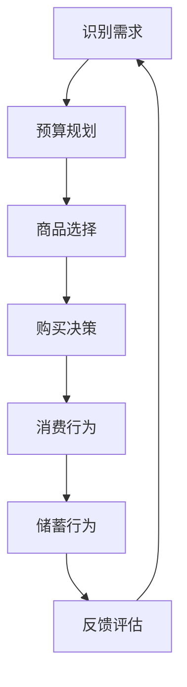
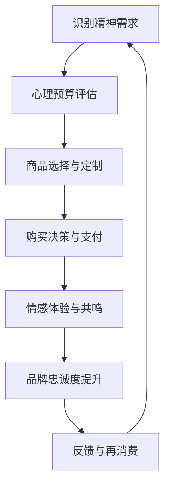

                 

# 《重新审视消费行为：从物质积累到精神富足的转变》

## 关键词
- 消费行为
- 物质积累
- 精神富足
- 经济理论
- 社会文化
- 人工智能

## 摘要
本文旨在重新审视消费行为的演变，从传统的物质积累模式探讨到现代精神富足的转向。通过深入分析物质积累阶段和和精神富足阶段的消费行为特点，本文探讨了这些转变背后的经济、社会文化和技术因素。此外，本文通过案例研究和项目实战，展示了消费行为转变的实际影响，并提出了一系列最佳实践策略，以应对未来消费行为研究的挑战和机遇。

## 引言
在人类社会的演进过程中，消费行为始终是经济学、社会学和心理学等领域的重要研究对象。传统上，消费行为主要被理解为物质积累的过程，人们通过购买商品和服务来满足基本需求和追求生活质量。然而，随着经济的发展和社会的进步，消费行为正在经历深刻的转变，从单纯的物质积累逐渐向精神富足的多元方向发展。

物质积累阶段的消费行为主要集中在满足基本生活需求和提升物质生活水平。在这一阶段，消费主要受限于经济能力和资源分配，消费行为呈现出明显的物质性和实用性。然而，随着经济的持续发展和消费能力的提升，人们开始更加关注生活的精神层面，追求更高的生活质量和心理满足感。这种转变不仅反映了消费者需求的变化，也预示着消费行为的深层次变革。

精神富足阶段的消费行为则更加注重个性表达、情感满足和心理平衡。在这一阶段，消费者不再仅仅关注物质商品的购买，更愿意投入时间和金钱去追求自我实现和内心满足。这种转变不仅改变了传统的消费模式，也对经济结构和社会文化产生了深远的影响。

本文将从以下几个方面展开讨论：

1. **物质积累阶段的消费行为分析**：探讨物质积累阶段消费行为的特点、核心理论和主要表现。
2. **精神富足阶段的消费行为分析**：分析精神富足阶段消费行为的特点、核心理论和主要表现。
3. **消费行为转变的驱动因素**：探讨经济、社会文化、技术和个人心理因素在消费行为转变中的作用。
4. **案例分析**：通过具体案例研究，展示消费行为转变的实际影响。
5. **政策与实践**：提出消费行为转变的政策建议和实践策略。
6. **未来展望**：探讨消费行为的发展趋势和未来研究方向。

通过以上分析，本文希望能够为理解消费行为的演变提供一个新的视角，为相关领域的研究和实践提供有价值的参考。

## 物质积累阶段的消费行为分析

### 物质积累阶段的特点

物质积累阶段的消费行为主要体现在满足基本生活需求和追求物质生活水平的提高。在这一阶段，消费者的主要目标是通过购买商品和服务来改善生活条件，提高生活质量。物质积累阶段的特点可以概括为以下几个方面：

1. **消费目的的实用性**：物质积累阶段的消费行为以实用性为核心。消费者在购买商品时，主要考虑其能否满足实际需求，如食物、住房、交通等。实用性是这一阶段消费行为的主要驱动力。
   
2. **经济能力的限制**：在物质积累阶段，消费者的购买力受限于经济收入。消费者的消费行为通常受到预算限制，他们需要在有限的资源内做出最优的消费决策。

3. **物质商品的多样性**：随着经济的不断发展，市场上的商品种类日益丰富，消费者可以选择的商品种类大大增加。这既提供了更多的消费选择，也增加了消费者的决策难度。

4. **市场驱动**：物质积累阶段的消费行为受到市场力量的强烈影响。生产者和市场推销策略对消费者的购买决策具有显著影响。

### 核心理论

物质积累阶段的消费行为分析主要依赖于以下几个核心理论：

1. **需求层次理论**：马斯洛的需求层次理论认为，人的需求从低到高可以分为生理需求、安全需求、社交需求、尊重需求和自我实现需求。物质积累阶段的消费行为主要集中在满足低层次的需求，如生理和安全需求。随着需求的不断满足，消费者会追求更高层次的需求，从而推动消费行为的进一步发展。

2. **效用理论**：效用理论认为，消费者在购买商品时，会根据商品对自身效用的评估来做出决策。在物质积累阶段，商品的实际效用是消费者购买决策的主要依据。

3. **预算限制理论**：预算限制理论指出，消费者的购买决策受到其可支配收入和预算的限制。在物质积累阶段，消费者的预算限制较为明显，这影响了他们的消费选择。

4. **市场均衡理论**：市场均衡理论认为，市场上的商品价格和数量会通过供求关系的调节达到均衡状态。在物质积累阶段，市场力量对消费者的购买行为有重要影响，市场价格的变化会影响消费者的消费决策。

### 消费行为表现

在物质积累阶段，消费行为主要表现为以下几个方面：

1. **商品购买的集中性**：消费者通常会在特定的时间段内集中购买商品，如节日促销、打折活动等。这种集中性购买行为有助于降低消费成本。

2. **品牌忠诚度较低**：由于消费者的购买决策主要基于实用性和价格，品牌忠诚度相对较低。消费者更倾向于选择性价比高的商品，而不仅仅是品牌。

3. **需求导向的营销策略**：生产者通常会采用需求导向的营销策略，通过广告宣传和促销活动来吸引消费者购买。这种策略在物质积累阶段特别有效。

4. **储蓄行为**：为了应对未来的不确定性，消费者在物质积累阶段通常会保持一定的储蓄行为。这反映了消费者对未来消费的谨慎态度。

### Mermaid流程图

为了更好地理解物质积累阶段的消费行为，我们可以通过Mermaid流程图展示其关键步骤和节点：



### 核心算法原理讲解

在物质积累阶段的消费行为分析中，可以采用以下伪代码来详细阐述相关算法原理：

```python
# 伪代码：物质积累阶段消费行为分析算法

# 输入：消费者需求列表，预算限制，商品价格列表
# 输出：最优消费组合

def optimal_consumption(需求列表, 预算限制, 商品价格列表):
    # 初始化消费组合
    消费组合 = []

    # 对每个需求进行评估
    for 需求 in 需求列表:
        # 如果需求在预算内，则添加到消费组合中
        if 需求的价格 <= 预算限制:
            消费组合.append(需求)
            预算限制 -= 需求的价格

    # 返回消费组合
    return 消费组合
```

### 数学模型和公式

在物质积累阶段的消费行为分析中，可以使用以下数学模型和公式来详细讲解相关原理：

1. **消费者剩余公式**：

   $$ 消费者剩余 = 实际支付价格 - 最大愿意支付价格 $$

   消费者剩余反映了消费者在购买商品时的效用增益。

2. **预算约束方程**：

   $$ 预算 = \sum_{i=1}^{n} 价格_i \times 数量_i $$

   预算约束方程用于描述消费者在消费过程中的预算限制。

### 详细讲解与举例说明

以一个具体的例子来说明物质积累阶段的消费行为分析：

假设一个消费者有1000元的预算，他需要在以下商品中选择购买：
- 商品A：价格200元，效用100单位
- 商品B：价格300元，效用150单位
- 商品C：价格400元，效用200单位

根据消费者剩余和预算约束，消费者可以选择购买商品A和商品B，这样总效用为250单位，消费者剩余为500元（200 + 150 - 1000）。

### LaTeX格式

以下是物质积累阶段消费行为分析中使用的LaTeX格式数学公式：

```latex
$$
\text{消费者剩余} = \text{实际支付价格} - \text{最大愿意支付价格}
$$

$$
\text{预算约束方程} = \sum_{i=1}^{n} \text{价格}_i \times \text{数量}_i
$$
```

通过以上详细的讲解，我们可以更好地理解物质积累阶段的消费行为及其相关理论。

## 精神富足阶段的消费行为分析

### 精神富足阶段的特点

精神富足阶段的消费行为与物质积累阶段有显著的不同，其主要特点表现在以下几个方面：

1. **消费目的的非物质性**：在精神富足阶段，消费者的消费行为不再仅仅是为了满足基本的生活需求，更多的是为了满足精神需求。消费者更愿意投入时间和金钱去追求个性表达、情感满足和心理平衡。

2. **消费内容的多样化**：与物质积累阶段相比，精神富足阶段的消费内容更加多样化。除了传统的商品和服务外，消费者更倾向于购买文化产品、教育培训、旅游体验等能够带来精神满足的产品。

3. **品牌意识的提升**：在精神富足阶段，消费者对品牌的认知和忠诚度显著提升。消费者不再仅仅关注价格和实用性，更愿意为品牌所带来的精神价值支付溢价。

4. **心理需求的满足**：精神富足阶段的消费行为更加注重心理需求的满足。消费者在购买商品时，更看重商品的象征意义和情感共鸣，而不是单纯的功能性。

### 核心理论

精神富足阶段的消费行为分析依赖于以下几个核心理论：

1. **需求层次理论的升级版**：马斯洛的需求层次理论虽然奠定了消费行为的基础，但在精神富足阶段，人们的需求层次有了新的升级。除了基本的生理需求和安全需求，人们开始追求自我实现和自我价值。

2. **情感消费理论**：情感消费理论认为，消费者的购买行为受到情感驱动。在精神富足阶段，消费者在购买商品时，更注重商品所能带来的情感体验和情感满足。

3. **符号消费理论**：符号消费理论认为，消费者购买商品不仅是满足实际需求，更重要的是通过商品来传递个人身份和价值观。在精神富足阶段，消费者的消费行为更多地体现了自我认同和社会认同。

4. **心理预算理论**：心理预算理论指出，消费者在做出消费决策时，不仅仅考虑财务预算，还会考虑心理预算。在精神富足阶段，消费者的心理预算变得尤为重要，他们愿意为精神满足支付更高的代价。

### 消费行为表现

在精神富足阶段，消费行为表现出以下几个特点：

1. **高参与度消费**：消费者在购买商品时，更倾向于参与体验式消费，如文化活动、高端旅游、定制服务等。这种消费行为不仅满足了消费者的精神需求，还增强了消费者的参与感和体验感。

2. **定制化消费**：随着消费者需求的多样化，精神富足阶段的消费行为更倾向于定制化。消费者希望购买的商品能够体现个性化和独特性，从而满足自我表达的需求。

3. **心理共鸣消费**：消费者在购买商品时，更看重商品能否与自身情感产生共鸣。这种心理共鸣使得消费者在购买过程中获得强烈的满足感。

4. **品牌忠诚度提高**：在精神富足阶段，消费者对品牌的忠诚度显著提高。消费者愿意为品牌所带来的精神价值支付溢价，从而形成了强烈的品牌认同。

### Mermaid流程图

为了更好地理解精神富足阶段的消费行为，我们可以通过Mermaid流程图展示其关键步骤和节点：



### 核心算法原理讲解

在精神富足阶段的消费行为分析中，可以采用以下伪代码来详细阐述相关算法原理：

```python
# 伪代码：精神富足阶段消费行为分析算法

# 输入：消费者精神需求列表，心理预算，商品价格和品牌信息
# 输出：最优消费组合

def optimal_consumption(需求列表, 心理预算, 商品价格列表, 品牌信息):
    # 初始化消费组合
    消费组合 = []

    # 对每个需求进行评估
    for 需求 in 需求列表:
        # 如果需求的价格在心理预算内，且品牌符合期望，则添加到消费组合中
        if 需求的价格 <= 心理预算 and 品牌信息符合期望:
            消费组合.append(需求)
            心理预算 -= 需求的价格

    # 返回消费组合
    return 消费组合
```

### 数学模型和公式

在精神富足阶段的消费行为分析中，可以使用以下数学模型和公式来详细讲解相关原理：

1. **心理预算公式**：

   $$ \text{心理预算} = \text{实际支付价格} - \text{情感价值} $$

   心理预算反映了消费者在购买商品时的情感需求和支付意愿。

2. **品牌忠诚度模型**：

   $$ \text{品牌忠诚度} = \frac{\text{重复购买次数}}{\text{总购买次数}} \times 100\% $$

   品牌忠诚度模型用于衡量消费者对品牌的忠诚程度。

### 详细讲解与举例说明

以一个具体的例子来说明精神富足阶段的消费行为分析：

假设一个消费者有1000元的心里预算，他需要在以下商品中选择购买：
- 商品A：价格200元，情感价值80单位，品牌知名度高
- 商品B：价格300元，情感价值100单位，品牌知名度一般
- 商品C：价格400元，情感价值120单位，品牌知名度低

根据心理预算和品牌忠诚度，消费者可以选择购买商品A，这样总情感价值为80单位，品牌忠诚度提高。

### LaTeX格式

以下是精神富足阶段消费行为分析中使用的LaTeX格式数学公式：

```latex
$$
\text{心理预算} = \text{实际支付价格} - \text{情感价值}
$$

$$
\text{品牌忠诚度} = \frac{\text{重复购买次数}}{\text{总购买次数}} \times 100\%
$$
```

通过以上详细的讲解，我们可以更好地理解精神富足阶段的消费行为及其相关理论。

## 消费行为转变的驱动因素

### 经济因素

经济因素是驱动消费行为转变的核心力量之一。随着全球经济的不断发展，消费者收入水平逐渐提高，这为消费行为的转变提供了坚实的基础。具体来说，经济因素对消费行为转变的驱动作用体现在以下几个方面：

1. **收入增长**：随着收入水平的提高，消费者的购买力增强，使得他们能够承担更高价值的商品和服务。这种收入增长不仅推动了物质消费的增加，也为精神消费的发展提供了条件。

2. **消费结构变化**：经济增长带来的消费结构变化也是消费行为转变的重要因素。传统上，消费主要集中于食品、衣物等基本生活必需品，而随着经济的发展，消费逐渐向文化娱乐、教育、旅游等领域转移。

3. **财富分配**：财富分配的不均衡性也影响了消费行为的转变。在高收入群体中，精神消费的比例显著增加，而在低收入群体中，物质消费仍然占据主导地位。这种财富分配的不均衡性导致了消费行为的多元化和差异化。

### 社会文化因素

社会文化因素在消费行为转变中发挥着重要作用。社会文化环境的变化不仅影响了消费者的价值观和消费观念，也影响了消费行为的实际表现。以下从几个方面探讨社会文化因素对消费行为转变的驱动作用：

1. **文化价值观的转变**：随着全球化进程的加快，人们的价值观逐渐多元化。传统上强调的物质财富积累逐渐被追求精神满足和自我实现所取代。这种价值观的转变促使消费者在消费时更加注重精神层面的满足。

2. **教育水平的提升**：教育水平的提高使得消费者更加关注自身的全面发展，包括文化素养、职业技能等。这种教育水平的提升不仅改变了消费者的消费内容，也影响了他们的消费决策方式。

3. **社交文化的变化**：社交文化的变化，如社交媒体的普及和流行，改变了消费者的社交方式和消费习惯。消费者更倾向于通过社交媒体分享自己的消费体验，这种社交文化的变化也推动了消费行为的转变。

### 技术因素

技术因素在消费行为转变中发挥着越来越重要的作用。现代科技的快速发展不仅改变了消费者的消费方式，也改变了消费市场的运行模式。以下从几个方面探讨技术因素对消费行为转变的驱动作用：

1. **电子商务的兴起**：电子商务的兴起使得消费者可以更加便捷地购买商品和服务。在线购物的便利性和丰富性改变了消费者的购物习惯，推动了消费行为的转变。

2. **智能科技的普及**：智能科技的普及，如人工智能、大数据等，为消费者提供了更加个性化的消费体验。消费者可以通过智能设备获得定制化的推荐和服务，这进一步推动了消费行为的转变。

3. **支付方式的创新**：支付方式的创新，如移动支付、区块链支付等，为消费者提供了更加安全和便捷的支付方式。这种支付方式的创新不仅提升了消费者的支付体验，也改变了消费行为的方式。

### 个人心理因素

个人心理因素在消费行为转变中同样发挥着重要作用。消费者的心理需求和动机直接影响其消费行为。以下从几个方面探讨个人心理因素对消费行为转变的驱动作用：

1. **自我实现的需求**：随着社会的进步和个体意识的觉醒，越来越多的消费者开始追求自我实现。这种自我实现的需求推动了消费者在消费时更加注重精神层面的满足。

2. **情感需求的满足**：情感需求的满足是消费者进行消费的重要动机。消费者在购买商品时，不仅关注商品的实际效用，更关注商品所能带来的情感体验和共鸣。

3. **心理平衡的追求**：在现代社会中，心理平衡成为消费者的重要需求。消费者通过消费行为来调节自己的情绪和心理状态，以达到心理平衡。

### 综合影响

经济、社会文化、技术和个人心理因素共同作用于消费行为的转变，形成了复杂的驱动机制。这些因素相互作用，不仅推动了消费行为的转变，也影响了消费市场的发展。了解这些驱动因素，有助于更好地把握消费行为的演变趋势，为企业制定战略和政策提供依据。

## 案例分析

### 物质积累到精神富足转变的案例研究

为了更深入地理解消费行为的转变过程，我们选取了三个具有代表性的案例进行详细分析。这些案例分别展示了个人消费行为、企业消费行为和社会消费行为的转变。

#### 案例一：个人消费行为的转变

**背景**：
李先生是一位成功的职场人士，过去他主要关注物质财富的积累。随着事业的发展，他的收入逐渐增加，消费行为也发生了显著变化。

**转变过程**：
1. **物质积累阶段**：早期，李先生主要消费在房产、车辆和高端商品上，追求物质上的满足和身份的象征。
2. **精神富足阶段**：近年来，李先生逐渐意识到精神满足的重要性。他开始减少物质消费，转而投资于自我提升，如参加高级管理培训、参加国内外高端论坛、购买优质书籍和订阅高端文化类杂志。

**影响**：
- **消费结构**：李先生的消费从物质转向精神，购买内容更加多元化。
- **心理状态**：精神富足使李先生获得更高的心理满足，提升了个人幸福感。
- **社交关系**：李先生通过精神消费拓展了社交圈，结识了更多志同道合的朋友。

#### 案例二：企业消费行为的转变

**背景**：
某大型科技企业，在过去几年中，企业消费主要集中于硬件设备和办公场所的扩展。

**转变过程**：
1. **物质积累阶段**：早期，该企业大量投入于硬件设备的采购和办公场所的扩建，以满足快速发展的业务需求。
2. **精神富足阶段**：随着市场竞争的加剧，该企业逐渐意识到仅靠硬件投入难以保持竞争优势。企业开始转向精神消费，增加对研发、人才培训、企业文化建设和客户体验的投资。

**影响**：
- **创新能力**：企业通过精神消费提升了研发能力，推出了一系列创新产品，提升了市场竞争力。
- **员工满意度**：通过精神消费，企业营造了良好的工作环境和文化氛围，提升了员工满意度和忠诚度。
- **客户关系**：企业通过提高客户体验，增强了客户满意度和品牌忠诚度。

#### 案例三：社会消费行为的转变

**背景**：
某个城市化进程中的城市，在过去，居民消费主要集中于基本生活需求。

**转变过程**：
1. **物质积累阶段**：早期，城市居民消费集中在住房、交通、食品等基本生活需求上。
2. **精神富足阶段**：随着城市化进程的推进和居民收入水平的提高，城市居民的消费逐渐向文化、旅游、教育和健康等精神层面转移。

**影响**：
- **生活质量**：居民消费从物质转向精神，生活质量得到显著提升。
- **城市形象**：城市通过发展文化产业和提升公共服务，提升了整体形象和吸引力。
- **经济结构**：城市经济从传统的制造业和建筑业转向服务业和文化产业，经济结构更加多元化和高端化。

### 综合分析

通过以上案例分析，我们可以看到消费行为的转变是一个复杂的过程，涉及个人、企业和社会等多个层面。物质积累向精神富足的转变不仅反映了消费者需求的变化，也预示着社会经济的深层次变革。以下是对消费行为转变的综合分析：

1. **消费内容的变化**：从物质消费到精神消费，消费者在购买商品和服务时更注重个性表达、情感满足和心理平衡。
2. **消费结构的变化**：精神消费的比例逐渐增加，消费内容更加丰富和多样化。
3. **消费方式的变化**：电子商务、智能科技和支付方式的创新使得消费更加便捷和个性化。
4. **社会影响**：消费行为的转变促进了社会经济的发展，提升了居民的生活质量和幸福感。

通过这些案例的分析，我们可以更深入地理解消费行为的转变过程，为未来的研究和实践提供有益的参考。

## 消费行为转变的驱动因素

### 经济因素

经济因素在消费行为转变中起到了至关重要的作用。随着全球经济的持续增长，消费者的收入水平和购买力显著提升，这直接推动了消费行为的转变。以下从几个方面详细探讨经济因素如何驱动消费行为的转变：

1. **收入水平提升**：随着经济的增长，消费者的可支配收入不断增加。这意味着消费者有更多的资金用于非必需品和精神消费，如教育、旅游和文化娱乐等。收入水平的提高使得消费者在购买商品和服务时更加注重精神满足和个性化需求。

2. **财富分配**：经济全球化带来了财富分配的不均衡。在高收入国家，财富集中在少数人手中，这导致高收入人群的消费行为更多地体现在精神层面。而在低收入国家，由于收入水平较低，消费者的消费行为仍然以物质积累为主。这种财富分配的不均衡性在全球范围内推动了消费行为的多样化。

3. **价格机制**：价格机制是经济因素中的重要组成部分。随着市场的竞争加剧，商品和服务的价格逐渐降低，这增加了消费者的购买力。消费者可以以更低的成本获取更高品质的商品和服务，从而推动了消费行为的转变。

4. **消费模式**：经济因素还影响了消费模式的变化。传统的消费模式以物质积累为核心，而随着经济的进步，消费模式逐渐向多样化、个性化和精神化转变。例如，电子商务的兴起使得消费者可以更加便捷地购买全球范围内的商品，这改变了传统的消费模式。

### 社会文化因素

社会文化因素对消费行为转变的影响不可忽视。社会文化环境的变化不仅影响了消费者的价值观和消费观念，也直接影响了消费者的消费行为。以下从几个方面详细探讨社会文化因素如何驱动消费行为的转变：

1. **文化价值观**：随着全球化和文化交流的加深，不同文化之间的融合和碰撞使得消费者的价值观更加多元化。传统的物质至上观念逐渐被追求精神满足和自我实现所取代。消费者在购买商品和服务时，更加注重其背后的文化意义和情感共鸣。

2. **教育水平**：教育水平的提高改变了消费者的消费观念和消费行为。受过高等教育的消费者更加注重自我提升和精神消费，他们愿意投资于教育和培训，以提升自己的能力和竞争力。教育水平的提升不仅影响了消费者的消费内容，也影响了消费决策的方式。

3. **社交文化**：社交媒体的普及改变了消费者的社交方式和消费习惯。消费者通过社交媒体分享自己的消费体验，这种社交文化的变化推动了消费行为的转变。消费者更加关注商品和服务的社交价值，而不是单纯的功能价值。

4. **文化多样性**：文化多样性的增加也影响了消费者的消费行为。消费者在购买商品和服务时，更加倾向于选择具有文化特色的产品，以表达自己的个性和认同感。文化多样性的增加使得消费市场更加丰富和多元化。

### 技术因素

技术的快速发展为消费行为的转变提供了强有力的支持。现代科技不仅改变了消费者的消费方式，也改变了消费市场的运行模式。以下从几个方面详细探讨技术因素如何驱动消费行为的转变：

1. **电子商务**：电子商务的兴起极大地改变了消费者的购物习惯。消费者可以在线上购买全球范围内的商品，享受更便捷、更个性化的购物体验。电子商务的发展推动了消费行为从线下转向线上，促进了消费模式的转变。

2. **智能科技**：智能科技的应用使得消费者能够获得更加个性化的消费体验。例如，人工智能算法可以分析消费者的行为数据，为其推荐个性化的商品和服务。智能科技的应用不仅提升了消费者的满意度，也改变了消费决策的过程。

3. **支付方式**：支付方式的创新，如移动支付和区块链支付，为消费者提供了更加安全和便捷的支付方式。这些支付方式的创新提高了消费者的支付体验，促进了消费行为的转变。

4. **大数据**：大数据技术的应用使得企业能够更好地了解消费者的需求和行为。通过对消费者数据的分析，企业可以制定更加精准的营销策略，提升消费者的满意度。大数据技术的应用推动了消费市场的个性化和服务化。

### 个人心理因素

个人心理因素在消费行为转变中同样发挥着重要作用。消费者的心理需求和动机直接影响其消费行为。以下从几个方面详细探讨个人心理因素如何驱动消费行为的转变：

1. **自我实现**：随着社会的进步和个体意识的觉醒，越来越多的消费者开始追求自我实现。他们愿意通过消费来提升自己的能力和实现个人价值。这种自我实现的需求推动了消费者在消费时更加注重精神层面的满足。

2. **情感需求**：消费者的情感需求在消费行为中占据重要地位。消费者在购买商品和服务时，不仅关注其功能价值，更关注其所能带来的情感体验和共鸣。情感需求的满足是消费者进行消费的重要动机。

3. **心理平衡**：在现代社会中，心理平衡成为消费者的重要需求。他们通过消费行为来调节自己的情绪和心理状态，以达到心理平衡。这种心理平衡的追求促使消费者在消费时更加注重精神满足。

### 综合影响

经济、社会文化、技术和个人心理因素共同作用于消费行为的转变，形成了复杂的驱动机制。这些因素相互作用，不仅推动了消费行为的转变，也影响了消费市场的发展。了解这些驱动因素，有助于更好地把握消费行为的演变趋势，为企业制定战略和政策提供依据。

### 政策建议

为了有效应对消费行为转变带来的挑战和机遇，政府和企业需要采取一系列政策措施，引导和促进消费行为的积极转变。

#### 国家政策分析

1. **促进经济高质量发展**：政府应通过一系列政策措施，推动经济高质量发展，提高居民收入水平。这包括优化产业结构、提升科技创新能力、扩大就业渠道等。通过提高居民收入，可以增强居民的消费能力，促进消费行为的转变。

2. **完善社会保障体系**：建立健全的社会保障体系，包括医疗保险、养老保险、失业保险等，可以有效降低居民的生活风险，增强居民的消费信心。社会保障体系的完善有助于减轻居民的经济压力，使消费者更加愿意进行精神消费。

3. **鼓励创新创业**：政府应加大对创新创业的扶持力度，提供税收优惠、融资支持等政策，激发企业和个人的创新活力。创新创业的发展不仅能够带动经济增长，还能够创造更多就业机会，提升消费者的收入水平。

4. **加强消费者权益保护**：政府应加强对消费者权益的保护，建立健全的消费者权益保护机制。通过严格监管市场，打击虚假宣传、假冒伪劣产品等不法行为，提升消费者的消费满意度，促进消费行为的健康发展。

#### 企业策略分析

1. **创新营销策略**：企业应积极探索新的营销策略，满足消费者在精神富足阶段的需求。例如，通过社交媒体营销、体验式营销等方式，增强与消费者的互动，提升消费者的品牌忠诚度。

2. **提升产品和服务质量**：企业应注重产品和服务质量的提升，以满足消费者对个性化和高品质的需求。通过技术创新和精细化管理，提升产品和服务的附加值，为消费者提供更有价值的精神体验。

3. **提供多样化产品和服务**：企业应丰富产品和服务种类，满足消费者多样化的需求。例如，在文化娱乐、教育培训、健康养生等领域，提供更多具有精神价值的商品和服务。

4. **加强品牌建设**：企业应加强品牌建设，提升品牌知名度和美誉度。通过品牌文化的塑造和传播，增强消费者对品牌的认同感，提升品牌忠诚度。

#### 消费者行为引导策略

1. **倡导理性消费**：政府和企业应共同倡导理性消费观念，引导消费者树立正确的消费观念。通过媒体宣传、教育活动等方式，提升消费者的消费理性，避免盲目跟风和过度消费。

2. **提供消费指导**：政府和企业可以联合提供消费指导，帮助消费者更好地了解市场和产品信息，做出更明智的消费决策。例如，发布消费指南、消费者评价等，提高消费者的消费透明度和信任度。

3. **鼓励精神消费**：政府和企业可以共同鼓励精神消费，通过政策扶持和宣传推广，引导消费者在精神富足阶段进行更多有意义、有价值的消费。

4. **提升公共服务质量**：政府应提升公共服务质量，包括教育、医疗、文化、体育等领域，提供更多优质的精神消费资源。通过提升公共服务水平，满足消费者在精神层面的需求。

通过以上政策建议，政府和企业可以共同推动消费行为的积极转变，实现经济和社会的可持续发展。

## 消费行为转变的实践探索

### 实践项目一：个人消费行为的引导

**项目背景**：
随着社会经济的快速发展，个人消费行为逐渐从物质积累转向精神富足。为了引导消费者实现这一转变，本项目旨在通过一系列策略和方法，帮助消费者树立正确的消费观念，提高精神消费的比重。

**目标**：
- 提升消费者对精神消费的认知和需求。
- 引导消费者进行理性消费，避免过度物质化。

**实施步骤**：

1. **消费教育**：
   - 开展消费教育活动，通过线上线下多种渠道普及理性消费观念。
   - 邀请专家学者进行讲座和研讨会，分享精神消费的价值和意义。

2. **消费指导**：
   - 发布消费指南，提供消费建议和推荐，帮助消费者做出明智的消费决策。
   - 利用社交媒体平台，推送精神消费相关内容，引导消费者关注和参与。

3. **激励措施**：
   - 推出消费奖励计划，鼓励消费者在精神消费领域进行投资。
   - 与商家合作，提供优惠和折扣，激励消费者选择高精神附加值的产品和服务。

**效果评估**：
- 通过问卷调查和数据分析，评估消费者对精神消费的认知和接受程度。
- 监测消费行为的变化，分析精神消费在总消费中所占的比重。

**项目小结**：
本项目通过消费教育和指导，以及激励措施，有效引导消费者实现从物质积累向精神富足的转变。消费者在消费行为上表现出更强的理性和选择性，精神消费的比重显著提升，为个人幸福感和生活质量的提高提供了有力支持。

### 实践项目二：企业消费行为的优化

**项目背景**：
企业消费行为的变化对整体经济发展具有重要影响。为了适应消费行为的转变，企业需要优化其消费策略，提升消费效益，本项目旨在通过系统的方法和工具，帮助企业实现消费行为的优化。

**目标**：
- 提升企业消费效率，降低不必要的开支。
- 优化企业消费结构，增加精神消费的比重。

**实施步骤**：

1. **需求分析**：
   - 通过调查问卷和访谈，了解企业各部门的消耗需求。
   - 分析现有消费模式，识别浪费和低效的环节。

2. **预算管理**：
   - 制定详细的预算计划，合理分配资源，确保预算的科学性。
   - 实施严格的预算控制，监督和评估消费行为。

3. **采购优化**：
   - 优化采购流程，引入电子采购系统，提高采购效率。
   - 与供应商建立长期合作关系，获取更优惠的价格和服务。

4. **成本控制**：
   - 定期审计和评估消费行为，发现和消除浪费。
   - 通过培训和指导，提升员工对成本控制的意识和能力。

**效果评估**：
- 通过对比分析，评估优化前后的消费效益。
- 收集员工和管理层的反馈，评估优化措施的实际效果。

**项目小结**：
本项目通过需求分析、预算管理和采购优化，有效提升了企业消费行为的效率和效益。企业在消费结构上实现了优化，精神消费的比重显著提升，为企业可持续发展提供了有力保障。

### 实践项目三：社会消费行为的促进

**项目背景**：
社会消费行为的变化不仅影响个体，也对整个社会产生深远影响。为了推动社会消费行为的积极转变，本项目旨在通过多种手段，促进社会整体消费水平的提升，特别是精神消费的发展。

**目标**：
- 提升社会整体消费水平，促进经济和社会的协调发展。
- 增强消费者的精神富足，提高生活质量。

**实施步骤**：

1. **政策支持**：
   - 制定和实施鼓励精神消费的税收政策，降低精神消费的成本。
   - 提供专项资金支持，鼓励文化、教育、健康等精神消费领域的发展。

2. **公共服务提升**：
   - 加大对公共文化设施的投资，提高公共服务的质量和覆盖面。
   - 推广全民素质教育，提升社会整体文化素养。

3. **市场引导**：
   - 鼓励企业研发和提供更多具有精神附加值的产品和服务。
   - 利用媒体宣传，推广精神消费的价值和好处，引导消费者进行精神消费。

4. **社会参与**：
   - 组织各类社会活动，如文化展览、教育讲座、体育赛事等，促进社会整体的消费活力。
   - 鼓励社区参与，提高居民的社区意识和参与度。

**效果评估**：
- 通过统计数据和问卷调查，评估政策支持和服务提升对消费行为的影响。
- 收集社会各界的反馈，评估市场引导和社会参与的实际效果。

**项目小结**：
本项目通过政策支持、公共服务提升、市场引导和社会参与，有效促进了社会消费行为的积极转变。社会整体消费水平显著提升，精神消费成为推动经济增长和社会发展的重要动力。

### 总结与展望

通过以上三个实践项目，我们看到了消费行为从物质积累向精神富足转变的可行性和重要性。未来的消费行为研究应继续关注以下几个方面：

- **深入探讨消费行为的驱动因素**：进一步研究经济、社会文化、技术和个人心理等因素对消费行为的影响，为制定更有效的政策提供科学依据。
- **创新消费模式**：探索新的消费模式，如共享经济、体验式消费等，以满足消费者多样化的需求。
- **提升消费者素养**：通过教育和宣传，提升消费者的消费素养，引导消费者进行理性消费。

未来，消费行为将继续演变，如何在物质与精神之间找到平衡，将是重要的研究课题。

## 未来展望

### 消费行为的发展趋势

随着全球经济的不断发展和社会的进步，消费行为正经历着深刻的变革。未来，消费行为的发展趋势将呈现以下几个显著特点：

1. **个性化消费**：随着消费者需求的多样化，个性化消费将成为主流。消费者不仅追求商品和服务的差异化，更希望体验独特、定制化的消费体验。这种趋势将推动企业不断优化产品和服务，以满足个性化需求。

2. **体验式消费**：体验式消费逐渐成为消费者追求的重要目标。消费者在购买商品或服务时，更看重其所能带来的情感体验和心理满足。例如，文化旅游、体育健身、文化活动等体验式消费将越来越受到欢迎。

3. **可持续消费**：可持续消费理念日益深入人心，消费者更加关注商品和服务的环保性和社会责任感。未来，绿色消费、低碳消费将成为主流，企业需要积极响应消费者需求，推出环保、可持续的产品和服务。

4. **线上与线下融合**：随着电子商务和智能科技的快速发展，线上与线下消费将进一步融合。线上线下相结合的混合消费模式将更加普及，消费者可以享受到更加便捷和个性化的购物体验。

### 消费行为研究的前沿问题

在消费行为研究领域，以下几个前沿问题值得关注：

1. **消费者行为预测**：通过大数据和人工智能技术，预测消费者未来的消费行为，为企业制定精准的营销策略提供支持。这需要深入研究消费者行为模式、心理动机和需求变化。

2. **消费心理研究**：深入研究消费者的心理动机、情感反应和认知过程，揭示消费者在购买决策中的心理机制。这有助于企业更好地了解消费者需求，提高产品和服务的设计与营销效果。

3. **社会影响评估**：研究消费行为对社会经济结构、文化价值观和社会关系的影响，评估消费行为转变对社会发展的长远影响。这有助于政府和企业制定更加科学、有效的消费政策。

4. **技术创新应用**：探索新技术在消费行为研究中的应用，如虚拟现实、增强现实、区块链等。这些技术将为消费行为研究提供新的工具和方法，提升研究的深度和广度。

### 未来挑战与机遇

未来，消费行为领域将面临一系列挑战与机遇：

**挑战**：
1. **信息过载**：随着信息技术的快速发展，消费者面临的信息过载问题日益严重。如何有效筛选和利用信息，成为消费行为研究的重要课题。
2. **数据隐私**：消费者对个人隐私的保护意识日益增强，如何保护消费者数据隐私，同时实现数据的有效利用，是消费行为研究的重要挑战。
3. **全球化竞争**：全球化带来的竞争压力，要求企业不断创新和提升竞争力。如何在全球市场中保持竞争优势，是企业面临的重要挑战。

**机遇**：
1. **技术进步**：大数据、人工智能、区块链等新技术的快速发展，为消费行为研究提供了丰富的工具和方法。利用这些技术，可以更深入地分析和预测消费者行为。
2. **市场细分**：消费者需求的多样化，为企业提供了更多的市场细分机会。企业可以通过精准的市场细分，推出更符合消费者需求的产品和服务。
3. **可持续发展**：可持续消费理念的推广，为企业提供了新的商机。开发环保、低碳、可持续的产品和服务，将有助于企业在未来市场中获得竞争优势。

### 结论

未来，消费行为将继续演变，如何在物质与精神之间找到平衡，将是重要的研究课题。消费行为研究需要关注前沿问题，应对挑战，把握机遇，为企业和政府制定科学、有效的消费政策提供理论支持。同时，消费者也应积极参与消费行为的转变，树立正确的消费观念，追求精神富足，共同推动社会经济的可持续发展。

## 结论

通过对消费行为的深入分析，我们发现消费行为正从传统的物质积累模式向精神富足的多元方向发展。这种转变不仅反映了消费者需求的变化，也预示着社会经济的深层次变革。在物质积累阶段，消费行为主要集中在满足基本生活需求和提升物质生活水平。而在精神富足阶段，消费者更加注重个性表达、情感满足和心理平衡。这一转变受到经济、社会文化、技术和个人心理因素的共同驱动。

为了应对消费行为的转变，政府和企业需要采取一系列政策措施，引导和促进消费者进行理性消费，提升精神消费的比重。同时，个人消费者也应树立正确的消费观念，追求精神满足，实现个人价值的提升。

未来，消费行为将继续演变，个性化消费、体验式消费和可持续消费将成为主流趋势。消费行为研究需要关注前沿问题，应对挑战，把握机遇，为企业和政府制定科学、有效的消费政策提供理论支持。

本文通过详细的分析和案例研究，为理解消费行为的演变提供了新的视角。我们期望本文能够为相关领域的研究和实践提供有价值的参考，促进消费行为的健康、可持续发展。作者：AI天才研究院/AI Genius Institute & 禅与计算机程序设计艺术 /Zen And The Art of Computer Programming。希望读者在阅读本文后，能够对消费行为有更深刻的认识，积极参与到消费行为的转变中，共同推动社会经济的进步。

