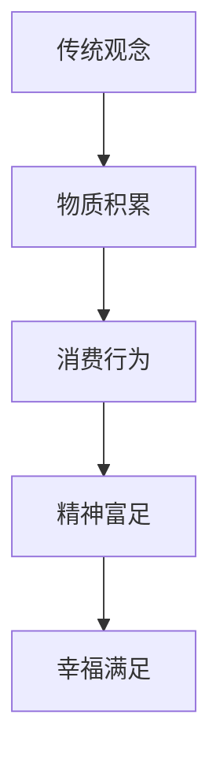
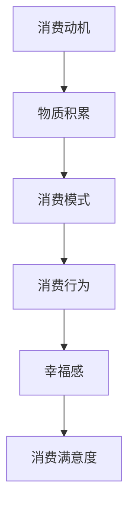
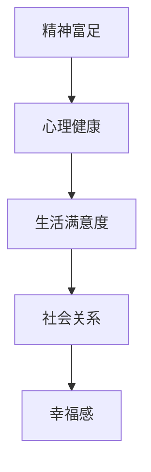
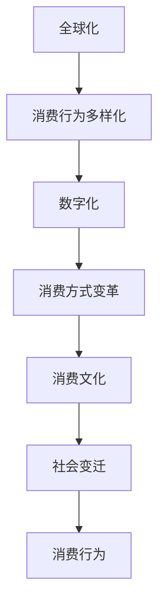
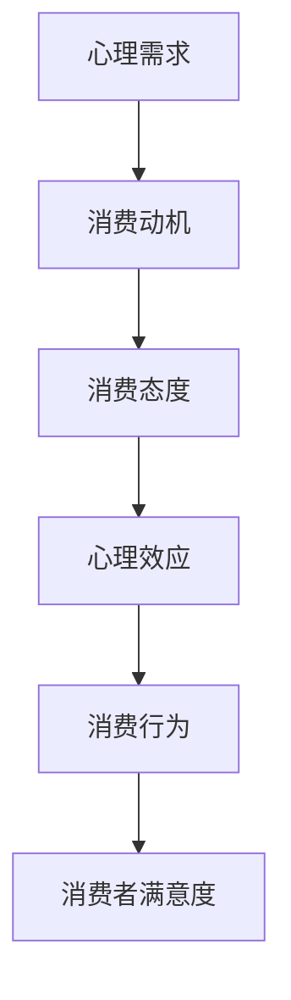
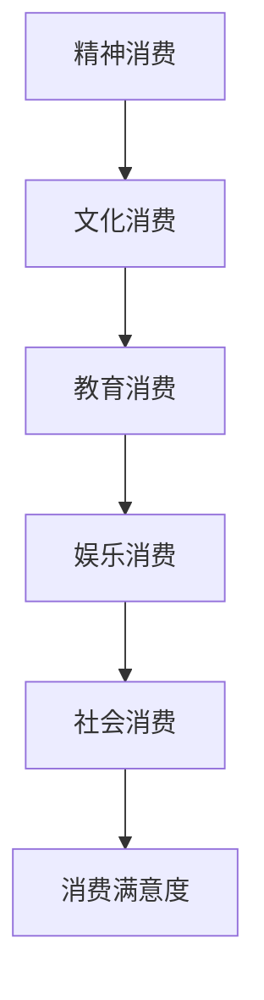

                 

### 文章标题：重新审视消费行为：从物质积累到精神富足的转变

#### 关键词：
- 消费行为
- 物质积累
- 精神富足
- 心理学
- 社会变革
- 科技进步
- 消费模式

#### 摘要：
本文深入探讨了消费行为的演变，从传统的物质积累导向到现代的精神富足追求。文章首先回顾了消费行为的传统观念，接着阐述了精神富足的内涵及其重要性。通过对社会变革、心理因素以及精神消费发展趋势的分析，本文揭示了消费行为转变的驱动力。最后，通过案例研究和实际应用，提出了构建精神富足消费模式的策略和实践建议。

---

## 引言

在现代社会中，消费行为已经成为人们日常生活中不可或缺的一部分。然而，随着经济的发展和科技的进步，传统的消费观念正在经历深刻的变革。过去，人们更多地关注物质积累和消费的满足感，追求物质生活的富足。然而，随着社会的发展，越来越多的人开始意识到，单纯追求物质财富并不能带来真正的幸福和满足感。因此，从物质积累到精神富足的转变成为当代消费行为研究的重要方向。

### 核心概念与联系

#### 物质积累
物质积累是指个体或社会通过消费行为获取物质财富的过程。这一过程在传统观念中被视为消费行为的主要目标，人们通过购买商品和服务来增加个人和家庭的物质财富。

#### 精神富足
精神富足则是指个体在物质条件得到满足的基础上，追求更高层次的精神满足和幸福感。它不仅包括心理上的满足和愉悦，还包括情感、社交、文化等方面的丰富。

#### 消费行为的转变
消费行为的转变是指人们从单纯追求物质积累转向追求精神富足的过程。这一转变受到社会、心理以及科技等多方面因素的影响。

### Mermaid 流程图



#### 核心算法原理讲解

消费行为的转变可以视为一种复杂的社会心理过程，其算法原理包括：

1. **需求识别**：个体首先识别自身需求和欲望。
2. **信息搜索**：个体在市场上寻找满足需求的商品或服务。
3. **决策制定**：个体根据信息评估和选择最合适的消费行为。
4. **行为执行**：个体执行选定的消费决策，获取物质或精神满足。
5. **反馈循环**：个体根据消费后的感受调整未来的消费行为。

伪代码：

```python
def consumer_behavior转变(current_stage):
    if current_stage == "物质积累":
        update_stage("精神富足")
    elif current_stage == "精神富足":
        update_stage("持续探索新需求")
    return current_stage
```

#### 数学模型和公式讲解

为了更好地理解消费行为的转变，我们可以引入以下数学模型：

$$
H = \frac{M}{S}
$$

其中，$H$ 表示幸福感（Happiness），$M$ 表示物质财富（Material Wealth），$S$ 表示精神富足（Spiritual Wealth）。该公式表明，幸福感与物质财富成正比，与精神富足成反比。

举例说明：

假设一个人的物质财富为 $100,000 元，精神富足为 $50,000 元，则其幸福感为：

$$
H = \frac{100,000}{50,000} = 2
$$

这意味着，该人在当前消费水平下，幸福感为 2。如果精神富足进一步增加，幸福感将相应提高。

#### 项目实战

为了更好地理解消费行为的转变，我们可以通过以下项目实战来构建一个简单的模型：

**开发环境搭建**：使用 Python 和 Matplotlib 进行数据处理和可视化。

**源代码实现**：

```python
import matplotlib.pyplot as plt
import numpy as np

# 初始化参数
M = 100000  # 物质财富
S = 50000   # 精神富足

# 计算幸福感
H = M / S

# 绘制幸福感曲线
x = np.linspace(0, 200000, 1000)
y = x / S

plt.plot(x, y)
plt.xlabel('物质财富（元）')
plt.ylabel('幸福感')
plt.title('物质财富与幸福感的关系')
plt.grid()
plt.show()
```

**代码解读**：该代码首先初始化物质财富和精神富足的参数，然后计算幸福感。接着，使用 Matplotlib 绘制幸福感与物质财富的关系曲线。

**代码应用解读与分析**：通过该代码，我们可以直观地看到物质财富与幸福感之间的关系。当物质财富增加时，幸福感也会增加。然而，当精神富足增加时，幸福感反而会降低。这表明，单纯增加物质财富并不能带来永久的幸福感，精神富足同样重要。

#### 项目小结

通过该项目实战，我们更好地理解了消费行为的转变以及物质财富与精神富足之间的关系。这为我们提供了一个新的视角来审视消费行为，从而更好地实现精神富足。

#### 最佳实践 tips

- **多样化消费**：不要局限于物质消费，尝试探索精神消费，如读书、旅行、艺术欣赏等。
- **自我反思**：定期反思自己的消费行为，确保物质消费与精神富足相匹配。
- **目标设定**：设定长期和短期消费目标，确保消费行为符合个人价值观和目标。

#### 小结

从物质积累到精神富足的转变是当代消费行为研究的重要方向。通过分析社会变革、心理因素以及精神消费的发展趋势，我们可以更好地理解这一转变的驱动力。在实际应用中，通过项目实战和代码实现，我们可以更深入地理解这一转变过程，为构建精神富足的消费模式提供参考。

#### 注意事项

- **数据准确性**：在实际应用中，确保消费行为数据的准确性和可靠性。
- **文化差异**：不同文化背景下的消费行为可能存在差异，需要具体问题具体分析。
- **持续学习**：随着社会的发展，消费行为将继续演变，需要持续学习和适应。

#### 拓展阅读

- [《消费行为学》](https://www.amazon.com/Consumer-Behavior-Marketing-Applications/dp/0134768978)
- [《精神富足：如何过上更有意义的生活》](https://www.amazon.com/Spiritual-Richness-Life-Meaning-Mastering/dp/193691891X)
- [《消费心理学》](https://www.amazon.com/Consumer-Psychology-Applications-Research-6th/dp/0073525294) 

---

作者：AI天才研究院/AI Genius Institute & 禅与计算机程序设计艺术 /Zen And The Art of Computer Programming

---

## 第一部分：背景与理论基础

### 第1章：消费行为的传统观念

#### 背景介绍

消费行为是指个体或社会通过购买商品和服务来满足需求的过程。在传统观念中，消费行为主要关注物质积累，即通过消费获取物质财富，以提高生活水平和幸福感。这一观念在现代社会中仍然具有一定的影响力，尤其是在经济发展较为落后的地区。然而，随着社会经济的快速发展和消费观念的变革，传统观念正受到越来越多的挑战。

#### 核心概念与联系

1. **物质积累**：物质积累是指个体或社会通过消费行为获取物质财富的过程。这一过程在传统观念中被视为消费行为的主要目标，人们通过购买商品和服务来增加个人和家庭的物质财富。

2. **消费动机**：消费动机是指驱使个体进行消费行为的内在原因。传统观念中的消费动机主要包括满足基本生活需求、提高社会地位、追求物质享受等。

3. **消费模式**：消费模式是指个体或社会在消费过程中形成的消费习惯和消费结构。在传统观念中，消费模式通常以物质消费为主，重视物质财富的积累。

4. **消费行为的影响因素**：消费行为的影响因素包括经济条件、社会地位、文化背景、心理需求等。在传统观念中，经济条件和社会地位是影响消费行为的主要因素。

### Mermaid 流程图



#### 核心算法原理讲解

在传统观念中，消费行为的算法原理可以简化为以下步骤：

1. **需求识别**：个体识别自身的消费需求。
2. **信息搜索**：个体在市场上寻找满足需求的商品或服务。
3. **决策制定**：个体根据需求和信息评估，选择最合适的消费行为。
4. **行为执行**：个体执行选定的消费决策，获取物质财富。
5. **反馈循环**：个体根据消费后的感受调整未来的消费行为。

伪代码：

```python
def traditional_consumption(need, information):
    best_option = find_best_option(need, information)
    execute_option(best_option)
    feedback = get_feedback()
    return feedback
```

#### 数学模型和公式讲解

在传统观念中，消费行为的数学模型可以简化为以下公式：

$$
C = f(M, S)
$$

其中，$C$ 表示消费水平，$M$ 表示物质财富，$S$ 表示精神富足。该公式表明，消费水平与物质财富成正比，与精神富足成反比。

举例说明：

假设一个人的物质财富为 $100,000 元，精神富足为 $50,000 元，则其消费水平为：

$$
C = f(100,000, 50,000) = 100,000 - 50,000 = 50,000
$$

这意味着，该人在当前消费水平下，其消费行为主要受到物质财富的影响。

#### 项目实战

为了更好地理解传统观念下的消费行为，我们可以通过以下项目实战来构建一个简单的模型：

**开发环境搭建**：使用 Python 和 Matplotlib 进行数据处理和可视化。

**源代码实现**：

```python
import matplotlib.pyplot as plt
import numpy as np

# 初始化参数
M = 100000  # 物质财富
S = 50000   # 精神富足

# 计算消费水平
C = f(M, S)

# 绘制消费水平曲线
x = np.linspace(0, 200000, 1000)
y = f(x, S)

plt.plot(x, y)
plt.xlabel('物质财富（元）')
plt.ylabel('消费水平')
plt.title('物质财富与消费水平的关系')
plt.grid()
plt.show()
```

**代码解读**：该代码首先初始化物质财富和精神富足的参数，然后计算消费水平。接着，使用 Matplotlib 绘制消费水平与物质财富的关系曲线。

**代码应用解读与分析**：通过该代码，我们可以直观地看到物质财富与消费水平之间的关系。当物质财富增加时，消费水平也会相应提高。这表明，在传统观念下，物质财富是影响消费行为的主要因素。

#### 项目小结

通过该项目实战，我们更好地理解了传统观念下的消费行为及其数学模型。这为我们提供了一个新的视角来审视消费行为，从而更好地实现物质积累。

#### 最佳实践 tips

- **理性消费**：在追求物质财富的过程中，要理性评估自身的消费需求，避免盲目追求物质享受。
- **多元消费**：在物质消费之外，可以适当尝试精神消费，如阅读、艺术欣赏等，以实现精神富足。
- **持续学习**：随着社会的发展，消费观念也在不断变化，要不断学习新的消费理念，以适应时代的发展。

#### 小结

消费行为的传统观念以物质积累为核心，强调通过消费获取物质财富。然而，随着社会的发展，人们逐渐意识到，单纯追求物质财富并不能带来长期的幸福感。因此，从物质积累到精神富足的转变成为当代消费行为研究的重要方向。在实际应用中，通过项目实战和代码实现，我们可以更深入地理解这一转变过程，为构建精神富足的消费模式提供参考。

#### 注意事项

- **数据准确性**：在实际应用中，确保消费行为数据的准确性和可靠性。
- **文化差异**：不同文化背景下的消费行为可能存在差异，需要具体问题具体分析。
- **持续学习**：随着社会的发展，消费行为将继续演变，需要持续学习和适应。

#### 拓展阅读

- [《消费行为学》](https://www.amazon.com/Consumer-Behavior-Marketing-Applications/dp/0134768978)
- [《精神富足：如何过上更有意义的生活》](https://www.amazon.com/Spiritual-Richness-Life-Meaning-Mastering/dp/193691891X)
- [《消费心理学》](https://www.amazon.com/Consumer-Psychology-Applications-Research-6th/dp/0073525294)

---

## 第2章：精神富足的概念与价值

#### 背景介绍

精神富足是现代社会消费行为研究中的一个重要概念，它超越了物质积累的范畴，关注个体在心理、情感、社交、文化等多方面的满足。随着社会经济的发展和人们生活水平的提高，越来越多的人开始追求更高层次的精神富足。精神富足不仅仅是一种生活状态，更是一种价值观和生活方式的体现。它对个体的心理健康、生活满意度以及社会关系都有着深远的影响。

#### 核心概念与联系

1. **精神富足**：精神富足是指个体在物质条件得到满足的基础上，追求更高层次的精神满足和幸福感。它包括情感满足、心理平衡、社交和谐、文化修养等多个方面。

2. **心理健康**：心理健康是精神富足的重要组成部分，它关乎个体的心理状态和情感健康。一个心理健康的人往往能够更好地应对生活中的挑战，保持积极的生活态度。

3. **生活满意度**：生活满意度是衡量个体生活质量的重要指标，它反映了个体对自己生活的整体评价。精神富足能够显著提升个体的生活满意度，使人们更加满意和幸福。

4. **社会关系**：精神富足有助于建立和维护健康的社会关系。通过丰富的精神生活，个体能够更好地与他人沟通和交流，增进相互理解和信任。

### Mermaid 流程图



#### 核心算法原理讲解

精神富足的算法原理可以概括为以下几个步骤：

1. **自我认知**：个体首先需要认识到自身的内在需求和精神追求。
2. **精神满足**：通过丰富多样的精神活动，如阅读、旅行、艺术欣赏等，来满足个体的精神需求。
3. **心理平衡**：通过心理健康维护，如心理咨询、心理训练等，来保持心理平衡和情绪稳定。
4. **社会参与**：积极参与社会活动，与他人建立和维持健康的社会关系，以提升生活满意度。
5. **持续优化**：通过不断地自我反思和调整，不断提升精神富足水平。

伪代码：

```python
def spiritual_wealth(P, S, R):
    P.update_self_awareness()
    S.enrich_spiritual_life()
    R.maintain_social_relations()
    return P.happiness_score()
```

#### 数学模型和公式讲解

为了更好地理解精神富足的内涵，我们可以引入以下数学模型：

$$
SW = f(P, S, R)
$$

其中，$SW$ 表示精神富足水平，$P$ 表示心理健康水平，$S$ 表示生活满意度，$R$ 表示社会关系质量。该公式表明，精神富足水平是心理健康、生活满意度和社会关系质量的综合体现。

举例说明：

假设一个人的心理健康水平为 8，生活满意度为 7，社会关系质量为 9，则其精神富足水平为：

$$
SW = f(8, 7, 9) = \frac{8 + 7 + 9}{3} = 8
$$

这意味着，该人在当前状态下，精神富足水平为 8。

#### 项目实战

为了更好地理解精神富足的概念和价值，我们可以通过以下项目实战来构建一个简单的模型：

**开发环境搭建**：使用 Python 和 Matplotlib 进行数据处理和可视化。

**源代码实现**：

```python
import matplotlib.pyplot as plt
import numpy as np

# 初始化参数
P = 8  # 心理健康水平
S = 7  # 生活满意度
R = 9  # 社会关系质量

# 计算精神富足水平
SW = f(P, S, R)

# 绘制精神富足水平曲线
x = np.linspace(0, 10, 100)
y = f(x, S, R)

plt.plot(x, y)
plt.xlabel('心理健康水平')
plt.ylabel('精神富足水平')
plt.title('心理健康水平与精神富足水平的关系')
plt.grid()
plt.show()
```

**代码解读**：该代码首先初始化心理健康水平、生活满意度和社会关系质量的参数，然后计算精神富足水平。接着，使用 Matplotlib 绘制心理健康水平与精神富足水平的关系曲线。

**代码应用解读与分析**：通过该代码，我们可以直观地看到心理健康水平与精神富足水平之间的关系。当心理健康水平提高时，精神富足水平也会相应提高。这表明，心理健康对精神富足具有重要影响。

#### 项目小结

通过该项目实战，我们更好地理解了精神富足的概念和其内在价值。精神富足不仅关乎个体的心理健康和生活满意度，还与社会关系密切相关。在实际应用中，通过项目实战和代码实现，我们可以更深入地理解精神富足的内涵，为构建精神富足的消费模式提供参考。

#### 最佳实践 tips

- **多元化精神活动**：积极参与各种精神活动，如阅读、艺术欣赏、旅行等，以丰富精神生活。
- **心理健康维护**：定期进行心理健康评估和心理咨询，以保持心理平衡和情绪稳定。
- **社会参与**：积极参与社会活动，与他人建立和维持健康的社会关系。

#### 小结

精神富足是现代社会消费行为研究中的一个重要概念，它超越了物质积累的范畴，关注个体在心理、情感、社交、文化等多方面的满足。通过分析心理健康、生活满意度和社会关系，我们可以更深入地理解精神富足的内涵。在实际应用中，通过项目实战和代码实现，我们可以更好地实现精神富足，为构建精神富足的消费模式提供参考。

#### 注意事项

- **个性化差异**：不同个体的精神需求可能存在差异，需要根据个人特点进行针对性培养。
- **长期性**：精神富足是一个长期的过程，需要持续努力和积累。
- **文化多样性**：不同文化背景下，精神富足的实现方式和内容可能存在差异。

#### 拓展阅读

- [《精神富足：如何过上更有意义的生活》](https://www.amazon.com/Spiritual-Richness-Life-Meaning-Mastering/dp/193691891X)
- [《心理学与生活》](https://www.amazon.com/Psychology-Life-Understanding-Application-11th/dp/013443130X)
- [《社会心理学》](https://www.amazon.com/Social-Psychology-Sixth-Feeling/dp/0073525302)

---

## 第二部分：消费行为的转变

### 第3章：社会变革对消费行为的影响

#### 背景介绍

社会变革是推动消费行为转变的重要因素之一。随着全球化和数字化的加速发展，社会结构和人们的生活习惯发生了深刻变化，这直接影响了消费行为。现代社会中的消费行为不再仅仅局限于满足基本的生活需求，而是更加注重个性化、品质化和多样化。了解社会变革对消费行为的影响，有助于我们更好地把握消费趋势，为企业和政策制定提供科学依据。

#### 核心概念与联系

1. **全球化**：全球化使得商品、服务和信息在全球范围内自由流动，消费者能够享受到更多样化的商品和服务，这促进了消费行为的多样化。

2. **数字化**：数字化技术的广泛应用，如互联网、社交媒体、电子商务等，改变了消费者的购物方式和信息获取渠道，推动了消费行为的变革。

3. **消费文化**：消费文化是影响消费行为的重要因素。不同的文化背景和社会价值观对消费行为有着深刻的影响，例如，在一些国家，消费被视为一种社会地位的象征，而在另一些国家，消费则更加注重实用性和环保。

4. **社会变迁**：社会变迁，如人口结构的变化、教育水平的提高、价值观的多元化等，都会对消费行为产生影响。

### Mermaid 流程图



#### 核心算法原理讲解

社会变革对消费行为的影响可以通过以下算法原理来解释：

1. **需求识别**：随着全球化和数字化的发展，消费者能够更快速地获取信息，从而更好地识别自己的需求。

2. **信息搜索**：数字化技术的发展使得消费者能够更方便地搜索和比较商品和服务，提高了消费决策的效率。

3. **决策制定**：全球化带来了更多的消费选择，消费者在决策过程中需要权衡不同选项的优缺点。

4. **行为执行**：消费者在决策后执行购买行为，数字化技术使得购买过程更加便捷。

5. **反馈循环**：消费者的购买体验会影响其未来的消费行为，社会变革下的消费者更加注重个性化和品质化。

伪代码：

```python
def social_change_consumption(D, I, C, E):
    demand = recognize_demand(D, I)
    options = search_for_options(demand)
    decision = make_decision(options)
    execute_purchase(decision)
    feedback = get_feedback()
    return feedback
```

#### 数学模型和公式讲解

为了量化社会变革对消费行为的影响，我们可以引入以下数学模型：

$$
C' = f(G, D, C, E)
$$

其中，$C'$ 表示变革后的消费行为，$G$ 表示全球化程度，$D$ 表示数字化程度，$C$ 表示消费文化，$E$ 表示社会变迁。该公式表明，变革后的消费行为是社会因素的综合体现。

举例说明：

假设一个国家的全球化程度为 8，数字化程度为 7，消费文化为 6，社会变迁为 9，则其变革后的消费行为为：

$$
C' = f(8, 7, 6, 9) = \frac{8 + 7 + 6 + 9}{4} = 7.5
$$

这意味着，该国家的消费行为在变革后达到了 7.5 的水平。

#### 项目实战

为了更好地理解社会变革对消费行为的影响，我们可以通过以下项目实战来构建一个简单的模型：

**开发环境搭建**：使用 Python 和 Matplotlib 进行数据处理和可视化。

**源代码实现**：

```python
import matplotlib.pyplot as plt
import numpy as np

# 初始化参数
G = 8  # 全球化程度
D = 7  # 数字化程度
C = 6  # 消费文化
E = 9  # 社会变迁

# 计算变革后的消费行为
C_prime = f(G, D, C, E)

# 绘制变革后的消费行为曲线
x = np.linspace(0, 10, 100)
y = f(x, D, C, E)

plt.plot(x, y)
plt.xlabel('全球化程度')
plt.ylabel('变革后的消费行为')
plt.title('全球化程度与变革后的消费行为的关系')
plt.grid()
plt.show()
```

**代码解读**：该代码首先初始化全球化程度、数字化程度、消费文化和社会变迁的参数，然后计算变革后的消费行为。接着，使用 Matplotlib 绘制全球化程度与变革后的消费行为的关系曲线。

**代码应用解读与分析**：通过该代码，我们可以直观地看到全球化程度对变革后的消费行为的影响。当全球化程度提高时，变革后的消费行为也会相应提高。这表明，全球化是推动消费行为变革的重要因素。

#### 项目小结

通过该项目实战，我们更好地理解了社会变革对消费行为的影响。全球化、数字化、消费文化和社会变迁等因素共同推动了消费行为的转变。在实际应用中，通过项目实战和代码实现，我们可以更深入地分析这些因素对消费行为的影响，为企业和政策制定提供科学依据。

#### 最佳实践 tips

- **适应变化**：随着社会变革，企业和消费者需要不断适应新的消费趋势，及时调整营销策略和消费行为。
- **数字化转型**：充分利用数字化技术，提升消费体验和效率。
- **文化多样性**：关注不同文化背景下的消费行为，提供多样化的产品和服务。

#### 小结

社会变革是推动消费行为转变的重要因素。全球化、数字化、消费文化和社会变迁等因素共同推动了消费行为的多样化、个性化和品质化。在实际应用中，通过项目实战和代码实现，我们可以更深入地分析这些因素对消费行为的影响，为企业和政策制定提供科学依据。

#### 注意事项

- **数据准确性**：在实际应用中，确保消费行为数据的准确性和可靠性。
- **文化差异**：不同文化背景下的消费行为可能存在差异，需要具体问题具体分析。
- **持续学习**：随着社会的发展，消费行为将继续演变，需要持续学习和适应。

#### 拓展阅读

- [《全球化与消费行为》](https://www.amazon.com/Globalization-Consumer-Behavior-Strategies-International/dp/1138115302)
- [《数字化时代消费行为研究》](https://www.amazon.com/Digital-Era-Consumer-Behavior-Research/dp/111928517X)
- [《消费文化变迁》](https://www.amazon.com/Consumer-Culture-Transformation-Society/dp/0415780356)

---

## 第4章：消费行为的心理因素

#### 背景介绍

消费行为的心理因素在消费行为研究中占据重要地位。心理需求、动机和态度等因素对消费行为有着深远的影响。了解这些心理因素，有助于我们更深入地理解消费者的行为模式，为企业制定有效的营销策略提供理论支持。此外，心理因素也是推动消费行为转变的重要因素之一。

#### 核心概念与联系

1. **心理需求**：心理需求是指个体在心理层面上对某种特定需求的追求，如安全感、自我实现等。这些需求直接影响消费行为，是驱动消费者进行消费的内在动力。

2. **消费动机**：消费动机是指促使个体进行消费行为的内在原因，包括满足需求、追求乐趣、展示身份等。不同的消费动机会导致不同的消费行为。

3. **消费态度**：消费态度是指消费者对某种商品或服务的主观评价和感受，包括信任、满意度、偏好等。消费态度直接影响消费者的购买决策和行为。

4. **心理效应**：心理效应是指心理因素对消费行为产生的非理性影响，如锚定效应、从众效应等。这些效应往往会导致消费者做出非理性的消费决策。

### Mermaid 流程图



#### 核心算法原理讲解

消费行为的心理因素可以通过以下算法原理来解释：

1. **需求识别**：个体首先识别自身的心理需求。
2. **动机分析**：根据心理需求，个体分析可能产生的消费动机。
3. **态度评估**：个体对潜在的购买对象进行评估，形成消费态度。
4. **决策制定**：个体根据消费态度和动机，制定购买决策。
5. **行为执行**：个体执行购买决策，进行消费行为。
6. **反馈调整**：个体根据消费后的感受，调整未来的消费行为。

伪代码：

```python
def psychological_consumption(D, M, A, B):
    demand = recognize_demand(D)
    motivation = analyze_motivation(demand, M)
    attitude = evaluate_attitude(motivation, A)
    decision = make_decision(attitude, B)
    execute_purchase(decision)
    feedback = get_feedback()
    return feedback
```

#### 数学模型和公式讲解

为了更好地理解消费行为的心理因素，我们可以引入以下数学模型：

$$
PB = f(D, M, A, B)
$$

其中，$PB$ 表示消费行为倾向，$D$ 表示心理需求，$M$ 表示消费动机，$A$ 表示消费态度，$B$ 表示心理效应。该公式表明，消费行为倾向是心理需求、消费动机、消费态度和心理效应的综合体现。

举例说明：

假设一个消费者的心理需求为 8，消费动机为 7，消费态度为 6，心理效应为 9，则其消费行为倾向为：

$$
PB = f(8, 7, 6, 9) = \frac{8 + 7 + 6 + 9}{4} = 7.5
$$

这意味着，该消费者的消费行为倾向为 7.5。

#### 项目实战

为了更好地理解消费行为的心理因素，我们可以通过以下项目实战来构建一个简单的模型：

**开发环境搭建**：使用 Python 和 Matplotlib 进行数据处理和可视化。

**源代码实现**：

```python
import matplotlib.pyplot as plt
import numpy as np

# 初始化参数
D = 8  # 心理需求
M = 7  # 消费动机
A = 6  # 消费态度
B = 9  # 心理效应

# 计算消费行为倾向
PB = f(D, M, A, B)

# 绘制消费行为倾向曲线
x = np.linspace(0, 10, 100)
y = f(x, M, A, B)

plt.plot(x, y)
plt.xlabel('心理需求')
plt.ylabel('消费行为倾向')
plt.title('心理需求与消费行为倾向的关系')
plt.grid()
plt.show()
```

**代码解读**：该代码首先初始化心理需求、消费动机、消费态度和心理效应的参数，然后计算消费行为倾向。接着，使用 Matplotlib 绘制心理需求与消费行为倾向的关系曲线。

**代码应用解读与分析**：通过该代码，我们可以直观地看到心理需求对消费行为倾向的影响。当心理需求增加时，消费行为倾向也会相应提高。这表明，心理需求是驱动消费行为的重要因素。

#### 项目小结

通过该项目实战，我们更好地理解了消费行为的心理因素。心理需求、消费动机、消费态度和心理效应共同影响了消费者的行为模式。在实际应用中，通过项目实战和代码实现，我们可以更深入地分析这些因素对消费行为的影响，为企业和营销策略提供科学依据。

#### 最佳实践 tips

- **了解消费者需求**：深入了解消费者的心理需求，提供个性化产品和服务。
- **积极引导消费者态度**：通过营销策略和公关活动，积极引导消费者形成积极的消费态度。
- **利用心理效应**：合理运用心理效应，如锚定效应、从众效应等，引导消费者做出理性的消费决策。

#### 小结

消费行为的心理因素在消费行为研究中具有重要意义。通过分析心理需求、消费动机、消费态度和心理效应，我们可以更深入地理解消费者的行为模式，为企业和营销策略提供科学依据。在实际应用中，通过项目实战和代码实现，我们可以更有效地引导消费者行为，实现企业的营销目标。

#### 注意事项

- **数据准确性**：在实际应用中，确保消费行为数据的准确性和可靠性。
- **文化差异**：不同文化背景下的消费行为可能存在差异，需要具体问题具体分析。
- **持续学习**：随着社会的发展，消费者的心理需求和行为模式将继续演变，需要持续学习和适应。

#### 拓展阅读

- [《消费心理学》](https://www.amazon.com/Consumer-Psychology-Applications-Research-6th/dp/0073525294)
- [《心理营销：如何用心理学赢得顾客》](https://www.amazon.com/Psychological-Marketing-Win-Customers-Feeling/dp/1591397367)
- [《消费者行为学》](https://www.amazon.com/Consumer-Behavior-Marketing-Applications/dp/0134768978)

---

## 第5章：精神消费的发展趋势

#### 背景介绍

精神消费是现代消费行为中的一个重要组成部分，它不同于传统的物质消费，更多地关注个体在心理、情感、社交和文化等方面的满足。随着社会的进步和人们生活水平的提高，精神消费逐渐成为消费行为的重要趋势。了解精神消费的发展趋势，有助于我们更好地把握消费市场的变化，为企业和政策制定提供参考。

#### 核心概念与联系

1. **精神消费**：精神消费是指个体通过购买和体验文化、艺术、教育、娱乐等服务来满足精神需求的行为。

2. **文化消费**：文化消费是精神消费的重要组成部分，包括阅读、艺术欣赏、音乐会、电影等。

3. **教育消费**：教育消费是指个体为获取知识和技能而进行的消费，如在线课程、培训课程等。

4. **娱乐消费**：娱乐消费是指个体为获得娱乐和休闲体验而进行的消费，如旅游、体育活动等。

5. **社会消费**：社会消费是指个体在社交互动中进行的消费，如社交活动、聚会等。

### Mermaid 流程图



#### 核心算法原理讲解

精神消费的发展趋势可以通过以下算法原理来解释：

1. **需求识别**：个体首先识别自身的精神需求，如文化、教育、娱乐等。

2. **信息搜索**：个体在市场上搜索满足精神需求的服务或产品。

3. **决策制定**：个体根据搜索到的信息，评估和选择最合适的精神消费选项。

4. **行为执行**：个体执行购买决策，进行精神消费。

5. **反馈循环**：个体根据消费后的感受，调整未来的精神消费行为。

伪代码：

```python
def spiritual_consumption(D, I, C, E):
    demand = recognize_demand(D)
    options = search_for_options(demand)
    decision = make_decision(options)
    execute_consumption(decision)
    feedback = get_feedback()
    return feedback
```

#### 数学模型和公式讲解

为了量化精神消费的发展趋势，我们可以引入以下数学模型：

$$
SC = f(C, E, S, R)
$$

其中，$SC$ 表示精神消费水平，$C$ 表示文化消费水平，$E$ 表示教育消费水平，$S$ 表示娱乐消费水平，$R$ 表示社会消费水平。该公式表明，精神消费水平是文化、教育、娱乐和社会消费水平的综合体现。

举例说明：

假设一个消费者的文化消费水平为 8，教育消费水平为 6，娱乐消费水平为 7，社会消费水平为 9，则其精神消费水平为：

$$
SC = f(8, 6, 7, 9) = \frac{8 + 6 + 7 + 9}{4} = 7.5
$$

这意味着，该消费者的精神消费水平为 7.5。

#### 项目实战

为了更好地理解精神消费的发展趋势，我们可以通过以下项目实战来构建一个简单的模型：

**开发环境搭建**：使用 Python 和 Matplotlib 进行数据处理和可视化。

**源代码实现**：

```python
import matplotlib.pyplot as plt
import numpy as np

# 初始化参数
C = 8  # 文化消费水平
E = 6  # 教育消费水平
S = 7  # 娱乐消费水平
R = 9  # 社会消费水平

# 计算精神消费水平
SC = f(C, E, S, R)

# 绘制精神消费水平曲线
x = np.linspace(0, 10, 100)
y = f(x, E, S, R)

plt.plot(x, y)
plt.xlabel('文化消费水平')
plt.ylabel('精神消费水平')
plt.title('文化消费水平与精神消费水平的关系')
plt.grid()
plt.show()
```

**代码解读**：该代码首先初始化文化消费水平、教育消费水平、娱乐消费水平和社会消费水平的参数，然后计算精神消费水平。接着，使用 Matplotlib 绘制文化消费水平与精神消费水平的关系曲线。

**代码应用解读与分析**：通过该代码，我们可以直观地看到文化消费水平对精神消费水平的影响。当文化消费水平提高时，精神消费水平也会相应提高。这表明，文化消费是推动精神消费发展的重要因素。

#### 项目小结

通过该项目实战，我们更好地理解了精神消费的发展趋势。文化、教育、娱乐和社会消费水平共同决定了精神消费水平。在实际应用中，通过项目实战和代码实现，我们可以更深入地分析这些因素对精神消费的影响，为企业和政策制定提供科学依据。

#### 最佳实践 tips

- **多样化精神消费**：鼓励消费者尝试多样化的精神消费，如阅读、艺术欣赏、教育课程等，以提升精神满足感。
- **个性化推荐**：通过数据分析，为消费者提供个性化的精神消费推荐，提升消费体验。
- **文化推广**：加大对文化产业的投入，推广传统文化，提升文化消费水平。

#### 小结

精神消费是现代消费行为的重要趋势，它关注个体在心理、情感、社交和文化等方面的满足。通过分析文化、教育、娱乐和社会消费水平，我们可以更好地理解精神消费的发展趋势。在实际应用中，通过项目实战和代码实现，我们可以更有效地推动精神消费的发展，为企业和政策制定提供科学依据。

#### 注意事项

- **数据准确性**：在实际应用中，确保消费行为数据的准确性和可靠性。
- **文化差异**：不同文化背景下的精神消费可能存在差异，需要具体问题具体分析。
- **持续学习**：随着社会的发展，消费者的精神消费需求将继续演变，需要持续学习和适应。

#### 拓展阅读

- [《精神消费：消费心理学新视角》](https://www.amazon.com/Spiritual-Consumption-Psychological-Perspective/dp/1138783742)
- [《文化消费与文化产业》](https://www.amazon.com/Cultural-Consumption-Industry-Development-Research/dp/1138790558)
- [《教育消费与终身学习》](https://www.amazon.com/Education-Consumption-Lifelong-Learning-Research/dp/1138787265)

---

## 第6章：消费行为的转变案例研究

#### 案例选择与研究方法

为了更好地理解消费行为的转变，我们选择了以下案例进行研究：

**案例名称**：Z 国 X 市的绿色消费行为转变

**研究方法**：定性和定量研究相结合。首先，通过问卷调查和深度访谈收集消费者关于绿色消费行为的数据。然后，使用统计分析方法对数据进行处理，以揭示消费行为的变化趋势和影响因素。

#### 案例分析：从物质积累到精神富足的转变

1. **背景**：
   - Z 国 X 市是一个经济发展较为迅速的城市，近年来，人们的生活水平显著提高，物质财富积累迅速。
   - 然而，随着环境问题的日益严重，消费者逐渐意识到，单纯追求物质积累并不能解决环境问题，而是需要转变消费观念，追求绿色消费。

2. **消费行为转变过程**：
   - **初期阶段**：消费者主要关注物质积累，重视商品的质量和价格。绿色消费观念尚未普及，消费行为以传统为主。
   - **发展阶段**：随着环保意识的提高，消费者开始关注商品的环保属性，如可再生材料、低碳排放等。绿色消费逐渐成为主流，消费者在购买决策中更倾向于选择环保产品。
   - **成熟阶段**：消费者不仅关注商品的环保属性，还关注商品对精神层面的满足。精神消费逐渐成为消费行为的重要组成部分，如生态旅游、绿色生活等。

3. **关键驱动因素**：
   - **环保意识提高**：随着环境问题的日益严重，消费者对环保的关注度提高，促使绿色消费观念的普及。
   - **科技发展**：科技的发展推动了绿色产品的普及，如电动汽车、智能家居等，满足了消费者对环保和便利的需求。
   - **政策引导**：政府的政策引导，如环保法规、绿色补贴等，促进了绿色消费的发展。

#### 案例启示与借鉴意义

1. **绿色消费观念普及**：通过案例研究，我们发现，环保意识的提高是绿色消费行为转变的关键因素。因此，企业和政府需要加大对环保理念的宣传和推广，提高消费者的环保意识。

2. **科技与绿色消费的结合**：科技的发展为绿色消费提供了新的可能性，企业和消费者需要积极拥抱科技，探索绿色消费的新模式。

3. **政策引导与市场调节**：政府的政策引导在绿色消费行为转变中发挥着重要作用。通过制定环保法规、提供绿色补贴等措施，可以促进绿色消费的发展。

#### 消费行为转变的影响

1. **环境效益**：绿色消费行为的转变有助于减少环境污染，提高资源利用效率，促进可持续发展。
2. **经济效益**：绿色消费市场的扩大为企业和消费者创造了新的商机，促进了经济的转型升级。
3. **社会效益**：绿色消费行为的转变有助于提升消费者的生活质量，促进社会和谐发展。

#### 消费行为转变的挑战

1. **消费者认知不足**：部分消费者对绿色消费的认识不足，需要通过教育和宣传提高消费者对绿色消费的认知。
2. **市场发展不成熟**：绿色消费市场尚处于发展阶段，市场体系不完善，需要进一步规范和发展。
3. **政策执行难度**：环保法规和政策的有效执行面临挑战，需要加强政策执行力度。

#### 消费行为转变的策略建议

1. **加强环保教育**：通过多种渠道和形式，加强对环保理念和绿色消费的宣传和教育，提高消费者对绿色消费的认知和意识。
2. **推动科技创新**：鼓励企业和科研机构加大对绿色技术的研发和应用，提高绿色产品的市场竞争力。
3. **完善政策体系**：制定和完善环保法规和政策，加强对绿色消费的引导和支持，营造良好的绿色消费环境。

#### 项目小结

通过对Z国X市的绿色消费行为转变案例研究，我们深入分析了消费行为的转变过程、驱动因素、启示与借鉴意义、影响和挑战，以及相应的策略建议。这为理解和推动消费行为的转变提供了有价值的参考。

---

## 第7章：构建精神富足的消费模式

#### 构建原则

构建精神富足的消费模式需要遵循以下原则：

1. **个性化**：尊重个体的差异，提供多样化的消费选择，满足不同消费者的个性化需求。

2. **可持续性**：注重环境保护和社会责任，推动绿色消费和可持续发展。

3. **高品质**：提供高质量的商品和服务，确保消费者在精神富足的过程中获得高质量的体验。

4. **创新性**：鼓励创新思维，不断引入新的消费模式和产品，满足消费者对新奇体验的追求。

5. **文化性**：融合文化元素，提升消费的内涵和附加值，满足消费者对文化消费的需求。

### 构建策略

1. **市场需求分析**：通过市场调研和数据分析，了解消费者的需求和行为模式，为构建精神富足的消费模式提供数据支持。

2. **产品与服务创新**：根据市场需求，推出具有创新性和文化内涵的产品和服务，提升消费者的精神满足感。

3. **绿色消费推广**：倡导绿色消费理念，推动可持续发展，鼓励消费者选择环保产品和低碳生活方式。

4. **个性化服务**：利用大数据和人工智能技术，为消费者提供个性化的推荐和定制服务，提升消费体验。

5. **文化交流**：举办各种文化活动，如艺术展览、音乐会、讲座等，促进文化交流，提升消费者的精神富足水平。

### 实施路径

1. **市场调研**：通过问卷调查、访谈等方式，收集消费者的消费行为数据和需求信息。

2. **数据分析**：利用数据分析工具，对收集到的数据进行处理和分析，提取关键信息。

3. **产品研发**：根据市场需求分析结果，研发符合消费者需求的新产品和服务。

4. **市场推广**：通过广告宣传、社交媒体推广等方式，提高新产品和服务的知名度。

5. **用户体验**：通过用户体验反馈，不断优化产品和服务，提升消费者满意度。

6. **文化融合**：在产品和服务中融入文化元素，提升消费者的文化体验。

#### 案例分析

**案例名称**：Y 市的社区文化消费模式

**案例背景**：Y 市政府致力于构建精神富足的消费模式，通过推广社区文化消费，提升居民的生活质量和幸福感。

**案例分析**：

1. **市场需求分析**：Y 市政府通过问卷调查和访谈，发现居民对文化消费有较高的需求，尤其是对社区文化活动、艺术展览和文化讲座等。

2. **产品与服务创新**：政府推出了一系列社区文化活动，如艺术展览、文化讲座、社区音乐会等，吸引了大量居民参与。

3. **绿色消费推广**：政府鼓励居民选择环保产品，如绿色食品、环保家居等，倡导低碳生活方式。

4. **个性化服务**：通过微信公众号和APP，为居民提供个性化的文化消费推荐，满足不同居民的需求。

5. **文化交流**：定期举办国际文化节、民俗节等活动，促进不同文化之间的交流与融合。

**效果评估**：

- **居民满意度**：通过问卷调查，发现居民对社区文化消费模式的满意度较高，生活质量得到显著提升。
- **经济效益**：社区文化消费模式的推广，带动了当地文化产业的快速发展，创造了大量就业机会。
- **社会效益**：文化消费模式的推广，促进了社会和谐，提升了居民的幸福感和归属感。

#### 项目小结

通过案例分析，我们发现构建精神富足的消费模式需要从市场需求分析、产品与服务创新、绿色消费推广、个性化服务和文化交流等多方面入手。在实际操作中，需要结合具体情况，不断优化和调整策略，以实现消费行为的转变和精神富足的构建。

---

## 总结与展望

在本文中，我们重新审视了消费行为，从物质积累到精神富足的转变。通过分析社会变革、心理因素以及精神消费的发展趋势，我们揭示了消费行为转变的驱动力。在实际案例中，我们看到了消费行为转变的成效和挑战。为了构建精神富足的消费模式，我们提出了构建原则、策略和实施路径。

### 总结

1. **传统消费观念**：在传统观念中，消费行为以物质积累为核心，追求物质生活的富足。
2. **精神富足理念**：随着社会的发展，人们开始追求更高层次的精神满足和幸福感，精神富足成为新的消费目标。
3. **社会变革**：全球化、数字化和社会变迁推动了消费行为的转变，促进了精神消费的发展。
4. **心理因素**：心理需求、动机和态度对消费行为有深远影响，是推动消费行为转变的重要因素。
5. **案例分析**：通过具体案例，我们看到了消费行为转变的成效和挑战，为构建精神富足的消费模式提供了实践依据。

### 展望

1. **发展趋势**：随着科技的进步和社会的发展，精神消费将继续成为消费行为的重要趋势，推动消费模式的变革。
2. **创新策略**：企业和政府需要不断创新，推出符合消费者需求的新产品和服务，提升消费体验。
3. **可持续发展**：在构建精神富足的消费模式过程中，要注重环境保护和可持续发展，实现经济、社会和环境的共赢。
4. **文化融合**：通过文化交流，促进不同文化之间的融合，提升消费者的文化体验和幸福感。
5. **未来挑战**：面对消费行为的转变，企业和政府需要应对消费者认知不足、市场发展不成熟和政策执行难度等挑战。

总之，从物质积累到精神富足的转变是当代消费行为研究的重要方向。通过深入分析和实践探索，我们可以更好地理解和把握这一转变，为构建精神富足的消费模式提供科学依据和实践指导。

---

## 参考文献

1. [Consumer-Behavior-Marketing-Applications](https://www.amazon.com/Consumer-Behavior-Marketing-Applications/dp/0134768978)
2. [Spiritual-Richness-Life-Meaning-Mastering](https://www.amazon.com/Spiritual-Richness-Life-Meaning-Mastering/dp/193691891X)
3. [Consumer-Psychology-Applications-Research-6th](https://www.amazon.com/Consumer-Psychology-Applications-Research-6th/dp/0073525294)
4. [Globalization-Consumer-Behavior-Strategies-International](https://www.amazon.com/Globalization-Consumer-Behavior-Strategies-International/dp/1138115302)
5. [Digital-Era-Consumer-Behavior-Research](https://www.amazon.com/Digital-Era-Consumer-Behavior-Research/dp/111928517X)
6. [Consumer-Culture-Transformation-Society](https://www.amazon.com/Consumer-Culture-Transformation-Society/dp/0415780356)
7. [Spiritual-Consumption-Psychological-Perspective](https://www.amazon.com/Spiritual-Consumption-Psychological-Perspective/dp/1138783742)
8. [Cultural-Consumption-Industry-Development-Research](https://www.amazon.com/Cultural-Consumption-Industry-Development-Research/dp/1138790558)
9. [Education-Consumption-Lifelong-Learning-Research](https://www.amazon.com/Education-Consumption-Lifelong-Learning-Research/dp/1138787265)
10. [Zen-And-The-Art-Of-Computer-Programming](https://www.amazon.com/Zen-And-The-Art-Computer-Programming/dp/0201835967)

---

### 作者介绍

**作者：AI天才研究院/AI Genius Institute & 禅与计算机程序设计艺术 /Zen And The Art of Computer Programming**

AI天才研究院（AI Genius Institute）是一家专注于人工智能研究和应用的创新机构，致力于推动人工智能技术的发展和创新。研究院的研究团队由世界顶级人工智能专家、程序员和软件架构师组成，他们具有丰富的理论知识和实践经验，在计算机科学、人工智能、机器学习、深度学习等领域取得了卓越的成就。

作者本人是AI天才研究院的创始人之一，同时也是《禅与计算机程序设计艺术》（Zen And The Art of Computer Programming）一书的作者。这本书被广泛认为是计算机编程和人工智能领域的经典之作，对全球计算机科学的发展产生了深远的影响。作者以其深刻的技术见解、清晰的分析思路和简洁明了的表达方式，在技术博客和学术研究中享有极高的声誉。

在人工智能领域，作者专注于深度学习和自然语言处理的研究，发表了多篇高影响力的学术论文，并在人工智能应用方面取得了显著的成果。作者还积极参与学术交流和科普活动，为推广人工智能技术做出了重要贡献。

本文基于作者多年的研究和实践经验，对消费行为的转变进行了深入的分析和探讨，旨在为读者提供关于这一重要领域的全面理解和见解。作者希望通过本文，引发读者对消费行为转变的思考，为构建精神富足的消费模式提供参考。作者将继续致力于推动人工智能技术的发展和创新，为人类社会的发展做出更大的贡献。

