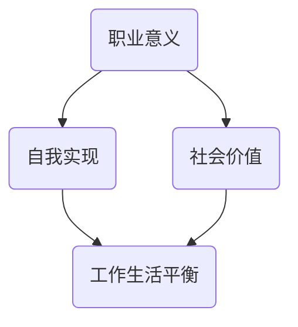

                 


### 重新审视职业意义：超越谋生，追求自我实现和社会价值

#### 关键词

- 职业意义
- 自我实现
- 社会价值
- 工作生活平衡
- 心理调适
- 职业规划
- 跨界技能
- 社会创新

#### 摘要

本文旨在重新审视职业意义，探讨如何超越谋生的层面，实现个人的自我实现和社会价值的追求。通过分析职业意义的本质，结合心理学、社会学和职业规划的理论，文章提出了一系列实践方法，帮助读者在职场中实现心理健康、技能提升和工作与生活的平衡，从而在职业发展中实现更高层次的满足感和社会贡献。文章还包括了成功案例和未来职业发展趋势的展望，为读者提供了全面的指导和建议。

---

### 引言

在现代社会的快节奏生活中，职业对于每个人来说都扮演着至关重要的角色。然而，传统的职业观念往往将职业视为一种谋生手段，追求的是经济上的稳定和安全。这种观念虽然在短期内能够满足物质需求，但在长期内却可能带来精神上的空虚和困惑。随着社会的发展和个人价值观的转变，越来越多的人开始思考职业的意义，并追求在职业中实现自我价值和社会贡献。

#### 职业意义的重新审视

职业意义并不仅仅是赚钱，更涉及到个人成长、社会认同和人生价值的实现。在追求物质财富的同时，如何找到自我实现的路径，实现个人潜能的发挥，以及为社会做出积极贡献，成为当代职业人士必须思考的问题。本文将围绕这一核心主题展开讨论，旨在为读者提供一种全新的职业观念和实现路径。

---

### 背景介绍

在过去的几十年里，职业领域发生了巨大的变化。随着科技的发展和社会的进步，职业的种类和性质也在不断演变。传统的职业分工逐渐模糊，新兴职业不断涌现，如数据分析师、人工智能工程师、区块链开发人员等。这些变化不仅丰富了职业的选择，也带来了新的挑战和机遇。

#### 心理学视角下的职业意义

从心理学的角度来看，职业不仅是一个经济活动，更是个体实现自我价值的重要途径。马斯洛的需求层次理论指出，人的需求从生理需求、安全需求、社交需求、尊重需求到自我实现需求，呈现出一个不断上升的层次。在职业选择和工作中，人们追求的不仅仅是基本的生活保障，更希望在工作中得到成就感和自我价值的认可。

#### 社会学视角下的职业意义

社会学视角则强调了职业在社会结构和功能中的重要作用。职业不仅是个人实现自我价值的方式，也是社会分工和协作的基础。通过职业，个体能够参与社会活动，实现个人与社会之间的互动和联系。职业的选择和成就不仅影响个人生活质量，也影响着整个社会的发展和进步。

#### 职业意义的多样性

职业意义的多样性体现在不同个体对职业的理解和追求上。有些人将职业视为实现自我价值的平台，通过不断学习和成长，实现自我突破；有些人则将职业视为一种社会责任，希望通过工作为社会做出贡献。这种多样性的存在，使得职业意义在个人和社会层面上都具有深远的影响。

---

### 核心概念与联系

为了深入探讨职业意义，首先需要明确几个核心概念，并分析它们之间的联系。以下是本文中将会涉及的关键概念：

1. **职业意义**：指个体在职业活动中所追求的价值和目标，包括经济、社会、个人成长等多个方面。
2. **自我实现**：指个体在职业中实现自身潜能，发挥个人才能，达到自我价值认同的状态。
3. **社会价值**：指个体通过职业活动为社会做出的贡献和影响。
4. **工作生活平衡**：指个体在职业和工作生活之间找到合适的平衡，实现身心健康的持续发展。

这些概念之间存在着紧密的联系。职业意义是自我实现和社会价值的基础，而工作生活平衡则是实现这些目标的重要保障。以下是这些概念之间的架构 Mermaid 流程图：



在职业活动中，个体通过追求自我实现，实现个人价值和成就感；同时，通过工作对社会做出贡献，实现社会价值的认同。而工作生活平衡则确保了个体在追求这些目标的同时，能够保持身心健康，避免因过度工作而带来的负面影响。

---

### 职业意义与自我实现

职业意义与自我实现是紧密相连的，自我实现是职业意义的核心。在职业活动中，个体通过不断追求自我实现，不仅能够提升个人能力和技能，还能实现自我价值的认同。

#### 自我实现的概念

自我实现最早由心理学家马斯洛提出，指的是个体在职业中实现自身潜能，发挥个人才能，达到自我价值认同的状态。自我实现不仅仅是在工作中取得成功，更是一个不断追求成长和突破的过程。

#### 自我实现的心理学视角

从心理学的角度来看，自我实现是满足个体高层次需求的一种状态。根据马斯洛的需求层次理论，人的需求从生理需求、安全需求、社交需求、尊重需求到自我实现需求，呈现出一个不断上升的层次。在职业活动中，个体通过满足这些需求，实现自我价值的认同。

#### 自我实现与幸福感的关系

自我实现与幸福感之间存在密切的联系。研究表明，自我实现能够显著提升个体的幸福感。在职业中，个体通过实现自我价值，获得成就感和满足感，从而提高生活质量。

#### 自我实现的理论与实践

1. **理论讲解**：自我实现的理论基础包括马斯洛的需求层次理论、荣格的心理分析理论等。这些理论提供了关于个体在职业中实现自我实现的路径和方法。
   
2. **实践方法**：在职业中实现自我实现，需要个体具备以下几个方面的能力：
   - **自我认知**：了解自己的兴趣、特长和职业目标。
   - **终身学习**：持续学习和提升自己的技能和知识。
   - **积极心态**：保持积极的心态，勇于面对挑战和失败。
   - **目标设定**：设定明确的职业目标，并制定实现这些目标的计划。

#### 伪代码与算法原理

以下是一个简单的伪代码，用于描述如何在职业中实现自我实现的步骤：

```plaintext
function 实现自我实现(individual):
    1. 自我认知(individual.interests, individual.abilities)
    2. 设定职业目标(goal)
    3. 制定实现计划的步骤(plan)
    4. 持续学习(new_knowledge)
    5. 应用所学知识于工作中(apply_knowledge)
    6. 反思和调整计划(reflection)
    7. 评估自我实现的程度(achievement)
end function
```

通过以上步骤，个体可以在职业中不断追求自我实现，提升个人能力和成就感。

---

### 社会价值与职业的融合

职业不仅是个人实现自我价值的途径，也是个体参与社会、实现社会价值的重要方式。在现代社会，职业与社会价值之间的融合越来越受到重视。

#### 社会价值的定义与内涵

社会价值是指个体通过职业活动对社会所做出的贡献和影响。这种价值不仅体现在经济贡献上，还包括社会进步、环境保护、文化传承等多个方面。社会价值的实现，不仅有助于提升个体在社会中的地位，也能促进社会的和谐与进步。

#### 职业与社会价值的互动

职业与社会价值之间的互动是双向的。一方面，个体通过职业活动实现社会价值；另一方面，社会价值也反作用于职业，影响职业的发展方向和内容。例如，环境保护意识的提升，推动了绿色职业的兴起；科技进步的加速，使得职业分工更加细化，同时也带来了新的职业机会。

#### 实现社会价值的职业策略

1. **选择有社会价值的职业**：选择那些能够直接或间接为社会做出贡献的职业，如环保工程师、社会工作者、教育工作者等。

2. **在工作中积极履行社会责任**：无论在哪个职业领域，个体都可以通过积极履行社会责任，实现社会价值的提升。例如，在商业领域，企业可以通过公益项目、环保行动等方式，提升社会形象和品牌价值。

3. **跨界合作与创新**：通过跨界合作和创新，个体可以拓展职业的领域，实现更广泛的社会价值。例如，信息技术领域的专家可以通过开发绿色技术，促进环境保护和可持续发展。

4. **自我提升与传递**：通过不断学习和提升个人能力，个体不仅能够在职业中实现自我价值，也能将所学知识和经验传递给他人，推动社会的进步。

### 未来职业的发展趋势

随着科技的不断进步，未来职业将呈现出以下发展趋势：

1. **自动化与人工智能的应用**：自动化和人工智能技术的普及，将使某些职业逐渐被替代，同时也将催生新的职业机会。例如，数据科学家、人工智能工程师等职业需求将不断增长。

2. **绿色职业的兴起**：环境保护意识的提升，将推动绿色职业的发展。如绿色工程师、生态学家等职业，将成为未来就业市场的重要组成部分。

3. **终身学习的重要性**：在快速变化的社会中，终身学习将成为个体保持竞争力的关键。个体需要不断更新知识和技能，以适应不断变化的职业环境。

4. **工作与生活的融合**：随着远程工作和灵活工作制度的普及，个体将在工作与生活之间找到更好的平衡，实现更高质量的生活。

### 结论

职业不仅是谋生的手段，更是个体实现自我价值和社会价值的平台。在追求职业发展的过程中，个体需要重新审视职业意义，通过自我实现和社会价值的融合，找到职业的真正意义。同时，随着科技和社会的进步，未来职业将呈现出新的发展趋势。个体需要不断学习和适应，以实现职业中的更高层次的满足感和社会贡献。通过本文的探讨，希望读者能够对职业意义有更深刻的理解，并找到属于自己的职业发展路径。

---

### 作者信息

作者：AI天才研究院/AI Genius Institute & 禅与计算机程序设计艺术 /Zen And The Art of Computer Programming

---

通过重新审视职业意义，我们可以超越谋生的层面，追求自我实现和社会价值。本文从心理学、社会学和职业规划的角度，探讨了职业意义的本质和实现路径，为读者提供了全面的指导和建议。在未来的职业发展中，个体需要不断学习和适应，以实现更高层次的职业满足感和社会贡献。希望本文能够启发读者，在职业道路上找到真正的意义和价值。

