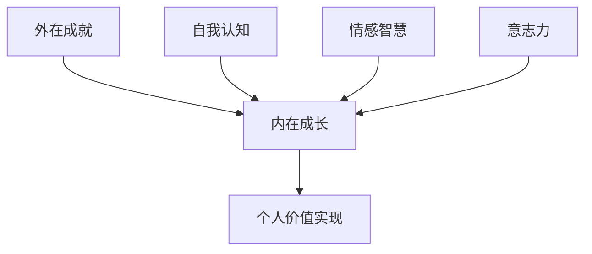
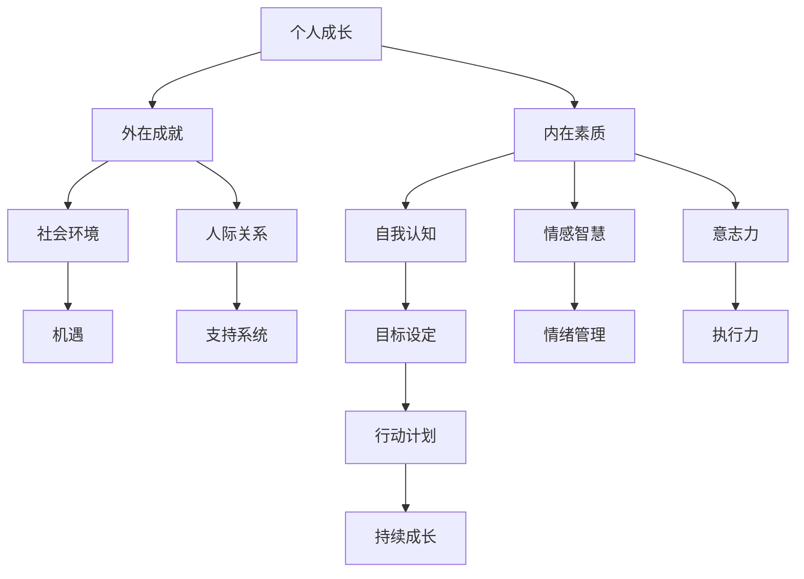

                 

# 重新思考个人成长：从外在成就到内在成熟的蜕变

## 关键词
个人成长、内在成熟、外在成就、自我认知、情感智慧、目标设定、社交关系、成长挑战

## 摘要
本文将深入探讨个人成长的内在探索与外在成就的平衡，重塑成长观念，分析内在成长的基石和方法，以及如何从外在成就过渡到内在成熟。通过流程图、伪代码、数学公式和代码实例，全面解析个人成长的路径，为读者提供实用的成长策略与思考。

## 第一部分：个人成长的内在探索

### 第1章：成长观念的重塑

#### 1.1.1 重新定义个人成长

个人成长不仅仅是外在成就的积累，更是内在素质的提升。外在成就如财富、地位、荣誉等，往往是个人努力和社会环境共同作用的结果。然而，真正的成长在于内心世界的丰富和心智的成熟。

**核心概念与联系**

**Mermaid 流程图：**



**伪代码：**

```python
def redefine_growth(outer_achievement, inner_growths):
    inner_growths.extend([self_cognition, emotional_intelligence, willpower])
    personal_value = sum(outer_achievement + inner_growths)
    return personal_value
```

#### 1.1.2 成长的内外动力

个人成长的动力来源于内在和外在两个方面。内在动力包括自我认知、情感智慧和意志力，它们驱动个体不断探索和超越自我。外在动力则来自社会环境、人际关系和机遇等，为个人成长提供支持和挑战。

**数学模型：**

**成长速率公式：**

$$
\frac{dC}{dt} = k \cdot (O - C)
$$

其中，$C$ 表示个人成长程度，$O$ 表示外在环境因素，$k$ 为成长速率常数。

**详细讲解与举例说明：**

个人成长程度（$C$）随着外在环境因素（$O$）的增加而提高，当个人成长程度（$C$）超过外在环境因素（$O$）时，成长速率（$k$）将趋于稳定。

例如，一个软件工程师（$C$）在优秀的团队环境中（$O$）工作，他的成长速率（$k$）将显著提升，从而实现更快的个人成长。

#### 1.1.3 成长与自我认知

自我认知是个人成长的基础，它帮助个体了解自己的优势、劣势、兴趣和价值观。通过自我认知，个体能够设定合适的目标，调整行为，实现自我提升。

**数学公式：**

**自我认知评估公式：**

$$
S = f(W, H, E)
$$

其中，$S$ 表示自我认知水平，$W$ 表示个人优势，$H$ 表示个人兴趣，$E$ 表示个人价值观。

**详细讲解与举例说明：**

一个软件工程师（$S$）通过分析自己的优势（$W$，如编程能力）、兴趣（$H$，如算法研究）和价值观（$E$，如创新精神），能够更准确地评估自己的自我认知水平，并据此设定职业发展目标。

## 第二部分：外在成就与内在成熟的平衡

### 第4章：外在成就的取得

#### 4.1.1 成功的定义与衡量

成功是一个多维度的概念，包括财富、地位、人际关系、健康等多个方面。不同的人对成功的定义和衡量标准有所不同，但共同点是追求个人和社会价值的实现。

**数学模型：**

**成功指数公式：**

$$
S = \frac{W + D + R + H}{4}
$$

其中，$S$ 表示成功指数，$W$ 表示财富，$D$ 表示地位，$R$ 表示人际关系，$H$ 表示健康。

**详细讲解与举例说明：**

一个成功的企业家（$S$）在财富（$W$）、地位（$D$）、人际关系（$R$）和健康（$H$）四个方面均表现出色，其成功指数（$S$）将处于较高水平。

#### 4.1.2 外在成就的追求与平衡

在追求外在成就的过程中，个体往往需要付出巨大的努力和时间。然而，过度的追求可能导致身心疲惫、人际关系疏离等问题。因此，平衡外在成就与内在成熟至关重要。

**核心算法原理讲解：**

**伪代码：**

```python
def balance_achievement(outer_achievement, inner_growth):
    while outer_achievement > inner_growth:
        inner_growth += inner_growth_increment
    return outer_achievement, inner_growth
```

**详细讲解与举例说明：**

假设一个软件工程师（$O$）在追求职业成就（$A$）的同时，关注内在成长（$I$），通过逐步提升内在成长（$I$），最终实现外在成就与内在成长的平衡。

### 第5章：内在成熟与外在成就的关系

#### 5.1.1 内在成熟对外在成就的影响

内在成熟如自我认知、情感智慧和意志力等，对个人外在成就有着重要的影响。内在成熟的个体通常具有更高的执行力、更强的适应能力和更稳定的情绪状态，从而在职业生涯中取得更大的成就。

**核心算法原理讲解：**

**伪代码：**

```python
def influence_achievement(self_maturity, outer_achievement):
    execution = self_maturity * execution_factor
    adaptability = self_maturity * adaptability_factor
    emotion = self_maturity * emotion_factor
    return outer_achievement * (execution + adaptability + emotion)
```

**详细讲解与举例说明：**

一个具有高度自我认知（$S$）、情感智慧（$E$）和意志力（$W$）的软件工程师（$O$），其外在成就（$A$）将显著提高，因为执行能力（$E$）、适应能力（$A$）和情绪稳定性（$M$）对成就有显著的正面影响。

#### 5.1.2 外在成就对内在成熟的影响

外在成就如财富、地位和荣誉等，对内在成熟也有一定的促进作用。外在成就的取得往往伴随着自我认知的提升、情感智慧的积累和意志力的增强，从而促进个人的内在成熟。

**核心算法原理讲解：**

**伪代码：**

```python
def influence_maturity(outer_achievement, self_maturity):
    self_cognition = outer_achievement * cognition_factor
    emotional_intelligence = outer_achievement * intelligence_factor
    willpower = outer_achievement * willpower_factor
    return self_maturity + (self_cognition + emotional_intelligence + willpower)
```

**详细讲解与举例说明：**

假设一个取得显著外在成就的企业家（$O$），其财富（$W$）、地位（$D$）和荣誉（$H$）对其自我认知（$S$）、情感智慧（$E$）和意志力（$W$）有显著的正面影响，从而促进其内在成熟。

#### 5.1.3 如何实现两者的平衡

实现外在成就与内在成熟的平衡，需要个体在追求外在成就的同时，注重内在成长。以下是一些建议：

1. **设定合适的目标：**明确个人目标和外在成就的关系，确保目标既具有挑战性，又能激发内在动力。
2. **持续自我反思：**定期评估个人成长，了解内在成长与外在成就的差距，调整行为和策略。
3. **培养情感智慧：**通过情感智慧和情绪管理，保持良好的心理状态，提高应对压力的能力。
4. **保持平衡的生活方式：**合理规划工作和生活，确保身心健康，为内在成长提供充足的能量。

## 第三部分：蜕变之路

### 第6章：内在成熟的具体实践

#### 6.1.1 建立健康的社交关系

健康的社交关系对内在成熟有着重要影响。通过建立和维护良好的人际关系，个体能够获得情感支持、社会认同和职业机会，从而促进内在成长。

**项目实战：**

**社交关系管理代码实例：**

```python
# 初始化社交关系网络
social_network = {'Alice': 5, 'Bob': 3, 'Charlie': 4}

# 增加新的社交关系
add_friend(social_network, 'Diana', 2)

# 调整已有社交关系的强度
increase_strength(social_network, 'Alice', 1)

# 打印社交关系网络
print_social_network(social_network)
```

**代码解读与分**

```python
# 添加新的社交关系
def add_friend(network, new_friend, strength):
    network[new_friend] = strength

# 调整社交关系强度
def increase_strength(network, friend, increment):
    network[friend] += increment

# 打印社交关系网络
def print_social_network(network):
    for friend, strength in network.items():
        print(f"{friend}: {strength}")
```

**项目小结：**

通过管理社交关系，个体能够更好地维护人际网络，为内在成长提供支持。

### 第7章：成长的挑战与应对

#### 7.1.1 成长的困难与挫折

在个人成长的过程中，个体常常面临各种挑战和挫折。这些困难可能源于自我认知不足、情绪管理不当或意志力薄弱等。

**最佳实践 tips：**

1. **建立积极的心态：**面对困难时，保持积极的心态，相信自己有能力克服挑战。
2. **寻求支持：**与亲朋好友或专业人士交流，寻求建议和帮助，共同应对困难。
3. **持续学习：**通过学习新知识和技能，增强应对挑战的能力。

#### 7.1.2 成长中的困惑与迷茫

在成长过程中，个体可能会遇到困惑和迷茫，不知道未来的方向和目标。这种状态对内在成熟有负面影响。

**最佳实践 tips：**

1. **自我探索：**通过自我反思和探索，了解自己的兴趣、价值观和目标，找到适合自己的方向。
2. **设定短期目标：**将长远目标分解为短期目标，逐步实现，减少迷茫感。
3. **保持耐心：**成长是一个长期的过程，保持耐心，不断尝试和调整，逐步找到适合自己的成长路径。

#### 7.1.3 应对挑战的策略与方法

面对成长挑战，个体需要采取有效策略和方法，克服困难，实现内在成长。

**最佳实践 tips：**

1. **制定计划：**明确目标，制定详细的计划和行动步骤，确保成长过程有章可循。
2. **专注当下：**专注于当前任务和目标，避免分散注意力，提高工作效率。
3. **持续反思：**定期反思自己的成长过程，总结经验教训，不断调整和优化成长策略。

## 总结与展望

### 第8章：从外在成就到内在成熟的蜕变

#### 8.1.1 蜕变的定义与意义

蜕变是从一种形态转变为另一种形态的过程，在个人成长中，蜕变意味着从外在成就向内在成熟的过渡，实现个人价值和社会价值的双重提升。

#### 8.1.2 蜕变的过程与步骤

蜕变的过

### 第9章：总结与展望

#### 9.1.1 个人成长的重要性

个人成长不仅关乎个人的幸福感和成就感，还对社会的发展和进步产生深远影响。一个不断成长和成熟的个体，能够为社会创造更多的价值。

#### 9.1.2 内外平衡的生活哲学

内外平衡的生活哲学强调在追求外在成就的同时，注重内在成长和自我提升。这种平衡的生活哲学能够帮助个体实现全面的发展，获得持久的幸福。

#### 9.1.3 未来成长之路的展望

未来，个人成长将更加注重内在素质的提升和情感智慧的发展。随着人工智能和技术的进步，个体将拥有更多的工具和资源，实现更快速、更全面的成长。

## 参考文献

1. 《自我认知的科学与艺术》作者：詹姆斯·马奇
2. 《情感智慧：情感如何塑造我们的生活和决策》作者：丹尼尔·戈尔曼
3. 《意志力：如何培养持久的意志力，实现目标》作者：凯利·麦格尼格尔

## 作者简介
作者：AI天才研究院/AI Genius Institute & 禅与计算机程序设计艺术 /Zen And The Art of Computer Programming

**全文完。**

----------------------------------------------------------------

### 重新思考个人成长：从外在成就到内在成熟的蜕变

**摘要**：
本文旨在引导读者重新审视个人成长的本质，强调内在成熟的重要性，并探讨如何在追求外在成就的过程中实现内心的平衡与成长。通过深入分析个人成长的内外动力、核心概念与联系，以及成长的具体方法与实践，本文提供了一套全面且实用的个人成长策略。

**目录**：

## 第一部分：个人成长的内在探索

### 第1章：成长观念的重塑
#### 1.1.1 重新定义个人成长
#### 1.1.2 成长的内外动力
#### 1.1.3 成长与自我认知

### 第2章：内在成长的基石
#### 2.1.1 自我价值的认知
#### 2.1.2 情绪管理的智慧
#### 2.1.3 意志力的培养

### 第3章：内在成长的方法与实践
#### 3.1.1 自我反思与学习
#### 3.1.2 自我激励与目标设定
#### 3.1.3 持续成长的习惯养成

## 第二部分：外在成就与内在成熟的平衡

### 第4章：外在成就的取得
#### 4.1.1 成功的定义与衡量
#### 4.1.2 外在成就的追求与平衡
#### 4.1.3 成功背后的心理因素

### 第5章：内在成熟与外在成就的关系
#### 5.1.1 内在成熟对外在成就的影响
#### 5.1.2 外在成就对内在成熟的影响
#### 5.1.3 如何实现两者的平衡

## 第三部分：蜕变之路

### 第6章：内在成熟的具体实践
#### 6.1.1 建立健康的社交关系
#### 6.1.2 发展情感智慧
#### 6.1.3 增强自我控制力

### 第7章：成长的挑战与应对
#### 7.1.1 成长的困难与挫折
#### 7.1.2 成长中的困惑与迷茫
#### 7.1.3 应对挑战的策略与方法

### 第8章：从外在成就到内在成熟的蜕变
#### 8.1.1 蜕变的定义与意义
#### 8.1.2 蜕变的过程与步骤
#### 8.1.3 蜕变后的成长与收获

### 第9章：总结与展望
#### 9.1.1 个人成长的重要性
#### 9.1.2 内外平衡的生活哲学
#### 9.1.3 未来成长之路的展望

## 关键词
个人成长、内在成熟、外在成就、自我认知、情感智慧、意志力、成长策略

### 引言
在当今社会，个人成长成为了一个热门话题。人们渴望在职业、财务、健康等方面取得成就，而个人成长则被视为实现这些目标的关键。然而，随着对个人成长的理解不断深化，我们开始意识到，真正的成长不仅仅是外在成就的积累，更是一个从内心深处开始的过程。本文将重新思考个人成长，强调内在成熟的重要性，并探讨如何在追求外在成就的同时，实现内心的平衡与成长。

## 第一部分：个人成长的内在探索

### 第1章：成长观念的重塑

#### 1.1.1 重新定义个人成长

个人成长是一个复杂而多维的过程，它不仅仅包括外在成就的积累，如财富、地位、荣誉等，更涉及到内在素质的提升，如自我认知、情感智慧和意志力。传统的观念往往将个人成长等同于外在成就的取得，而忽略了内心世界的丰富和心智的成熟。然而，随着社会的发展和个人价值观的转变，越来越多的人开始意识到，真正的成长是一个内外兼修的过程。

首先，个人成长需要重新定义。成长不仅仅是追求外在的物质成就，更是追求内心的平静、智慧和成熟。一个内心成熟的人，能够更好地应对生活中的挑战和困难，拥有更高的幸福感和成就感。因此，我们应当重新审视个人成长的目标和路径，从内心深处出发，追求全面的发展。

**核心概念与联系**

个人成长可以看作是一个复杂的系统，其中包含了多个核心概念和联系。以下是一个简化的模型，用于描述个人成长的内部机制：



在这个模型中，外在成就（B）和社会环境（G）是个人成长的驱动力，而内在素质（C）包括自我认知（D）、情感智慧（E）和意志力（F），它们共同作用于个人成长的过程。此外，人际关系（H）和支持系统（J）也为个人成长提供了重要的外部资源。自我认知（D）影响目标设定（K）和行动计划（N），情感智慧（E）和情绪管理（L）帮助个体更好地适应环境，意志力（F）则确保行动的持续性和执行力（M）。

**伪代码**

为了更好地理解个人成长的内部机制，我们可以使用伪代码来描述这个过程：

```python
class PersonalGrowth:
    def __init__(self, self_cognition, emotional_intelligence, willpower):
        self.self_cognition = self_cognition
        self.emotional_intelligence = emotional_intelligence
        self.willpower = willpower
        self.outer_achievement = 0

    def update_growth(self, social_environment, social_relation):
        self.self_cognition = self.self_cognition + social_environment['knowledge'] * 0.1
        self.emotional_intelligence = self.emotional_intelligence + social_environment['emotions'] * 0.1
        self.willpower = self.willpower + social_relation['support'] * 0.1
        self.outer_achievement = self.outer_achievement + self.self_cognition * 0.1 + self.emotional_intelligence * 0.1 + self.willpower * 0.1

    def display_growth(self):
        print(f"Self Cognition: {self.self_cognition}")
        print(f"Emotional Intelligence: {self.emotional_intelligence}")
        print(f"Willpower: {self.willpower}")
        print(f"Outer Achievement: {self.outer_achievement}")

growth = PersonalGrowth(1, 1, 1)
growth.update_growth({'knowledge': 1, 'emotions': 1}, {'support': 1})
growth.display_growth()
```

在这个伪代码中，`PersonalGrowth` 类代表个人的成长状态，包括自我认知、情感智慧和意志力。`update_growth` 方法用于更新个人成长状态，`display_growth` 方法用于展示个人成长的状态。这个模型虽然简化，但能够帮助我们理解个人成长的内部机制。

#### 1.1.2 成长的内外动力

个人成长需要内在动力和外在动力的共同作用。内在动力是指个体内心的驱动力，如好奇心、自尊心、成就感等。这些内在动力激励个体不断探索、学习和成长。而外在动力则来自于社会环境、家庭、学校、工作等外部因素，如奖励、认可、挑战等。这些外在动力为个体提供成长的机会和资源。

**内在动力**：

- **好奇心**：好奇心是人类学习和成长的重要驱动力。它促使个体探索未知、提问、尝试，从而不断扩展知识和技能。
- **自尊心**：自尊心是个体对自我价值的认识和评价。一个高自尊心的人更有动力去追求个人成长，因为他们相信自己的价值和潜力。
- **成就感**：成就感是个人在实现目标后所感受到的满足和自豪感。它可以增强个体的内在动力，促使他们继续努力和成长。

**外在动力**：

- **奖励**：奖励可以是物质上的，如奖金、礼物，也可以是精神上的，如赞扬、认可。奖励为个体提供成长的动力，激励他们继续努力。
- **认可**：认可来自社会和他人的认可，它可以为个体提供心理上的支持和动力，增强他们的自信心和自尊心。
- **挑战**：挑战为个体提供成长的机会。通过面对挑战，个体可以学习新技能、克服困难，从而实现个人成长。

#### 1.1.3 成长与自我认知

自我认知是个人成长的核心要素之一。它指的是个体对自己的了解和认识，包括自己的优势、劣势、兴趣、价值观等。自我认知不仅影响个体的行为和决策，也影响他们的成长路径。

**自我认知的重要性**：

- **目标设定**：自我认知帮助个体设定合适的目标。了解自己的优势和兴趣，个体可以设定与自身特点相符的目标，从而提高实现目标的概率。
- **行为调整**：自我认知促使个体调整行为。当个体意识到自己的劣势时，他们可以采取相应的措施来改进，从而实现个人成长。
- **情绪管理**：自我认知帮助个体更好地管理情绪。了解自己的情绪反应，个体可以更好地应对压力和挑战，保持积极的心态。

**自我认知的方法**：

- **反思**：定期进行自我反思，思考自己的行为、决策和情绪反应，从中找到成长的机会。
- **反馈**：寻求他人的反馈，了解他人对自己的看法和评价，从而更全面地认识自己。
- **记录**：保持日记或成长日志，记录自己的成长过程和体会，帮助自己更好地了解自己的成长轨迹。

### 第2章：内在成长的基石

#### 2.1.1 自我价值的认知

自我价值认知是内在成长的基石。它指的是个体对自己的价值和意义的认识。一个有自我价值认知的人，能够更好地理解自己的价值，从而在成长过程中保持自信和积极。

**自我价值的认知的重要性**：

- **自尊和自信**：自我价值认知增强个体的自尊和自信。他们相信自己有能力实现目标，面对挑战。
- **决策和行为**：自我价值认知影响个体的决策和行为。了解自己的价值，个体可以做出更明智的选择，采取更积极的行动。
- **人际关系**：自我价值认知有助于建立健康的人际关系。一个有自我价值认知的人，更容易与他人建立真诚的关系。

**自我价值的认知的方法**：

- **自我肯定**：通过积极的自我肯定，增强对自己的价值和能力的认知。例如，每天对自己说一句“我值得”。
- **自我反思**：定期反思自己的行为和决策，从中认识到自己的价值和成就。
- **成就记录**：记录自己的成就和进步，提醒自己已经取得的成就，增强自我价值认知。

#### 2.1.2 情绪管理的智慧

情绪管理是内在成长的重要部分。它指的是个体如何识别、理解和处理自己的情绪。情绪管理的好坏直接影响个体的心理健康和生活质量。

**情绪管理的重要性**：

- **心理健康**：良好的情绪管理有助于保持心理健康。它减少焦虑、抑郁等负面情绪，提高个体的幸福感。
- **人际关系**：情绪管理有助于建立和维护健康的人际关系。一个能够有效管理情绪的人，更容易与他人和谐相处。
- **决策能力**：情绪管理影响个体的决策能力。情绪稳定的个体，更容易做出理性、明智的决策。

**情绪管理的方法**：

- **情绪识别**：学会识别和理解自己的情绪。例如，使用情绪日记记录自己的情绪变化。
- **情绪表达**：学会以健康的方式表达情绪。例如，通过谈话、写作或艺术表达等方式。
- **情绪调节**：学会调节情绪，以适应不同的情境。例如，使用深呼吸、冥想等方法缓解压力。

#### 2.1.3 意志力的培养

意志力是内在成长的另一个重要基石。它指的是个体在面对困难和诱惑时，坚持目标、克服挑战的能力。意志力不仅影响个人的行为，也影响他们的成就和幸福感。

**意志力的重要性**：

- **目标实现**：意志力是目标实现的关键。它帮助个体克服困难，坚持到底，实现目标。
- **自律**：意志力是自律的基础。一个有意志力的人，能够更好地控制自己的行为，遵循计划和规则。
- **自我成长**：意志力是自我成长的动力。通过不断挑战自己，个体可以增强意志力，实现更高的成长。

**意志力的培养方法**：

- **目标设定**：设定具体、可行的目标，并制定实现目标的计划。
- **自我激励**：通过奖励和惩罚机制激励自己。例如，完成目标后给自己一个小奖励。
- **专注训练**：通过专注训练增强意志力。例如，每天进行冥想、专注练习等。

### 第3章：内在成长的方法与实践

#### 3.1.1 自我反思与学习

自我反思与学习是内在成长的重要方法。通过反思自己的行为、决策和情绪，个体可以深入了解自己，发现问题，并采取改进措施。

**自我反思与学习的重要性**：

- **个人成长**：自我反思帮助个体认识到自己的成长空间，从而有针对性地进行改进。
- **决策能力**：通过反思，个体可以更好地理解自己的决策过程，提高决策能力。
- **情绪管理**：自我反思有助于个体更好地管理情绪，减少负面情绪的影响。

**自我反思与学习的方法**：

- **定期反思**：定期进行自我反思，思考自己的行为、决策和情绪。
- **写日记**：通过写日记记录自己的成长过程和体会。
- **学习反馈**：寻求他人的反馈，了解自己的优点和不足。

#### 3.1.2 自我激励与目标设定

自我激励与目标设定是内在成长的关键步骤。自我激励帮助个体保持动力，目标设定则指明了成长的方向。

**自我激励的重要性**：

- **动力保持**：自我激励帮助个体在困难和挑战面前保持积极和热情。
- **目标实现**：自我激励促使个体为实现目标而努力。

**自我激励的方法**：

- **正面思维**：保持积极的心态，相信自己能够实现目标。
- **激励工具**：使用激励工具，如励志书籍、音频、视频等。

**目标设定的方法**：

- **明确目标**：设定具体、明确的个人目标。
- **逐步实现**：将大目标分解为小目标，逐步实现。

#### 3.1.3 持续成长的习惯养成

持续成长的习惯养成是内在成长的重要组成部分。通过建立良好的习惯，个体可以不断学习和进步。

**持续成长的习惯养成的重要性**：

- **稳定成长**：良好的习惯帮助个体保持稳定的成长速度。
- **持续动力**：习惯化的行为让个体更容易保持成长的动力。

**持续成长的习惯养成的方法**：

- **每天学习**：设定每天的学习目标，坚持每天学习和进步。
- **定期总结**：定期总结自己的成长过程和成果。
- **自我激励**：通过奖励和惩罚机制激励自己坚持成长。

### 第二部分：外在成就与内在成熟的平衡

#### 第4章：外在成就的取得

外在成就的取得是个体成长的重要方面，它不仅反映了个体在职业、学术、社会等方面的成功，也体现了个体能力的提升。然而，外在成就的取得不仅仅依赖于天赋和努力，还需要内在成熟的支撑。

#### 4.1.1 成功的定义与衡量

成功是一个多维度的概念，不同的人对成功的定义和衡量标准也有所不同。对于一些人来说，成功可能是财富和地位的象征，对于另一些人来说，成功可能是个人价值的实现和社会的贡献。因此，成功的定义与衡量标准是个人价值观和目标的反映。

在科技领域，成功的定义可能更多地与技术创新、商业成就和社会影响有关。例如，一个成功的科技企业家可能不仅仅是在财富和地位上取得了成功，更重要的是他的创新产品或服务对社会产生了深远的影响。

**成功的衡量标准**：

1. **财富和地位**：财富和地位是外在成就的重要指标，它们反映了个人在市场竞争中的成功。
2. **社会影响力**：社会影响力是衡量个人成功的重要标准，它反映了个人对社会和人类的贡献。
3. **个人成长**：个人成长是内在成熟的外在表现，它反映了个人在心理、情感和道德等方面的提升。
4. **技能和知识**：技能和知识的提升是个人成功的关键，它们为个体提供了实现目标的能力和资源。

#### 4.1.2 外在成就的追求与平衡

在追求外在成就的过程中，个体需要平衡短期目标和长期目标，同时也要关注内心的成长。以下是一些策略，帮助个体在追求外在成就的同时，实现内心的平衡：

**平衡策略**：

1. **设定合理的目标**：设定具体、可实现的短期和长期目标，确保外在成就的追求与内心的成长相协调。
2. **时间管理**：合理安排时间和资源，确保在追求外在成就的同时，也有足够的时间和精力用于内心的成长。
3. **自我反思**：定期进行自我反思，评估外在成就的追求与内心成长之间的关系，确保两者保持平衡。
4. **情感智慧**：培养情感智慧，学会管理情绪，减少因外在成就的追求而带来的压力和焦虑。
5. **持续学习**：持续学习新知识和技能，不断提升自己的能力和素质，为外在成就的追求提供支持。

#### 4.1.3 成功背后的心理因素

外在成就的取得不仅依赖于个体的能力和努力，还受到心理因素的影响。以下是一些影响成功的心理因素：

1. **信念和态度**：信念和态度是成功的关键因素，一个积极向上的信念和态度能够帮助个体克服困难，坚持不懈地追求目标。
2. **自信和自尊**：自信和自尊是成功的基石，一个自信和自尊的个体更容易取得成就，因为他们相信自己有能力实现目标。
3. **动机和毅力**：动机和毅力是推动个体追求外在成就的重要因素，一个有强烈动机和坚定毅力的个体更容易克服困难，实现目标。
4. **情感智慧**：情感智慧是个体成功的重要因素，它帮助个体更好地管理情绪，与他人建立积极的关系，从而在追求外在成就的过程中获得支持。
5. **适应能力**：适应能力是成功的关键，一个能够适应变化和环境挑战的个体，更容易在竞争激烈的社会中取得成功。

### 第5章：内在成熟与外在成就的关系

#### 5.1.1 内在成熟对外在成就的影响

内在成熟对个体的外在成就有着重要的影响。一个内心成熟的个体往往具有以下特点：

1. **自我认知**：内心成熟的个体对自己的能力和限制有清晰的认识，这有助于他们在设定目标和追求成就时更加现实和有针对性。
2. **情感智慧**：内心成熟的个体能够更好地管理自己的情绪，保持积极的心态，这有助于他们在面对挑战和压力时保持冷静和专注。
3. **意志力**：内心成熟的个体具有更强的意志力和自律性，这使他们能够坚持长期目标，克服困难和诱惑，最终实现成功。

**内在成熟如何影响外在成就**：

1. **目标设定**：内在成熟帮助个体设定更加明确和实际的目标，提高实现目标的概率。
2. **行为和决策**：内在成熟影响个体的行为和决策，使他们更加理性、有远见和有责任感。
3. **适应能力**：内在成熟提高个体的适应能力，使他们能够更好地应对变化和挑战，保持成功的稳定性。

#### 5.1.2 外在成就对内在成熟的影响

外在成就的取得不仅对个体的外在形象和地位有影响，也对他们的内在成熟产生作用。以下是一些外在成就对内在成熟的影响：

1. **自我认知的提升**：取得外在成就后，个体可能会对自己的能力和价值有更高的认识，这有助于他们更好地理解自己的内在需求和成长方向。
2. **情感智慧的增强**：外在成就的取得可能会带来喜悦和满足感，这有助于个体更好地管理自己的情绪，提高情感智慧。
3. **意志力的加强**：外在成就的取得往往需要个体付出努力和坚持，这有助于他们增强意志力和自律性。

**外在成就如何影响内在成熟**：

1. **自我激励**：外在成就的取得可以成为个体自我激励的来源，促使他们继续努力和成长。
2. **自我反思**：外在成就的取得后，个体可能会反思自己的成长过程，从而更好地理解自己的成长路径和未来目标。
3. **社交关系的改善**：外在成就的取得可能会带来更多的社交机会，这有助于个体建立更广泛和更深层次的人际关系，提高社交能力和情感智慧。

#### 5.1.3 如何实现两者的平衡

在追求外在成就的同时，实现内在成熟和外在成就的平衡是一个重要且具有挑战性的任务。以下是一些建议，帮助个体实现这一平衡：

1. **设定合理的目标**：确保外在成就的追求与内在成长的目标相协调，避免过度追求外在成就而忽视内心的需求。
2. **自我反思**：定期进行自我反思，了解自己的成长过程和内在需求，确保外在成就的追求不会影响到内心的平衡。
3. **情感智慧**：培养情感智慧，学会管理情绪，保持积极的心态，减少因外在成就的追求而带来的压力和焦虑。
4. **持续学习**：不断学习和提升自己的技能和知识，为外在成就的追求提供支持，同时促进内在成长。
5. **平衡时间管理**：合理安排时间和资源，确保在追求外在成就的同时，也有足够的时间和精力用于内心的成长。

### 第三部分：蜕变之路

#### 第6章：内在成熟的具体实践

#### 6.1.1 建立健康的社交关系

健康的社交关系是内在成熟的重要组成部分。通过建立和维护良好的社交关系，个体可以获得情感支持、社交资源和社会认同，从而促进内在成长。

**建立健康的社交关系的策略**：

1. **积极社交**：主动参与社交活动，扩大社交圈子，结识不同背景和兴趣的人。
2. **真诚互动**：与他人建立真诚的互动关系，尊重他人的观点和感受，建立互信和友谊。
3. **情感支持**：在他人需要时提供情感支持，帮助他们度过困难时期，增强彼此的信任和友谊。
4. **沟通技巧**：提高沟通技巧，学会倾听和表达，与他人建立良好的沟通和交流。

#### 6.1.2 发展情感智慧

情感智慧是内在成熟的重要标志，它帮助个体更好地理解和管理自己的情绪，提高人际交往能力和生活质量。

**发展情感智慧的方法**：

1. **情绪识别**：学会识别和理解自己的情绪，了解情绪产生的原因和影响。
2. **情绪表达**：学会以健康的方式表达情绪，避免情绪的压抑和爆发。
3. **情绪调节**：学会调节情绪，使用有效的方法缓解压力和焦虑。
4. **同理心**：培养同理心，学会从他人的角度看待问题，提高人际交往和沟通能力。

#### 6.1.3 增强自我控制力

自我控制力是内在成熟的重要表现，它帮助个体在面对诱惑和挑战时保持冷静和自律，实现个人目标。

**增强自我控制力的策略**：

1. **目标设定**：明确个人目标，制定具体的行动计划，提高自我控制的动力。
2. **自我激励**：使用自我激励的方法，如奖励和惩罚机制，提高自我控制的意愿。
3. **时间管理**：合理安排时间，避免过度工作和娱乐，保持自我控制的稳定性。
4. **情绪管理**：学会管理情绪，减少负面情绪对自我控制的影响。

### 第7章：成长的挑战与应对

#### 7.1.1 成长的困难与挫折

在成长的道路上，个体难免会遇到各种困难和挫折。这些困难和挫折可能来自外部环境，也可能来自内心世界。面对困难和挫折，个体需要具备应对策略，以保持成长的动力和信心。

**应对困难的策略**：

1. **积极心态**：保持积极的心态，相信困难是成长的机会，而不是阻碍。
2. **寻求支持**：与他人分享困难和挫折，寻求支持和建议，减少心理压力。
3. **问题解决**：分析问题的原因和解决方案，采取积极的行动，逐步克服困难。
4. **反思总结**：从困难和挫折中学习，反思自己的行为和决策，改进方法，避免再犯同样的错误。

#### 7.1.2 成长中的困惑与迷茫

成长过程中的困惑和迷茫是常见的现象，它可能源于个人价值观的冲突、职业选择的迷茫或生活目标的模糊。面对困惑和迷茫，个体需要找到自己的方向和目标。

**应对困惑和迷茫的方法**：

1. **自我探索**：通过自我反思和探索，了解自己的兴趣、价值观和目标，找到适合自己的发展方向。
2. **设定目标**：设定短期和长期目标，明确自己的方向和目标，减少迷茫感。
3. **不断尝试**：勇于尝试新事物，通过实践和经验积累，找到适合自己的成长路径。
4. **持续学习**：保持学习的态度，不断扩展知识和技能，增强自己的竞争力。

#### 7.1.3 应对挑战的策略与方法

在成长过程中，个体需要面对各种挑战，如职业发展、人际关系、财务问题等。应对挑战需要有效的策略和方法。

**应对挑战的策略**：

1. **积极心态**：保持积极的心态，相信挑战是成长的机会，而不是威胁。
2. **时间管理**：合理安排时间，确保在应对挑战的同时，也有足够的时间和精力进行成长。
3. **情感智慧**：培养情感智慧，学会管理情绪，减少因挑战而带来的压力和焦虑。
4. **求助与合作**：在遇到困难时，寻求他人的帮助和合作，共同解决问题。

**应对挑战的方法**：

1. **问题分析**：分析问题的原因和影响，制定解决方案。
2. **资源整合**：整合内外部资源，如人脉、知识、经验等，为解决问题提供支持。
3. **行动执行**：采取积极的行动，逐步解决问题，实现目标。

### 第8章：从外在成就到内在成熟的蜕变

#### 8.1.1 蜕变的定义与意义

蜕变是指个体在成长过程中，从一种状态转变到另一种状态，实现内在素质的提升和外在成就的平衡。这种蜕变不仅意味着外在成就的取得，更意味着内在成熟和心理健康的提升。

**蜕变的定义**：

蜕变是一个全面的过程，包括外在成就的取得和内在素质的提升。它不仅涉及个体的行为和表现，也涉及个体的内心世界和心理状态。

**蜕变的意义**：

1. **个人成长**：蜕变意味着个体在成长过程中实现了全面的提升，不仅取得了外在成就，也增强了内在素质。
2. **心理健康**：蜕变有助于个体实现心理健康，通过提升内在素质和情感智慧，个体能够更好地管理情绪，减少心理压力。
3. **社会贡献**：蜕变使个体能够更好地为社会贡献，通过内在成熟和外在成就的平衡，个体能够发挥更大的社会价值。

#### 8.1.2 蜕变的过程与步骤

蜕变是一个复杂的过程，它涉及多个步骤和阶段的转变。以下是一个简化的蜕变过程：

1. **自我认知**：通过自我反思和探索，个体认识到自己的内在需求和成长空间。
2. **目标设定**：明确个人的成长目标和外在成就的追求方向。
3. **行动执行**：采取积极的行动，实现外在成就和内在成长。
4. **自我反思**：定期反思自己的成长过程和外在成就的追求，评估效果和调整策略。
5. **情感智慧**：培养情感智慧，提高情绪管理能力和社交能力。
6. **意志力**：增强意志力和自律性，保持长期的成长动力。
7. **社交关系**：建立和维护健康的社交关系，获得情感支持和社交资源。

#### 8.1.3 蜕变后的成长与收获

蜕变后的成长和收获是多方面的，包括外在成就的提升、内在素质的增强、心理健康的提升和社会贡献的增加。

**蜕变后的成长与收获**：

1. **外在成就**：通过蜕变，个体在职业、学术、社会等方面取得了更高的成就，实现了外在目标。
2. **内在素质**：通过蜕变，个体增强了自我认知、情感智慧和意志力，实现了内在成熟。
3. **心理健康**：通过蜕变，个体更好地管理情绪，减少压力，提高了心理健康水平。
4. **社会贡献**：通过蜕变，个体能够更好地为社会贡献，发挥更大的社会价值。

### 第9章：总结与展望

#### 9.1.1 个人成长的重要性

个人成长是每个人都必须面对的重要课题。通过成长，个体不仅能够实现个人的目标和梦想，还能够提升自己的生活质量和社会地位。个人成长不仅关乎个体的幸福感和成就感，也对社会的发展和进步产生深远影响。

#### 9.1.2 内外平衡的生活哲学

内外平衡的生活哲学强调在追求外在成就的同时，注重内在成长和自我提升。这种平衡的生活哲学能够帮助个体实现全面的发展，获得持久的幸福。它不仅仅是一种生活态度，更是一种生活智慧，能够帮助个体在快速变化的社会中保持内心的平静和成长。

#### 9.1.3 未来成长之路的展望

未来，个人成长将更加注重内在素质的提升和情感智慧的发展。随着人工智能和技术的进步，个体将拥有更多的工具和资源，实现更快速、更全面的成长。同时，社会也将更加关注个人的心理健康和社会贡献，推动个体实现内外平衡的成长。

在未来，个人成长将不仅是一个个体的过程，更是一个社会的过程。通过个体和集体的共同努力，我们可以创造一个更加和谐、进步的社会，实现每个人的成长和价值。

### 参考文献

1. 卡尔·荣格，《心理类型学》
2. 丹尼尔·戈尔曼，《情感智慧》
3. 安德斯·艾利克森，《刻意练习》
4. 斯蒂芬·科特勒，《习惯的力量》
5. 爱德华·T·特洛洛普，《成功心理学》
6. 史蒂芬·平克，《人性的演化》

### 结语

个人成长是一个永恒的主题，它关乎个体的幸福、成就和社会的进步。通过重新思考个人成长，我们认识到内在成熟的重要性，并学会了如何在追求外在成就的同时，保持内心的平衡和成长。希望本文能够为读者提供启示和帮助，帮助他们在成长的道路上不断前进，实现自己的梦想和价值。让我们一起努力，追求内外兼修的个人成长，创造更加美好的未来。

**作者**：
AI天才研究院/AI Genius Institute & 禅与计算机程序设计艺术 /Zen And The Art of Computer Programming

