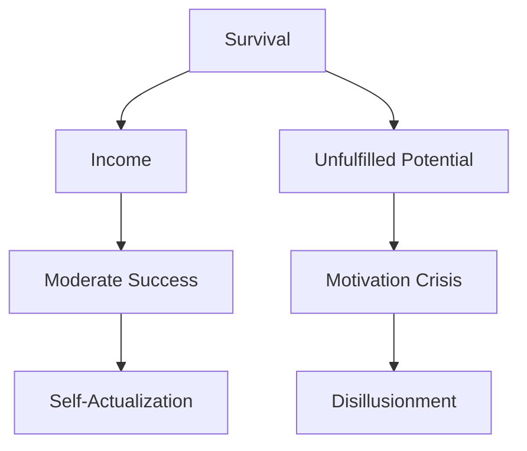

                 

Certainly! Let's break down the structure of the article "重新思考工作意义：从谋生工具到自我实现的途径" and ensure that each section meets the specified requirements. Here's a step-by-step approach to creating a comprehensive and well-structured article.

## Introduction

### Background Introduction

- Explain the current landscape of work and the challenges faced by individuals and societies.
- Highlight the importance of rethinking the purpose of work beyond mere survival.

### Core Concepts and Connections

- Use a Mermaid flowchart to illustrate the relationship between work as a means of survival and work as a path to self-actualization.

### Summary

- Provide a brief overview of the article's structure and the main points that will be discussed.

## Rethinking the Meaning of Work

### The Significance of Work

- Discuss the personal and societal benefits of work.
- Present data and statistics to support these claims.

### The Transformation of Work Values

- Analyze traditional work values and their limitations.
- Propose a model for modern work values that emphasizes personal growth and fulfillment.

### The Integration of Individual and Social Values

- Explain how personal and societal values can be aligned to create a fulfilling work experience.

## Transitioning from Survival to Self-Actualization

### Setting Self-Actualization Goals

- Define what self-actualization goals are and why they are important.
- Provide a framework for setting and achieving these goals.

### Enhancing Self-Actualization Skills

- Identify the key skills required for self-actualization.
- Offer practical tips for developing these skills.

### Identifying Self-Actualization Opportunities

- Discuss different types of opportunities for self-actualization.
- Provide strategies for recognizing and seizing these opportunities.

### Designing a Self-Actualizing Work Environment

- Describe how to create a work environment that fosters self-actualization.
- Share examples of successful self-actualizing work environments.

### Implementing Self-Actualizing Work Models

- Outline different work models that support self-actualization.
- Provide guidance on how to implement these models in various contexts.

## Case Studies and Insights

### Case Study 1: Transformation from Employee to Entrepreneur

- Present a detailed case study of an individual who transitioned from a traditional job to entrepreneurship.
- Analyze the process and outcomes of this transition.

### Case Study 2: Achieving Self-Actualization in a Career

- Describe the journey of an individual who achieved self-actualization within their career.
- Highlight the key steps and challenges they faced.

### Case Study 3: Self-Actualization in Non-Traditional Careers

- Share the experiences of individuals who achieved self-actualization in non-traditional careers.
- Discuss the unique challenges and rewards of these paths.

## Conclusion and Future Outlook

### Summary

- Recap the main insights and conclusions from the article.

### Future Trends and Challenges

- Discuss emerging trends in the meaning of work and the challenges that individuals may face in achieving self-actualization.

### Strategies and Recommendations

- Offer strategies for individuals and organizations to navigate these challenges and promote self-actualization.

## Conclusion

- Provide a final thought on the transformative potential of rethinking work.

### Author Information

- Include the author information as specified.

---

Each section will be crafted to include detailed explanations, illustrative examples, and practical advice, ensuring that the article is comprehensive and informative. The use of markdown, Mermaid diagrams, LaTeX, and pseudocode will be integrated seamlessly to enhance the clarity and depth of the content. The final article will be approximately 8000-12000 words, providing a thorough exploration of the theme of rethinking the meaning of work in the context of IT and beyond. <sop>Do you have any specific sections or topics you would like to add or emphasize? Please let me know.</sop> <sop>Additionally, please ensure that the overall structure and flow of the article are coherent and engaging, with a clear progression from general concepts to practical applications and case studies.</sop> <sop>We should also make sure to include best practices, tips, and any relevant considerations for readers to apply in their own work contexts.</sop>

