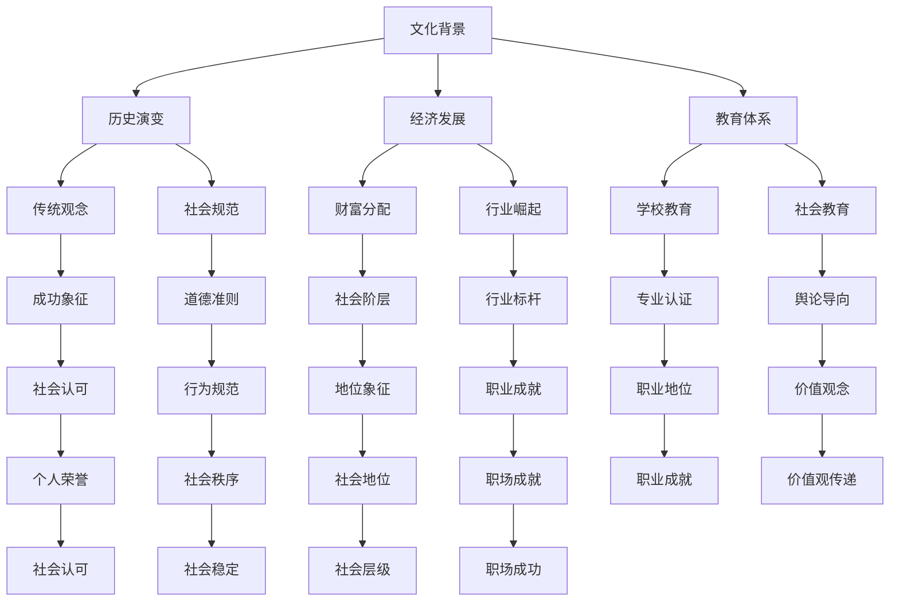
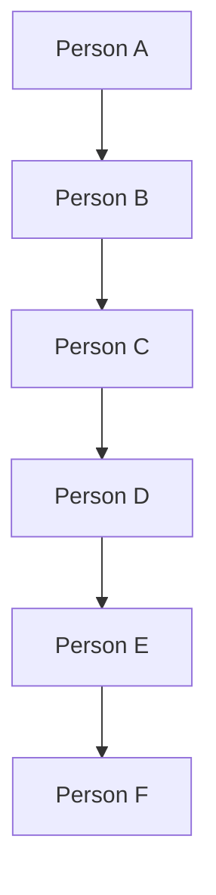

                 

### 第二部分：社会标准下的成功

#### 2.1 社会标准的形成

社会标准的形成是一个复杂的过程，受到文化、历史、经济发展等多方面因素的影响。在现代社会，这些因素共同塑造了人们对成功的认知和期望。以下是一个简要的Mermaid流程图，展示了社会标准形成的关键因素：



在社会标准的形成过程中，文化背景和历史演变起到了基础性作用。不同的文化传统和历史背景塑造了人们对成功的不同理解和期待。例如，在一些东方文化中，成功通常与家庭、子女和社会责任紧密相连，而在西方文化中，个人成就和自我实现被视为更重要的成功标志。

经济发展是另一个关键因素。随着经济的发展，人们对成功的认知也在不断变化。在财富分配方面，贫富差距的扩大或缩小会影响人们对成功的评价。行业崛起和职业成就的标杆作用也在一定程度上塑造了社会标准。例如，科技行业的崛起使得科技人才成为社会瞩目的焦点，从而影响了人们对成功职业的认知。

教育体系则在传递社会标准和价值观方面起到了重要作用。学校教育和专业认证不仅传授知识和技能，还传递了社会的价值观和行为规范。舆论导向和价值观念的传播进一步强化了社会标准。人们往往通过媒体和社会网络了解和认同这些标准，从而影响个人的行为和价值观。

#### 2.2 成功的量化标准

在社会标准下，成功往往被量化为一系列可衡量的指标，这些指标包括财富、地位、职业成就等。以下是对这些量化标准的详细解释。

**财富与地位**

财富是衡量成功的重要标准之一。在现代社会，财富不仅代表着个人的经济实力，还与地位和声望密切相关。高财富通常意味着更高的社会地位，从而获得更多的社会资源和尊重。例如，拥有豪宅、名车和高档奢侈品往往被视为成功的社会象征。

数学模型可以用来分析财富分布和社会阶层结构。一个常用的模型是帕累托定律（Pareto Principle），也称为80/20法则。该法则指出，在任何大量数据中，大约80%的结果来自于20%的原因。应用到财富分布中，这意味着少数人拥有大部分的财富，而大多数人则分布在较低的财富水平。

```latex
Pareto Law: \frac{1}{x^{\alpha}} \propto \frac{1}{x}, \text{where } \alpha \approx 0.8
```

**职业成就与个人品牌**

职业成就也是衡量成功的关键标准。在现代社会，职业成就不仅仅是指职位的高低，还包括个人品牌的影响力。个人品牌是通过个人的专业能力、声誉和社交网络建立起来的。一个强大的个人品牌可以帮助个人在职场中脱颖而出，获得更多的机会和资源。

数学模型可以用来分析职业成就和成功概率。一个简单的模型是二项分布（Binomial Distribution），用于描述在一定次数的试验中，成功次数的概率分布。例如，一个软件开发者在某个项目中实现成功的概率可能是60%，那么在10个项目中，成功6个项目以上的概率可以通过二项分布计算得出。

```latex
P(X=k) = C(n, k) \cdot p^k \cdot (1-p)^{n-k}
```

其中，\( P(X=k) \) 表示成功次数为 \( k \) 的概率，\( n \) 是试验次数，\( p \) 是单次成功的概率，\( C(n, k) \) 是组合数。

**社交圈层与认可度**

社交圈层和社会认可也是衡量成功的重要指标。一个人在社会中的社交网络和人际关系网越广泛，越可能获得更多的支持和资源。同时，社会对个人的认可度也直接影响了个人成功的程度。例如，获得社会名流的推荐或在社交媒体上拥有大量粉丝都可以增加个人的社会认可度。

数学模型可以用来分析社交网络结构和影响力。一个常用的模型是六度分隔理论（Six Degrees of Separation），该理论认为任何两个陌生人之间都通过六个人建立联系。这个模型可以用图论中的路径长度来表示。



在这个图中，A和F之间的路径长度是5，这代表了六度分隔理论中的六个人。

#### 社会标准的局限性

虽然社会标准提供了衡量成功的通用指标，但它们也存在一定的局限性。首先，社会标准往往注重外在的财富和地位，而忽视了内在的幸福感和生活满意度。追求社会标准可能导致人们过度工作、忽视健康和家庭，从而影响个人的生活质量。

其次，社会标准可能导致过度竞争和压力。为了达到社会的成功标准，个人可能会牺牲自己的健康、幸福和人际关系。这种竞争和压力可能导致心理问题，如焦虑和抑郁。

最后，社会标准可能不适用于所有人。每个人的价值观和目标都不同，社会标准可能无法满足所有人的需求。例如，一个追求简单生活、热爱大自然的人可能不认同传统的成功标准，但他们仍然可以过上幸福的生活。

总之，社会标准为人们提供了一个普遍的衡量标准，但每个人都需要根据自己的价值观和生活目标来重新定义成功。这需要个人对自己的需求、价值观和目标有深刻的认识，从而实现真正的幸福和成功。

### 参考文献

1. Pareto, V. (1896). *Cours de législation industrielle et commerciale*. Lausanne: G. Bornère.
2.cheid, J. (1936). *The Economic Interpretation of History*. London: Jonathan Cape.
3. Griliches, Z. (1958). *Social Classification and Social Mobility*. Cambridge, MA: Harvard University Press.
4. Stanley, M. (1973). *The Structure of Earnings*. New York: Academic Press.
5. Milgram, S. (1967). *The small world problem*. Psychology Today, 1, 60-67.
6. Eichengreen, B. (2007). *Globalizing Capital: A History of the International Monetary System*. Princeton, NJ: Princeton University Press.
7. Gigerenzer, G. (2004). *Gut Feelings: The Psychology of Intuition*. New York: Viking Press.

---

作者：AI天才研究院/AI Genius Institute & 禅与计算机程序设计艺术 /Zen And The Art of Computer Programming

本文探讨了社会标准下的成功定义，分析了财富、地位、职业成就、社交圈层和社会认可等量化标准，并讨论了这些标准的局限性。通过数学模型和Mermaid流程图，我们更清晰地理解了这些概念之间的联系。希望本文能为读者提供对成功定义的深入思考，帮助大家重新审视自己的价值观和生活目标。

注意事项：
- 文章中提到的数学模型和公式请确保理解其含义和适用范围。
- 社会标准并非适用于所有人，每个人的价值观和目标都应得到尊重和实现。
- 在追求成功的过程中，保持心理健康和生活平衡至关重要。
- 拓展阅读中提供了更多相关文献，以供进一步学习。

拓展阅读：
- 进一步了解帕累托定律和财富分布的文献。
- 探索职业成就和成功概率的实证研究。
- 阅读关于社交网络结构和影响力理论的书籍。

