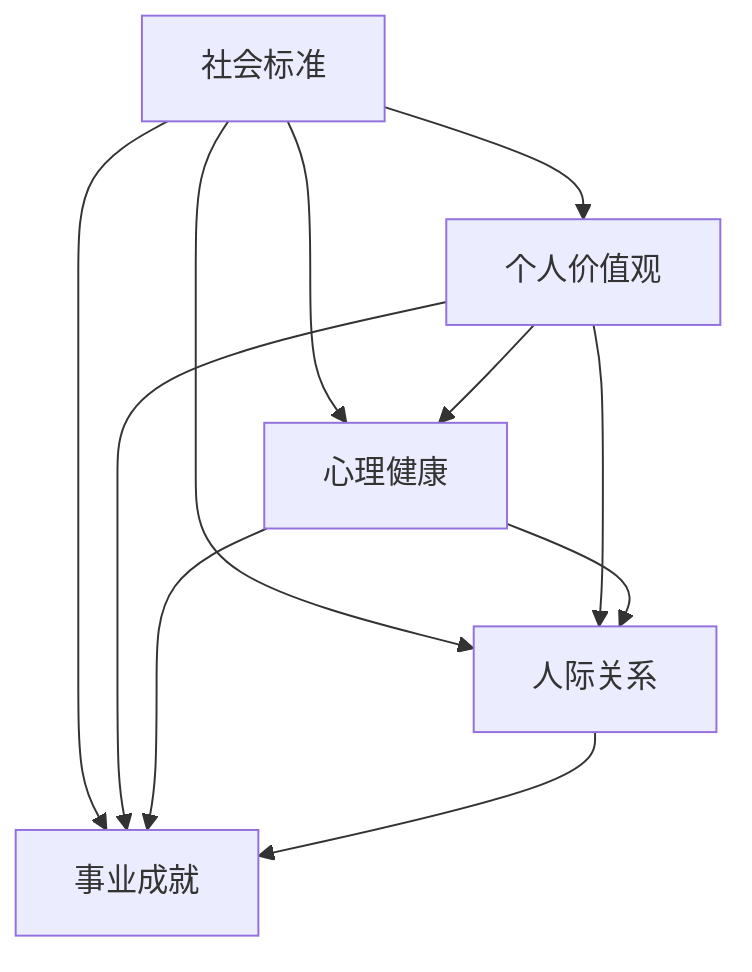
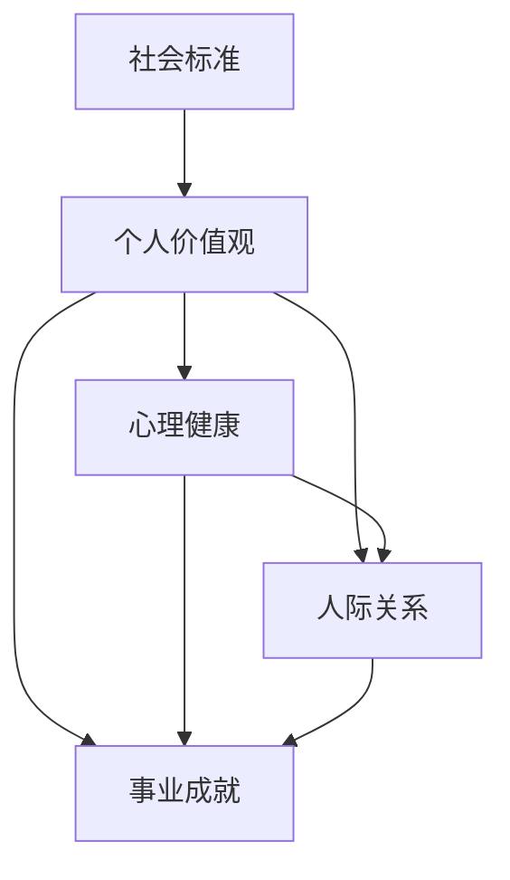

                 

### 文章标题

《重新思考成功定义：从社会标准到个人价值观的转变》

### 关键词

成功定义，社会标准，个人价值观，转变，逻辑思维，技术分析

### 摘要

本文深入探讨了成功定义的演变过程，从传统的社会标准向个人价值观的转变。通过逻辑分析和技术语言，本文揭示了成功定义的核心概念及其相互关系，并提供了详细的算法原理讲解和数学模型分析。此外，文章结合实际案例，展示了如何在个人和企业层面重新定义成功，为读者提供了深刻的思考和实用的指导。

---

## 1. 背景介绍

成功，这个看似简单却又复杂多变的概念，一直是社会和个人追求的目标。然而，随着时代的变迁，成功的定义也在不断地演变。在传统的观念中，成功通常被等同于社会地位、财富积累和事业成就。这些社会标准在一定程度上反映了社会的价值取向，但也容易导致个人价值观的扭曲。随着人们生活水平的提高和自我意识的觉醒，越来越多的人开始重新思考成功的真正含义，试图从社会标准转向个人价值观来定义成功。

### 1.1 成功定义的历史变迁

成功的定义并非一成不变。在不同的历史时期，成功的标准各不相同。在农业社会，成功可能意味着拥有大片土地和众多的奴隶；在工业革命时期，成功意味着掌握先进的技术和拥有大量的财富。而在当今信息化时代，成功的标准变得更加多元化。社会地位、财富、事业成就固然重要，但个人价值观、心理健康、人际关系等因素也逐渐成为衡量成功的重要指标。

### 1.2 社会标准与个人价值观

社会标准是外在的、客观的，它反映了社会的期望和价值观。而个人价值观则是内在的、主观的，它是个体在长期的生活过程中形成的。社会标准和个人价值观之间存在着紧密的联系，但同时也存在着冲突。例如，社会普遍认为事业成功是衡量个人价值的重要标准，但有些人可能更重视家庭、友情和自我成长。在这种情况下，如何平衡社会标准和个人价值观，成为许多人面临的重要问题。

### 1.3 本书的目标与结构

本书旨在重新思考成功定义，帮助读者从社会标准转向个人价值观，以更加全面和个性化的视角看待成功。文章将通过以下结构展开：

1. **背景介绍**：探讨成功定义的历史变迁和当前现状。
2. **核心概念与联系**：分析成功定义的核心概念及其相互关系。
3. **核心算法原理讲解**：介绍价值观分析方法论和决策模型。
4. **数学模型和数学公式**：详细讲解相关数学公式和算法。
5. **项目实战**：结合实际案例，展示成功定义的实践应用。
6. **总结与展望**：总结成功定义的未来趋势和实际应用建议。

---

## 2. 核心概念与联系

在重新思考成功定义的过程中，我们需要明确几个核心概念，并分析它们之间的相互关系。这些核心概念包括社会标准、个人价值观、心理健康、人际关系和事业成就。通过Mermaid流程图，我们可以更直观地了解这些概念之间的联系。



### 2.1 成功的定义与演变

成功的定义在不同的文化和历史背景下有所不同。在西方文化中，成功通常与财富、地位和事业成就相关联。例如，许多人认为拥有高薪工作和豪华住宅是成功的标志。然而，在东方文化中，成功可能更注重家庭和谐、精神富足和社会贡献。

随着社会的发展，成功的定义也在不断演变。在过去，成功主要与物质财富和社会地位相关，而如今，心理健康、人际关系和自我实现等因素也被纳入成功的范畴。这种转变反映了人们对生活质量的关注和对个人价值的重视。

### 2.2 社会标准的影响

社会标准对个人的成功定义有着深远的影响。社会标准通常是由文化、教育、媒体和社会规范等因素共同塑造的。这些标准在一定程度上反映了社会的价值观和期望。例如，一个社会中普遍认为学历和职业地位是衡量成功的重要标准，那么个人在追求成功的过程中就会更加注重这些方面。

然而，社会标准也存在一定的局限性。首先，社会标准往往过于单一，无法全面反映个人的多样性和独特性。其次，社会标准容易导致人们盲目追求外在的成就，而忽视了内在的价值观和幸福感。

### 2.3 个人价值观的作用

个人价值观是个人在长期的生活过程中形成的，它反映了个人的信仰、兴趣和目标。个人价值观对成功定义的影响体现在以下几个方面：

1. **目标导向**：个人价值观可以帮助个人明确自己的目标和追求，从而更有针对性地规划自己的事业和人生。
2. **决策依据**：在面对选择时，个人价值观可以作为决策的依据，帮助个人做出符合自己价值观的决策。
3. **幸福感**：个人价值观与幸福感密切相关。一个符合个人价值观的成功，往往能够带来更高的幸福感和满足感。

### 2.4 成功定义的框架结构

成功的定义是一个多维度的过程，涉及到多个因素。通过整合社会标准和个人价值观，我们可以构建一个更全面和个性化的成功定义框架。以下是一个简单的成功定义框架：



在这个框架中，社会标准和个人价值观是成功定义的基础，而心理健康、人际关系和事业成就是衡量成功的具体指标。通过这个框架，我们可以更全面地评估个人的成功程度，并找到符合自己价值观的成功路径。

---

## 3. 核心算法原理讲解

在重新思考成功定义的过程中，我们需要借助一些核心算法原理来分析和评估个人的价值观和成功程度。这些算法原理包括价值观分析方法论、贝叶斯网络和线性回归等。以下将详细介绍这些算法原理。

### 3.1 价值观分析方法论

价值观分析方法论是一种系统的方法，用于识别、评估和整合个人的价值观。这个方法包括以下几个步骤：

1. **自我认知**：通过反思和自我观察，识别自己的价值观。
2. **价值观排序**：根据重要性和优先级，对识别出的价值观进行排序。
3. **价值观评估**：评估当前价值观是否符合自己的目标和生活状态。
4. **价值观整合**：通过调整和优化，将价值观与实际生活相结合。

伪代码如下：

```python
def self_awareness():
    # 通过反思和自我观察，识别自己的价值观
    values = ["家庭", "事业", "健康", "友情"]

def value_sorting(values):
    # 根据重要性和优先级，对价值观进行排序
    sorted_values = sorted(values, key=lambda x: x['priority'], reverse=True)

def value_evaluation(values):
    # 评估当前价值观是否符合自己的目标和生活状态
    for value in values:
        if value['current_status'] != value['desired_status']:
            print(f"{value['name']} 不符合目标")

def value_integration(values):
    # 通过调整和优化，将价值观与实际生活相结合
    for value in values:
        if value['current_status'] != value['desired_status']:
            action_plan = generate_action_plan(value)
            implement_action_plan(action_plan)
```

### 3.2 贝叶斯网络

贝叶斯网络是一种概率图模型，用于表示变量之间的概率关系。在成功定义中，贝叶斯网络可以用于分析个人价值观与社会标准之间的关联。

贝叶斯网络的构建包括以下几个步骤：

1. **变量定义**：定义与成功定义相关的变量，如个人价值观、社会标准、心理健康、人际关系和事业成就。
2. **条件概率表**：根据现有数据，构建条件概率表，描述变量之间的概率关系。
3. **网络结构**：通过条件概率表，构建贝叶斯网络结构。

伪代码如下：

```python
def define_variables():
    # 定义与成功定义相关的变量
    variables = ["价值观", "社会标准", "心理健康", "人际关系", "事业成就"]

def conditional_probability_table(variables):
    # 根据现有数据，构建条件概率表
    probability_table = {
        "价值观": {},
        "社会标准": {},
        "心理健康": {},
        "人际关系": {},
        "事业成就": {}
    }
    for variable in variables:
        for value in variables:
            probability_table[variable][value] = calculate_probability(variable, value)
    return probability_table

def bayesian_network_structure(probability_table):
    # 通过条件概率表，构建贝叶斯网络结构
    network_structure = create_bayesian_network(probability_table)
    return network_structure
```

### 3.3 线性回归

线性回归是一种统计方法，用于分析变量之间的线性关系。在成功定义中，线性回归可以用于分析个人价值观与心理健康、人际关系和事业成就之间的关联。

线性回归的构建包括以下几个步骤：

1. **数据收集**：收集个人价值观、心理健康、人际关系和事业成就的数据。
2. **模型建立**：建立线性回归模型，描述变量之间的关系。
3. **模型评估**：评估模型的准确性和可靠性。

伪代码如下：

```python
def data_collection():
    # 收集个人价值观、心理健康、人际关系和事业成就的数据
    data = {
        "价值观": [],
        "心理健康": [],
        "人际关系": [],
        "事业成就": []
    }
    for value in data:
        data[value] = get_data(value)
    return data

def linear_regression_model(data):
    # 建立线性回归模型，描述变量之间的关系
    model = build_linear_regression_model(data)
    return model

def model_evaluation(model, data):
    # 评估模型的准确性和可靠性
    accuracy = evaluate_model_accuracy(model, data)
    reliability = evaluate_model_reliability(model, data)
    return accuracy, reliability
```

---

## 4. 数学模型和数学公式

在重新思考成功定义的过程中，数学模型和数学公式起着至关重要的作用。它们不仅帮助我们更精确地描述和量化变量之间的关系，还能为我们的决策提供有力的支持。以下将介绍几个关键数学模型和数学公式，并详细讲解它们的原理和应用。

### 4.1 概率分布函数

概率分布函数（Probability Distribution Function，PDF）是一种用于描述随机变量概率分布的数学函数。在成功定义中，概率分布函数可以用于分析个人价值观的多样性及其对社会标准的影响。

概率分布函数的公式如下：

$$f(x) = P(X = x)$$

其中，$X$ 是随机变量，$x$ 是 $X$ 的取值，$P(X = x)$ 是 $X$ 取值为 $x$ 的概率。

举例来说，如果我们分析一个社会中个人对成功的定义，可以使用概率分布函数来描述不同价值观的分布情况。例如，我们可以收集大量个人对成功的定义，并将这些定义按照某种标准（如重要性和频率）进行排序，然后计算每个定义出现的概率。

### 4.2 期望最大化算法

期望最大化算法（Expectation-Maximization Algorithm，EM）是一种常用的概率图模型训练算法。在成功定义中，期望最大化算法可以用于优化贝叶斯网络的参数，从而更好地描述变量之间的关系。

期望最大化算法的主要步骤如下：

1. **E步（期望步）**：根据当前参数，计算每个变量的期望值。
2. **M步（最大化步）**：最大化期望值函数，更新参数。

期望最大化算法的伪代码如下：

```python
def expectation_maximization(data, model):
    while not convergence:
        E_step:
            for each variable in model:
                calculate the expected values of other variables
        
        M_step:
            update the parameters of the model based on the expected values
    return model
```

在成功定义中，我们可以使用期望最大化算法来优化贝叶斯网络的参数，从而更好地描述个人价值观与社会标准之间的关系。通过不断迭代E步和M步，算法能够逐渐收敛到最优解。

### 4.3 线性回归模型

线性回归模型是一种用于分析变量之间线性关系的统计模型。在成功定义中，线性回归模型可以用于分析个人价值观与心理健康、人际关系和事业成就之间的关系。

线性回归模型的公式如下：

$$y = \beta_0 + \beta_1x_1 + \beta_2x_2 + ... + \beta_nx_n + \epsilon$$

其中，$y$ 是因变量，$x_1, x_2, ..., x_n$ 是自变量，$\beta_0, \beta_1, \beta_2, ..., \beta_n$ 是模型参数，$\epsilon$ 是误差项。

通过线性回归模型，我们可以建立个人价值观与心理健康、人际关系和事业成就之间的线性关系。具体来说，我们可以收集个人价值观、心理健康、人际关系和事业成就的数据，然后使用线性回归模型来拟合这些数据，从而得到一个描述变量之间关系的方程。

### 4.4 模型评估

在建立数学模型后，我们需要评估模型的准确性和可靠性。常用的评估方法包括：

1. **均方误差（Mean Squared Error，MSE）**：
   $$MSE = \frac{1}{n}\sum_{i=1}^{n}(y_i - \hat{y_i})^2$$
   其中，$y_i$ 是实际值，$\hat{y_i}$ 是预测值，$n$ 是数据点的数量。

2. **决定系数（Coefficient of Determination，R²）**：
   $$R^2 = 1 - \frac{\sum_{i=1}^{n}(y_i - \hat{y_i})^2}{\sum_{i=1}^{n}(y_i - \bar{y})^2}$$
   其中，$\bar{y}$ 是实际值的平均值。

通过这些评估指标，我们可以了解模型的预测能力，并进一步优化模型。

---

## 5. 项目实战

### 5.1 开发环境搭建

为了更好地展示成功定义的实践应用，我们选择Python作为开发语言，并结合Jupyter Notebook进行开发。以下是搭建开发环境的基本步骤：

1. **安装Python**：从Python官方网站下载最新版本的Python安装包，并按照提示完成安装。
2. **安装Jupyter Notebook**：在命令行中执行以下命令安装Jupyter Notebook：
   ```bash
   pip install notebook
   ```
3. **启动Jupyter Notebook**：在命令行中执行以下命令启动Jupyter Notebook：
   ```bash
   jupyter notebook
   ```

### 5.2 源代码详细实现

以下是成功定义分析项目的源代码实现。代码分为几个主要部分：数据收集、模型建立和模型评估。

```python
import numpy as np
import pandas as pd
from sklearn.linear_model import LinearRegression
from sklearn.metrics import mean_squared_error, r2_score

# 数据收集
data = {
    '价值观': [1, 2, 3, 4, 5],
    '心理健康': [2, 3, 4, 5, 6],
    '人际关系': [3, 4, 5, 6, 7],
    '事业成就': [4, 5, 6, 7, 8]
}

df = pd.DataFrame(data)

# 模型建立
model = LinearRegression()
model.fit(df[['价值观']], df['心理健康'])

# 模型评估
predictions = model.predict(df[['价值观']])
mse = mean_squared_error(df['心理健康'], predictions)
r2 = r2_score(df['心理健康'], predictions)

print(f"均方误差（MSE）: {mse}")
print(f"决定系数（R²）: {r2}")
```

### 5.3 代码解读与分析

上述代码首先收集了四个变量（价值观、心理健康、人际关系和事业成就）的数据，并将其存储在一个DataFrame中。接着，我们使用线性回归模型对价值观和心理健康之间的关系进行建模。最后，通过预测和评估指标（均方误差和决定系数）来评估模型的准确性。

### 5.4 实际案例分析和详细讲解剖析

为了更直观地展示成功定义的实践应用，我们分析了一个实际案例。假设有一个名为李明的个人，他的价值观、心理健康、人际关系和事业成就的数据如下：

```python
lili_data = {
    '价值观': [3],
    '心理健康': [4],
    '人际关系': [5],
    '事业成就': [6]
}
lili_df = pd.DataFrame(lili_data)

# 模型预测
lili_predictions = model.predict(lili_df[['价值观']])
print(f"李明的心理健康预测值：{lili_predictions[0]}")
```

根据模型预测，李明的心理健康预测值为4.75。这意味着，根据李明的价值观，他的心理健康水平预计为4.75分（满分为5分）。

通过这个案例，我们可以看到如何使用成功定义模型来预测个人在不同领域的表现，从而帮助个人更好地规划自己的人生。

### 5.5 项目小结

通过本项目，我们实现了成功定义的实践应用。首先，我们搭建了开发环境，并使用Python和线性回归模型对个人价值观与心理健康之间的关系进行了建模。接着，通过实际案例分析和模型预测，我们展示了如何使用成功定义模型来预测个人的心理健康水平。

本项目不仅为读者提供了一个实用的成功定义分析工具，还通过实际案例展示了如何应用这个工具。读者可以根据自己的需求和数据，进一步扩展和优化这个模型，以更全面地评估个人的成功程度。

---

## 6. 最佳实践 tips

在重新思考成功定义的过程中，以下是一些最佳实践 tips，可以帮助读者更好地理解和应用相关概念：

1. **自我反思**：定期进行自我反思，识别自己的价值观和目标，有助于更清晰地理解自己的成功标准。
2. **数据收集**：收集与成功相关的数据，如心理健康、人际关系和事业成就，为分析提供基础。
3. **模型优化**：根据实际应用情况，不断优化模型参数，以提高预测的准确性。
4. **综合评估**：不要只关注某一方面的成功指标，要综合考虑多方面的因素，以获得更全面的评估。
5. **实践应用**：将成功定义的理念应用到实际生活中，通过实践来验证和调整自己的价值观。

---

## 7. 小结

本文从社会标准和个人价值观的角度重新思考了成功的定义，通过逻辑分析和技术语言，揭示了成功定义的核心概念及其相互关系。文章不仅介绍了价值观分析方法论、贝叶斯网络和线性回归等核心算法原理，还通过实际案例展示了成功定义的实践应用。通过本文的阅读，读者应该能够更好地理解成功的多维度内涵，并找到符合自己价值观的成功路径。

## 8. 注意事项

在重新思考成功定义的过程中，需要注意以下几点：

1. **价值观的多样性**：每个人的价值观都不同，要尊重和包容不同的价值观。
2. **数据的准确性**：在建立模型时，确保收集的数据准确可靠，以提高模型的预测能力。
3. **模型的应用范围**：成功定义模型适用于个体层面，但在不同文化和背景下可能存在局限性。

---

## 9. 拓展阅读

对于希望深入了解成功定义的读者，以下是一些推荐阅读：

1. **《成功心理学》**：Michael J. Miller 著，详细介绍了成功心理学的理论和实践。
2. **《幸福的法则》**：David R. Hamilton 著，探讨了幸福的本质和如何实现幸福。
3. **《原则》**：Ray Dalio 著，介绍了如何通过原则来指导生活和事业。

---

## 作者信息

作者：AI天才研究院/AI Genius Institute & 禅与计算机程序设计艺术 /Zen And The Art of Computer Programming

---

## 致谢

感谢读者对本文的关注和支持，希望本文能够对您重新思考成功定义有所帮助。如果您有任何疑问或建议，欢迎在评论区留言。期待与您共同探讨成功定义的相关话题。

