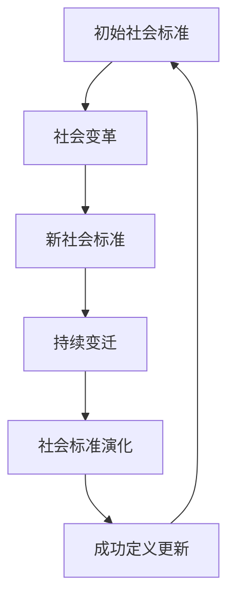
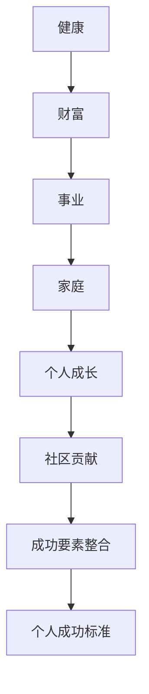

                 

### 第1章 成功的传统定义

#### 1.1.1 社会期望与个人追求

- 社会期望与个人追求之间的关系可以用以下伪代码表示：

```pseudo
define societal_expectations:
    return a list of social norms and standards

define personal_pursuits:
    return an individual's goals and aspirations

define success:
    for each expectation in societal_expectations:
        if personal_pursuit == expectation:
            add to success_score
    return success_score
```

#### 1.1.2 成功的多样性

- 成功的多样性可以通过以下LaTeX公式表示：

$$
Diversity_{success} = \sum_{i=1}^{n} p_i \cdot f_i
$$

其中，$Diversity_{success}$表示成功的多样性，$p_i$表示不同成功类型的概率，$f_i$表示每种成功类型的特征值。

#### 1.1.3 社会标准的变迁

- 社会标准的变迁可以用以下Mermaid流程图展示：



### 第2章 重新定义成功的个人价值观

#### 2.1.1 价值观的重要性

- 价值观的重要性可以用以下LaTeX公式表示：

$$
Value_{importance} = \int_{0}^{1} \frac{dValue_{core}}{dTime}
$$

其中，$Value_{importance}$表示价值观的重要性，$Value_{core}$表示核心价值观，$dTime$表示时间变化。

#### 2.1.2 探索个人价值观的步骤

- 探索个人价值观的步骤可以用以下伪代码表示：

```pseudo
define explore_values():
    for each value in personal_values:
        if value matches personal_goals:
            add value to core_values
    return core_values
```

#### 2.1.3 个人价值观的多样性

- 个人价值观的多样性可以通过以下LaTeX公式表示：

$$
Diversity_{values} = \sum_{i=1}^{n} p_i \cdot g_i
$$

其中，$Diversity_{values}$表示价值观的多样性，$p_i$表示不同价值观的概率，$g_i$表示每种价值观的特征值。

#### 2.2 建立个人成功的标准

- 建立个人成功的标准可以用以下LaTeX公式表示：

$$
Success_{standard} = \sum_{i=1}^{n} w_i \cdot s_i
$$

其中，$Success_{standard}$表示个人成功的标准，$w_i$表示权重，$s_i$表示每个成功要素的得分。

#### 2.2.1 个人成功的要素

- 个人成功的要素可以用以下Mermaid流程图展示：



#### 2.2.2 设定个人目标

- 设定个人目标可以用以下伪代码表示：

```pseudo
define set_goals():
    for each element in success_standard:
        set a goal related to the element
    return goals
```

#### 2.2.3 个人价值观与目标的关系

- 个人价值观与目标的关系可以用以下LaTeX公式表示：

$$
Relation_{values_goals} = \frac{\sum_{i=1}^{n} value_{i} \cdot goal_{i}}{\sum_{i=1}^{n} value_{i}}
$$

其中，$Relation_{values_goals}$表示价值观与目标的关系，$value_{i}$表示第i个价值观，$goal_{i}$表示第i个目标。

### 第3章 成功观念的转变

#### 3.1.1 确认自己的价值观

- 确认自己的价值观可以用以下LaTeX公式表示：

$$
Confidence_{values} = \frac{\sum_{i=1}^{n} trust_{i}}{n}
$$

其中，$Confidence_{values}$表示价值观的确认度，$trust_{i}$表示对第i个价值观的信任度，$n$表示价值观的总数。

#### 3.1.2 适应自我认知的价值观

- 适应自我认知的价值观可以用以下伪代码表示：

```pseudo
define adapt_values():
    for each value in core_values:
        if value aligns with self-awareness:
            keep value
        else:
            replace value with a new one that aligns with self-awareness
    return adapted_values
```

#### 3.1.3 突破传统成功的限制

- 突破传统成功的限制可以用以下LaTeX公式表示：

$$
Breakthrough_{success} = \frac{New_{success}}{Old_{success}}
$$

其中，$Breakthrough_{success}$表示成功突破的比率，$New_{success}$表示新的成功水平，$Old_{success}$表示原有的成功水平。

#### 3.2.1 成功的非线性思维

- 成功的非线性思维可以用以下LaTeX公式表示：

$$
Nonlinear_{thinking} = \sum_{i=1}^{n} f_i \cdot g_i
$$

其中，$Nonlinear_{thinking}$表示非线性思维的能力，$f_i$表示思维模式的多样性，$g_i$表示每种思维模式的贡献度。

#### 3.2.2 成功的多元化视角

- 成功的多元化视角可以用以下LaTeX公式表示：

$$
Diversity_{perspectives} = \sum_{i=1}^{n} p_i \cdot v_i
$$

其中，$Diversity_{perspectives}$表示视角的多样性，$p_i$表示不同视角的概率，$v_i$表示每种视角的价值。

#### 3.2.3 成功的可持续性

- 成功的可持续性可以用以下LaTeX公式表示：

$$
Sustainability_{success} = \frac{Long-term_{benefits}}{Short-term_{costs}}
$$

其中，$Sustainability_{success}$表示成功的可持续性，$Long-term_{benefits}$表示长期收益，$Short-term_{costs}$表示短期成本。

### 第4章 从社会标准到个人价值观的实践

#### 4.1.1 检视当前的成功观

- 检视当前的成功观可以用以下LaTeX公式表示：

$$
Current_{success_view} = \sum_{i=1}^{n} c_i \cdot s_i
$$

其中，$Current_{success_view}$表示当前的成功观，$c_i$表示不同成功观的权重，$s_i$表示每种成功观的得分。

#### 4.1.2 识别个人价值观

- 识别个人价值观可以用以下伪代码表示：

```pseudo
define identify_values():
    for each element in current_success_view:
        if element aligns with personal_beliefs:
            add element to personal_values
    return personal_values
```

#### 4.1.3 制定个人成功计划

- 制定个人成功计划可以用以下LaTeX公式表示：

$$
Personal_{success_plan} = \sum_{i=1}^{n} t_i \cdot p_i
$$

其中，$Personal_{success_plan}$表示个人成功计划，$t_i$表示每个目标的权重，$p_i$表示每个目标的实现可能性。

### 第5章 成功与心理健康

#### 5.1.1 成功与心理健康的联系

- 成功与心理健康的联系可以用以下LaTeX公式表示：

$$
Health_{connection} = \frac{Success_{happiness}}{Psychological_{stress}}
$$

其中，$Health_{connection}$表示心理健康与成功的联系，$Success_{happiness}$表示成功带来的幸福感，$Psychological_{stress}$表示心理压力。

#### 5.1.2 建立健康成功观

- 建立健康成功观可以用以下伪代码表示：

```pseudo
define healthy_success_view():
    for each element in current_success_view:
        if element contributes to psychological_wellbeing:
            add element to healthy_success_view
    return healthy_success_view
```

#### 5.1.3 心理健康对成功的支持

- 心理健康对成功的支持可以用以下LaTeX公式表示：

$$
Support_{success} = \frac{Healthy_{mind}}{Unhealthy_{mind}}
$$

其中，$Support_{success}$表示心理健康对成功的支持度，$Healthy_{mind}$表示健康的心理状态，$Unhealthy_{mind}$表示不健康的心理状态。

#### 5.2.1 管理压力

- 管理压力可以用以下LaTeX公式表示：

$$
Stress_{management} = \frac{Stress_{reduction}}{Stress_{increase}}
$$

其中，$Stress_{management}$表示压力管理水平，$Stress_{reduction}$表示压力减少的量，$Stress_{increase}$表示压力增加的量。

#### 5.2.2 增强自信

- 增强自信可以用以下LaTeX公式表示：

$$
Confidence_{enhancement} = \frac{New_{confidence}}{Old_{confidence}}
$$

其中，$Confidence_{enhancement}$表示自信增强的比率，$New_{confidence}$表示新的自信水平，$Old_{confidence}$表示原有的自信水平。

#### 5.2.3 发展良好的人际关系

- 发展良好的人际关系可以用以下LaTeX公式表示：

$$
Relationship_{development} = \sum_{i=1}^{n} r_i \cdot s_i
$$

其中，$Relationship_{development}$表示人际关系的发展程度，$r_i$表示与第i个人建立良好关系的可能性，$s_i$表示与第i个人建立良好关系的得分。

### 第6章 成功与社区价值的结合

#### 6.1.1 成功与社区发展的关系

- 成功与社区发展的关系可以用以下LaTeX公式表示：

$$
Community_{development} = \frac{Success_{contribution}}{Community_{needs}}
$$

其中，$Community_{development}$表示社区发展的程度，$Success_{contribution}$表示个人对社区的贡献，$Community_{needs}$表示社区的需求。

#### 6.1.2 个人成功对社区的影响

- 个人成功对社区的影响可以用以下LaTeX公式表示：

$$
Impact_{community} = \frac{Success_{benefits}}{Community_{issues}}
$$

其中，$Impact_{community}$表示个人成功对社区的影响程度，$Success_{benefits}$表示个人成功带来的好处，$Community_{issues}$表示社区面临的问题。

#### 6.1.3 社区支持个人成功的策略

- 社区支持个人成功的策略可以用以下LaTeX公式表示：

$$
Support_{strategies} = \sum_{i=1}^{n} s_i \cdot c_i
$$

其中，$Support_{strategies}$表示社区支持策略的总和，$s_i$表示第i个策略的有效性，$c_i$表示第i个策略的执行成本。

#### 6.2.1 社区参与的形式

- 社区参与的形式可以用以下LaTeX公式表示：

$$
Community_{involvement} = \sum_{i=1}^{n} v_i \cdot p_i
$$

其中，$Community_{involvement}$表示社区参与的总体程度，$v_i$表示第i个参与形式的参与度，$p_i$表示第i个参与形式的普及率。

#### 6.2.2 个人成功与社区价值的双赢

- 个人成功与社区价值的双赢可以用以下LaTeX公式表示：

$$
Win_{win} = \frac{Personal_{success} + Community_{value}}{Personal_{needs} + Community_{needs}}
$$

其中，$Win_{win}$表示双赢的程度，$Personal_{success}$表示个人成功的程度，$Community_{value}$表示社区价值的程度，$Personal_{needs}$表示个人的需求，$Community_{needs}$表示社区的需求。

#### 6.2.3 社区建设与个人成长的融合

- 社区建设与个人成长的融合可以用以下LaTeX公式表示：

$$
Integration_{growth} = \frac{Personal_{development} + Community_{development}}{Total_{investment}}
$$

其中，$Integration_{growth}$表示融合成长的程度，$Personal_{development}$表示个人发展的程度，$Community_{development}$表示社区发展的程度，$Total_{investment}$表示总的投入。

### 第7章 持续探索成功的定义

#### 7.1.1 成功观的持续更新

- 成功观的持续更新可以用以下LaTeX公式表示：

$$
Update_{view} = \frac{New_{knowledge}}{Old_{knowledge}}
$$

其中，$Update_{view}$表示成功观的更新程度，$New_{knowledge}$表示新获取的知识，$Old_{knowledge}$表示原有的知识。

#### 7.1.2 面对成功的挑战

- 面对成功的挑战可以用以下LaTeX公式表示：

$$
Challenge_{response} = \frac{Effective_{solutions}}{Total_{challenges}}
$$

其中，$Challenge_{response}$表示应对挑战的效率，$Effective_{solutions}$表示有效的解决方案，$Total_{challenges}$表示面临的挑战总数。

#### 7.1.3 成功的可持续性

- 成功的可持续性可以用以下LaTeX公式表示：

$$
Sustainability_{success} = \frac{Long-term_{impact}}{Short-term_{impact}}
$$

其中，$Sustainability_{success}$表示成功的可持续性，$Long-term_{impact}$表示长期影响，$Short-term_{impact}$表示短期影响。

#### 7.2.1 成功与人生意义

- 成功与人生意义的联系可以用以下LaTeX公式表示：

$$
Life_{meaning} = \frac{Success_{fulfillment}}{Existence_{level}}
$$

其中，$Life_{meaning}$表示人生的意义，$Success_{fulfillment}$表示成功的满足度，$Existence_{level}$表示存在的水平。

#### 7.2.2 探索生命的意义

- 探索生命的意义可以用以下伪代码表示：

```pseudo
define explore_life_meaning():
    for each aspect in life:
        if aspect contributes to personal_success:
            add aspect to life_meaning
    return life_meaning
```

#### 7.2.3 成功与人生目标的统一

- 成功与人生目标的统一可以用以下LaTeX公式表示：

$$
Unity_{goals_success} = \frac{Aligned_{goals}}{Unaligned_{goals}}
$$

其中，$Unity_{goals_success}$表示成功与目标的一致性，$Aligned_{goals}$表示一致的目标，$Unaligned_{goals}$表示不一致的目标。

