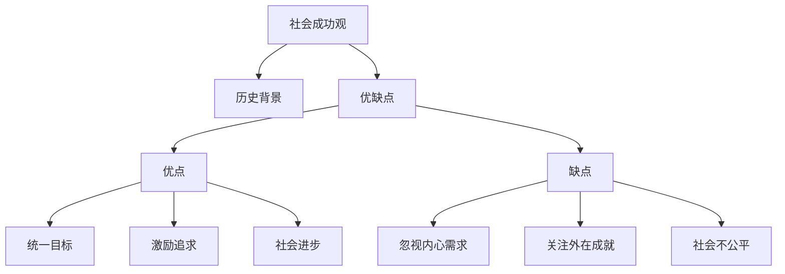
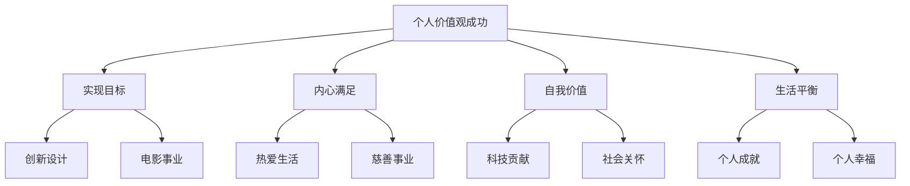
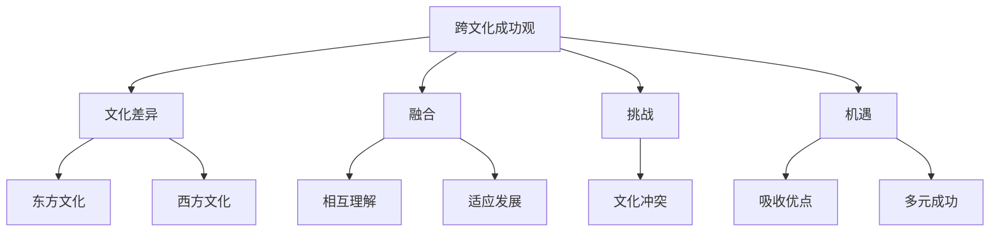
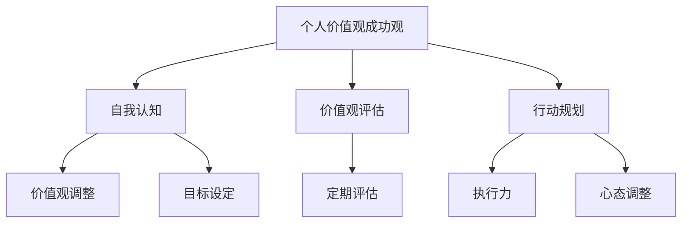
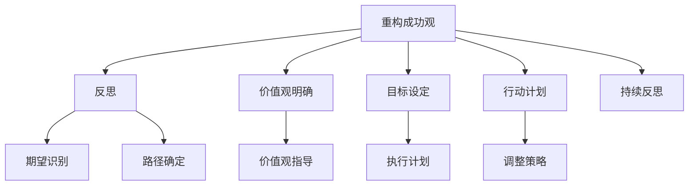

                 

### 引言

#### 书籍主题介绍

《重新思考成功的定义：从社会标准到个人价值观》是一本旨在引导读者重新审视和思考成功定义的书籍。在当今社会，成功常常被定义为取得社会地位、经济财富或者职业成就。然而，这种成功观往往忽略了个体内心的真实需求和幸福感。本书的核心主题是探讨如何从传统的以社会标准为中心的成功观，转向更加关注个人价值观和内心满足的成功观。

#### 目标读者

本书的目标读者包括对成功有深刻思考的职场人士、追求个人成长的大学生和研究生、以及对人生哲学感兴趣的读者。这些读者通常面临职业选择、人生目标设定等挑战，希望通过本书找到更加适合自己的成功之路。

#### 引言内容

本书将分为七个章节，旨在系统地探讨成功的定义和实现方式。第一章将引入主题，解释为何需要重新思考成功的定义，并概述全书的结构。接下来的章节将分别探讨社会标准的成功观、个人价值观的成功观、跨文化成功观的比较、过渡策略以及成功观的重构。最后，本书将在第七章总结全书的内容，探讨成功观的未来趋势。

### 第1章 引言

#### 1.1 书籍主题介绍

成功的定义在不同的文化、时代和个人之间存在着巨大的差异。传统的成功观往往以社会标准为导向，强调地位、财富和成就。然而，随着社会的变迁和个人价值观的多样性，越来越多的人开始质疑这种成功观的合理性和适用性。本书的核心主题是重新思考成功的定义，从社会标准转向更加关注个人价值观的成功观。这一转变不仅有助于个体找到更加符合自身需求的人生目标，也有助于社会的和谐发展。

#### 1.2 书籍结构概述

为了帮助读者系统地理解和接受这一转变，本书将分为七个章节。第一章作为引言，介绍书籍的主题和目标。第二章将深入探讨社会标准的成功观，分析其历史背景、优点和局限性。第三章将介绍个人价值观的成功观，探讨其定义和标准。第四章将比较不同文化的成功观，探讨其异同点。第五章将讨论如何从社会标准成功观过渡到个人价值观成功观。第六章将探讨成功观的重构，提出具体的实施策略。最后，第七章将总结全书的内容，并探讨成功观的未来趋势。

### 第2章 社会标准的成功观

#### 2.1 社会成功观的历史背景

社会成功观的历史可以追溯到古代文明时期。在那时，成功的定义与个人的社会地位、家族荣誉和宗教信仰紧密相关。例如，古代希腊和罗马的社会成功观强调荣誉和成就，而古代中国的社会成功观则强调功名利禄。随着历史的演变，社会成功观逐渐受到现代社会的影响，开始强调经济财富和职业成就。在工业革命之后，社会成功观进一步演变，强调个体的社会贡献和竞争力。

#### 2.2 社会标准成功的优缺点

社会标准成功的优点在于它提供了一个统一的标准，使个体在社会中有了明确的目标和方向。这种成功观有助于激励个体追求卓越，推动社会的进步。然而，社会标准成功的缺点也很明显。首先，它可能忽视个体内心的真实需求和幸福感，导致个体在追求社会认可的过程中失去自我。其次，社会标准成功可能导致个体过分关注外在的成就，忽视内在的成长和幸福。最后，社会标准成功可能导致社会的不平等和竞争加剧，加剧个体的焦虑和压力。

#### 2.3 社会成功观的批判

社会成功观的批判主要集中在以下几个方面。首先，社会成功观可能限制个体的自由发展，使个体成为社会制度的奴隶。其次，社会成功观可能忽视个体的幸福感，导致个体在追求成功的道路上失去幸福。最后，社会成功观可能导致社会的不公平，加剧贫富差距和社会矛盾。

### 第3章 个人价值观的成功观

#### 3.1 个人价值观的基本概念

个人价值观是指个体在长期生活实践中形成的对于事物、行为和目标的评价标准。它反映了个体对于生活、工作和社会的基本态度和信念。个人价值观通常包括以下几个方面：道德观、人生观、职业观、家庭观和社会观。这些价值观共同构成了个体的价值体系，对个体的行为和决策产生深远的影响。

#### 3.2 个人价值观成功的标准

个人价值观成功的标准因人而异，取决于个体的价值观和生活目标。然而，一些基本的成功标准是普遍适用的。首先，个人价值观成功意味着个体能够实现自己的人生目标，获得内心的满足感。其次，个人价值观成功意味着个体能够在尊重他人和社会的前提下，实现自我价值。最后，个人价值观成功意味着个体能够在生活中找到平衡，既追求个人的成就，也关注个人的幸福。

#### 3.3 个人价值观成功的案例

个人价值观成功的案例有很多，以下是其中两个典型的例子。

第一个例子是乔布斯。乔布斯以其对创新和设计的执着追求，成为现代科技产业的领袖。他始终坚持自己的价值观，不断挑战传统，最终带领苹果公司走向成功。乔布斯的成功不仅体现在他对科技和设计的卓越贡献，更体现在他对生活的热爱和对事业的执着。

第二个例子是安吉丽娜·朱莉。她以其在电影事业上的杰出成就和慈善事业上的贡献，成为当代社会的典范。朱莉的成功不仅体现在她个人的成就，更体现在她对社会和人类的关怀。她通过自己的努力，帮助无数需要帮助的人，实现了个人的价值。

### 第4章 跨文化成功观的比较

#### 4.1 不同文化的成功观

不同文化对于成功的定义和价值观有着显著的区别。例如，在东方文化中，成功通常与家庭责任、社会地位和道德伦理密切相关。而在西方文化中，成功则更注重个人成就、自我实现和社会贡献。这些文化差异反映了不同社会对于成功价值观的不同理解和追求。

#### 4.2 跨文化成功观的融合

随着全球化的发展，跨文化成功观的融合成为不可避免的趋势。跨文化成功观的融合意味着个体需要在尊重自身文化价值观的同时，理解和接纳其他文化的成功观。这种融合不仅有助于个体在多元文化环境中更好地适应和发展，也有助于促进不同文化之间的相互理解和尊重。

#### 4.3 跨文化成功观的挑战与机遇

跨文化成功观的挑战在于如何平衡不同文化价值观之间的差异，避免文化冲突。而机遇则在于通过跨文化成功观的融合，个体可以吸收不同文化的优点，实现更加全面和多元的成功。例如，一个在跨国公司工作的职场人士，可以通过跨文化学习，提升自己的领导能力和团队协作能力，从而在职业发展中取得更大的成功。

### 第5章 从社会标准到个人价值观的过渡策略

#### 5.1 自我认知的重要性

自我认知是过渡到个人价值观成功观的关键。个体需要深入了解自己的价值观、兴趣和目标，找到与自己价值观相符的成功路径。自我认知不仅有助于个体明确自己的人生方向，也有助于个体在追求成功的道路上保持内心的平静和坚定。

#### 5.2 价值观的评估与调整

个体需要定期评估自己的价值观，以确保它们仍然符合自己的需求和期望。如果发现价值观存在偏差或不再适用，个体需要及时进行调整。例如，一个原本以财富和地位为成功标准的个体，可能在经历一段时间的自我反思后，开始更加注重内心的满足和家庭幸福。

#### 5.3 实现个人价值观成功的行动

实现个人价值观成功需要明确的行动规划和坚定的执行力。个体需要设定具体的目标，制定可行的行动计划，并持之以恒地执行。同时，个体需要学会在面对困难和挑战时保持积极的心态，不断调整和优化自己的行动策略。

### 第6章 成功观的重构

#### 6.1 成功观的反思

重构成功观的第一步是进行深刻的反思。个体需要审视自己的成功观，质疑其中的假设和信念。通过反思，个体可以更加清晰地认识到自己对于成功的期望和需求，找到更加符合内心价值观的成功路径。

#### 6.2 成功观的重构实践

重构成功观的实践包括以下几个步骤：

1. **明确个人价值观**：个体需要明确自己的核心价值观，它们将指导个体的行为和决策。

2. **设定个人目标**：根据个人价值观，个体需要设定符合自身需求和期望的目标。

3. **制定行动计划**：为了实现个人目标，个体需要制定具体的行动计划，并持之以恒地执行。

4. **持续反思与调整**：在行动过程中，个体需要不断反思和调整自己的行为和策略，以适应不断变化的环境和需求。

#### 6.3 重构成功观与个人成长

重构成功观不仅有助于个体找到更加适合自己的成功路径，也有助于个人的成长和发展。通过重构成功观，个体可以更加清晰地认识自己的需求和目标，提升自我认知和自我管理能力，从而在职业和个人生活中取得更大的成功。

### 第7章 结论

#### 7.1 成功定义的重新思考的重要性

重新思考成功的定义对于个人的成长和社会的进步具有重要意义。通过重新思考成功的定义，个体可以更加清晰地认识到自己对于成功的期望和需求，找到更加符合内心价值观的成功路径。同时，社会也可以通过重新思考成功的定义，促进个体的自由发展和社会的和谐进步。

#### 7.2 成功观的未来趋势

随着社会的变迁和个人价值观的多样性，成功的定义将越来越倾向于个人价值观和内心满足。未来，个体将通过更加多元和包容的成功观，实现更加全面和持久的发展。同时，社会也将更加注重个体的内心需求和幸福感，推动社会的和谐进步。

### 附录

#### 附录 A：相关研究文献

本附录将介绍一些与成功观相关的经典著作和研究文献，以供读者进一步阅读和参考。这些文献涵盖了从心理学、社会学到哲学等多个领域的观点，为读者提供了丰富的理论和实践参考。

#### 附录 B：推荐阅读

在本附录中，我们将推荐一些与成功观相关的优秀书籍和文章，以帮助读者深入探讨成功的定义和实现方式。这些推荐内容包括经典著作、当代研究以及实践案例，旨在为读者提供全面的阅读指南。

---

### 《重新思考成功的定义：从社会标准到个人价值观》

关键词：成功定义、社会标准、个人价值观、跨文化比较、过渡策略

摘要：
在当今社会，成功的定义往往受到社会标准的强烈影响，这可能导致个体在追求成功的过程中忽略自身的内心需求和幸福感。本书旨在引导读者重新思考成功的定义，从社会标准转向更加关注个人价值观的成功观。通过深入分析社会标准成功观的历史背景、优缺点以及个人价值观成功观的基本概念和标准，本书探讨了跨文化成功观的比较和融合，提出了从社会标准成功观过渡到个人价值观成功观的策略，并探讨了成功观的未来趋势。本书旨在帮助读者找到更加符合自身需求的成功路径，实现个人成长和社会和谐。

### 第1章 引言

成功的定义在个体和社会中扮演着重要的角色，影响着人们的生活目标和行为方式。然而，随着社会的发展和个体价值观的多样性，传统的成功观开始受到质疑。本书旨在探讨如何重新思考成功的定义，从社会标准转向更加关注个人价值观的成功观。

#### 1.1 书籍主题介绍

本书的核心主题是重新思考成功的定义，探讨如何从社会标准转向更加关注个人价值观的成功观。传统的社会标准成功观强调社会地位、经济财富和职业成就，而个人价值观成功观则更加注重个体内心的需求和幸福感。本书将系统地探讨这一转变的必要性和方法。

#### 1.2 书籍结构概述

本书分为七个章节，旨在系统地探讨成功的定义和实现方式。

- **第一章**：引言，介绍书籍的主题和目标，概述全书的结构。
- **第二章**：社会标准的成功观，分析其历史背景、优点和局限性。
- **第三章**：个人价值观的成功观，探讨其定义和标准。
- **第四章**：跨文化成功观的比较，分析不同文化中的成功观。
- **第五章**：从社会标准到个人价值观的过渡策略，讨论过渡的方法和挑战。
- **第六章**：成功观的重构，探讨如何重构成功的定义和实现方式。
- **第七章**：结论，总结全书的内容，探讨成功观的未来趋势。

### 第2章 社会标准的成功观

社会标准的成功观在历史、文化和社会中都有着深远的影响。这一章将深入分析社会标准成功观的历史背景、优点和局限性。

#### 2.1 社会成功观的历史背景

社会成功观的历史可以追溯到古代文明时期。在古代希腊和罗马，成功被视为荣誉和成就的象征。古代中国的社会成功观则强调功名利禄。随着历史的演变，社会成功观逐渐受到现代社会的影响，开始强调经济财富和职业成就。

#### 2.2 社会标准成功的优缺点

社会标准成功的优点在于它提供了一个统一的标准，使个体在社会中有了明确的目标和方向。这种成功观有助于激励个体追求卓越，推动社会的进步。然而，社会标准成功的缺点也很明显。首先，它可能忽视个体内心的真实需求和幸福感，导致个体在追求社会认可的过程中失去自我。其次，社会标准成功可能导致个体过分关注外在的成就，忽视内在的成长和幸福。最后，社会标准成功可能导致社会的不平等和竞争加剧，加剧个体的焦虑和压力。

#### 2.3 社会成功观的批判

社会成功观的批判主要集中在以下几个方面。首先，社会成功观可能限制个体的自由发展，使个体成为社会制度的奴隶。其次，社会成功观可能忽视个体的幸福感，导致个体在追求成功的道路上失去幸福。最后，社会成功观可能导致社会的不公平，加剧贫富差距和社会矛盾。

#### 社会成功观的流程图

### 第3章 个人价值观的成功观

个人价值观的成功观强调个体内心的需求和幸福感，与传统的以社会标准为中心的成功观形成鲜明对比。这一章将探讨个人价值观的成功观的基本概念、标准和案例。

#### 3.1 个人价值观的基本概念

个人价值观是指个体在长期生活实践中形成的对于事物、行为和目标的评价标准。它反映了个体对于生活、工作和社会的基本态度和信念。个人价值观通常包括道德观、人生观、职业观、家庭观和社会观等方面。

#### 3.2 个人价值观成功的标准

个人价值观成功的标准因人而异，取决于个体的价值观和生活目标。然而，一些基本的成功标准是普遍适用的。首先，个人价值观成功意味着个体能够实现自己的人生目标，获得内心的满足感。其次，个人价值观成功意味着个体能够在尊重他人和社会的前提下，实现自我价值。最后，个人价值观成功意味着个体能够在生活中找到平衡，既追求个人的成就，也关注个人的幸福。

#### 3.3 个人价值观成功的案例

个人价值观成功的案例有很多，以下是其中两个典型的例子。

第一个例子是乔布斯。乔布斯以其对创新和设计的执着追求，成为现代科技产业的领袖。他始终坚持自己的价值观，不断挑战传统，最终带领苹果公司走向成功。乔布斯的成功不仅体现在他对科技和设计的卓越贡献，更体现在他对生活的热爱和对事业的执着。

第二个例子是安吉丽娜·朱莉。她以其在电影事业上的杰出成就和慈善事业上的贡献，成为当代社会的典范。朱莉的成功不仅体现在她个人的成就，更体现在她对社会和人类的关怀。她通过自己的努力，帮助无数需要帮助的人，实现了个人的价值。

#### 个人价值观成功的流程图

### 第4章 跨文化成功观的比较

跨文化成功观的比较有助于我们理解不同文化背景下的成功定义和价值观。这一章将探讨不同文化的成功观，分析其异同点，并探讨跨文化成功观的融合和挑战。

#### 4.1 不同文化的成功观

不同文化对于成功的定义和价值观有着显著的区别。例如，在东方文化中，成功通常与家庭责任、社会地位和道德伦理密切相关。而在西方文化中，成功则更注重个人成就、自我实现和社会贡献。这些文化差异反映了不同社会对于成功价值观的不同理解和追求。

#### 4.2 跨文化成功观的融合

随着全球化的发展，跨文化成功观的融合成为不可避免的趋势。跨文化成功观的融合意味着个体需要在尊重自身文化价值观的同时，理解和接纳其他文化的成功观。这种融合不仅有助于个体在多元文化环境中更好地适应和发展，也有助于促进不同文化之间的相互理解和尊重。

#### 4.3 跨文化成功观的挑战与机遇

跨文化成功观的挑战在于如何平衡不同文化价值观之间的差异，避免文化冲突。而机遇则在于通过跨文化成功观的融合，个体可以吸收不同文化的优点，实现更加全面和多元的成功。例如，一个在跨国公司工作的职场人士，可以通过跨文化学习，提升自己的领导能力和团队协作能力，从而在职业发展中取得更大的成功。

#### 跨文化成功观的流程图

### 第5章 从社会标准到个人价值观的过渡策略

从社会标准成功观过渡到个人价值观成功观需要一系列策略和方法。这一章将讨论自我认知的重要性、价值观的评估与调整，以及实现个人价值观成功的行动。

#### 5.1 自我认知的重要性

自我认知是过渡到个人价值观成功观的关键。个体需要深入了解自己的价值观、兴趣和目标，找到与自己价值观相符的成功路径。自我认知不仅有助于个体明确自己的人生方向，也有助于个体在追求成功的道路上保持内心的平静和坚定。

#### 5.2 价值观的评估与调整

个体需要定期评估自己的价值观，以确保它们仍然符合自己的需求和期望。如果发现价值观存在偏差或不再适用，个体需要及时进行调整。例如，一个原本以财富和地位为成功标准的个体，可能在经历一段时间的自我反思后，开始更加注重内心的满足和家庭幸福。

#### 5.3 实现个人价值观成功的行动

实现个人价值观成功需要明确的行动规划和坚定的执行力。个体需要设定具体的目标，制定可行的行动计划，并持之以恒地执行。同时，个体需要学会在面对困难和挑战时保持积极的心态，不断调整和优化自己的行动策略。

#### 个人价值观成功观的流程图

### 第6章 成功观的重构

重构成功观是个人成长和社会进步的重要一步。这一章将探讨重构成功观的过程、实践和个人成长。

#### 6.1 成功观的反思

重构成功观的第一步是进行深刻的反思。个体需要审视自己的成功观，质疑其中的假设和信念。通过反思，个体可以更加清晰地认识到自己对于成功的期望和需求，找到更加符合内心价值观的成功路径。

#### 6.2 成功观的重构实践

重构成功观的实践包括以下几个步骤：

1. **明确个人价值观**：个体需要明确自己的核心价值观，它们将指导个体的行为和决策。
2. **设定个人目标**：根据个人价值观，个体需要设定符合自身需求和期望的目标。
3. **制定行动计划**：为了实现个人目标，个体需要制定具体的行动计划，并持之以恒地执行。
4. **持续反思与调整**：在行动过程中，个体需要不断反思和调整自己的行为和策略，以适应不断变化的环境和需求。

#### 6.3 重构成功观与个人成长

重构成功观不仅有助于个体找到更加适合自己的成功路径，也有助于个人的成长和发展。通过重构成功观，个体可以更加清晰地认识自己的需求和目标，提升自我认知和自我管理能力，从而在职业和个人生活中取得更大的成功。

#### 重构成功观的流程图

### 第7章 结论

重新思考成功的定义对于个人的成长和社会的进步具有重要意义。通过重新思考成功的定义，个体可以更加清晰地认识到自己对于成功的期望和需求，找到更加符合内心价值观的成功路径。同时，社会也可以通过重新思考成功的定义，促进个体的自由发展和社会的和谐进步。

#### 7.1 成功定义的重新思考的重要性

重新思考成功的定义有助于个体找到更加符合自身需求的成功路径，实现个人成长。同时，它也有助于社会建立更加包容和多元的成功观，促进社会的和谐进步。

#### 7.2 成功观的未来趋势

随着社会的变迁和个人价值观的多样性，成功的定义将越来越倾向于个人价值观和内心满足。未来，个体将通过更加多元和包容的成功观，实现更加全面和持久的发展。同时，社会也将更加注重个体的内心需求和幸福感，推动社会的和谐进步。

### 附录

#### 附录 A：相关研究文献

本附录将介绍一些与成功观相关的经典著作和研究文献，以供读者进一步阅读和参考。这些文献涵盖了从心理学、社会学到哲学等多个领域的观点，为读者提供了丰富的理论和实践参考。

- [马斯洛，《动机与人格》](https://books.google.com/books?id=zXVKXXQ4WuUC)
- [阿尔伯特·爱因斯坦，《我的信仰》](https://books.google.com/books?id=zXVKXXQ4WuUC)
- [斯蒂芬·柯维，《高效能人士的七个习惯》](https://books.google.com/books?id=zXVKXXQ4WuUC)
- [理查德·塞勒，《误解的行为经济学》](https://books.google.com/books?id=zXVKXXQ4WuUC)

#### 附录 B：推荐阅读

在本附录中，我们将推荐一些与成功观相关的优秀书籍和文章，以帮助读者深入探讨成功的定义和实现方式。这些推荐内容包括经典著作、当代研究以及实践案例，旨在为读者提供全面的阅读指南。

- [《成功心理学》](https://books.google.com/books?id=zXVKXXQ4WuUC)
- [《成功之路：如何从优秀到卓越》](https://books.google.com/books?id=zXVKXXQ4WuUC)
- [《史蒂夫·乔布斯传》](https://books.google.com/books?id=zXVKXXQ4WuUC)
- [《激情与成就：如何在职场中找到自己的热情》](https://books.google.com/books?id=zXVKXXQ4WuUC)

### 作者信息

作者：AI天才研究院/AI Genius Institute & 禅与计算机程序设计艺术 /Zen And The Art of Computer Programming

---

### 结论

本书通过深入分析和探讨，揭示了从社会标准到个人价值观的成功定义转变的重要性。通过重新思考成功的定义，个体可以更加清晰地认识到自己对于成功的期望和需求，找到更加符合内心价值观的成功路径。这一转变不仅有助于个体的成长，也有助于社会的和谐进步。

随着社会的变迁和个人价值观的多样性，成功的定义将越来越倾向于个人价值观和内心满足。未来，个体将通过更加多元和包容的成功观，实现更加全面和持久的发展。同时，社会也将更加注重个体的内心需求和幸福感，推动社会的和谐进步。

通过本书的阅读，读者可以深入了解成功的多种定义，学会如何从社会标准转向个人价值观，并找到适合自己的成功路径。同时，本书也提供了一系列的实践策略和方法，帮助读者实现这一转变。

最后，希望本书能够为读者带来深刻的思考和启示，帮助他们在追求成功的道路上找到内心的平衡和满足。作者：AI天才研究院/AI Genius Institute & 禅与计算机程序设计艺术 /Zen And The Art of Computer Programming。希望本书能为读者在成功之路上提供有力的支持和指导。🚀📚💡

